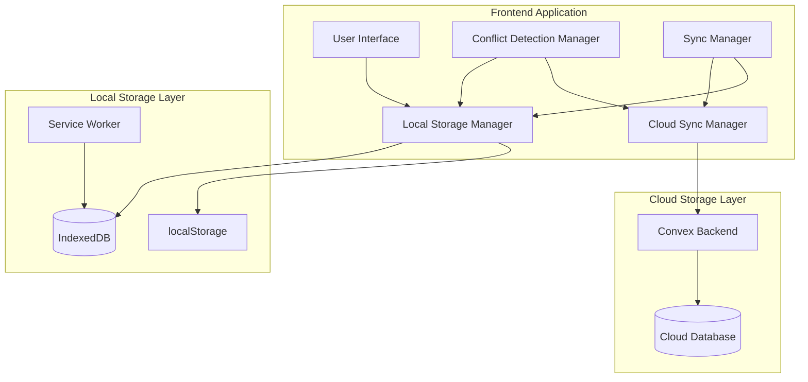
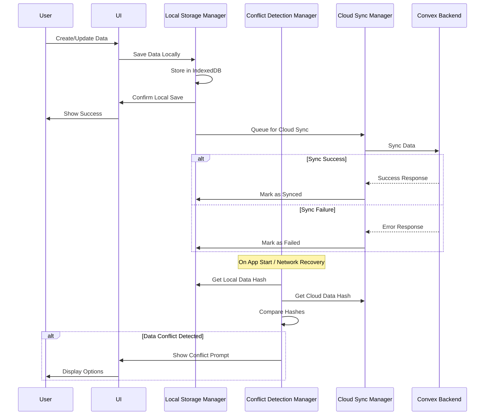
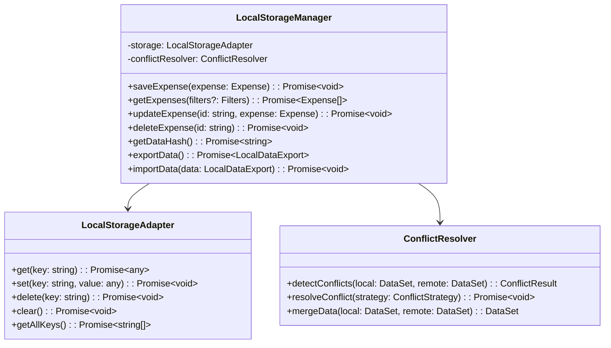
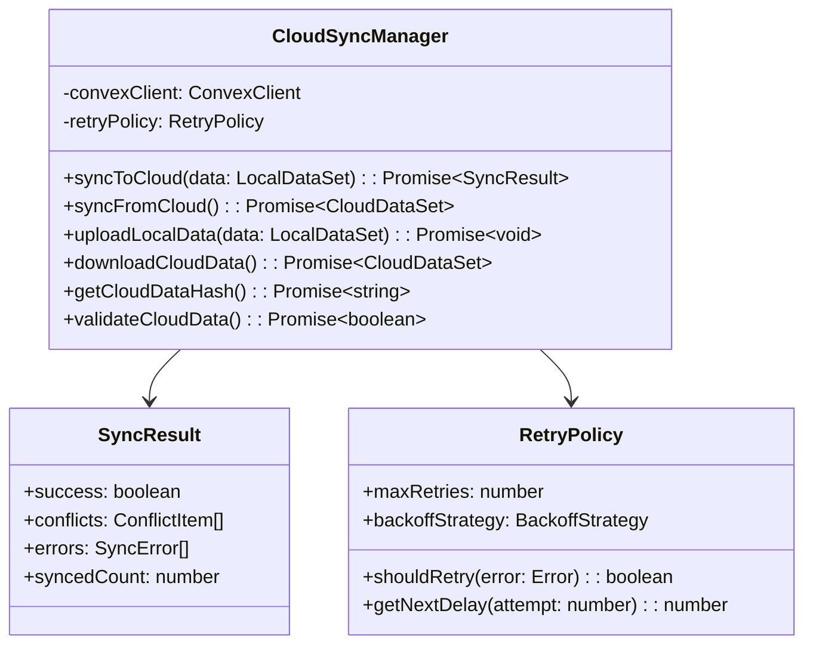
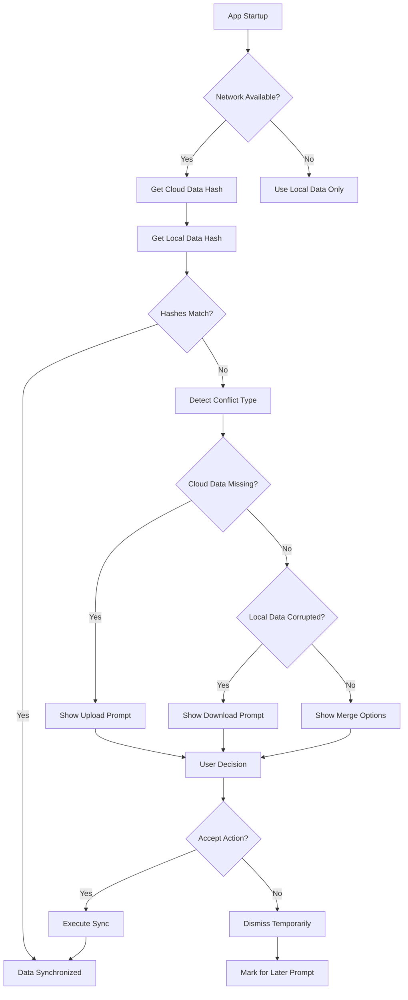
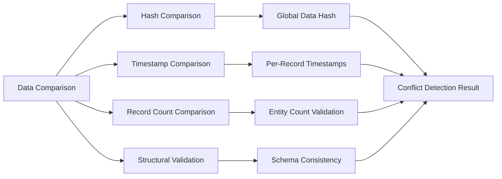
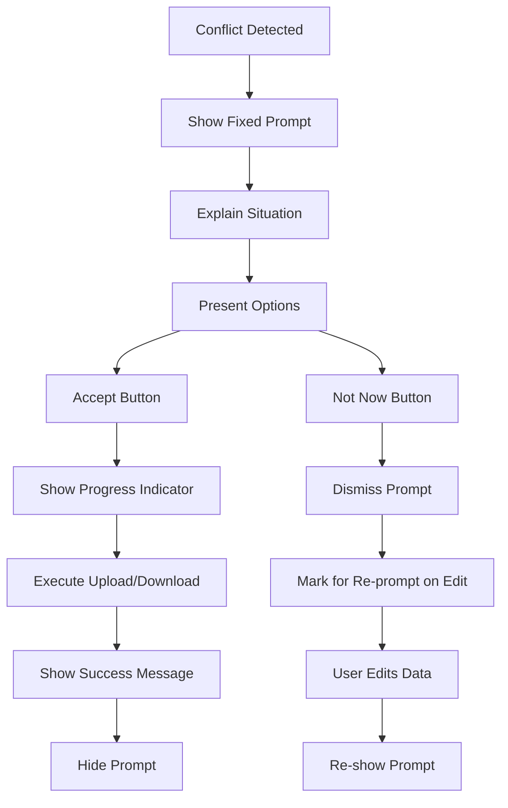
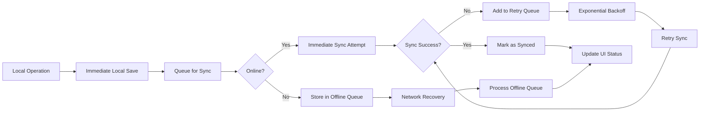

# Local-First Data Storage with Cloud Backup & Conflict Handling

## Overview

This design document outlines the implementation of a local-first data storage system for the Expense Tracker application. The system prioritizes local storage for immediate data access and user experience while maintaining cloud synchronization for backup and multi-device support. The architecture ensures data integrity through intelligent conflict detection and resolution mechanisms.

### Key Principles

- **Local-First**: All data operations occur immediately on local storage
- **Cloud Backup**: Remote storage serves as backup and sync target
- **Offline Resilience**: Full functionality without network connectivity
- **Conflict Resolution**: Intelligent handling of data inconsistencies
- **User Control**: Clear prompts and choices for conflict resolution

## Technology Stack & Dependencies

### Local Storage Technologies
- **IndexedDB**: Primary local database using localforage abstraction
- **Service Worker**: Background sync and cache management
- **localStorage**: Configuration and sync state storage

### Cloud Infrastructure
- **Convex Backend**: Existing real-time database and API layer
- **WebSocket Connection**: Real-time sync capabilities
- **HTTP Fallback**: Reliable sync mechanism for poor connectivity

### Data Synchronization
- **Conflict Detection**: Hash-based data comparison
- **Version Control**: Timestamp and operation-based versioning
- **Queue Management**: Robust offline operation queueing

## Architecture

### System Components



### Data Flow Architecture



## Component Architecture

### Local Storage Manager

The Local Storage Manager serves as the primary interface for all local data operations.



### Cloud Sync Manager

Handles all cloud synchronization operations with robust error handling and retry mechanisms.



### Conflict Detection System

Comprehensive conflict detection using multiple strategies for data integrity.



## Data Models & Storage Schema

### Local Storage Schema

```typescript
interface LocalDataSchema {
  expenses: {
    [id: string]: LocalExpense
  }
  income: {
    [id: string]: LocalIncome
  }
  categories: {
    [id: string]: LocalCategory
  }
  cards: {
    [id: string]: LocalCard
  }
  syncState: {
    lastSync: number
    pendingOperations: PendingOperation[]
    dataHash: string
    conflictResolutions: ConflictResolution[]
  }
  metadata: {
    version: string
    deviceId: string
    userId: string
    createdAt: number
    updatedAt: number
  }
}

interface LocalExpense {
  id: string
  amount: number
  title: string
  category: string[]
  for: string[]
  date: number
  cardId?: string
  createdAt: number
  updatedAt: number
  localId: string
  cloudId?: string
  syncStatus: 'pending' | 'synced' | 'conflict' | 'failed'
  version: number
}

interface PendingOperation {
  id: string
  type: 'create' | 'update' | 'delete'
  entityType: 'expense' | 'income' | 'category' | 'card'
  entityId: string
  data: any
  timestamp: number
  retryCount: number
  status: 'pending' | 'syncing' | 'failed' | 'completed'
}
```

### Cloud Data Mapping

```typescript
interface CloudDataMapping {
  expenses: ConvexExpense[]
  income: ConvexIncome[]
  categories: ConvexCategory[]
  cards: ConvexCard[]
  metadata: {
    dataHash: string
    lastModified: number
    totalRecords: number
  }
}

interface DataSyncState {
  localHash: string
  cloudHash: string
  lastSyncTime: number
  conflictCount: number
  pendingUploads: number
  pendingDownloads: number
}
```

## Conflict Detection & Resolution

### Conflict Detection Strategies



### Conflict Resolution Flow

```typescript
interface ConflictDetectionResult {
  hasConflicts: boolean
  conflictType: 'missing_cloud' | 'corrupted_local' | 'divergent_data' | 'schema_mismatch'
  conflictItems: ConflictItem[]
  recommendedAction: 'upload_local' | 'download_cloud' | 'manual_merge'
  severity: 'low' | 'medium' | 'high' | 'critical'
}

interface ConflictItem {
  entityType: string
  entityId: string
  localVersion: any
  cloudVersion: any
  conflictReason: string
  autoResolvable: boolean
}

interface ConflictResolutionStrategy {
  strategy: 'local_wins' | 'cloud_wins' | 'merge' | 'user_choice'
  applyToAll: boolean
  preserveDeleted: boolean
  mergeRules: MergeRule[]
}
```

## User Experience & Interface Design

### Conflict Prompt Component



### Prompt UI Specifications

```typescript
interface ConflictPromptProps {
  conflictType: ConflictType
  dataStats: {
    localRecords: number
    cloudRecords: number
    lastSync: Date | null
  }
  onAccept: () => Promise<void>
  onDismiss: () => void
  isLoading: boolean
  progress?: number
}

interface ConflictPromptContent {
  title: string
  description: string
  acceptLabel: string
  dismissLabel: string
  icon: IconType
  severity: 'info' | 'warning' | 'error'
}
```

### Prompt Positioning Strategy

The conflict prompt should be positioned consistently above the main UI to maintain visibility:

- **Fixed Position**: Top of screen, below navigation if present
- **Non-Intrusive**: Allows interaction with underlying UI
- **Persistent**: Remains visible until user action
- **Responsive**: Adapts to different screen sizes
- **Accessible**: Proper ARIA labels and keyboard navigation

## State Management Patterns

### Local-First Data Hooks

```typescript
// Core local-first data hook
function useLocalFirstData<T>(
  entityType: EntityType,
  filters?: DataFilters
): LocalFirstDataResult<T> {
  const [data, setData] = useState<T[]>([])
  const [syncStatus, setSyncStatus] = useState<SyncStatus>('idle')
  const [conflicts, setConflicts] = useState<ConflictItem[]>([])
  
  // Always read from local storage first
  const loadLocalData = useCallback(async () => {
    const localData = await localStorageManager.get(entityType, filters)
    setData(localData)
  }, [entityType, filters])
  
  // Background sync with cloud
  const syncWithCloud = useCallback(async () => {
    setSyncStatus('syncing')
    try {
      const result = await cloudSyncManager.sync(entityType, data)
      if (result.conflicts.length > 0) {
        setConflicts(result.conflicts)
      }
      setSyncStatus('synced')
    } catch (error) {
      setSyncStatus('error')
    }
  }, [entityType, data])
  
  return { data, syncStatus, conflicts, loadLocalData, syncWithCloud }
}

// Specific hooks for entities
const useExpenses = (filters?: ExpenseFilters) => 
  useLocalFirstData<Expense>('expenses', filters)

const useIncome = (filters?: IncomeFilters) => 
  useLocalFirstData<Income>('income', filters)
```

### Offline Queue Management

```typescript
interface OfflineQueueManager {
  addOperation(operation: PendingOperation): Promise<void>
  processQueue(): Promise<QueueProcessResult>
  retryFailedOperations(): Promise<void>
  clearCompleted(): Promise<void>
  getQueueStatus(): QueueStatus
}

interface QueueStatus {
  pending: number
  processing: number
  failed: number
  completed: number
  lastProcessed: Date | null
}
```

## API Integration Layer

### Enhanced Convex Integration

```typescript
class LocalFirstConvexClient {
  private localStorageManager: LocalStorageManager
  private cloudSyncManager: CloudSyncManager
  private conflictDetector: ConflictDetector
  
  async createExpense(expense: ExpenseInput): Promise<Expense> {
    // 1. Save locally first
    const localExpense = await this.localStorageManager.saveExpense(expense)
    
    // 2. Queue for cloud sync
    await this.cloudSyncManager.queueOperation({
      type: 'create',
      entityType: 'expense',
      data: expense
    })
    
    // 3. Attempt immediate sync if online
    if (navigator.onLine) {
      this.cloudSyncManager.processQueue()
    }
    
    return localExpense
  }
  
  async getExpenses(filters?: ExpenseFilters): Promise<Expense[]> {
    // Always return local data immediately
    const localExpenses = await this.localStorageManager.getExpenses(filters)
    
    // Background sync if online
    if (navigator.onLine) {
      this.backgroundSync('expenses')
    }
    
    return localExpenses
  }
  
  private async backgroundSync(entityType: string): Promise<void> {
    try {
      const conflicts = await this.conflictDetector.checkForConflicts(entityType)
      if (conflicts.length > 0) {
        this.notifyConflicts(conflicts)
      }
    } catch (error) {
      console.warn('Background sync failed:', error)
    }
  }
}
```

### Sync Optimization Strategies



## Testing Strategy

### Unit Testing Components

```typescript
describe('LocalStorageManager', () => {
  test('should save expense locally first', async () => {
    const expense = createMockExpense()
    await localStorageManager.saveExpense(expense)
    
    const retrieved = await localStorageManager.getExpense(expense.id)
    expect(retrieved).toEqual(expense)
  })
  
  test('should detect data conflicts correctly', async () => {
    const localData = createMockDataSet()
    const cloudData = createDifferentMockDataSet()
    
    const conflicts = await conflictDetector.detectConflicts(localData, cloudData)
    expect(conflicts).toHaveLength(2)
    expect(conflicts[0].conflictType).toBe('divergent_data')
  })
})

describe('ConflictPrompt', () => {
  test('should show correct prompt for missing cloud data', () => {
    render(<ConflictPrompt conflictType="missing_cloud" />)
    expect(screen.getByText(/restore cloud backup/)).toBeInTheDocument()
    expect(screen.getByRole('button', { name: /accept/i })).toBeInTheDocument()
  })
  
  test('should handle user acceptance flow', async () => {
    const onAccept = jest.fn()
    render(<ConflictPrompt onAccept={onAccept} />)
    
    fireEvent.click(screen.getByRole('button', { name: /accept/i }))
    expect(onAccept).toHaveBeenCalled()
  })
})
```

### Integration Testing Scenarios

```typescript
describe('Local-First Data Flow', () => {
  test('should complete full offline-to-online sync cycle', async () => {
    // 1. Go offline
    mockNetworkStatus(false)
    
    // 2. Create expense offline
    const expense = await expenseService.createExpense(mockExpense)
    expect(expense.syncStatus).toBe('pending')
    
    // 3. Go back online
    mockNetworkStatus(true)
    
    // 4. Wait for auto-sync
    await waitFor(() => {
      expect(expense.syncStatus).toBe('synced')
    })
    
    // 5. Verify cloud data
    const cloudExpense = await convexClient.getExpense(expense.cloudId)
    expect(cloudExpense).toMatchObject(expense)
  })
  
  test('should handle conflict resolution flow', async () => {
    // Setup conflicting data
    await setupConflictingData()
    
    // Open app
    render(<App />)
    
    // Should show conflict prompt
    expect(screen.getByTestId('conflict-prompt')).toBeInTheDocument()
    
    // Accept resolution
    fireEvent.click(screen.getByRole('button', { name: /accept/i }))
    
    // Should show progress
    expect(screen.getByTestId('sync-progress')).toBeInTheDocument()
    
    // Should resolve successfully
    await waitFor(() => {
      expect(screen.queryByTestId('conflict-prompt')).not.toBeInTheDocument()
    })
  })
})
```

### Performance Testing

```typescript
describe('Performance Tests', () => {
  test('should handle large datasets efficiently', async () => {
    const largeDataSet = createMockExpenses(10000)
    
    const startTime = performance.now()
    await localStorageManager.saveExpenses(largeDataSet)
    const saveTime = performance.now() - startTime
    
    expect(saveTime).toBeLessThan(1000) // Should save 10k records in under 1s
    
    const retrieveStartTime = performance.now()
    const retrieved = await localStorageManager.getExpenses()
    const retrieveTime = performance.now() - retrieveStartTime
    
    expect(retrieveTime).toBeLessThan(500) // Should retrieve in under 500ms
    expect(retrieved).toHaveLength(10000)
  })
  
  test('should sync efficiently with minimal network requests', async () => {
    const networkSpy = jest.spyOn(convexClient, 'mutation')
    
    // Create 100 expenses offline
    const expenses = await Promise.all(
      Array(100).fill(null).map(() => 
        expenseService.createExpense(createMockExpense())
      )
    )
    
    // Go online and sync
    await syncManager.processQueue()
    
    // Should batch operations efficiently
    expect(networkSpy).toHaveBeenCalledTimes(1) // Single batch request
    expect(networkSpy).toHaveBeenCalledWith(
      expect.objectContaining({
        operations: expect.arrayContaining([
          expect.objectContaining({ type: 'create' })
        ])
      })
    )
  })
})
```

This comprehensive design provides a robust foundation for implementing local-first data storage with intelligent conflict resolution while maintaining the existing user experience and offline capabilities of the Expense Tracker application.
    UI->>User: Show Success
    
    LSM->>CSM: Queue for Cloud Sync
    CSM->>Cloud: Sync Data
    alt Sync Success
        Cloud-->>CSM: Success Response
        CSM->>LSM: Mark as Synced
    else Sync Failure
        Cloud-->>CSM: Error Response
        CSM->>LSM: Mark as Failed
    end
    
    Note over CDM: On App Start / Network Recovery
    CDM->>LSM: Get Local Data Hash
    CDM->>CSM: Get Cloud Data Hash
    CDM->>CDM: Compare Hashes
    alt Data Conflict Detected
        CDM->>UI: Show Conflict Prompt
        UI->>User: Display Options
    end
```

## Component Architecture

### Local Storage Manager

The Local Storage Manager serves as the primary interface for all local data operations.


### Cloud Sync Manager

Handles all cloud synchronization operations with robust error handling and retry mechanisms.


### Conflict Detection System

Comprehensive conflict detection using multiple strategies for data integrity.


## Data Models & Storage Schema

### Local Storage Schema

```typescript
interface LocalDataSchema {
  expenses: {
    [id: string]: LocalExpense
  }
  income: {
    [id: string]: LocalIncome
  }
  categories: {
    [id: string]: LocalCategory
  }
  cards: {
    [id: string]: LocalCard
  }
  syncState: {
    lastSync: number
    pendingOperations: PendingOperation[]
    dataHash: string
    conflictResolutions: ConflictResolution[]
  }
  metadata: {
    version: string
    deviceId: string
    userId: string
    createdAt: number
    updatedAt: number
  }
}

interface LocalExpense {
  id: string
  amount: number
  title: string
  category: string[]
  for: string[]
  date: number
  cardId?: string
  createdAt: number
  updatedAt: number
  localId: string
  cloudId?: string
  syncStatus: 'pending' | 'synced' | 'conflict' | 'failed'
  version: number
}

interface PendingOperation {
  id: string
  type: 'create' | 'update' | 'delete'
  entityType: 'expense' | 'income' | 'category' | 'card'
  entityId: string
  data: any
  timestamp: number
  retryCount: number
  status: 'pending' | 'syncing' | 'failed' | 'completed'
}
```

### Cloud Data Mapping

```typescript
interface CloudDataMapping {
  expenses: ConvexExpense[]
  income: ConvexIncome[]
  categories: ConvexCategory[]
  cards: ConvexCard[]
  metadata: {
    dataHash: string
    lastModified: number
    totalRecords: number
  }
}

interface DataSyncState {
  localHash: string
  cloudHash: string
  lastSyncTime: number
  conflictCount: number
  pendingUploads: number
  pendingDownloads: number
}
```

## Conflict Detection & Resolution

### Conflict Detection Strategies


### Conflict Resolution Flow

```typescript
interface ConflictDetectionResult {
  hasConflicts: boolean
  conflictType: 'missing_cloud' | 'corrupted_local' | 'divergent_data' | 'schema_mismatch'
  conflictItems: ConflictItem[]
  recommendedAction: 'upload_local' | 'download_cloud' | 'manual_merge'
  severity: 'low' | 'medium' | 'high' | 'critical'
}

interface ConflictItem {
  entityType: string
  entityId: string
  localVersion: any
  cloudVersion: any
  conflictReason: string
  autoResolvable: boolean
}

interface ConflictResolutionStrategy {
  strategy: 'local_wins' | 'cloud_wins' | 'merge' | 'user_choice'
  applyToAll: boolean
  preserveDeleted: boolean
  mergeRules: MergeRule[]
}
```

## User Experience & Interface Design

### Conflict Prompt Component


### Prompt UI Specifications

```typescript
interface ConflictPromptProps {
  conflictType: ConflictType
  dataStats: {
    localRecords: number
    cloudRecords: number
    lastSync: Date | null
  }
  onAccept: () => Promise<void>
  onDismiss: () => void
  isLoading: boolean
  progress?: number
}

interface ConflictPromptContent {
  title: string
  description: string
  acceptLabel: string
  dismissLabel: string
  icon: IconType
  severity: 'info' | 'warning' | 'error'
}
```

### Prompt Positioning Strategy

The conflict prompt should be positioned consistently above the main UI to maintain visibility:

- **Fixed Position**: Top of screen, below navigation if present
- **Non-Intrusive**: Allows interaction with underlying UI
- **Persistent**: Remains visible until user action
- **Responsive**: Adapts to different screen sizes
- **Accessible**: Proper ARIA labels and keyboard navigation

## State Management Patterns

### Local-First Data Hooks

```typescript
// Core local-first data hook
function useLocalFirstData<T>(
  entityType: EntityType,
  filters?: DataFilters
): LocalFirstDataResult<T> {
  const [data, setData] = useState<T[]>([])
  const [syncStatus, setSyncStatus] = useState<SyncStatus>('idle')
  const [conflicts, setConflicts] = useState<ConflictItem[]>([])
  
  // Always read from local storage first
  const loadLocalData = useCallback(async () => {
    const localData = await localStorageManager.get(entityType, filters)
    setData(localData)
  }, [entityType, filters])
  
  // Background sync with cloud
  const syncWithCloud = useCallback(async () => {
    setSyncStatus('syncing')
    try {
      const result = await cloudSyncManager.sync(entityType, data)
      if (result.conflicts.length > 0) {
        setConflicts(result.conflicts)
      }
      setSyncStatus('synced')
    } catch (error) {
      setSyncStatus('error')
    }
  }, [entityType, data])
  
  return { data, syncStatus, conflicts, loadLocalData, syncWithCloud }
}

// Specific hooks for entities
const useExpenses = (filters?: ExpenseFilters) => 
  useLocalFirstData<Expense>('expenses', filters)

const useIncome = (filters?: IncomeFilters) => 
  useLocalFirstData<Income>('income', filters)
```

### Offline Queue Management

```typescript
interface OfflineQueueManager {
  addOperation(operation: PendingOperation): Promise<void>
  processQueue(): Promise<QueueProcessResult>
  retryFailedOperations(): Promise<void>
  clearCompleted(): Promise<void>
  getQueueStatus(): QueueStatus
}

interface QueueStatus {
  pending: number
  processing: number
  failed: number
  completed: number
  lastProcessed: Date | null
}
```

## API Integration Layer

### Enhanced Convex Integration

```typescript
class LocalFirstConvexClient {
  private localStorageManager: LocalStorageManager
  private cloudSyncManager: CloudSyncManager
  private conflictDetector: ConflictDetector
  
  async createExpense(expense: ExpenseInput): Promise<Expense> {
    // 1. Save locally first
    const localExpense = await this.localStorageManager.saveExpense(expense)
    
    // 2. Queue for cloud sync
    await this.cloudSyncManager.queueOperation({
      type: 'create',
      entityType: 'expense',
      data: expense
    })
    
    // 3. Attempt immediate sync if online
    if (navigator.onLine) {
      this.cloudSyncManager.processQueue()
    }
    
    return localExpense
  }
  
  async getExpenses(filters?: ExpenseFilters): Promise<Expense[]> {
    // Always return local data immediately
    const localExpenses = await this.localStorageManager.getExpenses(filters)
    
    // Background sync if online
    if (navigator.onLine) {
      this.backgroundSync('expenses')
    }
    
    return localExpenses
  }
  
  private async backgroundSync(entityType: string): Promise<void> {
    try {
      const conflicts = await this.conflictDetector.checkForConflicts(entityType)
      if (conflicts.length > 0) {
        this.notifyConflicts(conflicts)
      }
    } catch (error) {
      console.warn('Background sync failed:', error)
    }
  }
}
```

### Sync Optimization Strategies


## Testing Strategy

### Unit Testing Components

```typescript
describe('LocalStorageManager', () => {
  test('should save expense locally first', async () => {
    const expense = createMockExpense()
    await localStorageManager.saveExpense(expense)
    
    const retrieved = await localStorageManager.getExpense(expense.id)
    expect(retrieved).toEqual(expense)
  })
  
  test('should detect data conflicts correctly', async () => {
    const localData = createMockDataSet()
    const cloudData = createDifferentMockDataSet()
    
    const conflicts = await conflictDetector.detectConflicts(localData, cloudData)
    expect(conflicts).toHaveLength(2)
    expect(conflicts[0].conflictType).toBe('divergent_data')
  })
})

describe('ConflictPrompt', () => {
  test('should show correct prompt for missing cloud data', () => {
    render(<ConflictPrompt conflictType="missing_cloud" />)
    expect(screen.getByText(/restore cloud backup/)).toBeInTheDocument()
    expect(screen.getByRole('button', { name: /accept/i })).toBeInTheDocument()
  })
  
  test('should handle user acceptance flow', async () => {
    const onAccept = jest.fn()
    render(<ConflictPrompt onAccept={onAccept} />)
    
    fireEvent.click(screen.getByRole('button', { name: /accept/i }))
    expect(onAccept).toHaveBeenCalled()
  })
})
```

### Integration Testing Scenarios

```typescript
describe('Local-First Data Flow', () => {
  test('should complete full offline-to-online sync cycle', async () => {
    // 1. Go offline
    mockNetworkStatus(false)
    
    // 2. Create expense offline
    const expense = await expenseService.createExpense(mockExpense)
    expect(expense.syncStatus).toBe('pending')
    
    // 3. Go back online
    mockNetworkStatus(true)
    
    // 4. Wait for auto-sync
    await waitFor(() => {
      expect(expense.syncStatus).toBe('synced')
    })
    
    // 5. Verify cloud data
    const cloudExpense = await convexClient.getExpense(expense.cloudId)
    expect(cloudExpense).toMatchObject(expense)
  })
  
  test('should handle conflict resolution flow', async () => {
    // Setup conflicting data
    await setupConflictingData()
    
    // Open app
    render(<App />)
    
    // Should show conflict prompt
    expect(screen.getByTestId('conflict-prompt')).toBeInTheDocument()
    
    // Accept resolution
    fireEvent.click(screen.getByRole('button', { name: /accept/i }))
    
    // Should show progress
    expect(screen.getByTestId('sync-progress')).toBeInTheDocument()
    
    // Should resolve successfully
    await waitFor(() => {
      expect(screen.queryByTestId('conflict-prompt')).not.toBeInTheDocument()
    })
  })
})
```

### Performance Testing

```typescript
describe('Performance Tests', () => {
  test('should handle large datasets efficiently', async () => {
    const largeDataSet = createMockExpenses(10000)
    
    const startTime = performance.now()
    await localStorageManager.saveExpenses(largeDataSet)
    const saveTime = performance.now() - startTime
    
    expect(saveTime).toBeLessThan(1000) // Should save 10k records in under 1s
    
    const retrieveStartTime = performance.now()
    const retrieved = await localStorageManager.getExpenses()
    const retrieveTime = performance.now() - retrieveStartTime
    
    expect(retrieveTime).toBeLessThan(500) // Should retrieve in under 500ms
    expect(retrieved).toHaveLength(10000)
  })
  
  test('should sync efficiently with minimal network requests', async () => {
    const networkSpy = jest.spyOn(convexClient, 'mutation')
    
    // Create 100 expenses offline
    const expenses = await Promise.all(
      Array(100).fill(null).map(() => 
        expenseService.createExpense(createMockExpense())
      )
    )
    
    // Go online and sync
    await syncManager.processQueue()
    
    // Should batch operations efficiently
    expect(networkSpy).toHaveBeenCalledTimes(1) // Single batch request
    expect(networkSpy).toHaveBeenCalledWith(
      expect.objectContaining({
        operations: expect.arrayContaining([
          expect.objectContaining({ type: 'create' })
        ])
      })
    )
  })
})
```

This comprehensive design provides a robust foundation for implementing local-first data storage with intelligent conflict resolution while maintaining the existing user experience and offline capabilities of the Expense Tracker application.
