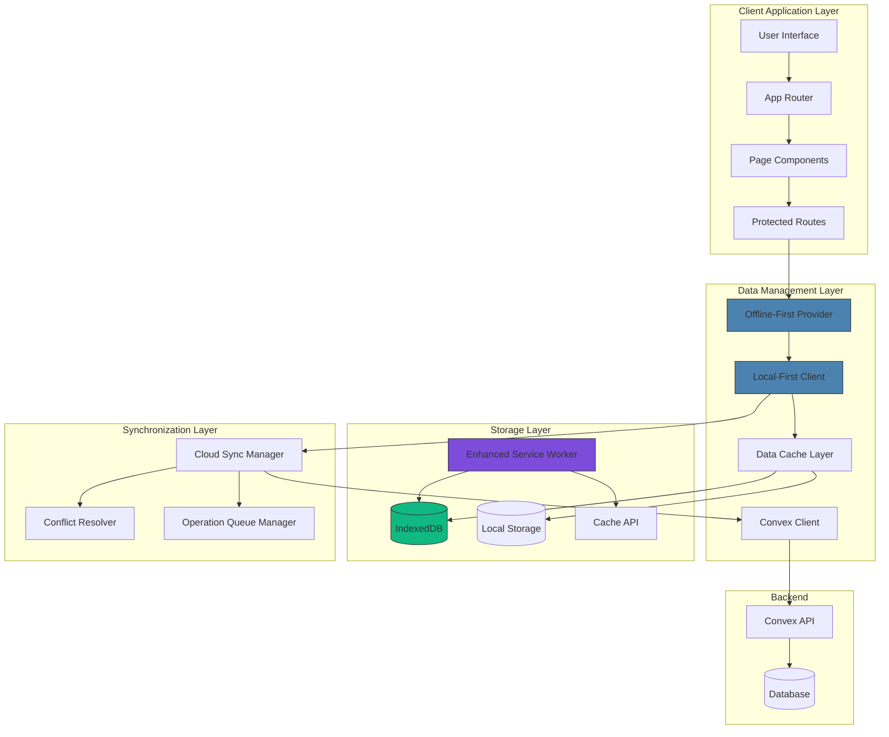

# Offline Mode Refactor for Native-Like Experience

## Overview

This design document outlines the comprehensive refactoring of the Expense Tracker application's offline capabilities to deliver a seamless, native-like user experience. The refactor addresses critical issues where the app cannot launch offline and fails to display local data during navigation, transforming it into a truly offline-first application.

## Current State Analysis

### Existing Architecture
The application currently implements a basic offline architecture with:
- **Service Worker**: Basic caching with `sw.js` for static assets
- **LocalStorageManager**: IndexedDB wrapper for local data storage
- **OfflineContext**: React context for offline state management
- **CloudSyncManager**: Background synchronization with Convex backend
- **LocalFirstConvexClient**: Abstraction layer for local-first operations

### Current Issues
1. **App Inaccessibility**: Application fails to launch without internet connection
2. **Empty Navigation**: Pages load but display no data from local storage
3. **Incomplete Offline Flow**: Users cannot fully interact with the app offline
4. **Poor User Feedback**: Limited indication of offline capabilities
5. **Service Worker Limitations**: Basic caching doesn't cover all necessary resources

## Architecture Overview



## Core Components Refactor

### 1. Enhanced Service Worker

**Current Limitations:**
- Basic static asset caching
- No dynamic route handling
- Limited offline fallback strategy

**Enhanced Implementation:**
```javascript
// Enhanced Service Worker Strategy
const CACHE_VERSION = 'expense-tracker-v3';
const DYNAMIC_CACHE = 'dynamic-v3';
const OFFLINE_PAGE = '/offline';

// Pre-cache essential resources
const ESSENTIAL_CACHE = [
  '/',
  '/dashboard',
  '/expenses', 
  '/income',
  '/settings',
  '/offline',
  '/manifest.json',
  // Critical CSS and JS bundles
  ...staticAssets
];

// Network-first with offline fallback strategy
self.addEventListener('fetch', (event) => {
  if (event.request.method !== 'GET') return;
  
  // Handle navigation requests
  if (event.request.mode === 'navigate') {
    event.respondWith(
      networkFirstWithOfflineFallback(event.request)
    );
    return;
  }
  
  // Handle API requests
  if (event.request.url.includes('/api/')) {
    event.respondWith(
      cacheFirstWithNetworkUpdate(event.request)
    );
    return;
  }
  
  // Handle static assets
  event.respondWith(
    cacheFirstStrategy(event.request)
  );
});

async function networkFirstWithOfflineFallback(request) {
  try {
    const response = await fetch(request);
    if (response.ok) {
      const cache = await caches.open(DYNAMIC_CACHE);
      cache.put(request, response.clone());
      return response;
    }
  } catch (error) {
    console.log('Network request failed, serving from cache');
  }
  
  // Serve from cache or offline page
  const cachedResponse = await caches.match(request);
  if (cachedResponse) return cachedResponse;
  
  // Serve appropriate offline page based on route
  if (request.url.includes('/dashboard')) {
    return caches.match('/dashboard') || caches.match('/offline');
  }
  if (request.url.includes('/expenses')) {
    return caches.match('/expenses') || caches.match('/offline');
  }
  
  return caches.match('/offline') || new Response('Offline', { status: 503 });
}
```

### 2. Offline-First Data Provider

**Architecture Pattern:**
- Replace dependency on network connectivity for data operations
- Implement immediate local data serving
- Background synchronization when online

```typescript
interface OfflineFirstProviderInterface {
  // Core data operations always work offline
  getExpenses(filters?: DataFilters): Promise<LocalExpense[]>;
  createExpense(expense: ExpenseData): Promise<LocalExpense>;
  updateExpense(id: string, updates: Partial<LocalExpense>): Promise<LocalExpense>;
  deleteExpense(id: string): Promise<boolean>;
  
  // Sync management
  syncWhenOnline(): Promise<void>;
  getSyncStatus(): SyncStatus;
  
  // Offline indicators
  isOffline: boolean;
  pendingOperationsCount: number;
  lastSyncTime: Date | null;
}
```

### 3. Enhanced Local Storage Strategy

**Data Architecture:**
```typescript
interface LocalDataSchema {
  version: string;
  user: {
    id: string;
    preferences: UserSettings;
    lastLogin: number;
  };
  entities: {
    expenses: Record<string, LocalExpense>;
    income: Record<string, LocalIncome>;
    categories: Record<string, LocalCategory>;
    cards: Record<string, LocalCard>;
  };
  sync: {
    pendingOperations: PendingOperation[];
    lastSync: number;
    conflicts: ConflictItem[];
  };
  cache: {
    aggregatedData: MonthlyAggregates;
    chartData: ChartDataCache;
    lastCalculated: number;
  };
}
```

### 4. Route-Level Data Loading

**Protected Route Enhancement:**
```typescript
function OfflineCapableProtectedRoute({ children }: { children: ReactNode }) {
  const { user, loading } = useAuth();
  const { isInitialized, localData } = useOfflineFirst();
  const router = useRouter();

  // Allow offline access if user data exists locally
  useEffect(() => {
    if (!loading && !user && !localData?.user) {
      router.replace("/login");
      return;
    }
    
    // If offline but has local user data, allow access
    if (!user && localData?.user && !navigator.onLine) {
      // Continue with local data
      return;
    }
  }, [user, loading, localData, router]);

  if (loading && !isInitialized) {
    return <LoadingScreen />;
  }

  // Render with either cloud user or local user data
  return <>{children}</>;
}
```

## Page Component Refactoring

### 1. Expenses Page Enhancement

**Current Issues:**
- Depends on Convex queries that fail offline
- No local data fallback
- Cannot function without network

**Enhanced Implementation:**
```typescript
function OfflineCapableExpensesPage() {
  const { isOnline } = useOfflineFirst();
  const { 
    expenses, 
    createExpense, 
    updateExpense, 
    deleteExpense,
    isLoading,
    syncStatus 
  } = useLocalFirstExpenses();
  
  const {
    cards,
    categories,
    forValues
  } = useLocalFirstMetadata();

  // Form submission works regardless of online status
  const handleSubmit = async (formData: ExpenseFormData) => {
    try {
      // Always save locally first
      const expense = await createExpense(formData);
      toast.success(isOnline ? "Expense added" : "Expense saved offline");
      
      // Background sync if online
      if (isOnline) {
        // Sync will happen automatically in background
      }
    } catch (error) {
      toast.error("Failed to save expense");
    }
  };

  return (
    <div className="min-h-screen bg-white">
      {/* Offline indicator */}
      {!isOnline && <OfflineBanner />}
      
      {/* Form always works */}
      <ExpenseForm 
        onSubmit={handleSubmit}
        cards={cards}
        categories={categories}
        forValues={forValues}
      />
      
      {/* List shows local data */}
      <ExpensesList 
        expenses={expenses}
        onEdit={updateExpense}
        onDelete={deleteExpense}
        syncStatus={syncStatus}
      />
    </div>
  );
}
```

### 2. Dashboard Page Enhancement

**Local Data Aggregation:**
```typescript
function OfflineCapableDashboard() {
  const { 
    monthlyData, 
    chartData, 
    isLoading 
  } = useLocalFirstDashboard();
  
  // Data is calculated from local storage
  const aggregatedData = useMemo(() => {
    return calculateMonthlyAggregates(monthlyData);
  }, [monthlyData]);

  return (
    <div className="min-h-screen bg-gray-50">
      {/* Summary cards with local data */}
      <SummaryCards data={aggregatedData} />
      
      {/* Charts render with local data */}
      <CategoryBreakdownChart data={chartData.categoryBreakdown} />
      <DailySpendingChart data={chartData.dailySpending} />
    </div>
  );
}
```

## Data Flow Architecture

### 1. Local-First Data Hooks

```typescript
function useLocalFirstExpenses(filters?: DataFilters) {
  const [data, setData] = useState<LocalExpense[]>([]);
  const [syncStatus, setSyncStatus] = useState<SyncStatus>('synced');
  const { localStorageManager } = useOfflineFirst();

  // Always load from local storage first
  useEffect(() => {
    const loadLocalData = async () => {
      try {
        const expenses = await localStorageManager.getExpenses(filters);
        setData(expenses);
      } catch (error) {
        console.error('Failed to load local expenses:', error);
      }
    };
    
    loadLocalData();
  }, [filters, localStorageManager]);

  const createExpense = useCallback(async (expenseData: ExpenseCreationData) => {
    // Save locally immediately
    const newExpense = await localStorageManager.saveExpense(expenseData);
    setData(prev => [newExpense, ...prev]);
    
    // Queue for sync
    await queueSyncOperation('create', 'expenses', newExpense.id, expenseData);
    
    return newExpense;
  }, [localStorageManager]);

  return {
    data,
    createExpense,
    updateExpense,
    deleteExpense,
    syncStatus,
    isLoading: false // Local data loads instantly
  };
}
```

### 2. Background Synchronization

```typescript
function useBackgroundSync() {
  const { cloudSyncManager, isOnline } = useOfflineFirst();
  
  useEffect(() => {
    if (!isOnline) return;
    
    const syncInterval = setInterval(async () => {
      try {
        await cloudSyncManager.processQueue();
      } catch (error) {
        console.error('Background sync failed:', error);
      }
    }, 30000); // Sync every 30 seconds when online
    
    return () => clearInterval(syncInterval);
  }, [isOnline, cloudSyncManager]);
  
  // Immediate sync when coming back online
  useEffect(() => {
    if (isOnline) {
      cloudSyncManager.processQueue();
    }
  }, [isOnline, cloudSyncManager]);
}
```

## User Experience Enhancements

### 1. Offline Indicators

**Subtle Status Indicators:**
```typescript
function NetworkStatusIndicator() {
  const { isOnline, pendingOperationsCount } = useOfflineFirst();
  
  if (isOnline && pendingOperationsCount === 0) {
    return null; // No indicator when fully synced
  }
  
  return (
    <div className="fixed top-4 left-4 z-50">
      {!isOnline ? (
        <div className="flex items-center bg-gray-800 text-white px-3 py-1 rounded-full text-sm">
          <WifiOff className="w-4 h-4 mr-2" />
          Offline
        </div>
      ) : pendingOperationsCount > 0 ? (
        <div className="flex items-center bg-blue-600 text-white px-3 py-1 rounded-full text-sm">
          <Sync className="w-4 h-4 mr-2 animate-spin" />
          Syncing {pendingOperationsCount}
        </div>
      ) : null}
    </div>
  );
}
```

### 2. Progressive Data Loading

**Immediate Local Data with Background Updates:**
```typescript
function useProgressiveDataLoading<T>(
  localLoader: () => Promise<T[]>,
  cloudLoader: () => Promise<T[]>
) {
  const [data, setData] = useState<T[]>([]);
  const [isLoading, setIsLoading] = useState(true);
  const [hasCloudData, setHasCloudData] = useState(false);
  
  useEffect(() => {
    // Load local data immediately
    localLoader().then(localData => {
      setData(localData);
      setIsLoading(false);
    });
    
    // Load cloud data in background if online
    if (navigator.onLine) {
      cloudLoader().then(cloudData => {
        setData(cloudData);
        setHasCloudData(true);
      }).catch(() => {
        // Cloud loading failed, keep local data
      });
    }
  }, []);
  
  return { data, isLoading, hasCloudData };
}
```

## Performance Optimizations

### 1. Intelligent Caching Strategy

**Multi-Level Cache Architecture:**
```typescript
interface CacheStrategy {
  // Level 1: Memory cache for immediate access
  memoryCache: Map<string, CachedData>;
  
  // Level 2: IndexedDB for persistent storage
  persistentCache: LocalStorageManager;
  
  // Level 3: Service Worker cache for static assets
  serviceWorkerCache: CacheStorage;
}

class PerformanceOptimizer {
  private cacheStrategy: CacheStrategy;
  
  async getOptimizedData<T>(
    key: string,
    loader: () => Promise<T>,
    ttl: number = 300000 // 5 minutes
  ): Promise<T> {
    // Check memory cache first
    const cached = this.cacheStrategy.memoryCache.get(key);
    if (cached && Date.now() - cached.timestamp < ttl) {
      return cached.data;
    }
    
    // Check IndexedDB
    const persistent = await this.cacheStrategy.persistentCache.getCachedData(key);
    if (persistent && Date.now() - persistent.timestamp < ttl) {
      // Update memory cache
      this.cacheStrategy.memoryCache.set(key, persistent);
      return persistent.data;
    }
    
    // Load fresh data
    const freshData = await loader();
    
    // Update all cache levels
    const cacheEntry = { data: freshData, timestamp: Date.now() };
    this.cacheStrategy.memoryCache.set(key, cacheEntry);
    await this.cacheStrategy.persistentCache.setCachedData(key, cacheEntry);
    
    return freshData;
  }
}
```

### 2. Lazy Loading and Code Splitting

**Route-Based Code Splitting:**
```typescript
// Dynamic imports for offline capability
const DashboardPage = lazy(() => 
  import('./dashboard/page').then(module => ({
    default: withOfflineSupport(module.default)
  }))
);

const ExpensesPage = lazy(() => 
  import('./expenses/page').then(module => ({
    default: withOfflineSupport(module.default)
  }))
);

function withOfflineSupport<T extends ComponentType<any>>(Component: T): T {
  return function OfflineCapableComponent(props: any) {
    const { isInitialized } = useOfflineFirst();
    
    if (!isInitialized) {
      return <LocalDataLoader />;
    }
    
    return <Component {...props} />;
  } as T;
}
```

## Implementation Strategy

### Phase 1: Core Infrastructure (Week 1-2)
1. **Enhanced Service Worker**
   - Implement comprehensive caching strategy
   - Add offline page fallbacks
   - Enable dynamic route handling

2. **Local Storage Enhancement**
   - Upgrade data schema
   - Implement performance optimizations
   - Add data migration utilities

### Phase 2: Data Layer Refactor (Week 2-3)
1. **Local-First Hooks**
   - Replace Convex-dependent hooks
   - Implement local data loaders
   - Add background sync capabilities

2. **Offline-First Provider**
   - Centralize offline state management
   - Implement conflict resolution
   - Add sync queue management

### Phase 3: UI Component Updates (Week 3-4)
1. **Page Component Refactoring**
   - Update all major pages for offline support
   - Implement progressive data loading
   - Add offline indicators

2. **User Experience Enhancements**
   - Subtle offline status indicators
   - Optimistic UI updates
   - Error boundary improvements

### Phase 4: Testing and Optimization (Week 4-5)
1. **Offline Testing**
   - Comprehensive offline scenario testing
   - Performance optimization
   - Edge case handling

2. **Progressive Web App Enhancements**
   - App install prompts
   - Background sync capabilities
   - Push notification setup

## Acceptance Criteria Validation

### 1. App Accessibility Offline ✅
- Application launches and functions without internet connection
- All essential pages load and display cached data
- Users can navigate between screens seamlessly

### 2. Local Data Reading ✅
- All user data displayed from local storage when offline
- UI shows most recent synced data immediately
- No loading delays for local data access

### 3. Seamless Navigation ✅
- Navigation works smoothly between all pages offline
- Each screen displays relevant local data instantly
- No error states during offline navigation

### 4. User Actions While Offline ✅
- Users can add, edit, and delete records offline
- All actions stored locally and queued for sync
- Optimistic UI updates provide immediate feedback

### 5. User Feedback ✅
- Subtle offline indicators without blocking usage
- Clear sync status communication
- No disruptive error messages when offline

### 6. Performance ✅
- Offline experience feels fast and fluid
- Native-like responsiveness and interactions
- Efficient local data operations

## Monitoring and Analytics

### Offline Usage Metrics
```typescript
interface OfflineMetrics {
  offlineSessionDuration: number;
  offlineActionsPerformed: number;
  syncSuccessRate: number;
  syncConflictFrequency: number;
  localDataCacheHitRate: number;
  pageLoadTimeOffline: number;
}

function trackOfflineUsage(metrics: OfflineMetrics) {
  // Track offline usage patterns
  // Monitor performance metrics
  // Identify improvement opportunities
}
```

This comprehensive refactor transforms the Expense Tracker into a truly offline-capable application that provides a seamless, native-like experience regardless of network connectivity. The architecture prioritizes local data access while maintaining robust cloud synchronization capabilities, ensuring users can always access and interact with their financial data.