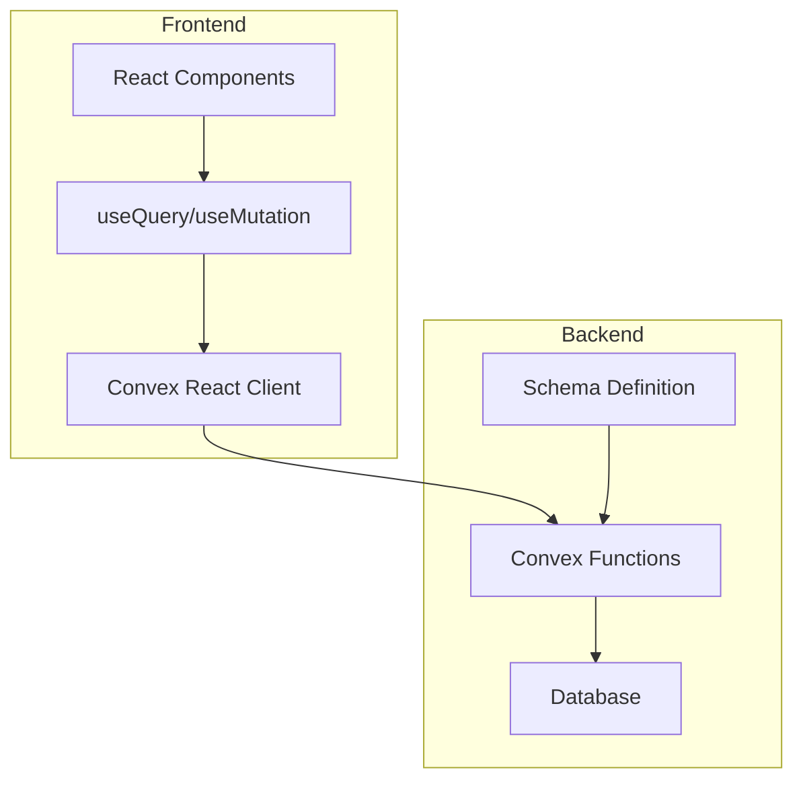
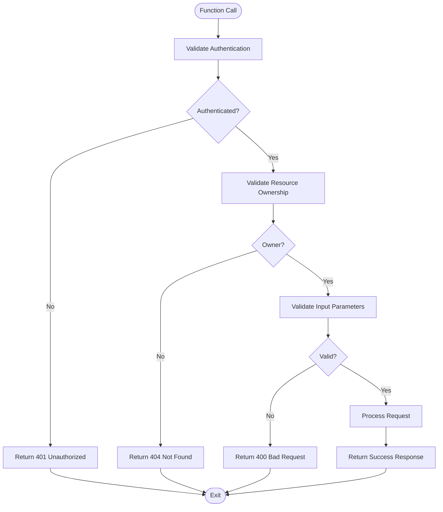

# API Reference

<cite>
**Referenced Files in This Document**   
- [auth.ts](file://convex/auth.ts)
- [expenses.ts](file://convex/expenses.ts)
- [userSettings.ts](file://convex/userSettings.ts)
- [cardsAndIncome.ts](file://convex/cardsAndIncome.ts)
- [schema.ts](file://convex/schema.ts)
- [api.d.ts](file://convex/_generated/api.d.ts)
- [expenses/page.tsx](file://src/app/expenses/page.tsx)
- [settings/page.tsx](file://src/app/settings/page.tsx)
- [income/page.tsx](file://src/app/income/page.tsx)
- [income/edit/[id]/page.tsx](file://src/app/income/edit/[id]/page.tsx)
</cite>

## Table of Contents
1. [Introduction](#introduction)
2. [Project Structure](#project-structure)
3. [Authentication Module](#authentication-module)
4. [Expenses Module](#expenses-module)
5. [User Settings Module](#user-settings-module)
6. [Cards and Income Module](#cards-and-income-module)
7. [Type-Safe API Access](#type-safe-api-access)
8. [Error Handling and Validation](#error-handling-and-validation)
9. [Security Considerations](#security-considerations)
10. [API Usage Examples](#api-usage-examples)

## Introduction
This document provides comprehensive RESTful API documentation for the Convex backend functions used in the Expense Tracker application. The API is organized into modules including authentication, expenses, user settings, and cards & income. Each endpoint is documented with function signatures, parameters, return values, authentication requirements, and usage examples. The system leverages Convex's type-safe API generation to provide auto-completion and compile-time type checking.

## Project Structure
The application follows a modular architecture with clear separation between frontend and backend components. Backend functions are implemented in the `convex/` directory, while frontend components reside in `src/`. The Convex framework enables direct function calls from React components using `useQuery` and `useMutation` hooks.



**Diagram sources**
- [schema.ts](file://convex/schema.ts#L1-L62)
- [auth.ts](file://convex/auth.ts#L1-L131)

**Section sources**
- [schema.ts](file://convex/schema.ts#L1-L62)
- [auth.ts](file://convex/auth.ts#L1-L131)

## Authentication Module

### login
Authenticates a user with username and password credentials.

**Function Signature**
```typescript
login(args: { username: string; password: string }): Promise<{ userId: Id<"users">; token: string }>
```

**Parameters**
- `username`: string - User's username
- `password`: string - User's password (plaintext, hashed server-side)

**Return Value**
- Object containing `userId` and authentication `token`

**Authentication Context**
- None required (public mutation)

**Error Responses**
- `401 Unauthorized`: Invalid username or password
- `ConvexError`: "Invalid username or password"

**Validation Rules**
- Username must exist in database
- Password must match hashed value stored in database

**Section sources**
- [auth.ts](file://convex/auth.ts#L65-L93)

### register
Creates a new user account with username and password.

**Function Signature**
```typescript
register(args: { username: string; password: string }): Promise<{ userId: Id<"users">; token: string }>
```

**Parameters**
- `username`: string - Desired username (must be unique)
- `password`: string - User's password

**Return Value**
- Object containing `userId` and authentication `token`

**Authentication Context**
- None required (public mutation)

**Error Responses**
- `409 Conflict`: Username already exists
- `ConvexError`: "Username already exists"

**Validation Rules**
- Username must be unique
- Password is hashed using salted algorithm before storage

**Section sources**
- [auth.ts](file://convex/auth.ts#L40-L63)

### getCurrentUser
Retrieves current user information using authentication token.

**Function Signature**
```typescript
getCurrentUser(args: { token: string }): Promise<{ _id: Id<"users">; username: string } | null>
```

**Parameters**
- `token`: string - Authentication token from login/register

**Return Value**
- User object with `_id` and `username`, or `null` if invalid token

**Authentication Context**
- Token-based authentication required

**Error Responses**
- Returns `null` for invalid or expired tokens

**Validation Rules**
- Token must match stored `tokenIdentifier` in users table

**Section sources**
- [auth.ts](file://convex/auth.ts#L95-L115)

### logout
Invalidates the current user's authentication token.

**Function Signature**
```typescript
logout(args: { token: string }): Promise<{ success: boolean }>
```

**Parameters**
- `token`: string - Current authentication token

**Return Value**
- `{ success: true }` on successful logout

**Authentication Context**
- Token-based authentication required

**Error Responses**
- None (fails silently if token is invalid)

**Validation Rules**
- Token is invalidated by updating `tokenIdentifier` with a new random value

**Section sources**
- [auth.ts](file://convex/auth.ts#L117-L131)

## Expenses Module

### createExpense
Creates a new expense record for the authenticated user.

**Function Signature**
```typescript
createExpense(args: {
  token: string;
  amount: number;
  title: string;
  category: string[];
  for: string[];
  date: number;
  cardId?: Id<"cards">;
}): Promise<Id<"expenses">>
```

**Parameters**
- `token`: string - Authentication token
- `amount`: number - Expense amount (positive value)
- `title`: string - Description of expense
- `category`: string[] - Array of category names
- `for`: string[] - Array of "for" values (e.g., people, purposes)
- `date`: number - Unix timestamp of expense date
- `cardId`: Id<"cards"> | undefined - Optional card reference

**Return Value**
- `Id<"expenses">` - Database ID of created expense

**Authentication Context**
- Token-based authentication required

**Error Responses**
- `401 Unauthorized`: Authentication required
- `ConvexError`: "Authentication required"

**Validation Rules**
- Amount must be a positive number
- Title and at least one category are required
- Expense is associated with authenticated user
- Categories and "for" values are automatically created if they don't exist

**Section sources**
- [expenses.ts](file://convex/expenses.ts#L20-L79)

### getExpenses
Retrieves all expenses for the authenticated user, optionally filtered by month/year.

**Function Signature**
```typescript
getExpenses(args: {
  token: string;
  month?: number;
  year?: number;
}): Promise<Doc<"expenses">[]>
```

**Parameters**
- `token`: string - Authentication token
- `month`: number | undefined - Month (1-12) for filtering
- `year`: number | undefined - Year for filtering

**Return Value**
- Array of expense documents matching criteria

**Authentication Context**
- Token-based authentication required

**Error Responses**
- `401 Unauthorized`: Authentication required
- `ConvexError`: "Authentication required"

**Validation Rules**
- Only returns expenses belonging to authenticated user
- When month/year provided, filters to that calendar month
- Date range is calculated from first to last day of specified month

**Section sources**
- [expenses.ts](file://convex/expenses.ts#L81-L114)

### updateExpense
Updates an existing expense record.

**Function Signature**
```typescript
updateExpense(args: {
  token: string;
  expenseId: Id<"expenses">;
  amount: number;
  title: string;
  category: string[];
  for: string[];
  date: number;
  cardId?: Id<"cards">;
}): Promise<{ success: boolean }>
```

**Parameters**
- `token`: string - Authentication token
- `expenseId`: Id<"expenses"> - ID of expense to update
- `amount`: number - New amount value
- `title`: string - New title
- `category`: string[] - New array of categories
- `for`: string[] - New array of "for" values
- `date`: number - New date (Unix timestamp)
- `cardId`: Id<"cards"> | undefined - New card reference

**Return Value**
- `{ success: true }` on successful update

**Authentication Context**
- Token-based authentication required

**Error Responses**
- `401 Unauthorized`: Authentication required
- `404 Not Found`: Expense not found or not authorized
- `ConvexError`: "Expense not found or not authorized"

**Validation Rules**
- User must own the expense being updated
- All fields are validated similarly to createExpense
- Related categories and "for" values are created if new ones are provided

**Section sources**
- [expenses.ts](file://convex/expenses.ts#L116-L174)

### deleteExpense
Deletes an existing expense record.

**Function Signature**
```typescript
deleteExpense(args: {
  token: string;
  expenseId: Id<"expenses">;
}): Promise<{ success: boolean }>
```

**Parameters**
- `token`: string - Authentication token
- `expenseId`: Id<"expenses"> - ID of expense to delete

**Return Value**
- `{ success: true }` on successful deletion

**Authentication Context**
- Token-based authentication required

**Error Responses**
- `401 Unauthorized`: Authentication required
- `404 Not Found`: Expense not found
- `ConvexError`: "Expense not found" or "You are not authorized to delete this expense"

**Validation Rules**
- User must own the expense being deleted
- Expense must exist in database

**Section sources**
- [expenses.ts](file://convex/expenses.ts#L223-L245)

### getCategories
Retrieves all categories for the authenticated user.

**Function Signature**
```typescript
getCategories(args: { token: string }): Promise<Doc<"categories">[]>
```

**Parameters**
- `token`: string - Authentication token

**Return Value**
- Array of category documents belonging to user

**Authentication Context**
- Token-based authentication required

**Error Responses**
- `401 Unauthorized`: Authentication required
- `ConvexError`: "Authentication required"

**Validation Rules**
- Only returns categories belonging to authenticated user
- Sorted by creation order

**Section sources**
- [expenses.ts](file://convex/expenses.ts#L202-L212)

### createCategory
Creates a new category for the authenticated user.

**Function Signature**
```typescript
createCategory(args: { token: string; name: string }): Promise<Id<"categories">>
```

**Parameters**
- `token`: string - Authentication token
- `name`: string - Category name (will be formatted)

**Return Value**
- `Id<"categories">` - Database ID of created or existing category

**Authentication Context**
- Token-based authentication required

**Error Responses**
- `401 Unauthorized`: Authentication required
- `400 Bad Request`: Category name cannot be empty
- `ConvexError`: "Category name cannot be empty."

**Validation Rules**
- Name is formatted with capitalization (first letter of each word)
- Returns existing category ID if category already exists
- Empty names are rejected

**Section sources**
- [expenses.ts](file://convex/expenses.ts#L247-L279)

## User Settings Module

### getUserSettings
Retrieves user settings for the authenticated user.

**Function Signature**
```typescript
get(args: { token: string }): Promise<Doc<"userSettings"> | null>
```

**Parameters**
- `token`: string - Authentication token

**Return Value**
- User settings document or null if not set

**Authentication Context**
- Token-based authentication required

**Error Responses**
- Returns `null` if user not authenticated or settings not found

**Validation Rules**
- Settings are looked up by user ID
- Only returns settings belonging to authenticated user

**Section sources**
- [userSettings.ts](file://convex/userSettings.ts#L7-L25)

### updateUserSettings
Updates user preferences including currency and calendar system.

**Function Signature**
```typescript
update(args: {
  token: string;
  currency?: "USD" | "EUR" | "GBP" | "IRR";
  calendar?: "gregorian" | "jalali";
}): Promise<void>
```

**Parameters**
- `token`: string - Authentication token
- `currency`: "USD" | "EUR" | "GBP" | "IRR" | undefined - Preferred currency
- `calendar`: "gregorian" | "jalali" | undefined - Preferred calendar system

**Return Value**
- `void`

**Authentication Context**
- Token-based authentication required

**Error Responses**
- `401 Unauthorized`: User not authenticated
- `Error`: "User not authenticated"

**Validation Rules**
- Currency must be one of: USD, EUR, GBP, IRR
- Calendar must be one of: gregorian, jalali
- If settings exist, they are patched; otherwise, new settings are created
- `updatedAt` timestamp is always updated

**Section sources**
- [userSettings.ts](file://convex/userSettings.ts#L27-L59)

## Cards and Income Module

### addIncomeSource
Creates a new income record for the authenticated user.

**Function Signature**
```typescript
createIncome(args: {
  token: string;
  amount: number;
  cardId: Id<"cards">;
  date: number;
  source: string;
  category: string;
  notes?: string;
}): Promise<Id<"income">>
```

**Parameters**
- `token`: string - Authentication token
- `amount`: number - Income amount (positive)
- `cardId`: Id<"cards"> - Target card for deposit
- `date`: number - Unix timestamp of income date
- `source`: string - Income source (e.g., "Salary", "Freelance")
- `category`: string - Income category
- `notes`: string | undefined - Optional notes

**Return Value**
- `Id<"income">` - Database ID of created income record

**Authentication Context**
- Token-based authentication required

**Error Responses**
- `401 Unauthorized`: Authentication required
- `ConvexError`: "Authentication required"

**Validation Rules**
- Amount must be positive
- Card must belong to user
- Income is associated with authenticated user
- Category is automatically added to user's incomeCategories table if it doesn't already exist

**Section sources**
- [cardsAndIncome.ts](file://convex/cardsAndIncome.ts#L49-L77)

### getIncomeSources
Retrieves all income records for the authenticated user.

**Function Signature**
```typescript
getIncome(args: { token: string }): Promise<Doc<"income">[]>
```

**Parameters**
- `token`: string - Authentication token

**Return Value**
- Array of income documents belonging to user

**Authentication Context**
- Token-based authentication required

**Error Responses**
- `401 Unauthorized`: Authentication required
- `ConvexError`: "Authentication required"

**Validation Rules**
- Only returns income records belonging to authenticated user
- Sorted by date (newest first)

**Section sources**
- [cardsAndIncome.ts](file://convex/cardsAndIncome.ts#L79-L93)

### addCard
Creates a new payment card for the authenticated user.

**Function Signature**
```typescript
addCard(args: { token: string; name: string }): Promise<Id<"cards">>
```

**Parameters**
- `token`: string - Authentication token
- `name`: string - Card name (e.g., "Visa", "Cash")

**Return Value**
- `Id<"cards">` - Database ID of created card

**Authentication Context**
- Token-based authentication required

**Error Responses**
- `401 Unauthorized`: Authentication required
- `ConvexError`: "Authentication required"

**Validation Rules**
- Card is associated with authenticated user
- `createdAt` timestamp is set to current time

**Section sources**
- [cardsAndIncome.ts](file://convex/cardsAndIncome.ts#L14-L28)

### getMyCards
Retrieves all cards for the authenticated user.

**Function Signature**
```typescript
getMyCards(args: { token: string }): Promise<Doc<"cards">[]>
```

**Parameters**
- `token`: string - Authentication token

**Return Value**
- Array of card documents belonging to user

**Authentication Context**
- Token-based authentication required

**Error Responses**
- `401 Unauthorized`: Authentication required
- `ConvexError`: "Authentication required"

**Validation Rules**
- Only returns cards belonging to authenticated user
- Sorted by creation order

**Section sources**
- [cardsAndIncome.ts](file://convex/cardsAndIncome.ts#L30-L42)

### getUniqueIncomeCategories
Retrieves all unique income categories for the authenticated user from the dedicated incomeCategories table.

**Function Signature**
```typescript
getUniqueIncomeCategories(args: { token: string }): Promise<string[]>
```

**Parameters**
- `token`: string - Authentication token

**Return Value**
- Array of income category names belonging to the user

**Authentication Context**
- Token-based authentication required

**Error Responses**
- Returns empty array if user not authenticated

**Validation Rules**
- Only returns categories belonging to authenticated user
- Categories are stored in dedicated incomeCategories table
- Automatically populated when new income is created or updated

**Section sources**
- [cardsAndIncome.ts](file://convex/cardsAndIncome.ts#L162-L175)
- [schema.ts](file://convex/schema.ts#L62-L66)

## Type-Safe API Access

### Generated API Interface
The `_generated/api.d.ts` file provides type-safe access to all Convex functions with auto-completion support.

**Key Features**
- **Module Organization**: Functions are grouped by module (auth, expenses, cardsAndIncome, userSettings)
- **Type Safety**: Full TypeScript type definitions for parameters and return values
- **Auto-completion**: IDE support for function discovery and parameter hints
- **Compile-time Checking**: Prevents calling non-existent functions or passing incorrect parameters

**API Structure**
```typescript
const api = {
  auth: {
    login: FunctionReference,
    register: FunctionReference,
    getCurrentUser: FunctionReference,
    logout: FunctionReference
  },
  expenses: {
    createExpense: FunctionReference,
    getExpenses: FunctionReference,
    updateExpense: FunctionReference,
    deleteExpense: FunctionReference,
    getCategories: FunctionReference,
    createCategory: FunctionReference,
    getForValues: FunctionReference,
    createForValue: FunctionReference
  },
  userSettings: {
    get: FunctionReference,
    update: FunctionReference
  },
  cardsAndIncome: {
    addCard: FunctionReference,
    getMyCards: FunctionReference,
    deleteCard: FunctionReference,
    createIncome: FunctionReference,
    getIncome: FunctionReference,
    getIncomeByDateRange: FunctionReference,
    getUniqueIncomeCategories: FunctionReference,
    getIncomeById: FunctionReference,
    updateIncome: FunctionReference,
    deleteIncome: FunctionReference,
    getCardBalances: FunctionReference
  }
};
```

**Section sources**
- [api.d.ts](file://convex/_generated/api.d.ts#L1-L43)

## Error Handling and Validation

### Error Response Types
The API uses `ConvexError` for all error conditions, which translates to appropriate HTTP status codes when accessed via HTTP API.

**Common Error Codes**
- `401 Unauthorized`: Authentication failed or required
- `404 Not Found`: Resource not found or access denied
- `400 Bad Request`: Invalid parameters or validation failure
- `409 Conflict`: Resource conflict (e.g., duplicate username)

### Validation Rules Summary
- **Authentication**: All endpoints except login/register/logout require valid token
- **Ownership**: Users can only access their own data (expenses, settings, cards, etc.)
- **Data Integrity**: Foreign key relationships are enforced (e.g., cardId must reference valid card)
- **Input Sanitization**: Category and "for" values are formatted with proper capitalization
- **Required Fields**: Critical fields are validated (amount > 0, non-empty titles, etc.)

### Error Handling Flow


**Diagram sources**
- [auth.ts](file://convex/auth.ts#L12-L131)
- [expenses.ts](file://convex/expenses.ts#L12-L325)
- [cardsAndIncome.ts](file://convex/cardsAndIncome.ts#L12-L286)

**Section sources**
- [auth.ts](file://convex/auth.ts#L12-L131)
- [expenses.ts](file://convex/expenses.ts#L12-L325)
- [cardsAndIncome.ts](file://convex/cardsAndIncome.ts#L12-L286)

## Security Considerations

### Authentication Mechanism
- **Token-Based**: Uses random token identifiers (28-32 characters) stored in database
- **Password Security**: Passwords are hashed with salt using simple algorithm (should be upgraded to bcrypt in production)
- **Session Management**: Tokens are regenerated on login and invalidated on logout

### Data Protection
- **Ownership Enforcement**: All queries and mutations verify that resources belong to the authenticated user
- **Input Validation**: Server-side validation of all parameters
- **SQL Injection Prevention**: Convex query API prevents injection attacks

### Security Recommendations
- **Upgrade Password Hashing**: Replace simple hash with bcrypt or similar
- **Token Expiration**: Implement token expiration and refresh mechanism
- **Rate Limiting**: Add rate limiting for authentication endpoints
- **HTTPS Enforcement**: Ensure all API calls use HTTPS in production
- **Input Sanitization**: Additional sanitization for user-generated content

**Section sources**
- [auth.ts](file://convex/auth.ts#L1-L131)
- [schema.ts](file://convex/schema.ts#L1-L62)

## API Usage Examples

### Frontend Usage with useQuery and useMutation

#### Expenses Management Example
```typescript
import { useMutation, useQuery } from "convex/react";
import { api } from "../../../convex/_generated/api";

// In a React component
function ExpensesComponent() {
  const token = "user-auth-token";
  
  // Queries
  const expenses = useQuery(api.expenses.getExpenses, token ? { token } : "skip");
  const categories = useQuery(api.expenses.getCategories, token ? { token } : "skip");
  const cards = useQuery(api.cardsAndIncome.getMyCards, token ? { token } : "skip");
  
  // Mutations
  const createExpense = useMutation(api.expenses.createExpense);
  const updateExpense = useMutation(api.expenses.updateExpense);
  const deleteExpense = useMutation(api.expenses.deleteExpense);
  
  const handleAddExpense = async () => {
    try {
      await createExpense({
        token,
        amount: 25.50,
        title: "Lunch",
        category: ["Food"],
        for: [],
        date: Date.now(),
        cardId: cards[0]._id
      });
    } catch (error) {
      console.error("Failed to add expense:", error);
    }
  };
  
  return (
    // Component JSX
  );
}
```

**Section sources**
- [expenses/page.tsx](file://src/app/expenses/page.tsx#L1-L352)

#### User Settings Example
```typescript
import { useMutation, useQuery } from "convex/react";
import { api } from "../../../convex/_generated/api";

function SettingsComponent() {
  const token = "user-auth-token";
  
  // Query user settings
  const settings = useQuery(api.userSettings.get, token ? { token } : "skip");
  
  // Mutation to update settings
  const updateSettings = useMutation(api.userSettings.update);
  
  const handleCurrencyChange = async (currency) => {
    try {
      await updateSettings({ token, currency });
    } catch (error) {
      console.error("Failed to update settings:", error);
    }
  };
  
  return (
    // Settings UI
  );
}
```

**Section sources**
- [settings/page.tsx](file://src/app/settings/page.tsx#L1-L235)

#### Income Categories Example
```typescript
import { useQuery } from "convex/react";
import { api } from "../../../convex/_generated/api";

function IncomeForm() {
  const token = "user-auth-token";
  
  // Query income categories
  const incomeCategories = useQuery(api.cardsAndIncome.getUniqueIncomeCategories, token ? { token } : "skip");
  
  return (
    // Form with category suggestions
    <div>
      {incomeCategories?.map(category => (
        <div key={category}>{category}</div>
      ))}
    </div>
  );
}
```

**Section sources**
- [income/page.tsx](file://src/app/income/page.tsx#L50-L50)
- [income/edit/[id]/page.tsx](file://src/app/income/edit/[id]/page.tsx#L50-L50)

### Direct HTTP API Calls (Convex HTTP API)

#### Login Request
```bash
curl -X POST https://your-convex-app.convex.cloud/api/auth/login \
  -H "Content-Type: application/json" \
  -d '{
    "args": {
      "username": "john_doe",
      "password": "secret123"
    }
  }'
```

#### Create Expense Request
```bash
curl -X POST https://your-convex-app.convex.cloud/api/expenses/createExpense \
  -H "Content-Type: application/json" \
  -d '{
    "args": {
      "token": "auth-token-123",
      "amount": 49.99,
      "title": "Monthly Subscription",
      "category": ["Subscriptions"],
      "for": [],
      "date": 1704067200000,
      "cardId": "doc:cards:123"
    }
  }'
```

#### Get Expenses Request
```bash
curl -X POST https://your-convex-app.convex.cloud/api/expenses/getExpenses \
  -H "Content-Type: application/json" \
  -d '{
    "args": {
      "token": "auth-token-123",
      "month": 1,
      "year": 2024
    }
  }'
```

### Deprecation and Migration
No deprecated functions were identified in the current codebase. All functions are actively used and maintained.

**Migration Path Considerations**
- **Password Hashing**: When upgrading from simple hash to bcrypt, implement backward compatibility by checking hash format
- **API Versioning**: Future versions should consider API versioning for breaking changes
- **Schema Evolution**: Use Convex schema migration tools for database changes