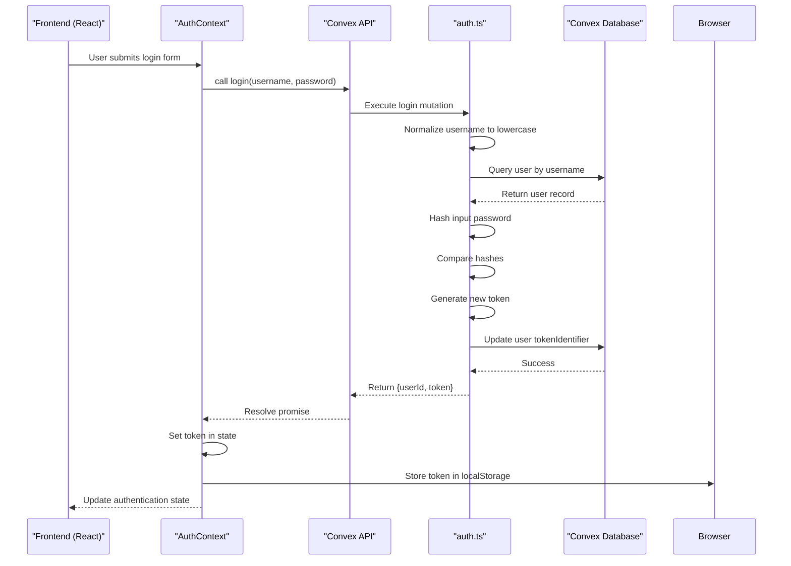
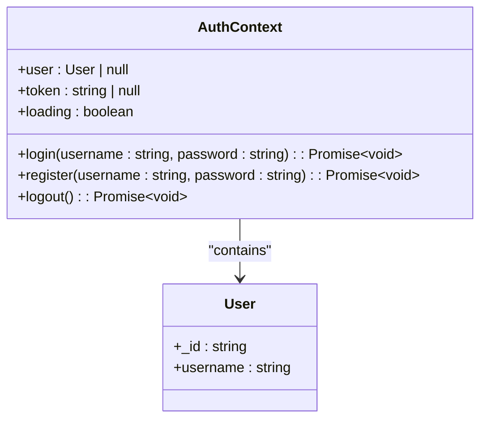
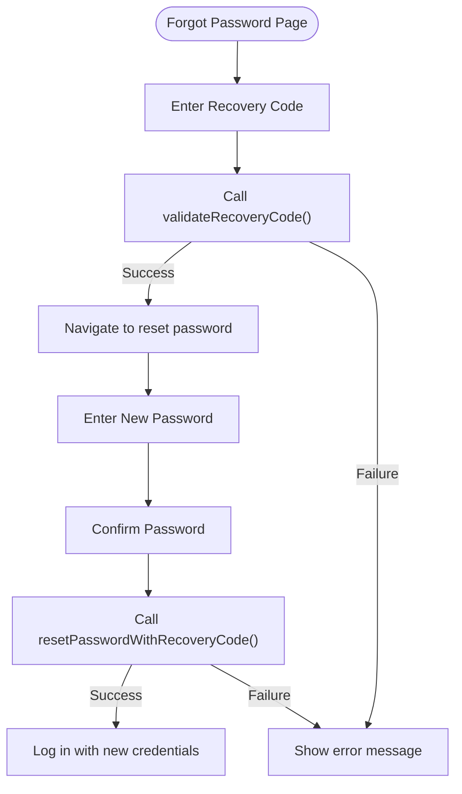

# Authentication API

<cite>
**Referenced Files in This Document**   
- [auth.ts](file://convex/auth.ts#L1-L260) - *Updated with recovery code functionality and error handling*
- [AuthContext.tsx](file://src/contexts/AuthContext.tsx#L1-L153) - *Updated to handle new authentication flows*
- [api.d.ts](file://convex/_generated/api.d.ts#L1-L44) - *Generated API types*
- [page.tsx](file://src/app/login/page.tsx#L1-L171) - *Updated with offline mode support*
- [page.tsx](file://src/app/register/page.tsx#L1-L152) - *Updated with client-side validation*
- [page.tsx](file://src/app/forgot-password/page.tsx#L1-L113) - *New password recovery implementation*
- [page.tsx](file://src/app/reset-password/page.tsx#L1-L227) - *Password reset functionality*
</cite>

## Update Summary
**Changes Made**   
- Added comprehensive password recovery system with recovery codes
- Enhanced error handling with structured ConvexError responses
- Implemented offline mode authentication support
- Added new frontend pages for password recovery workflow
- Updated type safety with generated API definitions
- Improved security practices including recovery code generation

## Table of Contents
1. [Authentication API](#authentication-api)
2. [Core Authentication Functions](#core-authentication-functions)
3. [Password Recovery System](#password-recovery-system)
4. [Authentication Flow and Token Handling](#authentication-flow-and-token-handling)
5. [Frontend Integration and Usage](#frontend-integration-and-usage)
6. [Error Handling and Validation](#error-handling-and-validation)
7. [Security Practices](#security-practices)
8. [Type Safety and Generated API](#type-safety-and-generated-api)
9. [Common Issues and Troubleshooting](#common-issues-and-troubleshooting)

## Core Authentication Functions

The authentication module in the Convex backend provides essential functions for user management: `login`, `register`, `getCurrentUser`, and `logout`. These server functions ensure secure handling of user credentials and session management.

### Login Function

The `login` mutation authenticates a user by verifying their username and password against stored credentials.

**Function Signature**
```typescript
login = mutation({
  args: {
    username: v.string(),
    password: v.string(),
  },
  handler: async (ctx, args) => { ... }
})
```

**Parameters**
- `username`: string - User's username (case-insensitive due to lowercase normalization)
- `password`: string - User's password (unhashed)

**Return Structure**
```json
{
  "userId": "string",
  "token": "string"
}
```

**Error Responses**
- `ConvexError`: "Username not found" - Username does not exist in database
- `ConvexError`: "Incorrect password" - Provided password does not match stored hash

**Section sources**
- [auth.ts](file://convex/auth.ts#L138-L161) - *Implementation with case-insensitive lookup*

### Register Function

The `register` mutation creates a new user account with hashed password and validates uniqueness.

**Function Signature**
```typescript
register = mutation({
  args: {
    username: v.string(),
    password: v.string(),
  },
  handler: async (ctx, args) => { ... }
})
```

**Parameters**
- `username`: string - Desired username (must be unique, case-insensitive)
- `password`: string - User's password (unhashed)

**Return Structure**
```json
{
  "userId": "string",
  "token": "string"
}
```

**Additional Actions**
- Seeds default income categories upon registration
- Normalizes username to lowercase for case-insensitive comparison
- Initializes onboarding status

**Error Responses**
- `ConvexError`: "Username already exists" - Username is already taken

**Section sources**
- [auth.ts](file://convex/auth.ts#L63-L136) - *Implementation with default data seeding*

### GetCurrentUser Function

The `getCurrentUser` query returns authenticated user data based on session token.

**Function Signature**
```typescript
getCurrentUser = query({
  args: {
    token: v.string(),
  },
  handler: async (ctx, args) => { ... }
})
```

**Parameters**
- `token`: string - Session token for authentication

**Return Structure**
```json
{
  "_id": "string",
  "username": "string"
}
```
Returns `null` if token is invalid or user not found.

**Section sources**
- [auth.ts](file://convex/auth.ts#L163-L178) - *Token-based user retrieval*

### Logout Function

The `logout` mutation invalidates the user's current session token.

**Function Signature**
```typescript
logout = mutation({
  args: {
    token: v.string(),
  },
  handler: async (ctx, args) => { ... }
})
```

**Parameters**
- `token`: string - Session token to invalidate

**Return Structure**
```json
{
  "success": true
}
```

**Implementation Details**
- Finds user by token identifier
- Updates tokenIdentifier with new random value to invalidate current token
- Returns success regardless of whether user was found (prevents information leakage)

**Section sources**
- [auth.ts](file://convex/auth.ts#L180-L197) - *Token invalidation implementation*

## Password Recovery System

The authentication module includes a comprehensive password recovery system using recovery codes as a backup authentication method.

### Generate Recovery Code Function

Creates a recovery code for users to use when they forget their password.

**Function Signature**
```typescript
generateRecoveryCode = mutation({
  args: {
    token: v.string(),
  },
  handler: async (ctx, args) => { ... }
})
```

**Parameters**
- `token`: string - Current session token for authentication

**Return Structure**
```json
{
  "recoveryCode": "string"
}
```

**Implementation Details**
- Requires valid authentication token
- Generates 10-character alphanumeric code formatted as XXXX-XXXX-XX
- Hashes and stores recovery code in database
- Records timestamp of creation

**Section sources**
- [auth.ts](file://convex/auth.ts#L199-L223) - *Recovery code generation logic*

### Has Recovery Code Function

Checks whether a user has an active recovery code set.

**Function Signature**
```typescript
hasRecoveryCode = query({
  args: {
    token: v.string(),
  },
  handler: async (ctx, args) => { ... }
})
```

**Parameters**
- `token`: string - Session token for authentication

**Return Structure**
- boolean - `true` if user has recovery code, `false` otherwise

**Section sources**
- [auth.ts](file://convex/auth.ts#L225-L240) - *Recovery code existence check*

### Validate Recovery Code Function

Validates a recovery code and returns associated user information.

**Function Signature**
```typescript
validateRecoveryCode = mutation({
  args: {
    recoveryCode: v.string(),
  },
  handler: async (ctx, args) => { ... }
})
```

**Parameters**
- `recoveryCode`: string - Recovery code to validate

**Return Structure**
```json
{
  "userId": "string",
  "username": "string"
}
```

**Error Responses**
- `ConvexError`: "Invalid recovery code" - Code does not match any stored hash

**Section sources**
- [auth.ts](file://convex/auth.ts#L242-L256) - *Recovery code validation*

### Reset Password With Recovery Code Function

Resets user password using a valid recovery code.

**Function Signature**
```typescript
resetPasswordWithRecoveryCode = mutation({
  args: {
    recoveryCode: v.string(),
    newPassword: v.string(),
  },
  handler: async (ctx, args) => { ... }
})
```

**Parameters**
- `recoveryCode`: string - Valid recovery code
- `newPassword`: string - New password (minimum 6 characters)

**Return Structure**
```json
{
  "userId": "string",
  "token": "string"
}
```

**Validation Rules**
- Password must be at least 6 characters long
- Recovery code must match stored hash
- New session token generated upon successful reset

**Section sources**
- [auth.ts](file://convex/auth.ts#L258-L285) - *Password reset implementation*

## Authentication Flow and Token Handling

The authentication system implements token-based session management with additional recovery mechanisms.



**Diagram sources**
- [auth.ts](file://convex/auth.ts#L138-L161)
- [AuthContext.tsx](file://src/contexts/AuthContext.tsx#L41-L48)

### Session Persistence

The system maintains user sessions across browser restarts:

1. **Token Storage**: After successful authentication, token is stored in localStorage with key "auth-token"
2. **Session Restoration**: On application load, AuthContext checks localStorage for existing token
3. **Automatic Authentication**: If token exists, user is automatically authenticated
4. **Offline Support**: Cached credentials allow access in offline mode

**Section sources**
- [AuthContext.tsx](file://src/contexts/AuthContext.tsx#L34-L36)
- [AuthContext.tsx](file://src/contexts/AuthContext.tsx#L45-L46)
- [AuthContext.tsx](file://src/contexts/AuthContext.tsx#L55-L56)

## Frontend Integration and Usage

The authentication system integrates with React components through the AuthContext provider.

### AuthContext Implementation

The AuthContext manages authentication state and provides methods for authentication operations.



**Diagram sources**
- [AuthContext.tsx](file://src/contexts/AuthContext.tsx#L10-L25)

### Calling Authentication Functions from Frontend

Components use the `useAuth` hook to access authentication functionality.

#### Login Example
```typescript
const { login } = useAuth();
await login(username, password);
```

#### Register Example
```typescript
const { register } = useAuth();
await register(username, password);
```

#### Logout Example
```typescript
const { logout } = useAuth();
await logout();
```

#### Getting Current User
```typescript
const { user } = useAuth();
// User data automatically updated when token changes
```

### Component Integration Examples

#### Login Page
The login page handles user authentication with offline support:


**Section sources**
- [page.tsx](file://src/app/login/page.tsx#L1-L171)

#### Password Recovery Workflow
The password recovery flow guides users through recovery code verification:



**Section sources**
- [page.tsx](file://src/app/forgot-password/page.tsx#L1-L113)
- [page.tsx](file://src/app/reset-password/page.tsx#L1-L227)

## Error Handling and Validation

The authentication system implements comprehensive error handling for various scenarios.

### Backend Error Responses

| Error Type | Error Message | Trigger Condition |
|-----------|---------------|-------------------|
| User Not Found | "Username not found" | Username does not exist |
| Incorrect Password | "Incorrect password" | Password is incorrect |
| Duplicate Username | "Username already exists" | Username already taken |
| Invalid Recovery Code | "Invalid recovery code" | Recovery code does not match |
| Short Password | "Password must be at least 6 characters long" | Password too short |

**Section sources**
- [auth.ts](file://convex/auth.ts#L70-L72)
- [auth.ts](file://convex/auth.ts#L144-L149)
- [auth.ts](file://convex/auth.ts#L262-L264)

### Frontend Error Handling

The frontend handles errors gracefully using toast notifications:

```typescript
try {
  await login(username, password);
  toast.success("Welcome back!");
  router.push("/expenses");
} catch (error: unknown) {
  const message = error instanceof ConvexError ? (error.data as { message: string }).message : error instanceof Error ? error.message : "Failed to login";
  if (message.toLowerCase().includes("username not found")) {
    toast.error("Username not found. Please check your entry or create an account.");
    router.push("/register");
  } else if (message.toLowerCase().includes("incorrect password")) {
    toast.error("The password you entered is incorrect.");
  } else {
    toast.error(message);
  }
}
```

Client-side validation includes:
- Required field validation
- Password confirmation matching
- Minimum password length (6 characters)
- Input sanitization

**Section sources**
- [page.tsx](file://src/app/login/page.tsx#L56-L90)
- [page.tsx](file://src/app/register/page.tsx#L64-L98)

## Security Practices

The authentication system implements multiple security best practices.

### Password Hashing

Passwords are hashed before storage using a salted algorithm:

```typescript
function hashPassword(password: string): string {
  const saltedPassword = password + "expense-tracker-salt";
  let hash = 0;
  for (let i = 0; i < saltedPassword.length; i++) {
    const char = saltedPassword.charCodeAt(i);
    hash = ((hash << 5) - hash) + char;
    hash = hash & hash;
  }
  return hash.toString(36);
}
```

**Note**: In production environments, bcrypt or similar secure hashing algorithms should replace this implementation.

**Section sources**
- [auth.ts](file://convex/auth.ts#L15-L28)

### Token Management

Randomly generated tokens manage user sessions:

```typescript
function generateToken(): string {
  return Math.random().toString(36).substring(2, 15) + 
         Math.random().toString(36).substring(2, 15);
}
```

Tokens are stored in the database as `tokenIdentifier` and used to authenticate requests.

**Section sources**
- [auth.ts](file://convex/auth.ts#L30-L34)

### Recovery Code Security

Recovery codes provide backup authentication:
- 10-character alphanumeric format (XXXX-XXXX-XX)
- Stored as hashed values in database
- Same hashing algorithm as passwords
- Can be regenerated by user

**Section sources**
- [auth.ts](file://convex/auth.ts#L36-L48)

### Session Security

- Tokens stored in localStorage for persistence
- Tokens invalidated on logout via regeneration
- Username normalization prevents case-sensitive conflicts
- Automatic redirection prevents access to auth pages when authenticated
- Offline mode supports cached credential usage

## Type Safety and Generated API

The system leverages TypeScript and Convex's generated API for compile-time safety.

### Generated API Types

The `api.d.ts` file provides type definitions for all Convex functions:

```typescript
declare const fullApi: ApiFromModules<{
  auth: typeof auth;
  cardsAndIncome: typeof cardsAndIncome;
  expenses: typeof expenses;
  userSettings: typeof userSettings;
}>;
export declare const api: FilterApi<
  typeof fullApi,
  FunctionReference<any, "public">
>;
```

This enables type-safe calls to authentication functions:

```typescript
const loginMutation = useMutation(api.auth.login);
// Type checking ensures correct parameters
const result = await loginMutation({ username, password });
```

**Section sources**
- [api.d.ts](file://convex/_generated/api.d.ts#L1-L44)

## Common Issues and Troubleshooting

### Session Expiration

**Issue**: Users are unexpectedly logged out.

**Solution**: Ensure localStorage is not being cleared by browser settings or extensions. The current implementation does not have token expiration, so sessions should persist until explicit logout.

### Input Validation Errors

**Issue**: Form submission fails with validation errors.

**Common Causes**:
- Empty username or password fields
- Password and confirmation mismatch (registration)
- Password less than 6 characters (registration)
- Invalid recovery code format

**Solution**: Ensure all fields are filled correctly and meet validation requirements.

### Authentication State Issues

**Issue**: Authentication state does not update correctly.

**Solution**: Verify that the AuthProvider wraps the entire application and that useAuth is called within the provider context.

### Network Issues

**Issue**: Authentication requests fail due to network connectivity.

**Solution**: Implement offline handling using cached credentials. The system supports offline mode with previously stored tokens.

### Recovery Code Problems

**Issue**: Recovery code not accepted during password reset.

**Solution**: Verify code format (XXXX-XXXX-XX), check for typos, and ensure code hasn't been used previously. Users can generate new recovery codes from settings.

**Section sources**
- [AuthContext.tsx](file://src/contexts/AuthContext.tsx#L1-L153)
- [page.tsx](file://src/app/login/page.tsx#L1-L171)
- [page.tsx](file://src/app/register/page.tsx#L1-L152)