# Authentication API

<cite>
**Referenced Files in This Document**   
- [auth.ts](file://convex/auth.ts#L1-L154) - *Updated with error handling and username normalization*
- [AuthContext.tsx](file://src/contexts/AuthContext.tsx#L1-L96) - *Updated to handle ConvexError*
- [api.d.ts](file://convex/_generated/api.d.ts#L1-L44) - *Generated API types*
- [page.tsx](file://src/app/login/page.tsx#L1-L128) - *Updated error handling*
- [page.tsx](file://src/app/register/page.tsx#L1-L152) - *Updated error handling*
</cite>

## Update Summary
**Changes Made**   
- Updated error handling to use ConvexError with structured data
- Added username normalization (lowercase conversion)
- Added logout functionality
- Enhanced frontend error handling with specific error messages
- Updated error responses and examples

## Table of Contents
1. [Authentication API](#authentication-api)
2. [Core Authentication Functions](#core-authentication-functions)
3. [Authentication Flow and Token Handling](#authentication-flow-and-token-handling)
4. [Frontend Integration and Usage](#frontend-integration-and-usage)
5. [Error Handling and Validation](#error-handling-and-validation)
6. [Security Practices](#security-practices)
7. [Type Safety and Generated API](#type-safety-and-generated-api)
8. [Common Issues and Troubleshooting](#common-issues-and-troubleshooting)

## Core Authentication Functions

The authentication module in the Convex backend provides four primary functions: `login`, `register`, `getCurrentUser`, and `logout`. These functions are implemented as Convex mutations and queries, ensuring secure and efficient handling of user authentication.

### Login Function

The `login` mutation authenticates a user by verifying their username and password against the stored credentials.

**Function Signature**
```typescript
login = mutation({
  args: {
    username: v.string(),
    password: v.string(),
  },
  handler: async (ctx, args) => { ... }
})
```

**Parameters**
- `username`: string - The user's username (case-insensitive)
- `password`: string - The user's password (unhashed)

**Return Structure**
```json
{
  "userId": "string",
  "token": "string"
}
```

**Error Responses**
- `ConvexError`: "Username not found" - Username does not exist
- `ConvexError`: "Incorrect password" - Password is incorrect

**Section sources**
- [auth.ts](file://convex/auth.ts#L98-L115) - *Updated with specific error messages*

### Register Function

The `register` mutation creates a new user account with a hashed password and validates username uniqueness.

**Function Signature**
```typescript
register = mutation({
  args: {
    username: v.string(),
    password: v.string(),
  },
  handler: async (ctx, args) => { ... }
})
```

**Parameters**
- `username`: string - The desired username (must be unique, case-insensitive)
- `password`: string - The user's password (unhashed)

**Return Structure**
```json
{
  "userId": "string",
  "token": "string"
}
```

**Error Responses**
- `ConvexError`: "Username already exists" - Username already taken

**Section sources**
- [auth.ts](file://convex/auth.ts#L43-L96) - *Updated with username normalization*

### GetCurrentUser Function

The `getCurrentUser` query returns authenticated user data based on the provided session token.

**Function Signature**
```typescript
getCurrentUser = query({
  args: {
    token: v.string(),
  },
  handler: async (ctx, args) => { ... }
})
```

**Parameters**
- `token`: string - The session token for authentication

**Return Structure**
```json
{
  "_id": "string",
  "username": "string"
}
```
Returns `null` if the token is invalid or user not found.

**Section sources**
- [auth.ts](file://convex/auth.ts#L117-L135)

### Logout Function

The `logout` mutation invalidates the user's current session token.

**Function Signature**
```typescript
logout = mutation({
  args: {
    token: v.string(),
  },
  handler: async (ctx, args) => { ... }
})
```

**Parameters**
- `token`: string - The session token to invalidate

**Return Structure**
```json
{
  "success": true
}
```

**Section sources**
- [auth.ts](file://convex/auth.ts#L137-L153)

## Authentication Flow and Token Handling

The authentication system implements a token-based session management approach using Convex's server functions and client-side state management.


**Diagram sources**
- [auth.ts](file://convex/auth.ts#L98-L115)
- [AuthContext.tsx](file://src/contexts/AuthContext.tsx#L41-L48)

### Session Persistence

The system maintains user sessions across browser restarts using localStorage:

1. **Token Storage**: After successful login or registration, the authentication token is stored in localStorage with the key "auth-token"
2. **Session Restoration**: On application load, AuthContext checks localStorage for an existing token
3. **Automatic Authentication**: If a token exists, the user is automatically authenticated without requiring re-login

**Section sources**
- [AuthContext.tsx](file://src/contexts/AuthContext.tsx#L34-L36)
- [AuthContext.tsx](file://src/contexts/AuthContext.tsx#L45-L46)
- [AuthContext.tsx](file://src/contexts/AuthContext.tsx#L55-L56)

## Frontend Integration and Usage

The authentication system is integrated into the frontend through the AuthContext provider, which exposes authentication functions to components.

### AuthContext Implementation

The AuthContext manages the authentication state and provides methods for login, registration, and logout.


**Diagram sources**
- [AuthContext.tsx](file://src/contexts/AuthContext.tsx#L10-L25)

### Calling Authentication Functions from Frontend

Frontend components use the `useAuth` hook to access authentication functionality.

#### Login Example
```typescript
const { login } = useAuth();
await login(username, password);
```

#### Register Example
```typescript
const { register } = useAuth();
await register(username, password);
```

#### Logout Example
```typescript
const { logout } = useAuth();
await logout();
```

#### Getting Current User
```typescript
const { user } = useAuth();
// User data automatically updated when token changes
```

### Component Integration Examples

#### Login Page
The login page component uses the authentication context to handle user login:


**Section sources**
- [page.tsx](file://src/app/login/page.tsx#L1-L128)

#### Register Page
The register page includes additional client-side validation:

```mermaid
flowchart TD
Start([Register Page Load]) --> CheckAuth["Check if user already authenticated"]
CheckAuth --> |Yes| Redirect["Redirect to /expenses"]
CheckAuth --> |No| DisplayForm["Display registration form"]
DisplayForm --> HandleSubmit["Handle form submission"]
HandleSubmit --> ValidateFields["Validate all fields filled"]
ValidateFields --> |Invalid| ShowError["Show error message"]
ValidateFields --> |Valid| ValidatePasswordMatch["Check password confirmation"]
ValidatePasswordMatch --> |Mismatch| ShowError
ValidatePasswordMatch --> |Valid| ValidatePasswordLength["Check password length ≥ 6"]
ValidatePasswordLength --> |Too short| ShowError
ValidatePasswordLength --> |Valid| CallRegister["Call register() function"]
CallRegister --> HandleResult["Handle registration result"]
HandleResult --> |Success| StoreToken["Store token and redirect"]
HandleResult --> |Error| ShowError
StoreToken --> Redirect
```



**Section sources**
- [page.tsx](file://src/app/register/page.tsx#L1-L152)

## Error Handling and Validation

The authentication system implements comprehensive error handling for various failure scenarios.

### Backend Error Responses

| Error Type | Error Message | Trigger Condition |
|-----------|---------------|-------------------|
| User Not Found | "Username not found" | Username does not exist |
| Incorrect Password | "Incorrect password" | Password is incorrect |
| Duplicate Username | "Username already exists" | Username already taken |

**Section sources**
- [auth.ts](file://convex/auth.ts#L50-L52)
- [auth.ts](file://convex/auth.ts#L99-L104)

### Frontend Error Handling

The frontend components handle errors gracefully using toast notifications and specific error messages:

```typescript
try {
  await login(username, password);
  toast.success("Welcome back!");
  router.push("/expenses");
} catch (error: unknown) {
  const message = error instanceof ConvexError ? (error.data as { message: string }).message : error instanceof Error ? error.message : "Failed to login";
  if (message.toLowerCase().includes("username not found")) {
    toast.error("Username not found. Please check your entry or create an account.");
    router.push("/register");
  } else if (message.toLowerCase().includes("incorrect password")) {
    toast.error("The password you entered is incorrect.");
  } else {
    toast.error(message);
  }
}
```

Client-side validation is also implemented:
- Required field validation
- Password confirmation matching
- Minimum password length (6 characters)

**Section sources**
- [page.tsx](file://src/app/login/page.tsx#L56-L90)
- [page.tsx](file://src/app/register/page.tsx#L64-L98)

## Security Practices

The authentication system implements several security best practices to protect user data.

### Password Hashing

Passwords are hashed before storage using a simple hashing algorithm with salt:

```typescript
function hashPassword(password: string): string {
  const saltedPassword = password + "expense-tracker-salt";
  // Simple hash implementation
  let hash = 0;
  for (let i = 0; i < saltedPassword.length; i++) {
    const char = saltedPassword.charCodeAt(i);
    hash = ((hash << 5) - hash) + char;
    hash = hash & hash;
  }
  return hash.toString(36);
}
```

**Note**: In production, bcrypt or similar secure hashing algorithms should be used instead of this simple implementation.

**Section sources**
- [auth.ts](file://convex/auth.ts#L15-L28)

### Token Management

The system uses randomly generated tokens for session management:

```typescript
function generateToken(): string {
  return Math.random().toString(36).substring(2, 15) + 
         Math.random().toString(36).substring(2, 15);
}
```

Tokens are stored in the database as `tokenIdentifier` and used to authenticate subsequent requests.

**Section sources**
- [auth.ts](file://convex/auth.ts#L30-L34)

### Session Security

- Tokens are stored in localStorage for persistence
- Tokens are invalidated on logout by generating a new random token
- Username normalization (lowercase) prevents case-sensitive conflicts
- Automatic redirection for authenticated users prevents access to login/register pages

## Type Safety and Generated API

The system leverages TypeScript and Convex's generated API for compile-time safety.

### Generated API Types

The `api.d.ts` file provides type definitions for all Convex functions:

```typescript
declare const fullApi: ApiFromModules<{
  auth: typeof auth;
  cardsAndIncome: typeof cardsAndIncome;
  expenses: typeof expenses;
  userSettings: typeof userSettings;
}>;
export declare const api: FilterApi<
  typeof fullApi,
  FunctionReference<any, "public">
>;
```

This enables type-safe calls to authentication functions:

```typescript
const loginMutation = useMutation(api.auth.login);
// Type checking ensures correct parameters
const result = await loginMutation({ username, password });
```

**Section sources**
- [api.d.ts](file://convex/_generated/api.d.ts#L1-L44)

## Common Issues and Troubleshooting

### Session Expiration

**Issue**: Users are unexpectedly logged out.

**Solution**: Ensure localStorage is not being cleared by browser settings or extensions. The current implementation does not have token expiration, so sessions should persist until explicit logout.

### Input Validation Errors

**Issue**: Form submission fails with validation errors.

**Common Causes**:
- Empty username or password fields
- Password and confirmation mismatch (registration)
- Password less than 6 characters (registration)

**Solution**: Ensure all fields are filled correctly and meet validation requirements.

### Authentication State Issues

**Issue**: Authentication state does not update correctly.

**Solution**: Verify that the AuthProvider wraps the entire application and that useAuth is called within the provider context.

### Network Issues

**Issue**: Authentication requests fail due to network connectivity.

**Solution**: Implement offline handling using the OfflineContext and retry mechanisms when connectivity is restored.

**Section sources**
- [AuthContext.tsx](file://src/contexts/AuthContext.tsx#L1-L96)
- [page.tsx](file://src/app/login/page.tsx#L1-L128)
- [page.tsx](file://src/app/register/page.tsx#L1-L152)