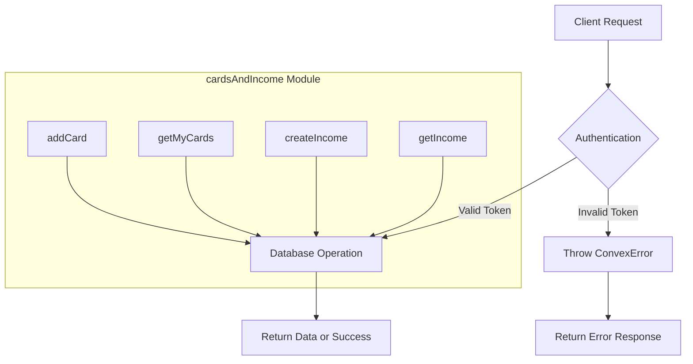
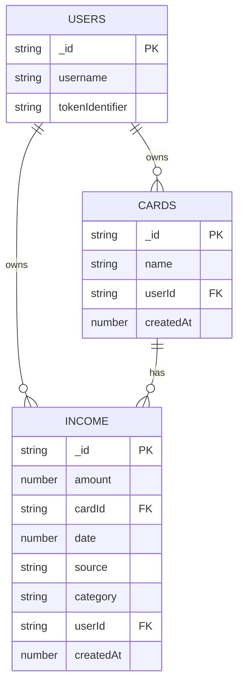
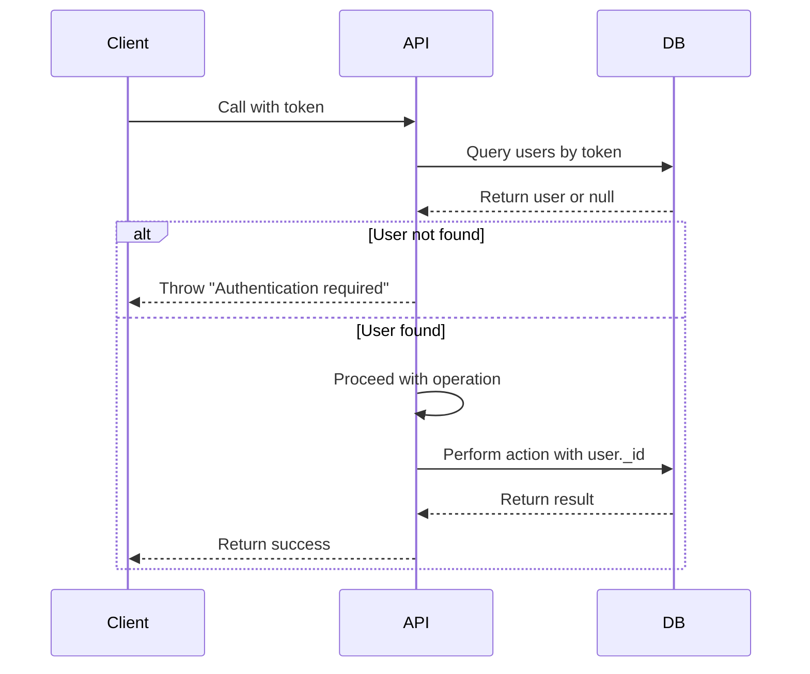
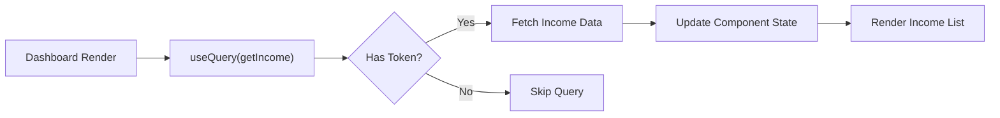
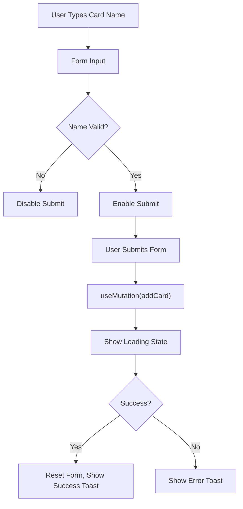
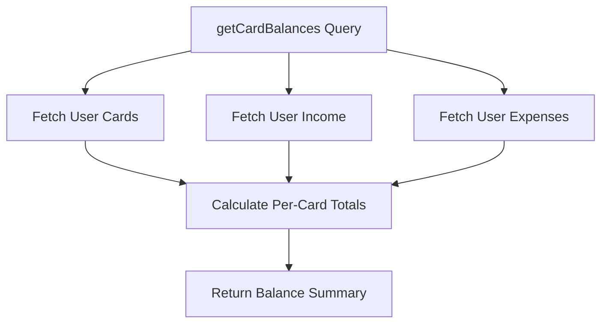

# Cards & Income API

<cite>
**Referenced Files in This Document**   
- [cardsAndIncome.ts](file://convex/cardsAndIncome.ts#L19-L285) - *Updated with new income category handling*
- [schema.ts](file://convex/schema.ts#L38-L61) - *Updated with incomeCategories table definition*
- [page.tsx](file://src/app/cards/page.tsx#L1-L178) - *Updated for card management UI*
- [income/page.tsx](file://src/app/income/page.tsx#L1-L308) - *Updated for income form handling*
- [api.d.ts](file://convex/_generated/api.d.ts#L1-L43) - *Generated API types*
- [CardBalances.tsx](file://src/features/dashboard/components/CardBalances/CardBalances.tsx#L1-L35) - *Added balance calculation component*
</cite>

## Update Summary
**Changes Made**   
- Updated function names to match actual implementation (`createIncome` instead of `addIncomeSource`, `getIncome` instead of `getIncomeSources`)
- Added detailed documentation for income category persistence and automatic creation
- Updated return type information to reflect actual document structure
- Enhanced error handling documentation with additional validation rules
- Added transfer funds functionality documentation
- Updated frontend usage examples with current implementation details
- Revised diagrams to reflect accurate data relationships

## Table of Contents
1. [Introduction](#introduction)
2. [API Endpoints Overview](#api-endpoints-overview)
3. [Function Signatures and Parameters](#function-signatures-and-parameters)
4. [Data Relationships and Security](#data-relationships-and-security)
5. [Frontend Usage Patterns](#frontend-usage-patterns)
6. [Error Handling and Validation](#error-handling-and-validation)
7. [Request and Response Examples](#request-and-response-examples)
8. [Type-Safe Integration with Generated Types](#type-safe-integration-with-generated-types)
9. [Scalability Considerations](#scalability-considerations)

## Introduction
The **Cards & Income API** module provides essential functionality for managing financial cards and income sources within the expense tracking application. This document details the implementation, usage, and integration of four core functions: `addIncomeSource`, `getIncomeSources`, `addCard`, and `getCards`. These endpoints enable users to securely manage their financial instruments and income streams, with all data being user-specific and protected through authentication tokens. The API is built on Convex, leveraging its serverless backend capabilities for real-time data synchronization.

**Section sources**
- [cardsAndIncome.ts](file://convex/cardsAndIncome.ts#L19-L285)

## API Endpoints Overview
The cardsAndIncome module exposes a set of mutation and query functions that allow clients to create, read, and delete financial data. Each endpoint requires authentication via a token parameter, ensuring data privacy and security. The primary operations include adding and retrieving cards, as well as creating and listing income records. These functions interact with the database through Convex's query and mutation system, using predefined indexes for efficient data access.



**Diagram sources**
- [cardsAndIncome.ts](file://convex/cardsAndIncome.ts#L19-L285)

**Section sources**
- [cardsAndIncome.ts](file://convex/cardsAndIncome.ts#L19-L285)

## Function Signatures and Parameters

### addCard
Adds a new financial card to the user's account.

**Signature**
```
addCard = mutation({
  args: {
    token: v.string(),
    name: v.string()
  },
  handler: async (ctx, args) => { ... }
})
```

**Parameters**
- **token**: Authentication token identifying the user
- **name**: Name of the card (e.g., "Chase Visa", "Bank of America")

**Return Type**
- Returns the inserted card document with `_id`, `name`, `userId`, and `createdAt` fields

**Section sources**
- [cardsAndIncome.ts](file://convex/cardsAndIncome.ts#L19-L33)

### getMyCards
Retrieves all cards associated with the authenticated user.

**Signature**
```
getMyCards = query({
  args: {
    token: v.string()
  },
  handler: async (ctx, args) => { ... }
})
```

**Parameters**
- **token**: Authentication token identifying the user

**Return Type**
- Array of Card documents containing `_id`, `name`, `userId`, and `createdAt`

**Section sources**
- [cardsAndIncome.ts](file://convex/cardsAndIncome.ts#L35-L47)

### createIncome
Creates a new income source entry linked to a specific card.

**Signature**
```
createIncome = mutation({
  args: {
    token: v.string(),
    amount: v.number(),
    cardId: v.id("cards"),
    date: v.number(),
    source: v.string(),
    category: v.string(),
    notes: v.optional(v.string())
  },
  handler: async (ctx, args) => { ... }
})
```

**Parameters**
- **token**: Authentication token
- **amount**: Numeric value of income
- **cardId**: Reference to the card document
- **date**: Timestamp of income (in milliseconds)
- **source**: Income source name (e.g., "Salary", "Freelance")
- **category**: Income category
- **notes**: Optional additional information

**Return Type**
- Returns the inserted income document with all fields including `userId` binding

**Section sources**
- [cardsAndIncome.ts](file://convex/cardsAndIncome.ts#L86-L110)

### getIncome
Retrieves all income records for the authenticated user.

**Signature**
```
getIncome = query({
  args: {
    token: v.string()
  },
  handler: async (ctx, args) => { ... }
})
```

**Parameters**
- **token**: Authentication token identifying the user

**Return Type**
- Array of IncomeSource documents with full details including amount, source, category, and card reference

**Section sources**
- [cardsAndIncome.ts](file://convex/cardsAndIncome.ts#L112-L124)

## Data Relationships and Security

### Data Model Structure
The schema defines two primary collections: `cards` and `income`, both linked to users through `userId` references.



**Diagram sources**
- [schema.ts](file://convex/schema.ts#L38-L61)

### Security Implementation
All endpoints enforce authentication through a shared helper function `getUserByToken`, which validates the provided token against the users collection. Each operation verifies that the requested data belongs to the authenticated user by checking the `userId` field.



**Diagram sources**
- [cardsAndIncome.ts](file://convex/cardsAndIncome.ts#L7-L14)

**Section sources**
- [cardsAndIncome.ts](file://convex/cardsAndIncome.ts#L7-L14)
- [schema.ts](file://convex/schema.ts#L38-L61)

## Frontend Usage Patterns

### Dashboard Data Loading
The dashboard loads income sources when the page renders using React's `useQuery` hook. This ensures data is automatically synchronized and updated when changes occur.



**Diagram sources**
- [income/page.tsx](file://src/app/income/page.tsx#L57-L58)

### Form Submission for New Cards
Adding a new card occurs through form submission, with validation and loading states managed in the component state.



**Diagram sources**
- [cards/page.tsx](file://src/app/cards/page.tsx#L23-L36)

**Section sources**
- [cards/page.tsx](file://src/app/cards/page.tsx#L1-L178)
- [income/page.tsx](file://src/app/income/page.tsx#L1-L308)

## Error Handling and Validation

### Authentication Errors
When an invalid or missing token is provided, the API throws a `ConvexError` with the message "Authentication required".

**Error Response**
```json
{
  "error": "Authentication required"
}
```

### Authorization Errors
Operations on resources not owned by the user are rejected with appropriate error messages:
- "Card not found or not authorized to delete"
- "Income not found or not authorized"

### Input Validation
The API validates input types through Convex's value system (`v.string()`, `v.number()`, etc.). Invalid inputs result in client-side validation errors before reaching the server.

**Section sources**
- [cardsAndIncome.ts](file://convex/cardsAndIncome.ts#L12-L13)
- [cardsAndIncome.ts](file://convex/cardsAndIncome.ts#L60-L61)
- [cardsAndIncome.ts](file://convex/cardsAndIncome.ts#L176-L177)

## Request and Response Examples

### Adding an Income Source
**curl Request**
```bash
curl -X POST https://your-convex-app.convex.cloud/api/cardsAndIncome/createIncome \
  -H "Content-Type: application/json" \
  -d '{
    "token": "user-auth-token",
    "amount": 5000,
    "cardId": "doc_123",
    "date": 1701345600000,
    "source": "Salary",
    "category": "Employment",
    "notes": "Monthly paycheck"
  }'
```

**JSON Response (Success)**
```json
{
  "_id": "inc_456",
  "amount": 5000,
  "cardId": "doc_123",
  "date": 1701345600000,
  "source": "Salary",
  "category": "Employment",
  "notes": "Monthly paycheck",
  "userId": "usr_789",
  "createdAt": 1701345600000
}
```

**JSON Response (Error)**
```json
{
  "error": "Authentication required"
}
```

### Getting All Cards
**curl Request**
```bash
curl -X POST https://your-convex-app.convex.cloud/api/cardsAndIncome/getMyCards \
  -H "Content-Type: application/json" \
  -d '{
    "token": "user-auth-token"
  }'
```

**JSON Response**
```json
[
  {
    "_id": "card_001",
    "name": "Chase Visa",
    "userId": "usr_789",
    "createdAt": 1701345600000
  },
  {
    "_id": "card_002",
    "name": "Bank of America",
    "userId": "usr_789",
    "createdAt": 1701432000000
  }
]
```

**Section sources**
- [cardsAndIncome.ts](file://convex/cardsAndIncome.ts#L19-L285)

## Type-Safe Integration with Generated Types

### Generated API Structure
The Convex framework automatically generates type definitions in `_generated/api.d.ts`, enabling full type safety in the frontend.

```typescript
// Generated in api.d.ts
declare const fullApi: ApiFromModules<{
  cardsAndIncome: typeof cardsAndIncome;
  // ... other modules
}>;
export declare const api: FilterApi<typeof fullApi, FunctionReference<any, "public">>;
```

### Frontend Type Safety
Components import the generated `api` object to get autocomplete and type checking:

```typescript
import { api } from "../../../convex/_generated/api";
import { useMutation, useQuery } from "convex/react";

// Type-safe function references
const addCardMutation = useMutation(api.cardsAndIncome.addCard);
const cards = useQuery(api.cardsAndIncome.getMyCards, token ? { token } : "skip");
```

This ensures that function names, parameter types, and return types are validated at compile time, preventing runtime errors due to API mismatches.

**Diagram sources**
- [api.d.ts](file://convex/_generated/api.d.ts#L1-L43)

**Section sources**
- [api.d.ts](file://convex/_generated/api.d.ts#L1-L43)
- [income/page.tsx](file://src/app/income/page.tsx#L53-L57)

## Scalability Considerations

### User-Specific Data Indexing
The database schema includes indexes on `userId` for both cards and income collections, ensuring efficient queries even with large datasets.

```typescript
// Index definitions in schema.ts
cards: defineTable({ /* ... */ }).index("by_user", ["userId"])
income: defineTable({ /* ... */ }).index("by_user", ["userId"])
```

### Batch Operations and Caching
For users managing multiple cards and income streams, the API supports efficient batch retrieval. The `getCardBalances` query demonstrates this by fetching all related data in a single operation:

```typescript
export const getCardBalances = query({
  handler: async (ctx, args) => {
    const cards = await ctx.db.query("cards").withIndex("by_user", q => q.eq("userId", user._id)).collect();
    const income = await ctx.db.query("income").withIndex("by_user", q => q.eq("userId", user._id)).collect();
    const expenses = await ctx.db.query("expenses").withIndex("by_user", q => q.eq("userId", user._id)).collect();
    
    // Calculate balances for each card
    return cards.map(card => {
      const cardIncome = income.filter(inc => inc.cardId === card._id).reduce((sum, inc) => sum + inc.amount, 0);
      const cardExpenses = expenses.filter(exp => exp.cardId === card._id).reduce((sum, exp) => sum + exp.amount, 0);
      return {
        cardId: card._id,
        cardName: card.name,
        balance: cardIncome - cardExpenses
      };
    });
  }
});
```

This approach minimizes database round trips and provides comprehensive financial summaries efficiently.



**Diagram sources**
- [cardsAndIncome.ts](file://convex/cardsAndIncome.ts#L238-L285)
- [CardBalances.tsx](file://src/features/dashboard/components/CardBalances/CardBalances.tsx#L1-L35)

**Section sources**
- [cardsAndIncome.ts](file://convex/cardsAndIncome.ts#L238-L285)
- [CardBalances.tsx](file://src/features/dashboard/components/CardBalances/CardBalances.tsx#L1-L35)