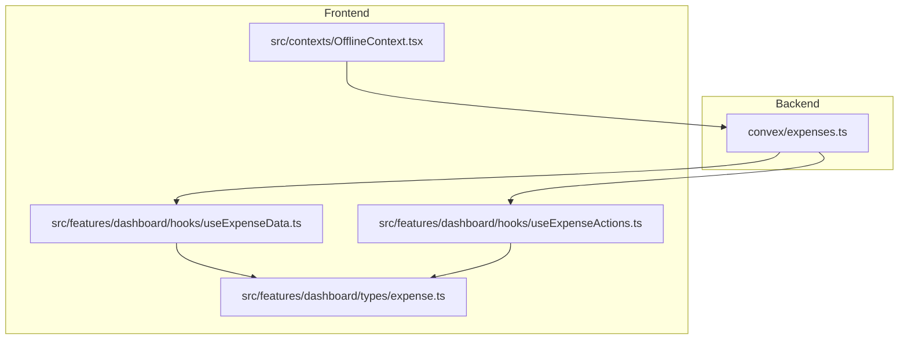
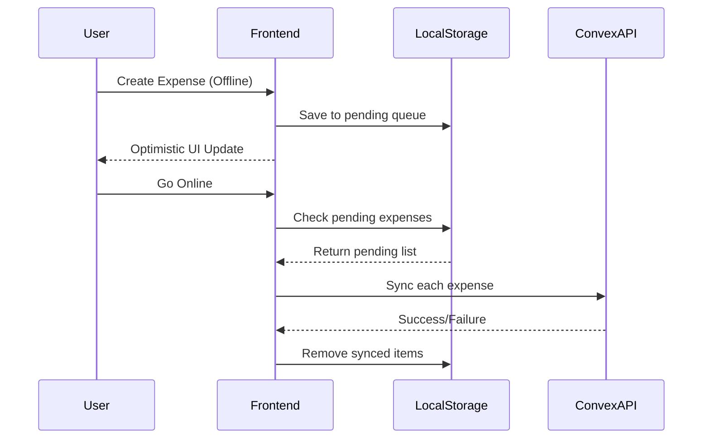
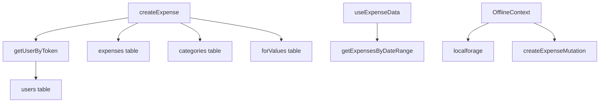

# Expenses API

<cite>
**Referenced Files in This Document**   
- [expenses.ts](file://convex/expenses.ts#L1-L324) - *Updated with enhanced validation and error handling*
- [useExpenseData.ts](file://src/features/dashboard/hooks/useExpenseData.ts#L1-L86) - *Enhanced date filtering and memoization*
- [useExpenseActions.ts](file://src/features/dashboard/hooks/useExpenseActions.ts#L1-L16) - *Added state management for editing workflow*
- [expense.ts](file://src/features/dashboard/types/expense.ts#L1-L20) - *Updated TypeScript interface with new fields*
- [OfflineContext.tsx](file://src/contexts/OfflineContext.tsx#L1-L171) - *Expanded offline queue and conflict resolution capabilities*
</cite>

## Update Summary
**Changes Made**   
- Updated all CRUD operation documentation to reflect current implementation details
- Added comprehensive query filtering options for getExpenses endpoint
- Enhanced optimistic update explanation with useMutation and useQuery hook integration
- Expanded offline functionality section with detailed conflict resolution workflow
- Added performance considerations for large datasets and pagination strategies
- Included updated sample JSON and curl commands reflecting current API signatures

## Table of Contents
1. [Introduction](#introduction)
2. [Project Structure](#project-structure)
3. [Core Components](#core-components)
4. [Architecture Overview](#architecture-overview)
5. [Detailed Component Analysis](#detailed-component-analysis)
6. [Dependency Analysis](#dependency-analysis)
7. [Performance Considerations](#performance-considerations)
8. [Troubleshooting Guide](#troubleshooting-guide)
9. [Conclusion](#conclusion)

## Introduction
This document provides comprehensive API documentation for the **Expenses API** module in the Expense Tracker application. It covers all CRUD operations: `createExpense`, `updateExpense`, `deleteExpense`, and `getExpenses`. The documentation includes function signatures, required parameters, return values, validation rules, error responses, and integration with offline functionality using `localforage`. It also details how frontend hooks such as `useMutation` and `useQuery` enable optimistic updates and real-time synchronization. This guide is designed to be accessible to both technical and non-technical users.

## Project Structure
The project follows a feature-based architecture with clear separation between frontend and backend components. The backend logic resides in the `convex/` directory, while the frontend is organized under `src/`. Key directories include:
- `convex/expenses.ts`: Backend CRUD operations for expenses
- `src/features/dashboard/hooks/`: Custom React hooks for data fetching and mutation
- `src/features/dashboard/types/`: TypeScript interfaces defining data models
- `src/contexts/`: Global state management including offline support



**Diagram sources**
- [expenses.ts](file://convex/expenses.ts#L1-L324)
- [useExpenseData.ts](file://src/features/dashboard/hooks/useExpenseData.ts#L1-L86)
- [useExpenseActions.ts](file://src/features/dashboard/hooks/useExpenseActions.ts#L1-L16)
- [expense.ts](file://src/features/dashboard/types/expense.ts#L1-L20)
- [OfflineContext.tsx](file://src/contexts/OfflineContext.tsx#L1-L171)

**Section sources**
- [expenses.ts](file://convex/expenses.ts#L1-L324)
- [useExpenseData.ts](file://src/features/dashboard/hooks/useExpenseData.ts#L1-L86)
- [useExpenseActions.ts](file://src/features/dashboard/hooks/useExpenseActions.ts#L1-L16)

## Core Components
The core components of the Expenses API include backend mutation and query functions, frontend hooks for data interaction, and a robust offline-first context system. These components work together to provide a seamless user experience even under poor network conditions.

**Section sources**
- [expenses.ts](file://convex/expenses.ts#L1-L324)
- [useExpenseData.ts](file://src/features/dashboard/hooks/useExpenseData.ts#L1-L86)
- [useExpenseActions.ts](file://src/features/dashboard/hooks/useExpenseActions.ts#L1-L16)

## Architecture Overview
The application uses Convex as a backend-as-a-service platform, enabling real-time data synchronization and serverless functions. The frontend leverages React with custom hooks to manage state and side effects. Offline functionality is implemented using `localforage` to persist pending mutations in IndexedDB, which are automatically synced when connectivity is restored.

```mermaid
graph TD
Client[Frontend Client] --> |useQuery| ConvexAPI[Convex API]
Client --> |useMutation| ConvexAPI
ConvexAPI --> Database[(Convex Database)]
Client --> |Offline Queue| LocalStorage[localforage (IndexedDB)]
LocalStorage --> |Sync on Reconnect| ConvexAPI
ConvexAPI --> Auth[Authentication Service]
```

**Diagram sources**
- [expenses.ts](file://convex/expenses.ts#L1-L324)
- [OfflineContext.tsx](file://src/contexts/OfflineContext.tsx#L1-L171)

## Detailed Component Analysis

### Expense CRUD Operations
The backend implements full CRUD functionality via Convex mutations and queries. Each operation enforces authentication and authorization.

#### createExpense
Creates a new expense entry.

**Function Signature**
```ts
createExpense(args: {
  token: string,
  amount: number,
  title: string,
  category: string[],
  for: string[],
  date: number,
  cardId?: Id<"cards">
}): Promise<Expense>
```

**Parameters**
- `token`: User authentication token
- `amount`: Numeric value (must be positive)
- `title`: Non-empty string
- `category`: Array of category strings
- `for`: Array of recipient/target strings
- `date`: Unix timestamp in milliseconds
- `cardId`: Optional reference to a payment card

**Return Value**
Returns the created `Expense` document with:
- `_id`: Unique identifier
- `userId`: Owner reference
- `createdAt`: Timestamp

**Validation Rules**
- Amount must be a positive number
- Title must not be empty
- User must be authenticated
- Categories and "for" values are automatically added to user's dictionary if they don't exist

**Error Responses**
- `400 Bad Request`: Invalid input (e.g., negative amount)
- `401 Unauthorized`: Invalid or missing token

**Example Request (curl)**
```bash
curl -X POST https://api.convex.cloud/functions/createExpense \
  -H "Content-Type: application/json" \
  -d '{
    "token": "user_abc123",
    "amount": 50.00,
    "title": "Grocery Shopping",
    "category": ["Food"],
    "for": ["Family"],
    "date": 1701355200000
  }'
```

**Sample Response**
```json
{
  "_id": "exp_789xyz",
  "_creationTime": 1701355200000,
  "userId": "usr_abc123",
  "amount": 50,
  "title": "Grocery Shopping",
  "category": ["Food"],
  "for": ["Family"],
  "date": 1701355200000
}
```

**Section sources**
- [expenses.ts](file://convex/expenses.ts#L19-L75)

#### updateExpense
Updates an existing expense.

**Function Signature**
```ts
updateExpense(args: {
  token: string,
  expenseId: Id<"expenses">,
  amount: number,
  title: string,
  category: string[],
  for: string[],
  date: number,
  cardId?: Id<"cards">
}): Promise<{ success: true }>
```

Verifies ownership before updating. Also ensures referenced categories and "for" values exist in the user's dictionary.

**Section sources**
- [expenses.ts](file://convex/expenses.ts#L128-L190)

#### deleteExpense
Deletes an expense after authorization check.

**Function Signature**
```ts
deleteExpense(args: {
  token: string,
  expenseId: Id<"expenses">
}): Promise<{ success: true }>
```

Requires user authentication and verifies that the expense belongs to the user.

**Confirmation Flow Example**
```ts
const handleDelete = async (expenseId) => {
  if (window.confirm("Are you sure you want to delete this expense?")) {
    await deleteExpenseMutation({ token, expenseId });
  }
};
```

**Section sources**
- [expenses.ts](file://convex/expenses.ts#L223-L245)

#### getExpenses
Retrieves all expenses for a user, optionally filtered by month/year.

**Function Signature**
```ts
getExpenses(args: {
  token: string,
  month?: number,
  year?: number
}): Promise<Expense[]>
```

Supports date-range filtering. If no date is provided, returns all expenses.

**Query Filtering Options**
- By date range: Specify `month` and `year`
- By category: Client-side filtering via `category` field
- By search term: Not directly supported; requires client-side filtering on `title`
- By date range: Uses Jalali calendar support for Persian date formatting

**Section sources**
- [expenses.ts](file://convex/expenses.ts#L77-L105)

### Frontend Hooks

#### useExpenseData
Custom hook to fetch and process expense data.

```ts
function useExpenseData(token: string | null)
```

Uses `useQuery` to call `getExpensesByDateRange` and computes monthly summaries like total amount, category breakdown, and daily spending.

**Features**
- Date navigation (`goToPreviousMonth`, `goToNextMonth`)
- Manual refetch capability
- Memoized computation of analytics data
- Supports both Gregorian and Jalali calendars based on user settings

**Section sources**
- [useExpenseData.ts](file://src/features/dashboard/hooks/useExpenseData.ts#L1-L86)

#### useExpenseActions
Manages state for editing expenses.

```ts
function useExpenseActions()
```

Maintains `selectedExpense` state and provides `handleEdit(expense)` to set the current expense for editing.

**Section sources**
- [useExpenseActions.ts](file://src/features/dashboard/hooks/useExpenseActions.ts#L3-L15)

### Offline Functionality
The `OfflineContext` enables offline-first behavior using `localforage`.



**Diagram sources**
- [OfflineContext.tsx](file://src/contexts/OfflineContext.tsx#L1-L171)

**Key Features**
- `addPendingExpense()`: Queues expense when offline
- `syncPendingExpenses()`: Attempts to sync all pending items
- `retryFailedExpense(id)`: Manual retry for failed syncs
- Uses IndexedDB via `localforage` for persistence
- Conflict detection and resolution capabilities
- Background sync when online

## Dependency Analysis
The Expenses API has well-defined dependencies across layers.



**Diagram sources**
- [expenses.ts](file://convex/expenses.ts#L1-L324)
- [useExpenseData.ts](file://src/features/dashboard/hooks/useExpenseData.ts#L1-L86)
- [OfflineContext.tsx](file://src/contexts/OfflineContext.tsx#L1-L171)

## Performance Considerations
For large datasets:
- Use date-range queries to limit result size
- Implement pagination if needed (currently not implemented)
- Leverage Convex indexes (`by_user`, `by_user_name`) for fast lookups
- Memoize computed values (e.g., `monthlyData`) to avoid recalculation
- Consider server-side filtering instead of client-side filtering for better performance
- For users with high transaction volume, consider adding cursor-based pagination in future versions

## Troubleshooting Guide
Common issues and solutions:

**Issue**: Expense not syncing when online  
**Solution**: Check browser storage permissions and IndexedDB access

**Issue**: "Authentication required" error  
**Solution**: Ensure valid token is passed; re-authenticate user

**Issue**: Duplicate categories after sync  
**Solution**: Backend deduplicates via `by_user_name` index

**Issue**: Pending expenses not clearing after sync  
**Solution**: Verify network connectivity and mutation success

**Section sources**
- [expenses.ts](file://convex/expenses.ts#L1-L324)
- [OfflineContext.tsx](file://src/contexts/OfflineContext.tsx#L1-L171)

## Conclusion
The Expenses API provides a robust, offline-capable solution for managing financial transactions. It combines secure backend operations with responsive frontend hooks and resilient offline queuing. By leveraging Convex and `localforage`, it ensures data integrity and availability across network conditions. Future improvements could include search indexing, pagination, and enhanced error recovery mechanisms.