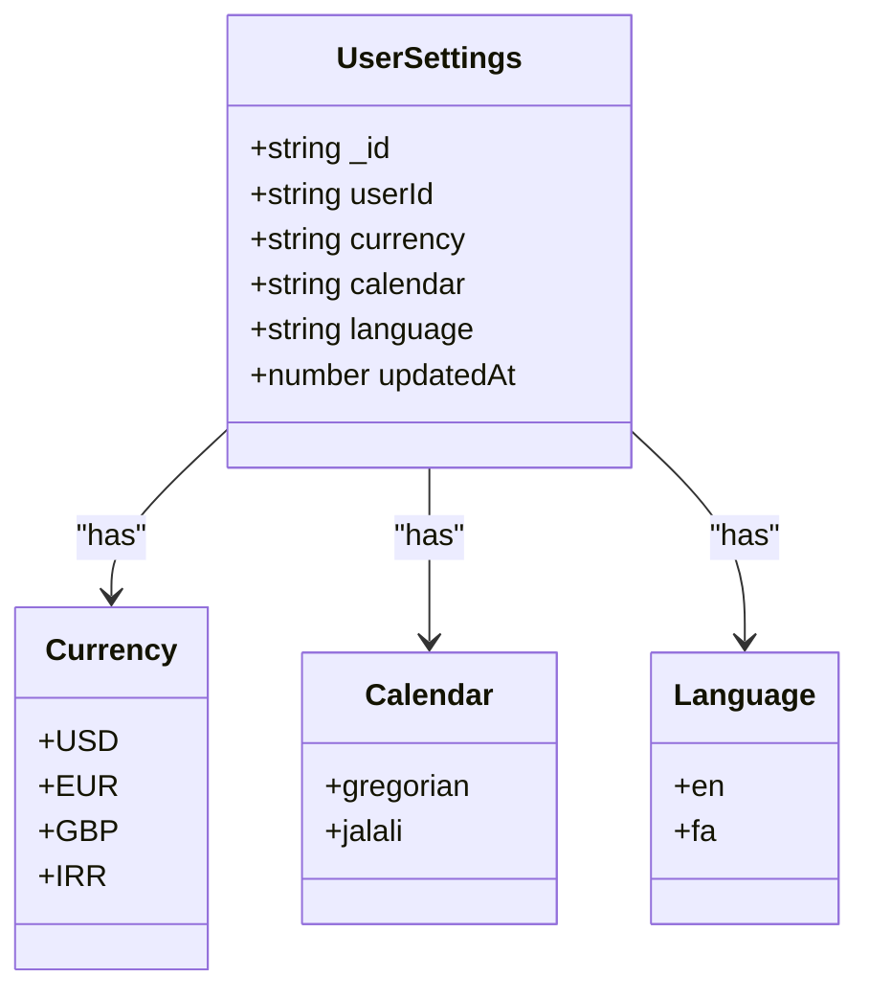
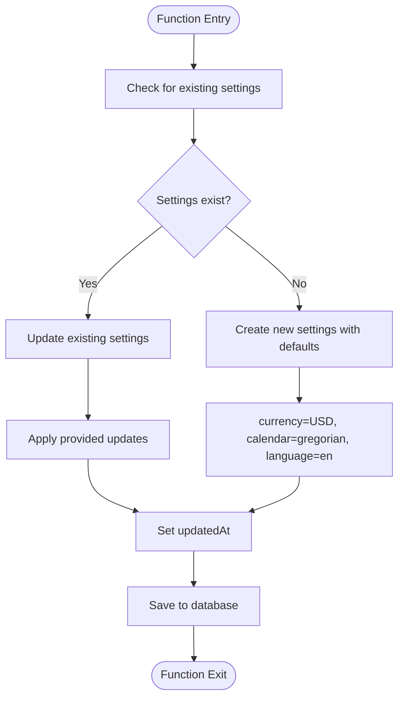
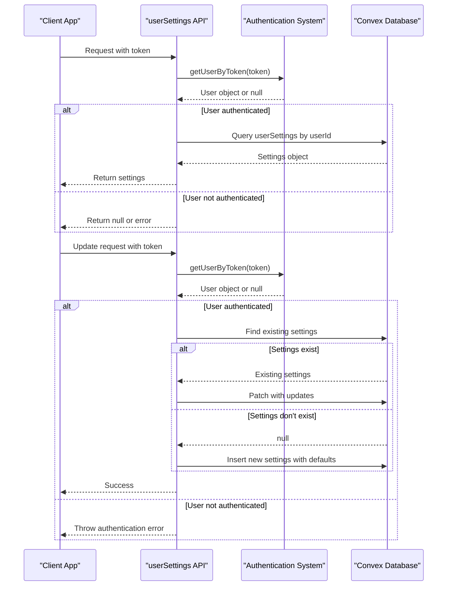
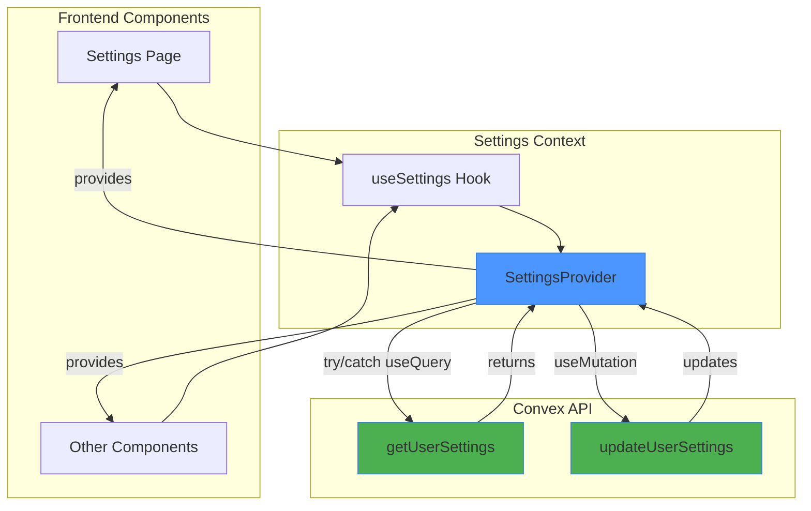
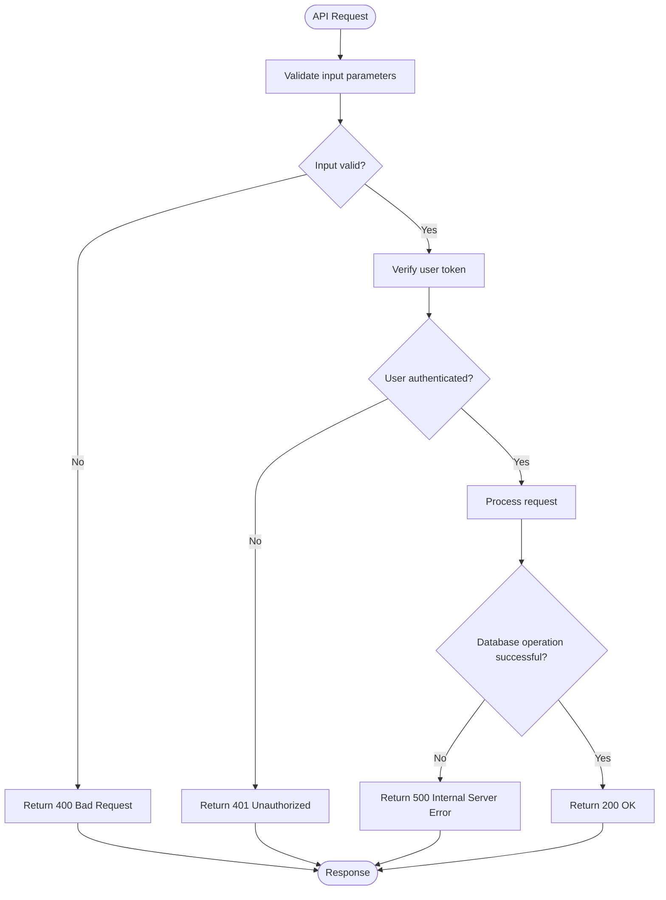
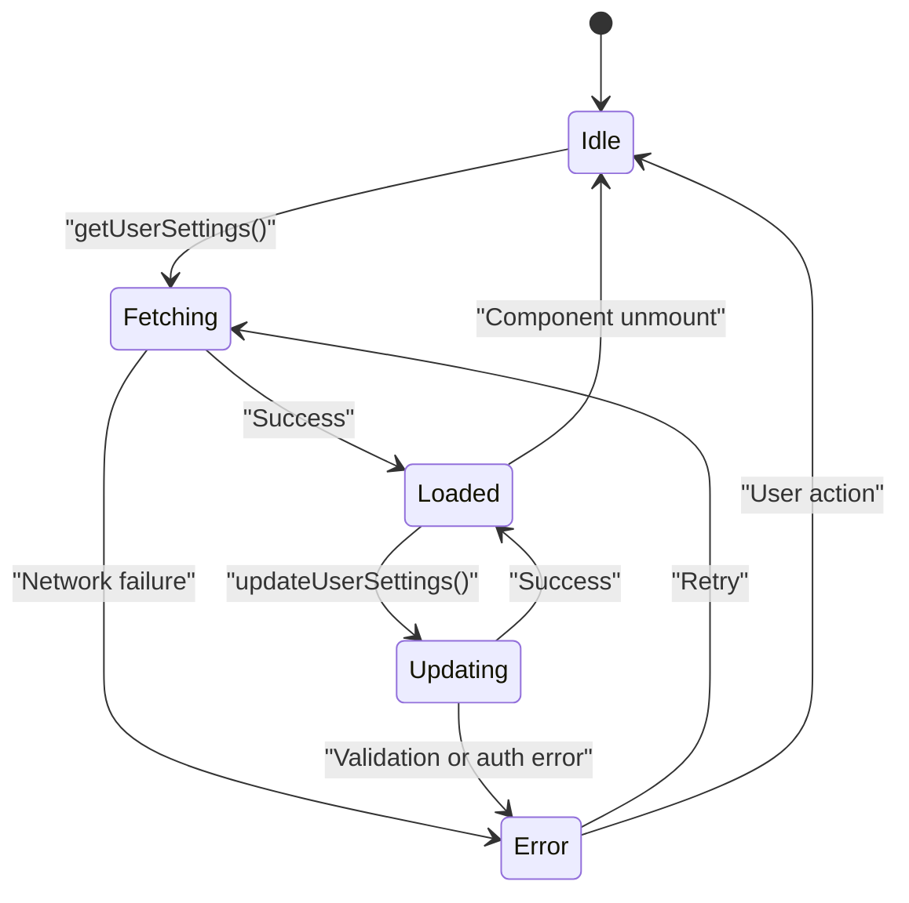

# User Settings API

<cite>
**Referenced Files in This Document**   
- [userSettings.ts](file://convex/userSettings.ts) - *Updated to include language field and enhanced error handling*
- [schema.ts](file://convex/schema.ts) - *Added language field to userSettings table*
- [SettingsContext.tsx](file://src/contexts/SettingsContext.tsx) - *Added try-catch around useQuery for error resilience*
- [page.tsx](file://src/app/settings/page.tsx) - *Uses updated settings context with improved error handling*
- [api.d.ts](file://convex/_generated/api.d.ts) - *Generated types reflect new settings structure*
- [dataModel.d.ts](file://convex/_generated/dataModel.d.ts) - *Includes language type in UserSettings interface*
</cite>

## Update Summary
**Changes Made**   
- Updated function parameters to include optional `language` field
- Added error handling details for query operations in SettingsContext
- Enhanced initialization logic to include default language value
- Updated validation rules to include allowed language codes
- Modified sample payloads to reflect new language parameter
- Added documentation on error resilience in UI integration

## Table of Contents
1. [User Settings API](#user-settings-api)
2. [Function Signatures and Parameters](#function-signatures-and-parameters)
3. [Return Structure and Type Safety](#return-structure-and-type-safety)
4. [Initialization and Default Values](#initialization-and-default-values)
5. [Authentication and Access Control](#authentication-and-access-control)
6. [UI Integration with SettingsContext](#ui-integration-with-settingscontext)
7. [Validation Rules](#validation-rules)
8. [Error Handling](#error-handling)
9. [Sample JSON Payloads](#sample-json-payloads)
10. [Edge Cases and Offline Behavior](#edge-cases-and-offline-behavior)

## Function Signatures and Parameters

The user settings module provides two primary functions: `get` (query) and `update` (mutation), both defined in the Convex backend.

**getUserSettings Function**
- **Function**: `api.userSettings.get`
- **Type**: Query
- **Parameters**:
  - `token`: string (required) - Authentication token used to identify the user

**updateUserSettings Function**
- **Function**: `api.userSettings.update`
- **Type**: Mutation
- **Parameters**:
  - `token`: string (required) - Authentication token
  - `currency`: string (optional) - Currency code
  - `calendar`: string (optional) - Calendar system
  - `language`: string (optional) - Language preference ("en" or "fa")

**Section sources**
- [userSettings.ts](file://convex/userSettings.ts#L10-L58)

## Return Structure and Type Safety

The UserSettings object structure is defined by the data model and includes the following properties:

**UserSettings Object Structure**
```typescript
interface UserSettings {
  _id: Id<"userSettings">;
  userId: Id<"users">;
  currency: "USD" | "EUR" | "GBP" | "IRR";
  calendar: "gregorian" | "jalali";
  language?: "en" | "fa";
  updatedAt: number;
}
```

**Type Safety Enforcement**
The system enforces type safety through:
- Convex-generated types in `_generated/api.d.ts` and `_generated/dataModel.d.ts`
- TypeScript interfaces for Currency, Calendar, and Language types
- Schema validation at the database level



**Diagram sources**
- [schema.ts](file://convex/schema.ts#L55-L61)
- [dataModel.d.ts](file://convex/_generated/dataModel.d.ts)

**Section sources**
- [dataModel.d.ts](file://convex/_generated/dataModel.d.ts)
- [SettingsContext.tsx](file://src/contexts/SettingsContext.tsx#L7-L9)

## Initialization and Default Values

New users are automatically initialized with default settings when they first update their preferences or when settings are first accessed.

**Default Values**
- `currency`: "USD" (US Dollar)
- `calendar`: "gregorian" (Gregorian calendar)
- `language`: "en" (English)

**Initialization Logic**
1. When a user accesses settings for the first time, the system checks for existing settings
2. If no settings exist, new settings are created with default values
3. Default values are applied only when the corresponding parameter is not provided



**Diagram sources**
- [userSettings.ts](file://convex/userSettings.ts#L30-L58)

**Section sources**
- [userSettings.ts](file://convex/userSettings.ts#L30-L58)

## Authentication and Access Control

User settings are strictly tied to the authenticated user's ID and protected from unauthorized access.

**Access Control Mechanism**
1. Authentication token is required for all operations
2. User identity is verified using `getUserByToken` function
3. Settings are retrieved or updated based on the user's ID
4. Users can only access their own settings

**Security Flow**


**Diagram sources**
- [userSettings.ts](file://convex/userSettings.ts#L10-L58)
- [auth.ts](file://convex/auth.ts)

**Section sources**
- [userSettings.ts](file://convex/userSettings.ts#L10-L58)

## UI Integration with SettingsContext

The SettingsContext provides a React context wrapper that integrates the user settings API with the UI components, ensuring real-time consistency across the application.

**SettingsContext Implementation**
```typescript
interface SettingsContextType {
  settings: Doc<"userSettings"> | null | undefined;
  updateSettings: (args: { currency?: Currency; calendar?: Calendar; language?: Language }) => Promise<void>;
  isLoading: boolean;
}
```

**Integration Flow**
1. SettingsProvider uses `useQuery` wrapped in try-catch to fetch current settings
2. Error during query results in null settings and console error logging
3. Settings are made available to all components via React Context
4. `useMutation` enables settings updates from any component
5. UI automatically re-renders when settings change



**Diagram sources**
- [SettingsContext.tsx](file://src/contexts/SettingsContext.tsx)
- [page.tsx](file://src/app/settings/page.tsx)

**Section sources**
- [SettingsContext.tsx](file://src/contexts/SettingsContext.tsx#L1-L67)
- [page.tsx](file://src/app/settings/page.tsx#L1-L217)

## Validation Rules

The system enforces strict validation rules for user settings to ensure data integrity.

**Currency Validation**
- Allowed values: "USD", "EUR", "GBP", "IRR"
- Case-sensitive string literals
- Must be one of the defined currency codes

**Calendar Validation**
- Allowed values: "gregorian", "jalali"
- Case-sensitive string literals
- Must be one of the defined calendar systems

**Language Validation**
- Allowed values: "en", "fa"
- Case-sensitive string literals
- Optional field with default value "en"

**Schema Definition**
```typescript
userSettings: defineTable({
  userId: v.id("users"),
  currency: v.union(
    v.literal("USD"),
    v.literal("EUR"),
    v.literal("GBP"),
    v.literal("IRR")
  ),
  calendar: v.union(v.literal("gregorian"), v.literal("jalali")),
  language: v.optional(v.union(v.literal("en"), v.literal("fa"))),
  updatedAt: v.number(),
}).index("by_user", ["userId"]),
```

**Diagram sources**
- [schema.ts](file://convex/schema.ts#L55-L61)

**Section sources**
- [schema.ts](file://convex/schema.ts#L55-L61)
- [userSettings.ts](file://convex/userSettings.ts#L35-L42)

## Error Handling

The API implements comprehensive error handling for various scenarios.

**HTTP Status Codes and Errors**
- **400 Bad Request**: Invalid input parameters
  - Invalid currency code
  - Invalid calendar type
  - Invalid language code
  - Malformed request body
- **401 Unauthorized**: Authentication failure
  - Invalid or missing token
  - Expired session
- **500 Internal Server Error**: Database or server issues

**Error Handling Implementation**


**Error Scenarios**
- Invalid currency value: Throws validation error
- Invalid calendar value: Throws validation error
- Invalid language value: Throws validation error
- Missing token: Returns null for get, throws error for update
- Database connection issues: Throws internal server error
- Query execution error: Caught and handled in SettingsContext, logs error and sets settings to null

**Section sources**
- [userSettings.ts](file://convex/userSettings.ts#L10-L58)
- [SettingsContext.tsx](file://src/contexts/SettingsContext.tsx#L15-L25)

## Sample JSON Payloads

**Request and Response Examples**

**Get Settings Request**
```json
{
  "token": "eyJhbGciOiJIUzI1NiIsInR5cCI6IkpXVCJ9..."
}
```

**Get Settings Response (Success)**
```json
{
  "_id": "doc123",
  "userId": "user456",
  "currency": "USD",
  "calendar": "gregorian",
  "language": "en",
  "updatedAt": 1700000000000
}
```

**Get Settings Response (No Settings)**
```json
null
```

**Update Settings Request**
```json
{
  "token": "eyJhbGciOiJIUzI1NiIsInR5cCI6IkpXVCJ9...",
  "currency": "EUR",
  "calendar": "jalali",
  "language": "fa"
}
```

**Update Settings Request (Partial Update)**
```json
{
  "token": "eyJhbGciOiJIUzI1NiIsInR5cCI6IkpXVCJ9...",
  "currency": "GBP"
}
```

**Update Settings Response**
```json
{
  "success": true
}
```

**Error Response (400)**
```json
{
  "error": "Invalid currency code. Allowed values: USD, EUR, GBP, IRR"
}
```

**Error Response (401)**
```json
{
  "error": "User not authenticated"
}
```

**Section sources**
- [userSettings.ts](file://convex/userSettings.ts#L10-L58)

## Edge Cases and Offline Behavior

The system handles various edge cases and supports offline usage scenarios.

**Concurrent Updates**
- The system uses atomic database operations
- Last write wins strategy for concurrent updates
- UpdatedAt timestamp ensures freshness tracking

**Offline Usage**
- SettingsContext tracks loading state
- UI shows loading indicator when settings are being fetched
- Update operations are queued and retried when connection is restored
- Error handling provides user feedback for failed operations

**Enhanced Error Resilience**
- SettingsProvider wraps useQuery in try-catch block
- Query errors are logged to console
- On error, settings are set to null instead of propagating error
- Prevents redirect loops and silent failures in error handlers

**Edge Cases**
- **New User**: Settings created with defaults on first update
- **Missing Token**: Update operations fail gracefully with error logging
- **Network Failure**: UI displays appropriate error messages
- **Invalid Data**: Validation prevents corrupt data storage
- **Concurrent Access**: Database transactions ensure data consistency
- **Query Execution Error**: Gracefully handled with null settings and error logging



**Diagram sources**
- [SettingsContext.tsx](file://src/contexts/SettingsContext.tsx)
- [userSettings.ts](file://convex/userSettings.ts)

**Section sources**
- [SettingsContext.tsx](file://src/contexts/SettingsContext.tsx#L1-L67)
- [userSettings.ts](file://convex/userSettings.ts#L10-L58)