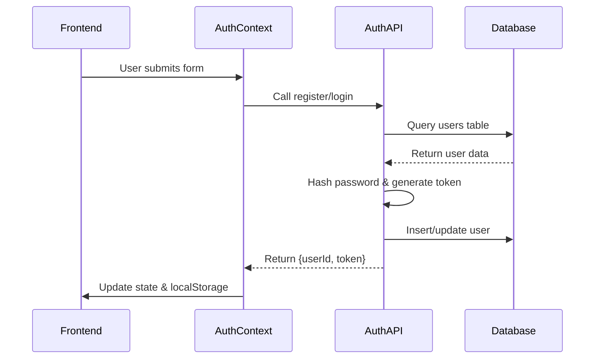
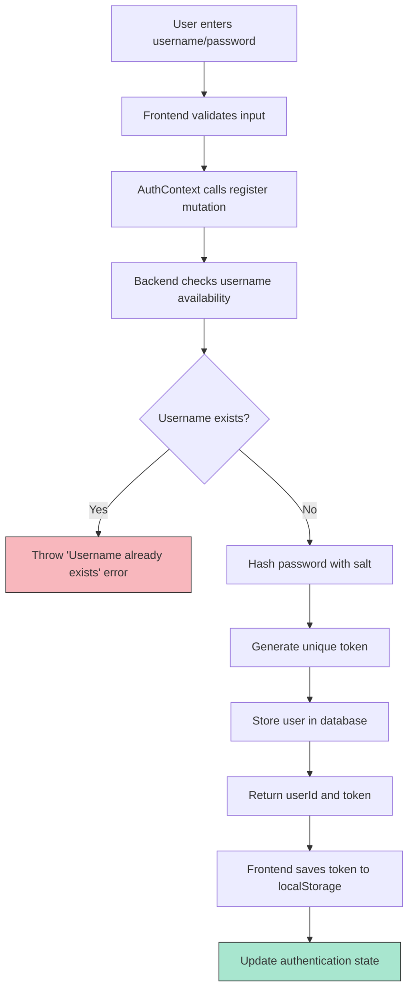
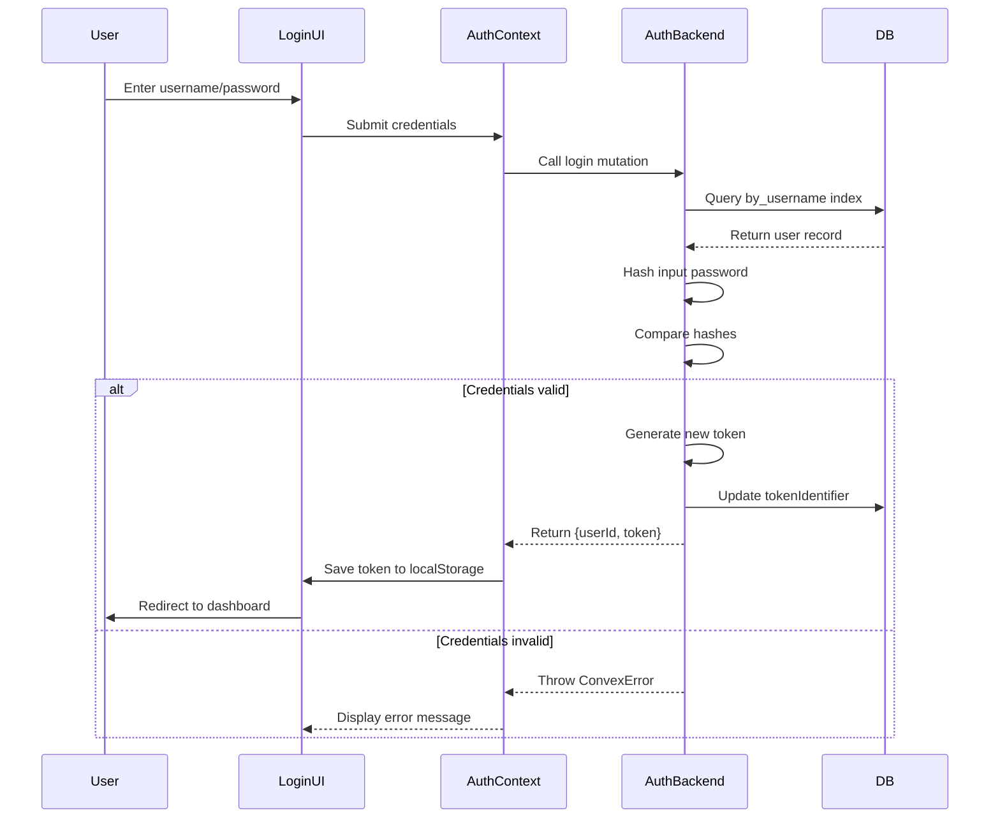
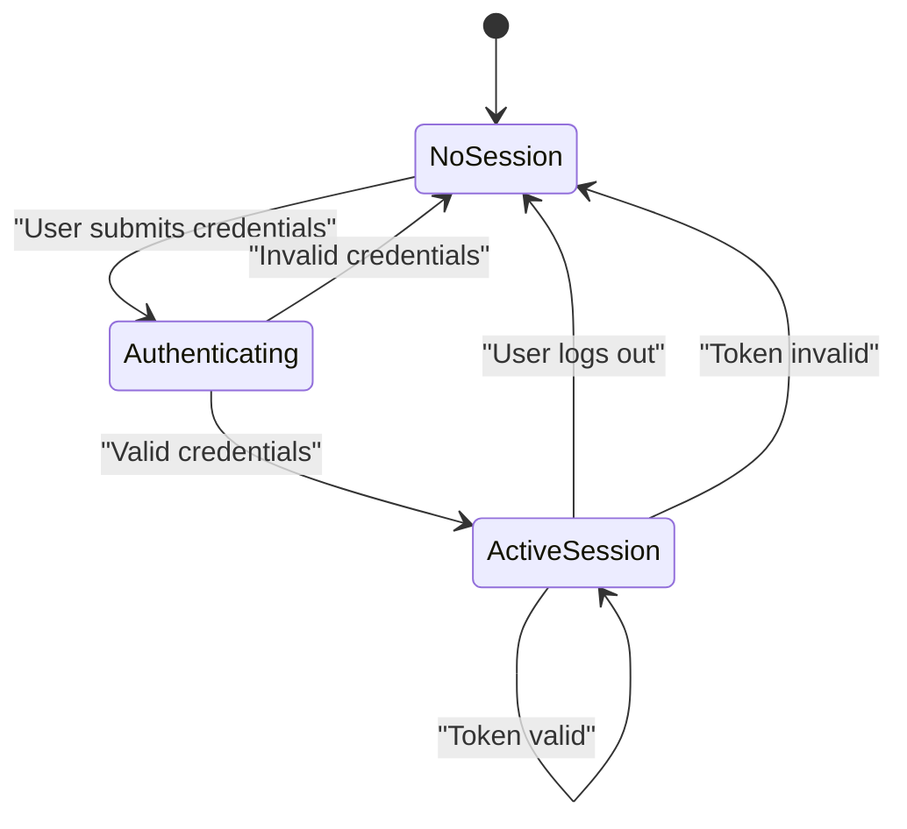
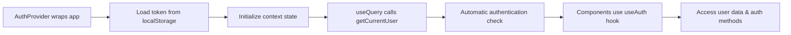
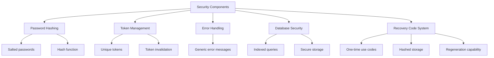
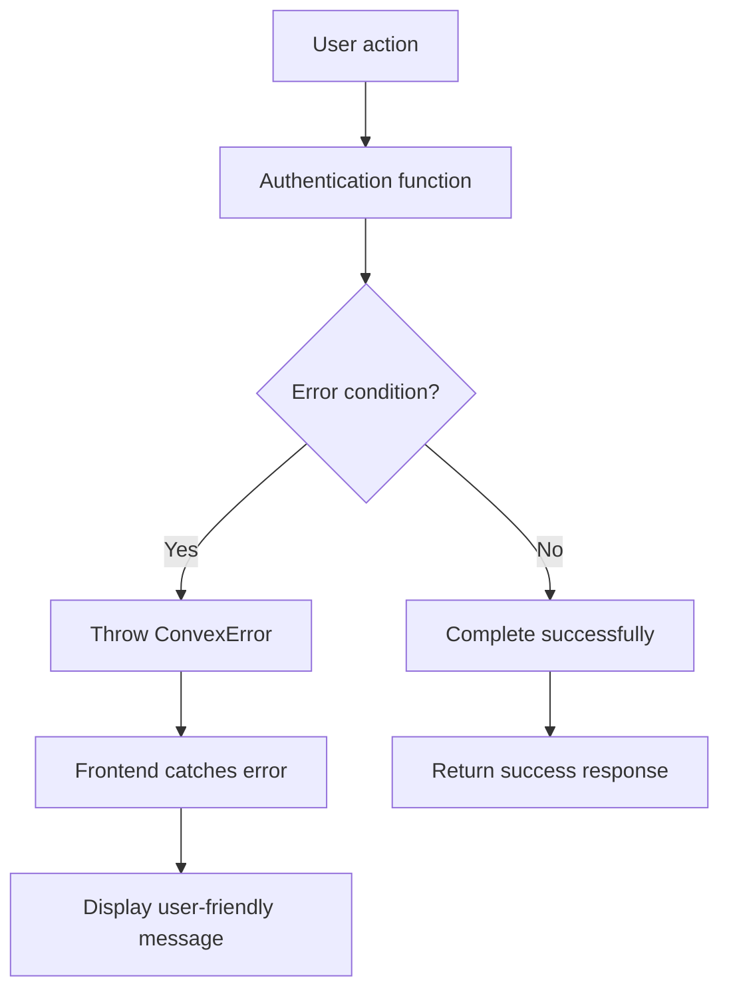
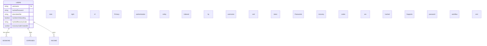
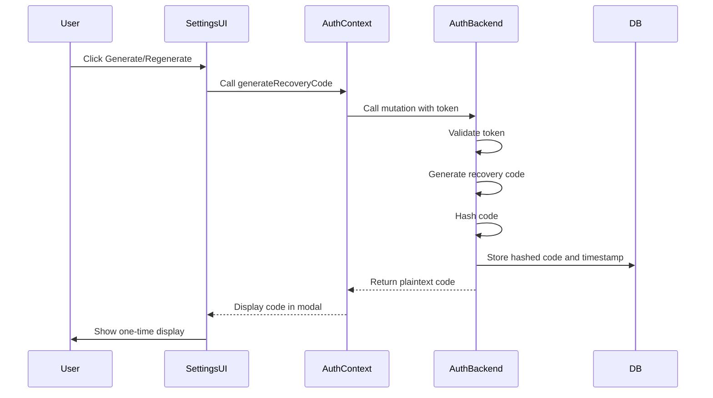

# Authentication System

<cite>
**Referenced Files in This Document**   
- [auth.ts](file://convex/auth.ts) - *Updated with recovery code system in commit c92b549*
- [schema.ts](file://convex/schema.ts) - *Updated with recovery code fields in commit c92b549*
- [AuthContext.tsx](file://src/contexts/AuthContext.tsx)
- [login/page.tsx](file://src/app/login/page.tsx)
- [register/page.tsx](file://src/app/register/page.tsx)
- [forgot-password/page.tsx](file://src/app/forgot-password/page.tsx) - *Added in commit c92b549*
- [reset-password/page.tsx](file://src/app/reset-password/page.tsx) - *Added in commit c92b549*
- [RecoveryCodeCard.tsx](file://src/components/RecoveryCodeCard.tsx) - *Added in commit c92b549*
</cite>

## Update Summary
**Changes Made**   
- Added comprehensive documentation for the new recovery code password reset system
- Updated security implementation section to include recovery code functionality
- Added new sections for password reset flow and recovery code management
- Updated data model section to reflect new database fields
- Enhanced error handling section with new error types
- Added integration details for new frontend components

## Table of Contents
1. [Authentication System](#authentication-system)
2. [Core Authentication Functions](#core-authentication-functions)
3. [User Registration Flow](#user-registration-flow)
4. [Login Process](#login-process)
5. [Session Management](#session-management)
6. [Frontend Integration](#frontend-integration)
7. [Security Implementation](#security-implementation)
8. [Error Handling](#error-handling)
9. [Data Model](#data-model)
10. [Password Reset System](#password-reset-system)
11. [Recovery Code Management](#recovery-code-management)

## Core Authentication Functions

The authentication system is implemented in `auth.ts` and provides four core functions: register, login, getCurrentUser, and logout. These functions leverage Convex's server-side primitives for secure user management.



**Diagram sources**
- [auth.ts](file://convex/auth.ts#L45-L130)
- [AuthContext.tsx](file://src/contexts/AuthContext.tsx#L15-L70)

**Section sources**
- [auth.ts](file://convex/auth.ts#L1-L131)

### Register Function

The register function creates a new user with a hashed password and unique authentication token.

**:Request Signature**
- username: string
- password: string

**:Response Structure**
- userId: Id<"users">
- token: string

**:Implementation Details**
```typescript
export const register = mutation({
  args: {
    username: v.string(),
    password: v.string(),
  },
  handler: async (ctx, args) => {
    // Normalize username to lowercase
    const normalizedUsername = args.username.toLowerCase();

    // Check if user already exists (case-insensitive because we always store lowercase)
    const existingUser = await ctx.db
      .query("users")
      .withIndex("by_username", (q) => q.eq("username", normalizedUsername))
      .first();

    if (existingUser) {
      throw new ConvexError({ message: "Username already exists" });
    }

    // Create new user
    const hashedPassword = hashPassword(args.password);
    const tokenIdentifier = generateToken();

    const user = {
      username: normalizedUsername,
      hashedPassword,
      tokenIdentifier,
      hasSeenOnboarding: false,
    };

    const userId = await ctx.db.insert("users", user);

    // Seed default income categories
    const defaultIncomeCategories = [
      "Salary",
      "Freelance",
      "Investment",
      "Gift",
      "Other",
    ];

    for (const categoryName of defaultIncomeCategories) {
      await ctx.db.insert("incomeCategories", {
        name: categoryName,
        userId: userId,
      });
    }

    return { userId, token: tokenIdentifier };
  },
});
```

**Section sources**
- [auth.ts](file://convex/auth.ts#L45-L80)

### Login Function

The login function validates user credentials and returns a session token for authenticated access.

**:Request Signature**
- username: string
- password: string

**:Response Structure**
- userId: Id<"users">
- token: string

**:Implementation Details**
```typescript
export const login = mutation({
  args: {
    username: v.string(),
    password: v.string(),
  },
  handler: async (ctx, args) => {
    const normalizedUsername = args.username.toLowerCase();
    const user = await ctx.db
      .query("users")
      .withIndex("by_username", (q) => q.eq("username", normalizedUsername))
      .first();

    if (!user) {
      throw new ConvexError({ message: "Username not found" });
    }

    const hashedPassword = hashPassword(args.password);
    if (user.hashedPassword !== hashedPassword) {
      throw new ConvexError({ message: "Incorrect password" });
    }

    // Generate new token
    const tokenIdentifier = generateToken();
    await ctx.db.patch(user._id, { tokenIdentifier });

    return { userId: user._id, token: tokenIdentifier };
  },
});
```

**Section sources**
- [auth.ts](file://convex/auth.ts#L82-L108)

### GetCurrentUser Function

The getCurrentUser function retrieves authenticated user data using a session token.

**:Request Signature**
- token: string

**:Response Structure**
- _id: string | null
- username: string | null

**:Implementation Details**
```typescript
export const getCurrentUser = query({
  args: {
    token: v.string(),
  },
  handler: async (ctx, args) => {
    const user = await ctx.db
      .query("users")
      .withIndex("by_token", (q) => q.eq("tokenIdentifier", args.token))
      .first();

    if (!user) {
      return null;
    }

    return {
      _id: user._id,
      username: user.username,
    };
  },
});
```

**Section sources**
- [auth.ts](file://convex/auth.ts#L110-L128)

### Logout Function

The logout function invalidates the current session token.

**:Request Signature**
- token: string

**:Response Structure**
- success: boolean

**:Implementation Details**
```typescript
export const logout = mutation({
  args: {
    token: v.string(),
  },
  handler: async (ctx, args) => {
    const user = await ctx.db
      .query("users")
      .withIndex("by_token", (q) => q.eq("tokenIdentifier", args.token))
      .first();

    if (user) {
      // Invalidate token
      await ctx.db.patch(user._id, { tokenIdentifier: generateToken() });
    }

    return { success: true };
  },
});
```

**Section sources**
- [auth.ts](file://convex/auth.ts#L130-L143)

## User Registration Flow

The user registration process follows a secure flow from frontend input to database storage.



**Diagram sources**
- [auth.ts](file://convex/auth.ts#L45-L80)
- [register/page.tsx](file://src/app/register/page.tsx#L1-L146)

**Section sources**
- [register/page.tsx](file://src/app/register/page.tsx#L1-L146)

## Login Process

The login process authenticates users by validating their credentials against stored data.



**Diagram sources**
- [auth.ts](file://convex/auth.ts#L82-L108)
- [login/page.tsx](file://src/app/login/page.tsx#L1-L119)

**Section sources**
- [login/page.tsx](file://src/app/login/page.tsx#L1-L119)

## Session Management

The authentication system implements token-based session management for stateless authentication.

**:Token Generation**
```typescript
function generateToken(): string {
  return Math.random().toString(36).substring(2, 15) + Math.random().toString(36).substring(2, 15);
}
```

**:Token Storage Flow**
1. Backend generates token during login/register
2. Token returned to frontend in response
3. Frontend stores token in localStorage
4. Token sent with subsequent getCurrentUser queries
5. Token validated against database record
6. Session invalidated on logout via token regeneration

**:Token Security Features**
- Tokens stored in database using `tokenIdentifier` field
- Indexed for fast lookup via `by_token` index
- Regenerated on each login for security
- Invalidated on logout by updating to new random value



**Diagram sources**
- [auth.ts](file://convex/auth.ts#L35-L43)
- [schema.ts](file://convex/schema.ts#L3-L10)

**Section sources**
- [auth.ts](file://convex/auth.ts#L35-L43)

## Frontend Integration

The AuthContext provides a React context wrapper for seamless authentication integration across the application.

**:AuthContext Interface**
```typescript
interface AuthContextType {
  user: User | null;
  token: string | null;
  login: (username: string, password: string) => Promise<void>;
  register: (username: string, password: string) => Promise<void>;
  logout: () => Promise<void>;
  loading: boolean;
}
```

**:Integration Flow**


**:Key Integration Points**
- **Initialization**: Loads saved token from localStorage on mount
- **State Management**: Maintains user and token state with useState
- **Data Synchronization**: useQuery automatically refreshes user data
- **Mutation Access**: Provides login, register, and logout functions
- **Loading State**: Tracks authentication initialization status

**Section sources**
- [AuthContext.tsx](file://src/contexts/AuthContext.tsx#L1-L96)

## Security Implementation

The authentication system implements several security measures to protect user data.

### Password Hashing

**:Current Implementation**
```typescript
function hashPassword(password: string): string {
  let hash = 0;
  const saltedPassword = password + "expense-tracker-salt";
  for (let i = 0; i < saltedPassword.length; i++) {
    const char = saltedPassword.charCodeAt(i);
    hash = ((hash << 5) - hash) + char;
    hash = hash & hash;
  }
  return hash.toString(36);
}
```

**:Security Notes**
- **Salt**: Uses static salt "expense-tracker-salt"
- **Algorithm**: Simple 32-bit integer hash (for demo purposes)
- **Production Recommendation**: Should use bcrypt or similar

### Recovery Code Security

The system now includes a recovery code mechanism for password resets, adding an additional layer of security.

**:Recovery Code Generation**
```typescript
function createRecoveryCode(): string {
  const chars = 'ABCDEFGHIJKLMNOPQRSTUVWXYZ0123456789';
  let result = '';
  for (let i = 0; i < 10; i++) {
    result += chars.charAt(Math.floor(Math.random() * chars.length));
  }
  // Format as AB12-CD34-EF
  return `${result.slice(0, 4)}-${result.slice(4, 8)}-${result.slice(8)}`;
}
```

**:Recovery Code Hashing**
```typescript
function hashRecoveryCode(recoveryCode: string): string {
  return hashPassword(recoveryCode);
}
```

**:Security Features**
- Recovery codes are 10-character alphanumeric strings formatted with hyphens
- Codes are hashed before storage using the same method as passwords
- Each code is associated with a creation timestamp
- Users can regenerate codes, invalidating previous ones
- The system prevents reuse of old recovery codes

### Security Best Practices

**:Implemented Features**
- **Input Validation**: Server-side validation using Convex values
- **Error Handling**: Generic error messages to prevent username enumeration
- **Token Regeneration**: New token on each login
- **Token Invalidaiton**: Token updated on logout
- **Indexing**: Database indexes for efficient token and username lookup
- **Recovery Code System**: Secure password reset mechanism

**:Recommended Enhancements**
- Implement rate limiting for login attempts
- Use bcrypt or Argon2 for password hashing
- Add token expiration mechanism
- Implement refresh tokens
- Add multi-factor authentication option



**Section sources**
- [auth.ts](file://convex/auth.ts#L15-L43)
- [schema.ts](file://convex/schema.ts#L3-L10)

## Error Handling

The authentication system uses ConvexError for consistent error handling across functions.

**:Error Types**
- **"Username already exists"**: Thrown when registering with existing username
- **"Username not found"**: Thrown for invalid login credentials
- **"Incorrect password"**: Thrown for invalid login credentials
- **"Invalid recovery code"**: Thrown when recovery code is not found
- **"Password must be at least 6 characters long"**: Thrown when new password is too short
- **"Authentication required"**: Thrown when user is not authenticated

**:Error Flow**


**:Frontend Error Handling**
```typescript
const handleSubmit = async (e: React.FormEvent) => {
  e.preventDefault();
  setIsLoading(true);
  try {
    await login(username.trim(), password);
    router.push("/expenses");
  } catch (error: unknown) {
    const message = error instanceof Error ? error.message : "Failed to login";
    toast.error(message);
  } finally {
    setIsLoading(false);
  }
};
```

**Section sources**
- [auth.ts](file://convex/auth.ts#L47-L81)
- [login/page.tsx](file://src/app/login/page.tsx#L45-L55)

## Data Model

The user authentication data model is defined in the Convex schema with appropriate indexes for performance.

**:User Table Schema**
```typescript
users: defineTable({
  username: v.string(),
  hashedPassword: v.string(),
  tokenIdentifier: v.string(),
  hasSeenOnboarding: v.optional(v.boolean()),
  hashedRecoveryCode: v.optional(v.string()),
  recoveryCodeCreatedAt: v.optional(v.number()),
}).index("by_username", ["username"]).index("by_token", ["tokenIdentifier"]),
```

**:Database Indexes**
- **by_username**: Enables fast lookup by username for login/register
- **by_token**: Enables fast session validation by token

**:Field Descriptions**
- **username**: Unique identifier for user login (stored lowercase)
- **hashedPassword**: Salted and hashed password (not stored in plain text)
- **tokenIdentifier**: Current active session token
- **hasSeenOnboarding**: Optional flag for onboarding flow tracking
- **hashedRecoveryCode**: Hashed recovery code for password reset
- **recoveryCodeCreatedAt**: Timestamp when recovery code was created



**Diagram sources**
- [schema.ts](file://convex/schema.ts#L3-L10)

**Section sources**
- [schema.ts](file://convex/schema.ts#L3-L10)

## Password Reset System

The password reset system allows users to recover their accounts using a recovery code mechanism.

**:Reset Flow Overview**
1. User navigates to forgot-password page
2. User enters recovery code
3. System validates recovery code
4. User is redirected to reset-password page with code
5. User enters new password
6. System verifies code and updates password
7. User is logged in with new credentials

**:Request/Response Signatures**

**:validateRecoveryCode Mutation**
- Request: { recoveryCode: string }
- Response: { userId: Id<"users">, username: string }

**:resetPasswordWithRecoveryCode Mutation**
- Request: { recoveryCode: string, newPassword: string }
- Response: { userId: Id<"users">, token: string }

**:Implementation Details**
```typescript
export const validateRecoveryCode = mutation({
  args: {
    recoveryCode: v.string(),
  },
  handler: async (ctx, args) => {
    const hashedRecoveryCode = hashRecoveryCode(args.recoveryCode);
    
    const users = await ctx.db.query("users").collect();
    const user = users.find(u => u.hashedRecoveryCode === hashedRecoveryCode);

    if (!user) {
      throw new ConvexError({ message: "Invalid recovery code" });
    }

    return { userId: user._id, username: user.username };
  },
});

export const resetPasswordWithRecoveryCode = mutation({
  args: {
    recoveryCode: v.string(),
    newPassword: v.string(),
  },
  handler: async (ctx, args) => {
    if (args.newPassword.length < 6) {
      throw new ConvexError({ message: "Password must be at least 6 characters long" });
    }

    const hashedRecoveryCode = hashRecoveryCode(args.recoveryCode);
    
    const users = await ctx.db.query("users").collect();
    const user = users.find(u => u.hashedRecoveryCode === hashedRecoveryCode);

    if (!user) {
      throw new ConvexError({ message: "Invalid recovery code" });
    }

    const hashedPassword = hashPassword(args.newPassword);
    const tokenIdentifier = generateToken();

    await ctx.db.patch(user._id, {
      hashedPassword,
      tokenIdentifier,
    });

    return { userId: user._id, token: tokenIdentifier };
  },
});
```

**Section sources**
- [auth.ts](file://convex/auth.ts#L211-L259)
- [forgot-password/page.tsx](file://src/app/forgot-password/page.tsx#L1-L113)
- [reset-password/page.tsx](file://src/app/reset-password/page.tsx#L1-L227)

## Recovery Code Management

Users can generate and manage recovery codes through the settings interface.

**:Generation Flow**
1. Authenticated user accesses settings
2. User clicks "Generate" or "Regenerate" button
3. System creates new recovery code
4. Code is displayed once in modal
5. User must save code before closing modal
6. Code is hashed and stored in database

**:Frontend Component**
The RecoveryCodeCard component manages the UI for recovery code generation:

```typescript
export function RecoveryCodeCard() {
  const { token } = useAuth();
  const [showGenerateModal, setShowGenerateModal] = useState(false);
  const [generatedCode, setGeneratedCode] = useState<string | null>(null);
  const [isCodeVisible, setIsCodeVisible] = useState(false);
  const [isCopied, setIsCopied] = useState(false);

  const hasRecoveryCode = useQuery(api.auth.hasRecoveryCode, token ? { token } : "skip");
  const generateRecoveryMutation = useMutation(api.auth.generateRecoveryCode);

  const handleGenerateCode = async () => {
    if (!token) return;
    
    try {
      const result = await generateRecoveryMutation({ token });
      setGeneratedCode(result.recoveryCode);
      setShowGenerateModal(true);
      toast.success("Recovery code generated successfully!");
    } catch (error: any) {
      toast.error(error.message || "Failed to generate recovery code");
    }
  };
  // ... rest of implementation
}
```

**:Security Considerations**
- Recovery codes are only shown once after generation
- Users are warned about the sensitivity of recovery codes
- Codes can be regenerated, invalidating previous ones
- The system prevents brute force attacks by not revealing which part of the code is incorrect



**Diagram sources**
- [auth.ts](file://convex/auth.ts#L172-L193)
- [RecoveryCodeCard.tsx](file://src/components/RecoveryCodeCard.tsx#L1-L155)

**Section sources**
- [auth.ts](file://convex/auth.ts#L172-L193)
- [RecoveryCodeCard.tsx](file://src/components/RecoveryCodeCard.tsx#L1-L155)
- [settings/page.tsx](file://src/app/settings/page.tsx#L182-L210)