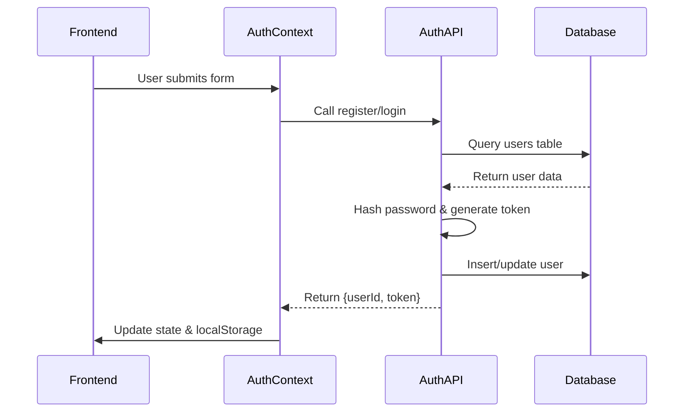
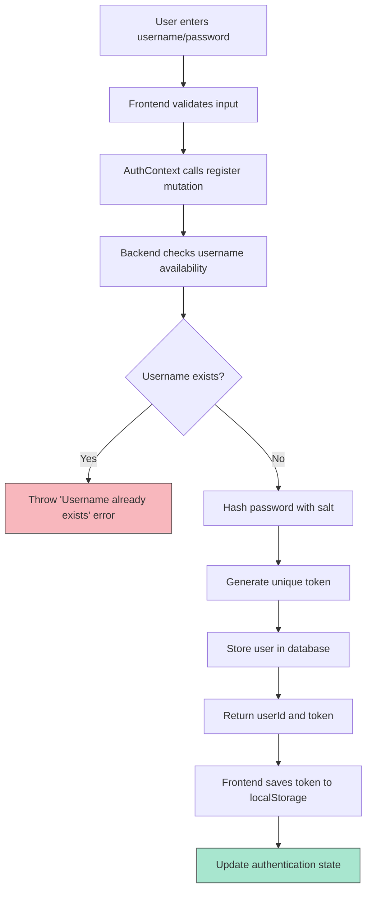
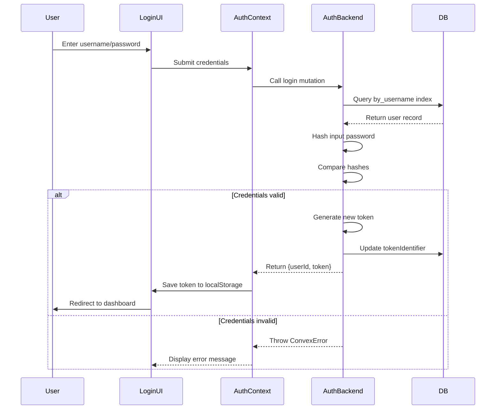
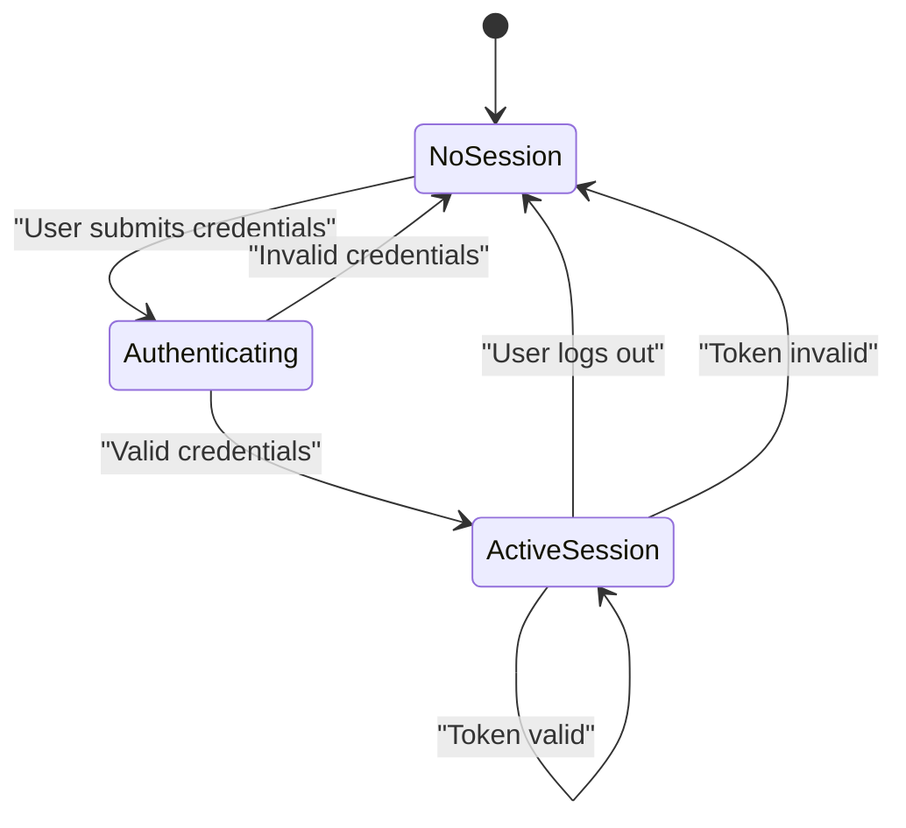
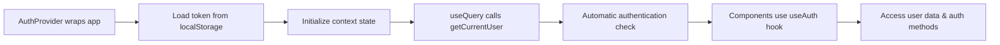
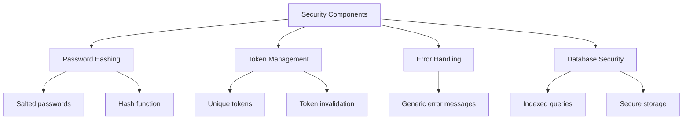
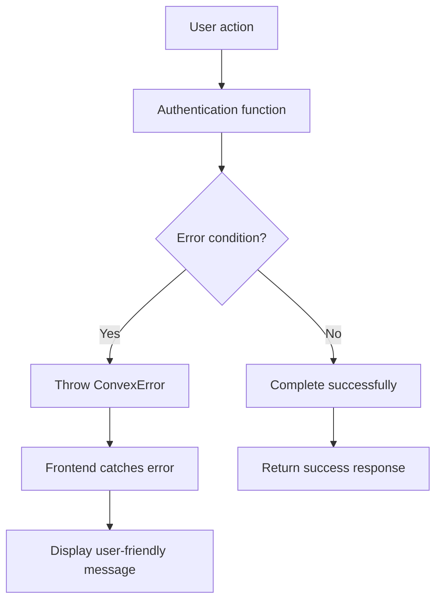
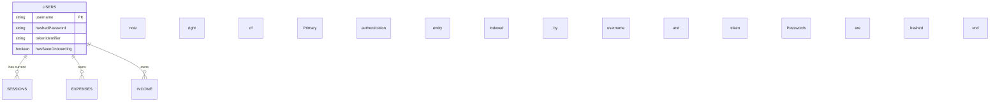

# Authentication System

<cite>
**Referenced Files in This Document**   
- [auth.ts](file://convex/auth.ts)
- [AuthContext.tsx](file://src/contexts/AuthContext.tsx)
- [schema.ts](file://convex/schema.ts)
- [login/page.tsx](file://src/app/login/page.tsx)
- [register/page.tsx](file://src/app/register/page.tsx)
</cite>

## Table of Contents
1. [Authentication System](#authentication-system)
2. [Core Authentication Functions](#core-authentication-functions)
3. [User Registration Flow](#user-registration-flow)
4. [Login Process](#login-process)
5. [Session Management](#session-management)
6. [Frontend Integration](#frontend-integration)
7. [Security Implementation](#security-implementation)
8. [Error Handling](#error-handling)
9. [Data Model](#data-model)

## Core Authentication Functions

The authentication system is implemented in `auth.ts` and provides four core functions: register, login, getCurrentUser, and logout. These functions leverage Convex's server-side primitives for secure user management.



**Diagram sources**
- [auth.ts](file://convex/auth.ts#L45-L130)
- [AuthContext.tsx](file://src/contexts/AuthContext.tsx#L15-L70)

**Section sources**
- [auth.ts](file://convex/auth.ts#L1-L131)

### Register Function

The register function creates a new user with a hashed password and unique authentication token.

**:Request Signature**
- username: string
- password: string

**:Response Structure**
- userId: Id<"users">
- token: string

**:Implementation Details**
```typescript
export const register = mutation({
  args: {
    username: v.string(),
    password: v.string(),
  },
  handler: async (ctx, args) => {
    // Check for existing user
    const existingUser = await ctx.db
      .query("users")
      .withIndex("by_username", (q) => q.eq("username", args.username))
      .first();

    if (existingUser) {
      throw new ConvexError("Username already exists");
    }

    // Create new user with hashed password and token
    const hashedPassword = hashPassword(args.password);
    const tokenIdentifier = generateToken();

    const userId = await ctx.db.insert("users", {
      username: args.username,
      hashedPassword,
      tokenIdentifier,
    });

    return { userId, token: tokenIdentifier };
  },
});
```

**Section sources**
- [auth.ts](file://convex/auth.ts#L45-L65)

### Login Function

The login function validates user credentials and returns a session token for authenticated access.

**:Request Signature**
- username: string
- password: string

**:Response Structure**
- userId: Id<"users">
- token: string

**:Implementation Details**
```typescript
export const login = mutation({
  args: {
    username: v.string(),
    password: v.string(),
  },
  handler: async (ctx, args) => {
    const user = await ctx.db
      .query("users")
      .withIndex("by_username", (q) => q.eq("username", args.username))
      .first();

    if (!user) {
      throw new ConvexError("Invalid username or password");
    }

    const hashedPassword = hashPassword(args.password);
    if (user.hashedPassword !== hashedPassword) {
      throw new ConvexError("Invalid username or password");
    }

    // Generate new token
    const tokenIdentifier = generateToken();
    await ctx.db.patch(user._id, { tokenIdentifier });

    return { userId: user._id, token: tokenIdentifier };
  },
});
```

**Section sources**
- [auth.ts](file://convex/auth.ts#L67-L95)

### GetCurrentUser Function

The getCurrentUser function retrieves authenticated user data using a session token.

**:Request Signature**
- token: string

**:Response Structure**
- _id: string | null
- username: string | null

**:Implementation Details**
```typescript
export const getCurrentUser = query({
  args: {
    token: v.string(),
  },
  handler: async (ctx, args) => {
    const user = await ctx.db
      .query("users")
      .withIndex("by_token", (q) => q.eq("tokenIdentifier", args.token))
      .first();

    if (!user) {
      return null;
    }

    return {
      _id: user._id,
      username: user.username,
    };
  },
});
```

**Section sources**
- [auth.ts](file://convex/auth.ts#L97-L115)

### Logout Function

The logout function invalidates the current session token.

**:Request Signature**
- token: string

**:Response Structure**
- success: boolean

**:Implementation Details**
```typescript
export const logout = mutation({
  args: {
    token: v.string(),
  },
  handler: async (ctx, args) => {
    const user = await ctx.db
      .query("users")
      .withIndex("by_token", (q) => q.eq("tokenIdentifier", args.token))
      .first();

    if (user) {
      // Invalidate token
      await ctx.db.patch(user._id, { tokenIdentifier: generateToken() });
    }

    return { success: true };
  },
});
```

**Section sources**
- [auth.ts](file://convex/auth.ts#L117-L130)

## User Registration Flow

The user registration process follows a secure flow from frontend input to database storage.



**Diagram sources**
- [auth.ts](file://convex/auth.ts#L45-L65)
- [register/page.tsx](file://src/app/register/page.tsx#L1-L146)

**Section sources**
- [register/page.tsx](file://src/app/register/page.tsx#L1-L146)

## Login Process

The login process authenticates users by validating their credentials against stored data.



**Diagram sources**
- [auth.ts](file://convex/auth.ts#L67-L95)
- [login/page.tsx](file://src/app/login/page.tsx#L1-L119)

**Section sources**
- [login/page.tsx](file://src/app/login/page.tsx#L1-L119)

## Session Management

The authentication system implements token-based session management for stateless authentication.

**:Token Generation**
```typescript
function generateToken(): string {
  return Math.random().toString(36).substring(2, 15) + Math.random().toString(36).substring(2, 15);
}
```

**:Token Storage Flow**
1. Backend generates token during login/register
2. Token returned to frontend in response
3. Frontend stores token in localStorage
4. Token sent with subsequent getCurrentUser queries
5. Token validated against database record
6. Session invalidated on logout via token regeneration

**:Token Security Features**
- Tokens stored in database using `tokenIdentifier` field
- Indexed for fast lookup via `by_token` index
- Regenerated on each login for security
- Invalidated on logout by updating to new random value



**Diagram sources**
- [auth.ts](file://convex/auth.ts#L35-L43)
- [schema.ts](file://convex/schema.ts#L3-L10)

**Section sources**
- [auth.ts](file://convex/auth.ts#L35-L43)

## Frontend Integration

The AuthContext provides a React context wrapper for seamless authentication integration across the application.

**:AuthContext Interface**
```typescript
interface AuthContextType {
  user: User | null;
  token: string | null;
  login: (username: string, password: string) => Promise<void>;
  register: (username: string, password: string) => Promise<void>;
  logout: () => Promise<void>;
  loading: boolean;
}
```

**:Integration Flow**


**:Key Integration Points**
- **Initialization**: Loads saved token from localStorage on mount
- **State Management**: Maintains user and token state with useState
- **Data Synchronization**: useQuery automatically refreshes user data
- **Mutation Access**: Provides login, register, and logout functions
- **Loading State**: Tracks authentication initialization status

**Section sources**
- [AuthContext.tsx](file://src/contexts/AuthContext.tsx#L1-L96)

## Security Implementation

The authentication system implements several security measures to protect user data.

### Password Hashing

**:Current Implementation**
```typescript
function hashPassword(password: string): string {
  let hash = 0;
  const saltedPassword = password + "expense-tracker-salt";
  for (let i = 0; i < saltedPassword.length; i++) {
    const char = saltedPassword.charCodeAt(i);
    hash = ((hash << 5) - hash) + char;
    hash = hash & hash;
  }
  return hash.toString(36);
}
```

**:Security Notes**
- **Salt**: Uses static salt "expense-tracker-salt"
- **Algorithm**: Simple 32-bit integer hash (for demo purposes)
- **Production Recommendation**: Should use bcrypt or similar

### Security Best Practices

**:Implemented Features**
- **Input Validation**: Server-side validation using Convex values
- **Error Handling**: Generic error messages to prevent username enumeration
- **Token Regeneration**: New token on each login
- **Token Invalidaiton**: Token updated on logout
- **Indexing**: Database indexes for efficient token and username lookup

**:Recommended Enhancements**
- Implement rate limiting for login attempts
- Use bcrypt or Argon2 for password hashing
- Add token expiration mechanism
- Implement refresh tokens
- Add multi-factor authentication option



**Section sources**
- [auth.ts](file://convex/auth.ts#L15-L43)

## Error Handling

The authentication system uses ConvexError for consistent error handling across functions.

**:Error Types**
- **"Username already exists"**: Thrown when registering with existing username
- **"Invalid username or password"**: Thrown for invalid login credentials

**:Error Flow**


**:Frontend Error Handling**
```typescript
const handleSubmit = async (e: React.FormEvent) => {
  e.preventDefault();
  setIsLoading(true);
  try {
    await login(username.trim(), password);
    router.push("/expenses");
  } catch (error: unknown) {
    const message = error instanceof Error ? error.message : "Failed to login";
    toast.error(message);
  } finally {
    setIsLoading(false);
  }
};
```

**Section sources**
- [auth.ts](file://convex/auth.ts#L47-L81)
- [login/page.tsx](file://src/app/login/page.tsx#L45-L55)

## Data Model

The user authentication data model is defined in the Convex schema with appropriate indexes for performance.

**:User Table Schema**
```typescript
users: defineTable({
  username: v.string(),
  hashedPassword: v.string(),
  tokenIdentifier: v.string(),
  hasSeenOnboarding: v.optional(v.boolean()),
}).index("by_username", ["username"]).index("by_token", ["tokenIdentifier"]),
```

**:Database Indexes**
- **by_username**: Enables fast lookup by username for login/register
- **by_token**: Enables fast session validation by token

**:Field Descriptions**
- **username**: Unique identifier for user login
- **hashedPassword**: Salted and hashed password (not stored in plain text)
- **tokenIdentifier**: Current active session token
- **hasSeenOnboarding**: Optional flag for onboarding flow tracking



**Diagram sources**
- [schema.ts](file://convex/schema.ts#L3-L10)

**Section sources**
- [schema.ts](file://convex/schema.ts#L3-L10)