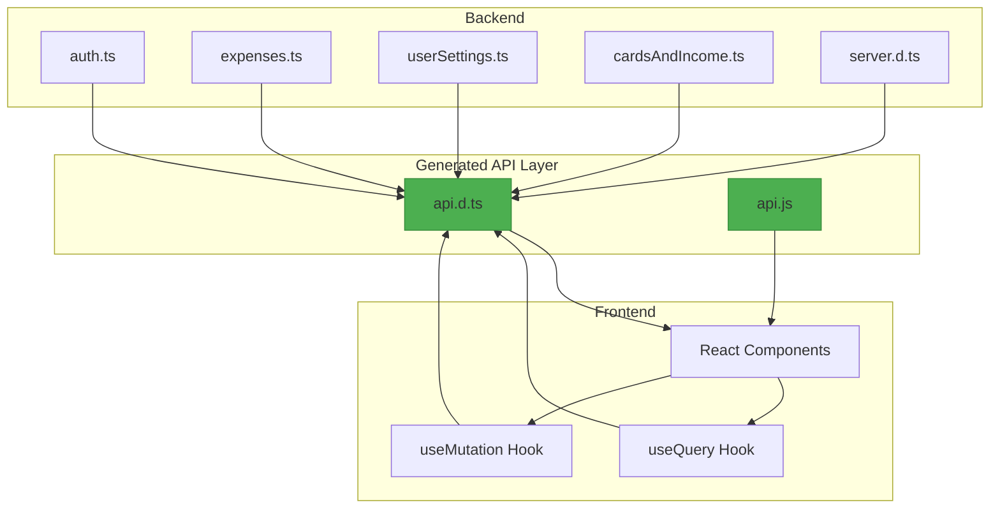
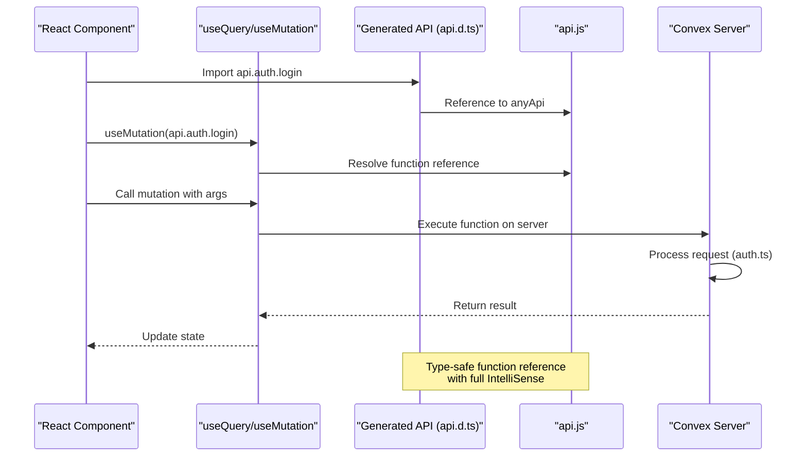
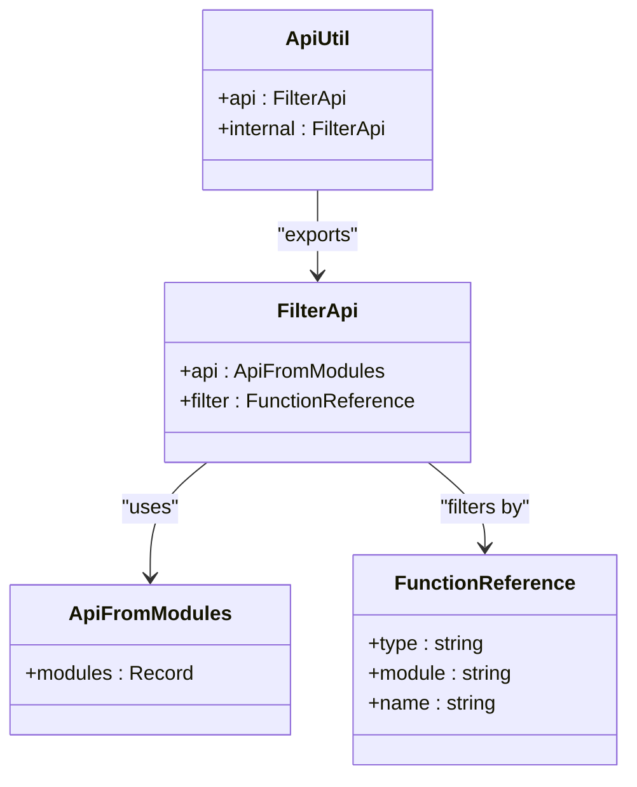
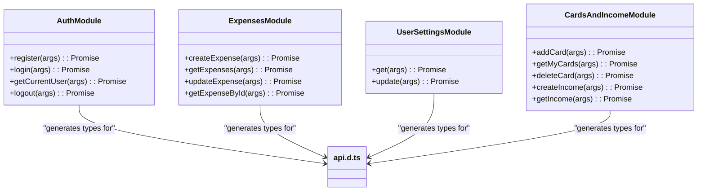
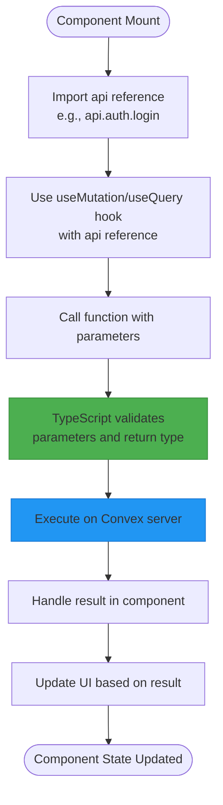
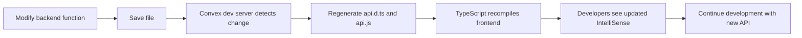

# Auto-Generated API Layer

<cite>
**Referenced Files in This Document**   
- [api.d.ts](file://convex/_generated/api.d.ts)
- [api.js](file://convex/_generated/api.js)
- [server.d.ts](file://convex/_generated/server.d.ts)
- [auth.ts](file://convex/auth.ts)
- [expenses.ts](file://convex/expenses.ts)
- [userSettings.ts](file://convex/userSettings.ts)
- [cardsAndIncome.ts](file://convex/cardsAndIncome.ts)
- [dataModel.d.ts](file://convex/_generated/dataModel.d.ts)
- [AuthContext.tsx](file://src/contexts/AuthContext.tsx)
- [SettingsContext.tsx](file://src/contexts/SettingsContext.tsx)
- [page.tsx](file://src/app/expenses/page.tsx)
- [page.tsx](file://src/app/dashboard/page.tsx)
- [page.tsx](file://src/app/settings/page.tsx)
- [page.tsx](file://src/app/onboarding/page.tsx)
</cite>

## Table of Contents
1. [Introduction](#introduction)
2. [Project Structure](#project-structure)
3. [Core Components](#core-components)
4. [Architecture Overview](#architecture-overview)
5. [Detailed Component Analysis](#detailed-component-analysis)
6. [Development Workflow and Versioning](#development-workflow-and-versioning)
7. [Troubleshooting Guide](#troubleshooting-guide)
8. [Conclusion](#conclusion)

## Introduction
The auto-generated API layer in the `_generated` directory is a critical component of the Convex backend system that enables type-safe communication between the frontend and backend. This documentation provides a comprehensive analysis of how Convex automatically generates client-facing interfaces from backend functions defined in `auth.ts`, `expenses.ts`, `userSettings.ts`, and `cardsAndIncome.ts`. The generated files—`api.d.ts`, `api.js`, and `server.d.ts`—create a seamless development experience by providing full IntelliSense support and type safety for API calls from React components using `useMutation` and `useQuery` hooks.

## Project Structure
The project follows a clear separation between backend logic in the `convex` directory and frontend components in the `src` directory. The auto-generated API layer resides in `convex/_generated` and serves as the bridge between these two domains.



**Diagram sources**
- [api.d.ts](file://convex/_generated/api.d.ts)
- [auth.ts](file://convex/auth.ts)
- [expenses.ts](file://convex/expenses.ts)

**Section sources**
- [api.d.ts](file://convex/_generated/api.d.ts)
- [auth.ts](file://convex/auth.ts)

## Core Components
The auto-generated API layer consists of three main files that work together to provide type-safe access to backend functions:

1. **api.d.ts**: Contains type definitions for the client-facing API
2. **api.js**: Provides the runtime implementation of the API references
3. **server.d.ts**: Defines server-side types and utilities for implementing Convex functions

These components enable developers to call backend functions from the frontend with full type safety and IntelliSense support, eliminating common errors related to API endpoint names, parameter types, and return value structures.

**Section sources**
- [api.d.ts](file://convex/_generated/api.d.ts)
- [api.js](file://convex/_generated/api.js)
- [server.d.ts](file://convex/_generated/server.d.ts)

## Architecture Overview
The auto-generated API layer follows a proxy pattern where Convex creates type-safe references to backend functions that can be imported and used directly in frontend components. This architecture ensures that all API calls are type-checked at compile time, providing immediate feedback on potential errors.



**Diagram sources**
- [api.d.ts](file://convex/_generated/api.d.ts)
- [api.js](file://convex/_generated/api.js)
- [auth.ts](file://convex/auth.ts)

## Detailed Component Analysis

### Generated API Type Definitions (api.d.ts)
The `api.d.ts` file contains the type definitions that enable IntelliSense and type checking for all API calls. It uses TypeScript's type system to create a type-safe interface to the backend functions.



**Diagram sources**
- [api.d.ts](file://convex/_generated/api.d.ts)

**Section sources**
- [api.d.ts](file://convex/_generated/api.d.ts)

### Backend Function Modules
The backend functions in `auth.ts`, `expenses.ts`, `userSettings.ts`, and `cardsAndIncome.ts` are the source of truth for the generated API. Each function is defined using Convex's `mutation` and `query` builders, which provide type safety and structure.



**Diagram sources**
- [auth.ts](file://convex/auth.ts)
- [expenses.ts](file://convex/expenses.ts)
- [userSettings.ts](file://convex/userSettings.ts)
- [cardsAndIncome.ts](file://convex/cardsAndIncome.ts)

**Section sources**
- [auth.ts](file://convex/auth.ts)
- [expenses.ts](file://convex/expenses.ts)
- [userSettings.ts](file://convex/userSettings.ts)
- [cardsAndIncome.ts](file://convex/cardsAndIncome.ts)

### Frontend Usage Patterns
React components use the generated API through Convex's `useQuery` and `useMutation` hooks, which provide a declarative way to interact with backend functions while maintaining type safety.



**Diagram sources**
- [page.tsx](file://src/app/expenses/page.tsx)
- [AuthContext.tsx](file://src/contexts/AuthContext.tsx)

**Section sources**
- [page.tsx](file://src/app/expenses/page.tsx)
- [AuthContext.tsx](file://src/contexts/AuthContext.tsx)

## Development Workflow and Versioning
The development workflow for the auto-generated API layer is designed to be seamless and automatic. When developers modify backend functions in the Convex modules, the API layer is automatically regenerated to reflect these changes.

### Development Workflow


**Diagram sources**
- [api.d.ts](file://convex/_generated/api.d.ts)
- [api.js](file://convex/_generated/api.js)

When a backend function is modified, the following process occurs:
1. The developer saves changes to a backend file (e.g., `expenses.ts`)
2. The Convex development server detects the file change
3. The server regenerates `api.d.ts` and `api.js` to reflect the updated function signatures
4. TypeScript recompiles the frontend code, validating all API calls against the new types
5. Developers immediately see updated IntelliSense suggestions in their code editor

### Versioning Considerations
Managing breaking changes in the auto-generated API requires careful consideration:

1. **Backward Compatibility**: When modifying existing functions, maintain backward compatibility by making parameters optional or providing default values
2. **Function Deprecation**: Mark deprecated functions with JSDoc comments and plan for their removal in future versions
3. **New Function Creation**: For significant changes, create new functions rather than modifying existing ones
4. **Migration Strategy**: Provide clear documentation and migration paths for frontend components that use deprecated functions

Example of backward-compatible change:
```typescript
// Before
export const createExpense = mutation({
  args: {
    token: v.string(),
    amount: v.number(),
    title: v.string(),
  },
  // ...
});

// After (backward compatible)
export const createExpense = mutation({
  args: {
    token: v.string(),
    amount: v.number(),
    title: v.string(),
    category: v.optional(v.array(v.string())), // New optional parameter
  },
  // ...
});
```

**Section sources**
- [expenses.ts](file://convex/expenses.ts)
- [api.d.ts](file://convex/_generated/api.d.ts)

## Troubleshooting Guide
This section addresses common issues developers may encounter with the auto-generated API layer and provides solutions for resolving them.

### Type Mismatches
**Issue**: TypeScript errors indicating type mismatches between frontend calls and backend function signatures.

**Causes**:
- Backend function signature changed but API not regenerated
- Incorrect parameter types passed from frontend
- Missing required parameters in function call

**Solutions**:
1. Run `npx convex dev` to regenerate the API files
2. Verify parameter types match the function definition
3. Check for missing required parameters

Example fix:
```typescript
// Error: Type 'string' is not assignable to type 'number'
await createExpenseMutation({
  token: token!,
  amount: "100", // Wrong: string instead of number
  title: "Groceries",
});

// Fix: Convert to number
await createExpenseMutation({
  token: token!,
  amount: parseFloat("100"), // Correct: number type
  title: "Groceries",
});
```

### Missing Functions
**Issue**: Imported API function not found or undefined.

**Causes**:
- Function not exported in backend module
- Typo in function name
- API files not regenerated after adding new function

**Solutions**:
1. Verify the function is properly exported in the backend module
2. Check for typos in the import statement
3. Run `npx convex dev` to regenerate API files

### Authentication Issues
**Issue**: API calls failing due to authentication errors.

**Causes**:
- Missing or invalid authentication token
- Token not passed to backend function
- Session expiration

**Solutions**:
1. Ensure authentication token is properly stored and retrieved
2. Verify token is passed as a parameter to authenticated functions
3. Implement token refresh mechanism

Example implementation:
```typescript
const createExpenseMutation = useMutation(api.expenses.createExpense);

// Ensure token is available before calling
if (token) {
  await createExpenseMutation({
    token: token, // Pass token to authenticated function
    amount: 100,
    title: "Groceries",
    category: ["Food"],
    date: Date.now(),
  });
}
```

### Regeneration Issues
**Issue**: Changes to backend functions not reflected in generated API.

**Causes**:
- Convex development server not running
- File system permissions issues
- Syntax errors in backend code

**Solutions**:
1. Ensure `npx convex dev` is running
2. Check file system permissions for the `_generated` directory
3. Fix any syntax errors in backend modules

**Section sources**
- [api.d.ts](file://convex/_generated/api.d.ts)
- [api.js](file://convex/_generated/api.js)
- [auth.ts](file://convex/auth.ts)
- [expenses.ts](file://convex/expenses.ts)

## Conclusion
The auto-generated API layer in the `_generated` directory is a powerful feature of the Convex framework that enables type-safe, IntelliSense-supported communication between frontend and backend. By automatically creating client interfaces from backend functions in `auth.ts`, `expenses.ts`, `userSettings.ts`, and `cardsAndIncome.ts`, this system eliminates common API-related errors and streamlines development. The generated files—`api.d.ts` for type definitions, `api.js` for runtime implementation, and `server.d.ts` for server-side types—work together to provide a seamless development experience. Developers can use `useMutation` and `useQuery` hooks in React components with full type safety, knowing that changes to backend functions automatically propagate to the generated API. Proper management of breaking changes and awareness of common troubleshooting scenarios ensures a smooth development workflow and robust application architecture.