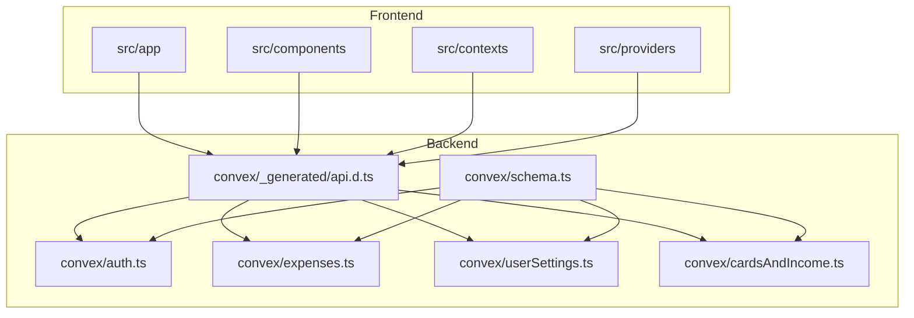
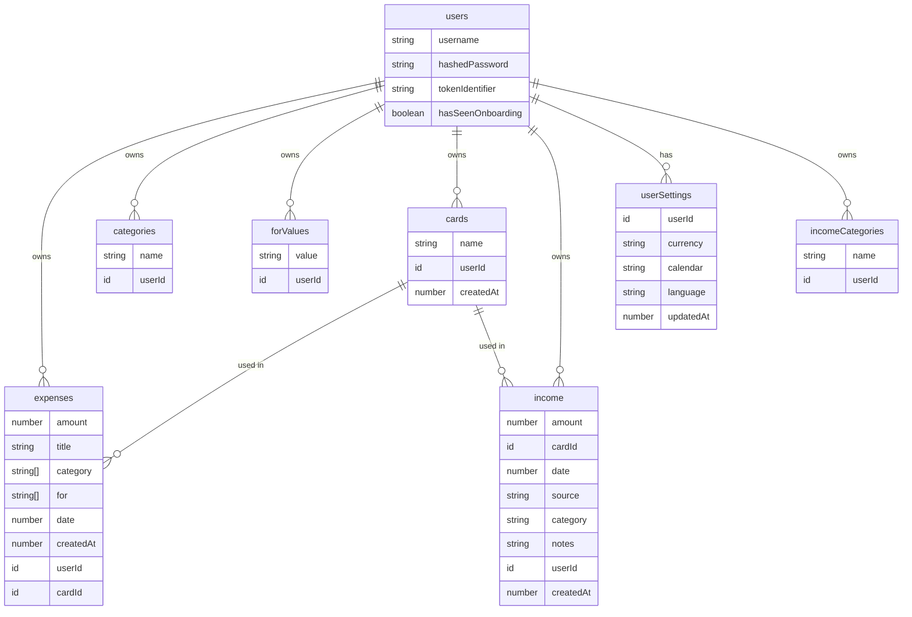
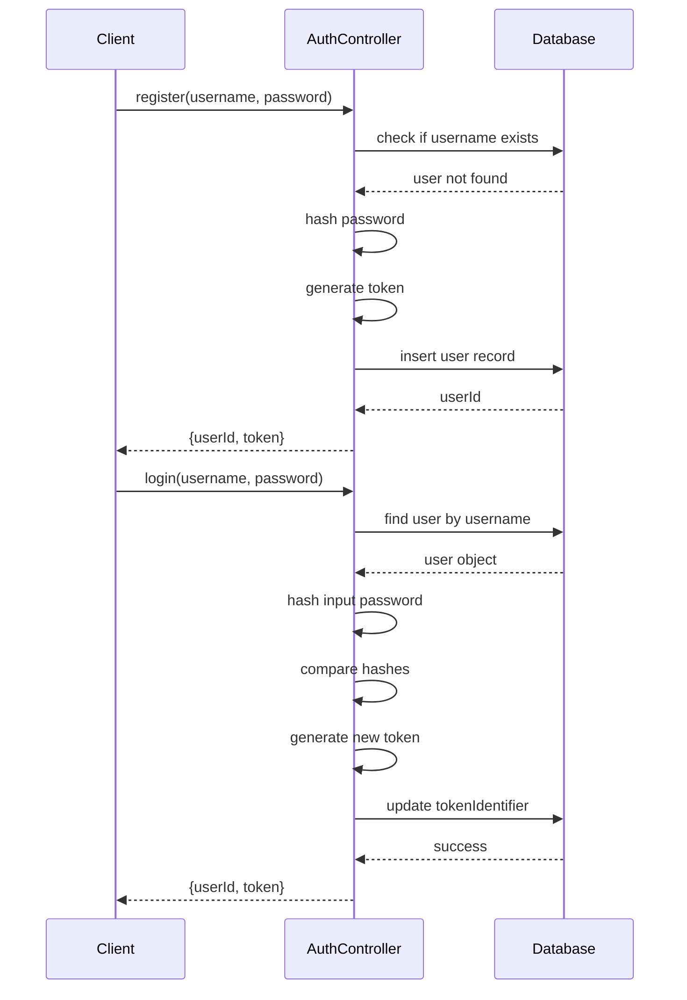
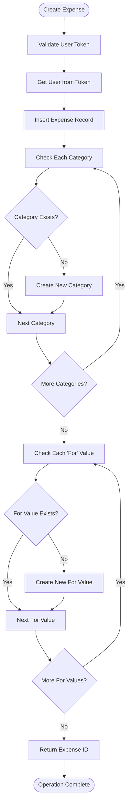
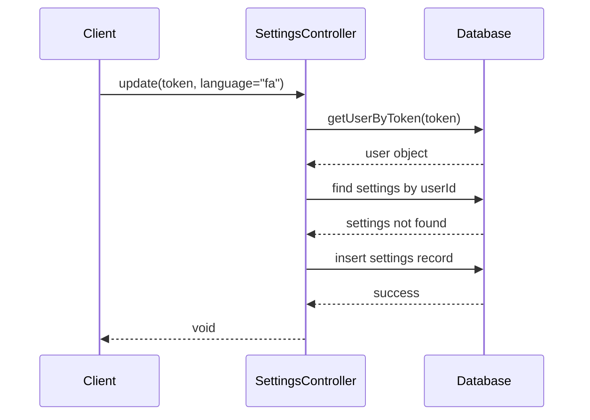
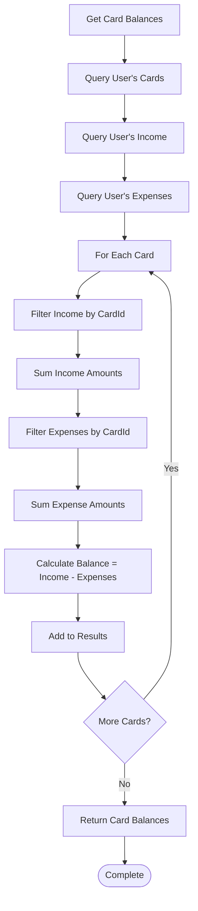
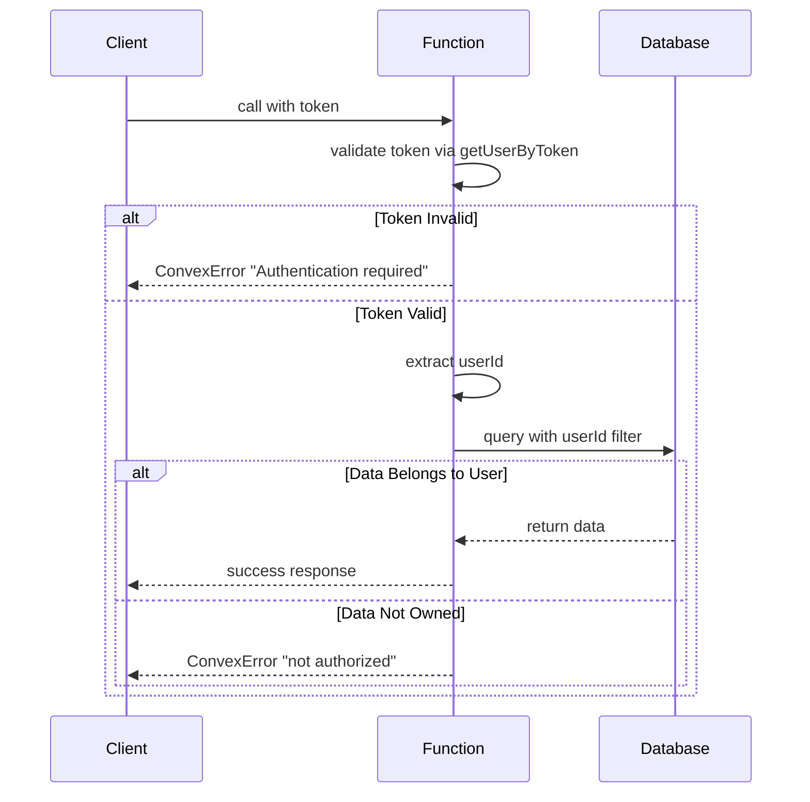
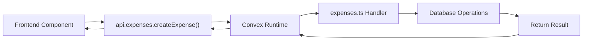
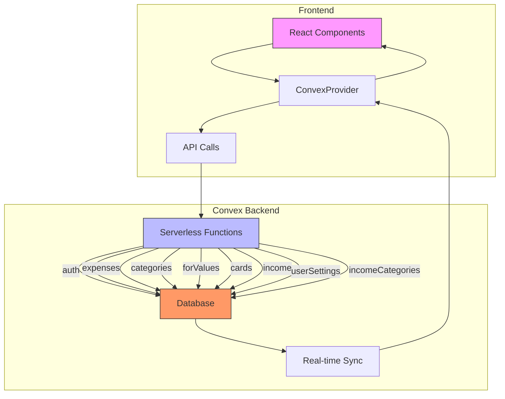

# Backend Architecture

<cite>
**Referenced Files in This Document**   
- [schema.ts](file://convex/schema.ts#L1-L66) - *Updated with language field in userSettings*
- [auth.ts](file://convex/auth.ts#L1-L131)
- [expenses.ts](file://convex/expenses.ts#L1-L324)
- [userSettings.ts](file://convex/userSettings.ts#L1-L59) - *Updated with language support*
- [cardsAndIncome.ts](file://convex/cardsAndIncome.ts#L1-L384) - *Updated with incomeCategories and transferFunds functionality*
- [api.d.ts](file://convex/_generated/api.d.ts#L1-L45) - *Updated with new API functions*
</cite>

## Update Summary
**Changes Made**   
- Added documentation for new language field in userSettings data model
- Updated User Settings Management section to include language preference functionality
- Modified Core Data Models section to reflect updated userSettings schema
- Enhanced User Settings Management section with new frontend integration details
- Updated Security and Access Control section to reflect language field handling
- Added language selection details in frontend consumption patterns

## Table of Contents
1. [Introduction](#introduction)
2. [Project Structure](#project-structure)
3. [Core Data Models](#core-data-models)
4. [Authentication System](#authentication-system)
5. [Expenses Management](#expenses-management)
6. [User Settings Management](#user-settings-management)
7. [Financial Sources Tracking](#financial-sources-tracking)
8. [Security and Access Control](#security-and-access-control)
9. [Auto-Generated API Interface](#auto-generated-api-interface)
10. [Error Handling Patterns](#error-handling-patterns)
11. [Query Optimization and Indexing](#query-optimization-and-indexing)
12. [System Architecture Diagram](#system-architecture-diagram)
13. [Conclusion](#conclusion)

## Introduction
This document provides comprehensive architectural documentation for the backend of an expense tracking application powered by Convex. The backend serves as a unified layer that integrates database storage, serverless functions, authentication, and real-time synchronization. The architecture is designed to be secure, scalable, and developer-friendly, leveraging Convex's full-stack capabilities to streamline development and deployment. This document details the data models, function modules, security mechanisms, and integration patterns that define the system.

## Project Structure
The project follows a modular structure with clear separation of concerns. The backend logic resides in the `convex/` directory, which contains all server-side code including data schema, authentication, business logic, and auto-generated API types. The frontend is built using Next.js and organized under the `src/` directory with feature-based grouping. The `convex/_generated/` directory contains auto-generated types and API definitions that enable type-safe communication between frontend and backend.

**Diagram sources**
- [schema.ts](file://convex/schema.ts#L1-L66)
- [auth.ts](file://convex/auth.ts#L1-L131)
- [expenses.ts](file://convex/expenses.ts#L1-L324)
- [userSettings.ts](file://convex/userSettings.ts#L1-L59)
- [cardsAndIncome.ts](file://convex/cardsAndIncome.ts#L1-L384)
- [api.d.ts](file://convex/_generated/api.d.ts#L1-L45)

**Section sources**
- [schema.ts](file://convex/schema.ts#L1-L66)
- [auth.ts](file://convex/auth.ts#L1-L131)
- [expenses.ts](file://convex/expenses.ts#L1-L324)

## Core Data Models
The data model is defined in `schema.ts` using Convex's schema definition API. It consists of seven core tables with defined relationships and validation rules.

### User Model
**Fields:**
- `username`: string (required)
- `hashedPassword`: string (required)
- `tokenIdentifier`: string (required)
- `hasSeenOnboarding`: boolean (optional)

**Indexes:**
- `by_username`: [username] - for username lookup
- `by_token`: [tokenIdentifier] - for authentication

### Expense Model
**Fields:**
- `amount`: number (required)
- `title`: string (required)
- `category`: string[] (required)
- `for`: string[] (required)
- `date`: number (required, timestamp)
- `createdAt`: number (required, timestamp)
- `userId`: reference to users (required)
- `cardId`: reference to cards (optional)

**Indexes:**
- `by_user`: [userId] - for user-specific queries
- `by_user_date`: [userId, date] - for date-range filtering
- `by_card`: [cardId] - for card-based filtering

### Category Model
**Fields:**
- `name`: string (required)
- `userId`: reference to users (required)

**Indexes:**
- `by_user`: [userId] - for user-specific queries
- `by_user_name`: [userId, name] - for unique category lookup

### ForValue Model
**Fields:**
- `value`: string (required)
- `userId`: reference to users (required)

**Indexes:**
- `by_user`: [userId] - for user-specific queries
- `by_user_value`: [userId, value] - for unique value lookup

### Card Model
**Fields:**
- `name`: string (required)
- `userId`: reference to users (required)
- `createdAt`: number (required, timestamp)

**Indexes:**
- `by_user`: [userId] - for user-specific queries
- `by_user_name`: [userId, name] - for unique card name lookup

### Income Model
**Fields:**
- `amount`: number (required)
- `cardId`: reference to cards (required)
- `date`: number (required, timestamp)
- `source`: string (required)
- `category`: string (required)
- `notes`: string (optional)
- `userId`: reference to users (required)
- `createdAt`: number (required, timestamp)

**Indexes:**
- `by_user`: [userId] - for user-specific queries
- `by_user_date`: [userId, date] - for date-range filtering
- `by_card`: [cardId] - for card-based filtering

### UserSettings Model
**Fields:**
- `userId`: reference to users (required)
- `currency`: union of "USD", "EUR", "GBP", "IRR" (required)
- `calendar`: union of "gregorian", "jalali" (required)
- `language`: optional union of "en", "fa" (optional)
- `updatedAt`: number (required, timestamp)

**Indexes:**
- `by_user`: [userId] - for user-specific queries

### IncomeCategories Model
**Fields:**
- `name`: string (required)
- `userId`: reference to users (required)

**Indexes:**
- `by_user`: [userId] - for user-specific queries
- `by_user_name`: [userId, name] - for unique category lookup

**Diagram sources**
- [schema.ts](file://convex/schema.ts#L1-L66)

**Section sources**
- [schema.ts](file://convex/schema.ts#L1-L66)

## Authentication System
The authentication system is implemented in `auth.ts` and provides registration, login, logout, and current user retrieval functionality.

### Key Functions
- `register`: Creates a new user with hashed password and unique token
- `login`: Authenticates user credentials and generates new session token
- `logout`: Invalidates current session token
- `getCurrentUser`: Retrieves user information from valid token

### Security Implementation
The system uses a simple password hashing mechanism (for demonstration purposes) with a salted algorithm. Each user session is tracked via a `tokenIdentifier` field that is updated on login and invalidated on logout. Authentication is enforced through token validation in all protected operations.

### Authentication Flow

**Diagram sources**
- [auth.ts](file://convex/auth.ts#L1-L131)

**Section sources**
- [auth.ts](file://convex/auth.ts#L1-L131)

## Expenses Management
The expenses module in `expenses.ts` provides comprehensive CRUD operations for expense records with automatic category and "for" value management.

### Key Functions
- `createExpense`: Inserts new expense and ensures associated categories/for values exist
- `getExpenses`: Retrieves all expenses for a user, optionally filtered by month/year
- `getExpensesByDateRange`: Retrieves expenses within a specific date range
- `updateExpense`: Updates existing expense with validation and category management
- `getExpenseById`: Retrieves a specific expense with ownership verification
- `deleteExpense`: Removes an expense after authorization check
- `createCategory`: Creates a new category with formatting and deduplication
- `createForValue`: Creates a new "for" value with formatting and deduplication
- `getCategories`: Retrieves all categories for a user
- `getForValues`: Retrieves all "for" values for a user

### Business Logic
When creating or updating expenses, the system automatically ensures that all referenced categories and "for" values exist in the user's personal lists. This prevents data inconsistency and provides a seamless user experience. Category and "for" value names are formatted with proper capitalization.

### Expense Creation Flow

**Diagram sources**
- [expenses.ts](file://convex/expenses.ts#L1-L324)

**Section sources**
- [expenses.ts](file://convex/expenses.ts#L1-L324)

## User Settings Management
The user settings module in `userSettings.ts` handles user preferences for currency, calendar systems, and language.

### Key Functions
- `get`: Retrieves user settings by token, returning null if not found
- `update`: Updates existing settings or creates new settings record with default values, including language preference

### Implementation Details
The system supports four currency options (USD, EUR, GBP, IRR), two calendar systems (gregorian, jalali), and two language options (en, fa). When updating settings, only provided fields are modified, allowing partial updates. If no settings exist for a user, a new record is created with defaults (USD, gregorian, en). The language field is optional and defaults to "en" when not specified.

### Settings Update Logic

**Section sources**
- [userSettings.ts](file://convex/userSettings.ts#L1-L62)
- [schema.ts](file://convex/schema.ts#L1-L66)
- [SettingsContext.tsx](file://src/contexts/SettingsContext.tsx#L1-L58)
- [settings/page.tsx](file://src/app/settings/page.tsx#L1-L208)

## Financial Sources Tracking
The cards and income module in `cardsAndIncome.ts` manages financial sources including payment cards and income records.

### Card Management
- `addCard`: Creates a new card for a user
- `getMyCards`: Retrieves all cards for a user
- `deleteCard`: Removes a card only if not used in any transactions

### Income Management
- `createIncome`: Records new income with card association and ensures category exists in incomeCategories
- `getIncome`: Retrieves all income records for a user
- `getIncomeByDateRange`: Filters income by date range
- `getUniqueIncomeCategories`: Returns distinct income categories from incomeCategories table
- `getIncomeById`: Retrieves specific income record with authorization
- `updateIncome`: Modifies existing income record and ensures updated category exists
- `deleteIncome`: Removes income record with authorization check
- `getCardBalances`: Calculates net balance for each card

### Card Transfer Functionality
- `transferFunds`: Enables transferring funds between cards by creating corresponding expense and income records
- Validates sufficient funds in source card
- Prevents transfers to the same card
- Ensures positive transfer amounts
- Creates expense record with "Card Transfer" category in source card
- Creates income record with "Card Transfer" source in destination card

### Card Deletion Safety
The system prevents deletion of cards that are referenced in expense or income records, maintaining referential integrity and preventing orphaned references.

### Card Balance Calculation
The `getCardBalances` function computes the financial position of each card by aggregating associated income (credits) and expenses (debits), providing a net balance.

**Diagram sources**
- [cardsAndIncome.ts](file://convex/cardsAndIncome.ts#L1-L384)

**Section sources**
- [cardsAndIncome.ts](file://convex/cardsAndIncome.ts#L1-L384)

## Security and Access Control
The system implements a robust security model using authenticated mutations and queries with strict access control.

### Authentication Mechanism
All server functions require a token parameter that is validated against the `tokenIdentifier` field in the users table. The `getUserByToken` helper function is used across modules to authenticate requests and retrieve the associated user.

### Authorization Strategy
Every data access operation includes a userId check to ensure users can only access their own data. This is implemented through:
- Query filtering by userId in all data retrieval operations
- Explicit ownership verification when accessing specific records
- Prevention of cross-user data manipulation
- Validation of card ownership in transfer operations

### Error Handling
Unauthorized access attempts result in `ConvexError` with descriptive messages. The system uses consistent error patterns across all modules to provide clear feedback to the frontend.

### Security Flow

**Diagram sources**
- [auth.ts](file://convex/auth.ts#L1-L131)
- [expenses.ts](file://convex/expenses.ts#L1-L324)
- [cardsAndIncome.ts](file://convex/cardsAndIncome.ts#L1-L384)
- [userSettings.ts](file://convex/userSettings.ts#L1-L59)

**Section sources**
- [auth.ts](file://convex/auth.ts#L1-L131)
- [expenses.ts](file://convex/expenses.ts#L1-L324)
- [cardsAndIncome.ts](file://convex/cardsAndIncome.ts#L1-L384)
- [userSettings.ts](file://convex/userSettings.ts#L1-L59)

## Auto-Generated API Interface
The Convex framework automatically generates a type-safe API interface in `api.d.ts` that enables seamless frontend-backend integration.

### API Structure
The generated API exposes all public functions organized by module:
- `api.auth.register`
- `api.auth.login`
- `api.auth.logout`
- `api.auth.getCurrentUser`
- `api.expenses.createExpense`
- `api.expenses.getExpenses`
- `api.expenses.updateExpense`
- `api.expenses.deleteExpense`
- `api.expenses.createCategory`
- `api.expenses.createForValue`
- `api.userSettings.get`
- `api.userSettings.update`
- `api.cardsAndIncome.addCard`
- `api.cardsAndIncome.getMyCards`
- `api.cardsAndIncome.deleteCard`
- `api.cardsAndIncome.createIncome`
- `api.cardsAndIncome.getIncome`
- `api.cardsAndIncome.updateIncome`
- `api.cardsAndIncome.deleteIncome`
- `api.cardsAndIncome.getCardBalances`
- `api.cardsAndIncome.transferFunds`
- `api.cardsAndIncome.getUniqueIncomeCategories`

### Type Safety
The generated types provide complete type checking for function arguments and return values, preventing runtime errors due to incorrect API usage. The `FilterApi` utility ensures only public functions are exposed to the frontend.

### Frontend Consumption
Frontend components import the `api` object and use it to call backend functions with full TypeScript support, enabling autocompletion and compile-time error checking. The SettingsContext and settings page components utilize the updated API to manage language preferences alongside currency and calendar settings.

**Diagram sources**
- [api.d.ts](file://convex/_generated/api.d.ts#L1-L45)
- [expenses.ts](file://convex/expenses.ts#L1-L324)

**Section sources**
- [api.d.ts](file://convex/_generated/api.d.ts#L1-L45)

## Error Handling Patterns
The system employs consistent error handling patterns across all modules using `ConvexError` for client-facing errors.

### Error Types
- `ConvexError`: Used for user-facing validation and authorization errors
- `Error`: Used for internal server errors (rare)

### Common Error Scenarios
- "Username already exists" - during registration
- "Invalid username or password" - during login
- "Authentication required" - when token is missing or invalid
- "Expense not found or not authorized" - when accessing unauthorized records
- "Category name cannot be empty" - during category creation
- "Cannot delete card used in expenses" - during card deletion
- "Cannot transfer funds to the same card." - during fund transfer
- "Transfer amount must be positive." - during fund transfer
- "One or both cards not found or not authorized." - during fund transfer
- "Insufficient funds for the transfer." - during fund transfer

### Error Propagation
Errors are thrown within function handlers and automatically propagated to the frontend through the Convex runtime. The frontend can catch these errors and display appropriate user messages.

## Query Optimization and Indexing
The system uses strategic database indexing to optimize query performance.

### Index Strategy
All queries that filter by user context use indexes prefixed with `by_user` to ensure efficient data retrieval. Additional indexes support common filtering patterns:
- `by_username` and `by_token` for authentication
- `by_user_name` variants for unique constraint enforcement
- `by_user_date` for time-based filtering
- `by_card` for card-based aggregations

### Query Patterns
The system consistently uses indexed queries with the `withIndex()` method to ensure optimal performance. For example, retrieving a user's expenses always uses the `by_user` index on the expenses table.

### Performance Considerations
Date range filtering is implemented in application code after retrieving all user expenses, which may impact performance with large datasets. A potential optimization would be to create additional indexes on date fields for more efficient server-side filtering.

## System Architecture Diagram
The following diagram illustrates the complete system architecture showing client-backend interactions and data flows.

**Diagram sources**
- [schema.ts](file://convex/schema.ts#L1-L66)
- [auth.ts](file://convex/auth.ts#L1-L131)
- [expenses.ts](file://convex/expenses.ts#L1-L324)
- [userSettings.ts](file://convex/userSettings.ts#L1-L59)
- [cardsAndIncome.ts](file://convex/cardsAndIncome.ts#L1-L384)

**Section sources**
- [schema.ts](file://convex/schema.ts#L1-L66)
- [auth.ts](file://convex/auth.ts#L1-L131)

## Conclusion
The backend architecture of this expense tracker application demonstrates a well-structured implementation using Convex as a unified backend solution. The system effectively integrates database storage, serverless functions, authentication, and real-time capabilities within a single framework. Key strengths include:
- Clear separation of concerns through modular function organization
- Robust security model with consistent authentication and authorization
- Type-safe API interface enabling reliable frontend integration
- Thoughtful data modeling with appropriate relationships and indexes
- Comprehensive error handling for improved user experience
- New incomeCategories table for better income categorization management
- Card transfer functionality with proper financial tracking
- Exclusion of Card Transfer category from dashboard calculations for accurate financial reporting
- Language preference support for enhanced user experience with English (en) and Persian (fa) options

The architecture is scalable and maintainable, with potential improvements including enhanced query optimization for large datasets and migration to a more secure password hashing algorithm in production. The Convex platform enables rapid development while maintaining high performance and reliability.