# Cards and Income Tracking

<cite>
**Referenced Files in This Document**   
- [cardsAndIncome.ts](file://convex/cardsAndIncome.ts#L0-L285)
- [schema.ts](file://convex/schema.ts#L0-L61)
- [CardBalances.tsx](file://src/features/dashboard/components/CardBalances/CardBalances.tsx#L0-L102)
- [expenses.ts](file://convex/expenses.ts#L0-L324)
- [OfflineContext.tsx](file://src/contexts/OfflineContext.tsx#L0-L171)
</cite>

## Table of Contents
1. [Financial Sources Data Model](#financial-sources-data-model)
2. [Income and Card Management Functions](#income-and-card-management-functions)
3. [Access Control and Authorization](#access-control-and-authorization)
4. [Card Balances Calculation](#card-balances-calculation)
5. [Error Handling and Validation](#error-handling-and-validation)
6. [Offline Synchronization Mechanism](#offline-synchronization-mechanism)
7. [Integration with Dashboard Components](#integration-with-dashboard-components)

## Financial Sources Data Model

The financial sources system consists of two primary entities: **cards** and **income** records. These entities are defined in the application's data schema and represent payment methods and income streams respectively.

**Cards Data Structure**
- **name**: string - User-defined name for the card (e.g., "Primary Checking")
- **userId**: reference to users collection - Links card to owner
- **createdAt**: number - Timestamp of card creation
- **Indexes**: by_user (userId), by_user_name (userId, name)

**Income Data Structure**
- **amount**: number - Monetary value of income (positive value)
- **cardId**: reference to cards collection - Links income to funding source
- **date**: number - Timestamp of income receipt
- **source**: string - Description of income origin (e.g., "Salary", "Freelance")
- **category**: string - Classification for reporting purposes
- **notes**: optional string - Additional details about the income
- **userId**: reference to users collection - Links income to owner
- **createdAt**: number - Timestamp of record creation
- **Indexes**: by_user (userId), by_user_date (userId, date), by_card (cardId)


**Diagram sources**
- [schema.ts](file://convex/schema.ts#L0-L61)

**Section sources**
- [schema.ts](file://convex/schema.ts#L0-L61)

## Income and Card Management Functions

The cardsAndIncome.ts module provides a comprehensive API for managing financial sources through Convex mutations and queries.

### Card Operations

**addCard Mutation**
Creates a new payment card for the authenticated user.
```typescript
export const addCard = mutation({
  args: {
    token: v.string(),
    name: v.string(),
  },
  handler: async (ctx, args) => {
    const user = await getUserByToken(ctx, args.token);
    return await ctx.db.insert("cards", {
      name: args.name,
      userId: user._id,
      createdAt: Date.now(),
    });
  },
});
```

**getMyCards Query**
Retrieves all cards belonging to the authenticated user.
```typescript
export const getMyCards = query({
  args: {
    token: v.string(),
  },
  handler: async (ctx, args) => {
    const user = await getUserByToken(ctx, args.token);
    return await ctx.db
      .query("cards")
      .withIndex("by_user", (q) => q.eq("userId", user._id))
      .collect();
  },
});
```

**deleteCard Mutation**
Removes a card only if it's not referenced by any income or expense records.
```typescript
export const deleteCard = mutation({
  args: {
    token: v.string(),
    cardId: v.id("cards"),
  },
  handler: async (ctx, args) => {
    const user = await getUserByToken(ctx, args.token);
    const card = await ctx.db.get(args.cardId);
    
    if (!card || card.userId !== user._id) {
      throw new ConvexError("Card not found or not authorized to delete");
    }
    
    // Prevent deletion if card is used in transactions
    const expensesUsingCard = await ctx.db
      .query("expenses")
      .withIndex("by_card", (q) => q.eq("cardId", args.cardId))
      .first();
    
    if (expensesUsingCard) {
      throw new ConvexError("Cannot delete card used in expenses");
    }
    
    const incomeUsingCard = await ctx.db
      .query("income")
      .withIndex("by_card", (q) => q.eq("cardId", args.cardId))
      .first();
    
    if (incomeUsingCard) {
      throw new ConvexError("Cannot delete card used in income");
    }
    
    await ctx.db.delete(args.cardId);
  },
});
```

### Income Operations

**createIncome Mutation**
Adds a new income record linked to a specific card.
```typescript
export const createIncome = mutation({
  args: {
    token: v.string(),
    amount: v.number(),
    cardId: v.id("cards"),
    date: v.number(),
    source: v.string(),
    category: v.string(),
    notes: v.optional(v.string()),
  },
  handler: async (ctx, args) => {
    const user = await getUserByToken(ctx, args.token);
    return await ctx.db.insert("income", {
      amount: args.amount,
      cardId: args.cardId,
      date: args.date,
      source: args.source,
      category: args.category,
      notes: args.notes,
      userId: user._id,
      createdAt: Date.now(),
    });
  },
});
```

**API Request Example: Add Income Source**
```json
{
  "function": "cardsAndIncome.createIncome",
  "args": {
    "token": "user_auth_token_123",
    "amount": 4500.00,
    "cardId": "cards:123",
    "date": 1704067200000,
    "source": "Salary",
    "category": "Employment",
    "notes": "January salary payment"
  }
}
```

**getIncomeByDateRange Query**
Retrieves income records within a specified date range.
```typescript
export const getIncomeByDateRange = query({
  args: {
    token: v.string(),
    startDate: v.number(),
    endDate: v.number(),
    key: v.optional(v.number()),
  },
  handler: async (ctx, args) => {
    const user = await getUserByToken(ctx, args.token);
    const income = await ctx.db
      .query("income")
      .withIndex("by_user", (q) => q.eq("userId", user._id))
      .collect();
    
    return income.filter(incomeRecord => 
      incomeRecord.date >= args.startDate && incomeRecord.date <= args.endDate
    );
  },
});
```

**Section sources**
- [cardsAndIncome.ts](file://convex/cardsAndIncome.ts#L0-L285)

## Access Control and Authorization

The system implements strict access control to ensure users can only access their own financial data through token-based authentication.

### Authentication Flow

```mermaid
sequenceDiagram
participant Client as "Frontend"
participant API as "cardsAndIncome API"
participant DB as "Database"
Client->>API : Request with token
API->>API : getUserByToken(token)
API->>DB : Query users by_token index
DB-->>API : Return user document
alt User not found
API-->>Client : "Authentication required" error
else User found
API->>API : Verify resource ownership
alt Resource userId ≠ user._id
API-->>Client : "Not authorized" error
else Valid ownership
API->>DB : Perform requested operation
DB-->>API : Return result
API-->>Client : Success response
end
end
```



**Diagram sources**
- [cardsAndIncome.ts](file://convex/cardsAndIncome.ts#L0-L285)

### Authorization Implementation

The `getUserByToken` helper function is used by all mutations and queries to authenticate users:

```typescript
async function getUserByToken(ctx: any, token: string) {
  const user = await ctx.db
    .query("users")
    .withIndex("by_token", (q: any) => q.eq("tokenIdentifier", token))
    .first();

  if (!user) {
    throw new ConvexError("Authentication required");
  }

  return user;
}
```

Each operation verifies that the requested resource belongs to the authenticated user:

```typescript
// Example from deleteIncome mutation
const income = await ctx.db.get(args.incomeId);
if (!income) {
  throw new ConvexError("Income record not found");
}
if (income.userId !== user._id) {
  throw new ConvexError("You are not authorized to delete this income record");
}
```

**Section sources**
- [cardsAndIncome.ts](file://convex/cardsAndIncome.ts#L0-L285)

## Card Balances Calculation

The system calculates real-time card balances by aggregating income and expense transactions associated with each card.

### getCardBalances Query

```typescript
export const getCardBalances = query({
  args: {
    token: v.string(),
  },
  handler: async (ctx, args) => {
    const user = await getUserByToken(ctx, args.token);
    
    // Get all cards for the user
    const cards = await ctx.db
      .query("cards")
      .withIndex("by_user", (q) => q.eq("userId", user._id))
      .collect();
    
    // Get all income and expenses for the user
    const income = await ctx.db
      .query("income")
      .withIndex("by_user", (q) => q.eq("userId", user._id))
      .collect();
    
    const expenses = await ctx.db
      .query("expenses")
      .withIndex("by_user", (q) => q.eq("userId", user._id))
      .collect();
    
    // Calculate balances for each card
    const cardBalances = cards.map(card => {
      const cardIncome = income
        .filter(inc => inc.cardId === card._id)
        .reduce((sum, inc) => sum + inc.amount, 0);
      
      const cardExpenses = expenses
        .filter(exp => exp.cardId === card._id)
        .reduce((sum, exp) => sum + exp.amount, 0);
      
      return {
        cardId: card._id,
        cardName: card.name,
        totalIncome: cardIncome,
        totalExpenses: cardExpenses,
        balance: cardIncome - cardExpenses,
      };
    });
    
    return cardBalances;
  },
});
```

### Balance Calculation Logic

For each card:
1. Sum all income records where `cardId` matches the card
2. Sum all expense records where `cardId` matches the card  
3. Calculate balance as: `totalIncome - totalExpenses`

The balance can be positive (net inflow) or negative (net outflow), with visual indicators in the UI reflecting the financial status.

**Section sources**
- [cardsAndIncome.ts](file://convex/cardsAndIncome.ts#L0-L285)

## Integration with Dashboard Components

The CardBalances component in the dashboard consumes the getCardBalances query to display financial information to users.

### CardBalances Component

```typescript
export function CardBalances({ className }: CardBalancesProps) {
  const { token } = useAuth();
  const { settings } = useSettings();
  const cardBalances = useQuery(api.cardsAndIncome.getCardBalances, token ? { token } : "skip");
  
  // Loading state
  if (cardBalances === undefined) {
    return <div>Loading...</div>;
  }
  
  // Empty state
  if (cardBalances.length === 0) {
    return <div>No cards added yet</div>;
  }
  
  // Render card balances
  return (
    <div className="card-balances-container">
      {cardBalances.map((card) => (
        <div key={card.cardId} className="card-balance-item">
          <div className="card-info">
            <div className="card-name">{card.cardName}</div>
            <div className="transaction-summary">
              <span>Income: {formatCurrency(card.totalIncome, settings.currency)}</span>
              <span>Expenses: {formatCurrency(card.totalExpenses, settings.currency)}</span>
            </div>
          </div>
          <div className={`balance-amount ${card.balance >= 0 ? 'positive' : 'negative'}`}>
            {formatCurrency(card.balance, settings.currency)}
          </div>
        </div>
      ))}
    </div>
  );
}
```

The component handles three states:
- **Loading**: When data is being fetched from the backend
- **Empty**: When the user has no cards added
- **Data**: When card balances are available for display

Currency formatting is applied based on user settings, and visual indicators show positive (green) or negative (red) balances.


**Diagram sources**
- [CardBalances.tsx](file://src/features/dashboard/components/CardBalances/CardBalances.tsx#L0-L102)

**Section sources**
- [CardBalances.tsx](file://src/features/dashboard/components/CardBalances/CardBalances.tsx#L0-L102)

## Error Handling and Validation

The system implements comprehensive error handling for various failure scenarios.

### Error Types and Handling

**Authentication Errors**
- "Authentication required": Token is invalid or missing
- Handled by `getUserByToken` helper function

**Authorization Errors**
- "Card not found or not authorized to delete": User attempting to modify resource they don't own
- "Income not found or not authorized": Same as above for income records
- Prevents unauthorized access to financial data

**Business Logic Errors**
- "Cannot delete card used in expenses": Prevents deletion of cards with transaction history
- "Cannot delete card used in income": Same as above for income records
- Maintains data integrity and prevents orphaned references

### Validation Rules

**Monetary Values**
- Amounts are validated as numbers (v.number())
- No explicit range validation, but negative values would be unusual for income
- Currency formatting handled on the frontend based on user settings

**Source Types**
- Source field accepts any string (v.string())
- No predefined categories, allowing user flexibility
- Categories are also free-form strings with no validation against a fixed list

**Duplicate Entry Prevention**
- The system does not explicitly prevent duplicate income entries
- Users can create multiple income records with identical details
- This allows for legitimate cases like recurring payments on the same date

**Section sources**
- [cardsAndIncome.ts](file://convex/cardsAndIncome.ts#L0-L285)

## Offline Synchronization Mechanism

The application includes a robust offline-first architecture that synchronizes local storage with backend persistence.

### Offline Context Implementation


**Diagram sources**
- [OfflineContext.tsx](file://src/contexts/OfflineContext.tsx#L0-L171)

### Synchronization Workflow

1. **Offline Detection**: The system listens to browser online/offline events
2. **Local Storage**: Pending expenses are stored in IndexedDB using localforage
3. **Auto-Sync**: When connectivity is restored, pending expenses are automatically synced
4. **Error Handling**: Failed sync attempts are marked and can be retried manually
5. **State Management**: The UI reflects the sync status of each pending transaction

Key features:
- Uses `localforage` for persistent client-side storage
- Maintains expense status (pending, syncing, synced, failed)
- Automatically attempts synchronization when online
- Provides manual retry capability for failed syncs
- Preserves data integrity during network interruptions

While the offline mechanism is primarily implemented for expenses, the architecture could be extended to support offline creation of income records and card management operations.

**Section sources**
- [OfflineContext.tsx](file://src/contexts/OfflineContext.tsx#L0-L171)