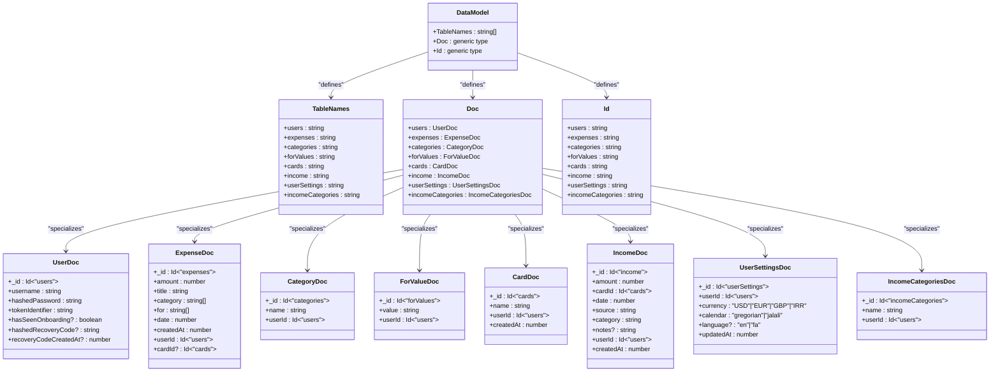

# Data Models and Schema

<cite>
**Referenced Files in This Document**   
- [schema.ts](file://convex/schema.ts#L1-L66) - *Updated in recent commit with recovery code fields*
- [dataModel.d.ts](file://convex/_generated/dataModel.d.ts#L1-L61)
- [expenses.ts](file://convex/expenses.ts#L1-L325)
- [userSettings.ts](file://convex/userSettings.ts#L1-L60)
- [auth.ts](file://convex/auth.ts#L1-L132) - *Updated to include recovery code functionality*
- [cardsAndIncome.ts](file://convex/cardsAndIncome.ts#L1-L383)
- [internal.ts](file://convex/internal.ts#L1-L33)
- [SettingsContext.tsx](file://src/contexts/SettingsContext.tsx#L1-L59)
- [page.tsx](file://src/app/settings/page.tsx#L1-L209)
</cite>

## Update Summary
**Changes Made**   
- Added documentation for new `hashedRecoveryCode` and `recoveryCodeCreatedAt` fields in User entity
- Updated User entity definition to include password recovery functionality
- Added new valid and invalid document examples for User with recovery code fields
- Updated mutation validation rules to include recovery code generation and validation
- Enhanced source tracking with new backend file references
- Updated authentication context documentation to show recovery code implementation

## Table of Contents
1. [Data Model Overview](#data-model-overview)
2. [Entity Definitions](#entity-definitions)
3. [Field Types and Validation Rules](#field-types-and-validation-rules)
4. [Entity Relationships](#entity-relationships)
5. [TypeScript Type Generation](#typescript-type-generation)
6. [Indexing and Query Performance](#indexing-and-query-performance)
7. [Data Lifecycle and Deletion Policies](#data-lifecycle-and-deletion-policies)
8. [Valid and Invalid Document Examples](#valid-and-invalid-document-examples)

## Data Model Overview

The Convex backend schema defines a comprehensive data model for an expense tracking application. The system is structured around core entities including users, expenses, categories, and settings, with relationships established through foreign key references. All data is stored in Convex tables with schema validation enforced at the database level using Convex's type system.

The schema is defined in `schema.ts` using Convex's `defineSchema` and `defineTable` functions, which provide type-safe schema definitions. These definitions are automatically translated into TypeScript types in `dataModel.d.ts`, enabling full end-to-end type safety across the application.

**Section sources**
- [schema.ts](file://convex/schema.ts#L1-L66)

## Entity Definitions

### User Entity
**Fields:**
- `_id`: System-generated document identifier (automatically available)
- `username`: String, required, unique via index
- `hashedPassword`: String, required
- `tokenIdentifier`: String, required, unique via index
- `hasSeenOnboarding`: Optional boolean flag
- `hashedRecoveryCode`: Optional string field storing hashed recovery code for password reset
- `recoveryCodeCreatedAt`: Optional number field storing timestamp when recovery code was generated

The User entity serves as the authentication and authorization foundation for the application. Each user is uniquely identified by their `_id`, with additional unique constraints on username and tokenIdentifier through database indexes. The new recovery code fields support a password reset system that allows users to recover access to their accounts.

### Expense Entity
**Fields:**
- `amount`: Number, required
- `title`: String, required
- `category`: Array of strings, required
- `for`: Array of strings, required
- `date`: Number (Unix timestamp), required
- `createdAt`: Number (Unix timestamp), required
- `userId`: Reference to users table, required
- `cardId`: Optional reference to cards table

Expenses represent financial transactions and are the primary data entity in the system. Each expense is associated with a user and may be linked to a payment card.

### Category Entity
**Fields:**
- `name`: String, required
- `userId`: Reference to users table, required

Categories are user-specific and provide classification for expenses. The same category name can exist for different users without conflict.

### ForValue Entity
**Fields:**
- `value`: String, required
- `userId`: Reference to users table, required

ForValue represents the recipient or purpose of an expense (e.g., "Groceries", "Utilities"). Like categories, these are user-specific.

### UserSettings Entity
**Fields:**
- `userId`: Reference to users table, required, unique via index
- `currency`: String, restricted to "USD", "EUR", "GBP", or "IRR"
- `calendar`: String, restricted to "gregorian" or "jalali"
- `language`: Optional String, restricted to "en" or "fa"
- `updatedAt`: Number (Unix timestamp), required

UserSettings stores user preferences and is scoped to individual users with a one-to-one relationship. The `language` field allows users to select their preferred interface language, with English ("en") as the default value.

### IncomeCategories Entity
**Fields:**
- `name`: String, required
- `userId`: Reference to users table, required

IncomeCategories provides standardized classification for income records. Each user has their own set of income categories, with default categories seeded upon account creation. This entity was added to ensure consistency in income categorization and to provide a curated list of common income types.

**Section sources**
- [schema.ts](file://convex/schema.ts#L1-L66)

## Field Types and Validation Rules

### Required Fields
All fields in the schema are required by default unless explicitly marked as optional:
- User: `username`, `hashedPassword`, `tokenIdentifier` are required; `hashedRecoveryCode` and `recoveryCodeCreatedAt` are optional
- Expense: All fields except `cardId` are required
- Category: `name`, `userId` are required
- ForValue: `value`, `userId` are required
- UserSettings: `userId`, `currency`, `calendar`, `updatedAt` are required; `language` is optional
- IncomeCategories: `name`, `userId` are required

### String Constraints
The schema enforces string validation through:
- **Length constraints**: While not explicitly defined in the schema, business logic in mutation functions enforces non-empty strings
- **Format constraints**: Category and ForValue names are formatted with title case in mutation handlers
- **Uniqueness constraints**: Username and tokenIdentifier have unique indexes

### Numeric Constraints
Numeric fields have the following characteristics:
- `amount`: Positive or negative number representing monetary value
- `date`: Unix timestamp in milliseconds
- `createdAt`: Unix timestamp in milliseconds
- No explicit range validation in schema, but business logic expects reasonable values

### Enumeration Constraints
UserSettings fields use union literals to enforce valid values:
- `currency`: Must be one of "USD", "EUR", "GBP", "IRR"
- `calendar`: Must be one of "gregorian", "jalali"
- `language`: Must be one of "en" or "fa" (optional field)

These constraints are enforced at both the type level and in mutation validation.

### Optional Fields
The schema includes several optional fields:
- `hasSeenOnboarding`: Optional boolean in User entity
- `cardId`: Optional reference in Expense entity
- `notes`: Optional string in Income entity
- `language`: Optional string in UserSettings entity
- `hashedRecoveryCode`: Optional string in User entity for password recovery
- `recoveryCodeCreatedAt`: Optional number in User entity for recovery code expiration tracking

**Section sources**
- [schema.ts](file://convex/schema.ts#L1-L66)
- [expenses.ts](file://convex/expenses.ts#L1-L325)
- [userSettings.ts](file://convex/userSettings.ts#L1-L60)
- [auth.ts](file://convex/auth.ts#L1-L132)

## Entity Relationships


**Diagram sources**
- [schema.ts](file://convex/schema.ts#L1-L66)

### Relationship Details

#### User to Expense (One-to-Many)
Each user can have multiple expenses, but each expense belongs to exactly one user. This relationship is established through the `userId` field in the Expense entity, which references the User entity.

#### User to Category (One-to-Many)
Users can create multiple categories for classifying their expenses. The Category entity includes a `userId` field that creates this parent-child relationship.

#### User to ForValue (One-to-Many)
Similar to categories, users can define multiple "for" values (purposes/destinations) for their expenses. This is implemented with a `userId` reference field.

#### User to UserSettings (One-to-One)
Each user has exactly one settings document, and each settings document belongs to exactly one user. This is enforced through a unique index on `userId` in the userSettings table. The settings document now includes an optional `language` field for interface localization.

#### Expense to Card (Many-to-One, Optional)
Expenses can optionally be associated with a payment card. The `cardId` field in Expense references the Card entity, allowing users to track which card was used for each expense.

#### Income to Card (Many-to-One)
Income records are always associated with a specific card, establishing a many-to-one relationship between income and cards.

#### Income to IncomeCategories (Many-to-One)
Income records are classified using categories from the incomeCategories table. Each income record references one category, while each category can be used by multiple income records. This relationship ensures consistent categorization of income across the application.

#### User to IncomeCategories (One-to-Many)
Users have their own set of income categories, with default categories seeded upon account creation. The incomeCategories table includes a `userId` field that creates this ownership relationship, allowing each user to customize their income categories.

**Section sources**
- [schema.ts](file://convex/schema.ts#L1-L66)
- [expenses.ts](file://convex/expenses.ts#L1-L325)
- [cardsAndIncome.ts](file://convex/cardsAndIncome.ts#L1-L383)

## TypeScript Type Generation



**Diagram sources**
- [dataModel.d.ts](file://convex/_generated/dataModel.d.ts#L1-L61)
- [schema.ts](file://convex/schema.ts#L1-L66)

### Type System Implementation

The Convex framework automatically generates TypeScript types from the schema definition in `schema.ts`. When the schema is defined using `defineSchema`, Convex creates corresponding TypeScript interfaces and types in `dataModel.d.ts`.

#### Key Generated Types

**DataModel Type**
The `DataModel` type is generated from the schema definition and describes the complete data model structure:
```typescript
export type DataModel = DataModelFromSchemaDefinition<typeof schema>;
```

**TableNames Type**
This type contains all table names as string literals, enabling type-safe table name references:
```typescript
export type TableNames = TableNamesInDataModel<DataModel>;
```

**Doc Generic Type**
The `Doc` generic type provides type-safe access to documents by table name:
```typescript
export type Doc<TableName extends TableNames> = DocumentByName<DataModel, TableName>;
```

**Id Generic Type**
The `Id` type represents document identifiers with table-specific typing:
```typescript
export type Id<TableName extends TableNames | SystemTableNames> = GenericId<TableName>;
```

### Type Safety Benefits

The auto-generated types provide several benefits:
- **End-to-end type safety**: From database queries to frontend components
- **Autocompletion**: IDE support for field names and types
- **Compile-time validation**: Catch errors before runtime
- **Refactoring safety**: Type system helps identify breaking changes

For example, when querying expenses:
```typescript
const expenses = await ctx.db.query("expenses").collect();
// expenses is automatically typed as Doc<"expenses">[]
```

The addition of the `language` field in UserSettings has extended the type system with:
- `Language` type alias in frontend contexts
- Optional `language` property in `UserSettingsDoc` interface
- Type-safe handling of language preferences throughout the application

**Section sources**
- [dataModel.d.ts](file://convex/_generated/dataModel.d.ts#L1-L61)
- [schema.ts](file://convex/schema.ts#L1-L66)
- [SettingsContext.tsx](file://src/contexts/SettingsContext.tsx#L1-L59)

## Indexing and Query Performance

### Index Definitions

The schema defines multiple indexes to optimize query performance:

**User Table Indexes**
- `by_username`: Single-field index on `username` for authentication
- `by_token`: Single-field index on `tokenIdentifier` for session management

**Expense Table Indexes**
- `by_user`: Single-field index on `userId` for user-specific queries
- `by_user_date`: Composite index on `userId` and `date` for time-based filtering
- `by_card`: Single-field index on `cardId` for card-specific expense queries

**Category Table Indexes**
- `by_user`: Single-field index on `userId`
- `by_user_name`: Composite index on `userId` and `name` for duplicate prevention

**ForValue Table Indexes**
- `by_user`: Single-field index on `userId`
- `by_user_value`: Composite index on `userId` and `value` for duplicate prevention

**Card Table Indexes**
- `by_user`: Single-field index on `userId`
- `by_user_name`: Composite index on `userId` and `name`

**Income Table Indexes**
- `by_user`: Single-field index on `userId`
- `by_user_date`: Composite index on `userId` and `date`
- `by_card`: Single-field index on `cardId`

**UserSettings Table Indexes**
- `by_user`: Single-field index on `userId` (enforces one settings per user)

**IncomeCategories Table Indexes**
- `by_user`: Single-field index on `userId`
- `by_user_name`: Composite index on `userId` and `name` for duplicate prevention and efficient lookups

### Query Optimization Strategy

The indexing strategy follows best practices for the application's access patterns:

#### User Authentication Queries
```typescript
ctx.db.query("users").withIndex("by_token", (q) => q.eq("tokenIdentifier", token))
```
Uses the `by_token` index for O(log n) lookup performance.

#### User-Specific Data Retrieval
```typescript
ctx.db.query("expenses").withIndex("by_user", (q) => q.eq("userId", user._id))
```
All user-specific queries use the `by_user` index pattern, ensuring efficient filtering.

#### Time-Based Filtering
```typescript
ctx.db.query("expenses").withIndex("by_user_date", (q) => q.eq("userId", user._id).eq("date", date))
```
The composite `by_user_date` index optimizes queries that filter by both user and date.

#### Duplicate Prevention
```typescript
ctx.db.query("categories").withIndex("by_user_name", (q) => q.eq("userId", user._id).eq("name", categoryName))
```
Composite indexes on `userId` and value/name prevent duplicates while maintaining performance.

#### Income Category Queries
```typescript
ctx.db.query("incomeCategories").withIndex("by_user", (q) => q.eq("userId", user._id))
```
The `by_user` index on incomeCategories enables efficient retrieval of all income categories for a user, which is used in the frontend dropdowns and autocomplete features.

### Performance Considerations

The indexing strategy balances query performance with write overhead:
- **Read-heavy optimization**: The application is likely read-heavy (viewing expenses, reports)
- **Write amplification**: Each insert/update must update all relevant indexes
- **Storage overhead**: Indexes consume additional storage space
- **Query specificity**: Composite indexes allow for more specific queries with better performance

The addition of the incomeCategories table and its indexes supports the new income categorization feature while maintaining query performance for both existing and new functionality.

**Section sources**
- [schema.ts](file://convex/schema.ts#L1-L66)
- [expenses.ts](file://convex/expenses.ts#L1-L325)
- [cardsAndIncome.ts](file://convex/cardsAndIncome.ts#L1-L383)

## Data Lifecycle and Deletion Policies

### Deletion Cascading

The system implements specific deletion policies to maintain data integrity:

#### Expense Deletion
When an expense is deleted:
- The expense document is removed from the expenses table
- Referenced categories and forValues are **not** deleted
- Card balances are automatically recalculated on subsequent queries

Implementation in `expenses.ts`:
```typescript
export const deleteExpense = mutation({
  // ...
  handler: async (ctx, args) => {
    const expense = await ctx.db.get(args.expenseId);
    // Authorization check
    if (expense.userId !== user._id) {
      throw new ConvexError("Not authorized");
    }
    await ctx.db.delete(args.expenseId);
  }
});
```

#### Card Deletion
Cards cannot be deleted if they are referenced by expenses or income:
```typescript
const expensesUsingCard = await ctx.db
  .query("expenses")
  .withIndex("by_card", (q) => q.eq("cardId", args.cardId))
  .first();

if (expensesUsingCard) {
  throw new ConvexError("Cannot delete card used in expenses");
}
```

This prevents orphaned references and maintains data consistency.

#### User Deletion
The schema does not include explicit user deletion functionality, but if implemented:
- All user-owned documents (expenses, categories, etc.) should be deleted
- UserSettings should be deleted
- Authentication tokens should be invalidated

### Data Retention

The system does not implement automatic data retention policies:
- All data is retained indefinitely by default
- No automatic archiving or purging of old records
- Users can manually delete individual records

### Data Integrity Measures

Several mechanisms ensure data integrity:

#### Referential Integrity
- Foreign keys are enforced through application logic
- References use Convex `Id` types for type safety
- Queries validate ownership before operations

#### Business Logic Validation
- Category and ForValue creation includes duplicate checking
- User authentication is required for all operations
- Input formatting is applied (title case for categories)

#### Income Category Seeding
The system automatically seeds default income categories for new users through the `seedIncomeCategoriesForUser` internal mutation in `internal.ts`:
```typescript
export const seedIncomeCategoriesForUser = internalMutation({
  args: { userId: v.id("users") },
  handler: async (ctx, { userId }) => {
    const existingCategories = await ctx.db
      .query("incomeCategories")
      .withIndex("by_user", (q) => q.eq("userId", userId))
      .collect();

    if (existingCategories.length > 0) {
      return "User already has income categories. No action taken.";
    }

    const defaultIncomeCategories = [
      "Salary",
      "Freelance",
      "Investment",
      "Gift",
      "Other",
    ];

    for (const categoryName of defaultIncomeCategories) {
      await ctx.db.insert("incomeCategories", {
        name: categoryName,
        userId: userId,
      });
    }

    return `Successfully seeded ${defaultIncomeCategories.length} income categories.`;
  },
});
```

This ensures new users have a consistent set of income categories available immediately after account creation.

#### Error Handling
The system uses `ConvexError` for client-facing error messages:
```typescript
throw new ConvexError("Expense not found or not authorized");
```

This provides meaningful feedback while preventing information leakage.

**Section sources**
- [expenses.ts](file://convex/expenses.ts#L1-L325)
- [cardsAndIncome.ts](file://convex/cardsAndIncome.ts#L1-L383)
- [auth.ts](file://convex/auth.ts#L1-L132)
- [internal.ts](file://convex/internal.ts#L1-L33)

## Valid and Invalid Document Examples

### Valid Documents

**Valid User Document**
```json
{
  "_id": "doc_123",
  "username": "johndoe",
  "hashedPassword": "abc123def456",
  "tokenIdentifier": "xyz789",
  "hasSeenOnboarding": true,
  "hashedRecoveryCode": "ghi789jkl012",
  "recoveryCodeCreatedAt": 1704067200000
}
```

**Valid Expense Document**
```json
{
  "_id": "exp_456",
  "amount": 49.99,
  "title": "Grocery Shopping",
  "category": ["Groceries"],
  "for": ["Food"],
  "date": 1704067200000,
  "createdAt": 1704067200000,
  "userId": "doc_123",
  "cardId": "card_789"
}
```

**Valid UserSettings Document**
```json
{
  "_id": "set_012",
  "userId": "doc_123",
  "currency": "USD",
  "calendar": "gregorian",
  "language": "en",
  "updatedAt": 1704067200000
}
```

**Valid UserSettings Document with Persian Language**
```json
{
  "_id": "set_013",
  "userId": "doc_456",
  "currency": "IRR",
  "calendar": "jalali",
  "language": "fa",
  "updatedAt": 1704067200000
}
```

**Valid IncomeCategories Document**
```json
{
  "_id": "inc_cat_001",
  "name": "Salary",
  "userId": "doc_123"
}
```

### Invalid Documents

**Invalid User Document (Missing Required Field)**
```json
{
  "_id": "doc_123",
  "username": "johndoe",
  "hashedPassword": "abc123def456"
  // Missing tokenIdentifier - would fail validation
}
```

**Invalid Expense Document (Wrong Data Type)**
```json
{
  "_id": "exp_456",
  "amount": "49.99",  // Should be number, not string
  "title": "Grocery Shopping",
  "category": ["Groceries"],
  "for": ["Food"],
  "date": 1704067200000,
  "createdAt": 1704067200000,
  "userId": "doc_123",
  "cardId": "card_789"
}
```

**Invalid UserSettings Document (Invalid Enumeration Value)**
```json
{
  "_id": "set_012",
  "userId": "doc_123",
  "currency": "JPY",  // Not in allowed values (USD, EUR, GBP, IRR)
  "calendar": "gregorian",
  "language": "es",   // Not in allowed values (en, fa)
  "updatedAt": 1704067200000
}
```

**Invalid UserSettings Document (Missing Required Field)**
```json
{
  "_id": "set_012",
  "userId": "doc_123",
  "currency": "USD",
  "calendar": "gregorian"
  // Missing updatedAt - would fail validation
}
```

**Invalid Expense Document (Unauthorized Access)**
```json
{
  "_id": "exp_456",
  "amount": 49.99,
  "title": "Grocery Shopping",
  "category": ["Groceries"],
  "for": ["Food"],
  "date": 1704067200000,
  "createdAt": 1704067200000,
  "userId": "doc_999",  // Different user than the authenticated one
  "cardId": "card_789"
}
```

**Invalid IncomeCategories Document (Missing Required Field)**
```json
{
  "_id": "inc_cat_001",
  "name": "Salary"
  // Missing userId - would fail validation
}
```

### Validation Error Scenarios

The system will reject documents that violate the following rules:

**Schema Validation Errors**
- Incorrect data types (string instead of number)
- Missing required fields
- Invalid array types

**Business Logic Validation Errors**
- Duplicate usernames
- Invalid credentials during login
- Attempts to access other users' data
- Creating cards with empty names
- Attempting to create duplicate income categories

**Security Validation Errors**
- Operations without valid authentication tokens
- Token mismatch between request and data ownership
- Attempts to delete protected resources

**Section sources**
- [schema.ts](file://convex/schema.ts#L1-L66)
- [expenses.ts](file://convex/expenses.ts#L1-L325)
- [auth.ts](file://convex/auth.ts#L1-L132)
- [internal.ts](file://convex/internal.ts#L1-L33)
- [userSettings.ts](file://convex/userSettings.ts#L1-L60)