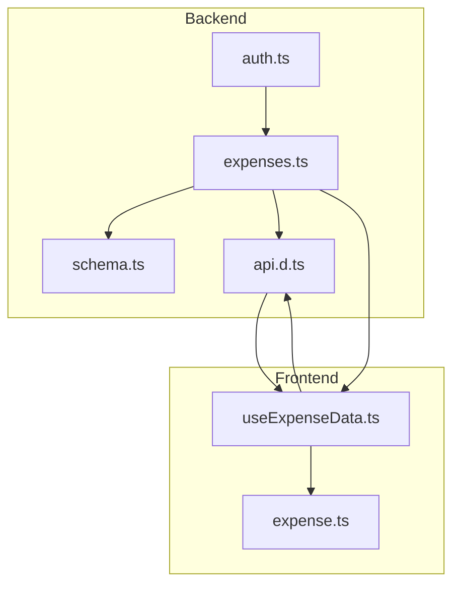
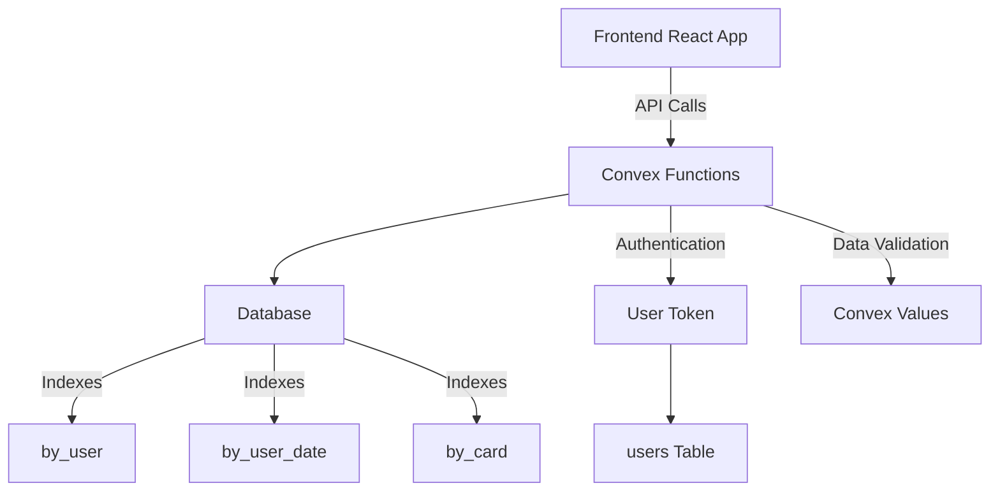
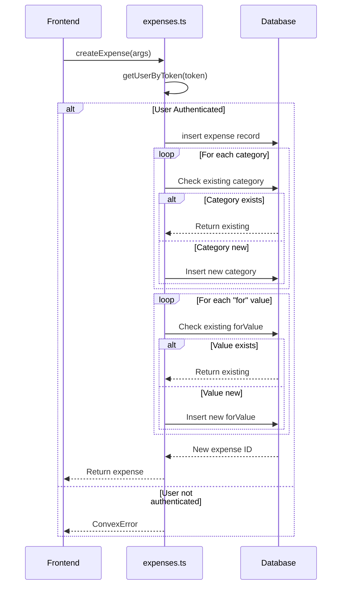
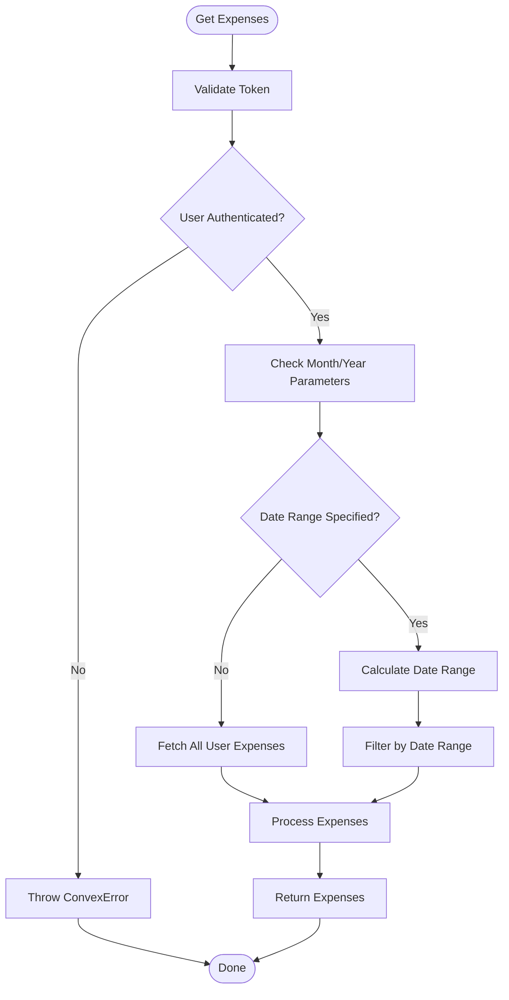
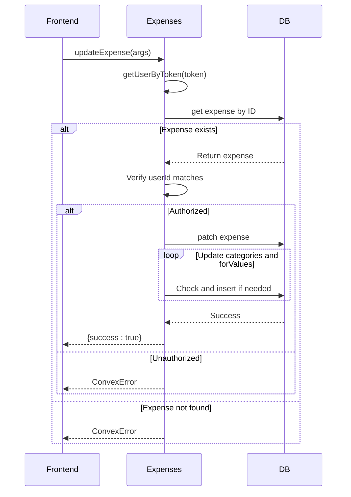
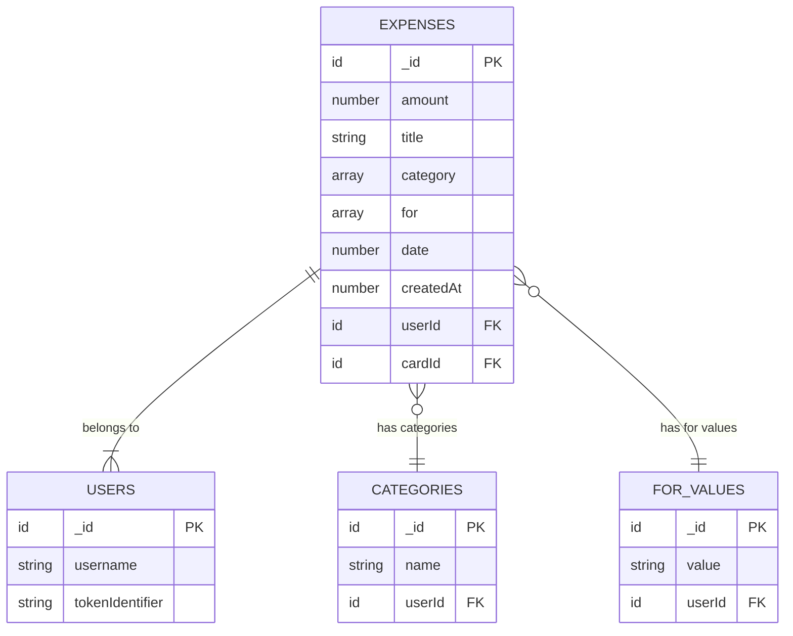
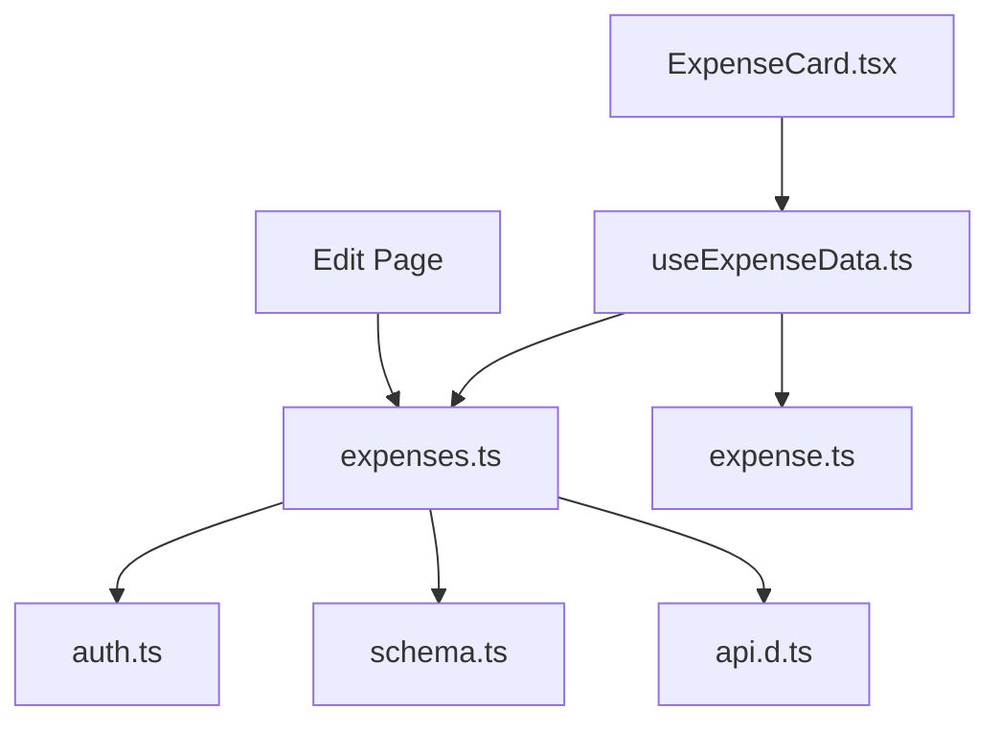

# Expense Management API

<cite>
**Referenced Files in This Document**   
- [expenses.ts](file://convex/expenses.ts)
- [schema.ts](file://convex/schema.ts)
- [api.d.ts](file://convex/_generated/api.d.ts)
- [useExpenseData.ts](file://src/features/dashboard/hooks/useExpenseData.ts)
- [expense.ts](file://src/features/dashboard/types/expense.ts)
</cite>

## Table of Contents
1. [Introduction](#introduction)
2. [Project Structure](#project-structure)
3. [Core Components](#core-components)
4. [Architecture Overview](#architecture-overview)
5. [Detailed Component Analysis](#detailed-component-analysis)
6. [Dependency Analysis](#dependency-analysis)
7. [Performance Considerations](#performance-considerations)
8. [Troubleshooting Guide](#troubleshooting-guide)
9. [Conclusion](#conclusion)

## Introduction
The Expense Management API provides a secure and efficient backend for managing user expenses in a personal finance application. Built on Convex, it implements full CRUD operations with robust access control, data validation, and query optimization. This document details the implementation of the expense management module, focusing on the `expenses.ts` file and its integration with the frontend.

## Project Structure
The project follows a modular architecture with clear separation between backend logic (Convex functions), frontend components (React), and shared types. The backend resides in the `convex/` directory, while frontend code is organized under `src/`. The expense management functionality is primarily implemented in `convex/expenses.ts`, with data models defined in `convex/schema.ts`.



**Diagram sources**
- [expenses.ts](file://convex/expenses.ts)
- [schema.ts](file://convex/schema.ts)
- [api.d.ts](file://convex/_generated/api.d.ts)
- [useExpenseData.ts](file://src/features/dashboard/hooks/useExpenseData.ts)

**Section sources**
- [expenses.ts](file://convex/expenses.ts)
- [schema.ts](file://convex/schema.ts)

## Core Components
The core components of the expense management system include:
- **CRUD Operations**: `createExpense`, `getExpenses`, `updateExpense`, `deleteExpense`
- **Data Models**: Expense, Category, ForValues
- **Access Control**: User authentication and authorization
- **Query Optimization**: Indexed database queries
- **Frontend Integration**: React hooks and type definitions

These components work together to provide a seamless experience for managing financial data.

**Section sources**
- [expenses.ts](file://convex/expenses.ts#L25-L324)
- [schema.ts](file://convex/schema.ts#L1-L62)

## Architecture Overview
The architecture follows a serverless pattern with Convex functions serving as the backend API layer. The frontend consumes these functions through auto-generated API references. Data is stored in a structured document database with proper indexing for performance.



**Diagram sources**
- [expenses.ts](file://convex/expenses.ts)
- [schema.ts](file://convex/schema.ts)

## Detailed Component Analysis

### CRUD Operations Analysis

#### Create Expense Function
The `createExpense` function handles the creation of new expense records with comprehensive validation and side effects.



**Diagram sources**
- [expenses.ts](file://convex/expenses.ts#L25-L55)

**Section sources**
- [expenses.ts](file://convex/expenses.ts#L25-L55)

#### Read Operations
The expense module provides multiple query functions for retrieving expense data with different filtering options.



**Diagram sources**
- [expenses.ts](file://convex/expenses.ts#L87-L117)

**Section sources**
- [expenses.ts](file://convex/expenses.ts#L87-L117)

#### Update and Delete Operations
The update and delete operations implement strict access control to ensure data security.



**Diagram sources**
- [expenses.ts](file://convex/expenses.ts#L125-L199)

**Section sources**
- [expenses.ts](file://convex/expenses.ts#L125-L199)

### Data Structure Analysis
The Expense document structure is designed to support flexible categorization and tracking.



**Diagram sources**
- [schema.ts](file://convex/schema.ts#L15-L22)

**Section sources**
- [schema.ts](file://convex/schema.ts#L15-L22)

## Dependency Analysis
The expense management module has clear dependencies on other components in the system.



**Diagram sources**
- [expenses.ts](file://convex/expenses.ts)
- [useExpenseData.ts](file://src/features/dashboard/hooks/useExpenseData.ts)

**Section sources**
- [expenses.ts](file://convex/expenses.ts)
- [useExpenseData.ts](file://src/features/dashboard/hooks/useExpenseData.ts)

## Performance Considerations
The system implements several performance optimizations:

- **Indexed Queries**: All user-specific queries use the `by_user` index
- **Efficient Filtering**: Date range filtering is applied after initial indexed query
- **Caching Strategy**: Frontend uses query keys to manage cache invalidation
- **Batch Operations**: Related data (categories, forValues) is managed efficiently

The `getExpensesByDateRange` function demonstrates query optimization by first retrieving all user expenses via index, then filtering in memory:

```typescript
const expenses = await ctx.db
  .query("expenses")
  .withIndex("by_user", (q) => q.eq("userId", user._id))
  .collect();

return expenses.filter(expense => 
  expense.date >= args.startDate && expense.date <= args.endDate
);
```

This approach leverages database indexing for the primary filter (userId) while applying date filtering in application code.

**Section sources**
- [expenses.ts](file://convex/expenses.ts#L117-L124)

## Troubleshooting Guide
Common issues and their solutions:

### Authentication Errors
**Error**: "Authentication required"  
**Cause**: Invalid or missing token  
**Solution**: Ensure valid authentication token is passed in function arguments

### Authorization Errors
**Error**: "Expense not found or not authorized"  
**Cause**: User attempting to access expense belonging to another user  
**Solution**: Verify the expense belongs to the authenticated user

### Validation Errors
**Error**: "Category name cannot be empty."  
**Cause**: Attempting to create category with empty name  
**Solution**: Provide non-empty category name

**Section sources**
- [expenses.ts](file://convex/expenses.ts#L12)
- [expenses.ts](file://convex/expenses.ts#L143)
- [expenses.ts](file://convex/expenses.ts#L259)

## Conclusion
The Expense Management API provides a robust, secure, and efficient backend for managing financial data. Key strengths include:
- Comprehensive access control through user token verification
- Flexible data model supporting array fields for categories and recipients
- Optimized queries using database indexing
- Clean separation between backend logic and frontend presentation
- Proper error handling with meaningful error messages

The system effectively balances performance, security, and flexibility, making it suitable for personal finance applications with complex categorization needs.