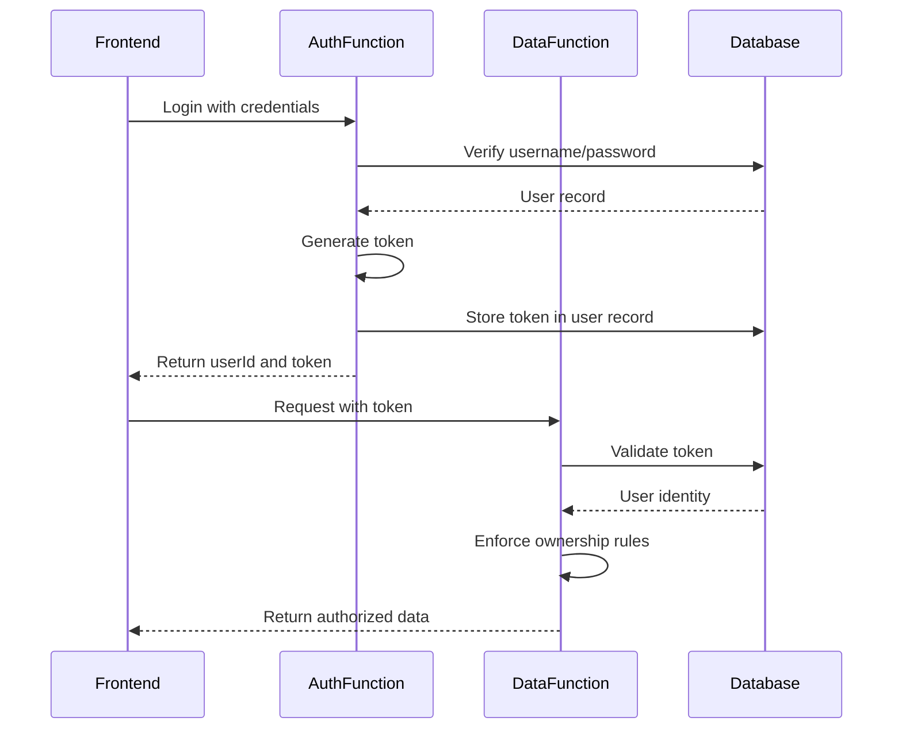
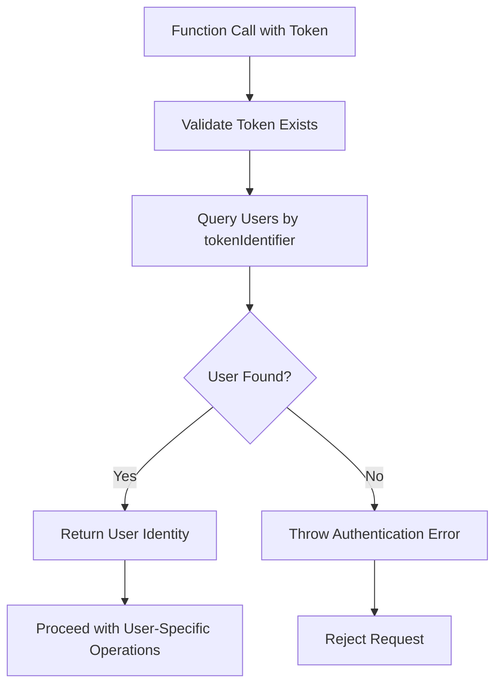
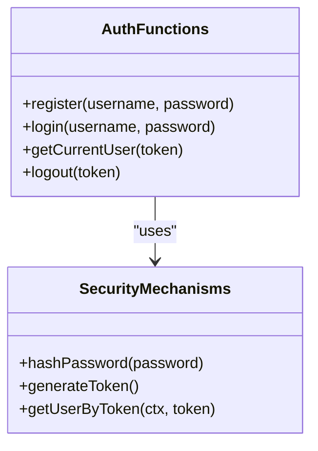
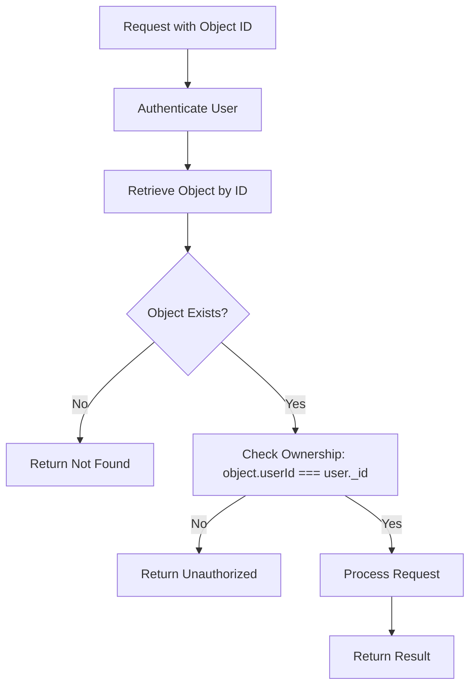

# Security and Access Control

<cite>
**Referenced Files in This Document**   
- [auth.ts](file://convex/auth.ts)
- [expenses.ts](file://convex/expenses.ts)
- [userSettings.ts](file://convex/userSettings.ts)
- [cardsAndIncome.ts](file://convex/cardsAndIncome.ts)
- [schema.ts](file://convex/schema.ts)
</cite>

## Table of Contents
1. [Introduction](#introduction)
2. [Convex Authenticated Context](#convex-authenticated-context)
3. [User Identity and Session Management](#user-identity-and-session-management)
4. [Security Implementation by Module](#security-implementation-by-module)
   - [Authentication Security (auth.ts)](#authentication-security-authts)
   - [Expense Data Protection (expenses.ts)](#expense-data-protection-expensests)
   - [User Settings Scoping (userSettings.ts)](#user-settings-scoping-usersettingsts)
   - [Financial Data Security (cardsAndIncome.ts)](#financial-data-security-cardsandincomets)
5. [Core Security Patterns](#core-security-patterns)
   - [Principle of Least Privilege](#principle-of-least-privilege)
   - [Ownership Validation Pattern](#ownership-validation-pattern)
   - [Threat Model: IDOR Mitigation](#threat-model-idor-mitigation)
6. [Code Examples and Anti-Patterns](#code-examples-and-anti-patterns)
7. [Conclusion](#conclusion)

## Introduction
This document provides comprehensive documentation of the security model implemented across the Convex backend functions in the Expense Tracker application. It details how user authentication, authorization, and data access control are enforced throughout the system. The architecture follows strict security principles including authenticated context propagation, user ownership validation, and the principle of least privilege to protect sensitive financial data.

**Section sources**
- [auth.ts](file://convex/auth.ts#L1-L131)
- [schema.ts](file://convex/schema.ts#L1-L61)

## Convex Authenticated Context
Convex provides an authenticated execution context for all backend functions through token-based authentication. Every mutation and query function receives a context object (`ctx`) that enables database operations and access to the authenticated user's identity via a token parameter passed from the frontend.

The security model relies on the `tokenIdentifier` field stored in the `users` table, which serves as a session token. This token is generated upon login and registration, and is validated on every subsequent request to establish the requesting user's identity.



**Diagram sources**
- [auth.ts](file://convex/auth.ts#L52-L60)
- [auth.ts](file://convex/auth.ts#L84-L88)

**Section sources**
- [auth.ts](file://convex/auth.ts#L5-L131)

## User Identity and Session Management
Convex automatically handles authentication headers and session management through a token-based system. The backend does not rely on HTTP cookies or traditional session stores; instead, it uses bearer tokens passed as function arguments.

When a user logs in or registers, the system:
1. Authenticates credentials against the database
2. Generates a cryptographically random token
3. Stores the token in the user's record
4. Returns the token to the frontend for subsequent requests

The `getUserByToken` helper function is used across multiple modules to validate the token and retrieve the authenticated user's identity. This function queries the `users` table using the `by_token` index to find a user with a matching `tokenIdentifier`.



**Diagram sources**
- [auth.ts](file://convex/auth.ts#L5-L13)
- [expenses.ts](file://convex/expenses.ts#L5-L16)

**Section sources**
- [auth.ts](file://convex/auth.ts#L5-L131)
- [expenses.ts](file://convex/expenses.ts#L5-L16)

## Security Implementation by Module

### Authentication Security (auth.ts)
The `auth.ts` file implements core authentication functionality with security considerations for password hashing and token management.

#### Password Hashing
The system implements a simple password hashing mechanism using a custom hash function with a salt:

```typescript
function hashPassword(password: string): string {
  let hash = 0;
  const saltedPassword = password + "expense-tracker-salt";
  for (let i = 0; i < saltedPassword.length; i++) {
    const char = saltedPassword.charCodeAt(i);
    hash = ((hash << 5) - hash) + char;
    hash = hash & hash;
  }
  return hash.toString(36);
}
```

**Important Security Note**: The current implementation uses a simple custom hash function for demonstration purposes. In production, this should be replaced with a proven cryptographic hashing algorithm like bcrypt, scrypt, or Argon2.

#### Token Management
The system generates random tokens using JavaScript's `Math.random()`:

```typescript
function generateToken(): string {
  return Math.random().toString(36).substring(2, 15) + Math.random().toString(36).substring(2, 15);
}
```

Tokens are stored in the `tokenIdentifier` field of the `users` table and are invalidated on logout by replacing them with a new random token.



**Diagram sources**
- [auth.ts](file://convex/auth.ts#L18-L36)

**Section sources**
- [auth.ts](file://convex/auth.ts#L1-L131)

### Expense Data Protection (expenses.ts)
The `expenses.ts` file implements comprehensive security controls for expense data access, ensuring that users can only access their own expense records.

#### Ownership Validation
Every function in `expenses.ts` begins with a call to `getUserByToken()` to establish the authenticated user's identity, followed by explicit ownership checks when accessing specific records:

```typescript
const expense = await ctx.db.get(args.expenseId);
if (!expense || expense.userId !== user._id) {
  throw new ConvexError("Expense not found or not authorized");
}
```

This pattern prevents Insecure Direct Object Reference (IDOR) vulnerabilities by ensuring that even if a user knows the ID of another user's expense, they cannot access it without proper authorization.

#### Data Access Patterns
The module implements secure data access through indexed queries that scope results to the authenticated user:

```typescript
ctx.db.query("expenses").withIndex("by_user", (q) => q.eq("userId", user._id))
```

This approach ensures that queries only return data belonging to the authenticated user, implementing the principle of least privilege at the database query level.

**Section sources**
- [expenses.ts](file://convex/expenses.ts#L1-L325)
- [schema.ts](file://convex/schema.ts#L15-L21)

### User Settings Scoping (userSettings.ts)
The `userSettings.ts` file demonstrates a clean implementation of user-specific data scoping for application preferences.

#### Scoped Preferences
User settings are tightly coupled to the user identity through the `userId` foreign key. The `get` function ensures that users can only retrieve their own settings:

```typescript
const settings = await ctx.db
  .query("userSettings")
  .withIndex("by_user", (q) => q.eq("userId", user._id))
  .first();
```

The `update` function follows a safe pattern of either updating existing settings or creating new ones, always scoped to the authenticated user:

```typescript
if (existingSettings) {
  await ctx.db.patch(existingSettings._id, { /* updated fields */ });
} else {
  await ctx.db.insert("userSettings", { userId: user._id, /* new settings */ });
}
```

This implementation prevents privilege escalation attacks by ensuring users cannot modify settings for other users.

**Section sources**
- [userSettings.ts](file://convex/userSettings.ts#L1-L59)
- [schema.ts](file://convex/schema.ts#L55-L61)

### Financial Data Security (cardsAndIncome.ts)
The `cardsAndIncome.ts` file implements robust security controls for sensitive financial data, including cards and income records.

#### Ownership Enforcement
Similar to the expenses module, all functions validate user ownership before allowing access to financial data:

```typescript
// Card deletion with ownership check
const card = await ctx.db.get(args.cardId);
if (!card || card.userId !== user._id) {
  throw new ConvexError("Card not found or not authorized to delete");
}
```

#### Referential Integrity Protection
The system protects against data integrity issues by preventing deletion of financial objects that are referenced by other records:

```typescript
const expensesUsingCard = await ctx.db
  .query("expenses")
  .withIndex("by_card", (q) => q.eq("cardId", args.cardId))
  .first();

if (expensesUsingCard) {
  throw new ConvexError("Cannot delete card used in expenses");
}
```

This prevents orphaned references and maintains data consistency while also serving as a security control against accidental data loss.

#### Sensitive Data Aggregation
The `getCardBalances` function securely aggregates financial data while maintaining user isolation:

```typescript
const cardBalances = cards.map(card => {
  const cardIncome = income
    .filter(inc => inc.cardId === card._id)
    .reduce((sum, inc) => sum + inc.amount, 0);
  // ... balance calculation
});
```

All calculations are performed within the context of the authenticated user's data, ensuring that financial summaries cannot leak information across user boundaries.

**Section sources**
- [cardsAndIncome.ts](file://convex/cardsAndIncome.ts#L1-L285)
- [schema.ts](file://convex/schema.ts#L38-L54)

## Core Security Patterns

### Principle of Least Privilege
The application consistently applies the principle of least privilege by exposing only the minimal necessary data in responses:

```typescript
// getCurrentUser returns only essential user data
return {
  _id: user._id,
  username: user.username,
};
```

This pattern prevents information leakage by avoiding the return of sensitive fields like `hashedPassword` or `tokenIdentifier` in API responses.

Data queries are scoped to the authenticated user through indexed database queries, ensuring that even if a function processes multiple records, only the user's own data is ever accessible.

### Ownership Validation Pattern
The codebase implements a consistent ownership validation pattern across all data access functions:

1. Authenticate the user via token
2. Retrieve the target record by ID
3. Verify that the record's `userId` matches the authenticated user's ID
4. Proceed with operation only if ownership is confirmed

This pattern is implemented uniformly in:
- `expenses.ts`: Expense creation, retrieval, update, and deletion
- `cardsAndIncome.ts`: Card and income operations
- `userSettings.ts`: Settings access and modification

### Threat Model: IDOR Mitigation
The system effectively mitigates Insecure Direct Object Reference (IDOR) vulnerabilities through multiple layers of protection:



Key IDOR mitigation strategies include:
- **Mandatory ownership checks**: Every direct object access includes a userId comparison
- **Scoped queries**: Collection queries are filtered by userId at the database level
- **Error message consistency**: Unauthorized access attempts receive generic error messages to prevent user enumeration
- **No public identifiers**: Object IDs are random and unguessable, preventing enumeration attacks

The system avoids common IDOR pitfalls by never trusting client-provided IDs without validation and by always verifying the relationship between the authenticated user and the target resource.

**Diagram sources**
- [expenses.ts](file://convex/expenses.ts#L142-L144)
- [cardsAndIncome.ts](file://convex/cardsAndIncome.ts#L59-L61)

**Section sources**
- [expenses.ts](file://convex/expenses.ts#L142-L144)
- [cardsAndIncome.ts](file://convex/cardsAndIncome.ts#L59-L61)
- [expenses.ts](file://convex/expenses.ts#L198-L200)

## Code Examples and Anti-Patterns

### Proper Security Patterns
**Correct: Ownership validation with error handling**
```typescript
const expense = await ctx.db.get(args.expenseId);
if (!expense || expense.userId !== user._id) {
  throw new ConvexError("Expense not found or not authorized");
}
```

**Correct: Scoped database queries**
```typescript
ctx.db.query("expenses").withIndex("by_user", (q) => q.eq("userId", user._id))
```

**Correct: Minimal data exposure**
```typescript
return {
  _id: user._id,
  username: user.username,
};
```

### Security Anti-Patterns to Avoid
**Anti-Pattern: Missing ownership check**
```typescript
// DON'T: Direct object access without validation
const expense = await ctx.db.get(args.expenseId);
// Missing: if (expense.userId !== user._id) check
await ctx.db.patch(args.expenseId, updates);
```

**Anti-Pattern: Over-exposure of data**
```typescript
// DON'T: Return sensitive fields
return {
  _id: user._id,
  username: user.username,
  hashedPassword: user.hashedPassword, // Never expose this!
  tokenIdentifier: user.tokenIdentifier, // Never expose this!
};
```

**Anti-Pattern: Weak password hashing**
```typescript
// DON'T: Use simple hash functions in production
function weakHash(password) {
  return password.split('').reduce((a,b) => a + b.charCodeAt(0), 0);
}
```

**Anti-Pattern: Insecure token generation**
```typescript
// DON'T: Use predictable token patterns
function insecureToken() {
  return Date.now().toString(); // Predictable and sequential
}
```

## Conclusion
The Expense Tracker application implements a robust security model across its Convex backend functions. The architecture leverages Convex's authenticated context to provide user identity in all function executions, enabling consistent enforcement of access controls.

Key security strengths include:
- Universal application of user ownership validation
- Consistent implementation of the principle of least privilege
- Effective mitigation of IDOR vulnerabilities through mandatory ownership checks
- Secure token-based session management
- Proper scoping of database queries to prevent data leakage

Areas for improvement include upgrading the password hashing mechanism to use industry-standard cryptographic functions like bcrypt, and enhancing token generation to use cryptographically secure random number generators.

The security patterns demonstrated in this codebase provide a solid foundation for building secure financial applications on the Convex platform, with clear separation of concerns and consistent application of security principles throughout the backend implementation.