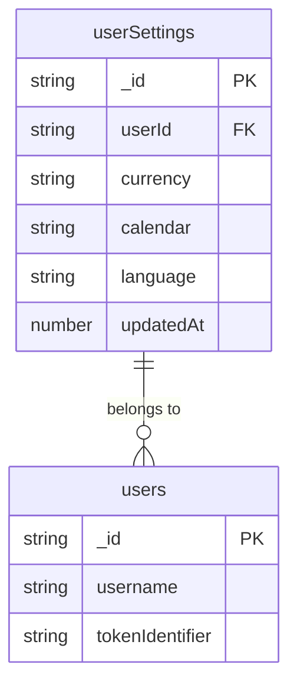
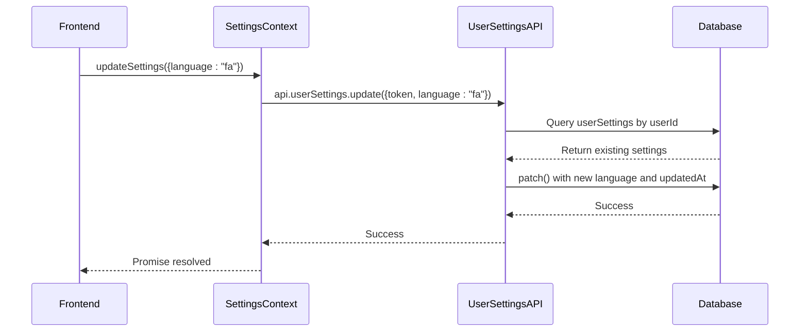
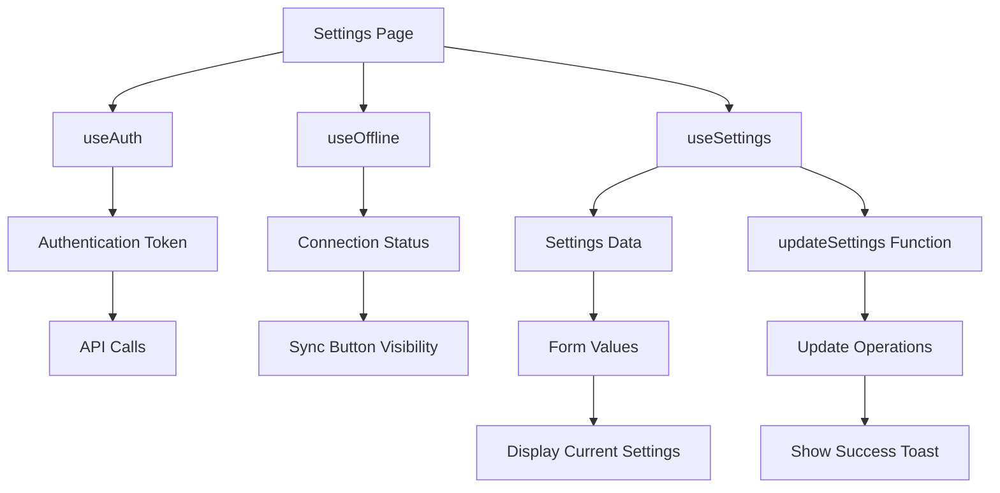

# User Settings Management

<cite>
**Referenced Files in This Document**   
- [userSettings.ts](file://convex/userSettings.ts#L1-L62) - *Updated in recent commit*
- [schema.ts](file://convex/schema.ts#L50-L60) - *Updated in recent commit*
- [SettingsContext.tsx](file://src/contexts/SettingsContext.tsx#L1-L58) - *Updated in recent commit*
- [settings/page.tsx](file://src/app/settings/page.tsx#L1-L208) - *Updated in recent commit*
- [auth.ts](file://convex/auth.ts#L5-L13)
- [api.d.ts](file://convex/_generated/api.d.ts#L1-L43)
</cite>

## Update Summary
**Changes Made**   
- Added documentation for new `language` field in UserSettings data model
- Updated backend API functions to include language parameter in both `getUserSettings` and `updateUserSettings`
- Enhanced frontend integration section to reflect new language setting in SettingsContext
- Updated settings update workflow to include language in merge strategy
- Added edge case handling for language default value
- Modified UI implementation to include language selection component
- Updated all relevant code examples and type definitions

## Table of Contents
1. [Introduction](#introduction)
2. [User Settings Data Model](#user-settings-data-model)
3. [Backend API Functions](#backend-api-functions)
4. [Authentication and Security](#authentication-and-security)
5. [Frontend Integration with SettingsContext](#frontend-integration-with-settingscontext)
6. [Settings Update Workflow](#settings-update-workflow)
7. [Edge Cases and Error Handling](#edge-cases-and-error-handling)
8. [Performance Considerations](#performance-considerations)
9. [UI Implementation in Settings Page](#ui-implementation-in-settings-page)

## Introduction
This document provides a comprehensive overview of the user settings management system in the Expense Tracker application. It covers the backend implementation, data model, authentication safeguards, frontend integration, and user interface components that enable users to customize their preferences. The system allows users to configure currency display, calendar system, and language preferences, with data persistence and real-time synchronization across the application.

**Section sources**
- [userSettings.ts](file://convex/userSettings.ts#L1-L62)
- [schema.ts](file://convex/schema.ts#L50-L60)

## User Settings Data Model
The UserSettings data model defines the structure for storing user-specific preferences in the database. The model includes essential fields for personalization and tracking.

### Data Structure
The userSettings table schema is defined with the following properties:

- **userId**: Reference to the user document (Id<"users">)
- **currency**: User's preferred currency (ISO code: USD, EUR, GBP, IRR)
- **calendar**: Preferred calendar system (gregorian or jalali)
- **language**: Preferred interface language (en or fa)
- **updatedAt**: Timestamp of last modification (number)

### Schema Definition
```typescript
userSettings: defineTable({
  userId: v.id("users"),
  currency: v.union(
    v.literal("USD"),
    v.literal("EUR"),
    v.literal("GBP"),
    v.literal("IRR")
  ),
  calendar: v.union(v.literal("gregorian"), v.literal("jalali")),
  language: v.optional(v.union(v.literal("en"), v.literal("fa"))),
  updatedAt: v.number(),
}).index("by_user", ["userId"])
```

The schema enforces data integrity through:
- **Indexing**: A database index on the userId field for efficient lookups
- **Validation**: Strict type unions for currency, calendar, and language fields
- **Required fields**: All properties except language are mandatory in the schema definition



**Diagram sources**
- [schema.ts](file://convex/schema.ts#L50-L60)

**Section sources**
- [schema.ts](file://convex/schema.ts#L50-L60)

## Backend API Functions
The user settings backend provides two primary functions for retrieving and updating user preferences through the Convex server framework.

### getUserSettings Function
The `get` function retrieves the current user's settings from the database.

#### Implementation
```typescript
export const get = query({
  args: { token: v.string() },
  handler: async (ctx, { token }) => {
    const user = await getUserByToken({ ctx, token });
    
    if (!user) {
      return null;
    }
    
    const settings = await ctx.db
      .query("userSettings")
      .withIndex("by_user", (q) => q.eq("userId", user._id))
      .first();
      
    return settings;
  },
});
```

#### Parameters
- **token**: Authentication token (string) used to identify the user

#### Return Value
- Returns the user settings document if found
- Returns null if no user is authenticated or no settings exist

### updateUserSettings Function
The `update` function persists updated preferences to the database with partial update support.

#### Implementation
```typescript
export const update = mutation({
  args: {
    token: v.string(),
    currency: v.optional(v.union(/* currency literals */)),
    calendar: v.optional(v.union(/* calendar literals */)),
    language: v.optional(v.union(v.literal("en"), v.literal("fa"))),
  },
  handler: async (ctx, { token, currency, calendar, language }) => {
    const user = await getUserByToken({ ctx, token });
    
    if (!user) {
      throw new Error("User not authenticated");
    }
    
    const existingSettings = await ctx.db
      .query("userSettings")
      .withIndex("by_user", (q) => q.eq("userId", user._id))
      .first();
      
    if (existingSettings) {
      await ctx.db.patch(existingSettings._id, {
        ...(currency && { currency }),
        ...(calendar && { calendar }),
        ...(language && { language }),
        updatedAt: Date.now(),
      });
    } else {
      await ctx.db.insert("userSettings", {
        userId: user._id,
        currency: currency || "USD",
        calendar: calendar || "gregorian",
        language: language || "en",
        updatedAt: Date.now(),
      });
    }
  },
});
```

#### Parameters
- **token**: Authentication token (string)
- **currency**: Optional currency preference (USD, EUR, GBP, IRR)
- **calendar**: Optional calendar preference (gregorian, jalali)
- **language**: Optional language preference (en, fa)

#### Merge Strategy
The function implements a smart merge strategy:
- For existing settings: Uses `ctx.db.patch()` to update only provided fields
- For new users: Creates a new document with defaults for unspecified fields
- Always updates the `updatedAt` timestamp
- Language field is optional and defaults to "en" when not specified



**Diagram sources**
- [userSettings.ts](file://convex/userSettings.ts#L20-L62)

**Section sources**
- [userSettings.ts](file://convex/userSettings.ts#L1-L62)

## Authentication and Security
The user settings system implements robust authentication checks to ensure data privacy and security.

### Authentication Mechanism
All settings operations require user authentication through token-based verification.

#### getUserByToken Function
```typescript
export const getUserByToken = async ({ ctx, token }: { ctx: any; token: string }): Promise<Doc<"users"> | null> => {
  if (!token) {
    return null;
  }
  return await ctx.db
    .query("users")
    .withIndex("by_token", (q: any) => q.eq("tokenIdentifier", token))
    .first();
};
```

The function:
- Validates the presence of a token
- Queries the users table using the tokenIdentifier index
- Returns the user document or null if not found

### Security Features
- **Token Validation**: Every request must include a valid authentication token
- **User Scoping**: Settings are scoped to the authenticated user's ID
- **No Direct ID Manipulation**: Users cannot specify which user's settings to access
- **Error Handling**: Authentication failures return appropriate error responses

### Access Control
The system ensures that users can only access and modify their own settings:
- Settings retrieval is filtered by the authenticated user's ID
- Settings updates are only applied to the authenticated user's record
- No administrative endpoints allow cross-user access

**Section sources**
- [userSettings.ts](file://convex/userSettings.ts#L1-L62)
- [auth.ts](file://convex/auth.ts#L5-L13)

## Frontend Integration with SettingsContext
The frontend implements a React context for seamless integration with the user settings API, providing real-time synchronization and easy access to settings data.

### SettingsContext Implementation
The SettingsContext provides a clean interface for components to access and modify user settings.

#### Context Interface
```typescript
interface SettingsContextType {
  settings: Doc<"userSettings"> | null | undefined;
  updateSettings: (args: { currency?: Currency; calendar?: Calendar; language?: Language }) => Promise<void>;
  isLoading: boolean;
}
```

#### Context Provider
```typescript
export function SettingsProvider({ children }: { children: ReactNode }) {
  const { token } = useAuth();
  const settings = useQuery(api.userSettings.get, token ? { token } : "skip");
  const updateMutation = useMutation(api.userSettings.update);

  const updateSettings = async (args: { currency?: Currency; calendar?: Calendar; language?: Language }) => {
    if (!token) {
      console.error("Authentication token not found. Cannot update settings.");
      return;
    }
    try {
      await updateMutation({ ...args, token });
    } catch (error) {
      console.error("Failed to update settings", error);
      throw error;
    }
  };

  return (
    <SettingsContext.Provider
      value={{
        settings,
        updateSettings,
        isLoading: settings === undefined,
      }}
    >
      {children}
    </SettingsContext.Provider>
  );
}
```

### Key Features
- **Automatic Fetching**: Uses `useQuery` to automatically fetch settings when token is available
- **Mutation Handling**: Wraps the update mutation with error handling and token validation
- **Loading State**: Provides a loading flag based on query state
- **Type Safety**: Leverages TypeScript types from the generated API
- **Language Support**: Added support for language preference in update parameters

### Type Definitions
```typescript
export type Currency = Doc<"userSettings">["currency"];
export type Calendar = Doc<"userSettings">["calendar"];
export type Language = Doc<"userSettings">["language"];
```

These types are derived directly from the database schema, ensuring consistency between frontend and backend.

```mermaid
classDiagram
class SettingsContext {
+settings : UserSettings | null | undefined
+updateSettings(args) : Promise~void~
+isLoading : boolean
}
class SettingsProvider {
-token : string
-settings : QueryResult
-updateMutation : MutationFunction
+value : SettingsContextType
}
class useSettings {
+returns : SettingsContextType
}
SettingsProvider --> SettingsContext : "provides"
useSettings --> SettingsContext : "consumes"
SettingsProvider --> "api.userSettings.get" : "uses query"
SettingsProvider --> "api.userSettings.update" : "uses mutation"
```

**Diagram sources**
- [SettingsContext.tsx](file://src/contexts/SettingsContext.tsx#L1-L58)

**Section sources**
- [SettingsContext.tsx](file://src/contexts/SettingsContext.tsx#L1-L58)

## Settings Update Workflow
The settings update process follows a well-defined workflow from user interaction to database persistence.

### Complete Update Flow
```mermaid
flowchart TD
A[User Changes Setting] --> B[Frontend Event Handler]
B --> C[Call updateSettings Function]
C --> D[Validate Authentication Token]
D --> E[Call updateUserSettings API]
E --> F[Verify User Authentication]
F --> G{Settings Exist?}
G --> |Yes| H[Apply Partial Update with patch()]
G --> |No| I[Create New Settings with Defaults]
H --> J[Update updatedAt Timestamp]
I --> J
J --> K[Database Persistence]
K --> L[Return Success]
L --> M[Invalidate Query Cache]
M --> N[Automatic Settings Refresh]
N --> O[UI Updates Automatically]
```

### Step-by-Step Process
1. **User Interaction**: User selects a new currency, calendar system, or language in the settings UI
2. **Event Handling**: The onChange event triggers the updateSettings function
3. **Authentication Check**: The SettingsContext verifies the presence of an authentication token
4. **API Call**: The update mutation is invoked with the new settings and token
5. **Backend Processing**: 
   - User authentication is verified
   - Existing settings are queried by user ID
   - Partial update is applied using patch() or new document is created
   - updatedAt timestamp is updated
6. **Response Handling**: Success or error is returned to the frontend
7. **State Update**: Convex automatically invalidates the query cache
8. **UI Synchronization**: The settings UI automatically refreshes with new values

### Real-time Synchronization
The system leverages Convex's reactivity:
- When settings are updated, the database change triggers automatic query invalidation
- Components using `useQuery` automatically receive updated data
- No manual refetching or state management is required

**Section sources**
- [userSettings.ts](file://convex/userSettings.ts#L20-L62)
- [SettingsContext.tsx](file://src/contexts/SettingsContext.tsx#L1-L58)

## Edge Cases and Error Handling
The user settings system addresses various edge cases and implements comprehensive error handling.

### First-time Users
When a user accesses settings for the first time:
- No existing settings document is found in the database
- The update function creates a new document with default values
- Default currency is set to "USD"
- Default calendar is set to "gregorian"
- Default language is set to "en"
- This ensures all users have valid settings immediately

### Concurrent Updates
The system handles concurrent updates through:
- **Atomic Operations**: Database operations are atomic at the document level
- **Last Write Wins**: Subsequent updates will overwrite previous ones
- **Timestamp Tracking**: updatedAt field helps identify the most recent update
- **No Conflict Resolution**: The simple merge strategy means the last update takes precedence

### Error Scenarios
#### Authentication Failure
- When token is invalid or missing:
  - getUserByToken returns null
  - update function throws "User not authenticated" error
  - Frontend logs error and prevents update

#### Network Issues
- During offline periods:
  - Convex mutation queue holds the update
  - Update is applied when connectivity is restored
  - Users receive feedback about pending operations

#### Validation Errors
The system prevents invalid data through:
- **Schema Validation**: Convex values enforce allowed currency, calendar, and language values
- **Type Safety**: TypeScript prevents invalid values at compile time
- **Runtime Checks**: Optional fields are properly handled in the merge logic

### Error Handling Implementation
```typescript
const updateSettings = async (args: { currency?: Currency; calendar?: Calendar; language?: Language }) => {
  if (!token) {
    console.error("Authentication token not found. Cannot update settings.");
    return;
  }
  try {
    await updateMutation({ ...args, token });
  } catch (error) {
    console.error("Failed to update settings", error);
    throw error;
  }
};
```

The frontend wraps mutations in try-catch blocks and provides user feedback through toast notifications.

**Section sources**
- [userSettings.ts](file://convex/userSettings.ts#L1-L62)
- [SettingsContext.tsx](file://src/contexts/SettingsContext.tsx#L1-L58)

## Performance Considerations
The user settings system is optimized for performance and efficient data access.

### Database Optimization
- **Indexing**: The "by_user" index on userId enables O(log n) lookup performance
- **Efficient Queries**: Queries use indexed fields for fast retrieval
- **Minimal Data Transfer**: Only settings data is transferred, not the entire user document

### Caching Strategy
- **Client-side Caching**: Convex automatically caches query results
- **Automatic Invalidation**: Cache is invalidated when data changes
- **Reactive Updates**: Components receive updates without manual refetching

### Request Optimization
- **Single Document Queries**: Each user has at most one settings document
- **Partial Updates**: patch() operation only sends changed fields
- **Efficient Payloads**: Small request and response sizes

### Load Characteristics
- **High Read Frequency**: Settings are loaded on every page that needs user preferences
- **Low Write Frequency**: Updates occur only when users change preferences
- **Consistent Latency**: Indexed queries ensure predictable response times

### Optimization Recommendations
1. **Preload Settings**: Load settings during initial application startup
2. **Batch Updates**: If multiple settings change simultaneously, update them in a single call
3. **Error Retry Logic**: Implement retry mechanisms for transient network failures
4. **Loading States**: Provide clear feedback during settings operations

**Section sources**
- [userSettings.ts](file://convex/userSettings.ts#L1-L62)
- [schema.ts](file://convex/schema.ts#L50-L60)

## UI Implementation in Settings Page
The settings page provides a user-friendly interface for managing preferences with real-time feedback.

### Component Structure
The settings page is implemented as a client-side React component with the following structure:
- **ProtectedRoute**: Ensures only authenticated users can access the page
- **SettingsProvider**: Provides settings context to child components
- **OfflineBanner**: Displays offline status and sync capabilities
- **BottomNav**: Navigation component for mobile interface

### Preferences Section
The UI includes three primary preference controls:

#### Currency Selection
```jsx
<select
  value={settings?.currency || "USD"}
  onChange={async (e) => {
    await updateSettings({ currency: e.target.value as Currency });
    toast.success("Currency updated");
  }}
>
  {(["USD", "EUR", "GBP", "IRR"] as Currency[]).map((cur) => (
    <option key={cur} value={cur}>{cur}</option>
  ))}
</select>
```

#### Calendar System Selection
```jsx
<select
  value={settings?.calendar || "gregorian"}
  onChange={async (e) => {
    await updateSettings({ calendar: e.target.value as Calendar });
    toast.success("Calendar updated");
  }}
>
  {(["gregorian", "jalali"] as Calendar[]).map((cal) => (
    <option key={cal} value={cal}>{cal}</option>
  ))}
</select>
```

#### Language Selection
```jsx
<select
  value={settings?.language || "en"}
  onChange={async (e) => {
    await updateSettings({ language: e.target.value as Language });
    toast.success("Language updated");
  }}
>
  {(["en", "fa"] as Language[]).map((lang) => (
    <option key={lang} value={lang}>
      {lang === "en" ? "English" : "فارسی"}
    </option>
  ))}
</select>
```

### User Experience Features
- **Immediate Feedback**: Settings changes take effect immediately
- **Visual Confirmation**: Toast notifications confirm successful updates
- **Loading States**: Clear indication when settings are being loaded
- **Default Values**: Fallback to defaults when settings don't exist
- **Responsive Design**: Mobile-optimized interface with proper spacing
- **Language Support**: Added language selection with appropriate display names

### Integration Points
- **useSettings Hook**: Consumes settings data and update function
- **useAuth Hook**: Provides authentication token and user information
- **useOffline Hook**: Displays connection status and sync capabilities
- **toast Notifications**: Provides user feedback for operations



**Diagram sources**
- [settings/page.tsx](file://src/app/settings/page.tsx#L1-L208)

**Section sources**
- [settings/page.tsx](file://src/app/settings/page.tsx#L1-L208)