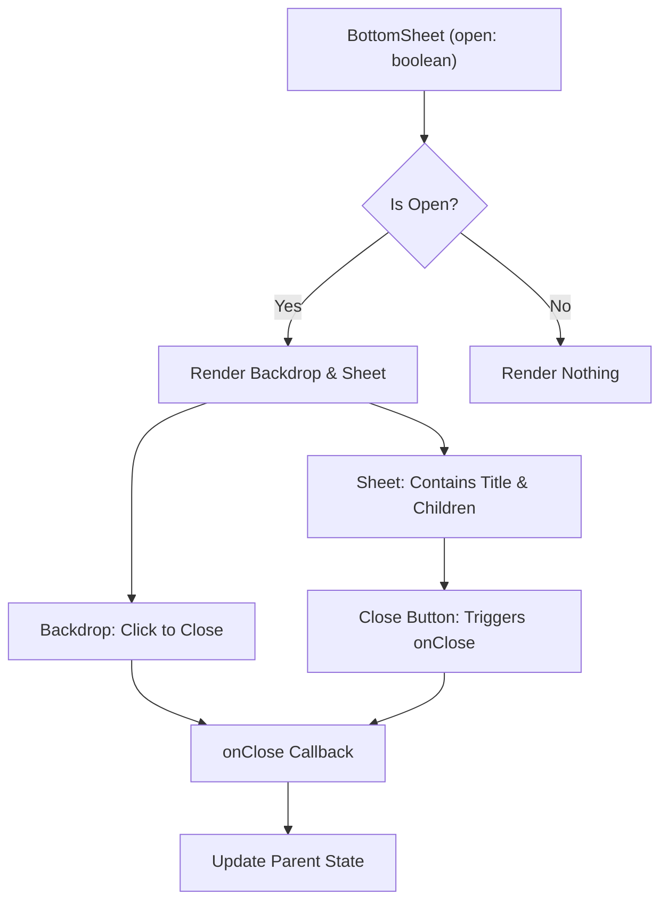
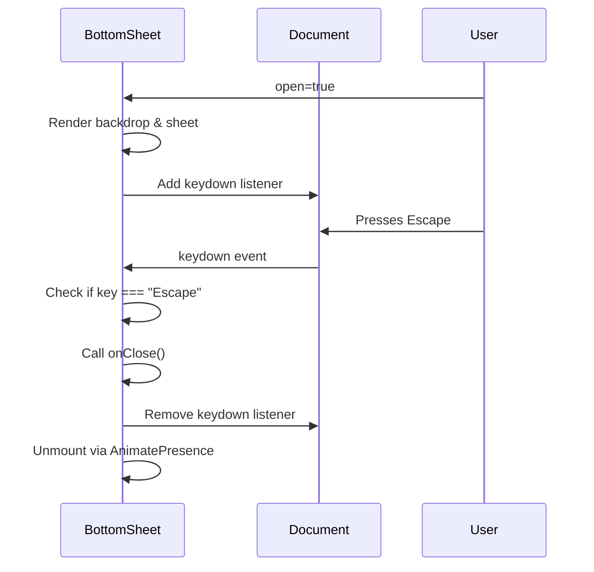
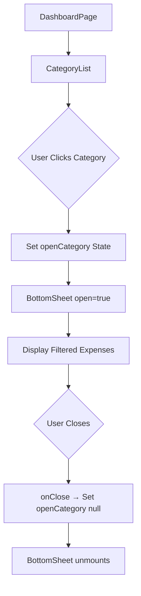

# BottomSheet Component

<cite>
**Referenced Files in This Document**   
- [BottomSheet.tsx](file://src/components/BottomSheet.tsx#L1-L64)
- [CategoryList.tsx](file://src/features/dashboard/components/CategoryList/CategoryList.tsx#L1-L90)
- [page.tsx](file://src/app/dashboard/page.tsx#L1-L155)
</cite>

## Table of Contents
1. [Introduction](#introduction)
2. [Component Overview](#component-overview)
3. [API Interface](#api-interface)
4. [Implementation Details](#implementation-details)
5. [Integration in Dashboard](#integration-in-dashboard)
6. [Accessibility Features](#accessibility-features)
7. [Usage Examples](#usage-examples)
8. [Performance and UX Considerations](#performance-and-ux-considerations)

## Introduction
The BottomSheet component is a modal UI element used in the Expense Tracker application to display contextual content from the bottom of the screen. It provides a smooth, animated interface for viewing detailed information without navigating away from the current page. This documentation details its structure, usage, and integration within the application.

**Section sources**
- [BottomSheet.tsx](file://src/components/BottomSheet.tsx#L1-L64)

## Component Overview
The BottomSheet is a reusable React component that implements a sliding-up panel commonly used in mobile interfaces. It appears with a spring animation from the bottom of the viewport and includes a backdrop overlay for dimming the background. The component supports keyboard dismissal via the Escape key and click-outside behavior.

It is primarily used in the dashboard to display detailed breakdowns of expense categories, allowing users to explore individual transactions within a selected category.



**Diagram sources**
- [BottomSheet.tsx](file://src/components/BottomSheet.tsx#L1-L64)

**Section sources**
- [BottomSheet.tsx](file://src/components/BottomSheet.tsx#L1-L64)

## API Interface
The BottomSheet component accepts the following props through the `BottomSheetProps` interface:

**Label Structure Requirements**
- `open`: boolean - Controls visibility of the sheet
- `onClose`: () => void - Callback function triggered when the sheet is closed
- `title`: string (optional) - Header title displayed at the top of the sheet
- `children`: ReactNode - Content rendered inside the sheet body

```typescript
interface BottomSheetProps {
  open: boolean;
  onClose: () => void;
  title?: string;
  children: ReactNode;
}
```

These props enable flexible usage across different contexts, allowing any React element to be passed as content while maintaining consistent open/close behavior.

**Section sources**
- [BottomSheet.tsx](file://src/components/BottomSheet.tsx#L7-L12)

## Implementation Details
The component uses Framer Motion for smooth animations and AnimatePresence for mount/unmount transitions. The backdrop fades in with opacity animation, while the sheet slides up using a spring physics model (`stiffness: 280, damping: 30`).

The sheet is constrained to a maximum width (`max-w-md`) and positioned fixed at the bottom with `z-50` stacking context. Its height is limited to `70vh` with overflow scrolling, ensuring usability on small screens.

A key feature is the `useEffect` hook that listens for the Escape key press on the document level when the sheet is open, automatically calling `onClose`.



**Diagram sources**
- [BottomSheet.tsx](file://src/components/BottomSheet.tsx#L14-L64)

**Section sources**
- [BottomSheet.tsx](file://src/components/BottomSheet.tsx#L14-L64)

## Integration in Dashboard
The BottomSheet is integrated into the dashboard through the `CategoryList` component. When a user clicks on a spending category, the sheet opens showing all expenses in that category with formatted dates and currency values.

In `dashboard/page.tsx`, the `CategoryList` component receives aggregated data from `useDashboardData` and passes it to the BottomSheet via props. The parent component manages the `openCategory` state, which controls the sheet's visibility.



**Diagram sources**
- [CategoryList.tsx](file://src/features/dashboard/components/CategoryList/CategoryList.tsx#L1-L90)
- [page.tsx](file://src/app/dashboard/page.tsx#L1-L155)

**Section sources**
- [CategoryList.tsx](file://src/features/dashboard/components/CategoryList/CategoryList.tsx#L1-L90)
- [page.tsx](file://src/app/dashboard/page.tsx#L1-L155)

## Accessibility Features
The BottomSheet includes several accessibility features:
- **Keyboard Dismissal**: Users can press the Escape key to close the sheet
- **Screen Reader Support**: The close button has `aria-label="Close"` for assistive technologies
- **Focus Management**: Although not explicitly implemented, the structure allows for tab navigation within the sheet
- **Click Outside Dismissal**: Clicking the backdrop closes the sheet, providing an intuitive exit method

The component ensures that users with keyboard-only navigation can fully interact with the interface, maintaining compliance with WCAG guidelines for modal dialogs.

**Section sources**
- [BottomSheet.tsx](file://src/components/BottomSheet.tsx#L14-L33)

## Usage Examples
### Basic Usage
```tsx
<BottomSheet 
  open={isOpen} 
  onClose={() => setIsOpen(false)} 
  title="Expense Details"
>
  <p>Transaction details go here</p>
</BottomSheet>
```

### In CategoryList (Actual Implementation)
```tsx
<BottomSheet
  open={!!openCategory}
  onClose={() => setOpenCategory(null)}
  title={openCategory ? `${openCategory} • $${categoryTotals[openCategory].toFixed(2)}` : undefined}
>
  {filteredByCategory.map((exp) => (
    <div key={exp._id}>
      <p>{exp.title}</p>
      <p>-${exp.amount.toFixed(2)}</p>
    </div>
  ))}
</BottomSheet>
```

This pattern demonstrates how dynamic content and conditional rendering are combined with state management for practical use.

**Section sources**
- [CategoryList.tsx](file://src/features/dashboard/components/CategoryList/CategoryList.tsx#L60-L88)

## Performance and UX Considerations
The BottomSheet uses several performance optimizations:
- **Conditional Rendering**: Only renders when `open` is true
- **Animation Optimization**: Uses hardware-accelerated CSS transforms via Framer Motion
- **Event Cleanup**: Removes event listeners on unmount to prevent memory leaks
- **Efficient Re-renders**: Dependencies array in `useEffect` prevents unnecessary listener re-attachment

From a UX perspective, the spring animation feels natural and responsive, while the 70vh height limit ensures the sheet doesn't cover the entire screen on mobile devices. The backdrop opacity (40%) provides sufficient dimming without completely obscuring underlying content.

**Section sources**
- [BottomSheet.tsx](file://src/components/BottomSheet.tsx#L1-L64)