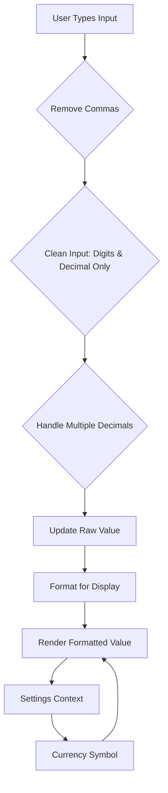
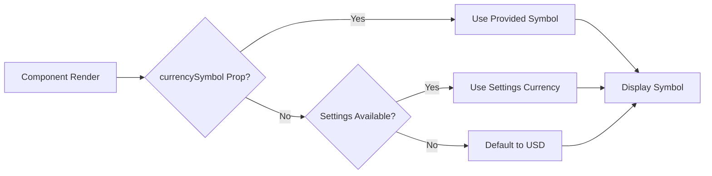
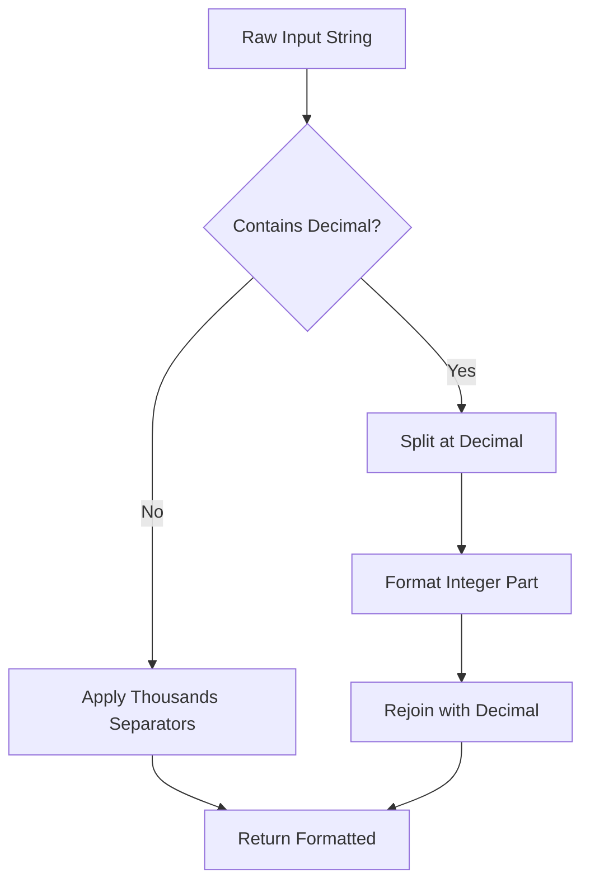
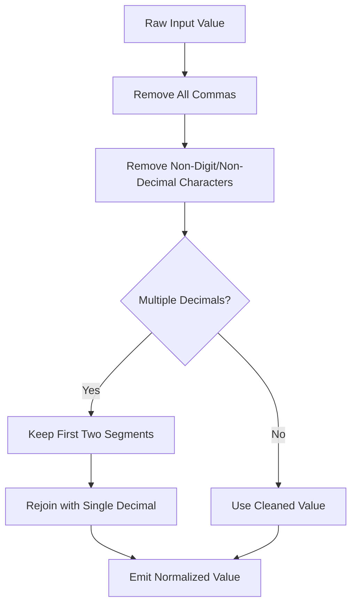

# CurrencyInput Component

<cite>
**Referenced Files in This Document**   
- [CurrencyInput.tsx](file://src/components/CurrencyInput.tsx) - *Updated in commits cddbee2 and fd15506*
- [SettingsContext.tsx](file://src/contexts/SettingsContext.tsx)
- [InputContainer.tsx](file://src/components/InputContainer.tsx)
- [edit/[id]/page.tsx](file://src/app/income/edit/[id]/page.tsx)
- [edit/[id]/page.tsx](file://src/app/expenses/edit/[id]/page.tsx)
- [page.tsx](file://src/app/expenses/page.tsx)
</cite>

## Table of Contents
1. [Introduction](#introduction)
2. [Core Functionality](#core-functionality)
3. [API Interface](#api-interface)
4. [Implementation Details](#implementation-details)
5. [Integration Examples](#integration-examples)
6. [Design and Styling](#design-and-styling)
7. [State Management](#state-management)
8. [Error Handling and Validation](#error-handling-and-validation)
9. [Performance Considerations](#performance-considerations)

## Introduction
The CurrencyInput component is a specialized text input designed for handling monetary values in the Expense Tracker application. It provides real-time formatting of numeric input with thousands separators while maintaining raw numeric data in the component's state for accurate processing and form submission. The component integrates with the application's settings system to dynamically display appropriate currency symbols based on user preferences.

**Section sources**
- [CurrencyInput.tsx](file://src/components/CurrencyInput.tsx#L1-L96)

## Core Functionality
The CurrencyInput component delivers two primary functions:
1. **Visual formatting**: Automatically formats numeric input with comma separators (e.g., converting "8580909" to "8,580,909")
2. **Currency symbol display**: Shows the appropriate currency symbol based on user settings or provided props

The component maintains separation between the displayed formatted value and the raw numeric value stored in state, preventing issues during form submission and data processing.



**Diagram sources**
- [CurrencyInput.tsx](file://src/components/CurrencyInput.tsx#L33-L76)

**Section sources**
- [CurrencyInput.tsx](file://src/components/CurrencyInput.tsx#L1-L96)

## API Interface
The CurrencyInput component exposes a clear and flexible API through its props interface.

### Props Definition
```typescript
interface CurrencyInputProps extends React.InputHTMLAttributes<HTMLInputElement> {
  value: string;
  onChangeValue: (value: string) => void;
  currencySymbol?: string;
}
```

### Prop Descriptions
**:value**  
- **Type**: string  
- **Description**: Raw numeric string without formatting (e.g., "8580909" or "1234.56")  
- **Requirement**: Required  
- **Purpose**: Represents the unformatted numeric value for internal processing

**:onChangeValue**  
- **Type**: (value: string) => void  
- **Description**: Callback function triggered when the input value changes  
- **Requirement**: Required  
- **Purpose**: Receives the cleaned, raw numeric string (without commas) for state updates

**:currencySymbol**  
- **Type**: string (optional)  
- **Description**: Override for the currency symbol display  
- **Requirement**: Optional  
- **Default**: Value from SettingsContext or "USD"  
- **Purpose**: Allows component-level override of the currency symbol

**:className**  
- **Type**: string (optional)  
- **Description**: Additional CSS classes to apply to the container  
- **Requirement**: Optional  
- **Default**: ""  
- **Purpose**: Enables custom styling integration

**Section sources**
- [CurrencyInput.tsx](file://src/components/CurrencyInput.tsx#L7-L15)

## Implementation Details
The CurrencyInput component implements several key mechanisms to ensure reliable currency input handling.

### Currency Symbol Resolution
The component determines the currency symbol through a priority chain:
1. Check for explicit `currencySymbol` prop
2. Fall back to user settings from `SettingsContext`
3. Default to "USD" if neither is available



**Diagram sources**
- [CurrencyInput.tsx](file://src/components/CurrencyInput.tsx#L33-L35)

### Number Formatting Logic
The formatting system preserves decimal precision while adding thousands separators to the integer portion:



**Diagram sources**
- [CurrencyInput.tsx](file://src/components/CurrencyInput.tsx#L52-L60)

### Input Sanitization Process
The component implements robust input sanitization to prevent invalid entries:



**Diagram sources**
- [CurrencyInput.tsx](file://src/components/CurrencyInput.tsx#L62-L72)

**Section sources**
- [CurrencyInput.tsx](file://src/components/CurrencyInput.tsx#L33-L76)

## Integration Examples
The CurrencyInput component is used throughout the application in various financial data entry forms.

### Income Form Integration
In the income editing interface, the component is used to capture income amounts:

```tsx
<CurrencyInput
  value={formData.amount}
  onChangeValue={(val) => setFormData({ ...formData, amount: val })}
  placeholder="0.00"
  required
/>
```

This implementation connects the component to form state management, ensuring that changes to the input update the form's data model.

### Expense Form Integration
The component is similarly used in expense tracking forms:

```tsx
<CurrencyInput
  value={formData.amount}
  onChangeValue={(val) => setFormData({ ...formData, amount: val })}
  placeholder="Enter amount"
  required
/>
```

**Section sources**
- [edit/[id]/page.tsx](file://src/app/income/edit/[id]/page.tsx#L140-L146)
- [edit/[id]/page.tsx](file://src/app/expenses/edit/[id]/page.tsx#L283-L289)
- [page.tsx](file://src/app/expenses/page.tsx#L317-L323)

## Design and Styling
The CurrencyInput component leverages the InputContainer component to maintain consistent styling across the application.

### Visual Structure
```mermaid
classDiagram
class CurrencyInput {
+value : string
+onChangeValue : function
+currencySymbol? : string
+render()
}
class InputContainer {
+leftIcon? : ElementType
+rightAdornment? : ReactNode
+children : ReactNode
+render()
}
CurrencyInput --> InputContainer : "uses"
InputContainer --> "input" : "contains"
```

**Diagram sources**
- [CurrencyInput.tsx](file://src/components/CurrencyInput.tsx#L77-L95)
- [InputContainer.tsx](file://src/components/InputContainer.tsx#L25-L40)

### Styling Features
- **Container**: Rounded corners (10px), light gray background (#f8f8f8), neutral border (#D3D3D3)
- **Focus State**: Black border with inset shadow effect via `:focus-within`
- **Text**: Transparent background, medium font weight when populated
- **Currency Display**: Gray text color (#707070) with non-breaking space preservation

**Section sources**
- [CurrencyInput.tsx](file://src/components/CurrencyInput.tsx#L77-L95)
- [InputContainer.tsx](file://src/components/InputContainer.tsx#L1-L40)

## State Management
The CurrencyInput component implements a controlled input pattern with proper caret positioning.

### Caret Positioning
An effect ensures the text caret remains at the end of the input after formatting changes:

```typescript
useEffect(() => {
  const input = inputRef.current;
  if (input) {
    input.selectionStart = input.selectionEnd = input.value.length;
  }
}, [value]);
```

This prevents the cursor from jumping to the beginning when commas are automatically added during typing.

### Ref Management
The component uses a ref to directly manipulate the DOM input element for caret control, while maintaining React's controlled component pattern for value management.

**Section sources**
- [CurrencyInput.tsx](file://src/components/CurrencyInput.tsx#L74-L76)

## Error Handling and Validation
The component implements several validation and error prevention mechanisms.

### Input Validation Rules
- Allows only digits (0-9) and a single decimal point
- Removes all non-numeric characters except decimal points
- Prevents multiple decimal points by normalizing to at most one
- Handles empty input gracefully

### Edge Case Handling
- **Empty strings**: Returns empty string without formatting
- **Invalid characters**: Strips non-numeric characters automatically
- **Multiple decimals**: Preserves only the first two segments (integer and first decimal portion)
- **Comma removal**: Strips existing commas before processing to prevent duplication

**Section sources**
- [CurrencyInput.tsx](file://src/components/CurrencyInput.tsx#L62-L72)

## Performance Considerations
The CurrencyInput component is optimized for smooth user interaction during rapid typing.

### Optimization Features
- **Minimal re-renders**: Only re-renders when the value prop changes
- **Efficient formatting**: Uses regular expressions for fast string manipulation
- **Selective effect triggering**: Caret positioning effect only runs when value changes
- **Lightweight dependencies**: Depends only on React and context system

### Mobile Keyboard Optimization
Recent updates have enhanced the mobile user experience by optimizing keyboard behavior:
- Added `inputMode="decimal"` to trigger numeric keyboard with decimal support on mobile devices
- Implemented `pattern="[0-9,]*\.?[0-9]*"` to provide additional browser hints for numeric input
- These attributes work together to ensure users see an appropriate numeric keyboard when focusing the input on mobile devices

**Section sources**
- [CurrencyInput.tsx](file://src/components/CurrencyInput.tsx#L78-L96) - *Updated in commits cddbee2 and fd15506*

**Diagram sources**
- [CurrencyInput.tsx](file://src/components/CurrencyInput.tsx#L78-L96) - *Updated in commits cddbee2 and fd15506*