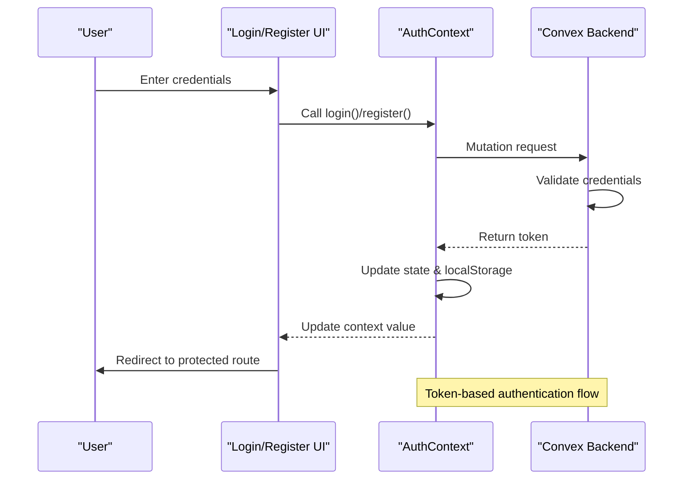
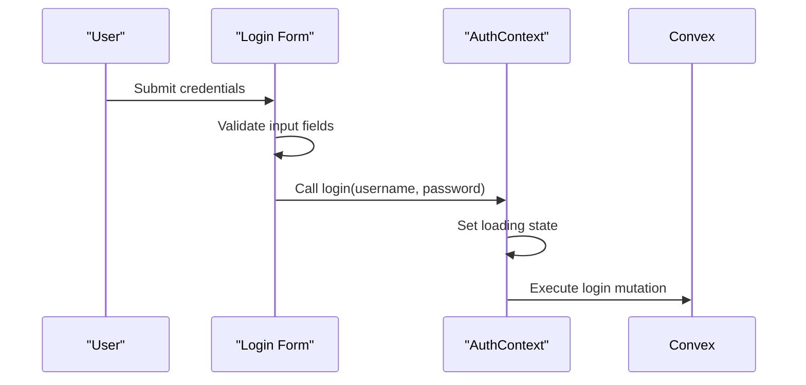
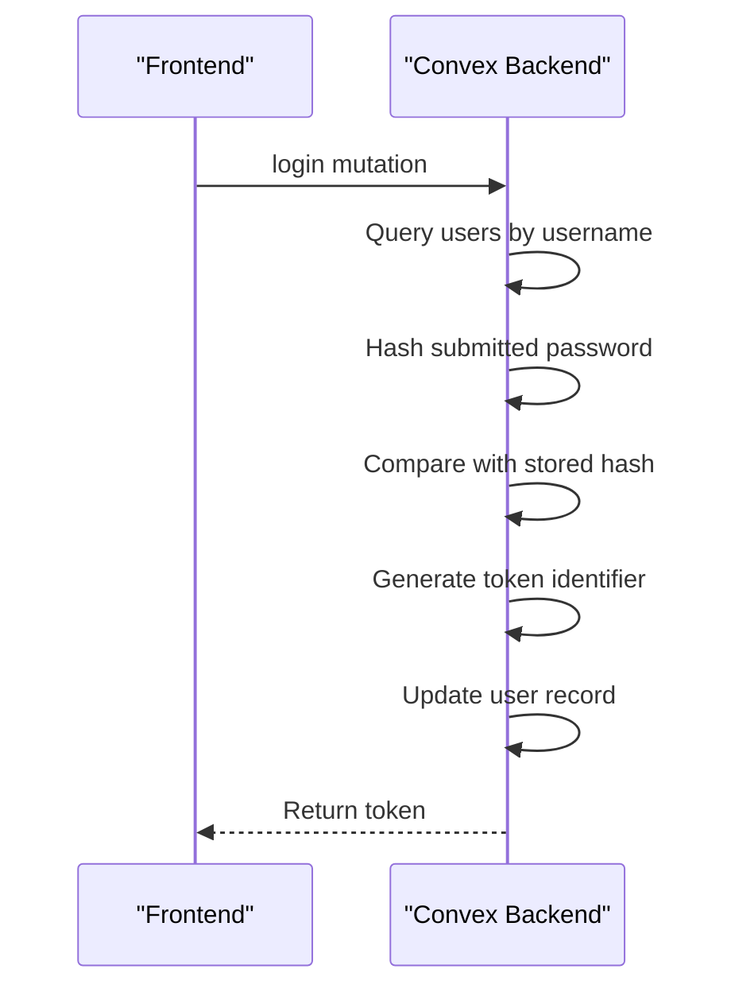
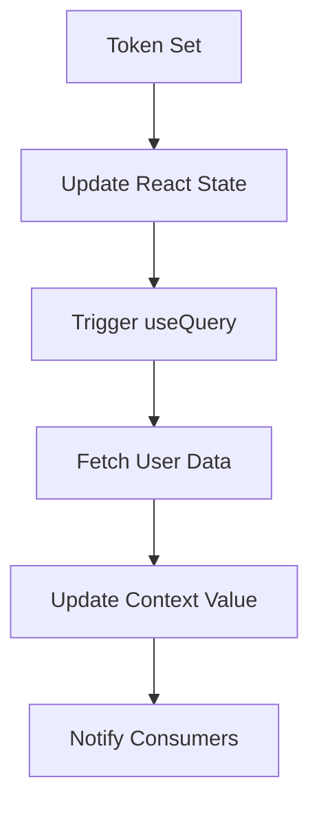
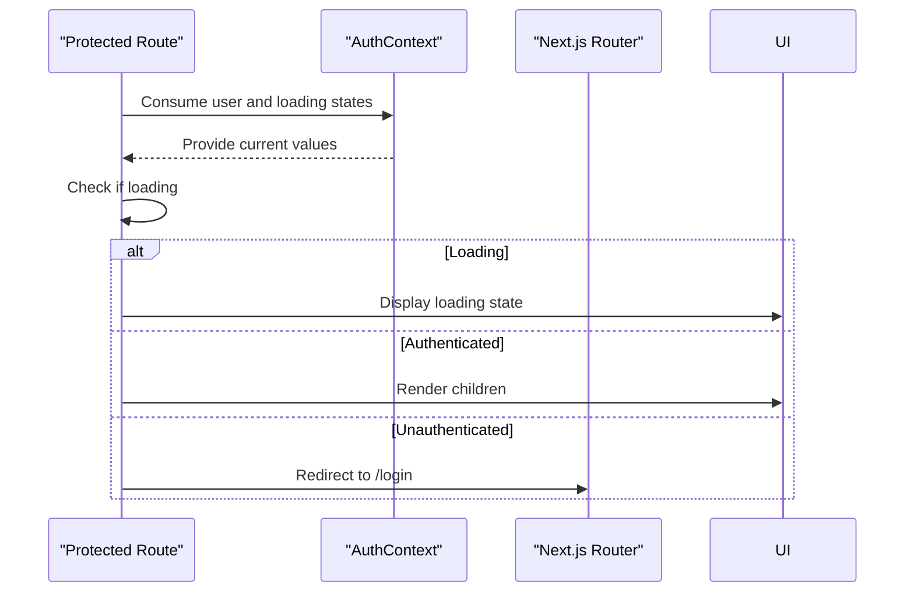

# Authentication Data Flow

<cite>
**Referenced Files in This Document**   
- [AuthContext.tsx](file://src/contexts/AuthContext.tsx#L1-L97)
- [auth.ts](file://convex/auth.ts#L1-L132)
- [ProtectedRoute.tsx](file://src/components/ProtectedRoute.tsx#L1-L35)
- [page.tsx](file://src/app/login/page.tsx#L1-L120)
- [page.tsx](file://src/app/register/page.tsx#L1-L147)
</cite>

## Table of Contents
1. [Authentication Data Flow Overview](#authentication-data-flow-overview)
2. [Core Components](#core-components)
3. [Authentication Lifecycle](#authentication-lifecycle)
4. [AuthContext Implementation](#authcontext-implementation)
5. [Convex Backend Authentication](#convex-backend-authentication)
6. [Protected Route Access Control](#protected-route-access-control)
7. [Security Considerations](#security-considerations)
8. [Error Handling and Debugging](#error-handling-and-debugging)

## Authentication Data Flow Overview

The Expense-Tracker---Warp application implements a token-based authentication system using Convex as the backend platform. The authentication flow begins with user interaction on the login or register pages, proceeds through credential validation on the Convex backend, and concludes with client-side state management via React Context. This document details the complete data flow from user input to protected route access.

The system follows a standard JWT-like pattern where authentication tokens are generated upon successful login or registration, stored in localStorage, and used to retrieve user information for session management. The AuthContext provides a centralized state management solution that components can consume to determine authentication status and access user data.



**Diagram sources**
- [AuthContext.tsx](file://src/contexts/AuthContext.tsx#L1-L97)
- [auth.ts](file://convex/auth.ts#L1-L132)

## Core Components

The authentication system in Expense-Tracker---Warp consists of several key components that work together to manage user sessions and protect application routes:

- **AuthContext**: Manages authentication state including currentUser and loading status
- **Convex auth functions**: Handle credential validation and token generation on the backend
- **ProtectedRoute**: Controls access to authenticated routes and handles redirection
- **Login/Register pages**: User interfaces for authentication and account creation

These components form a cohesive system where the frontend interacts with the backend through well-defined interfaces, maintaining separation of concerns while ensuring secure authentication practices.

**Section sources**
- [AuthContext.tsx](file://src/contexts/AuthContext.tsx#L1-L97)
- [auth.ts](file://convex/auth.ts#L1-L132)
- [ProtectedRoute.tsx](file://src/components/ProtectedRoute.tsx#L1-L35)

## Authentication Lifecycle

The authentication lifecycle in Expense-Tracker---Warp follows a structured flow from user interaction to protected route access. This section details each step in the process.

### Login/Register → Credential Submission

When a user submits credentials through the login or register form, the frontend captures the input and initiates the authentication process. The login page component handles form submission and calls the appropriate AuthContext method.



**Diagram sources**
- [page.tsx](file://src/app/login/page.tsx#L1-L120)
- [AuthContext.tsx](file://src/contexts/AuthContext.tsx#L1-L97)

### Credential Submission → Convex Auth Mutation

The AuthContext component uses Convex's useMutation hook to call backend authentication functions. When login or register is invoked, these mutations send the credentials to the Convex backend for validation.

```typescript
// In AuthContext.tsx
const loginMutation = useMutation(api.auth.login);
const registerMutation = useMutation(api.auth.register);

const login = async (username: string, password: string) => {
  const result = await loginMutation({ username, password });
  // Handle result...
};
```

The mutation system provides a clean interface between frontend and backend, abstracting the network communication details while ensuring type safety through Convex's generated API.

**Section sources**
- [AuthContext.tsx](file://src/contexts/AuthContext.tsx#L1-L97)
- [auth.ts](file://convex/auth.ts#L1-L132)

### Convex Auth Mutation → JWT Token Generation and Storage

Upon receiving authentication requests, the Convex backend validates credentials and generates authentication tokens. The token generation process occurs in the login and register mutation handlers.



**Diagram sources**
- [auth.ts](file://convex/auth.ts#L1-L132)

The backend implements several security measures:
- Passwords are hashed with a salt before storage
- Each user has a tokenIdentifier field that serves as a session token
- Tokens are regenerated on each login for security
- The simple hash function (for demonstration) would be replaced with bcrypt in production

### Token Storage in localStorage

After receiving a token from the Convex backend, the AuthContext stores it in localStorage for persistence across page reloads. This allows the application to maintain the user's authenticated state between sessions.

```typescript
// In AuthContext.tsx
const login = async (username: string, password: string) => {
  const result = await loginMutation({ username, password });
  setToken(result.token);
  localStorage.setItem("auth-token", result.token);
};
```

The token is stored under the key "auth-token" and retrieved when the application initializes to restore the user's session.

**Section sources**
- [AuthContext.tsx](file://src/contexts/AuthContext.tsx#L1-L97)

### AuthContext State Update

The AuthContext manages authentication state using React's useState and useQuery hooks. When a token is set, the context automatically queries for the current user information and updates the provider value.



The context exposes the following values to consumers:
- **user**: Current user object or null if unauthenticated
- **token**: Authentication token or null
- **login**: Function to authenticate with credentials
- **register**: Function to create a new account
- **logout**: Function to end the session
- **loading**: Boolean indicating initialization state

**Section sources**
- [AuthContext.tsx](file://src/contexts/AuthContext.tsx#L1-L97)

### Protected Route Access

Once authenticated, users can access protected routes through the ProtectedRoute component. This component checks the authentication status and handles redirection for unauthenticated users.



**Diagram sources**
- [ProtectedRoute.tsx](file://src/components/ProtectedRoute.tsx#L1-L35)

## AuthContext Implementation

The AuthContext component serves as the central hub for authentication state management in the application. It provides a clean API for components to interact with the authentication system.

### Context Structure and Provider

The AuthContext is implemented using React's Context API with a provider component that wraps the application. The context value includes user data, authentication functions, and loading state.

```typescript
interface AuthContextType {
  user: User | null;
  token: string | null;
  login: (username: string, password: string) => Promise<void>;
  register: (username: string, password: string) => Promise<void>;
  logout: () => Promise<void>;
  loading: boolean;
}
```

The provider component initializes state and handles the connection between frontend and backend authentication systems.

### State Management

AuthContext uses React's useState hook to manage two primary state variables:
- **token**: Stores the authentication token
- **loading**: Indicates whether the authentication system is initializing

```typescript
const [token, setToken] = useState<string | null>(null);
const [loading, setLoading] = useState(true);
```

The loading state is particularly important during application initialization when the context checks for an existing token in localStorage.

### Lifecycle Methods

The AuthContext uses useEffect to initialize the authentication state when the component mounts:

```typescript
useEffect(() => {
  const savedToken = localStorage.getItem("auth-token");
  if (savedToken) {
    setToken(savedToken);
  }
  setLoading(false);
}, []);
```

This ensures that if a user has previously authenticated, their session is restored when they return to the application.

### Authentication Functions

The context exposes three main authentication functions:

**Login Function**
```typescript
const login = async (username: string, password: string) => {
  try {
    const result = await loginMutation({ username, password });
    setToken(result.token);
    localStorage.setItem("auth-token", result.token);
  } catch (error) {
    throw error;
  }
};
```

**Register Function**
```typescript
const register = async (username: string, password: string) => {
  try {
    const result = await registerMutation({ username, password });
    setToken(result.token);
    localStorage.setItem("auth-token", result.token);
  } catch (error) {
    throw error;
  }
};
```

**Logout Function**
```typescript
const logout = async () => {
  if (token) {
    try {
      await logoutMutation({ token });
    } catch (error) {
      console.error("Logout error:", error);
    }
  }
  setToken(null);
  localStorage.removeItem("auth-token");
};
```

Each function follows a similar pattern: call the corresponding Convex mutation, update the local state, and persist the token to localStorage.

**Section sources**
- [AuthContext.tsx](file://src/contexts/AuthContext.tsx#L1-L97)

## Convex Backend Authentication

The Convex backend handles all authentication logic, including credential validation, user management, and token generation. The auth.ts file contains the core authentication functions.

### Authentication Functions

The backend implements four main authentication functions:

**Register Mutation**
- Validates that the username is not already taken
- Hashes the password with a salt
- Generates a unique token identifier
- Creates a new user record in the database

**Login Mutation**
- Finds the user by username
- Hashes the submitted password and compares it with the stored hash
- Generates a new token identifier and updates the user record
- Returns the token to the frontend

**getCurrentUser Query**
- Takes a token as input
- Queries for the user with the matching tokenIdentifier
- Returns basic user information (id and username)
- Returns null if no user is found

**Logout Mutation**
- Finds the user by token
- Invalidates the current token by generating a new one
- Effectively ends the user's session

### Security Implementation

The backend includes several security measures:

**Password Hashing**
```typescript
function hashPassword(password: string): string {
  const saltedPassword = password + "expense-tracker-salt";
  // Simple hash algorithm (demo only)
  return hash.toString(36);
}
```

**Token Management**
- Each user has a tokenIdentifier field that serves as a session token
- Tokens are regenerated on each login
- The logout function invalidates tokens by replacing them

**Input Validation**
- Username uniqueness is enforced at the database level
- Required fields are validated by Convex's type system

```mermaid
classDiagram
class auth {
+register(args : {username, password})
+login(args : {username, password})
+getCurrentUser(args : {token})
+logout(args : {token})
-hashPassword(password)
-generateToken()
}
class User {
_id : Id~users~
username : string
hashedPassword : string
tokenIdentifier : string
}
auth --> User : "manages"
```

**Diagram sources**
- [auth.ts](file://convex/auth.ts#L1-L132)

**Section sources**
- [auth.ts](file://convex/auth.ts#L1-L132)

## Protected Route Access Control

The ProtectedRoute component ensures that only authenticated users can access certain parts of the application. It integrates with AuthContext to determine access permissions.

### Component Implementation

```typescript
export function ProtectedRoute({ children }: ProtectedRouteProps) {
  const { user, loading } = useAuth();
  const router = useRouter();

  useEffect(() => {
    if (!loading && !user) {
      router.replace("/login");
    }
  }, [user, loading, router]);

  if (loading) {
    return <div>Loading...</div>;
  }

  if (!user) {
    return null;
  }

  return <>{children}</>;
}
```

### Access Control Logic

The component follows a three-step process:

1. **Check authentication status**: Uses useAuth to get the current user and loading state
2. **Handle loading state**: Displays a loading indicator while authentication state is being determined
3. **Enforce access control**: Redirects unauthenticated users to the login page

The useEffect hook monitors changes to the user and loading states, automatically redirecting when authentication status changes.

### Route Protection Implementation

ProtectedRoute is used throughout the application to protect sensitive routes:

```typescript
// In protected pages
import { ProtectedRoute } from "@/components/ProtectedRoute";

export default function DashboardPage() {
  return (
    <ProtectedRoute>
      <DashboardContent />
    </ProtectedRoute>
  );
}
```

This pattern is applied to all routes that require authentication, including:
- /dashboard
- /expenses
- /income
- /cards
- /settings

**Section sources**
- [ProtectedRoute.tsx](file://src/components/ProtectedRoute.tsx#L1-L35)

## Security Considerations

The authentication system includes several security measures to protect user data and prevent common vulnerabilities.

### Token Storage Safety

Authentication tokens are stored in localStorage, which provides persistence across page reloads but has security implications:

**Advantages**
- Persists across browser sessions
- Accessible from any tab or window
- Simple to implement

**Risks**
- Vulnerable to XSS attacks
- Accessible to any JavaScript running on the domain

The application mitigates these risks through input validation and secure coding practices to prevent XSS vulnerabilities.

### XSS Protection

While localStorage storage is inherently vulnerable to XSS, the application employs several protective measures:

- Input sanitization in forms
- Use of React's built-in XSS protection
- Limited scope of token permissions
- Short-lived tokens (regenerated on each login)

In a production environment, additional measures like HTTP-only cookies or refresh tokens would provide enhanced security.

### Session Persistence

The authentication system maintains sessions through:

- localStorage persistence of the auth token
- Automatic session restoration on application load
- Token validation on each request

The getCurrentUser query runs whenever the token changes, ensuring that the user's authentication status is always up-to-date.

### Security Limitations

The current implementation has some limitations that should be addressed in production:

- **Password hashing**: The simple hash function should be replaced with bcrypt or similar
- **Token expiration**: No expiration mechanism is implemented
- **Rate limiting**: No protection against brute force attacks
- **Multi-device sessions**: Token regeneration on login invalidates other sessions

**Section sources**
- [AuthContext.tsx](file://src/contexts/AuthContext.tsx#L1-L97)
- [auth.ts](file://convex/auth.ts#L1-L132)

## Error Handling and Debugging

The authentication system includes comprehensive error handling to provide feedback and aid in debugging.

### Error Handling Implementation

Both frontend and backend include error handling mechanisms:

**Backend Errors**
- Username already exists (register)
- Invalid username or password (login)
- Token validation failures

**Frontend Error Handling**
- Input validation (empty fields, password confirmation)
- Network error handling
- User-friendly error messages

```typescript
// In login page
try {
  await login(username.trim(), password);
  router.push("/expenses");
} catch (error: unknown) {
  const message = error instanceof Error ? error.message : "Failed to login";
  toast.error(message);
} finally {
  setIsLoading(false);
}
```

### Common Issues and Solutions

**Silent Authentication Failures**
- **Cause**: Token not properly stored or retrieved
- **Solution**: Check localStorage operations and useEffect initialization

**Context Not Updating**
- **Cause**: Missing dependencies in useEffect or useContext
- **Solution**: Verify that all dependencies are included in dependency arrays

**Session Persistence Issues**
- **Cause**: Token not being saved to localStorage
- **Solution**: Verify localStorage.setItem calls and browser storage permissions

**Debugging Tips**
- Check browser developer tools for localStorage contents
- Verify network requests to Convex functions
- Monitor console for error messages
- Use React DevTools to inspect context values
- Test authentication flow after clearing localStorage

**Section sources**
- [page.tsx](file://src/app/login/page.tsx#L1-L120)
- [AuthContext.tsx](file://src/contexts/AuthContext.tsx#L1-L97)
- [auth.ts](file://convex/auth.ts#L1-L132)