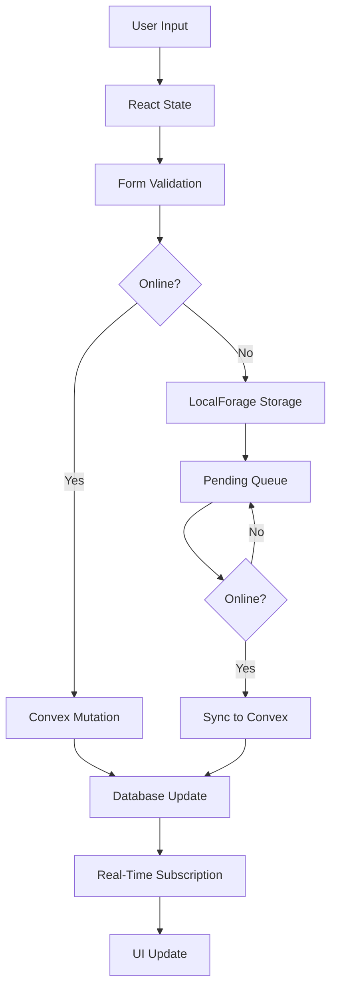
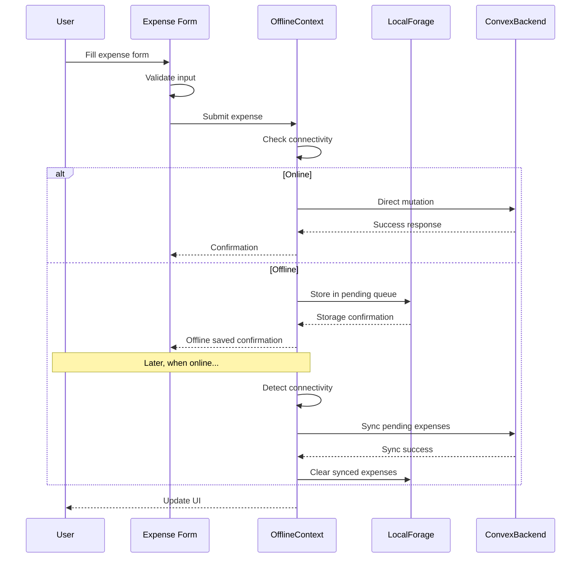
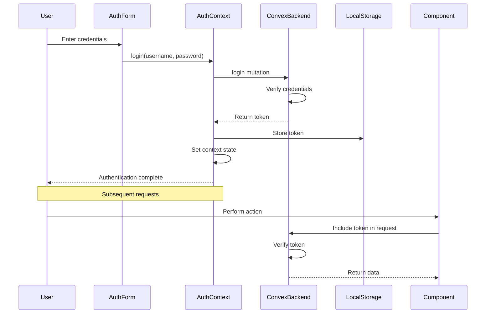
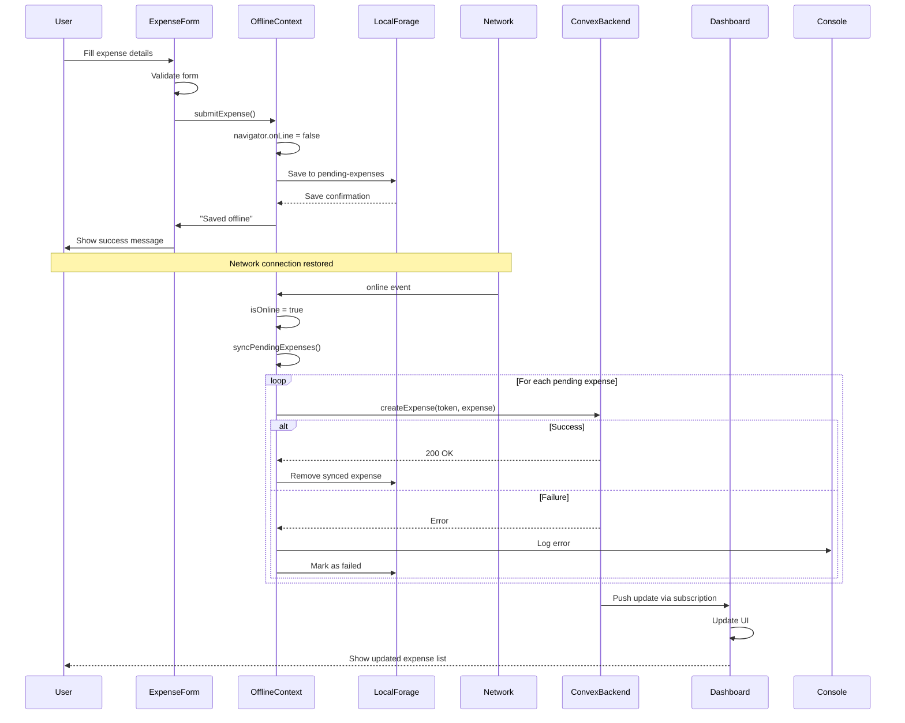

# Data Flow Between Layers

<cite>
**Referenced Files in This Document**   
- [AuthContext.tsx](file://src/contexts/AuthContext.tsx)
- [OfflineContext.tsx](file://src/contexts/OfflineContext.tsx)
- [useExpenseData.ts](file://src/features/dashboard/hooks/useExpenseData.ts)
- [useExpenseActions.ts](file://src/features/dashboard/hooks/useExpenseActions.ts)
- [expenses.ts](file://convex/expenses.ts)
- [auth.ts](file://convex/auth.ts)
- [page.tsx](file://src/app/expenses/page.tsx)
- [OfflineBanner.tsx](file://src/components/OfflineBanner.tsx)
</cite>

## Table of Contents
1. [Introduction](#introduction)
2. [Data Flow Overview](#data-flow-overview)
3. [User Input and Form Handling](#user-input-and-form-handling)
4. [Offline Data Management](#offline-data-management)
5. [Authentication Flow](#authentication-flow)
6. [Real-Time Data and Subscriptions](#real-time-data-and-subscriptions)
7. [Sequence Diagrams](#sequence-diagrams)
8. [Edge Cases and Conflict Resolution](#edge-cases-and-conflict-resolution)
9. [Logging and Debugging Techniques](#logging-and-debugging-techniques)

## Introduction
This document details the complete data flow between frontend and backend layers in the Expense-Tracker---Warp application. It covers the journey of data from user input through React state, validation, offline detection, and eventual synchronization with the Convex backend. The analysis includes the role of context providers, custom hooks, authentication mechanisms, and real-time updates.

**Section sources**
- [AuthContext.tsx](file://src/contexts/AuthContext.tsx)
- [OfflineContext.tsx](file://src/contexts/OfflineContext.tsx)

## Data Flow Overview
The application implements a robust data flow architecture that handles both online and offline scenarios seamlessly. When a user interacts with the application, data flows through multiple layers:

1. **User Input**: Captured in form components and stored in React state
2. **Validation**: Form data is validated before submission
3. **Connectivity Check**: The OfflineContext determines network status
4. **Data Persistence**: 
   - Online: Direct Convex mutation
   - Offline: Stored in localForage with pending status
5. **Synchronization**: Pending operations are automatically synced when connectivity resumes
6. **Real-Time Updates**: Convex subscriptions push updates to subscribed components

The architecture ensures data integrity and provides a smooth user experience regardless of network conditions.



**Diagram sources**
- [OfflineContext.tsx](file://src/contexts/OfflineContext.tsx)
- [expenses.ts](file://convex/expenses.ts)

## User Input and Form Handling
The data flow begins with user input in forms, primarily in the expenses page. The `page.tsx` component manages form state using React's useState hook, capturing expense details such as amount, title, category, and date.

```typescript
const [formData, setFormData] = useState<ExpenseFormData>({
  amount: "",
  title: "",
  category: [],
  for: [],
  date: format(new Date(), "yyyy-MM-dd"),
  cardId: "",
});
```

Form validation occurs in the handleSubmit function, which checks for required fields and valid data types before proceeding. The validation includes:
- Required field checks (amount, title, category, cardId)
- Numeric validation for amount
- Date format validation

When validation passes, the form submission triggers the appropriate data flow based on connectivity status, mediated by the OfflineContext.

**Section sources**
- [page.tsx](file://src/app/expenses/page.tsx)

## Offline Data Management
The OfflineContext is central to the application's offline capabilities. It intercepts API calls and manages operations when connectivity is unavailable.

### OfflineContext Implementation
The OfflineContext uses the browser's online/offline events to track connectivity status:

```typescript
useEffect(() => {
  const handleOnline = () => setIsOnline(true);
  const handleOffline = () => setIsOnline(false);
  
  window.addEventListener("online", handleOnline);
  window.addEventListener("offline", handleOffline);
  
  setIsOnline(navigator.onLine);
  
  return () => {
    window.removeEventListener("online", handleOnline);
    window.removeEventListener("offline", handleOffline);
  };
}, []);
```

When offline, expenses are stored in IndexedDB via localForage with a pending status:

```typescript
const addPendingExpense = async (expense: Omit<PendingExpense, 'id' | 'status'>) => {
  const newExpense: PendingExpense = {
    ...expense,
    id: Date.now().toString(),
    status: 'pending',
  };

  const updated = [...pendingExpenses, newExpense];
  setPendingExpenses(updated);
  try {
    await localforage.setItem('pending-expenses', updated);
  } catch (error) {
    console.error("Failed to save pending expense to IndexedDB:", error);
  }
};
```

### Sync Mechanism
When connectivity resumes, the syncPendingExpenses function processes the queue:

```typescript
const syncPendingExpenses = async () => {
  if (!token || !isOnline) return;

  const expensesToSync = pendingExpenses.filter(e => e.status === 'pending' || e.status === 'failed');
  
  for (const expense of expensesToSync) {
    await updateExpenseStatus(expense.id, 'syncing');
    try {
      await createExpenseMutation({
        token,
        amount: expense.amount,
        title: expense.title,
        category: expense.category,
        for: expense.for,
        date: expense.date,
      });
      // Remove from pending list on success
      const remainingExpenses = pendingExpenses.filter(e => e.id !== expense.id);
      setPendingExpenses(remainingExpenses);
      await localforage.setItem('pending-expenses', remainingExpenses);
    } catch (error) {
      console.error(`Failed to sync expense ${expense.id}:`, error);
      await updateExpenseStatus(expense.id, 'failed');
    }
  }
};
```

The OfflineBanner component provides visual feedback about offline status and pending expenses:



**Diagram sources**
- [OfflineContext.tsx](file://src/contexts/OfflineContext.tsx)
- [OfflineBanner.tsx](file://src/components/OfflineBanner.tsx)

**Section sources**
- [OfflineContext.tsx](file://src/contexts/OfflineContext.tsx)
- [OfflineBanner.tsx](file://src/components/OfflineBanner.tsx)

## Authentication Flow
The authentication system follows a token-based approach with secure storage and context propagation.

### Authentication Process
1. **Credentials Input**: User enters username and password
2. **Authentication Request**: Credentials sent to Convex backend
3. **Token Generation**: Backend verifies credentials and generates token
4. **Token Storage**: Token stored in localStorage
5. **Context Propagation**: AuthContext provides token to all components
6. **Authenticated Requests**: Token included in all Convex requests



### AuthContext Implementation
The AuthContext manages the authentication state and provides helper functions:

```typescript
const login = async (username: string, password: string) => {
  try {
    const result = await loginMutation({ username, password });
    setToken(result.token);
    localStorage.setItem("auth-token", result.token);
  } catch (error) {
    throw error;
  }
};
```

The context also handles token persistence across sessions by loading from localStorage on initialization:

```typescript
useEffect(() => {
  const savedToken = localStorage.getItem("auth-token");
  if (savedToken) {
    setToken(savedToken);
  }
  setLoading(false);
}, []);
```

**Diagram sources**
- [AuthContext.tsx](file://src/contexts/AuthContext.tsx)
- [auth.ts](file://convex/auth.ts)

**Section sources**
- [AuthContext.tsx](file://src/contexts/AuthContext.tsx)
- [auth.ts](file://convex/auth.ts)

## Real-Time Data and Subscriptions
The application leverages Convex's real-time capabilities through subscriptions and cache management.

### useExpenseData Hook
The useExpenseData hook abstracts data access for the dashboard, providing a clean interface for expense data:

```typescript
export function useExpenseData(token: string | null) {
  const [currentDate, setCurrentDate] = useState(new Date());
  const [key, setKey] = useState(0);

  const result = useQuery(
    api.expenses.getExpensesByDateRange,
    token
      ? {
          token,
          startDate: startOfMonth(currentDate).getTime(),
          endDate: endOfMonth(currentDate).getTime(),
          key,
        }
      : "skip"
  );
  
  const expenses = result as unknown as Expense[] | undefined;
  const isLoading = result === undefined;

  const monthlyData = useMemo<MonthlyData | null>(() => {
    if (!expenses) return null;

    const totalAmount = expenses.reduce((sum, expense) => sum + expense.amount, 0);
    const totalCount = expenses.length;

    const categoryTotals = expenses.reduce<Record<string, number>>((acc, expense) => {
      const categories = Array.isArray(expense.category) 
        ? expense.category 
        : [expense.category];
      
      categories.forEach((cat) => {
        acc[cat] = (acc[cat] || 0) + expense.amount;
      });
      return acc;
    }, {});

    const dailyTotals = expenses.reduce<Record<string, number>>((acc, expense) => {
      const date = new Date(expense.date);
      const dayKey = date.toLocaleDateString('en-US', { month: 'short', day: 'numeric' });
      acc[dayKey] = (acc[dayKey] || 0) + expense.amount;
      return acc;
    }, {});

    return {
      totalAmount,
      totalCount,
      categoryTotals,
      dailyTotals,
    };
  }, [expenses]);

  const refetchExpenses = useCallback(() => {
    setKey((prevKey) => prevKey + 1);
  }, []);

  return {
    currentDate,
    expenses,
    monthlyData,
    isLoading,
    goToPreviousMonth,
    goToNextMonth,
    refetchExpenses,
  };
}
```

### Cache Invalidation
The hook implements cache invalidation through a key mechanism:

```typescript
const [key, setKey] = useState(0);
// ...
const refetchExpenses = useCallback(() => {
  setKey((prevKey) => prevKey + 1);
}, []);
```

When refetchExpenses is called (e.g., after adding a new expense), the key increments, forcing the useQuery hook to re-execute with updated parameters, thus invalidating the cache.

**Section sources**
- [useExpenseData.ts](file://src/features/dashboard/hooks/useExpenseData.ts)

## Sequence Diagrams

### Adding Expense Offline and Syncing Later


**Diagram sources**
- [OfflineContext.tsx](file://src/contexts/OfflineContext.tsx)
- [expenses.ts](file://convex/expenses.ts)

## Edge Cases and Conflict Resolution

### Network Flapping
The application handles rapid connectivity changes through debouncing and state management:

- Online/offline events are handled directly by the OfflineContext
- Sync operations are idempotent, preventing duplicate processing
- The pending queue maintains state across connectivity changes

### Duplicate Submissions
The system prevents duplicates through:

1. **UI Feedback**: Immediate visual confirmation of offline save
2. **Queue Management**: Each expense has a unique ID (Date.now().toString())
3. **Server-Side Uniqueness**: While not explicitly implemented, the design prevents client-side duplicates

### Conflict Resolution
The current implementation uses a last-write-wins approach:

- When syncing, the most recent version of data is sent to the server
- No merge strategies are implemented for concurrent edits
- Failed syncs remain in the queue for manual retry

Potential improvements:
- Implement version vectors for conflict detection
- Add merge strategies for concurrent edits
- Provide user interface for conflict resolution

**Section sources**
- [OfflineContext.tsx](file://src/contexts/OfflineContext.tsx)
- [expenses.ts](file://convex/expenses.ts)

## Logging and Debugging Techniques

### Built-in Logging
The application includes comprehensive error logging:

```typescript
try {
  await localforage.setItem('pending-expenses', updated);
} catch (error) {
  console.error("Failed to save pending expense to IndexedDB:", error);
}
```

### Debugging Data Flow
Key techniques for tracing data flow issues:

1. **Console Logging**: Strategic console.error statements in error handlers
2. **State Inspection**: Using React DevTools to inspect component state
3. **Network Monitoring**: Browser dev tools to monitor Convex API calls
4. **IndexedDB Inspection**: Checking localForage storage in Application tab

### Debugging Commands
```bash
# Check pending expenses in console
await localforage.getItem('pending-expenses')

# Check current token
localStorage.getItem("auth-token")

# Force sync
const { syncPendingExpenses } = useOffline();
syncPendingExpenses();
```

### Common Issues and Solutions
| Issue | Diagnosis | Solution |
|------|---------|---------|
| Expenses not syncing | Check connectivity and token validity | Ensure online and authenticated |
| Duplicate expenses | Check pending queue and server state | Clear local queue if necessary |
| Authentication failures | Verify token storage and expiration | Re-login and check credentials |
| Data not updating | Check subscription status | Force refresh with refetch |

**Section sources**
- [OfflineContext.tsx](file://src/contexts/OfflineContext.tsx)
- [AuthContext.tsx](file://src/contexts/AuthContext.tsx)