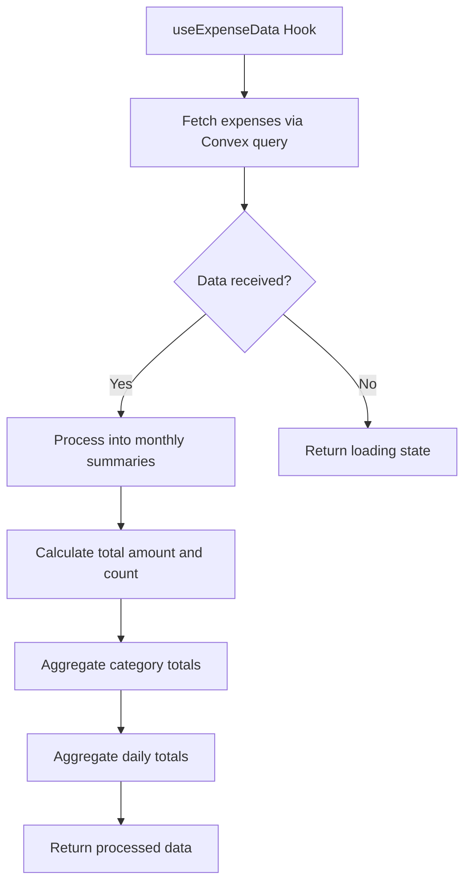
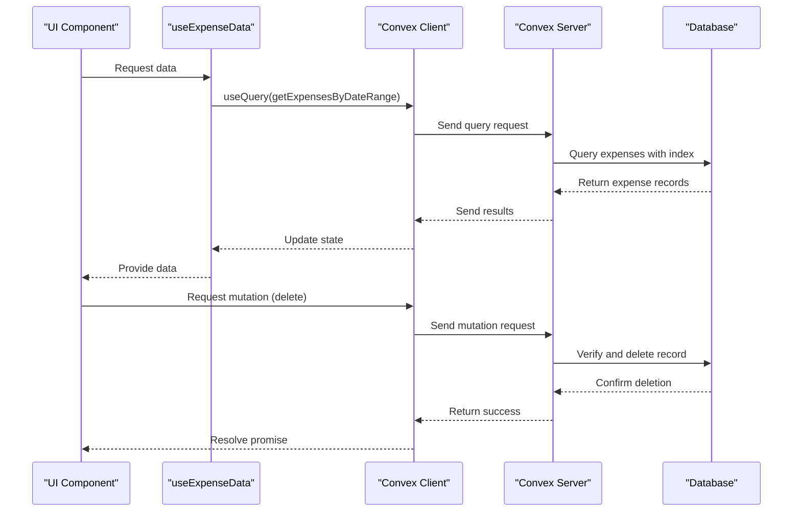
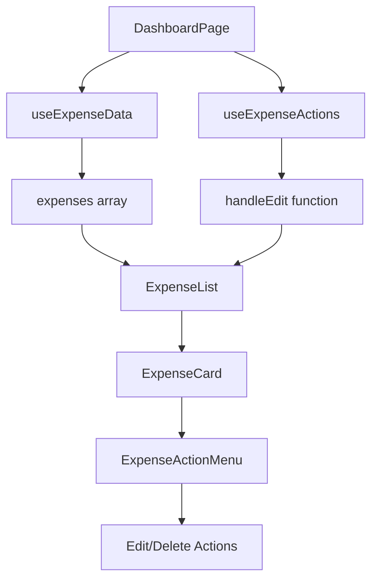

# Expense Data Hooks and State Management

<cite>
**Referenced Files in This Document**   
- [useExpenseData.ts](file://src/features/dashboard/hooks/useExpenseData.ts#L1-L86)
- [useExpenseActions.ts](file://src/features/dashboard/hooks/useExpenseActions.ts#L1-L16)
- [expenses.ts](file://convex/expenses.ts#L1-L325)
- [ExpenseList.tsx](file://src/features/dashboard/components/Expenses/ExpenseList.tsx#L1-L39)
- [ExpenseCard.tsx](file://src/features/dashboard/components/Expenses/ExpenseCard.tsx#L1-L111)
- [page.tsx](file://src/app/dashboard/page.tsx#L1-L127)
- [expense.ts](file://src/features/dashboard/types/expense.ts#L1-L21)
</cite>

## Table of Contents
1. [Introduction](#introduction)
2. [Core Components Overview](#core-components-overview)
3. [useExpenseData Hook Analysis](#useexpensedata-hook-analysis)
4. [useExpenseActions Hook Analysis](#useexpenseactions-hook-analysis)
5. [Backend Query Implementation](#backend-query-implementation)
6. [UI Integration and Component Flow](#ui-integration-and-component-flow)
7. [Performance and Optimization Considerations](#performance-and-optimization-considerations)
8. [Error Handling and Debugging](#error-handling-and-debugging)
9. [Conclusion](#conclusion)

## Introduction
This document provides a comprehensive analysis of the expense data management system in the Expense Tracker application. It focuses on two custom React hooks—`useExpenseData` and `useExpenseActions`—that handle data fetching, state management, and user interactions for expense records. The system leverages Convex as a backend-as-a-service platform for real-time data synchronization and uses React Query patterns through Convex's `useQuery` hook for efficient caching and revalidation.

The architecture follows a clean separation of concerns: frontend hooks manage local state and UI interactions, while Convex handles server-side queries and mutations with automatic real-time updates. This document details how these components work together to provide a responsive, reliable expense tracking experience.

## Core Components Overview

The expense management system consists of several key components organized across the frontend and backend:

- **Frontend Hooks**: `useExpenseData` (data fetching) and `useExpenseActions` (state management)
- **UI Components**: `ExpenseList`, `ExpenseCard`, and associated interactive elements
- **Backend Services**: Convex queries and mutations in `expenses.ts`
- **Data Models**: Defined types for `Expense` and `MonthlyData`

These components interact through a well-defined flow where UI components consume data from hooks, which in turn communicate with the Convex backend via typed APIs.

**Section sources**
- [useExpenseData.ts](file://src/features/dashboard/hooks/useExpenseData.ts#L1-L86)
- [useExpenseActions.ts](file://src/features/dashboard/hooks/useExpenseActions.ts#L1-L16)
- [expenses.ts](file://convex/expenses.ts#L1-L325)

## useExpenseData Hook Analysis

The `useExpenseData` hook is responsible for fetching and processing expense data for the current month. It integrates Convex queries with React state management to provide real-time data access.

### Data Fetching with Convex Queries
The hook uses `useQuery` from `convex/react` to call the `getExpensesByDateRange` query, passing authentication token and date range parameters:

```typescript
const result = useQuery(
  api.expenses.getExpensesByDateRange,
  token
    ? {
        token,
        startDate: startOfMonth(currentDate).getTime(),
        endDate: endOfMonth(currentDate).getTime(),
        key,
      }
    : "skip"
);
```

When the authentication token is available, it executes the query; otherwise, it skips execution to prevent unauthorized requests.

### State Management and Processing
The hook maintains several pieces of state:
- `currentDate`: Tracks the currently displayed month
- `key`: Used to force re-query when needed
- `expenses`: Raw expense data from the query
- `monthlyData`: Processed summary data

The `monthlyData` is computed using `useMemo` to avoid recalculation on every render:



**Diagram sources**
- [useExpenseData.ts](file://src/features/dashboard/hooks/useExpenseData.ts#L1-L86)

### Navigation and Refetching
The hook provides functions for month navigation and data refetching:
- `goToPreviousMonth()` and `goToNextMonth()`: Update `currentDate` using date-fns utilities
- `refetchExpenses()`: Increments the `key` state to trigger a new query execution

This cache-busting pattern ensures fresh data is fetched when explicitly requested by the user.

**Section sources**
- [useExpenseData.ts](file://src/features/dashboard/hooks/useExpenseData.ts#L1-L86)

## useExpenseActions Hook Analysis

The `useExpenseActions` hook manages the selection state for editing expenses. Currently, it provides minimal functionality focused on expense editing workflows.

### State Management for Editing
The hook maintains a single piece of state:
- `selectedExpense`: Stores the currently selected expense for editing

It exposes one action handler:
- `handleEdit(expense)`: Sets the selected expense and returns its ID

```typescript
export function useExpenseActions() {
  const [selectedExpense, setSelectedExpense] = useState<Expense | null>(null);

  const handleEdit = (expense: Expense) => {
    setSelectedExpense(expense);
    return expense._id;
  };

  return {
    selectedExpense,
    handleEdit,
  };
}
```

### Current Limitations
The hook currently only supports edit operations and does not implement create, update, or delete mutations. These operations are handled directly in UI components like `ExpenseCard` using Convex mutations.

**Section sources**
- [useExpenseActions.ts](file://src/features/dashboard/hooks/useExpenseActions.ts#L1-L16)

## Backend Query Implementation

The backend implementation in `convex/expenses.ts` defines the queries and mutations that power the expense management system.

### getExpensesByDateRange Query
This server-side query fetches expenses within a specified date range:

```typescript
export const getExpensesByDateRange = query({
  args: {
    token: v.string(),
    startDate: v.number(),
    endDate: v.number(),
    key: v.optional(v.number()),
  },
  handler: async (ctx, args) => {
    const user = await getUserByToken(ctx, args.token);

    const expenses = await ctx.db
      .query("expenses")
      .withIndex("by_user", (q) => q.eq("userId", user._id))
      .collect();

    return expenses.filter(expense => 
      expense.date >= args.startDate && expense.date <= args.endDate
    );
  },
});
```

Key features:
- Authentication via token verification
- Database indexing for efficient user-based queries
- Client-side filtering by date range
- Automatic real-time subscriptions through Convex

### Mutation Operations
The backend implements several mutations for data modification:



**Diagram sources**
- [expenses.ts](file://convex/expenses.ts#L1-L325)

The `deleteExpense` mutation includes proper authorization checks:
- Verifies expense existence
- Confirms user ownership
- Returns success status

**Section sources**
- [expenses.ts](file://convex/expenses.ts#L1-L325)

## UI Integration and Component Flow

The hooks are integrated into the dashboard UI through the main `page.tsx` component and expense display components.

### Dashboard Page Integration
The `DashboardPage` component imports and uses both hooks:

```typescript
const { currentDate, expenses, monthlyData, isLoading, goToPreviousMonth, goToNextMonth, refetchExpenses } = useExpenseData(token);
const { selectedExpense, handleEdit } = useExpenseActions();
```

It connects the `handleEdit` function to navigation:
```typescript
const handleEditNavigation = (expense: any) => {
  const expenseId = handleEdit(expense);
  if (expenseId) {
    router.push(`/expenses/edit/${expenseId}`);
  }
};
```

### Expense List and Card Components
The `ExpenseList` component receives expenses and callback handlers as props:



**Diagram sources**
- [page.tsx](file://src/app/dashboard/page.tsx#L1-L127)
- [ExpenseList.tsx](file://src/features/dashboard/components/Expenses/ExpenseList.tsx#L1-L39)
- [ExpenseCard.tsx](file://src/features/dashboard/components/Expenses/ExpenseCard.tsx#L1-L111)

The `ExpenseCard` component handles deletion using Convex mutations directly and notifies parents via the `onDeleteSuccess` callback, enabling optimistic updates in the UI.

**Section sources**
- [page.tsx](file://src/app/dashboard/page.tsx#L1-L127)
- [ExpenseList.tsx](file://src/features/dashboard/components/Expenses/ExpenseList.tsx#L1-L39)
- [ExpenseCard.tsx](file://src/features/dashboard/components/Expenses/ExpenseCard.tsx#L1-L111)

## Performance and Optimization Considerations

The system implements several performance optimizations:

### Data Fetching Optimization
- **Indexed Queries**: Uses `by_user` index to efficiently fetch user-specific expenses
- **Date Range Filtering**: Limits data retrieval to relevant time periods
- **Memoization**: Uses `useMemo` to prevent expensive recalculations of summary data

### Rendering Optimization
- **Conditional Rendering**: Only renders charts and lists when data is available
- **Motion Animations**: Uses framer-motion for smooth transitions without blocking the main thread
- **Virtualization Potential**: While not currently implemented, the list structure supports future virtualization

### Caching and Revalidation
- **Convex Caching**: Automatic client-side caching of query results
- **Manual Refetching**: Provides `refetchExpenses` function for explicit cache invalidation
- **Key-based Revalidation**: Uses a key increment pattern to force query re-execution

## Error Handling and Debugging

### Common Issues and Solutions

**Stale Data Issues**
- **Cause**: Convex subscriptions may occasionally miss updates
- **Solution**: Use `refetchExpenses()` after mutations or implement subscription health checks

**Mutation Race Conditions**
- **Cause**: Multiple rapid edits to the same expense
- **Solution**: Implement optimistic updates with rollback capability or use mutation queues

**Subscription Leaks**
- **Cause**: Unmounted components maintaining active queries
- **Solution**: Ensure components unmount properly; Convex typically handles cleanup automatically

### Debugging Guidance
1. **Verify Authentication**: Ensure token is present and valid
2. **Check Network Requests**: Monitor Convex query/mutation calls in browser dev tools
3. **Inspect State Changes**: Use React DevTools to trace state updates
4. **Validate Data Structure**: Confirm expense objects match the `Expense` interface

## Conclusion
The expense data management system effectively combines Convex's real-time capabilities with React's state management patterns. The `useExpenseData` hook provides robust data fetching and processing, while the component architecture enables a responsive user interface. Future improvements could include expanding `useExpenseActions` to handle all mutation operations and implementing more sophisticated caching strategies. The current implementation demonstrates a clean separation of concerns and provides a solid foundation for further development.