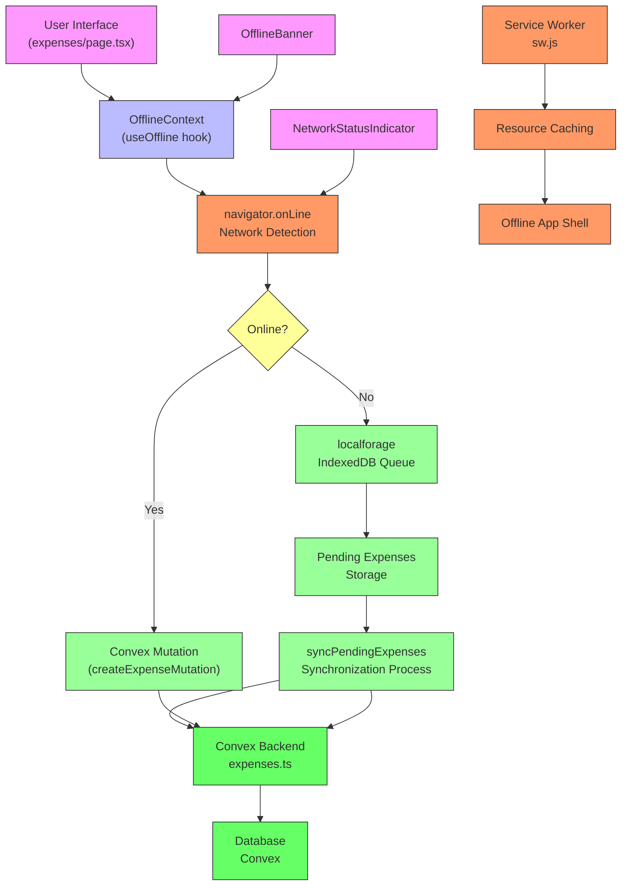

# Offline Data Flow and Synchronization

<cite>
**Referenced Files in This Document**   
- [OfflineContext.tsx](file://src/contexts/OfflineContext.tsx)
- [sw.js](file://public/sw.js)
- [expenses.ts](file://convex/expenses.ts)
- [layout.tsx](file://src/app/layout.tsx)
- [OfflineBanner.tsx](file://src/components/OfflineBanner.tsx)
- [NetworkStatusIndicator.tsx](file://src/components/NetworkStatusIndicator.tsx)
- [page.tsx](file://src/app/expenses/page.tsx)
</cite>

## Table of Contents
1. [Introduction](#introduction)
2. [Offline Context and Network Detection](#offline-context-and-network-detection)
3. [IndexedDB Queue Management with localforage](#indexeddb-queue-management-with-localforage)
4. [Mutation Interception and Offline Queueing](#mutation-interception-and-offline-queueing)
5. [Automatic Synchronization Process](#automatic-synchronization-process)
6. [Service Worker and PWA Capabilities](#service-worker-and-pwa-capabilities)
7. [Example: Adding Expense Offline](#example-adding-expense-offline)
8. [Edge Case Handling](#edge-case-handling)
9. [Logging and Monitoring](#logging-and-monitoring)
10. [Architecture Diagram](#architecture-diagram)

## Introduction
This document provides a comprehensive analysis of the offline data flow and synchronization mechanism in the Expense Tracker application. The system enables users to continue adding expenses when disconnected from the network, with automatic synchronization when connectivity is restored. The implementation leverages modern web technologies including IndexedDB (via localforage), service workers, and Convex mutations to provide a seamless offline experience.

**Section sources**
- [OfflineContext.tsx](file://src/contexts/OfflineContext.tsx#L1-L172)

## Offline Context and Network Detection
The `OfflineContext` component serves as the central hub for managing offline functionality. It uses the browser's `navigator.onLine` property to detect network status and provides this information to the entire application through React's Context API.

The context initializes with online status based on `navigator.onLine` and sets up event listeners for the global `online` and `offline` events. When the network status changes, the context updates its state accordingly, triggering re-renders in all consuming components.

```typescript
useEffect(() => {
  const handleOnline = () => setIsOnline(true);
  const handleOffline = () => setIsOnline(false);

  window.addEventListener("online", handleOnline);
  window.addEventListener("offline", handleOffline);

  setIsOnline(navigator.onLine);

  return () => {
    window.removeEventListener("online", handleOnline);
    window.removeEventListener("offline", handleOffline);
  };
}, []);
```

This approach provides real-time network status detection, allowing the application to respond immediately to connectivity changes.

**Section sources**
- [OfflineContext.tsx](file://src/contexts/OfflineContext.tsx#L38-L58)

## IndexedDB Queue Management with localforage
The application uses `localforage` to create a persistent queue in IndexedDB for storing pending operations. This library provides a simple key-value storage interface while abstracting the complexity of IndexedDB.

The queue is configured with a specific database name and store:
```typescript
localforage.config({
  name: 'ExpenseTracker',
  storeName: 'pending_expenses',
  description: 'Queue for offline expense submissions',
});
```

Pending expenses are stored as an array under the key `'pending-expenses'`. When the application loads, it retrieves any previously saved pending expenses:
```typescript
const loadPendingExpenses = async () => {
  try {
    const saved = await localforage.getItem<PendingExpense[]>('pending-expenses');
    if (saved) {
      setPendingExpenses(saved);
    }
  } catch (error) {
    console.error("Failed to load pending expenses from IndexedDB:", error);
  }
};
```

Each pending expense includes metadata such as amount, title, category, and a status field that tracks whether the expense is 'pending', 'syncing', 'synced', or 'failed'.

**Section sources**
- [OfflineContext.tsx](file://src/contexts/OfflineContext.tsx#L40-L48)
- [OfflineContext.tsx](file://src/contexts/OfflineContext.tsx#L50-L58)

## Mutation Interception and Offline Queueing
When a user attempts to add an expense while offline, the application intercepts the Convex mutation and instead adds the operation to the local queue. This interception is handled by the `addPendingExpense` function in `OfflineContext`:

```typescript
const addPendingExpense = async (expense: Omit<PendingExpense, 'id' | 'status'>) => {
  const newExpense: PendingExpense = {
    ...expense,
    id: Date.now().toString(),
    status: 'pending',
  };

  const updated = [...pendingExpenses, newExpense];
  setPendingExpenses(updated);
  try {
    await localforage.setItem('pending-expenses', updated);
  } catch (error) {
    console.error("Failed to save pending expense to IndexedDB:", error);
  }
};
```

The function creates a new expense object with a timestamp-based ID and 'pending' status, adds it to the current state, and persists the updated queue to IndexedDB. This ensures that even if the user closes the application, the pending expense will be preserved.

The operation metadata (function name, arguments, timestamp) is serialized as part of the expense object, capturing all necessary information to recreate the mutation when online.

**Section sources**
- [OfflineContext.tsx](file://src/contexts/OfflineContext.tsx#L92-L107)

## Automatic Synchronization Process
The synchronization process is triggered manually by calling `syncPendingExpenses`, which executes queued operations when the device is back online. The process follows these steps:

1. **Connection Check**: Verifies both authentication token and online status
2. **Queue Filtering**: Identifies expenses with 'pending' or 'failed' status
3. **Sequential Execution**: Processes each expense in order
4. **Status Updates**: Updates expense status to 'syncing' during transmission
5. **Server Communication**: Attempts to execute the original Convex mutation
6. **Result Handling**: Removes successfully synced expenses or marks failed ones

```typescript
const syncPendingExpenses = async () => {
  if (!token || !isOnline) return;

  const expensesToSync = pendingExpenses.filter(e => e.status === 'pending' || e.status === 'failed');
  if (expensesToSync.length === 0) return;

  for (const expense of expensesToSync) {
    await updateExpenseStatus(expense.id, 'syncing');
    try {
      await createExpenseMutation({
        token,
        amount: expense.amount,
        title: expense.title,
        category: expense.category,
        for: expense.for,
        date: expense.date,
      });
      // On success, remove it from the pending list
      const remainingExpenses = pendingExpenses.filter(e => e.id !== expense.id);
      setPendingExpenses(remainingExpenses);
      await localforage.setItem('pending-expenses', remainingExpenses);
    } catch (error) {
      console.error(`Failed to sync expense ${expense.id}:`, error);
      await updateExpenseStatus(expense.id, 'failed');
    }
  }
};
```

After successful synchronization, the expense is removed from the queue and the local IndexedDB storage is updated. If synchronization fails, the expense status is set to 'failed', allowing for manual retry.

**Section sources**
- [OfflineContext.tsx](file://src/contexts/OfflineContext.tsx#L109-L147)

## Service Worker and PWA Capabilities
The service worker (`sw.js`) enables Progressive Web App (PWA) capabilities, including offline access to application resources. It implements three key lifecycle events:

1. **Install**: Caches essential application resources
2. **Fetch**: Serves cached resources when offline
3. **Activate**: Cleans up outdated caches

```javascript
// Install event - cache resources
self.addEventListener('install', (event) => {
  event.waitUntil(
    caches.open(CACHE_NAME)
      .then((cache) => {
        return cache.addAll(urlsToCache);
      })
  );
});

// Fetch event - serve from cache when offline
self.addEventListener('fetch', (event) => {
  event.respondWith(
    caches.match(event.request)
      .then((response) => {
        // Return cached version or fetch from network
        return response || fetch(event.request);
      }
    )
  );
});
```

The service worker caches core application routes and assets, allowing users to load the application interface even without network connectivity. This complements the data synchronization system by ensuring the application shell is available offline.

**Section sources**
- [sw.js](file://public/sw.js#L1-L50)

## Example: Adding Expense Offline
Consider a user adding an expense while on a subway with no connectivity:

1. User fills out the expense form on the `/expenses` page
2. The application detects `navigator.onLine` is `false`
3. Instead of calling `createExpenseMutation`, the UI calls `addPendingExpense`
4. The expense is added to the IndexedDB queue with 'pending' status
5. The `OfflineBanner` displays: "You are offline. 1 pending expense will sync when you're back online."
6. The `NetworkStatusIndicator` shows a red dot in the top-right corner

When the user emerges from the subway and connectivity is restored:

1. The `online` event triggers, setting `isOnline` to `true`
2. The application could automatically call `syncPendingExpenses` (though current implementation requires manual trigger)
3. The pending expense is sent to the Convex backend via `createExpenseMutation`
4. Upon success, the expense is removed from the queue and appears in the expense list
5. The UI updates to reflect the synchronized state

**Section sources**
- [OfflineBanner.tsx](file://src/components/OfflineBanner.tsx#L1-L27)
- [NetworkStatusIndicator.tsx](file://src/components/NetworkStatusIndicator.tsx#L1-L23)
- [page.tsx](file://src/app/expenses/page.tsx#L1-L352)

## Edge Case Handling
The system addresses several edge cases to ensure data integrity:

### Partial Sync Failures
When multiple expenses are queued, the system processes them sequentially. If one fails, subsequent expenses remain in the queue for future attempts. Failed expenses are marked with 'failed' status and can be retried individually:

```typescript
const retryFailedExpense = async (expenseId: string) => {
  const expense = pendingExpenses.find(e => e.id === expenseId);
  if (!expense || !token || !isOnline) return;

  await updateExpenseStatus(expense.id, 'syncing');
  try {
    // Attempt to sync the single failed expense
    await createExpenseMutation({ /* expense data */ });
    // Remove from queue on success
    const remainingExpenses = pendingExpenses.filter(e => e.id !== expense.id);
    setPendingExpenses(remainingExpenses);
    await localforage.setItem('pending-expenses', remainingExpenses);
  } catch (error) {
    await updateExpenseStatus(expense.id, 'failed');
  }
};
```

### Duplicate Entries
The system prevents duplicates by using timestamp-based IDs for pending expenses. When synchronized, the server generates its own ID, eliminating the risk of client-side ID conflicts. The local queue management ensures each expense is only submitted once.

### User Logout During Offline Mode
If a user logs out while having pending expenses, the authentication token becomes invalid. When attempting to sync, the system checks for a valid token before proceeding:

```typescript
const syncPendingExpenses = async () => {
  if (!token || !isOnline) return;
  // ...
};
```

Without a valid token, synchronization is blocked, preserving the pending expenses until the user logs back in. This prevents failed authentication attempts and maintains data integrity.

**Section sources**
- [OfflineContext.tsx](file://src/contexts/OfflineContext.tsx#L149-L162)
- [OfflineContext.tsx](file://src/contexts/OfflineContext.tsx#L109-L147)

## Logging and Monitoring
The application implements comprehensive logging to monitor offline queue state and sync progress:

1. **Error Logging**: All failures in IndexedDB operations and synchronization attempts are logged to the console
2. **Sync Status**: Each expense's status ('pending', 'syncing', 'synced', 'failed') provides visibility into its synchronization state
3. **User Feedback**: The `OfflineBanner` component displays the number of pending expenses to the user
4. **Network Indicator**: The `NetworkStatusIndicator` provides a visual cue of connectivity status

```typescript
console.error("Failed to load pending expenses from IndexedDB:", error);
console.error(`Failed to sync expense ${expense.id}:`, error);
```

These logging mechanisms help developers diagnose issues and provide users with clear feedback about the application's offline state.

**Section sources**
- [OfflineContext.tsx](file://src/contexts/OfflineContext.tsx#L56-L58)
- [OfflineContext.tsx](file://src/contexts/OfflineContext.tsx#L144-L145)
- [OfflineBanner.tsx](file://src/components/OfflineBanner.tsx#L1-L27)

## Architecture Diagram
The following diagram illustrates the data flow and component interactions in the offline synchronization system:



**Diagram sources**
- [OfflineContext.tsx](file://src/contexts/OfflineContext.tsx#L1-L172)
- [sw.js](file://public/sw.js#L1-L50)
- [expenses.ts](file://convex/expenses.ts#L1-L325)
- [page.tsx](file://src/app/expenses/page.tsx#L1-L352)
- [OfflineBanner.tsx](file://src/components/OfflineBanner.tsx#L1-L27)
- [NetworkStatusIndicator.tsx](file://src/components/NetworkStatusIndicator.tsx#L1-L23)

**Section sources**
- [OfflineContext.tsx](file://src/contexts/OfflineContext.tsx#L1-L172)
- [sw.js](file://public/sw.js#L1-L50)
- [expenses.ts](file://convex/expenses.ts#L1-L325)