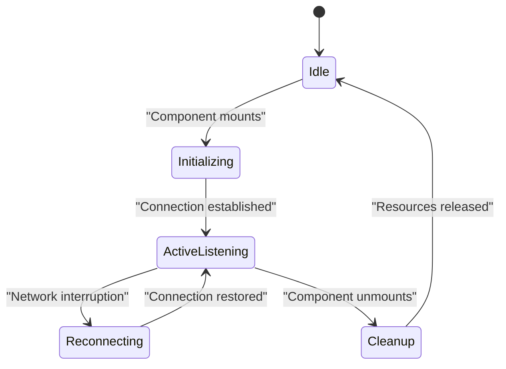
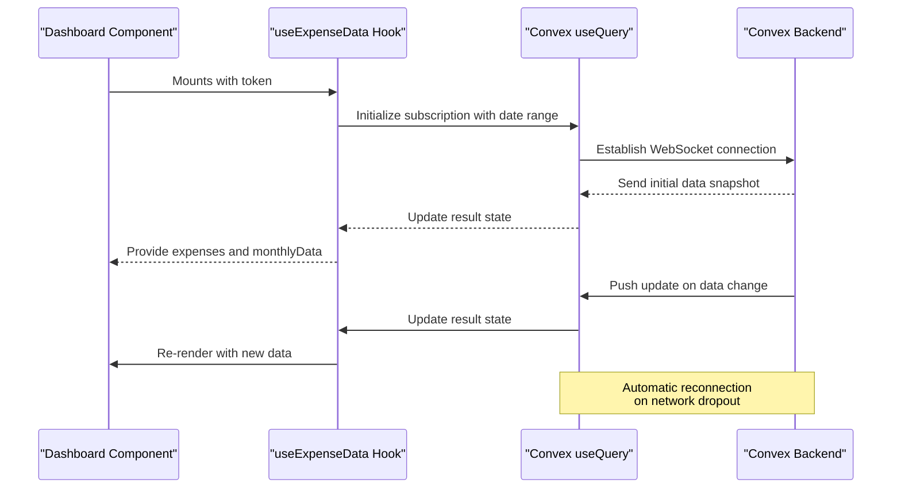
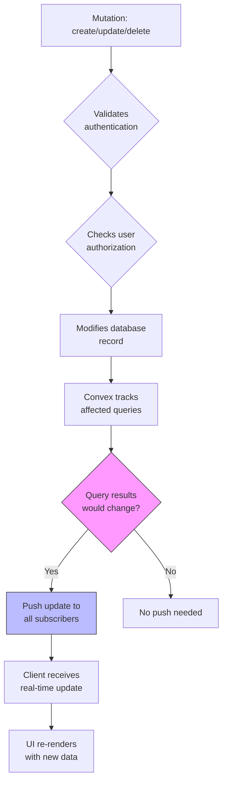
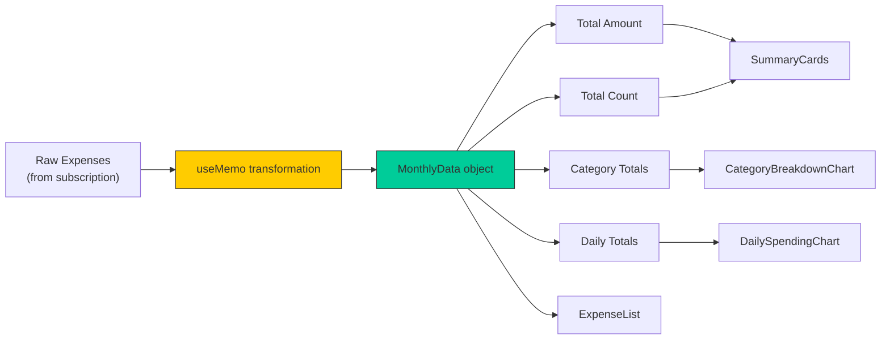
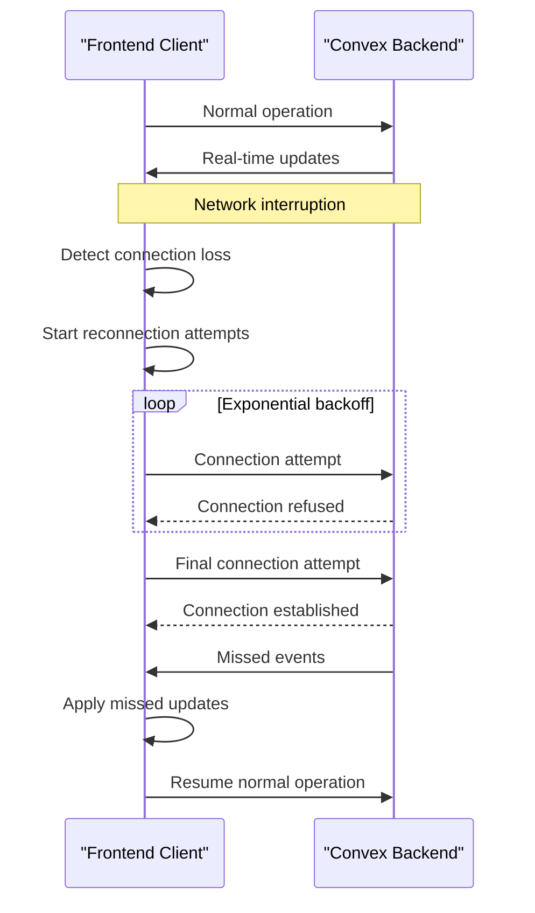
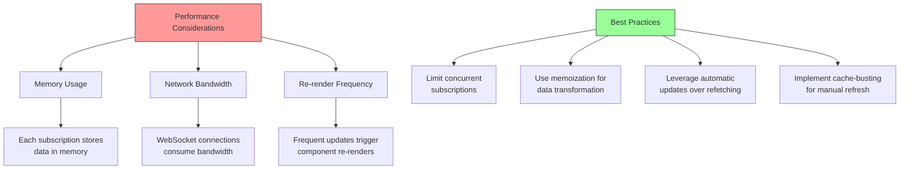

# Real-time Data Updates and Subscriptions

<cite>
**Referenced Files in This Document**   
- [useExpenseData.ts](file://src/features/dashboard/hooks/useExpenseData.ts#L1-L86)
- [expenses.ts](file://convex/expenses.ts#L1-L325)
- [ConvexProvider.tsx](file://src/providers/ConvexProvider.tsx#L1-L15)
- [ExpenseCard.tsx](file://src/features/dashboard/components/Expenses/ExpenseCard.tsx#L1-L110)
- [schema.ts](file://convex/schema.ts#L1-L61)
- [useExpenseActions.ts](file://src/features/dashboard/hooks/useExpenseActions.ts#L1-L16)
</cite>

## Table of Contents
1. [Real-time Data Updates and Subscriptions](#real-time-data-updates-and-subscriptions)
2. [Subscription Lifecycle Management](#subscription-lifecycle-management)
3. [Frontend Subscription Implementation](#frontend-subscription-implementation)
4. [Backend Data Push Mechanism](#backend-data-push-mechanism)
5. [Data Transformation and UI Synchronization](#data-transformation-and-ui-synchronization)
6. [Network Resilience and Reconnection](#network-resilience-and-reconnection)
7. [Performance Implications and Best Practices](#performance-implications-and-best-practices)
8. [Subscription Monitoring and Diagnostics](#subscription-monitoring-and-diagnostics)

## Subscription Lifecycle Management

The Convex real-time subscription system follows a well-defined lifecycle that ensures efficient data synchronization between the backend and frontend. The lifecycle consists of three distinct phases: initialization, active listening, and cleanup.

During initialization, when a component mounts and calls the `useQuery` hook, Convex establishes a WebSocket connection to the backend server. This connection remains open for the duration of the subscription, enabling bidirectional communication. The active listening phase begins immediately after initialization, where the frontend receives real-time updates whenever the underlying data changes in the database. Finally, during cleanup, when the component unmounts or the subscription dependencies change, Convex automatically terminates the WebSocket connection and releases associated resources.

**Diagram sources**
- [ConvexProvider.tsx](file://src/providers/ConvexProvider.tsx#L1-L15)
- [useExpenseData.ts](file://src/features/dashboard/hooks/useExpenseData.ts#L1-L86)

**Section sources**
- [useExpenseData.ts](file://src/features/dashboard/hooks/useExpenseData.ts#L1-L86)

## Frontend Subscription Implementation

The frontend establishes reactive subscriptions to expense data through the `useQuery` hook provided by Convex. The `useExpenseData` hook serves as the primary interface for managing real-time expense data subscriptions in the dashboard component.

The hook initializes a subscription to the `getExpensesByDateRange` query with specific parameters including authentication token, start date, and end date. When any of these parameters change, Convex automatically manages the subscription lifecycle, ensuring the UI receives updated data. The hook also implements a cache-busting mechanism using a key parameter that can be incremented to force a re-fetch of data when needed.

**Diagram sources**
- [useExpenseData.ts](file://src/features/dashboard/hooks/useExpenseData.ts#L1-L86)
- [expenses.ts](file://convex/expenses.ts#L1-L325)

**Section sources**
- [useExpenseData.ts](file://src/features/dashboard/hooks/useExpenseData.ts#L1-L86)

## Backend Data Push Mechanism

The Convex backend automatically pushes updates to subscribed clients whenever underlying data changes. This mechanism is implemented through Convex's reactive query system, which monitors database operations and notifies all active subscriptions when relevant data is modified.

The `getExpensesByDateRange` query in the `expenses.ts` file defines the data access pattern for expense records. When a mutation such as `createExpense`, `updateExpense`, or `deleteExpense` modifies an expense record, Convex's internal system automatically determines which active queries are affected by the change. If the modified expense falls within the date range of an active subscription, the backend pushes the updated data to the subscribed client.

**Diagram sources**
- [expenses.ts](file://convex/expenses.ts#L1-L325)
- [schema.ts](file://convex/schema.ts#L1-L61)

**Section sources**
- [expenses.ts](file://convex/expenses.ts#L1-L325)

## Data Transformation and UI Synchronization

The `useExpenseData` hook not only manages the subscription but also transforms the raw expense data into a format optimized for UI rendering. This transformation occurs within a `useMemo` hook, ensuring it only runs when the underlying expenses data changes.

The transformation process calculates several derived values including total amount, total count, category totals, and daily totals. These calculations enable the dashboard to display comprehensive analytics without requiring additional backend queries. When real-time updates are received from Convex, this transformation pipeline automatically re-executes, ensuring the UI reflects the latest state across all tabs and devices.

**Diagram sources**
- [useExpenseData.ts](file://src/features/dashboard/hooks/useExpenseData.ts#L1-L86)
- [ExpenseCard.tsx](file://src/features/dashboard/components/Expenses/ExpenseCard.tsx#L1-L110)

**Section sources**
- [useExpenseData.ts](file://src/features/dashboard/hooks/useExpenseData.ts#L1-L86)

## Network Resilience and Reconnection

Convex provides built-in network resilience features that ensure reliable real-time updates even in unstable network conditions. When a network dropout occurs, the Convex client automatically attempts to reconnect to the backend server.

The reconnection process follows an exponential backoff strategy, gradually increasing the delay between connection attempts to avoid overwhelming the server. Upon successful reconnection, Convex ensures data consistency by providing any missed events that occurred during the disconnection period. This mechanism guarantees that clients eventually receive all updates, maintaining data integrity across all connected devices.

The `ConvexProvider` component initializes the Convex client with the application's URL, establishing the foundation for all real-time operations. This centralized initialization ensures consistent configuration across all subscriptions in the application.

**Diagram sources**
- [ConvexProvider.tsx](file://src/providers/ConvexProvider.tsx#L1-L15)
- [useExpenseData.ts](file://src/features/dashboard/hooks/useExpenseData.ts#L1-L86)

**Section sources**
- [ConvexProvider.tsx](file://src/providers/ConvexProvider.tsx#L1-L15)

## Performance Implications and Best Practices

Multiple active subscriptions can impact application performance, particularly in terms of memory usage and network bandwidth. Each active subscription maintains a WebSocket connection and stores data in memory, creating potential performance bottlenecks as the number of subscriptions increases.

To optimize performance, the application implements several best practices. The `useExpenseData` hook limits subscriptions to a single date range at a time, reducing the volume of data transferred. The cache-busting key mechanism allows for controlled re-fetching without creating additional subscriptions. Additionally, the use of `useMemo` for data transformation minimizes unnecessary calculations during re-renders.

When a user performs actions that modify expense data, such as editing or deleting an expense, the application leverages Convex's automatic subscription updates rather than manually refetching data. This approach reduces network overhead and ensures immediate UI updates across all connected instances.

**Diagram sources**
- [useExpenseData.ts](file://src/features/dashboard/hooks/useExpenseData.ts#L1-L86)
- [useExpenseActions.ts](file://src/features/dashboard/hooks/useExpenseActions.ts#L1-L16)

**Section sources**
- [useExpenseData.ts](file://src/features/dashboard/hooks/useExpenseData.ts#L1-L86)

## Subscription Monitoring and Diagnostics

While the application does not include explicit subscription monitoring tools, developers can leverage Convex's built-in debugging capabilities to inspect active subscriptions and diagnose update delays. The reactive nature of the `useQuery` hook makes it straightforward to trace data flow from the backend to the UI.

To diagnose update delays, developers can examine the network traffic between the client and Convex backend, checking for WebSocket messages containing data updates. They can also verify that mutations are properly triggering the expected query invalidations by examining the sequence of operations in the browser's developer tools.

The combination of Convex's automatic subscription management and React's component lifecycle makes it relatively straightforward to understand when and why updates occur, facilitating effective troubleshooting of real-time data issues.

**Section sources**
- [useExpenseData.ts](file://src/features/dashboard/hooks/useExpenseData.ts#L1-L86)
- [expenses.ts](file://convex/expenses.ts#L1-L325)