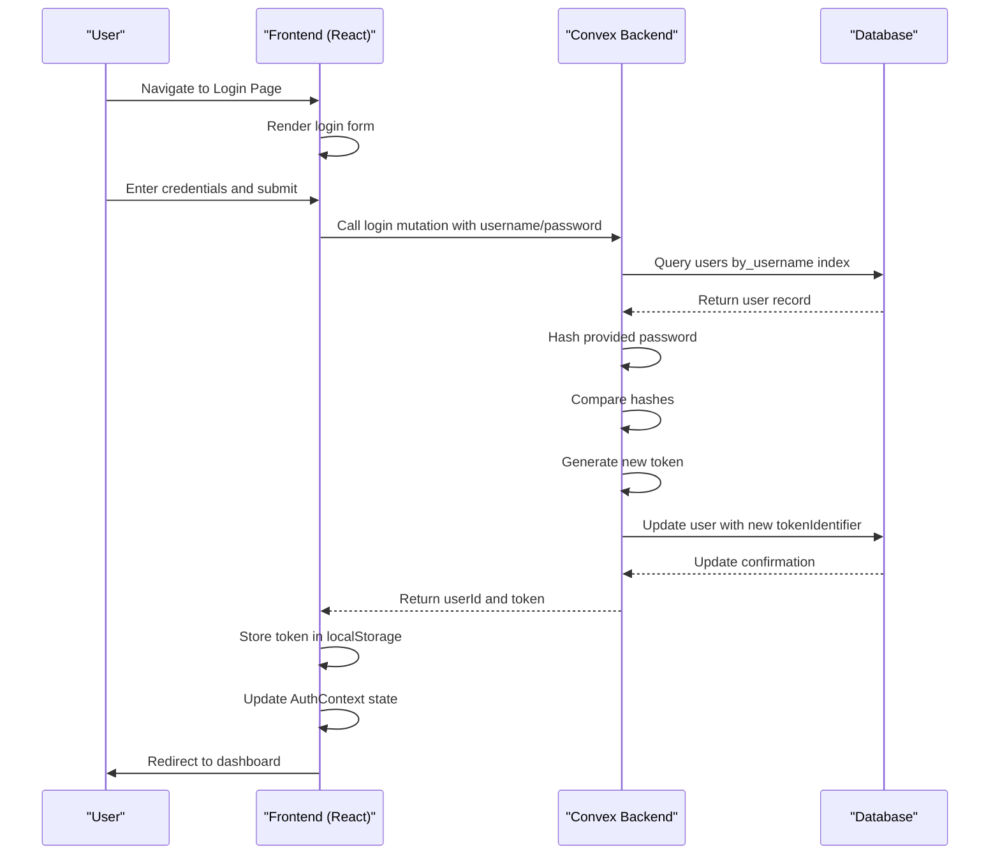
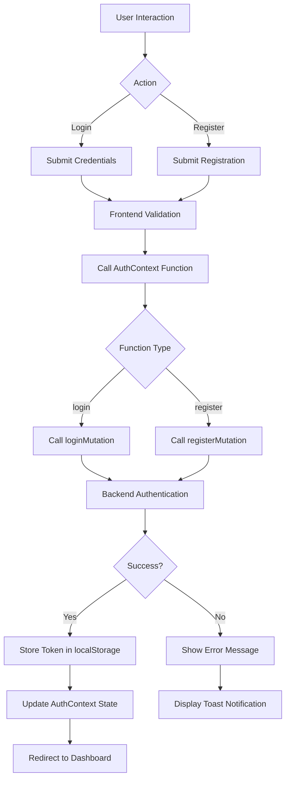
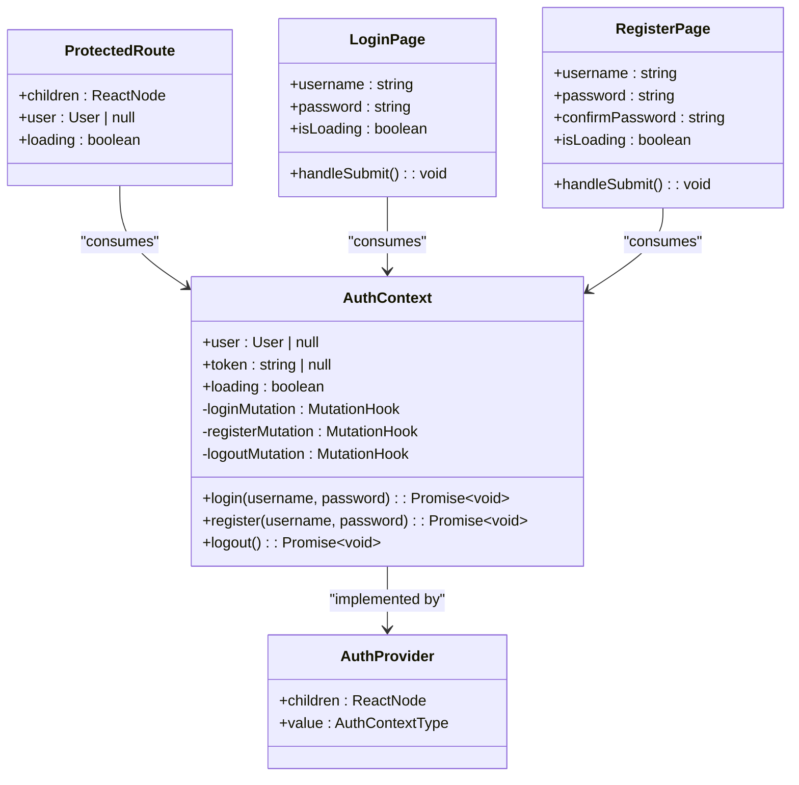

# Authentication System

<cite>
**Referenced Files in This Document**   
- [auth.ts](file://convex/auth.ts)
- [AuthContext.tsx](file://src/contexts/AuthContext.tsx)
- [login/page.tsx](file://src/app/login/page.tsx)
- [register/page.tsx](file://src/app/register/page.tsx)
- [ProtectedRoute.tsx](file://src/components/ProtectedRoute.tsx)
- [dashboard/layout.tsx](file://src/app/dashboard/layout.tsx)
- [schema.ts](file://convex/schema.ts)
</cite>

## Table of Contents
1. [Authentication System Overview](#authentication-system-overview)
2. [Backend Authentication Implementation](#backend-authentication-implementation)
3. [Frontend Authentication Flow](#frontend-authentication-flow)
4. [Session Management and State Persistence](#session-management-and-state-persistence)
5. [Security Considerations](#security-considerations)
6. [Error Handling and User Feedback](#error-handling-and-user-feedback)
7. [Route Protection and Access Control](#route-protection-and-access-control)
8. [Integration Diagrams](#integration-diagrams)

## Authentication System Overview

The authentication system in the Expense Tracker application is built using Convex's serverless backend and implements a token-based session management approach. It provides core functionality for user registration, login, session validation, and logout. The system follows a client-server architecture where authentication logic is split between backend Convex functions and frontend React components.

Key components of the authentication system include:
- **Backend**: Implemented in `auth.ts` with Convex mutations and queries for register, login, getCurrentUser, and logout
- **Frontend**: Managed through `AuthContext.tsx` providing a React context for global authentication state
- **Security**: Password hashing with salt and random token generation for session identification
- **Persistence**: Token stored in localStorage for session continuity across page reloads
- **Protection**: Route guarding via `ProtectedRoute.tsx` component to restrict access to authenticated users

The system uses a simple but effective token-based authentication flow where successful login generates a random token stored both in the database (as `tokenIdentifier`) and in the client's localStorage.

**Section sources**
- [auth.ts](file://convex/auth.ts#L1-L131)
- [AuthContext.tsx](file://src/contexts/AuthContext.tsx#L1-L96)

## Backend Authentication Implementation

The backend authentication logic is implemented in `convex/auth.ts` using Convex's mutation and query primitives. The implementation includes four main functions: register, login, getCurrentUser, and logout.

### Registration Process
The `register` mutation handles new user creation:
- Validates that the username doesn't already exist using the `by_username` index
- Hashes the password with a salt using a simple hashing algorithm (intended for demo purposes)
- Generates a unique token identifier for session management
- Stores the user record in the database with hashed password and token

```typescript
export const register = mutation({
  args: {
    username: v.string(),
    password: v.string(),
  },
  handler: async (ctx, args) => {
    // Check if user already exists
    const existingUser = await ctx.db
      .query("users")
      .withIndex("by_username", (q) => q.eq("username", args.username))
      .first();

    if (existingUser) {
      throw new ConvexError("Username already exists");
    }

    // Create new user
    const hashedPassword = hashPassword(args.password);
    const tokenIdentifier = generateToken();

    const userId = await ctx.db.insert("users", {
      username: args.username,
      hashedPassword,
      tokenIdentifier,
    });

    return { userId, token: tokenIdentifier };
  },
});
```

### Login Process
The `login` mutation authenticates existing users:
- Finds the user by username using the `by_username` index
- Hashes the provided password and compares it with the stored hash
- Generates a new token identifier to prevent token reuse
- Updates the user record with the new token
- Returns the user ID and new token to the client

```typescript
export const login = mutation({
  args: {
    username: v.string(),
    password: v.string(),
  },
  handler: async (ctx, args) => {
    const user = await ctx.db
      .query("users")
      .withIndex("by_username", (q) => q.eq("username", args.username))
      .first();

    if (!user) {
      throw new ConvexError("Invalid username or password");
    }

    const hashedPassword = hashPassword(args.password);
    if (user.hashedPassword !== hashedPassword) {
      throw new ConvexError("Invalid username or password");
    }

    // Generate new token
    const tokenIdentifier = generateToken();
    await ctx.db.patch(user._id, { tokenIdentifier });

    return { userId: user._id, token: tokenIdentifier };
  },
});
```

### Current User Retrieval
The `getCurrentUser` query validates the session token:
- Takes a token as input and finds the corresponding user via the `by_token` index
- Returns basic user information (ID and username) if the token is valid
- Returns null if no user is found, indicating an invalid or expired session

```typescript
export const getCurrentUser = query({
  args: {
    token: v.string(),
  },
  handler: async (ctx, args) => {
    const user = await ctx.db
      .query("users")
      .withIndex("by_token", (q) => q.eq("tokenIdentifier", args.token))
      .first();

    if (!user) {
      return null;
    }

    return {
      _id: user._id,
      username: user.username,
    };
  },
});
```

### Logout Process
The `logout` mutation invalidates the current session:
- Finds the user associated with the provided token
- Generates a new token identifier, effectively invalidating the current session
- Updates the user record to prevent token reuse

```typescript
export const logout = mutation({
  args: {
    token: v.string(),
  },
  handler: async (ctx, args) => {
    const user = await ctx.db
      .query("users")
      .withIndex("by_token", (q) => q.eq("tokenIdentifier", args.token))
      .first();

    if (user) {
      // Invalidate token
      await ctx.db.patch(user._id, { tokenIdentifier: generateToken() });
    }

    return { success: true };
  },
});
```

The user data model is defined in `schema.ts` with the following structure:
```typescript
users: defineTable({
  username: v.string(),
  hashedPassword: v.string(),
  tokenIdentifier: v.string(),
  hasSeenOnboarding: v.optional(v.boolean()),
}).index("by_username", ["username"]).index("by_token", ["tokenIdentifier"]),
```

This schema includes two critical indexes for efficient authentication operations:
- `by_username`: Enables fast lookup during login and registration
- `by_token`: Enables fast session validation in getCurrentUser

**Section sources**
- [auth.ts](file://convex/auth.ts#L46-L131)
- [schema.ts](file://convex/schema.ts#L3-L10)

## Frontend Authentication Flow

The frontend authentication flow is orchestrated through the `AuthContext.tsx` component, which provides a React context for managing authentication state across the application.

### AuthContext Implementation
The `AuthContext` manages the following state:
- `user`: Current user object (or null if not authenticated)
- `token`: Session token stored in memory
- `loading`: Boolean indicating initialization state
- `login`, `register`, `logout`: Functions to interact with authentication endpoints

```typescript
const AuthContext = createContext<AuthContextType | undefined>(undefined);

export function AuthProvider({ children }: { children: ReactNode }) {
  const [token, setToken] = useState<string | null>(null);
  const [loading, setLoading] = useState(true);

  const loginMutation = useMutation(api.auth.login);
  const registerMutation = useMutation(api.auth.register);
  const logoutMutation = useMutation(api.auth.logout);

  const user = useQuery(api.auth.getCurrentUser, token ? { token } : "skip");
```

The context initializes by checking localStorage for a saved token:
```typescript
useEffect(() => {
  // Load token from localStorage on mount
  const savedToken = localStorage.getItem("auth-token");
  if (savedToken) {
    setToken(savedToken);
  }
  setLoading(false);
}, []);
```

### Login Page Implementation
The login page (`src/app/login/page.tsx`) provides a form for user authentication:
- Validates input fields before submission
- Uses the `useAuth` hook to access the login function
- Handles success and error responses with user feedback
- Redirects to the expenses page upon successful login

Key features of the login implementation:
- Input validation for empty fields
- Loading state during authentication requests
- Error handling with user-friendly toast notifications
- Automatic redirection for already authenticated users

```typescript
const handleSubmit = async (e: React.FormEvent) => {
  e.preventDefault();
  
  if (!username.trim() || !password.trim()) {
    toast.error("Please fill in all fields");
    return;
  }

  setIsLoading(true);
  try {
    await login(username.trim(), password);
    toast.success("Welcome back!");
    router.push("/expenses");
  } catch (error: unknown) {
    const message = error instanceof Error ? error.message : "Failed to login";
    toast.error(message);
  } finally {
    setIsLoading(false);
  }
};
```

### Registration Page Implementation
The registration page (`src/app/register/page.tsx`) handles new user creation:
- Validates form inputs including password confirmation
- Enforces password strength requirements (minimum 6 characters)
- Uses the `useAuth` hook to access the register function
- Provides immediate feedback for validation errors

Key validation rules implemented:
- All fields must be filled
- Passwords must match
- Password must be at least 6 characters long

```typescript
if (password !== confirmPassword) {
  toast.error("Passwords do not match");
  return;
}

if (password.length < 6) {
  toast.error("Password must be at least 6 characters");
  return;
}
```

**Section sources**
- [AuthContext.tsx](file://src/contexts/AuthContext.tsx#L1-L96)
- [login/page.tsx](file://src/app/login/page.tsx#L1-L120)
- [register/page.tsx](file://src/app/register/page.tsx#L1-L147)

## Session Management and State Persistence

The authentication system implements a comprehensive session management strategy that maintains user state across page reloads and application sessions.

### Token-Based Session Management
The system uses a token-based approach where:
- Upon successful authentication, a random token is generated and stored in both the database and localStorage
- The token serves as the session identifier for subsequent requests
- Each login generates a new token, invalidating previous sessions
- Tokens are validated on each page load through the getCurrentUser query

### State Persistence Mechanism
Session persistence is achieved through localStorage:
```typescript
// Save token to localStorage on login/register
localStorage.setItem("auth-token", result.token);

// Load token from localStorage on app initialization
const savedToken = localStorage.getItem("auth-token");
if (savedToken) {
  setToken(savedToken);
}
```

This approach ensures that users remain authenticated across browser sessions while maintaining security by storing only the token (not sensitive credentials) in persistent storage.

### Context-Based State Management
The `AuthContext` provides a centralized state management solution:
- Single source of truth for authentication state
- Automatic synchronization between localStorage and in-memory state
- Real-time updates to all components consuming the context
- Loading state management during initialization

The context handles the following state transitions:
- **Initialization**: Check localStorage and set initial state
- **Authentication**: Update state and localStorage on successful login/register
- **Logout**: Clear state and localStorage
- **Session Validation**: Automatically validate token on mount

**Section sources**
- [AuthContext.tsx](file://src/contexts/AuthContext.tsx#L1-L96)

## Security Considerations

The authentication system implements several security measures, with some areas for improvement in production environments.

### Current Security Measures
#### Input Validation
- Server-side validation of username and password parameters
- Prevention of duplicate usernames through database queries
- Client-side validation of form inputs

#### Password Security
The system implements password hashing with salt:
```typescript
function hashPassword(password: string): string {
  const saltedPassword = password + "expense-tracker-salt";
  // Simple hashing algorithm
  return hash.toString(36);
}
```
Key security features:
- Passwords are never stored in plain text
- A fixed salt ("expense-tracker-salt") is appended to passwords before hashing
- Hashed passwords are stored in the database

#### Session Security
- Random token generation for session identification
- Token regeneration on each login (preventing token reuse)
- Token invalidation on logout
- Token-based session validation

### Security Limitations and Recommendations
#### Password Hashing
The current implementation uses a simple custom hashing algorithm which is not suitable for production:
- **Issue**: The hashing function is reversible and vulnerable to attacks
- **Recommendation**: Use industry-standard bcrypt or similar library
- **Implementation Example**:
```typescript
// Production recommendation
import bcrypt from 'bcrypt';
const hashedPassword = await bcrypt.hash(password, 10);
```

#### Rate Limiting
- **Current State**: No rate limiting implemented
- **Risk**: Vulnerable to brute force attacks
- **Recommendation**: Implement rate limiting on login attempts
- **Possible Solutions**: Track failed attempts, implement exponential backoff

#### Token Security
- **Current State**: Tokens are random strings with no expiration
- **Risk**: Long-lived tokens increase exposure window
- **Recommendation**: Implement token expiration and refresh mechanism
- **Possible Solutions**: Add token expiration timestamp, implement refresh tokens

#### Additional Security Recommendations
1. **HTTPS**: Ensure all authentication requests are served over HTTPS
2. **CORS**: Configure proper CORS policies to prevent unauthorized access
3. **Input Sanitization**: Add additional sanitization for username inputs
4. **Account Lockout**: Implement temporary lockout after multiple failed attempts
5. **Security Headers**: Add appropriate security headers (Content-Security-Policy, etc.)

**Section sources**
- [auth.ts](file://convex/auth.ts#L20-L44)
- [AuthContext.tsx](file://src/contexts/AuthContext.tsx#L1-L96)

## Error Handling and User Feedback

The authentication system implements comprehensive error handling with user-friendly feedback mechanisms.

### Backend Error Handling
The backend uses `ConvexError` to communicate authentication failures:
- **Registration**: Throws "Username already exists" for duplicate usernames
- **Login**: Throws "Invalid username or password" for authentication failures
- **Standardized**: All errors are caught and propagated to the frontend

```typescript
if (existingUser) {
  throw new ConvexError("Username already exists");
}

if (!user) {
  throw new ConvexError("Invalid username or password");
}
```

### Frontend Error Handling
The frontend implements robust error handling in both the context and UI components:

#### AuthContext Error Handling
```typescript
const login = async (username: string, password: string) => {
  try {
    const result = await loginMutation({ username, password });
    setToken(result.token);
    localStorage.setItem("auth-token", result.token);
  } catch (error) {
    throw error; // Re-throw for component-level handling
  }
};
```

#### Component-Level Error Handling
Both login and registration pages implement detailed error handling:

**Login Page Error Cases:**
- Empty fields: "Please fill in all fields"
- Authentication failure: Displayed error message from backend
- Network errors: Generic "Failed to login" message

**Registration Page Error Cases:**
- Empty fields: "Please fill in all fields"
- Password mismatch: "Passwords do not match"
- Weak password: "Password must be at least 6 characters"
- Username taken: "Username already exists" (from backend)

### User Feedback System
The application uses `sonner` toast notifications for user feedback:
- **Success**: Green toast with success message
- **Error**: Red toast with descriptive error message
- **Loading**: Visual loading state in buttons

```typescript
// Success feedback
toast.success("Welcome back!");

// Error feedback
toast.error("Please fill in all fields");
```

The feedback system provides:
- Immediate visual feedback for user actions
- Clear error messages that guide users to resolve issues
- Loading states that prevent duplicate submissions
- Accessibility considerations through visual and text feedback

**Section sources**
- [auth.ts](file://convex/auth.ts#L58-L60)
- [login/page.tsx](file://src/app/login/page.tsx#L45-L75)
- [register/page.tsx](file://src/app/register/page.tsx#L45-L85)

## Route Protection and Access Control

The application implements route protection to ensure only authenticated users can access certain pages.

### ProtectedRoute Component
The `ProtectedRoute.tsx` component serves as a higher-order component that wraps protected content:

```typescript
export function ProtectedRoute({ children }: ProtectedRouteProps) {
  const { user, loading } = useAuth();
  const router = useRouter();

  useEffect(() => {
    if (!loading && !user) {
      router.replace("/login");
    }
  }, [user, loading, router]);

  if (loading) {
    return (
      <div className="min-h-screen flex items-center justify-center">
        <div className="text-lg">Loading...</div>
      </div>
    );
  }

  if (!user) {
    return null;
  }

  return <>{children}</>;
}
```

Key features:
- Checks authentication state using `useAuth`
- Redirects unauthenticated users to the login page
- Displays loading state during initialization
- Prevents rendering of protected content for unauthenticated users

### Dashboard Layout Protection
The dashboard layout implements route protection:

```typescript
export default function DashboardLayout({ children }: { children: React.ReactNode }) {
  const { user, loading } = useAuth();

  if (loading) {
    return (
      <div className="min-h-screen flex items-center justify-center">
        <div className="text-lg">Loading...</div>
      </div>
    );
  }

  return (
    <ProtectedRoute>
      {children}
    </ProtectedRoute>
  );
}
```

This ensures that:
- The dashboard and its child routes are protected
- Users are redirected to login if not authenticated
- A loading state is shown during authentication checks

### Authentication Flow for Protected Routes
1. User navigates to a protected route (e.g., dashboard)
2. `ProtectedRoute` checks authentication state
3. If loading: Show loading indicator
4. If authenticated: Render the requested content
5. If not authenticated: Redirect to login page
6. After successful login: Redirect back to originally requested route

This implementation prevents unauthorized access while providing a smooth user experience.

**Section sources**
- [ProtectedRoute.tsx](file://src/components/ProtectedRoute.tsx#L1-L34)
- [dashboard/layout.tsx](file://src/app/dashboard/layout.tsx#L1-L22)

## Integration Diagrams



**Diagram sources**
- [auth.ts](file://convex/auth.ts#L75-L102)
- [AuthContext.tsx](file://src/contexts/AuthContext.tsx#L1-L96)
- [login/page.tsx](file://src/app/login/page.tsx#L1-L120)



**Diagram sources**
- [AuthContext.tsx](file://src/contexts/AuthContext.tsx#L1-L96)
- [login/page.tsx](file://src/app/login/page.tsx#L1-L120)
- [register/page.tsx](file://src/app/register/page.tsx#L1-L147)



**Diagram sources**
- [AuthContext.tsx](file://src/contexts/AuthContext.tsx#L1-L96)
- [ProtectedRoute.tsx](file://src/components/ProtectedRoute.tsx#L1-L34)
- [login/page.tsx](file://src/app/login/page.tsx#L1-L120)
- [register/page.tsx](file://src/app/register/page.tsx#L1-L147)

```mermaid
erDiagram
USERS {
string _id PK
string username UK
string hashedPassword
string tokenIdentifier
boolean hasSeenOnboarding
}
USERS ||--o{ SESSIONS : "has current"
note right of USERS
Indexes:
- by_username(username)
- by_token(tokenIdentifier)
end note
```

**Diagram sources**
- [schema.ts](file://convex/schema.ts#L3-L10)
- [auth.ts](file://convex/auth.ts#L1-L131)