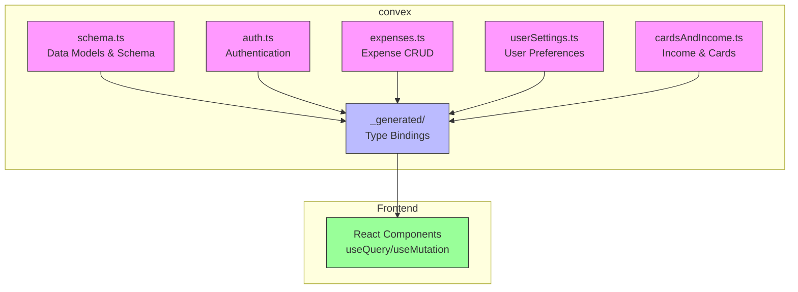
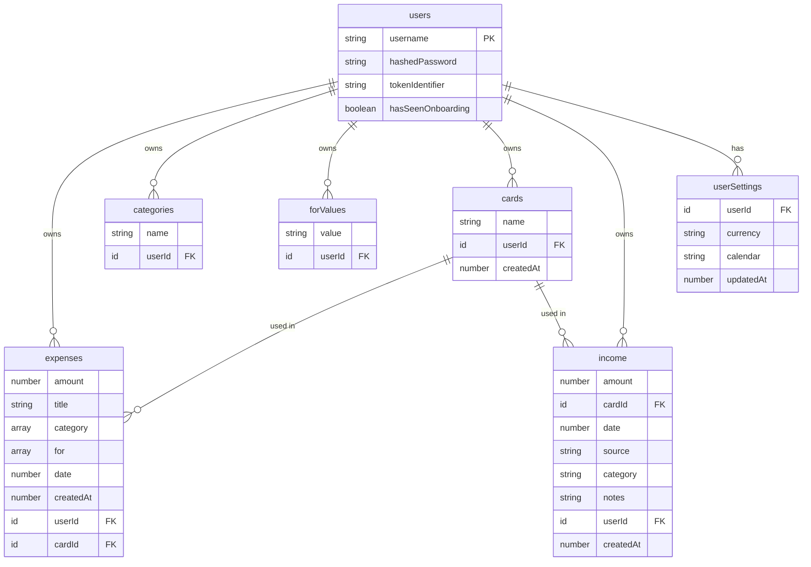
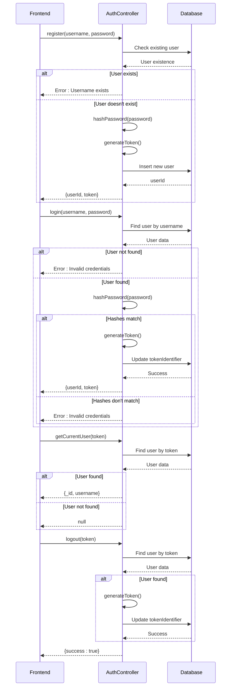
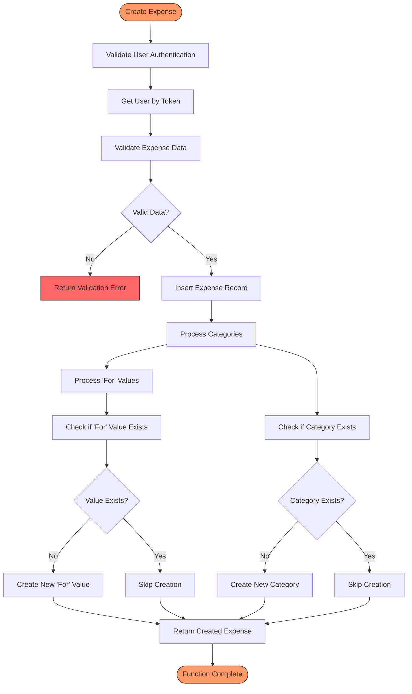
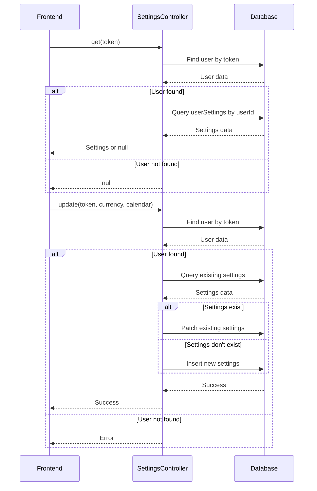
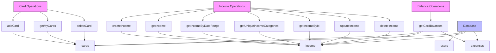
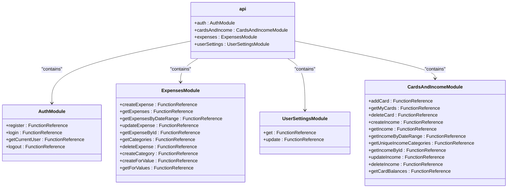
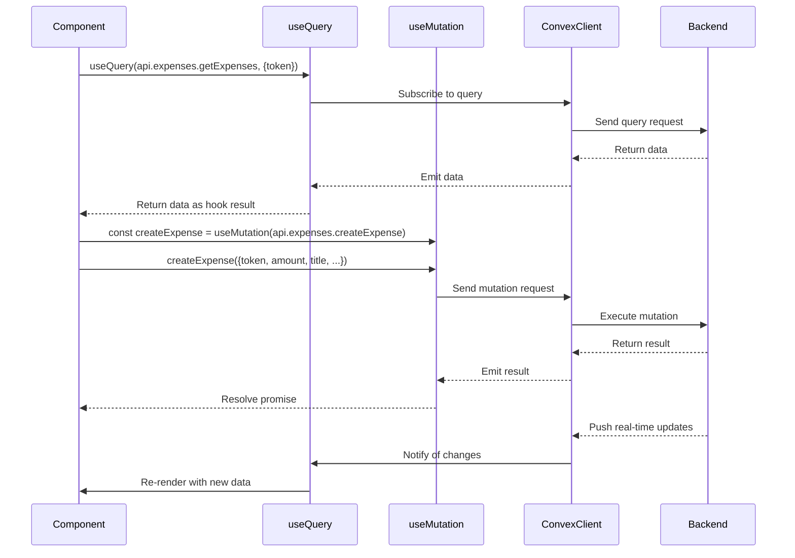

# Convex Backend Directory

<cite>
**Referenced Files in This Document**   
- [schema.ts](file://convex/schema.ts)
- [auth.ts](file://convex/auth.ts)
- [expenses.ts](file://convex/expenses.ts)
- [userSettings.ts](file://convex/userSettings.ts)
- [cardsAndIncome.ts](file://convex/cardsAndIncome.ts)
- [api.d.ts](file://convex/_generated/api.d.ts)
- [expenses/page.tsx](file://src/app/expenses/page.tsx)
- [ConvexProvider.tsx](file://src/providers/ConvexProvider.tsx)
</cite>

## Table of Contents
1. [Introduction](#introduction)
2. [Project Structure](#project-structure)
3. [Core Data Models](#core-data-models)
4. [Authentication System](#authentication-system)
5. [Expense Management](#expense-management)
6. [User Settings Management](#user-settings-management)
7. [Cards and Income Tracking](#cards-and-income-tracking)
8. [Type-Safe API Bindings](#type-safe-api-bindings)
9. [Frontend-Backend Integration](#frontend-backend-integration)
10. [Security and Validation](#security-and-validation)

## Introduction
The `convex/` directory contains the complete backend implementation for the Expense-Tracker---Warp application. This serverless backend leverages Convex, a full-stack server platform that provides real-time data synchronization, type safety, and secure serverless functions. The backend handles all data modeling, authentication, CRUD operations, and business logic for expense tracking, income management, user preferences, and financial cards. This document provides a comprehensive analysis of the backend architecture, explaining how data models are defined, how authentication works, how CRUD operations are implemented with proper access control, and how the frontend interacts with the backend through type-safe APIs.

## Project Structure
The `convex/` directory follows a modular structure with clearly separated concerns. The core components include data schema definition, authentication logic, expense management, user settings, and income/card tracking. The `_generated/` directory contains automatically generated type definitions that enable full-stack type safety. This structure promotes maintainability and scalability by isolating different aspects of the application's backend logic into dedicated modules.



**Diagram sources**
- [schema.ts](file://convex/schema.ts)
- [auth.ts](file://convex/auth.ts)
- [expenses.ts](file://convex/expenses.ts)
- [userSettings.ts](file://convex/userSettings.ts)
- [cardsAndIncome.ts](file://convex/cardsAndIncome.ts)
- [api.d.ts](file://convex/_generated/api.d.ts)

**Section sources**
- [schema.ts](file://convex/schema.ts)
- [auth.ts](file://convex/auth.ts)
- [expenses.ts](file://convex/expenses.ts)
- [userSettings.ts](file://convex/userSettings.ts)
- [cardsAndIncome.ts](file://convex/cardsAndIncome.ts)

## Core Data Models
The data models for the Expense-Tracker---Warp application are defined in `schema.ts` using Convex's schema definition API. These models establish the structure of the database and enforce type safety across the entire stack. The schema defines several interconnected tables that represent the core entities of the application: users, expenses, categories, "for" values, cards, income, and user settings.



**Diagram sources**
- [schema.ts](file://convex/schema.ts#L5-L61)

**Section sources**
- [schema.ts](file://convex/schema.ts#L5-L61)

### User Model
The User model represents application users with essential authentication and session management fields:
- **username**: Unique identifier for the user (indexed for fast lookup)
- **hashedPassword**: Password stored in hashed form for security
- **tokenIdentifier**: Token used for session management and authentication
- **hasSeenOnboarding**: Optional boolean flag to track onboarding completion

The model includes two database indexes: `by_username` for user lookup during login and `by_token` for session validation.

### Expense Model
The Expense model captures financial expenditures with comprehensive details:
- **amount**: Numeric value representing the expense amount
- **title**: Descriptive title for the expense
- **category**: Array of strings allowing multiple categories per expense
- **for**: Array of strings indicating what the expense was for
- **date**: Unix timestamp representing when the expense occurred
- **createdAt**: Unix timestamp when the record was created
- **userId**: Reference to the owning user
- **cardId**: Optional reference to the card used for the expense

Indexes are defined on `userId`, `userId+date`, and `cardId` to optimize common query patterns.

### Category and ForValue Models
These models store user-specific categorization data:
- **categories**: Stores expense categories with name and userId
- **forValues**: Stores "for" values (e.g., "groceries", "entertainment") with value and userId

Both models are user-specific and include indexes for efficient retrieval by user and by user+name/value.

### Card and Income Models
These models handle financial instruments and income tracking:
- **cards**: Represents payment cards with name, userId, and creation timestamp
- **income**: Captures income records with amount, card reference, date, source, category, notes, userId, and creation timestamp

The income model allows tracking income by card, enabling balance calculations across financial instruments.

### User Settings Model
The UserSettings model stores user preferences:
- **userId**: Reference to the owning user
- **currency**: Union type restricting values to "USD", "EUR", "GBP", or "IRR"
- **calendar**: Union type restricting values to "gregorian" or "jalali"
- **updatedAt**: Timestamp for tracking when settings were last modified

This model enables application personalization while maintaining type safety through union literals.

## Authentication System
The authentication system is implemented in `auth.ts` and provides comprehensive user management functionality including registration, login, session management, and logout. The system uses token-based authentication with server-side session management to ensure security.



**Diagram sources**
- [auth.ts](file://convex/auth.ts#L25-L131)

**Section sources**
- [auth.ts](file://convex/auth.ts#L25-L131)

### Registration Process
The registration process follows these steps:
1. Validate that the username is not already taken by querying the database
2. Hash the provided password using a simple hashing algorithm (note: in production, bcrypt or similar should be used)
3. Generate a unique token identifier for session management
4. Insert the new user record into the database
5. Return the userId and token to the frontend for session establishment

The system prevents username duplication through a database query with the `by_username` index.

### Login Process
The login process involves:
1. Finding the user by username using the `by_username` index
2. Hashing the provided password and comparing it with the stored hash
3. Generating a new token identifier to prevent session fixation attacks
4. Updating the user's tokenIdentifier in the database
5. Returning the userId and new token to establish the session

This approach ensures that each successful login generates a new session token, enhancing security.

### Session Management
The authentication system implements token-based session management:
- **getCurrentUser**: Validates a token and returns basic user information if valid
- **logout**: Invalidates the current session by generating a new token for the user, effectively logging them out from all devices using the old token

The `getUserByToken` helper function is used across multiple authentication functions to verify tokens and retrieve user data, promoting code reuse and consistency.

## Expense Management
The expense management system in `expenses.ts` provides comprehensive CRUD operations for financial expenses with proper access control, data validation, and automatic categorization management. This module serves as the core functionality of the expense tracking application.



**Diagram sources**
- [expenses.ts](file://convex/expenses.ts#L25-L324)

**Section sources**
- [expenses.ts](file://convex/expenses.ts#L25-L324)

### Create Expense
The `createExpense` mutation handles the creation of new expense records:
1. Authenticates the user using the provided token
2. Inserts the expense record into the database with all provided details
3. Automatically creates any new categories that don't already exist for the user
4. Automatically creates any new "for" values that don't already exist for the user
5. Returns the created expense record

This implementation ensures data consistency by automatically managing category and "for" value references, preventing orphaned categorization data.

### Retrieve Expenses
The expense retrieval system provides multiple query functions:
- **getExpenses**: Retrieves all expenses for a user, optionally filtered by month and year
- **getExpensesByDateRange**: Retrieves expenses within a specific date range
- **getExpenseById**: Retrieves a specific expense by ID with access control

These queries use the `by_user` index to efficiently retrieve user-specific data and include proper authentication and authorization checks.

### Update and Delete Expenses
The update and delete operations include comprehensive access control:
- **updateExpense**: Updates an existing expense after verifying ownership, and automatically manages categories and "for" values
- **deleteExpense**: Deletes an expense only if the authenticated user owns it

Both operations verify that the user attempting the action is the owner of the expense record, preventing unauthorized access to other users' data.

### Category Management
The module includes dedicated functions for category management:
- **createCategory**: Creates a new category with proper formatting and duplicate prevention
- **getCategories**: Retrieves all categories for the authenticated user
- **createForValue**: Creates a new "for" value with proper formatting and duplicate prevention
- **getForValues**: Retrieves all "for" values for the authenticated user

These functions ensure that categorization data is consistently managed and available for use in the frontend interface.

## User Settings Management
The user settings system in `userSettings.ts` manages user preferences for currency and calendar display. This personalization feature enhances the user experience by allowing customization of financial data presentation.



**Diagram sources**
- [userSettings.ts](file://convex/userSettings.ts#L5-L59)

**Section sources**
- [userSettings.ts](file://convex/userSettings.ts#L5-L59)

### Settings Retrieval
The `get` query function:
1. Authenticates the user using the provided token
2. Queries the userSettings table using the `by_user` index
3. Returns the settings if found, or null if no settings exist

This function enables the frontend to retrieve user preferences on application load.

### Settings Update
The `update` mutation function:
1. Authenticates the user using the provided token
2. Checks for existing settings using the `by_user` index
3. If settings exist: updates the specified fields using `patch` and updates the updatedAt timestamp
4. If no settings exist: creates a new settings record with default values for unspecified fields
5. Ensures type safety by using union literals for currency and calendar options

This implementation provides a flexible upsert pattern that works whether the user is setting preferences for the first time or updating existing preferences.

## Cards and Income Tracking
The cards and income tracking system in `cardsAndIncome.ts` manages financial instruments and income sources, enabling comprehensive financial tracking across multiple cards and income streams.



**Diagram sources**
- [cardsAndIncome.ts](file://convex/cardsAndIncome.ts#L25-L285)

**Section sources**
- [cardsAndIncome.ts](file://convex/cardsAndIncome.ts#L25-L285)

### Card Management
The card management functions include:
- **addCard**: Creates a new card record associated with the authenticated user
- **getMyCards**: Retrieves all cards owned by the user
- **deleteCard**: Deletes a card only if it's not referenced by any expenses or income records

The delete operation includes referential integrity checks to prevent deletion of cards that are still in use, maintaining data consistency.

### Income Management
The income management system provides full CRUD operations:
- **createIncome**: Creates a new income record linked to a specific card
- **getIncome**: Retrieves all income records for the user
- **getIncomeByDateRange**: Retrieves income within a specific date range
- **getUniqueIncomeCategories**: Returns distinct income categories for autocomplete suggestions
- **getIncomeById**: Retrieves a specific income record with access control
- **updateIncome**: Updates an existing income record
- **deleteIncome**: Deletes an income record with ownership verification

These functions mirror the expense management system but are tailored for income tracking.

### Balance Calculation
The `getCardBalances` query function provides a comprehensive financial overview by:
1. Retrieving all cards for the user
2. Retrieving all income and expense records for the user
3. Calculating the balance for each card by subtracting total expenses from total income
4. Returning an array of card balance objects with detailed financial information

This function enables the dashboard to display real-time financial summaries across all cards.

## Type-Safe API Bindings
The `_generated/` directory contains automatically generated type definitions that enable full-stack type safety. These bindings are created by Convex during development and provide TypeScript interfaces for all backend functions.



**Diagram sources**
- [api.d.ts](file://convex/_generated/api.d.ts#L1-L42)

**Section sources**
- [api.d.ts](file://convex/_generated/api.d.ts#L1-L42)

### API Structure
The generated `api.d.ts` file exports an `api` constant that provides type-safe references to all public backend functions. The structure mirrors the backend module organization:
- **api.auth**: Contains authentication functions
- **api.expenses**: Contains expense management functions
- **api.userSettings**: Contains user settings functions
- **api.cardsAndIncome**: Contains card and income functions

This organization enables intuitive and discoverable API usage from the frontend.

### Type Safety Benefits
The generated type bindings provide several benefits:
- **Autocompletion**: IDEs can provide autocomplete suggestions for function names and parameters
- **Parameter validation**: TypeScript checks ensure correct parameter types and counts
- **Return type inference**: The return types of queries and mutations are automatically inferred
- **Refactoring safety**: Renaming functions in the backend automatically updates the generated types

This eliminates the need for manual type definitions and reduces the risk of runtime errors due to API mismatches.

## Frontend-Backend Integration
The frontend components integrate with the Convex backend using React hooks and the generated API bindings. This integration pattern enables reactive, real-time data synchronization with minimal boilerplate code.



**Diagram sources**
- [expenses/page.tsx](file://src/app/expenses/page.tsx#L25-L199)
- [ConvexProvider.tsx](file://src/providers/ConvexProvider.tsx#L1-L15)

**Section sources**
- [expenses/page.tsx](file://src/app/expenses/page.tsx#L25-L199)
- [ConvexProvider.tsx](file://src/providers/ConvexProvider.tsx#L1-L15)

### Convex Provider Setup
The `ConvexProvider` component wraps the application and initializes the Convex client:
```tsx
const convex = new ConvexReactClient(process.env.NEXT_PUBLIC_CONVEX_URL!);
export function ConvexProvider({ children }: { children: ReactNode }) {
  return (
    <ConvexReactProvider client={convex}>
      {children}
    </ConvexReactProvider>
  );
}
```
This singleton client manages the connection to the Convex backend and handles real-time data synchronization.

### Hook Usage Pattern
Frontend components use the `useQuery` and `useMutation` hooks to interact with backend functions:
```tsx
const createExpenseMutation = useMutation(api.expenses.createExpense);
const expenses = useQuery(api.expenses.getExpenses, token ? { token } : "skip");
```
The `useQuery` hook establishes a real-time subscription that automatically updates when data changes, while `useMutation` provides a function to execute server-side mutations.

### Real-Time Synchronization
The integration enables real-time data synchronization:
1. Components subscribe to queries using `useQuery`
2. The Convex client maintains a persistent connection to the backend
3. When data changes (via mutations), the backend pushes updates to all subscribed clients
4. The `useQuery` hooks automatically re-render components with the updated data

This eliminates the need for manual data fetching and ensures all clients have consistent, up-to-date information.

## Security and Validation
The backend implementation includes several security and validation measures to protect data integrity and prevent unauthorized access.

### Authentication and Authorization
All backend functions require authentication via token:
- **Token validation**: The `getUserByToken` helper function verifies tokens for every operation
- **Ownership verification**: CRUD operations check that the user owns the data they're accessing
- **Session management**: Login generates new tokens to prevent session fixation

The system follows the principle of least privilege, ensuring users can only access their own data.

### Data Validation
The backend uses Convex's value validation system:
- **Parameter validation**: Function arguments are validated using `v.string()`, `v.number()`, etc.
- **Type enforcement**: The schema enforces data types at the database level
- **Union literals**: Settings use union literals to restrict values to predefined options

This prevents invalid data from being stored in the database.

### Error Handling
The system uses `ConvexError` for consistent error reporting:
- **Descriptive messages**: Errors provide clear information about what went wrong
- **Validation errors**: Input validation failures return appropriate error messages
- **Access control errors**: Unauthorized access attempts are clearly identified

The frontend can handle these errors gracefully to provide a good user experience.

### Security Considerations
While the implementation includes several security measures, there are areas for improvement:
- **Password hashing**: The current implementation uses a simple hash function; bcrypt or similar should be used in production
- **Input sanitization**: Additional input validation could prevent certain edge cases
- **Rate limiting**: The API could benefit from rate limiting to prevent abuse

These considerations should be addressed before deploying to production.