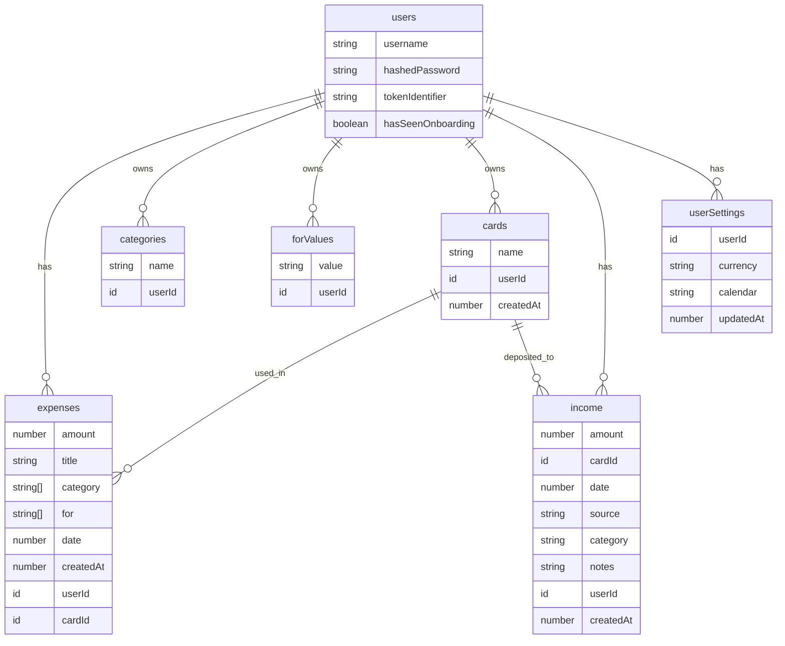

# Data Modeling with schema.ts

<cite>
**Referenced Files in This Document**   
- [schema.ts](file://convex/schema.ts#L1-L61)
- [expenses.ts](file://convex/expenses.ts#L1-L325)
- [userSettings.ts](file://convex/userSettings.ts#L1-L59)
- [cardsAndIncome.ts](file://convex/cardsAndIncome.ts#L1-L285)
- [expense.ts](file://src/features/dashboard/types/expense.ts#L1-L20)
</cite>

## Table of Contents
1. [Introduction](#introduction)
2. [Core Data Collections](#core-data-collections)
3. [Entity Relationships and Foreign Keys](#entity-relationships-and-foreign-keys)
4. [Type Safety and Validation Rules](#type-safety-and-validation-rules)
5. [Indexing Strategy and Query Performance](#indexing-strategy-and-query-performance)
6. [Client-Side Data Model Representation](#client-side-data-model-representation)
7. [Schema Evolution and Best Practices](#schema-evolution-and-best-practices)

## Introduction
The `schema.ts` file in the Expense-Tracker---Warp application defines the core data model using Convex, a full-stack serverless framework that enables type-safe database interactions. This document provides comprehensive documentation of the data schema, detailing each collection's structure, relationships, validation rules, and indexing strategies. The schema enforces data integrity through TypeScript interfaces and Convex's value validation system (`v`), ensuring consistent and reliable data across the application. Each collection is designed to support specific user workflows such as expense tracking, income management, and personalized settings.

**Section sources**
- [schema.ts](file://convex/schema.ts#L1-L61)

## Core Data Collections

### User Collection
The `users` collection stores authentication and session data for application users.

**Field Definitions:**
- `username`: string - Unique identifier for the user (required)
- `hashedPassword`: string - BCrypt-hashed password (required)
- `tokenIdentifier`: string - Session token for authentication (required)
- `hasSeenOnboarding`: boolean - Optional flag indicating onboarding completion status

This collection supports authentication via token-based sessions and ensures username uniqueness through a dedicated index.

### Expense Collection
The `expenses` collection records financial transactions with rich categorization and contextual metadata.

**Field Definitions:**
- `amount`: number - Monetary value of the expense (required)
- `title`: string - Descriptive name of the expense (required)
- `category`: string[] - Array of category names (required)
- `for`: string[] - Array of contextual values (e.g., people, events) (required)
- `date`: number - Unix timestamp of transaction date (required)
- `createdAt`: number - Unix timestamp of record creation (required)
- `userId`: Id<"users"> - Foreign key linking to the user (required)
- `cardId`: Id<"cards"> - Optional foreign key linking to payment card

Expenses are central to the application's functionality, enabling detailed financial tracking and analytics.

### Category Collection
The `categories` collection stores user-specific spending categories.

**Field Definitions:**
- `name`: string - Category name (required)
- `userId`: Id<"users"> - Foreign key linking to the owning user (required)

Categories are automatically created when new category names are used in expenses, ensuring a personalized and dynamic categorization system.

### ForValue Collection
The `forValues` collection stores custom contextual values for expenses (e.g., "Gift for Mom", "Vacation with Friends").

**Field Definitions:**
- `value`: string - Contextual description (required)
- `userId`: Id<"users"> - Foreign key linking to the owning user (required)

Like categories, forValues are automatically populated from expense data, creating a user-specific vocabulary of expense contexts.

### Cards Collection
The `cards` collection manages user payment methods and tracks balances.

**Field Definitions:**
- `name`: string - Card name (required)
- `userId`: Id<"users"> - Foreign key linking to the owning user (required)
- `createdAt`: number - Unix timestamp of card creation (required)

Cards enable users to track financial activity by payment method and calculate card-specific balances.

### Income Collection
The `income` collection records user income transactions.

**Field Definitions:**
- `amount`: number - Income amount (required)
- `cardId`: Id<"cards"> - Foreign key linking to deposit card (required)
- `date`: number - Unix timestamp of income date (required)
- `source`: string - Income source description (required)
- `category`: string - Income category (required)
- `notes`: string - Optional additional notes
- `userId`: Id<"users"> - Foreign key linking to the user (required)
- `createdAt`: number - Unix timestamp of record creation (required)

Income records mirror expense functionality but are optimized for revenue tracking.

### UserSettings Collection
The `userSettings` collection stores user preferences for currency and calendar systems.

**Field Definitions:**
- `userId`: Id<"users"> - Foreign key linking to the user (required)
- `currency`: union("USD", "EUR", "GBP", "IRR") - Selected currency (required)
- `calendar`: union("gregorian", "jalali") - Selected calendar system (required)
- `updatedAt`: number - Unix timestamp of last update (required)

Settings are managed through dedicated mutations that create or update records based on user preferences.

**Section sources**
- [schema.ts](file://convex/schema.ts#L1-L61)

## Entity Relationships and Foreign Keys



**Diagram sources**
- [schema.ts](file://convex/schema.ts#L1-L61)

**Section sources**
- [schema.ts](file://convex/schema.ts#L1-L61)

## Type Safety and Validation Rules

The schema leverages Convex's type system to enforce data integrity at both runtime and compile time. Each field uses specific validation types from `convex/values`:

- **String Validation**: `v.string()` ensures non-null string values
- **Number Validation**: `v.number()` ensures valid numeric values
- **Optional Fields**: `v.optional(type)` allows null/undefined values
- **Union Types**: `v.union()` with `v.literal()` creates enum-like constraints
- **ID References**: `v.id("collection")` enforces foreign key relationships

These validations are automatically reflected in the generated TypeScript types in `_generated/dataModel.d.ts`, providing full-stack type safety. For example, the `currency` field in `userSettings` can only be one of "USD", "EUR", "GBP", or "IRR", preventing invalid values at both database and application levels.

The system also implements business logic validation in server functions. For instance, the `createForValue` mutation formats input by capitalizing each word and prevents empty values, ensuring consistent data quality.

**Section sources**
- [schema.ts](file://convex/schema.ts#L1-L61)
- [userSettings.ts](file://convex/userSettings.ts#L1-L59)
- [expenses.ts](file://convex/expenses.ts#L1-L325)

## Indexing Strategy and Query Performance

The schema implements strategic indexing to optimize query performance for common access patterns:

### Users Collection
- `by_username`: Index on `["username"]` - Enables fast username lookups during login
- `by_token`: Index on `["tokenIdentifier"]` - Supports session authentication

### Expenses Collection
- `by_user`: Index on `["userId"]` - Primary access pattern for user's expenses
- `by_user_date`: Composite index on `["userId", "date"]` - Optimizes date-range queries
- `by_card`: Index on `["cardId"]` - Supports card balance calculations

### Categories and ForValues Collections
- `by_user`: Index on `["userId"]` - Enables retrieval of user-specific values
- `by_user_name` / `by_user_value`: Composite indexes on `["userId", "name"]` - Prevents duplicates and supports autocomplete

### Cards and Income Collections
- `by_user`: Index on `["userId"]` - Standard user-based access
- `by_user_date`: Composite index for date-based filtering
- `by_card`: Index on `["cardId"]` - Supports transaction lookups by payment method

These indexes ensure that all primary query patterns execute efficiently, even as data volume grows. The composite indexes follow the left-prefix principle, allowing them to serve both composite and single-field queries.

**Section sources**
- [schema.ts](file://convex/schema.ts#L1-L61)

## Client-Side Data Model Representation

The frontend application uses TypeScript interfaces that mirror the Convex schema, ensuring type consistency across the stack. The `Expense` interface in `src/features/dashboard/types/expense.ts` demonstrates this alignment:

```typescript
export interface Expense {
  _id: Id<"expenses">;
  _creationTime: number;
  title: string;
  amount: number;
  category: string[];
  date: number;
  for?: string;
}
```

Key observations:
- The `Id<"expenses">` type ensures type-safe references to expense records
- Field names and types match the backend schema exactly
- Optional fields (like `for`) are properly marked with `?`
- The interface extends automatically through Convex's generated types

This approach enables seamless data flow from database to UI components, with full type checking throughout. Components like `ExpenseCard.tsx` and `IncomeCard.tsx` consume these types directly, reducing bugs and improving developer experience.

**Section sources**
- [expense.ts](file://src/features/dashboard/types/expense.ts#L1-L20)
- [schema.ts](file://convex/schema.ts#L1-L61)

## Schema Evolution and Best Practices

### Extending the Schema
To add new fields or collections:
1. Modify `schema.ts` with the new definition
2. The Convex CLI automatically regenerates types in `_generated/`
3. Update server functions to handle new data
4. Update frontend interfaces as needed

Example: Adding a `recurring` boolean field to expenses:
```typescript
expenses: defineTable({
  // existing fields...
  recurring: v.optional(v.boolean()),
}).index("by_user", ["userId"]) // existing indexes
```

### Migration Strategies
For schema changes requiring data migration:
1. Implement backward-compatible changes when possible
2. Use optional fields for new required data
3. Create migration functions that update existing records
4. Test migrations on staging data first

### Best Practices
- **Index Early**: Add indexes for all query patterns during initial development
- **Validate Input**: Use Convex validation types consistently
- **Leverage Generated Types**: Rely on `_generated/api.d.ts` for type safety
- **Maintain Referential Integrity**: Use `v.id("collection")` for foreign keys
- **Optimize for Common Queries**: Design indexes based on actual usage patterns

The current schema demonstrates these principles effectively, with clear relationships, proper indexing, and strong type enforcement throughout the application.

**Section sources**
- [schema.ts](file://convex/schema.ts#L1-L61)
- [expenses.ts](file://convex/expenses.ts#L1-L325)
- [userSettings.ts](file://convex/userSettings.ts#L1-L59)
- [cardsAndIncome.ts](file://convex/cardsAndIncome.ts#L1-L285)