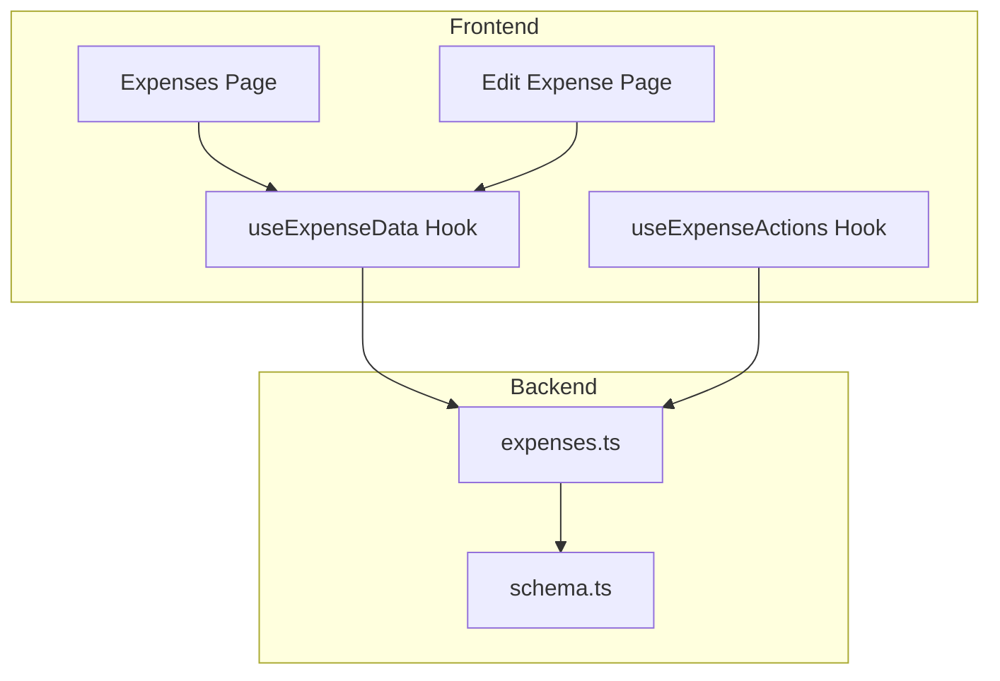
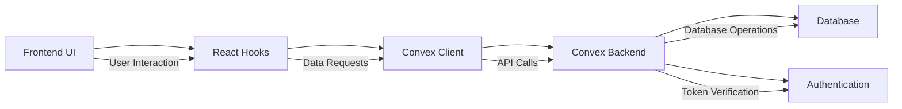
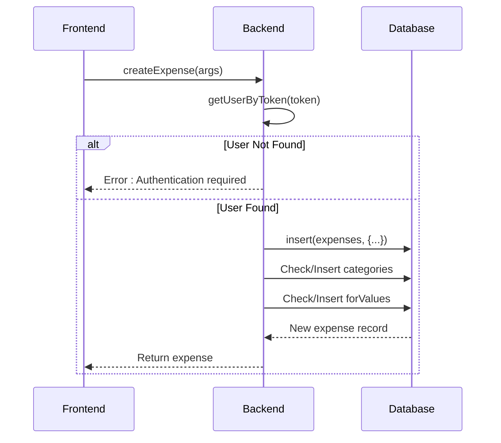
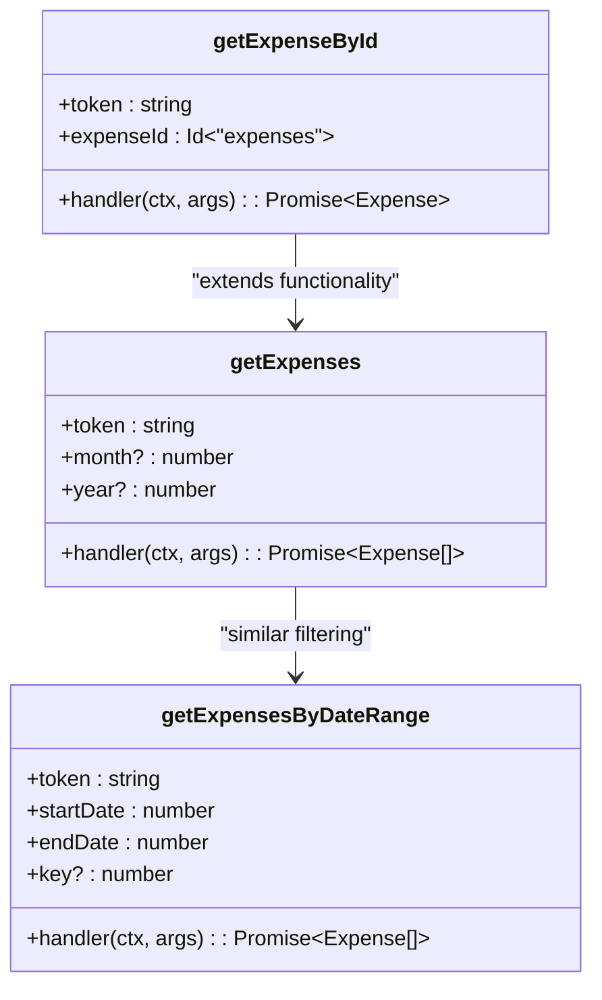
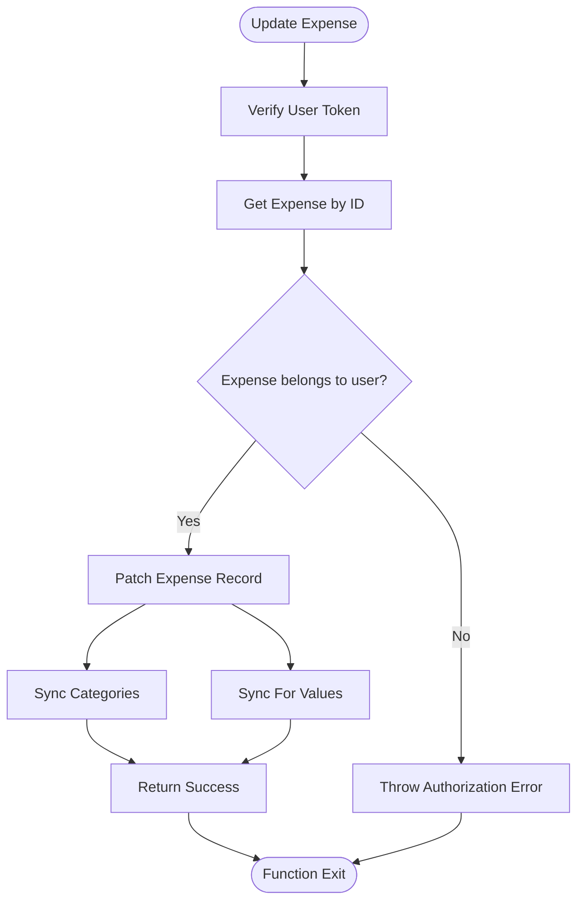
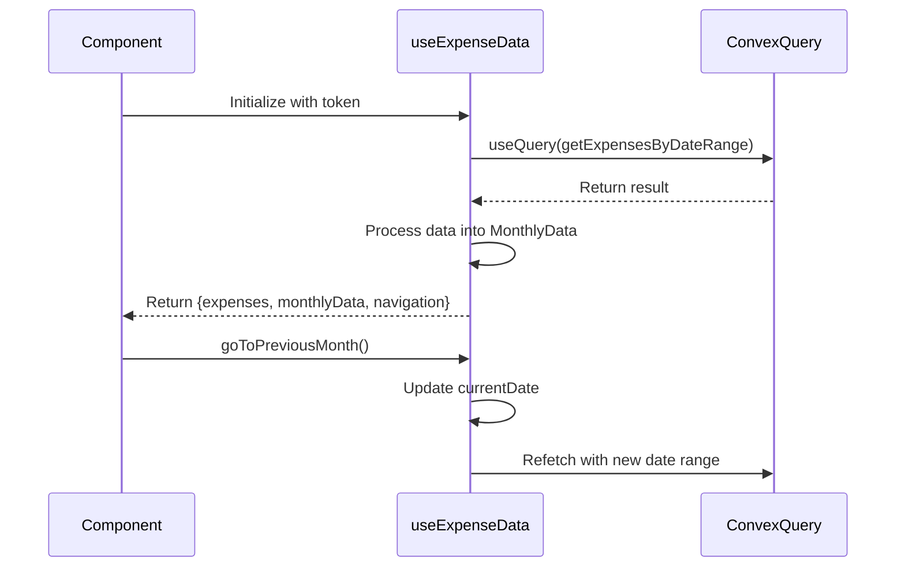
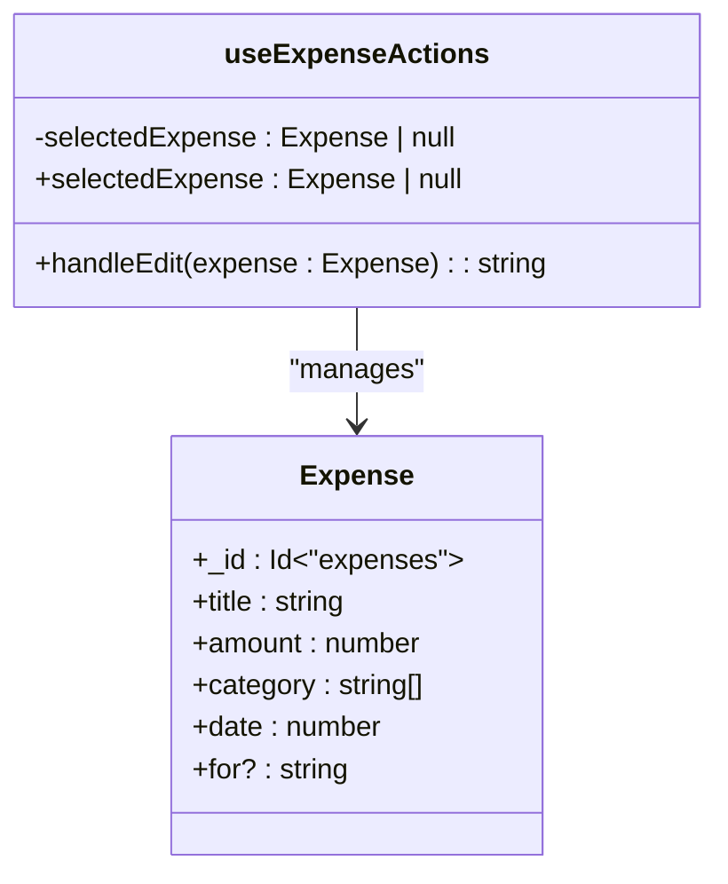

# Expense Management Backend

<cite>
**Referenced Files in This Document**   
- [expenses.ts](file://convex/expenses.ts)
- [useExpenseData.ts](file://src/features/dashboard/hooks/useExpenseData.ts)
- [useExpenseActions.ts](file://src/features/dashboard/hooks/useExpenseActions.ts)
- [expense.ts](file://src/features/dashboard/types/expense.ts)
- [schema.ts](file://convex/schema.ts)
- [page.tsx](file://src/app/expenses/page.tsx)
- [edit/[id]/page.tsx](file://src/app/expenses/edit/[id]/page.tsx)
</cite>

## Table of Contents
1. [Introduction](#introduction)
2. [Project Structure](#project-structure)
3. [Core Components](#core-components)
4. [Architecture Overview](#architecture-overview)
5. [Detailed Component Analysis](#detailed-component-analysis)
6. [Dependency Analysis](#dependency-analysis)
7. [Performance Considerations](#performance-considerations)
8. [Troubleshooting Guide](#troubleshooting-guide)
9. [Conclusion](#conclusion)

## Introduction
This document provides a comprehensive analysis of the expense management system in the Expense Tracker application. The backend module `expenses.ts` implements full CRUD operations for expense records with robust access control, data validation, and transaction safety. The system integrates seamlessly with frontend hooks to enable real-time data synchronization and user interaction. This documentation details the implementation of key functions, their integration with the UI layer, and performance considerations for filtering, pagination, and offline operations.

## Project Structure
The project follows a modular architecture with clear separation between backend logic (Convex functions) and frontend components (React hooks and pages). The expense management functionality is distributed across several key directories:

- `convex/`: Contains backend logic including `expenses.ts` for CRUD operations and `schema.ts` for data modeling
- `src/features/dashboard/hooks/`: Houses frontend hooks like `useExpenseData` and `useExpenseActions` for state management
- `src/app/expenses/`: Contains UI pages for viewing and editing expenses
- `src/features/dashboard/types/`: Defines TypeScript interfaces for data structures



**Diagram sources**
- [expenses.ts](file://convex/expenses.ts)
- [useExpenseData.ts](file://src/features/dashboard/hooks/useExpenseData.ts)
- [useExpenseActions.ts](file://src/features/dashboard/hooks/useExpenseActions.ts)
- [page.tsx](file://src/app/expenses/page.tsx)
- [edit/[id]/page.tsx](file://src/app/expenses/edit/[id]/page.tsx)

**Section sources**
- [expenses.ts](file://convex/expenses.ts)
- [useExpenseData.ts](file://src/features/dashboard/hooks/useExpenseData.ts)
- [useExpenseActions.ts](file://src/features/dashboard/hooks/useExpenseActions.ts)

## Core Components
The expense management system consists of several core components that work together to provide a seamless user experience:

- **Backend CRUD Operations**: Implemented in `expenses.ts` using Convex mutations and queries
- **Data Validation**: Built-in validation using Convex values (`v.string()`, `v.number()`, etc.)
- **Access Control**: User authentication and authorization via token verification
- **Frontend Hooks**: `useExpenseData` for data fetching and `useExpenseActions` for state management
- **Type Definitions**: TypeScript interfaces defining the expense data structure

These components ensure data integrity, security, and a responsive user interface.

**Section sources**
- [expenses.ts](file://convex/expenses.ts#L1-L324)
- [expense.ts](file://src/features/dashboard/types/expense.ts#L1-L20)
- [useExpenseData.ts](file://src/features/dashboard/hooks/useExpenseData.ts#L1-L86)
- [useExpenseActions.ts](file://src/features/dashboard/hooks/useExpenseActions.ts#L1-L16)

## Architecture Overview
The expense management system follows a client-server architecture with React frontend components communicating with Convex backend functions through a well-defined API. The architecture ensures separation of concerns, with business logic residing in the backend and presentation logic in the frontend.



**Diagram sources**
- [expenses.ts](file://convex/expenses.ts)
- [useExpenseData.ts](file://src/features/dashboard/hooks/useExpenseData.ts)
- [useExpenseActions.ts](file://src/features/dashboard/hooks/useExpenseActions.ts)

## Detailed Component Analysis

### Backend CRUD Operations Analysis
The `expenses.ts` module implements comprehensive CRUD operations with proper access control and data validation.

#### Create Expense Function
The `createExpense` mutation handles the creation of new expense records with validation and user association.



**Diagram sources**
- [expenses.ts](file://convex/expenses.ts#L18-L47)

**Section sources**
- [expenses.ts](file://convex/expenses.ts#L18-L47)

#### Read Operations
The system provides multiple query functions for retrieving expense data with different filtering options.



**Diagram sources**
- [expenses.ts](file://convex/expenses.ts#L76-L103)
- [expenses.ts](file://convex/expenses.ts#L105-L125)
- [expenses.ts](file://convex/expenses.ts#L190-L202)

**Section sources**
- [expenses.ts](file://convex/expenses.ts#L76-L202)

#### Update and Delete Operations
The update and delete functions include strict access control to ensure users can only modify their own data.



**Diagram sources**
- [expenses.ts](file://convex/expenses.ts#L126-L189)

**Section sources**
- [expenses.ts](file://convex/expenses.ts#L126-L189)

### Frontend Integration Analysis
The frontend hooks provide a clean interface between the UI components and backend functions.

#### useExpenseData Hook
This hook manages expense data fetching and processing for the dashboard.



**Diagram sources**
- [useExpenseData.ts](file://src/features/dashboard/hooks/useExpenseData.ts#L6-L85)

**Section sources**
- [useExpenseData.ts](file://src/features/dashboard/hooks/useExpenseData.ts#L6-L85)

#### useExpenseActions Hook
This simple hook manages the state for editing expenses.



**Diagram sources**
- [useExpenseActions.ts](file://src/features/dashboard/hooks/useExpenseActions.ts#L3-L15)

**Section sources**
- [useExpenseActions.ts](file://src/features/dashboard/hooks/useExpenseActions.ts#L3-L15)

## Dependency Analysis
The expense management system has well-defined dependencies between components, ensuring loose coupling and high cohesion.

```mermaid
graph TD
A[expenses.ts] --> B[schema.ts]
A --> C[auth.ts]
D[useExpenseData.ts] --> A
E[useExpenseActions.ts] --> A
F[page.tsx] --> D
F --> E
G[edit/[id]/page.tsx] --> D
G --> E
D --> H[Convex React]
A --> I[Convex Server]
style A fill:#f9f,stroke:#333
style D fill:#f9f,stroke:#333
style E fill:#f9f,stroke:#333
```

**Diagram sources**
- [expenses.ts](file://convex/expenses.ts)
- [useExpenseData.ts](file://src/features/dashboard/hooks/useExpenseData.ts)
- [useExpenseActions.ts](file://src/features/dashboard/hooks/useExpenseActions.ts)
- [page.tsx](file://src/app/expenses/page.tsx)
- [edit/[id]/page.tsx](file://src/app/expenses/edit/[id]/page.tsx)

**Section sources**
- [expenses.ts](file://convex/expenses.ts)
- [useExpenseData.ts](file://src/features/dashboard/hooks/useExpenseData.ts)
- [useExpenseActions.ts](file://src/features/dashboard/hooks/useExpenseActions.ts)

## Performance Considerations
The system incorporates several performance optimizations to ensure responsive user experience:

- **Indexing**: Database indexes on `userId` and `date` fields enable efficient querying
- **Caching**: The `key` parameter in `getExpensesByDateRange` allows cache busting when needed
- **Pagination**: While not explicitly implemented, the date-range queries naturally limit result sets
- **Batch Processing**: Frontend processes expense data into summaries to minimize re-renders
- **Debounced Inputs**: Smart select inputs likely use debouncing for suggestion queries

The use of Convex's real-time capabilities ensures that data updates are propagated efficiently to connected clients.

**Section sources**
- [expenses.ts](file://convex/expenses.ts#L105-L125)
- [useExpenseData.ts](file://src/features/dashboard/hooks/useExpenseData.ts#L15-L25)
- [schema.ts](file://convex/schema.ts#L15-L20)

## Troubleshooting Guide
Common issues and their solutions in the expense management system:

- **Authentication Errors**: Ensure valid token is passed to all functions
- **Permission Denied**: Verify that users can only access their own expense records
- **Data Validation Failures**: Check that all required fields are provided and properly formatted
- **Category/For Value Duplication**: The system automatically prevents duplicates through existence checks
- **Offline Sync Issues**: The system should handle offline operations through Convex's built-in offline support
- **Concurrent Edit Conflicts**: Convex's transactional model helps prevent race conditions

When debugging, check the network requests to verify API calls and examine console logs for error messages.

**Section sources**
- [expenses.ts](file://convex/expenses.ts)
- [useExpenseData.ts](file://src/features/dashboard/hooks/useExpenseData.ts)
- [page.tsx](file://src/app/expenses/page.tsx)

## Conclusion
The expense management backend provides a robust, secure, and efficient system for handling expense records. With comprehensive CRUD operations, proper access control, and seamless frontend integration, the system delivers a reliable user experience. The architecture follows best practices with clear separation of concerns, type safety, and performance optimizations. Future enhancements could include explicit pagination, advanced filtering options, and improved offline conflict resolution.