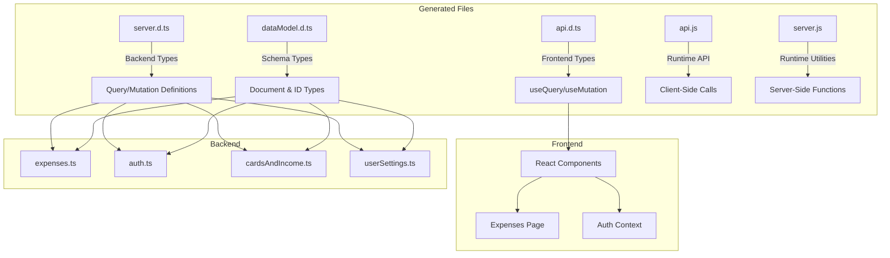
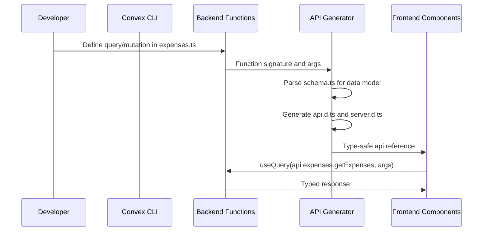
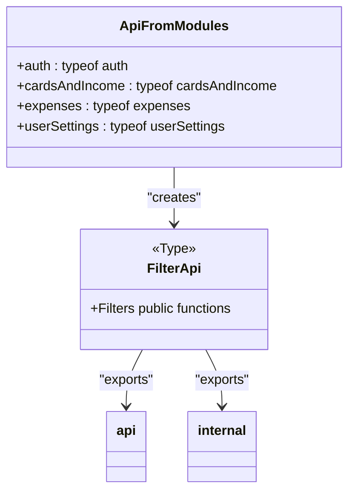
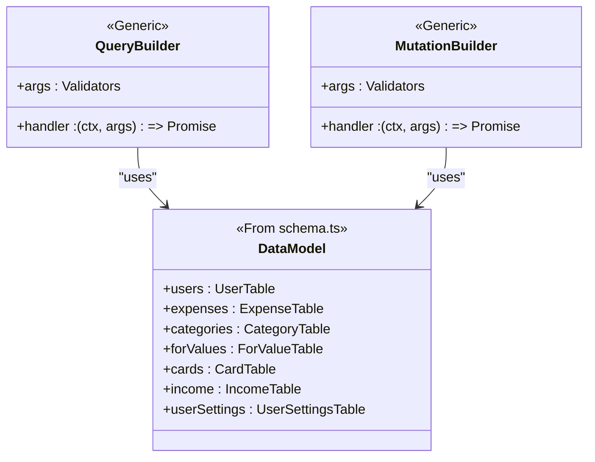
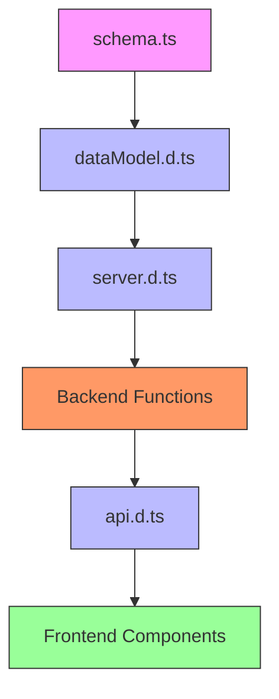

# Generated API Bindings

<cite>
**Referenced Files in This Document**   
- [api.d.ts](file://convex/_generated/api.d.ts)
- [api.js](file://convex/_generated/api.js)
- [server.d.ts](file://convex/_generated/server.d.ts)
- [server.js](file://convex/_generated/server.js)
- [dataModel.d.ts](file://convex/_generated/dataModel.d.ts)
- [schema.ts](file://convex/schema.ts)
- [expenses.ts](file://convex/expenses.ts)
- [auth.ts](file://convex/auth.ts)
- [cardsAndIncome.ts](file://convex/cardsAndIncome.ts)
- [userSettings.ts](file://convex/userSettings.ts)
- [page.tsx](file://src/app/expenses/page.tsx)
- [AuthContext.tsx](file://src/contexts/AuthContext.tsx)
</cite>

## Table of Contents
1. [Introduction](#introduction)
2. [Project Structure](#project-structure)
3. [Core Components](#core-components)
4. [Architecture Overview](#architecture-overview)
5. [Detailed Component Analysis](#detailed-component-analysis)
6. [Dependency Analysis](#dependency-analysis)
7. [Performance Considerations](#performance-considerations)
8. [Troubleshooting Guide](#troubleshooting-guide)
9. [Conclusion](#conclusion)

## Introduction
This document provides comprehensive documentation for the auto-generated API bindings in the `_generated` directory of the Convex backend. These bindings enable type-safe communication between the frontend and backend by automatically generating TypeScript definitions based on the server functions defined in the `convex/` directory. The system ensures compile-time type safety for function calls using hooks like `useQuery` and `useMutation`, preventing runtime errors due to incorrect parameter types or missing arguments. This documentation explains how these generated files work, how they are used across the application, when they are regenerated, and how to troubleshoot common issues.

## Project Structure
The `_generated` directory contains several auto-generated files that facilitate type-safe interactions between the frontend and backend. These files are created and updated automatically by Convex whenever backend functions or the data schema changes.



**Diagram sources**
- [api.d.ts](file://convex/_generated/api.d.ts#L1-L42)
- [server.d.ts](file://convex/_generated/server.d.ts#L1-L142)
- [dataModel.d.ts](file://convex/_generated/dataModel.d.ts#L1-L60)

**Section sources**
- [api.d.ts](file://convex/_generated/api.d.ts#L1-L42)
- [server.d.ts](file://convex/_generated/server.d.ts#L1-L142)

## Core Components
The core components of the generated API bindings include `api.d.ts` for frontend type safety, `server.d.ts` for backend function definitions, and `dataModel.d.ts` for database document types. These files work together to provide end-to-end type safety across the full stack.

**Section sources**
- [api.d.ts](file://convex/_generated/api.d.ts#L1-L42)
- [server.d.ts](file://convex/_generated/server.d.ts#L1-L142)
- [dataModel.d.ts](file://convex/_generated/dataModel.d.ts#L1-L60)

## Architecture Overview
The architecture revolves around Convex's code generation system that creates type-safe bindings from backend function definitions. When developers define query and mutation functions in `.ts` files under `convex/`, Convex analyzes these functions and generates corresponding TypeScript interfaces and runtime utilities.



**Diagram sources**
- [expenses.ts](file://convex/expenses.ts#L1-L325)
- [schema.ts](file://convex/schema.ts#L1-L62)
- [api.d.ts](file://convex/_generated/api.d.ts#L1-L42)

## Detailed Component Analysis

### api.d.ts - Frontend Type Definitions
The `api.d.ts` file provides type-safe references to all Convex functions that can be called from the frontend using `useQuery` and `useMutation` hooks. It exports an `api` object that mirrors the module structure of the backend functions.



**Diagram sources**
- [api.d.ts](file://convex/_generated/api.d.ts#L1-L42)

#### Usage Example in Frontend
The following example shows how `api.d.ts` enables type-safe function calls in React components:

```typescript
import { useQuery, useMutation } from "convex/react";
import { api } from "../../../convex/_generated/api";

// Type-safe query usage
const expenses = useQuery(api.expenses.getExpenses, token ? { token } : "skip");

// Type-safe mutation usage  
const createExpense = useMutation(api.expenses.createExpense);

// This call is type-checked at compile time
await createExpense({
  token: token!,
  amount: 100,
  title: "Groceries",
  category: ["Food"],
  for: ["Personal"],
  date: Date.now(),
  cardId: "card_123"
});
```

**Section sources**
- [api.d.ts](file://convex/_generated/api.d.ts#L1-L42)
- [page.tsx](file://src/app/expenses/page.tsx#L1-L352)

### server.d.ts - Backend Type Definitions
The `server.d.ts` file defines the type-safe utilities used to create query and mutation functions on the server side. It provides strongly-typed builders for defining functions that interact with the database.



**Diagram sources**
- [server.d.ts](file://convex/_generated/server.d.ts#L1-L142)
- [schema.ts](file://convex/schema.ts#L1-L62)

#### Backend Function Definition
Functions defined in backend modules use the builders from `server.d.ts` to ensure type safety:

```typescript
import { query, mutation } from "./_generated/server";
import { v } from "convex/values";

export const getExpenses = query({
  args: {
    token: v.string(),
    month: v.optional(v.number()),
    year: v.optional(v.number())
  },
  handler: async (ctx, args) => {
    // Implementation with type-safe context and arguments
  }
});
```

**Section sources**
- [server.d.ts](file://convex/_generated/server.d.ts#L1-L142)
- [expenses.ts](file://convex/expenses.ts#L1-L325)

### dataModel.d.ts - Data Model Types
The `dataModel.d.ts` file contains type definitions derived from `schema.ts`, providing type-safe access to database documents and IDs. It enables compile-time checking for document structures and relationships.

```mermaid
classDiagram
class Doc {
<<Generic>>
+_id : Id<TableName>
+[properties] : any
}
class Id {
<<Generic>>
+string value
}
class DataModel {
<<Generated from schema.ts>>
+users : { username : string, hashedPassword : string, tokenIdentifier : string }
+expenses : { amount : number, title : string, category : string[], for : string[], date : number, userId : Id<"users"> }
+categories : { name : string, userId : Id<"users"> }
+forValues : { value : string, userId : Id<"users"> }
+cards : { name : string, userId : Id<"users"> }
+income : { amount : number, cardId : Id<"cards">, userId : Id<"users"> }
+userSettings : { userId : Id<"users">, currency : string, calendar : string }
}
Doc --> DataModel : "references"
Id --> DataModel : "references"
```

**Diagram sources**
- [dataModel.d.ts](file://convex/_generated/dataModel.d.ts#L1-L60)
- [schema.ts](file://convex/schema.ts#L1-L62)

## Dependency Analysis
The generated API bindings create a dependency chain from the data schema through backend functions to frontend components. Changes in one layer automatically propagate type updates to dependent layers.



**Diagram sources**
- [schema.ts](file://convex/schema.ts#L1-L62)
- [dataModel.d.ts](file://convex/_generated/dataModel.d.ts#L1-L60)
- [server.d.ts](file://convex/_generated/server.d.ts#L1-L142)
- [api.d.ts](file://convex/_generated/api.d.ts#L1-L42)

## Performance Considerations
The generated API bindings have minimal runtime overhead as they primarily provide compile-time type checking. The actual function calls are optimized by Convex's runtime, which handles database access patterns and caching automatically. Type checking occurs during development and build time, not at runtime, ensuring no performance impact on the deployed application.

## Troubleshooting Guide
Common issues with generated API bindings typically relate to regeneration problems or type mismatches between frontend and backend.

### Regeneration Issues
If the generated files are not updating after changes to backend functions:
- Run `npx convex dev` manually to force regeneration
- Check for syntax errors in `.ts` files that might prevent parsing
- Verify that the Convex CLI is properly installed and accessible

### Type Mismatch Errors
When encountering type errors between frontend and backend:
- Ensure all function argument validators in `v.*` match the expected types
- Check that the `schema.ts` file accurately reflects the data model
- Verify that the frontend is using the correct parameter structure

### Example of Common Error
```typescript
// Incorrect - missing required token parameter
const expenses = useQuery(api.expenses.getExpenses); // ❌ Compile error

// Correct - providing required token parameter
const expenses = useQuery(api.expenses.getExpenses, token ? { token } : "skip"); // ✅
```

**Section sources**
- [api.d.ts](file://convex/_generated/api.d.ts#L1-L42)
- [server.d.ts](file://convex/_generated/server.d.ts#L1-L142)
- [expenses.ts](file://convex/expenses.ts#L1-L325)
- [page.tsx](file://src/app/expenses/page.tsx#L1-L352)

## Conclusion
The generated API bindings in the `_generated` directory provide a robust system for type-safe communication between the frontend and backend. By automatically generating TypeScript definitions from backend function declarations and data schemas, Convex eliminates entire classes of runtime errors while enabling powerful IDE features like autocompletion and inline documentation. The system regenerates these bindings automatically when functions or schemas change, ensuring that type safety is maintained throughout the development lifecycle. Developers can confidently use `useQuery` and `useMutation` hooks knowing that their function calls are validated at compile time, leading to more reliable and maintainable code.