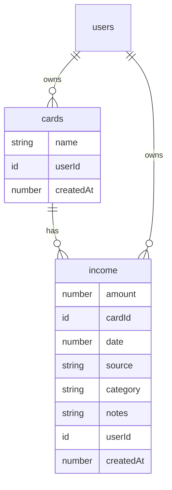
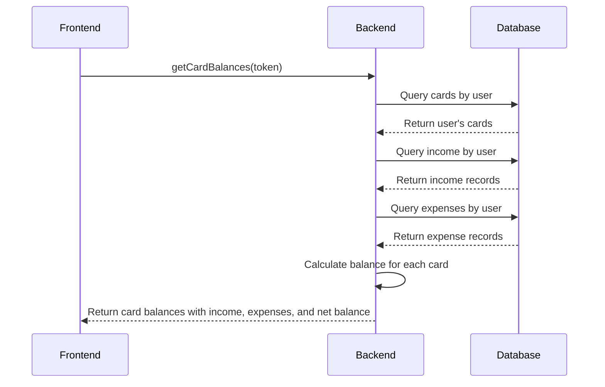
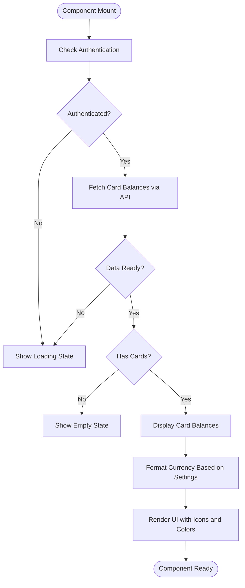
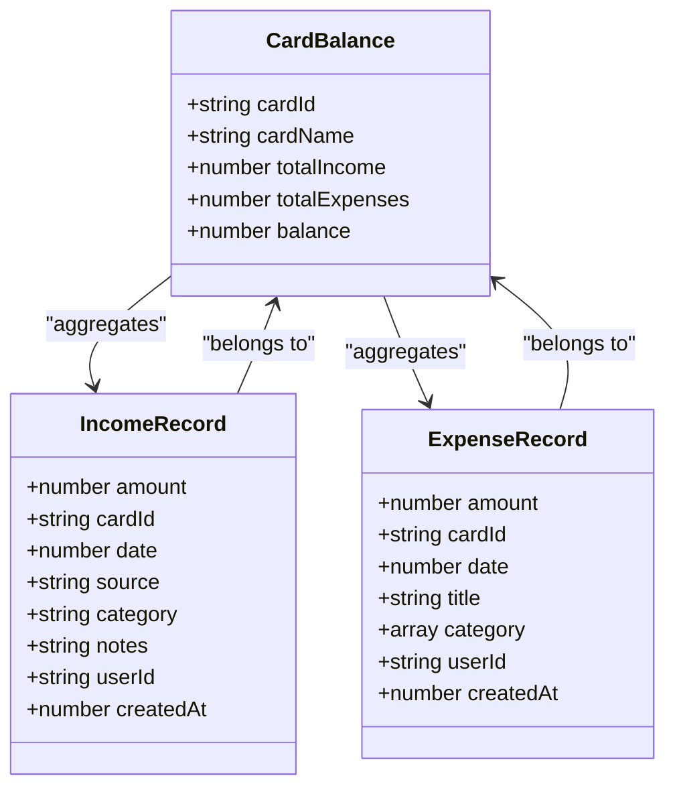
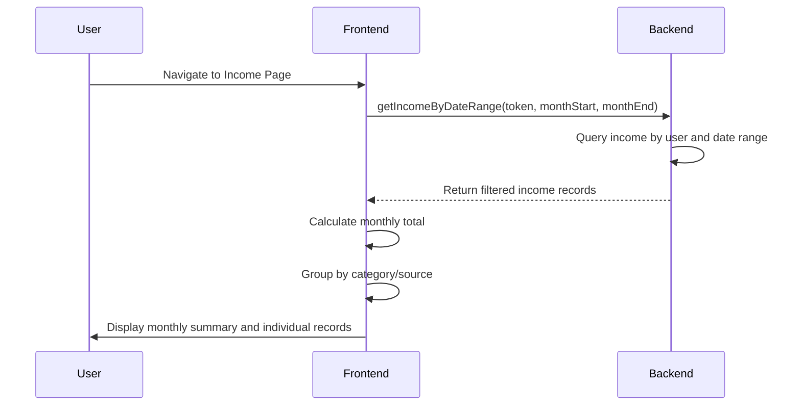

# Income and Card Balances Backend

<cite>
**Referenced Files in This Document**   
- [cardsAndIncome.ts](file://convex/cardsAndIncome.ts)
- [schema.ts](file://convex/schema.ts)
- [CardBalances.tsx](file://src/features/dashboard/components/CardBalances/CardBalances.tsx)
- [IncomeCard.tsx](file://src/components/cards/IncomeCard.tsx)
- [page.tsx](file://src/app/income/page.tsx)
- [SummaryCards.tsx](file://src/features/dashboard/components/SummaryCards/SummaryCards.tsx)
</cite>

## Table of Contents
1. [Introduction](#introduction)
2. [Data Model](#data-model)
3. [Backend Functions](#backend-functions)
4. [Dashboard Integration](#dashboard-integration)
5. [Income and Expense Relationship](#income-and-expense-relationship)
6. [Monthly Summaries and Recurring Patterns](#monthly-summaries-and-recurring-patterns)
7. [Error Handling and Validation](#error-handling-and-validation)

## Introduction
The **Income and Card Balances Backend** module manages financial data related to income sources and card balances within the expense tracking system. This document provides a comprehensive overview of the data model, backend functions, dashboard integration, and the relationship between income and expenses. The system is built using Convex as the backend framework, enabling real-time data synchronization and secure access control.

**Section sources**
- [cardsAndIncome.ts](file://convex/cardsAndIncome.ts#L0-L285)
- [schema.ts](file://convex/schema.ts#L0-L61)

## Data Model
The data model defines two primary entities: **cards** and **income**. Each entity is stored in its respective table with specific fields and indexes for efficient querying.

### Card Data Structure
The **cards** table stores information about user financial cards:
- **name**: string - Name of the card (e.g., "Primary Checking")
- **userId**: reference to users - Owner of the card
- **createdAt**: number - Timestamp of card creation

Indexed by **by_user** for efficient retrieval of all cards belonging to a specific user.

### Income Data Structure
The **income** table stores income records with the following fields:
- **amount**: number - Monetary value of the income
- **cardId**: reference to cards - Associated card for the income
- **date**: number - Timestamp of the income transaction
- **source**: string - Origin of the income (e.g., "Salary", "Freelance")
- **category**: string - Classification of the income
- **notes**: optional string - Additional information about the income
- **userId**: reference to users - Owner of the income record
- **createdAt**: number - Timestamp of record creation

Indexed by **by_user**, **by_user_date**, and **by_card** to support various query patterns including user-specific, date-range, and card-based filtering.

**Diagram sources**
- [schema.ts](file://convex/schema.ts#L38-L60)

**Section sources**
- [schema.ts](file://convex/schema.ts#L38-L60)

## Backend Functions
The backend provides a comprehensive set of functions for managing cards and income records, including creation, retrieval, update, and deletion operations with proper validation and access control.

### Card Management Functions
- **addCard**: Creates a new card for the authenticated user
- **getMyCards**: Retrieves all cards belonging to the user
- **deleteCard**: Removes a card after verifying it's not referenced by any income or expense records

### Income Management Functions
- **createIncome**: Inserts a new income record with validation of required fields
- **getIncome**: Retrieves all income records for the user
- **getIncomeByDateRange**: Filters income records within a specified date range
- **getIncomeById**: Retrieves a specific income record by ID with ownership verification
- **updateIncome**: Modifies an existing income record with proper authorization
- **deleteIncome**: Removes an income record after ownership validation

### Balance Calculation Function
- **getCardBalances**: Calculates the current balance for each card by aggregating associated income and expenses

**Diagram sources**
- [cardsAndIncome.ts](file://convex/cardsAndIncome.ts#L239-L284)

**Section sources**
- [cardsAndIncome.ts](file://convex/cardsAndIncome.ts#L0-L285)

## Dashboard Integration
The income and card balance data is integrated into the dashboard to provide users with real-time financial insights and analytics.

### Card Balances Component
The **CardBalances** component displays the current status of all user cards, showing:
- **Card name**
- **Total income** (in green with upward trend icon)
- **Total expenses** (in red with downward trend icon)
- **Current balance** (color-coded: green for positive, red for negative)

The component uses the **getCardBalances** query to fetch data and displays loading states and empty states appropriately.

**Diagram sources**
- [CardBalances.tsx](file://src/features/dashboard/components/CardBalances/CardBalances.tsx#L0-L102)

**Section sources**
- [CardBalances.tsx](file://src/features/dashboard/components/CardBalances/CardBalances.tsx#L0-L102)
- [cardsAndIncome.ts](file://convex/cardsAndIncome.ts#L239-L284)

## Income and Expense Relationship
The system establishes a clear relationship between income, expenses, and card balances to provide accurate financial tracking.

### Data Flow
When a transaction occurs:
1. **Income records** are linked to a specific card via **cardId**
2. **Expense records** are similarly linked to a card
3. The **getCardBalances** function calculates the net balance by:
   - Summing all income amounts for the card
   - Summing all expense amounts for the card
   - Computing the difference (income - expenses)

### Integrity Constraints
The system enforces data integrity through:
- **Ownership verification**: Users can only access their own records
- **Reference validation**: Cards cannot be deleted if referenced by income or expenses
- **Type validation**: All inputs are validated using Convex's type system

**Diagram sources**
- [cardsAndIncome.ts](file://convex/cardsAndIncome.ts#L239-L284)
- [schema.ts](file://convex/schema.ts#L38-L60)

**Section sources**
- [cardsAndIncome.ts](file://convex/cardsAndIncome.ts#L239-L284)
- [schema.ts](file://convex/schema.ts#L38-L60)

## Monthly Summaries and Recurring Patterns
The system provides functionality to calculate monthly income summaries and handle recurring income patterns.

### Monthly Income Summary
The **getIncomeByDateRange** function enables monthly summaries by:
- Accepting **startDate** and **endDate** parameters
- Filtering income records within the specified range
- Returning all matching records for aggregation

The frontend uses this data to display monthly income history and calculate totals.

### Recurring Income Handling
While the current implementation doesn't have explicit recurring income patterns, the data model supports:
- **Manual entry** of recurring income (e.g., monthly salary)
- **Category-based tracking** to identify recurring sources
- **Date-based filtering** to analyze periodic income patterns

The **IncomeCard** component displays individual income records with source, category, and date information, enabling users to identify recurring patterns visually.

**Diagram sources**
- [cardsAndIncome.ts](file://convex/cardsAndIncome.ts#L126-L145)
- [page.tsx](file://src/app/income/page.tsx#L0-L307)

**Section sources**
- [cardsAndIncome.ts](file://convex/cardsAndIncome.ts#L126-L145)
- [page.tsx](file://src/app/income/page.tsx#L0-L307)

## Error Handling and Validation
The system implements comprehensive error handling and validation to ensure data integrity and provide meaningful feedback to users.

### Authentication and Authorization
- **getUserByToken** helper function validates user authentication
- All operations verify that users can only access their own data
- Unauthorized access attempts throw **ConvexError** with appropriate messages

### Data Validation
- **Input validation** using Convex's type system (v.string(), v.number(), etc.)
- **Business logic validation** in mutation handlers (e.g., preventing deletion of referenced cards)
- **Client-side validation** in the income form (required fields, valid amount)

### Error Responses
Common error scenarios include:
- **Authentication required**: When token is missing or invalid
- **Card not found or not authorized**: When accessing unauthorized card data
- **Cannot delete card used in expenses/income**: When attempting to delete a referenced card
- **Income not found or not authorized**: When accessing unauthorized income records

The frontend components handle these errors gracefully, displaying appropriate messages to users.

**Section sources**
- [cardsAndIncome.ts](file://convex/cardsAndIncome.ts#L0-L285)
- [page.tsx](file://src/app/income/page.tsx#L0-L307)
- [IncomeCard.tsx](file://src/components/cards/IncomeCard.tsx#L0-L105)