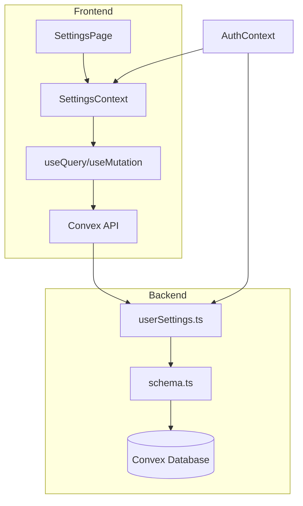
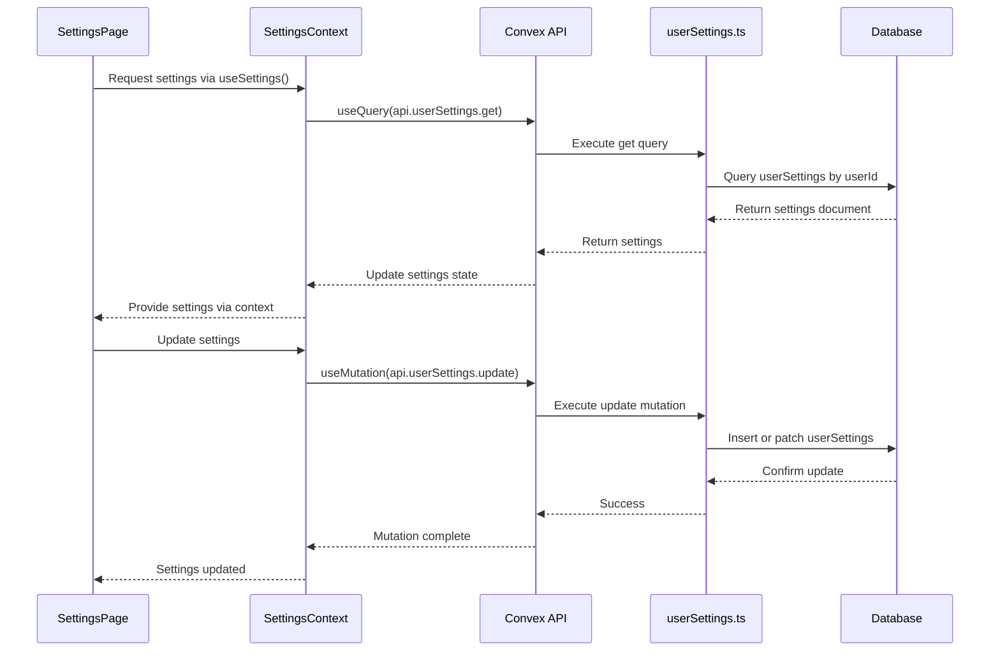
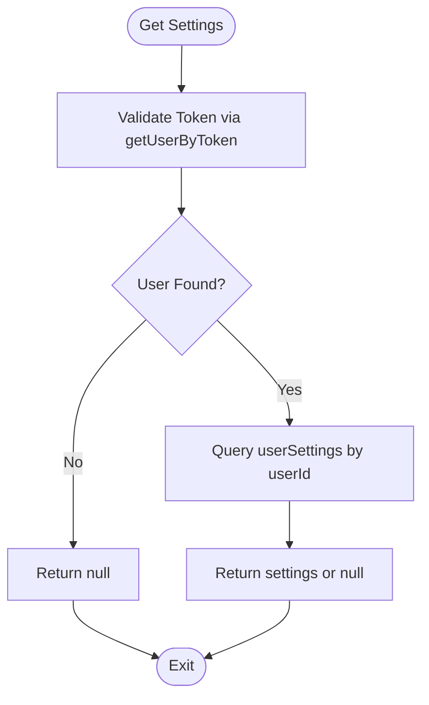
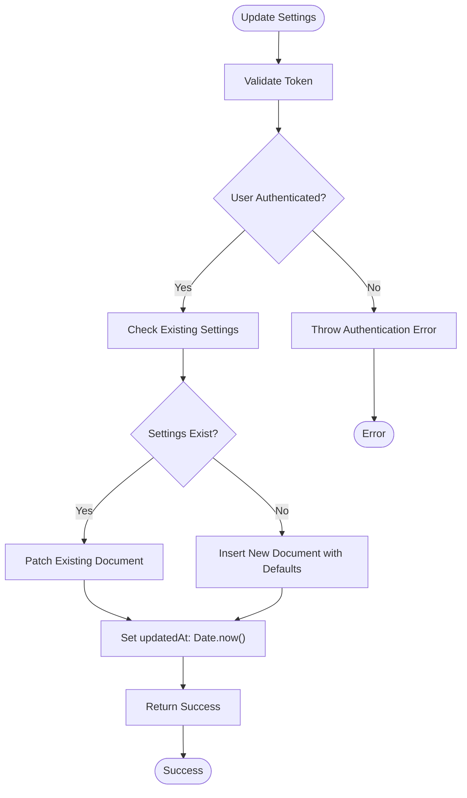
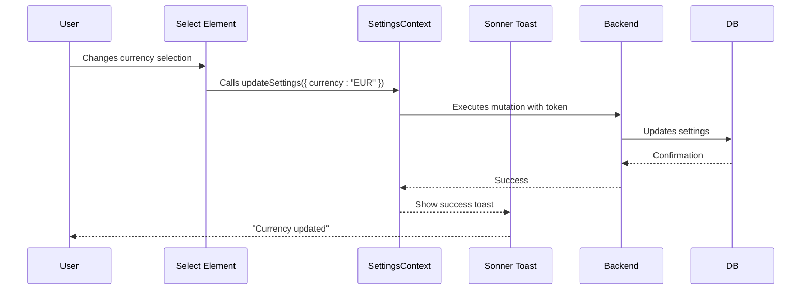
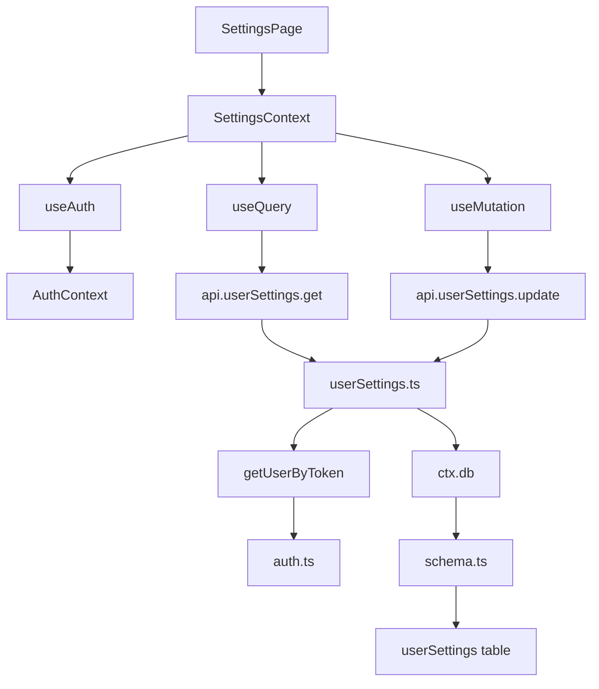

# User Settings Management

<cite>
**Referenced Files in This Document**   
- [userSettings.ts](file://convex/userSettings.ts#L1-L60)
- [SettingsContext.tsx](file://src/contexts/SettingsContext.tsx#L1-L58)
- [page.tsx](file://src/app/settings/page.tsx#L1-L235)
- [schema.ts](file://convex/schema.ts#L1-L62)
- [dataModel.d.ts](file://convex/_generated/dataModel.d.ts#L1-L61)
- [api.d.ts](file://convex/_generated/api.d.ts#L1-L43)
- [layout.tsx](file://src/app/layout.tsx#L1-L59)
</cite>

## Table of Contents
1. [Introduction](#introduction)
2. [Project Structure](#project-structure)
3. [Core Components](#core-components)
4. [Architecture Overview](#architecture-overview)
5. [Detailed Component Analysis](#detailed-component-analysis)
6. [Dependency Analysis](#dependency-analysis)
7. [Performance Considerations](#performance-considerations)
8. [Troubleshooting Guide](#troubleshooting-guide)
9. [Conclusion](#conclusion)

## Introduction
The User Settings Management system in the Expense Tracker application enables users to customize their experience through preferences such as currency selection and calendar system. This document provides a comprehensive analysis of the implementation, covering backend logic, frontend integration, data validation, access control, and real-time synchronization. The system is built on Convex, a full-stack serverless platform, and leverages React Context for state management on the frontend.

## Project Structure
The project follows a modular architecture with clear separation between backend (Convex functions) and frontend (Next.js components). User settings functionality spans multiple directories:
- `convex/`: Contains backend logic including `userSettings.ts` and data schema
- `src/contexts/`: Houses React Context providers like `SettingsContext.tsx`
- `src/app/settings/`: Contains the UI component for managing settings
- `src/app/layout.tsx`: Integrates the SettingsProvider at the root level



**Diagram sources**
- [userSettings.ts](file://convex/userSettings.ts#L1-L60)
- [SettingsContext.tsx](file://src/contexts/SettingsContext.tsx#L1-L58)
- [page.tsx](file://src/app/settings/page.tsx#L1-L235)

**Section sources**
- [userSettings.ts](file://convex/userSettings.ts#L1-L60)
- [SettingsContext.tsx](file://src/contexts/SettingsContext.tsx#L1-L58)

## Core Components
The user settings system consists of three core components:
1. **Backend Functions**: `get` and `update` in `userSettings.ts` handle data retrieval and persistence
2. **Context Layer**: `SettingsContext.tsx` manages state and provides access to settings data
3. **UI Component**: `settings/page.tsx` renders the interface for user interaction

These components work together to provide a seamless experience where changes are immediately reflected in the UI and persisted across devices.

**Section sources**
- [userSettings.ts](file://convex/userSettings.ts#L1-L60)
- [SettingsContext.tsx](file://src/contexts/SettingsContext.tsx#L1-L58)
- [page.tsx](file://src/app/settings/page.tsx#L1-L235)

## Architecture Overview
The architecture follows a clean separation of concerns with data flow from the database to the UI through well-defined interfaces. Authentication is handled via tokens, ensuring that users can only access their own settings. The system uses Convex's real-time capabilities to automatically update the UI when settings change.



**Diagram sources**
- [userSettings.ts](file://convex/userSettings.ts#L1-L60)
- [SettingsContext.tsx](file://src/contexts/SettingsContext.tsx#L1-L58)
- [page.tsx](file://src/app/settings/page.tsx#L1-L235)

## Detailed Component Analysis

### Backend Implementation: userSettings.ts
The `userSettings.ts` file contains two primary functions: `get` and `update`, both secured by token-based authentication.

#### get Function
Retrieves user settings using the authentication token:
- Validates token via `getUserByToken`
- Queries the `userSettings` table using the `by_user` index
- Returns null if no user or settings found



**Diagram sources**
- [userSettings.ts](file://convex/userSettings.ts#L8-L24)

#### update Function
Handles setting updates with data validation and access control:
- Accepts optional currency and calendar parameters
- Uses Convex value validation to restrict input values
- Implements upsert pattern (insert if not exists, patch if exists)
- Sets `updatedAt` timestamp on every update



**Diagram sources**
- [userSettings.ts](file://convex/userSettings.ts#L26-L58)

**Section sources**
- [userSettings.ts](file://convex/userSettings.ts#L1-L60)

### Frontend Integration: SettingsContext.tsx
The `SettingsContext` provides a clean interface for components to access and modify user settings.

#### Context Type Definition
```typescript
interface SettingsContextType {
  settings: Doc<"userSettings"> | null | undefined;
  updateSettings: (args: { currency?: Currency; calendar?: Calendar }) => Promise<void>;
  loading: boolean;
}
```

#### SettingsProvider Implementation
- Uses `useQuery` to automatically fetch settings when token is available
- Wraps `useMutation` in a custom `updateSettings` function that includes error handling
- Provides loading state based on query status

```mermaid
classDiagram
class SettingsContextType {
+settings : Doc<"userSettings"> | null | undefined
+updateSettings : (args : { currency? : Currency; calendar? : Calendar }) => Promise<void>
+loading : boolean
}
class SettingsProvider {
-token : string
-settings : useQuery result
-updateMutation : useMutation
+updateSettings() : Promise<void>
}
SettingsProvider --> SettingsContextType : implements
SettingsProvider --> "useQuery" : consumes
SettingsProvider --> "useMutation" : consumes
```

**Diagram sources**
- [SettingsContext.tsx](file://src/contexts/SettingsContext.tsx#L1-L58)

**Section sources**
- [SettingsContext.tsx](file://src/contexts/SettingsContext.tsx#L1-L58)

### UI Component: settings/page.tsx
The settings page provides a user-friendly interface for modifying preferences.

#### Key Features
- Conditional rendering based on `settingsLoading` state
- Select inputs for currency and calendar system with real-time updates
- Success notifications using `sonner` toast library
- Proper error handling in the `updateSettings` callback

#### Event Flow


**Section sources**
- [page.tsx](file://src/app/settings/page.tsx#L1-L235)

## Dependency Analysis
The user settings system has well-defined dependencies that ensure type safety and maintainability.



**Diagram sources**
- [userSettings.ts](file://convex/userSettings.ts#L1-L60)
- [SettingsContext.tsx](file://src/contexts/SettingsContext.tsx#L1-L58)
- [page.tsx](file://src/app/settings/page.tsx#L1-L235)
- [schema.ts](file://convex/schema.ts#L1-L62)

**Section sources**
- [schema.ts](file://convex/schema.ts#L1-L62)

## Performance Considerations
The user settings system is optimized for performance through several mechanisms:

1. **Indexed Database Queries**: The `by_user` index on `userSettings` ensures O(log n) lookup time
2. **Real-time Updates**: Convex's reactivity automatically updates the UI when data changes
3. **Efficient Data Transfer**: Only necessary fields are transferred between client and server
4. **Caching**: Convex automatically caches query results to minimize database load

The upsert pattern in the update function prevents unnecessary reads by attempting a patch first, falling back to insert only when needed.

## Troubleshooting Guide
Common issues and their solutions:

**Issue**: Settings not loading
- **Cause**: Authentication token missing or invalid
- **Solution**: Ensure user is logged in and token is properly passed to SettingsProvider

**Issue**: Update fails silently
- **Cause**: Missing token in update mutation
- **Solution**: Verify token exists in AuthContext before calling updateSettings

**Issue**: Type errors with currency or calendar values
- **Cause**: Invalid value passed to updateSettings
- **Solution**: Ensure values match the allowed literals: USD/EUR/GBP/IRR for currency, gregorian/jalali for calendar

**Issue**: Settings not persisting across devices
- **Cause**: Database synchronization issue
- **Solution**: Verify Convex sync is working and user ID is consistent across devices

**Section sources**
- [userSettings.ts](file://convex/userSettings.ts#L1-L60)
- [SettingsContext.tsx](file://src/contexts/SettingsContext.tsx#L1-L58)
- [page.tsx](file://src/app/settings/page.tsx#L1-L235)

## Conclusion
The user settings management system in the Expense Tracker application provides a robust, secure, and user-friendly way to customize the application experience. By leveraging Convex's full-stack capabilities and React Context for state management, the system ensures data consistency, real-time updates, and type safety throughout. The architecture follows best practices with proper separation of concerns, comprehensive error handling, and efficient data access patterns. Future enhancements could include additional setting types, user preference synchronization across devices, and improved error recovery mechanisms.