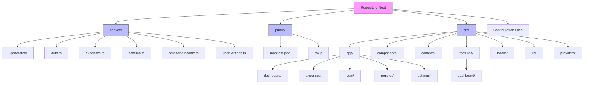
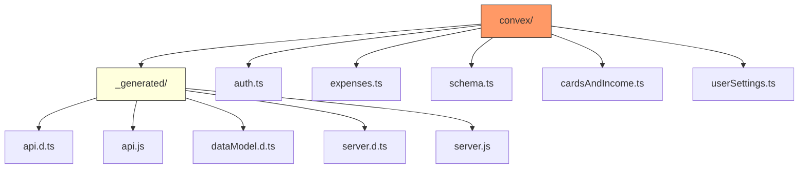
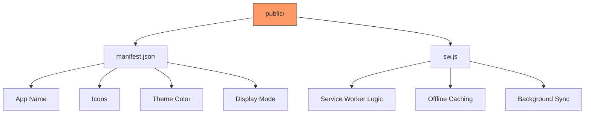
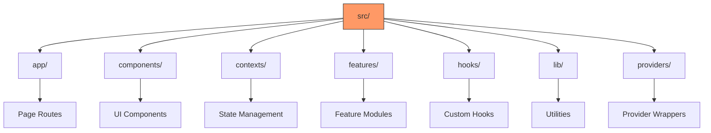
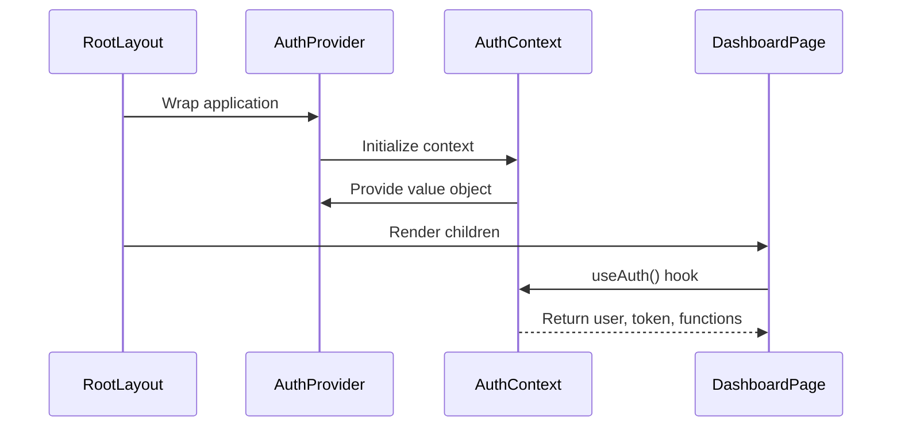
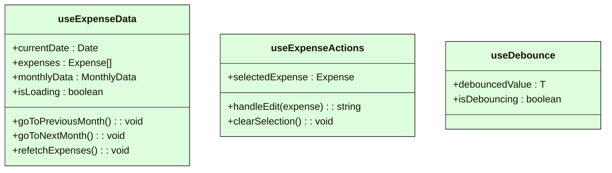
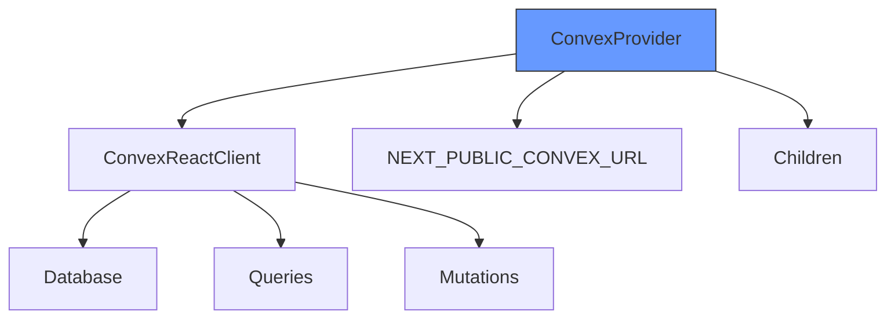
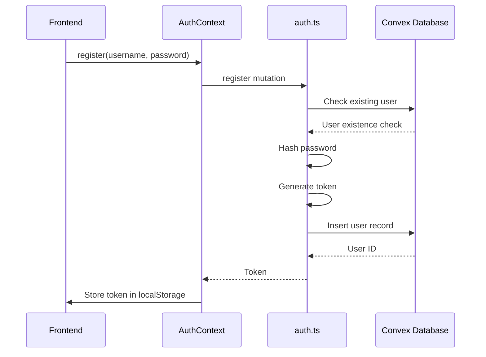
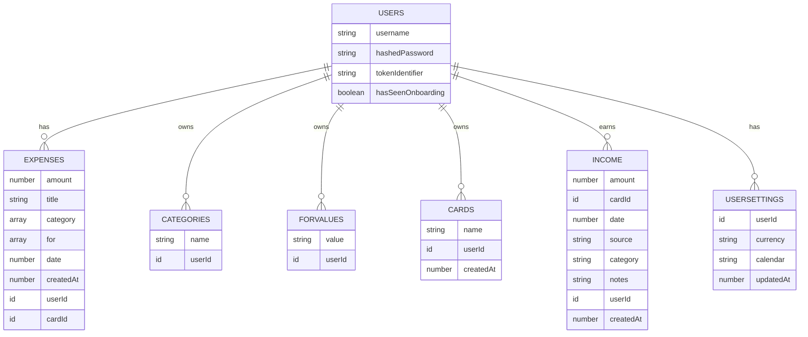

# Directory Structure Breakdown

<cite>
**Referenced Files in This Document**   
- [schema.ts](file://convex/schema.ts)
- [expenses.ts](file://convex/expenses.ts)
- [auth.ts](file://convex/auth.ts)
- [cardsAndIncome.ts](file://convex/cardsAndIncome.ts)
- [userSettings.ts](file://convex/userSettings.ts)
- [page.tsx](file://src/app/page.tsx)
- [layout.tsx](file://src/app/layout.tsx)
- [AuthContext.tsx](file://src/contexts/AuthContext.tsx)
- [ConvexProvider.tsx](file://src/providers/ConvexProvider.tsx)
- [useExpenseData.ts](file://src/features/dashboard/hooks/useExpenseData.ts)
- [expense.ts](file://src/features/dashboard/types/expense.ts)
- [ProtectedRoute.tsx](file://src/components/ProtectedRoute.tsx)
- [dashboard/page.tsx](file://src/app/dashboard/page.tsx)
</cite>

## Table of Contents
1. [Project Structure Overview](#project-structure-overview)
2. [Top-Level Directories](#top-level-directories)
   - [convex/ - Backend Logic and Data Schema](#convex---backend-logic-and-data-schema)
   - [public/ - Static Assets and PWA Configuration](#public---static-assets-and-pwa-configuration)
   - [src/ - Frontend Source Code](#src---frontend-source-code)
   - [Root-Level Configuration Files](#root-level-configuration-files)
3. [Frontend Source Structure](#frontend-source-structure)
   - [app/ - Next.js Pages and Routing](#app---nextjs-pages-and-routing)
   - [components/ - Reusable UI Components](#components---reusable-ui-components)
   - [contexts/ - React Context Providers](#contexts---react-context-providers)
   - [features/dashboard/ - Dashboard-Specific Functionality](#featuresdashboard---dashboard-specific-functionality)
   - [hooks/ - Custom React Hooks](#hooks---custom-react-hooks)
   - [lib/ - Utility Functions](#lib---utility-functions)
   - [providers/ - Application Providers](#providers---application-providers)
4. [Backend Structure](#backend-structure)
   - [_generated/ - Auto-Generated API Types](#generated---auto-generated-api-types)
   - [auth.ts - Authentication Logic](#authts---authentication-logic)
   - [expenses.ts - Expense Management](#expensests---expense-management)
   - [schema.ts - Data Models](#schemats---data-models)
   - [cardsAndIncome.ts - Financial Accounts and Income](#cardsandincomets---financial-accounts-and-income)
   - [userSettings.ts - User Preferences](#usersettingsts---user-preferences)
5. [Architecture and Organization Principles](#architecture-and-organization-principles)

## Project Structure Overview

The Expense-Tracker---Warp repository follows a well-organized, scalable architecture that separates concerns between frontend and backend code. The project uses Next.js 14 with the App Router for the frontend and Convex as the backend-as-a-service platform. This structure promotes maintainability, developer onboarding efficiency, and clear component ownership.



**Diagram sources**
- [schema.ts](file://convex/schema.ts)
- [layout.tsx](file://src/app/layout.tsx)
- [app/page.tsx](file://src/app/page.tsx)

**Section sources**
- [schema.ts](file://convex/schema.ts)
- [layout.tsx](file://src/app/layout.tsx)

## Top-Level Directories

### convex/ - Backend Logic and Data Schema

The `convex/` directory contains all backend logic, data models, and server-side functions. This directory is the heart of the application's data layer, leveraging Convex's serverless functions and real-time database capabilities.



**Diagram sources**
- [schema.ts](file://convex/schema.ts)
- [expenses.ts](file://convex/expenses.ts)
- [auth.ts](file://convex/auth.ts)

**Section sources**
- [schema.ts](file://convex/schema.ts#L1-L61)
- [expenses.ts](file://convex/expenses.ts#L1-L324)
- [auth.ts](file://convex/auth.ts#L1-L131)

### public/ - Static Assets and PWA Configuration

The `public/` directory contains static assets required for the Progressive Web App (PWA) functionality. These files are served directly by the web server and are essential for offline support and app installation capabilities.



**Diagram sources**
- [manifest.json](file://public/manifest.json)
- [sw.js](file://public/sw.js)

**Section sources**
- [manifest.json](file://public/manifest.json)
- [sw.js](file://public/sw.js)

### src/ - Frontend Source Code

The `src/` directory houses all frontend source code, organized into a logical structure that follows React best practices and Next.js conventions. This directory contains components, contexts, hooks, and page routes that make up the user interface.



**Diagram sources**
- [layout.tsx](file://src/app/layout.tsx)
- [AuthContext.tsx](file://src/contexts/AuthContext.tsx)
- [ConvexProvider.tsx](file://src/providers/ConvexProvider.tsx)

**Section sources**
- [layout.tsx](file://src/app/layout.tsx#L1-L58)
- [AuthContext.tsx](file://src/contexts/AuthContext.tsx#L1-L96)
- [ConvexProvider.tsx](file://src/providers/ConvexProvider.tsx#L1-L15)

### Root-Level Configuration Files

Root-level configuration files manage project settings, dependencies, and build configurations. These files are essential for development, testing, and deployment workflows.

**Key Configuration Files:**
- `package.json`: Project metadata and dependencies
- `tsconfig.json`: TypeScript configuration
- `next.config.js`: Next.js framework configuration
- `tailwind.config.ts`: Tailwind CSS styling configuration
- `postcss.config.mjs`: PostCSS processing configuration

**Section sources**
- [package.json](file://package.json)
- [tsconfig.json](file://tsconfig.json)
- [next.config.js](file://next.config.js)
- [tailwind.config.ts](file://tailwind.config.ts)

## Frontend Source Structure

### app/ - Next.js Pages and Routing

The `app/` directory implements the Next.js App Router, defining the application's page structure and routing. Each subdirectory represents a route, with `page.tsx` files serving as the entry points.

**Key Routes:**
- `dashboard/`: Analytics and financial overview
- `expenses/`: Expense management interface
- `income/`: Income tracking functionality
- `cards/`: Financial card/account management
- `login/` and `register/`: Authentication flows
- `settings/`: User preferences and configuration
- `onboarding/`: First-time user experience

```mermaid
flowchart TD
A[App Router] --> B[/]
A --> C[/dashboard]
A --> D[/expenses]
A --> E[/income]
A --> F[/cards]
A --> G[/login]
A --> H[/register]
A --> I[/settings]
A --> J[/onboarding]
B --> K[Home Redirect]
K --> L{Authenticated?}
L --> |Yes| M[/expenses]
L --> |No| N[/login]
style A fill:#69f,stroke:#333
```

**Diagram sources**
- [app/page.tsx](file://src/app/page.tsx#L1-L30)
- [dashboard/page.tsx](file://src/app/dashboard/page.tsx#L1-L126)

**Section sources**
- [app/page.tsx](file://src/app/page.tsx#L1-L30)
- [dashboard/page.tsx](file://src/app/dashboard/page.tsx#L1-L126)

### components/ - Reusable UI Components

The `components/` directory contains reusable UI elements that can be shared across different parts of the application. These components follow the atomic design principle, promoting consistency and maintainability.

**Component Categories:**
- **Navigation**: `BottomNav.tsx`, `HeaderRow.tsx`
- **Forms**: `CustomDatePicker.tsx`, `SmartSelectInput.tsx`
- **Status Indicators**: `NetworkStatusIndicator.tsx`, `OfflineBanner.tsx`
- **Cards**: `ExpenseCard.tsx`, `IncomeCard.tsx`
- **Security**: `ProtectedRoute.tsx`

**Section sources**
- [ProtectedRoute.tsx](file://src/components/ProtectedRoute.tsx#L1-L34)
- [BottomNav.tsx](file://src/components/BottomNav.tsx)
- [NetworkStatusIndicator.tsx](file://src/components/NetworkStatusIndicator.tsx)

### contexts/ - React Context Providers

The `contexts/` directory implements React Context API for global state management. These contexts provide authentication, offline status, and user settings across the application without prop drilling.

**Context Providers:**
- `AuthContext.tsx`: Manages user authentication state and token
- `OfflineContext.tsx`: Tracks network connectivity and sync status
- `SettingsContext.tsx`: Handles user preferences and application settings



**Diagram sources**
- [AuthContext.tsx](file://src/contexts/AuthContext.tsx#L1-L96)
- [layout.tsx](file://src/app/layout.tsx#L1-L58)

**Section sources**
- [AuthContext.tsx](file://src/contexts/AuthContext.tsx#L1-L96)

### features/dashboard/ - Dashboard-Specific Functionality

The `features/dashboard/` directory contains components, hooks, and types specifically designed for the dashboard page. This feature-based organization groups related functionality together, making it easier to maintain and extend.

**Subdirectories:**
- `components/`: Dashboard UI components
- `hooks/`: Custom hooks for dashboard data
- `types/`: Type definitions for dashboard data

**Key Components:**
- `AnalyticsTabs.tsx`: Tabbed interface for different analytics views
- `CardBalances.tsx`: Display financial card balances
- `CategoryList.tsx`: List of expense categories with totals
- `Charts/`: Data visualization components
- `Header/`: Dashboard header with month navigation
- `SummaryCards.tsx`: Key financial metrics display

**Section sources**
- [useExpenseData.ts](file://src/features/dashboard/hooks/useExpenseData.ts#L1-L86)
- [expense.ts](file://src/features/dashboard/types/expense.ts#L1-L20)

### hooks/ - Custom React Hooks

The repository contains two hook directories:
- `hooks/`: General-purpose custom hooks
- `features/dashboard/hooks/`: Dashboard-specific custom hooks

**Available Hooks:**
- `useDebounce.ts`: Debounce function for input handling
- `useTimeFramedData.ts`: Filter data by time periods
- `useExpenseActions.ts`: Manage expense editing state
- `useExpenseData.ts`: Fetch and process expense data



**Diagram sources**
- [useExpenseData.ts](file://src/features/dashboard/hooks/useExpenseData.ts#L1-L86)
- [useDebounce.ts](file://src/hooks/useDebounce.ts)

**Section sources**
- [useExpenseData.ts](file://src/features/dashboard/hooks/useExpenseData.ts#L1-L86)

### lib/ - Utility Functions

The `lib/` directory contains utility functions that provide formatting and transformation capabilities across the application.

**Current Utilities:**
- `formatters.ts`: Functions for formatting currency, dates, and other data types

This directory is designed to grow with additional utility functions as the application expands.

**Section sources**
- [formatters.ts](file://src/lib/formatters.ts)

### providers/ - Application Providers

The `providers/` directory contains wrapper components that provide essential services to the application.

**Key Provider:**
- `ConvexProvider.tsx`: Initializes and provides the Convex client connection

This provider wraps the entire application, enabling all components to access Convex's real-time database and serverless functions.



**Diagram sources**
- [ConvexProvider.tsx](file://src/providers/ConvexProvider.tsx#L1-L15)

**Section sources**
- [ConvexProvider.tsx](file://src/providers/ConvexProvider.tsx#L1-L15)

## Backend Structure

### _generated/ - Auto-Generated API Types

The `_generated/` directory contains TypeScript type definitions and JavaScript modules automatically generated by Convex based on the schema and function definitions. These files enable type-safe communication between frontend and backend.

**Generated Files:**
- `api.d.ts`: Type definitions for Convex functions
- `api.js`: JavaScript API for Convex functions
- `dataModel.d.ts`: Type definitions for database documents
- `server.d.ts`: Server-side type definitions
- `server.js`: Server-side JavaScript API

These files should not be edited manually as they are regenerated during development.

**Section sources**
- [api.d.ts](file://convex/_generated/api.d.ts)
- [dataModel.d.ts](file://convex/_generated/dataModel.d.ts)

### auth.ts - Authentication Logic

The `auth.ts` file contains all authentication-related functions, implementing a custom username/password system with token-based sessions.

**Authentication Functions:**
- `register`: Create new user account
- `login`: Authenticate existing user
- `getCurrentUser`: Retrieve current user information
- `logout`: Invalidate user session

The implementation includes password hashing (with a simple algorithm for demonstration) and token generation for session management.



**Diagram sources**
- [auth.ts](file://convex/auth.ts#L1-L131)
- [AuthContext.tsx](file://src/contexts/AuthContext.tsx#L1-L96)

**Section sources**
- [auth.ts](file://convex/auth.ts#L1-L131)

### expenses.ts - Expense Management

The `expenses.ts` file implements CRUD operations for expense records, serving as the primary interface for expense data management.

**Key Functions:**
- `createExpense`: Add new expense with category normalization
- `getExpenses`: Retrieve user's expenses
- `getExpensesByDateRange`: Filter expenses by date range
- `updateExpense`: Modify existing expense
- `deleteExpense`: Remove expense record
- `getCategories`: Retrieve user's categories
- `createCategory`: Add new category
- `getForValues`: Retrieve "for" field values
- `createForValue`: Add new "for" value

The implementation includes automatic category management, ensuring that new categories are created when expenses are added.

**Section sources**
- [expenses.ts](file://convex/expenses.ts#L1-L324)
- [schema.ts](file://convex/schema.ts#L1-L61)

### schema.ts - Data Models

The `schema.ts` file defines the database schema using Convex's type-safe schema definition API. This file is the single source of truth for data structure.

**Data Models:**
- `users`: User accounts with authentication data
- `expenses`: Expense records with amount, title, categories
- `categories`: User-defined expense categories
- `forValues`: Attribution values for expenses
- `cards`: Financial cards/accounts
- `income`: Income records
- `userSettings`: User preferences

Each table includes appropriate indexes for efficient querying.



**Diagram sources**
- [schema.ts](file://convex/schema.ts#L1-L61)

**Section sources**
- [schema.ts](file://convex/schema.ts#L1-L61)

### cardsAndIncome.ts - Financial Accounts and Income

The `cardsAndIncome.ts` file manages financial cards/accounts and income records, providing a complete financial tracking system.

**Card Functions:**
- `addCard`: Create new financial card
- `getMyCards`: Retrieve user's cards
- `deleteCard`: Remove card (with usage validation)

**Income Functions:**
- `createIncome`: Add income record
- `getIncome`: Retrieve all income
- `getIncomeByDateRange`: Filter income by date
- `updateIncome`: Modify income record
- `deleteIncome`: Remove income record
- `getCardBalances`: Calculate card balances (income - expenses)

The implementation includes referential integrity checks to prevent deletion of cards used in transactions.

**Section sources**
- [cardsAndIncome.ts](file://convex/cardsAndIncome.ts#L1-L285)

### userSettings.ts - User Preferences

The `userSettings.ts` file manages user preferences and application settings.

**Functions:**
- `get`: Retrieve user settings
- `update`: Modify user settings

**Settings Supported:**
- Currency (USD, EUR, GBP, IRR)
- Calendar system (gregorian, jalali)
- Last updated timestamp

The implementation ensures settings are created if they don't exist and updated if they do.

**Section sources**
- [userSettings.ts](file://convex/userSettings.ts#L1-L59)

## Architecture and Organization Principles

The Expense-Tracker---Warp repository follows several key architectural principles that contribute to its maintainability and scalability:

**Separation of Concerns:** The codebase clearly separates frontend and backend logic, with distinct directories for components, contexts, hooks, and server functions.

**Feature-Based Organization:** Related functionality is grouped together, particularly evident in the `features/dashboard/` directory which contains all dashboard-specific components, hooks, and types.

**Type Safety:** The use of TypeScript throughout the codebase, combined with Convex's generated types, ensures type safety from frontend to backend.

**Scalability:** The modular structure allows for easy addition of new features by following existing patterns.

**Developer Onboarding:** Clear directory structure and consistent naming conventions make it easy for new developers to understand the codebase.

**Best Practices:** The implementation follows React best practices with custom hooks, context providers, and component composition.

To add new features, developers should:
1. Create new Convex functions in the `convex/` directory
2. Define any necessary schema changes in `schema.ts`
3. Create frontend components in `src/components/` or feature-specific directories
4. Implement custom hooks in `src/hooks/` or feature-specific hook directories
5. Update context providers if new global state is needed
6. Create new pages in the `src/app/` directory following the App Router conventions

This structure ensures that the application remains organized and maintainable as it grows.