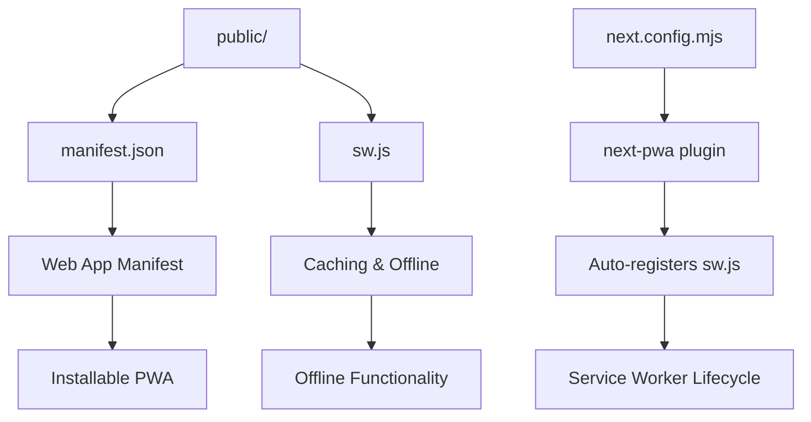
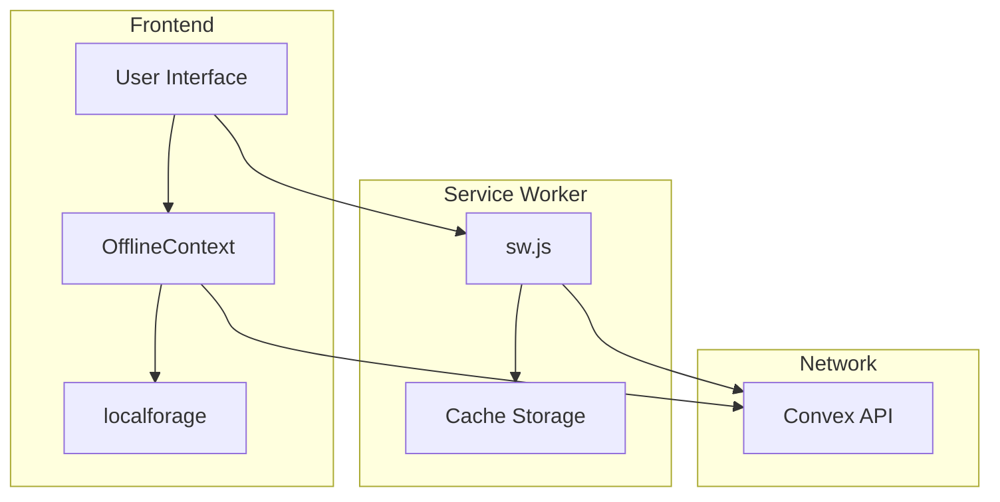
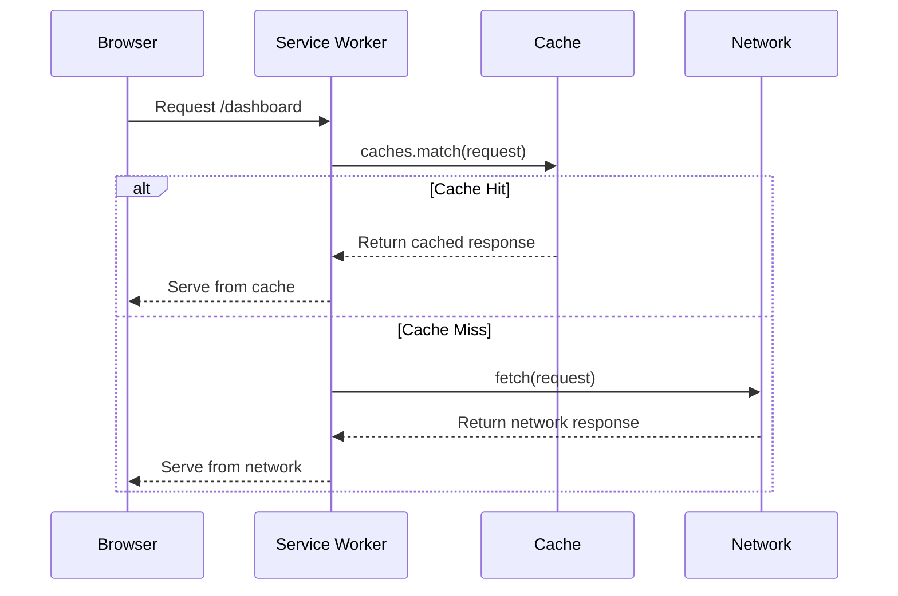
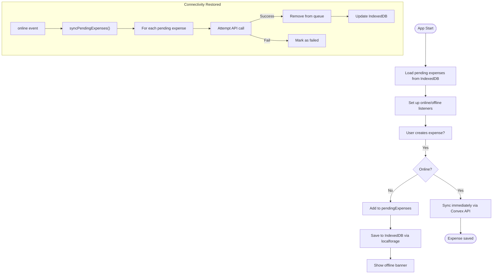
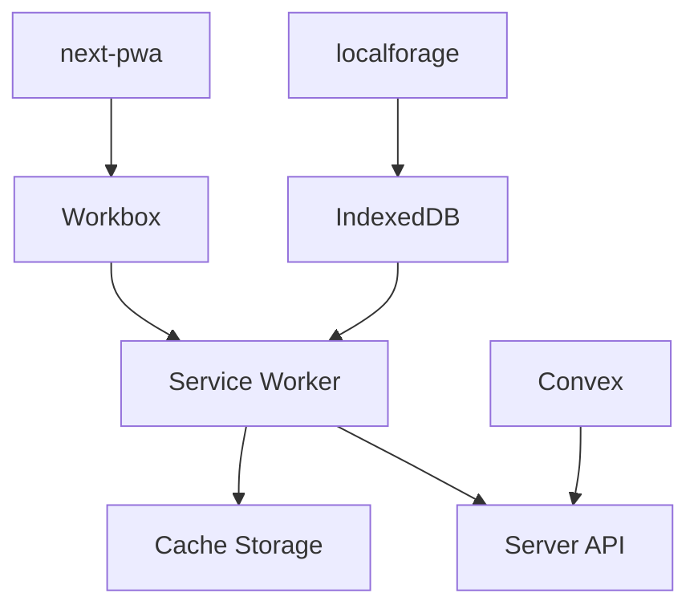

# Public Directory - Static Assets and PWA Configuration

<cite>
**Referenced Files in This Document**   
- [manifest.json](file://public/manifest.json)
- [sw.js](file://public/sw.js)
- [next.config.mjs](file://next.config.mjs)
- [OfflineContext.tsx](file://src/contexts/OfflineContext.tsx)
- [NetworkStatusIndicator.tsx](file://src/components/NetworkStatusIndicator.tsx)
- [OfflineBanner.tsx](file://src/components/OfflineBanner.tsx)
</cite>

## Table of Contents
1. [Introduction](#introduction)
2. [Project Structure](#project-structure)
3. [Core Components](#core-components)
4. [Architecture Overview](#architecture-overview)
5. [Detailed Component Analysis](#detailed-component-analysis)
6. [Dependency Analysis](#dependency-analysis)
7. [Performance Considerations](#performance-considerations)
8. [Troubleshooting Guide](#troubleshooting-guide)
9. [Conclusion](#conclusion)

## Introduction
The `public/` directory in the **Expense-Tracker---Warp** application serves static assets and enables Progressive Web App (PWA) functionality. This document provides a comprehensive analysis of the PWA implementation, focusing on the `manifest.json` file for app metadata, the `sw.js` service worker for offline capabilities, and their integration with React context for offline data synchronization. The goal is to explain how the application achieves installability, offline support, and background sync using modern web standards and Next.js tooling.

## Project Structure
The `public/` directory contains two key files that enable PWA functionality:
- `manifest.json`: Defines metadata for the web app, enabling it to be installed on user devices.
- `sw.js`: Implements a service worker for caching and offline access.

These files are served at the root URL by Next.js (e.g., `/manifest.json`, `/sw.js`) and are automatically registered via the `next-pwa` plugin configured in `next.config.mjs`.



**Diagram sources**
- [manifest.json](file://public/manifest.json)
- [sw.js](file://public/sw.js)
- [next.config.mjs](file://next.config.mjs)

**Section sources**
- [manifest.json](file://public/manifest.json)
- [sw.js](file://public/sw.js)

## Core Components
The PWA functionality is built around three core components:
1. **Web App Manifest** (`manifest.json`) – Defines app identity and appearance.
2. **Service Worker** (`sw.js`) – Handles offline caching and network requests.
3. **Offline Context** (`OfflineContext.tsx`) – Manages offline state and data sync.

These components work together to provide a seamless offline experience, allowing users to continue adding expenses even without connectivity.

**Section sources**
- [manifest.json](file://public/manifest.json)
- [sw.js](file://public/sw.js)
- [OfflineContext.tsx](file://src/contexts/OfflineContext.tsx)

## Architecture Overview
The PWA architecture follows a layered approach:
- **Static Assets Layer**: Serves icons, manifest, and service worker.
- **Caching Layer**: Uses Workbox (via `next-pwa`) for advanced caching strategies.
- **State Management Layer**: Uses React Context to manage offline state.
- **Storage Layer**: Uses `localforage` (IndexedDB wrapper) for persistent offline storage.



**Diagram sources**
- [sw.js](file://public/sw.js)
- [OfflineContext.tsx](file://src/contexts/OfflineContext.tsx)
- [next.config.mjs](file://next.config.mjs)

## Detailed Component Analysis

### Web App Manifest Analysis
The `manifest.json` file defines metadata that enables the app to be installed on user devices. It includes the app name, icons, theme color, and display mode.

```json
{
  "name": "Expense Tracker",
  "short_name": "ExpenseTracker",
  "description": "Track your daily expenses with ease",
  "start_url": "/",
  "display": "standalone",
  "background_color": "#000000",
  "theme_color": "#000000",
  "orientation": "portrait-primary",
  "icons": [
    {
      "src": "/icon-192.png",
      "sizes": "192x192",
      "type": "image/png",
      "purpose": "maskable"
    },
    {
      "src": "/icon-512.png",
      "sizes": "512x512",
      "type": "image/png",
      "purpose": "maskable"
    }
  ]
}
```

Key properties:
- **name**: Full app name displayed to users.
- **short_name**: Shortened name for home screen icons.
- **display**: "standalone" removes browser UI for app-like experience.
- **theme_color**: Controls the browser's address bar color.
- **icons**: Provides multiple icon sizes for different device resolutions.

**Section sources**
- [manifest.json](file://public/manifest.json#L1-L24)

### Service Worker Analysis
The `sw.js` file implements a basic service worker with three lifecycle events: `install`, `fetch`, and `activate`.

```javascript
const CACHE_NAME = 'expense-tracker-v1';
const urlsToCache = [
  '/',
  '/login',
  '/register',
  '/expenses',
  '/dashboard',
  '/settings',
  '/manifest.json',
  '/icon-192.png',
  '/icon-512.png'
];

self.addEventListener('install', (event) => {
  event.waitUntil(
    caches.open(CACHE_NAME)
      .then((cache) => cache.addAll(urlsToCache))
  );
});

self.addEventListener('fetch', (event) => {
  event.respondWith(
    caches.match(event.request)
      .then((response) => response || fetch(event.request))
  );
});

self.addEventListener('activate', (event) => {
  event.waitUntil(
    caches.keys().then((cacheNames) => {
      return Promise.all(
        cacheNames.map((cacheName) => {
          if (cacheName !== CACHE_NAME) {
            return caches.delete(cacheName);
          }
        })
      );
    })
  );
});
```

#### Caching Strategy
- **Cache-first**: Serves cached assets when available; falls back to network.
- **Precaching**: Caches essential pages and assets during installation.
- **Cache cleanup**: Removes outdated caches during activation.

However, the actual caching behavior is enhanced by `next-pwa`, which uses Workbox for more sophisticated strategies like `StaleWhileRevalidate` and `NetworkFirst`.



**Diagram sources**
- [sw.js](file://public/sw.js#L1-L49)

**Section sources**
- [sw.js](file://public/sw.js#L1-L49)

### Offline Context Analysis
The `OfflineContext.tsx` manages offline state and synchronizes data when connectivity is restored.

#### State Management
- **isOnline**: Tracks network connectivity using `navigator.onLine`.
- **pendingExpenses**: Stores expenses created while offline.
- **localforage**: Persists pending expenses in IndexedDB.

#### Data Synchronization
- **addPendingExpense**: Adds a new expense to the local queue.
- **syncPendingExpenses**: Attempts to sync all pending expenses with the server.
- **retryFailedExpense**: Retries individual failed sync operations.



**Diagram sources**
- [OfflineContext.tsx](file://src/contexts/OfflineContext.tsx#L1-L171)

**Section sources**
- [OfflineContext.tsx](file://src/contexts/OfflineContext.tsx#L1-L171)

### UI Components for Offline State
Two components provide visual feedback about connectivity:

#### NetworkStatusIndicator
A small indicator in the top-right corner showing online/offline status with green/red color coding.

```tsx
export function NetworkStatusIndicator() {
  const { isOnline } = useOffline();
  return (
    <motion.div
      style={{ backgroundColor: isOnline ? '#22c55e' : '#ef4444' }}
      title={isOnline ? "Online" : "Offline"}
    />
  );
}
```

#### OfflineBanner
A prominent banner displayed when offline, showing the number of pending expenses.

```tsx
export const OfflineBanner: React.FC = () => {
  const { isOnline, pendingExpenses } = useOffline();
  if (isOnline) return null;
  return (
    <div>
      You are offline. {pendingExpenses.length} pending expense
      {pendingExpenses.length === 1 ? "" : "s"} will sync when you're back online.
    </div>
  );
};
```

**Section sources**
- [NetworkStatusIndicator.tsx](file://src/components/NetworkStatusIndicator.tsx#L1-L22)
- [OfflineBanner.tsx](file://src/components/OfflineBanner.tsx#L1-L26)

## Dependency Analysis
The PWA functionality depends on several key packages:
- **next-pwa**: Integrates service workers with Next.js.
- **workbox**: Provides advanced caching strategies.
- **localforage**: Offers a simple API for IndexedDB storage.
- **convex**: Enables serverless backend with real-time sync.



**Diagram sources**
- [next.config.mjs](file://next.config.mjs)
- [OfflineContext.tsx](file://src/contexts/OfflineContext.tsx)

**Section sources**
- [next.config.mjs](file://next.config.mjs)
- [package.json](file://package.json)

## Performance Considerations
### Caching Strategies
The `next-pwa` configuration in `next.config.mjs` defines optimized caching strategies:
- **StaleWhileRevalidate**: For dashboard (balance freshness vs. speed).
- **NetworkFirst**: For expenses and API calls (ensure latest data).
- **CacheFirst**: For static assets (reduce network requests).

### Cache Versioning
The `CACHE_NAME = 'expense-tracker-v1'` in `sw.js` should be updated when changing cached assets to force cache invalidation.

### Asset Optimization
- Use appropriately sized icons (192px, 512px).
- Compress images (PNG, SVG).
- Leverage browser caching via `maxAgeSeconds` in Workbox.

## Troubleshooting Guide
### Debugging Service Worker
1. Open Chrome DevTools → Application → Service Workers
2. Check registration status and lifecycle events
3. Use "Update on reload" for development
4. Clear storage when testing offline behavior

### Common Issues
- **Service worker not registering**: Ensure `next-pwa` is enabled in production.
- **Cache not updating**: Increment `CACHE_NAME` or use `skipWaiting: true`.
- **Offline sync failing**: Check `localforage` storage limits and network conditions.

**Section sources**
- [sw.js](file://public/sw.js)
- [next.config.mjs](file://next.config.mjs)
- [OfflineContext.tsx](file://src/contexts/OfflineContext.tsx)

## Conclusion
The `public/` directory in the Expense Tracker application enables robust PWA functionality through the `manifest.json` and `sw.js` files. Combined with the `OfflineContext` and `next-pwa`, the app provides a seamless offline experience with automatic data synchronization. Best practices include proper cache versioning, asset optimization, and thorough testing of offline scenarios using browser DevTools.