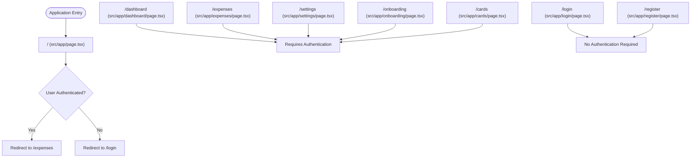
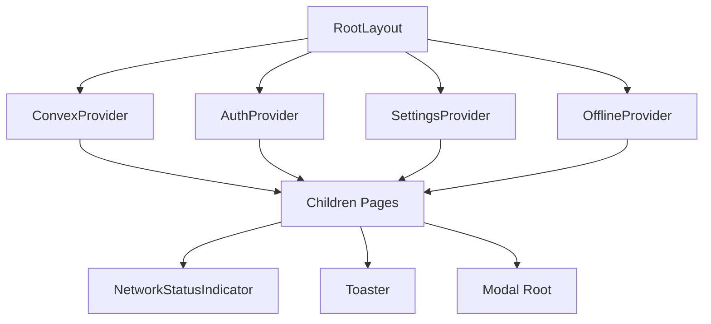
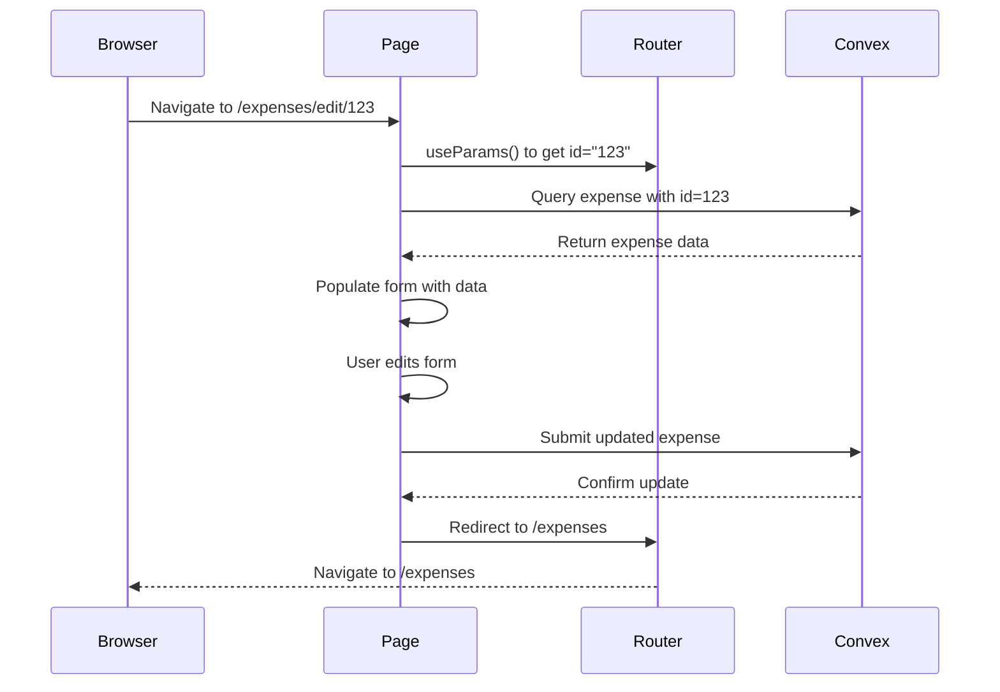
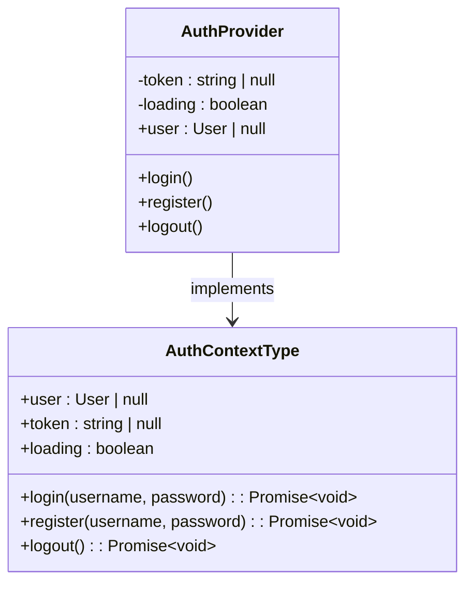
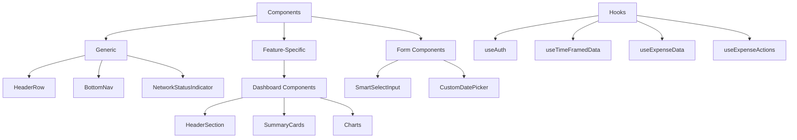

# App Router - Page Routes and Layouts

<cite>
**Referenced Files in This Document**   
- [src/app/layout.tsx](file://src/app/layout.tsx)
- [src/app/dashboard/layout.tsx](file://src/app/dashboard/layout.tsx)
- [src/app/page.tsx](file://src/app/page.tsx)
- [src/app/dashboard/page.tsx](file://src/app/dashboard/page.tsx)
- [src/app/expenses/page.tsx](file://src/app/expenses/page.tsx)
- [src/app/income/page.tsx](file://src/app/income/page.tsx)
- [src/app/settings/page.tsx](file://src/app/settings/page.tsx)
- [src/app/login/page.tsx](file://src/app/login/page.tsx)
- [src/app/register/page.tsx](file://src/app/register/page.tsx)
- [src/app/onboarding/page.tsx](file://src/app/onboarding/page.tsx)
- [src/app/cards/page.tsx](file://src/app/cards/page.tsx)
- [src/app/expenses/edit/[id]/page.tsx](file://src/app/expenses/edit/[id]/page.tsx)
- [src/app/income/edit/[id]/page.tsx](file://src/app/income/edit/[id]/page.tsx)
- [src/components/ProtectedRoute.tsx](file://src/components/ProtectedRoute.tsx)
- [src/contexts/AuthContext.tsx](file://src/contexts/AuthContext.tsx)
- [src/providers/ConvexProvider.tsx](file://src/providers/ConvexProvider.tsx)
</cite>

## Table of Contents
1. [Introduction](#introduction)
2. [Project Structure](#project-structure)
3. [Core Routing Mechanism](#core-routing-mechanism)
4. [Layout System](#layout-system)
5. [Dynamic Routing and Parameter Handling](#dynamic-routing-and-parameter-handling)
6. [Authentication and Route Protection](#authentication-and-route-protection)
7. [Data Fetching and Server Integration](#data-fetching-and-server-integration)
8. [Component Architecture and Reusability](#component-architecture-and-reusability)
9. [Best Practices and Optimization](#best-practices-and-optimization)

## Introduction
This document provides a comprehensive analysis of the Next.js App Router implementation in the Expense Tracker application. It details how the routing system is structured, how layouts are shared across pages, how dynamic routes handle parameters, and how authentication protects access to sensitive routes. The document also covers data fetching patterns using Convex, component organization, and performance optimization strategies.

## Project Structure
The application follows a feature-based organization within the `src/app` directory, where each subdirectory corresponds to a route in the application. The structure leverages Next.js App Router conventions to automatically map directories to URL paths and `page.tsx` files to route endpoints.

```mermaid
graph TD
A[src/app] --> B[dashboard]
A --> C[expenses]
A --> D[income]
A --> E[settings]
A --> F[login]
A --> G[register]
A --> H[onboarding]
A --> I[cards]
A --> J[layout.tsx]
A --> K[page.tsx]
B --> B1[layout.tsx]
B --> B2[page.tsx]
C --> C1[page.tsx]
C --> C2[edit/[id]/page.tsx]
D --> D1[page.tsx]
D --> D2[edit/[id]/page.tsx]
style A fill:#f9f,stroke:#333
style B fill:#bbf,stroke:#333
style C fill:#bbf,stroke:#333
style D fill:#bbf,stroke:#333
style E fill:#bbf,stroke:#333
```

**Diagram sources**
- [src/app](file://src/app)
- [src/app/dashboard](file://src/app/dashboard)
- [src/app/expenses](file://src/app/expenses)
- [src/app/income](file://src/app/income)
- [src/app/settings](file://src/app/settings)

**Section sources**
- [src/app](file://src/app)

## Core Routing Mechanism
The Next.js App Router automatically creates routes based on the file system structure. Each directory in `src/app` corresponds to a route segment, and each `page.tsx` file defines the UI for that route. For example:
- `/dashboard` route is defined by `src/app/dashboard/page.tsx`
- `/expenses` route is defined by `src/app/expenses/page.tsx`
- `/settings` route is defined by `src/app/settings/page.tsx`

The root route `/` is handled by `src/app/page.tsx`, which redirects authenticated users to `/expenses` and unauthenticated users to `/login`.



**Diagram sources**
- [src/app/page.tsx](file://src/app/page.tsx#L1-L30)
- [src/app/dashboard/page.tsx](file://src/app/dashboard/page.tsx)
- [src/app/expenses/page.tsx](file://src/app/expenses/page.tsx)
- [src/app/settings/page.tsx](file://src/app/settings/page.tsx)
- [src/app/login/page.tsx](file://src/app/login/page.tsx)
- [src/app/register/page.tsx](file://src/app/register/page.tsx)

**Section sources**
- [src/app/page.tsx](file://src/app/page.tsx#L1-L30)
- [src/app/dashboard/page.tsx](file://src/app/dashboard/page.tsx)
- [src/app/expenses/page.tsx](file://src/app/expenses/page.tsx)

## Layout System
The application uses a nested layout system to share UI elements across routes. The root layout in `src/app/layout.tsx` wraps all pages with global providers and shared components, while route-specific layouts can add additional shared UI.

### Root Layout
The root layout (`src/app/layout.tsx`) provides global context providers and shared UI elements that appear on all pages:

- **ConvexProvider**: Wraps the application with Convex client for database operations
- **AuthProvider**: Manages authentication state and user session
- **SettingsProvider**: Manages user settings
- **OfflineProvider**: Handles offline state and synchronization
- **NetworkStatusIndicator**: Displays network connectivity status
- **Toaster**: Provides toast notifications



**Diagram sources**
- [src/app/layout.tsx](file://src/app/layout.tsx#L1-L58)
- [src/providers/ConvexProvider.tsx](file://src/providers/ConvexProvider.tsx)
- [src/contexts/AuthContext.tsx](file://src/contexts/AuthContext.tsx)

**Section sources**
- [src/app/layout.tsx](file://src/app/layout.tsx#L1-L58)

### Nested Layouts
The dashboard route uses a nested layout (`src/app/dashboard/layout.tsx`) that wraps its pages with additional authentication protection. This layout checks authentication status and renders a loading state while authentication is being determined.

```typescript
// src/app/dashboard/layout.tsx
export default function DashboardLayout({ children }: { children: React.ReactNode }) {
  const { user, loading } = useAuth();

  if (loading) {
    return <LoadingState />;
  }

  return <ProtectedRoute>{children}</ProtectedRoute>;
}
```

This pattern allows for route-specific layout logic while inheriting the root layout's global providers.

**Section sources**
- [src/app/dashboard/layout.tsx](file://src/app/dashboard/layout.tsx#L1-L22)

## Dynamic Routing and Parameter Handling
The application implements dynamic routing for editing expenses and income entries using route parameters. Dynamic segments are defined by wrapping the segment name in square brackets (e.g., `[id]`).

### Dynamic Route Structure
- `/expenses/edit/[id]/page.tsx` - Edit expense with specific ID
- `/income/edit/[id]/page.tsx` - Edit income with specific ID

These routes capture the `id` parameter from the URL and use it to fetch and update specific records.

### Parameter Access
The `useParams()` hook from `next/navigation` is used to access route parameters:

```typescript
// src/app/expenses/edit/[id]/page.tsx
const { id } = useParams();
const expenseId = params.id as Id<"expenses">;
```

The parameter is then used in Convex queries to fetch the specific expense data:

```typescript
const expense = useQuery(api.expenses.getExpenseById, token ? { token, expenseId } : "skip");
```

### Route Implementation
Both dynamic routes follow a similar pattern:
1. Extract the `id` parameter from the URL
2. Fetch the corresponding record using Convex queries
3. Populate the form with the existing data
4. Handle form submission to update the record
5. Redirect to the appropriate page after successful update



**Diagram sources**
- [src/app/expenses/edit/[id]/page.tsx](file://src/app/expenses/edit/[id]/page.tsx#L1-L395)
- [src/app/income/edit/[id]/page.tsx](file://src/app/income/edit/[id]/page.tsx#L1-L241)

**Section sources**
- [src/app/expenses/edit/[id]/page.tsx](file://src/app/expenses/edit/[id]/page.tsx#L1-L395)
- [src/app/income/edit/[id]/page.tsx](file://src/app/income/edit/[id]/page.tsx#L1-L241)

## Authentication and Route Protection
The application implements a robust authentication system to protect access to sensitive routes. The `ProtectedRoute` component is used to guard routes that require authentication.

### Authentication Context
The `AuthProvider` component (`src/contexts/AuthContext.tsx`) manages authentication state using React Context. It provides:
- **user**: Current user object or null if not authenticated
- **token**: Authentication token stored in localStorage
- **login**: Function to authenticate with username/password
- **register**: Function to create a new account
- **logout**: Function to end the session
- **loading**: Boolean indicating authentication status



**Diagram sources**
- [src/contexts/AuthContext.tsx](file://src/contexts/AuthContext.tsx#L1-L96)

**Section sources**
- [src/contexts/AuthContext.tsx](file://src/contexts/AuthContext.tsx#L1-L96)

### Protected Route Component
The `ProtectedRoute` component (`src/components/ProtectedRoute.tsx`) guards access to authenticated pages:

```typescript
export function ProtectedRoute({ children }: ProtectedRouteProps) {
  const { user, loading } = useAuth();
  const router = useRouter();

  useEffect(() => {
    if (!loading && !user) {
      router.replace("/login");
    }
  }, [user, loading, router]);

  if (loading) {
    return <LoadingState />;
  }

  if (!user) {
    return null;
  }

  return <>{children}</>;
}
```

This component:
1. Checks authentication status using `useAuth()`
2. Redirects unauthenticated users to `/login`
3. Shows a loading state while authentication is being determined
4. Renders children only for authenticated users

Routes like `/dashboard`, `/expenses`, `/settings`, and `/income` are wrapped with `ProtectedRoute` to ensure only authenticated users can access them.

**Section sources**
- [src/components/ProtectedRoute.tsx](file://src/components/ProtectedRoute.tsx#L1-L34)

## Data Fetching and Server Integration
The application uses Convex as its backend-as-a-service, integrating with Next.js App Router through server components and client-side queries.

### Convex Integration
The `ConvexProvider` (`src/providers/ConvexProvider.tsx`) initializes the Convex client and provides it to the application:

```typescript
const convex = new ConvexReactClient(process.env.NEXT_PUBLIC_CONVEX_URL!);

export function ConvexProvider({ children }: { children: ReactNode }) {
  return (
    <ConvexReactProvider client={convex}>
      {children}
    </ConvexReactProvider>
  );
}
```

### Data Fetching Patterns
The application uses Convex's React hooks for data fetching:
- **useQuery**: For reading data from the database
- **useMutation**: For writing data to the database

```typescript
// Example from expenses page
const expenses = useQuery(api.expenses.getExpenses, token ? { token } : "skip");
const createExpenseMutation = useMutation(api.expenses.createExpense);
```

The pattern `token ? { token } : "skip"` conditionally skips the query when no token is available, preventing unauthorized access attempts.

### Loading States and Error Handling
Components implement proper loading states and error handling:

```typescript
if (isLoading) {
  return <LoadingState />;
}

if (error) {
  return <ErrorState />;
}
```

Toast notifications are used to provide user feedback for successful operations and errors.

**Section sources**
- [src/providers/ConvexProvider.tsx](file://src/providers/ConvexProvider.tsx#L1-L15)
- [src/app/expenses/page.tsx](file://src/app/expenses/page.tsx#L1-L351)
- [src/app/dashboard/page.tsx](file://src/app/dashboard/page.tsx#L1-L126)

## Component Architecture and Reusability
The application follows a modular component architecture with reusable UI components and feature-specific organization.

### Component Organization
Components are organized by:
- **Generic UI components**: In `src/components/` (e.g., `HeaderRow`, `BottomNav`)
- **Feature-specific components**: In `src/features/dashboard/components/`
- **Form components**: Reusable inputs like `SmartSelectInput` and `CustomDatePicker`

### Custom Hooks
The application uses custom hooks for reusable logic:
- `useAuth`: Authentication state management
- `useTimeFramedData`: Fetches time-based data (expenses, income)
- `useExpenseData` and `useExpenseActions`: Dashboard-specific expense logic

### Code Reuse Patterns
Common patterns include:
- Form state management with `useState`
- Conditional rendering based on authentication and loading states
- Reusable form components with consistent styling
- Centralized error handling with toast notifications



**Diagram sources**
- [src/components](file://src/components)
- [src/features/dashboard/components](file://src/features/dashboard/components)
- [src/hooks](file://src/hooks)

**Section sources**
- [src/components/HeaderRow.tsx](file://src/components/HeaderRow.tsx)
- [src/features/dashboard/components/Header](file://src/features/dashboard/components/Header)
- [src/hooks/useTimeFramedData.ts](file://src/hooks/useTimeFramedData.ts)

## Best Practices and Optimization
The application implements several best practices for performance, maintainability, and user experience.

### Performance Optimization
- **Code Splitting**: Next.js automatically code-splits by route
- **Conditional Querying**: Using "skip" parameter to prevent unnecessary requests
- **Memoization**: useMemo and useCallback for expensive calculations
- **Loading States**: Immediate feedback during data fetching

### User Experience
- **Immediate Feedback**: Toast notifications for all actions
- **Form Validation**: Client-side validation before submission
- **Smooth Transitions**: Framer Motion for animations
- **Responsive Design**: Mobile-first approach with Tailwind CSS

### Security Practices
- **Route Protection**: All sensitive routes require authentication
- **Token Storage**: Authentication tokens stored securely in localStorage
- **Input Validation**: Server-side validation in Convex functions
- **Error Handling**: Graceful degradation for failed operations

### Development Best Practices
- **Type Safety**: Full TypeScript implementation
- **Component Reusability**: Shared components across routes
- **Separation of Concerns**: Clear separation between UI, logic, and data
- **Consistent Patterns**: Uniform approach to forms, routing, and data fetching

**Section sources**
- [src/app/page.tsx](file://src/app/page.tsx#L1-L30)
- [src/app/expenses/page.tsx](file://src/app/expenses/page.tsx#L1-L351)
- [src/components/ProtectedRoute.tsx](file://src/components/ProtectedRoute.tsx#L1-L34)
- [src/contexts/AuthContext.tsx](file://src/contexts/AuthContext.tsx#L1-L96)