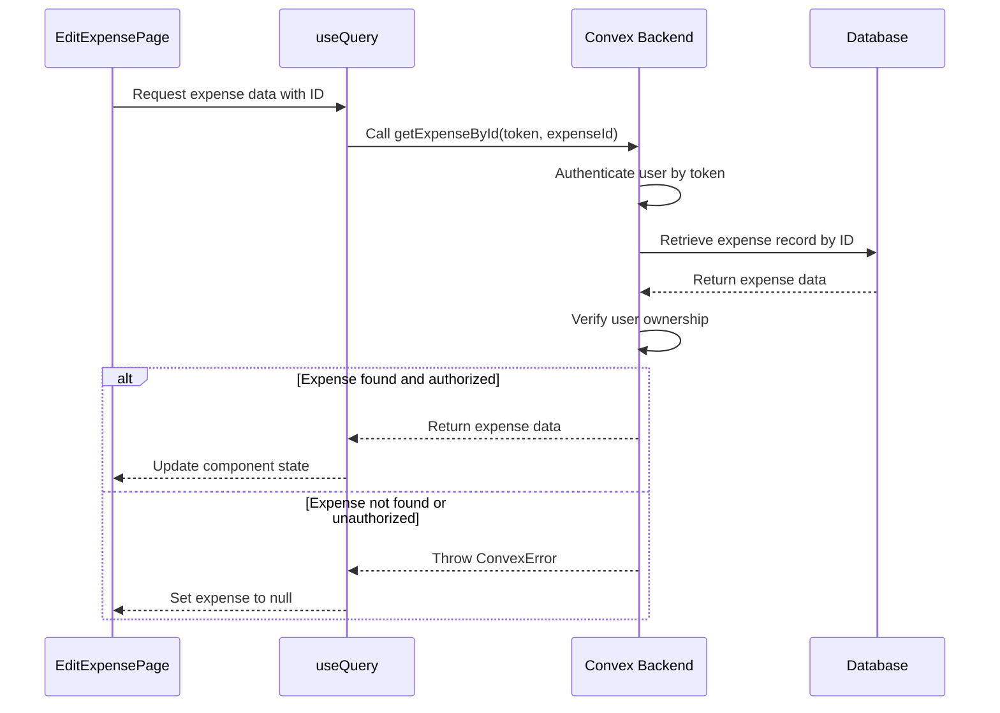
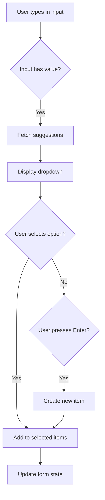
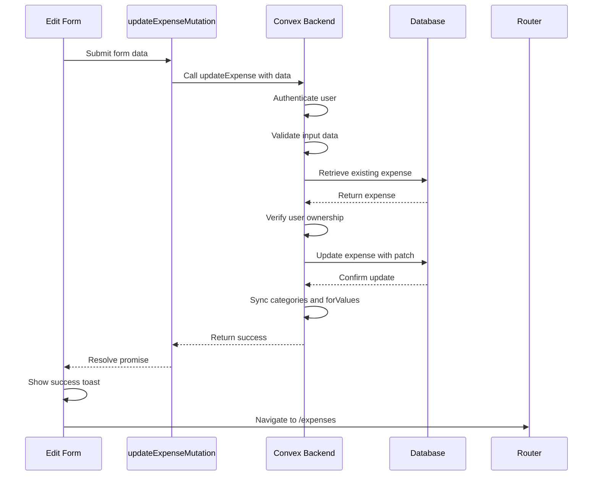

# Dynamic Routing and Parameter Handling

<cite>
**Referenced Files in This Document**   
- [page.tsx](file://src/app/expenses/edit/[id]/page.tsx)
- [page.tsx](file://src/app/income/edit/[id]/page.tsx)
- [expenses.ts](file://convex/expenses.ts)
- [cardsAndIncome.ts](file://convex/cardsAndIncome.ts)
- [schema.ts](file://convex/schema.ts)
- [SmartSelectInput.tsx](file://src/components/SmartSelectInput.tsx)
- [CustomDatePicker.tsx](file://src/components/CustomDatePicker.tsx)
</cite>

## Table of Contents
1. [Introduction](#introduction)
2. [Dynamic Route Structure](#dynamic-route-structure)
3. [Route Parameter Handling](#route-parameter-handling)
4. [Data Fetching with Convex](#data-fetching-with-convex)
5. [Form Implementation and Data Prefilling](#form-implementation-and-data-prefilling)
6. [Mutation and Data Update](#mutation-and-data-update)
7. [Client-Side Navigation](#client-side-navigation)
8. [Route Validation and Error Handling](#route-validation-and-error-handling)
9. [Common Issues and Solutions](#common-issues-and-solutions)
10. [Best Practices](#best-practices)

## Introduction
This document provides a comprehensive analysis of dynamic routing implementation in the App Router for the expense and income editing functionality. It examines how Next.js handles dynamic segments using bracket syntax, processes route parameters, fetches data from Convex, and manages form updates. The analysis covers both `/expenses/edit/[id]` and `/income/edit/[id]` routes, highlighting their similarities and differences in implementation.

## Dynamic Route Structure
The application implements dynamic routing through the bracket syntax `[id]` in the file system, which is a core feature of Next.js App Router. This pattern allows for the creation of dynamic segments that can capture variable path parameters.

The project structure shows two primary dynamic routes:
- `/src/app/expenses/edit/[id]/page.tsx`
- `/src/app/income/edit/[id]/page.tsx`

These routes follow the conventional Next.js pattern where directories enclosed in square brackets represent dynamic segments. When a user navigates to `/expenses/edit/123` or `/income/edit/456`, the `id` parameter captures the respective values (`123` and `456`), which are then accessible within the page component.

```mermaid
graph TD
A[/expenses/edit/[id]] --> B[Captures expense ID]
C[/income/edit/[id]] --> D[Captures income ID]
B --> E[Fetches record by ID]
D --> E
E --> F[Prefills form with data]
F --> G[Enables editing]
```

**Diagram sources**
- [page.tsx](file://src/app/expenses/edit/[id]/page.tsx)
- [page.tsx](file://src/app/income/edit/[id]/page.tsx)

**Section sources**
- [page.tsx](file://src/app/expenses/edit/[id]/page.tsx)
- [page.tsx](file://src/app/income/edit/[id]/page.tsx)

## Route Parameter Handling
Dynamic route parameters are accessed using the `useParams` hook from `next/navigation`, which provides a simple API to retrieve the parameters from the URL.

In both edit pages, the implementation follows the same pattern:

```typescript
const { id } = useParams();
```

The `id` parameter is then used to fetch the corresponding record from the database. The type system ensures type safety through Convex's generated types:

```typescript
const expenseId = params.id as Id<"expenses">;
const incomeId = id as Id<"income">;
```

This type assertion ensures that the ID is properly typed according to the Convex data model, providing compile-time safety and IDE support.

The route parameters are only available in client components, which is why both edit pages include the `"use client"` directive at the top of the file. This enables the use of React hooks like `useParams` and `useRouter` for client-side navigation and parameter access.

**Section sources**
- [page.tsx](file://src/app/expenses/edit/[id]/page.tsx#L10-L11)
- [page.tsx](file://src/app/income/edit/[id]/page.tsx#L10-L11)

## Data Fetching with Convex
Data fetching is implemented using Convex's React hooks, specifically `useQuery`, which provides a seamless integration between the frontend and backend.

### Expense Data Fetching
The expense edit page fetches data using the `getExpenseById` query:

```typescript
const expense = useQuery(api.expenses.getExpenseById, token ? { token, expenseId } : "skip");
```

### Income Data Fetching
Similarly, the income edit page uses:

```typescript
const income = useQuery(api.cardsAndIncome.getIncomeById, token ? { token, incomeId } : "skip");
```

The Convex query implementation in `convex/expenses.ts` includes proper authorization and error handling:

```typescript
export const getExpenseById = query({
  args: {
    token: v.string(),
    expenseId: v.id("expenses"),
  },
  handler: async (ctx, args) => {
    const user = await getUserByToken(ctx, args.token);
    const expense = await ctx.db.get(args.expenseId);
    if (!expense || expense.userId !== user._id) {
      throw new ConvexError("Expense not found or not authorized");
    }
    return expense;
  },
});
```

The query first authenticates the user using the provided token, then retrieves the expense record by ID. It includes a critical security check to ensure the requested expense belongs to the authenticated user, preventing unauthorized access to other users' data.



**Diagram sources**
- [expenses.ts](file://convex/expenses.ts#L190-L205)
- [cardsAndIncome.ts](file://convex/cardsAndIncome.ts#L166-L181)
- [page.tsx](file://src/app/expenses/edit/[id]/page.tsx)

**Section sources**
- [expenses.ts](file://convex/expenses.ts#L190-L205)
- [cardsAndIncome.ts](file://convex/cardsAndIncome.ts#L166-L181)

## Form Implementation and Data Prefilling
The form components in both edit pages are designed to prefill data when the record is loaded and handle user input for updates.

### State Management
Both pages use React's `useState` hook to manage form data:

```typescript
const [formData, setFormData] = useState<ExpenseFormData>({
  amount: "",
  title: "",
  category: [],
  for: [],
  date: format(new Date(), "yyyy-MM-dd"),
  cardId: "",
});
```

### Data Prefilling
When the data is fetched from Convex, an `useEffect` hook updates the form state:

```typescript
useEffect(() => {
  if (expense) {
    setFormData({
      amount: expense.amount.toString(),
      title: expense.title,
      category: expense.category,
      for: Array.isArray(expense.for) ? expense.for : (expense.for ? [expense.for] : []),
      date: format(new Date(expense.date), "yyyy-MM-dd"),
      cardId: expense.cardId || "",
    });
    setIsLoading(false);
  }
}, [expense]);
```

### Specialized Input Components
The application uses custom components to enhance the user experience:

#### SmartSelectInput
This component handles multi-select inputs with autocomplete and creation capabilities:



**Diagram sources**
- [SmartSelectInput.tsx](file://src/components/SmartSelectInput.tsx)

#### CustomDatePicker
This component handles date selection with support for different calendar systems:

```typescript
export function CustomDatePicker({ value, onChange, label }: CustomDatePickerProps) {
  const { settings } = useSettings();
  const isJalali = settings?.calendar === "jalali";
  // Implementation handles conversion between Gregorian and Jalali calendars
}
```

**Section sources**
- [page.tsx](file://src/app/expenses/edit/[id]/page.tsx#L100-L120)
- [SmartSelectInput.tsx](file://src/components/SmartSelectInput.tsx)
- [CustomDatePicker.tsx](file://src/components/CustomDatePicker.tsx)

## Mutation and Data Update
Form submissions are handled through Convex mutations, which update the records in the database.

### Expense Update Mutation
```typescript
const updateExpenseMutation = useMutation(api.expenses.updateExpense);

await updateExpenseMutation({
  token: token!,
  expenseId,
  amount,
  title: formData.title,
  category: formData.category,
  for: formData.for,
  date: new Date(formData.date).getTime(),
  cardId: formData.cardId ? (formData.cardId as any) : undefined,
});
```

### Income Update Mutation
```typescript
const updateIncomeMutation = useMutation(api.cardsAndIncome.updateIncome);

await updateIncomeMutation({
  token: token!,
  incomeId,
  amount,
  source: formData.source,
  category: formData.category[0],
  date: new Date(formData.date).getTime(),
  cardId: formData.cardId as Id<"cards">,
  notes: formData.notes,
});
```

The backend implementation includes comprehensive validation and business logic:

```typescript
export const updateExpense = mutation({
  args: {
    token: v.string(),
    expenseId: v.id("expenses"),
    amount: v.number(),
    title: v.string(),
    category: v.array(v.string()),
    for: v.array(v.string()),
    date: v.number(),
    cardId: v.optional(v.id("cards")),
  },
  handler: async (ctx, args) => {
    const user = await getUserByToken(ctx, args.token);
    
    // Verify the expense belongs to the user
    const expense = await ctx.db.get(args.expenseId);
    if (!expense || expense.userId !== user._id) {
      throw new ConvexError("Expense not found or not authorized");
    }

    // Update the expense
    await ctx.db.patch(args.expenseId, {
      amount: args.amount,
      title: args.title,
      category: args.category,
      for: args.for,
      date: args.date,
      cardId: args.cardId,
    });

    // Add new categories to user's categories if they don't exist
    for (const categoryName of args.category) {
      const existingCategory = await ctx.db
        .query("categories")
        .withIndex("by_user_name", (q) => q.eq("userId", user._id).eq("name", categoryName))
        .first();

      if (!existingCategory) {
        await ctx.db.insert("categories", {
          name: categoryName,
          userId: user._id,
        });
      }
    }
    // Similar logic for "for" values
  },
});
```



**Diagram sources**
- [expenses.ts](file://convex/expenses.ts#L126-L188)
- [cardsAndIncome.ts](file://convex/cardsAndIncome.ts#L183-L213)
- [page.tsx](file://src/app/expenses/edit/[id]/page.tsx)

**Section sources**
- [expenses.ts](file://convex/expenses.ts#L126-L188)
- [cardsAndIncome.ts](file://convex/cardsAndIncome.ts#L183-L213)

## Client-Side Navigation
Client-side navigation is implemented using the `useRouter` hook from `next/navigation`, allowing for seamless navigation without full page reloads.

Both edit pages use the router for:
- Navigating back to the previous page
- Redirecting after successful updates

```typescript
const router = useRouter();

// Navigate back
router.back();

// Redirect after update
router.push("/expenses");
```

The navigation is wrapped in a try-catch block to handle potential errors during the update process, ensuring a graceful user experience even when updates fail.

**Section sources**
- [page.tsx](file://src/app/expenses/edit/[id]/page.tsx#L10-L11)
- [page.tsx](file://src/app/income/edit/[id]/page.tsx#L10-L11)

## Route Validation and Error Handling
The application implements comprehensive validation and error handling at multiple levels.

### Frontend Validation
The form includes client-side validation to provide immediate feedback:

```typescript
if (!formData.amount || !formData.title || formData.category.length === 0 || !formData.cardId) {
  toast.error("Please fill in all required fields");
  return;
}

const amount = parseFloat(formData.amount);
if (isNaN(amount) || amount <= 0) {
  toast.error("Please enter a valid amount");
  return;
}
```

### Backend Validation
The Convex queries and mutations include server-side validation:

```typescript
if (!expense || expense.userId !== user._id) {
  throw new ConvexError("Expense not found or not authorized");
}
```

### Error Display
Errors are displayed to users using the `sonner` toast library:

```typescript
catch (error: unknown) {
  const message = error instanceof Error ? error.message : "Failed to update expense";
  toast.error(message);
}
```

The loading state is also managed to provide feedback during data fetching:

```typescript
if (isLoading) {
  return (
    <ProtectedRoute>
      <div className="min-h-screen bg-gray-50 flex items-center justify-center">
        <div className="text-lg">Loading...</div>
      </div>
    </ProtectedRoute>
  );
}
```

**Section sources**
- [page.tsx](file://src/app/expenses/edit/[id]/page.tsx#L200-L220)
- [expenses.ts](file://convex/expenses.ts#L190-L205)

## Common Issues and Solutions
### Stale Data
The application uses Convex's real-time capabilities to minimize stale data issues. However, in offline scenarios, the PWA configuration helps manage caching:

```javascript
// next.config.mjs
runtimeCaching: [
  {
    urlPattern: /\/expenses/,
    handler: 'NetworkFirst',
    options: {
      cacheName: 'expenses-cache',
    },
  },
]
```

### Parameter Parsing Errors
The application handles parameter parsing through type assertions and validation:

```typescript
const expenseId = params.id as Id<"expenses">;
```

The use of Convex's `Id` type ensures type safety and prevents invalid IDs from being passed to queries.

### Deep Linking in Offline Scenarios
The PWA service worker (`sw.js`) and manifest configuration enable offline functionality:

```json
{
  "manifest": "/manifest.json",
  "themeColor": "#000000",
  "viewport": "width=device-width, initial-scale=1, maximum-scale=1"
}
```

When offline, the service worker serves cached content, allowing users to access previously visited pages, including edit forms with prefilled data.

**Section sources**
- [next.config.mjs](file://next.config.mjs)
- [page.tsx](file://src/app/expenses/edit/[id]/page.tsx)

## Best Practices
### URL Design
- Use descriptive route names (`/expenses/edit`, `/income/edit`)
- Keep dynamic segments simple and consistent (`[id]`)
- Follow RESTful conventions for resource naming

### Route Validation
- Always validate route parameters on both client and server
- Implement proper authorization checks
- Provide meaningful error messages
- Handle edge cases like invalid or missing IDs

### Accessibility
- Use proper semantic HTML elements
- Include descriptive labels for form inputs
- Ensure keyboard navigation works correctly
- Provide sufficient color contrast
- Use ARIA attributes where appropriate

### Performance
- Implement loading states for better UX
- Use debouncing for search inputs
- Leverage Convex's real-time capabilities
- Optimize data fetching with proper indexing
- Use efficient rendering patterns

### Security
- Always verify user ownership of records
- Validate and sanitize all inputs
- Use secure authentication tokens
- Implement proper error handling to avoid information leakage
- Follow the principle of least privilege