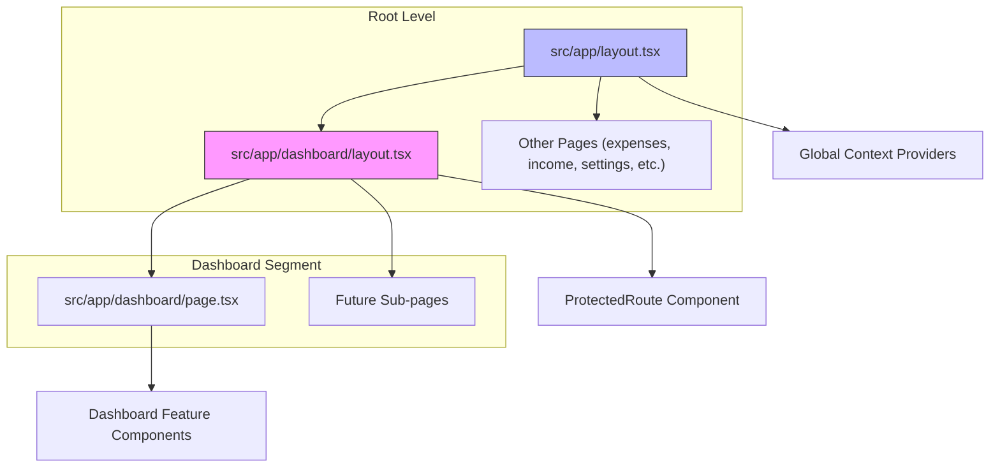
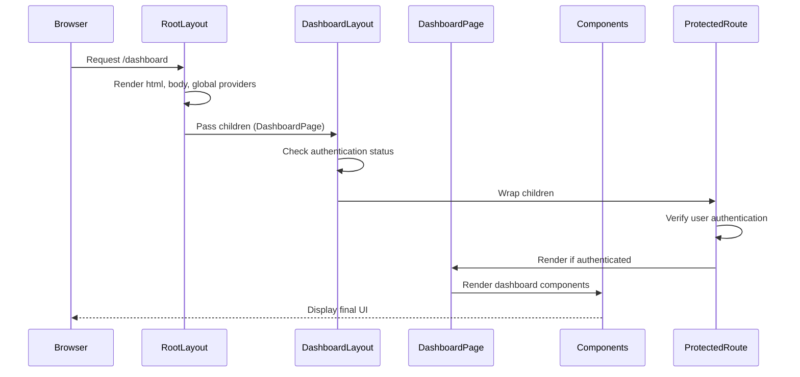
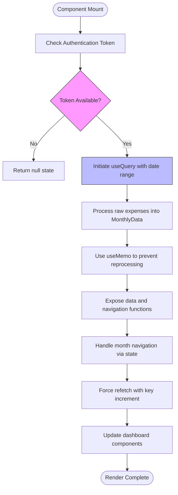
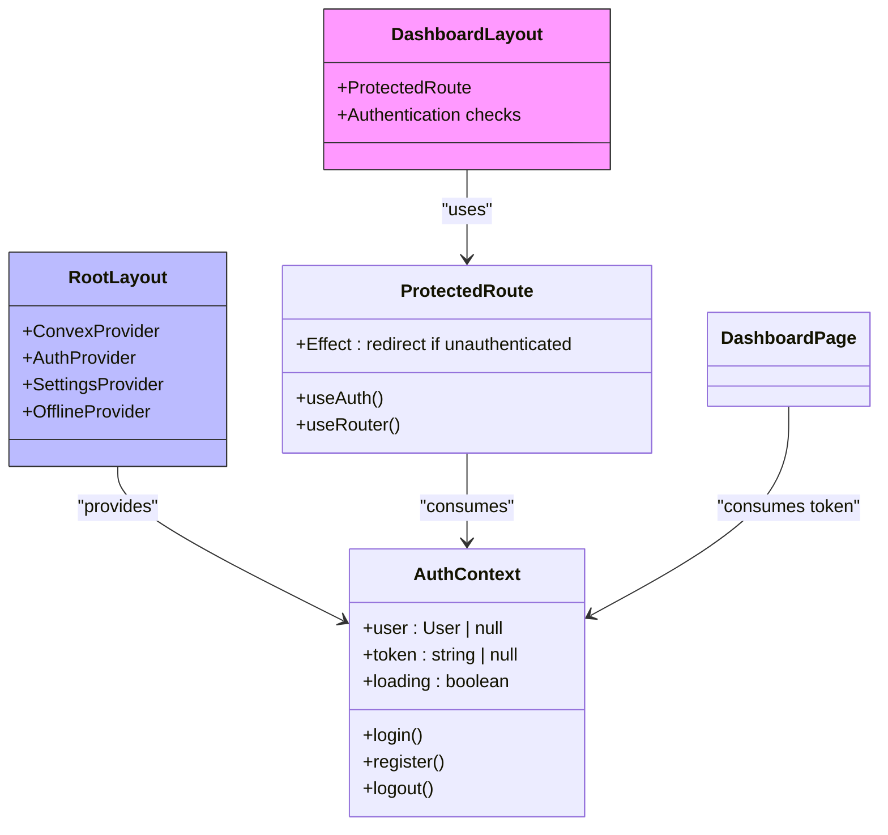
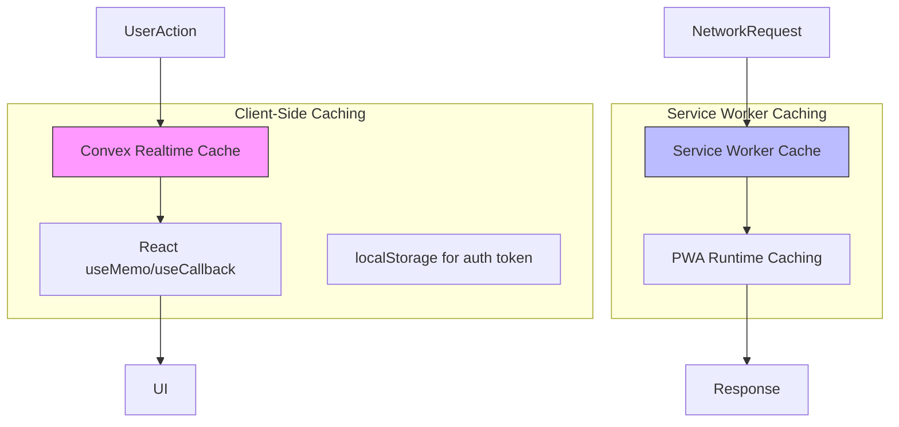

# Nested Layouts and Route Grouping

<cite>
**Referenced Files in This Document**   
- [layout.tsx](file://src/app/layout.tsx)
- [dashboard/layout.tsx](file://src/app/dashboard/layout.tsx)
- [dashboard/page.tsx](file://src/app/dashboard/page.tsx)
- [AuthContext.tsx](file://src/contexts/AuthContext.tsx)
- [ProtectedRoute.tsx](file://src/components/ProtectedRoute.tsx)
- [useExpenseData.ts](file://src/features/dashboard/hooks/useExpenseData.ts)
- [useExpenseActions.ts](file://src/features/dashboard/hooks/useExpenseActions.ts)
- [HeaderSection.tsx](file://src/features/dashboard/components/Header/HeaderSection.tsx)
- [SummaryCards.tsx](file://src/features/dashboard/components/SummaryCards/SummaryCards.tsx)
</cite>

## Table of Contents
1. [Introduction](#introduction)
2. [Project Structure and Layout Hierarchy](#project-structure-and-layout-hierarchy)
3. [Dashboard Nested Layout Implementation](#dashboard-nested-layout-implementation)
4. [Rendering Hierarchy and Component Flow](#rendering-hierarchy-and-component-flow)
5. [Data Fetching and State Management](#data-fetching-and-state-management)
6. [Context Providers and Authentication Flow](#context-providers-and-authentication-flow)
7. [Route Grouping and Feature Organization](#route-grouping-and-feature-organization)
8. [Performance Optimization Techniques](#performance-optimization-techniques)
9. [Common Issues and Best Practices](#common-issues-and-best-practices)
10. [Conclusion](#conclusion)

## Introduction
This document provides a comprehensive analysis of nested layouts in the App Router implementation of the Expense Tracker application, with a specific focus on the dashboard feature. It examines how nested layouts enable shared UI elements within specific route segments while preserving the root layout, details the rendering hierarchy, and explores data fetching optimization strategies. The analysis covers component relationships, state sharing mechanisms, and best practices for maintaining performance and maintainability in complex layout structures.

## Project Structure and Layout Hierarchy



**Diagram sources**
- [layout.tsx](file://src/app/layout.tsx#L1-L59)
- [dashboard/layout.tsx](file://src/app/dashboard/layout.tsx#L1-L23)

**Section sources**
- [layout.tsx](file://src/app/layout.tsx#L1-L59)
- [dashboard/layout.tsx](file://src/app/dashboard/layout.tsx#L1-L23)

## Dashboard Nested Layout Implementation

The dashboard nested layout in `src/app/dashboard/layout.tsx` serves as a wrapper for all routes within the `/dashboard` segment, providing shared UI elements and authentication protection. This layout enables consistent navigation, styling, and functionality across all dashboard-related pages while isolating these concerns from other application routes.

```tsx
export default function DashboardLayout({ children }: { children: React.ReactNode }) {
  const { user, loading } = useAuth();

  if (loading) {
    return (
      <div className="min-h-screen flex items-center justify-center">
        <div className="text-lg">Loading...</div>
      </div>
    );
  }

  return (
    <ProtectedRoute>
      {children}
    </ProtectedRoute>
  );
}
```

The implementation follows Next.js App Router conventions where the `layout.tsx` file automatically wraps all child pages in the same directory and its subdirectories. This creates a hierarchical structure where the dashboard layout is rendered between the root layout and any dashboard-specific pages.

**Section sources**
- [dashboard/layout.tsx](file://src/app/dashboard/layout.tsx#L1-L23)

## Rendering Hierarchy and Component Flow

The rendering hierarchy in this application follows a nested composition pattern where layouts wrap their children in a top-down approach. When a user navigates to `/dashboard`, the following rendering sequence occurs:



**Diagram sources**
- [layout.tsx](file://src/app/layout.tsx#L1-L59)
- [dashboard/layout.tsx](file://src/app/dashboard/layout.tsx#L1-L23)
- [dashboard/page.tsx](file://src/app/dashboard/page.tsx#L1-L127)

**Section sources**
- [layout.tsx](file://src/app/layout.tsx#L1-L59)
- [dashboard/layout.tsx](file://src/app/dashboard/layout.tsx#L1-L23)
- [dashboard/page.tsx](file://src/app/dashboard/page.tsx#L1-L127)

## Data Fetching and State Management

The dashboard implements an optimized data fetching strategy using Convex's real-time queries and React hooks. The `useExpenseData` custom hook centralizes data retrieval and processing logic, enabling efficient data management within the nested layout structure.



**Diagram sources**
- [useExpenseData.ts](file://src/features/dashboard/hooks/useExpenseData.ts#L1-L87)
- [dashboard/page.tsx](file://src/app/dashboard/page.tsx#L1-L127)

**Section sources**
- [useExpenseData.ts](file://src/features/dashboard/hooks/useExpenseData.ts#L1-L87)
- [dashboard/page.tsx](file://src/app/dashboard/page.tsx#L1-L127)

The data fetching implementation includes several optimization techniques:
- **Memoization**: The `monthlyData` object is memoized using `useMemo` to prevent unnecessary recalculations when the expense list hasn't changed
- **Cache Busting**: A `key` state variable is used to force re-query when data needs to be refreshed
- **Conditional Fetching**: The query is skipped when no authentication token is available
- **Efficient Processing**: Data transformation (category totals, daily totals) is performed client-side after fetching raw data

## Context Providers and Authentication Flow

The application implements a multi-layered context provider architecture that enables state sharing across nested layouts and components. The root layout wraps the entire application with global providers, while the dashboard layout adds authentication-specific protection.



**Diagram sources**
- [layout.tsx](file://src/app/layout.tsx#L1-L59)
- [AuthContext.tsx](file://src/contexts/AuthContext.tsx#L1-L97)
- [ProtectedRoute.tsx](file://src/components/ProtectedRoute.tsx#L1-L35)
- [dashboard/layout.tsx](file://src/app/dashboard/layout.tsx#L1-L23)

**Section sources**
- [layout.tsx](file://src/app/layout.tsx#L1-L59)
- [AuthContext.tsx](file://src/contexts/AuthContext.tsx#L1-L97)
- [ProtectedRoute.tsx](file://src/components/ProtectedRoute.tsx#L1-L35)

The authentication flow works as follows:
1. The `AuthProvider` in the root layout initializes authentication state from localStorage
2. The `ProtectedRoute` component in the dashboard layout consumes the authentication context
3. During rendering, it checks if the user is authenticated
4. If unauthenticated, it redirects to the login page using `useRouter`
5. The loading state is handled gracefully with a loading indicator

## Route Grouping and Feature Organization

While the current implementation does not utilize explicit route groups (denoted by parentheses in Next.js), the project structure demonstrates a clear feature-based organization that could be enhanced with route groups for more complex scenarios.

The dashboard feature is organized in a dedicated directory with its own layout, page, and supporting components. This structure allows for:
- **Encapsulation**: Dashboard-specific components and hooks are isolated in the `features/dashboard` directory
- **Scalability**: New dashboard sub-pages can be added without affecting other routes
- **Maintainability**: Related functionality is co-located, making it easier to understand and modify

To implement route groups for future feature expansion, the following pattern could be used:

```bash
src/app/
├── (dashboard)/
│   ├── analytics/
│   │   └── page.tsx
│   ├── reports/
│   │   └── page.tsx
│   ├── layout.tsx
│   └── page.tsx
├── (finance)/
│   ├── expenses/
│   │   └── page.tsx
│   ├── income/
│   │   └── page.tsx
│   └── layout.tsx
```

Route groups would allow organizing related routes without affecting the URL structure, providing better code organization while maintaining clean URLs.

**Section sources**
- [project_structure](file://#L1-L100)

## Performance Optimization Techniques

The application implements several performance optimization techniques to ensure efficient rendering and data handling:

### Data Fetching Optimization
- **Selective Querying**: The `getExpensesByDateRange` query uses database indexes for efficient data retrieval
- **Incremental Key Updates**: The `key` parameter in `useExpenseData` allows for controlled cache invalidation without unmounting components
- **Conditional Rendering**: Loading states are handled at the layout level to prevent rendering incomplete UI

### Rendering Optimization
- **Memoization**: The `monthlyData` computation is memoized to prevent unnecessary recalculations
- **Component Splitting**: Dashboard components are broken down into smaller, reusable pieces (HeaderSection, SummaryCards, etc.)
- **Motion Optimization**: Framer Motion animations are used judiciously with proper initial and animate states

### Caching Strategy
The application leverages both client-side and service worker caching:



**Diagram sources**
- [next.config.mjs](file://next.config.mjs#L1-L61)
- [useExpenseData.ts](file://src/features/dashboard/hooks/useExpenseData.ts#L1-L87)
- [sw.js](file://public/sw.js#L1-L48)

**Section sources**
- [next.config.mjs](file://next.config.mjs#L1-L61)
- [useExpenseData.ts](file://src/features/dashboard/hooks/useExpenseData.ts#L1-L87)

## Common Issues and Best Practices

### Common Issues

**Layout Re-rendering**
One potential issue is unnecessary re-rendering of the dashboard layout when authentication state changes. This can be mitigated by:
- Using memoization for expensive computations
- Ensuring context providers are stable
- Avoiding inline function definitions in layout components

**Data Fetching Duplication**
Without proper state management, data fetching could occur multiple times during navigation. The current implementation prevents this by:
- Centralizing data fetching in custom hooks
- Using Convex's built-in caching and reactivity
- Implementing proper dependency arrays in hooks

**Styling Conflicts**
With nested layouts, CSS class conflicts can occur. Best practices include:
- Using BEM or similar naming conventions
- Leveraging CSS modules or scoped styles
- Maintaining consistent design tokens

### Best Practices

**For Nested Layouts:**
- Use layouts to group related routes with shared UI elements
- Keep layout components lightweight and focused on structural concerns
- Implement authentication and authorization at the appropriate layout level
- Use context providers strategically to avoid prop drilling

**For Data Management:**
- Centralize data fetching logic in custom hooks
- Use memoization to optimize expensive computations
- Implement proper loading and error states
- Consider data dependencies and caching strategies

**For Maintainability:**
- Organize components by feature rather than type
- Use clear naming conventions for hooks and components
- Document complex state management patterns
- Implement comprehensive error boundaries

**Section sources**
- [dashboard/layout.tsx](file://src/app/dashboard/layout.tsx#L1-L23)
- [useExpenseData.ts](file://src/features/dashboard/hooks/useExpenseData.ts#L1-L87)
- [AuthContext.tsx](file://src/contexts/AuthContext.tsx#L1-L97)

## Conclusion
The nested layout implementation in the Expense Tracker application demonstrates effective use of Next.js App Router features to create a maintainable and scalable architecture. By leveraging the dashboard layout, the application provides consistent UI elements, authentication protection, and optimized data fetching for all dashboard-related routes. The combination of global context providers in the root layout and route-specific logic in nested layouts creates a flexible structure that can accommodate future feature expansion. With proper attention to performance optimization and state management, this pattern provides a solid foundation for building complex, user-friendly web applications.