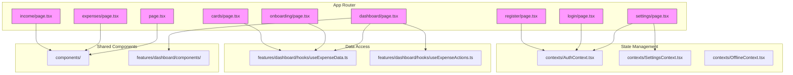
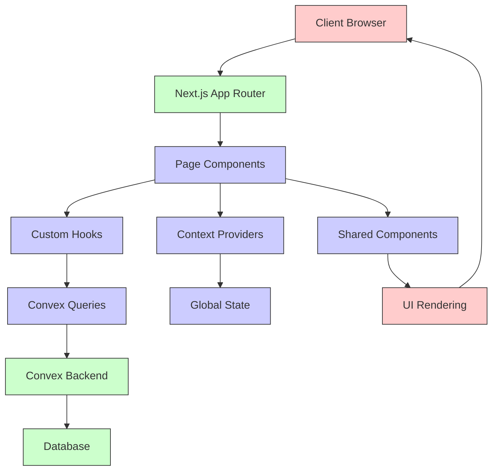
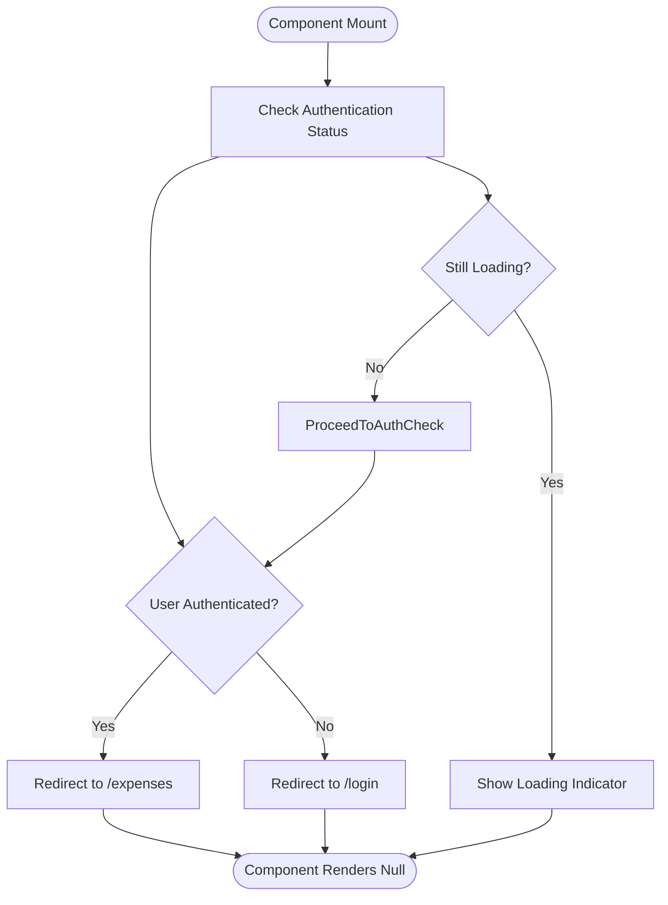
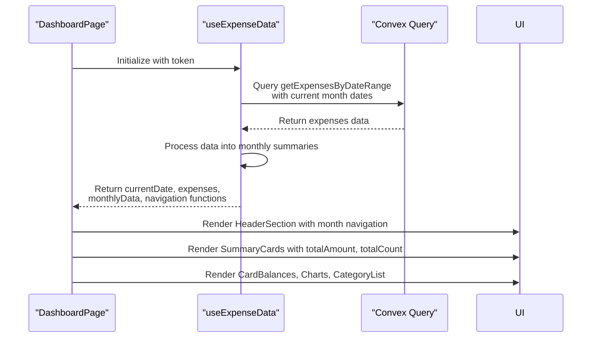
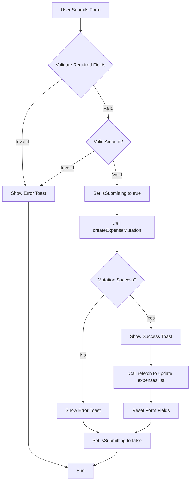
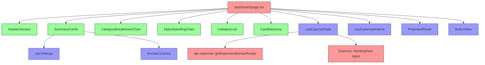

# Page Components and Route-Specific UI

<cite>
**Referenced Files in This Document**   
- [page.tsx](file://src/app/page.tsx)
- [dashboard/page.tsx](file://src/app/dashboard/page.tsx)
- [expenses/page.tsx](file://src/app/expenses/page.tsx)
- [income/page.tsx](file://src/app/income/page.tsx)
- [settings/page.tsx](file://src/app/settings/page.tsx)
- [login/page.tsx](file://src/app/login/page.tsx)
- [register/page.tsx](file://src/app/register/page.tsx)
- [onboarding/page.tsx](file://src/app/onboarding/page.tsx)
- [cards/page.tsx](file://src/app/cards/page.tsx)
- [layout.tsx](file://src/app/layout.tsx)
- [useExpenseData.ts](file://src/features/dashboard/hooks/useExpenseData.ts)
- [useExpenseActions.ts](file://src/features/dashboard/hooks/useExpenseActions.ts)
- [SummaryCards.tsx](file://src/features/dashboard/components/SummaryCards/SummaryCards.tsx)
- [expense.ts](file://src/features/dashboard/types/expense.ts)
</cite>

## Table of Contents
1. [Introduction](#introduction)
2. [Project Structure](#project-structure)
3. [Core Components](#core-components)
4. [Architecture Overview](#architecture-overview)
5. [Detailed Component Analysis](#detailed-component-analysis)
6. [Dependency Analysis](#dependency-analysis)
7. [Performance Considerations](#performance-considerations)
8. [Troubleshooting Guide](#troubleshooting-guide)
9. [Conclusion](#conclusion)

## Introduction
This document provides a comprehensive analysis of the page components and route-specific UI in the Expense Tracker application. The application uses Next.js App Router to define routes and render page-specific user interfaces. Each page component is responsible for rendering its unique UI, handling user interactions, and integrating with backend services through Convex for data fetching and mutations. The document explores how each page composes UI from shared components, manages data loading patterns using server and client components, handles form submissions, and implements best practices for optimization and user experience.

## Project Structure
The project follows a feature-based organization with clear separation between pages, components, hooks, and contexts. The `src/app` directory contains all route definitions with corresponding `page.tsx` files. Shared components are organized under `src/components` and feature-specific components under `src/features/dashboard`. Custom hooks for data fetching and state management are located in `src/hooks` and `src/features/dashboard/hooks`. Context providers for authentication, settings, and offline state are defined in `src/contexts`.

**Diagram sources**
- [page.tsx](file://src/app/page.tsx)
- [dashboard/page.tsx](file://src/app/dashboard/page.tsx)
- [expenses/page.tsx](file://src/app/expenses/page.tsx)
- [income/page.tsx](file://src/app/income/page.tsx)
- [settings/page.tsx](file://src/app/settings/page.tsx)
- [login/page.tsx](file://src/app/login/page.tsx)
- [register/page.tsx](file://src/app/register/page.tsx)
- [onboarding/page.tsx](file://src/app/onboarding/page.tsx)
- [cards/page.tsx](file://src/app/cards/page.tsx)

**Section sources**
- [page.tsx](file://src/app/page.tsx)
- [dashboard/page.tsx](file://src/app/dashboard/page.tsx)
- [expenses/page.tsx](file://src/app/expenses/page.tsx)
- [income/page.tsx](file://src/app/income/page.tsx)
- [settings/page.tsx](file://src/app/settings/page.tsx)
- [login/page.tsx](file://src/app/login/page.tsx)
- [register/page.tsx](file://src/app/register/page.tsx)
- [onboarding/page.tsx](file://src/app/onboarding/page.tsx)
- [cards/page.tsx](file://src/app/cards/page.tsx)

## Core Components
The application's core components include page components that define routes and render UI, context providers that manage global state, and custom hooks that encapsulate data fetching and business logic. The `RootLayout` component wraps all pages with necessary context providers including `ConvexProvider`, `AuthProvider`, `SettingsProvider`, and `OfflineProvider`. Each page component uses the `"use client"` directive to indicate it contains client-side React code. The `ProtectedRoute` component ensures authentication before rendering protected pages. The `BottomNav` component provides mobile navigation between key sections of the application.

**Section sources**
- [layout.tsx](file://src/app/layout.tsx)
- [ProtectedRoute.tsx](file://src/components/ProtectedRoute.tsx)
- [BottomNav.tsx](file://src/components/BottomNav.tsx)

## Architecture Overview
The application follows a client-server architecture with Next.js App Router handling routing and server components, while most UI components are client components that interact with Convex for data operations. The architecture separates concerns through feature-based organization, with dashboard-specific components and hooks isolated in the `features/dashboard` directory. Data flows from Convex queries through custom hooks to page components, which compose UI from shared components. The application uses React Context for global state management including authentication, user settings, and offline status.

**Diagram sources**
- [layout.tsx](file://src/app/layout.tsx)
- [dashboard/page.tsx](file://src/app/dashboard/page.tsx)
- [useExpenseData.ts](file://src/features/dashboard/hooks/useExpenseData.ts)

## Detailed Component Analysis

### Homepage Analysis
The homepage component (`page.tsx`) serves as the application entry point and redirects users based on authentication status. It uses the `useAuth` hook to access authentication state and `useRouter` for navigation. When loading, it displays a loading indicator. Once loaded, it redirects authenticated users to `/expenses` and unauthenticated users to `/login`. The component returns `null` after redirection to prevent rendering any UI.

**Diagram sources**
- [page.tsx](file://src/app/page.tsx#L1-L31)

**Section sources**
- [page.tsx](file://src/app/page.tsx#L1-L31)

### Dashboard Page Analysis
The dashboard page (`dashboard/page.tsx`) composes a comprehensive financial overview using multiple shared components. It imports and uses the `useExpenseData` and `useExpenseActions` custom hooks to manage data fetching and user interactions. The component displays a header with month navigation, summary cards with financial metrics, card balances, analytics charts, and a category list. It uses framer-motion for entrance animations and handles edit navigation by calling the `handleEdit` action and navigating to the expense edit page.

#### Dashboard Data Flow

**Diagram sources**
- [dashboard/page.tsx](file://src/app/dashboard/page.tsx#L1-L127)
- [useExpenseData.ts](file://src/features/dashboard/hooks/useExpenseData.ts#L1-L87)

**Section sources**
- [dashboard/page.tsx](file://src/app/dashboard/page.tsx#L1-L127)
- [useExpenseData.ts](file://src/features/dashboard/hooks/useExpenseData.ts#L1-L87)

### Expenses Page Analysis
The expenses page (`expenses/page.tsx`) provides a form for adding new expenses and displays a history of past expenses. It uses Convex mutations for creating expenses, categories, and "for" values, and queries for fetching cards, categories, and existing expenses. The page implements form validation, toast notifications for user feedback, and automatic card selection. It uses the `useTimeFramedData` hook to manage date-based data fetching and includes a SmartSelectInput component for category and "for" value selection with creation capabilities.

#### Expenses Form Submission Flow

**Diagram sources**
- [expenses/page.tsx](file://src/app/expenses/page.tsx#L1-L352)

**Section sources**
- [expenses/page.tsx](file://src/app/expenses/page.tsx#L1-L352)

### Income Page Analysis
The income page (`income/page.tsx`) follows a similar pattern to the expenses page but focuses on income tracking. It provides a form for adding income records with fields for amount, source, category, date, card selection, and notes. The page uses the `createIncomeMutation` to add new income records and the `useTimeFramedData` hook to manage monthly income data. It displays a history of income records using the `IncomeCard` component and includes navigation back to the previous page via an arrow button.

**Section sources**
- [income/page.tsx](file://src/app/income/page.tsx#L1-L308)

### Settings Page Analysis
The settings page (`settings/page.tsx`) allows users to manage application preferences and account settings. It displays user profile information, connection status with sync capabilities, application information, and preference settings for currency and calendar system. The page provides navigation to the cards management page and includes a logout action. It uses multiple context hooks (`useAuth`, `useOffline`, `useSettings`) to access global state and implements toast notifications for user feedback on actions.

**Section sources**
- [settings/page.tsx](file://src/app/settings/page.tsx#L1-L235)

### Authentication Pages Analysis
The login and register pages (`login/page.tsx`, `register/page.tsx`) handle user authentication. Both pages redirect authenticated users to the expenses page and render forms for credential input. The login page validates username and password fields and calls the `login` authentication method. The register page includes additional validation for password confirmation and minimum length, calling the `register` method to create new accounts. Both pages use toast notifications to provide feedback on authentication attempts.

**Section sources**
- [login/page.tsx](file://src/app/login/page.tsx#L1-L120)
- [register/page.tsx](file://src/app/register/page.tsx#L1-L147)

### Onboarding Page Analysis
The onboarding page (`onboarding/page.tsx`) guides new users through the initial setup by adding payment cards. It maintains local state for card names being added and allows users to add multiple cards before submitting. The page uses the `addCardMutation` to create cards in bulk and redirects to the dashboard upon completion. It provides visual feedback for card addition and removal with animations.

**Section sources**
- [onboarding/page.tsx](file://src/app/onboarding/page.tsx#L1-L166)

### Cards Page Analysis
The cards page (`cards/page.tsx`) allows users to manage their payment cards after initial setup. It displays a form for adding new cards and a list of existing cards with delete functionality. The page uses the `addCardMutation` and `deleteCardMutation` to modify card data and provides toast notifications for success and error states. It includes navigation back to the previous page.

**Section sources**
- [cards/page.tsx](file://src/app/cards/page.tsx#L1-L178)

## Dependency Analysis
The application has a well-defined dependency structure with clear separation between concerns. Page components depend on shared components, custom hooks, and context providers. The dashboard page has the most complex dependency chain, importing multiple components from the `features/dashboard` directory and two custom hooks for data management. All pages depend on the `ProtectedRoute` component for authentication protection, except public pages like login and register. The use of Convex for data operations creates dependencies on generated API types and query/mutation functions.

**Diagram sources**
- [dashboard/page.tsx](file://src/app/dashboard/page.tsx)
- [useExpenseData.ts](file://src/features/dashboard/hooks/useExpenseData.ts)
- [SummaryCards.tsx](file://src/features/dashboard/components/SummaryCards/SummaryCards.tsx)

**Section sources**
- [dashboard/page.tsx](file://src/app/dashboard/page.tsx)
- [useExpenseData.ts](file://src/features/dashboard/hooks/useExpenseData.ts)
- [SummaryCards.tsx](file://src/features/dashboard/components/SummaryCards/SummaryCards.tsx)

## Performance Considerations
The application implements several performance optimizations. The use of custom hooks like `useExpenseData` encapsulates complex data fetching and processing logic, preventing duplication across components. The hook uses `useMemo` to memoize processed data (monthly summaries) and `useCallback` for the refetch function to prevent unnecessary re-renders. The dashboard page uses framer-motion for smooth animations only on initial mount. The application leverages Next.js App Router for code splitting, ensuring only necessary code is loaded for each page. The use of Suspense boundaries is implied through loading states in components, though not explicitly implemented with React Suspense.

## Troubleshooting Guide
Common issues in the application include data fetching race conditions, hydration mismatches, and layout shift problems. Data fetching race conditions can occur when multiple components trigger the same query simultaneously; this is mitigated by Convex's query deduplication. Hydration mismatches may occur if server-rendered and client-rendered content differ; this is prevented by using client components consistently and managing loading states properly. Layout shift problems are addressed through consistent min-height specifications on form elements and buttons. Form submission issues can arise from validation errors or network failures, handled through comprehensive error handling and toast notifications. Authentication state synchronization issues are managed through context providers that handle loading states appropriately.

**Section sources**
- [dashboard/page.tsx](file://src/app/dashboard/page.tsx)
- [expenses/page.tsx](file://src/app/expenses/page.tsx)
- [useExpenseData.ts](file://src/features/dashboard/hooks/useExpenseData.ts)

## Conclusion
The Expense Tracker application demonstrates a well-structured implementation of Next.js App Router with effective separation of concerns, reusable components, and proper state management. The page components effectively compose UI from shared components and feature-specific modules, leveraging custom hooks for data fetching and business logic. The integration with Convex provides a seamless full-stack development experience with type safety and real-time capabilities. The application follows best practices for user experience with loading states, error handling, and navigation patterns. Areas for potential improvement include implementing explicit Suspense boundaries, enhancing form validation, and adding more comprehensive error boundaries.