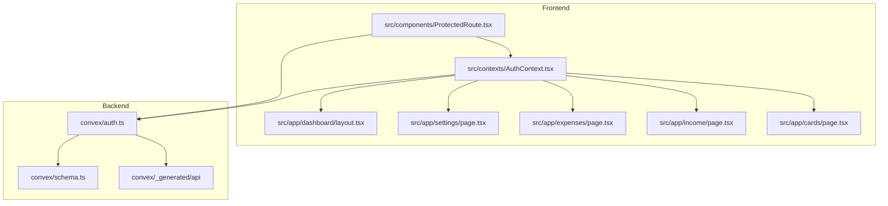
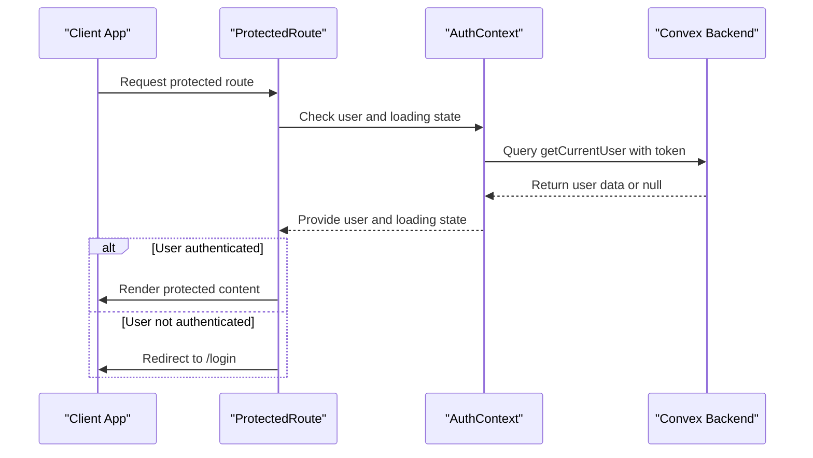
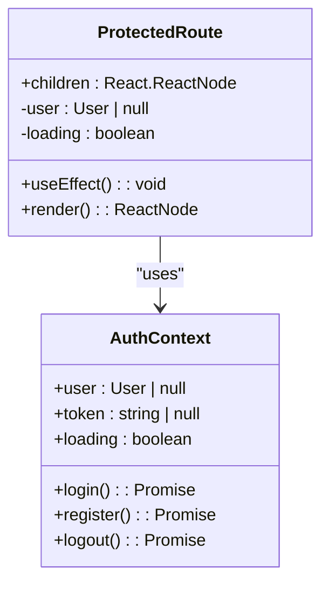
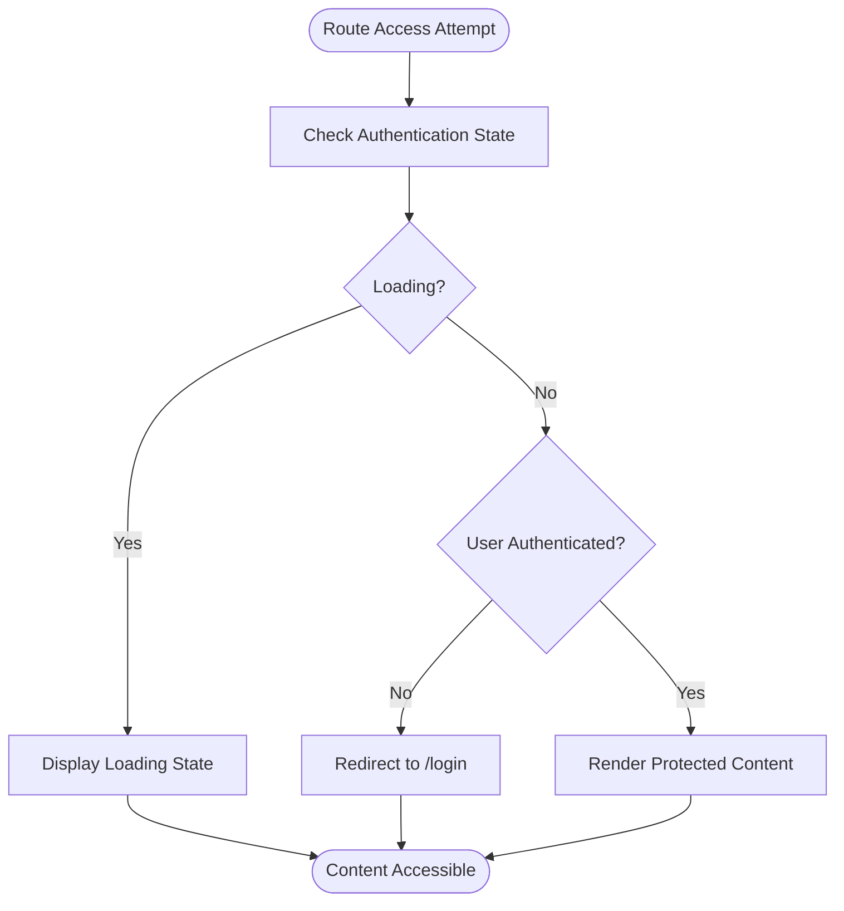
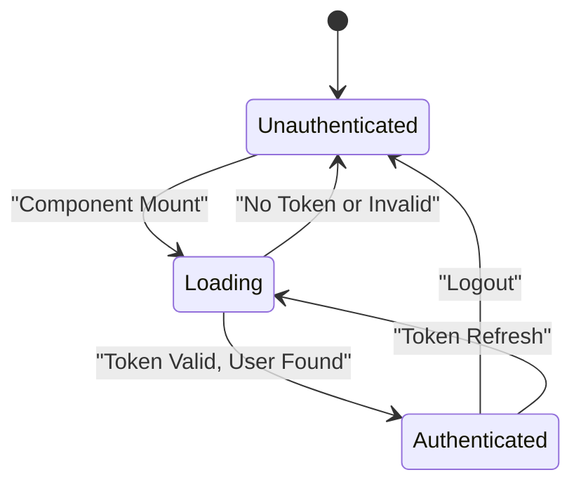
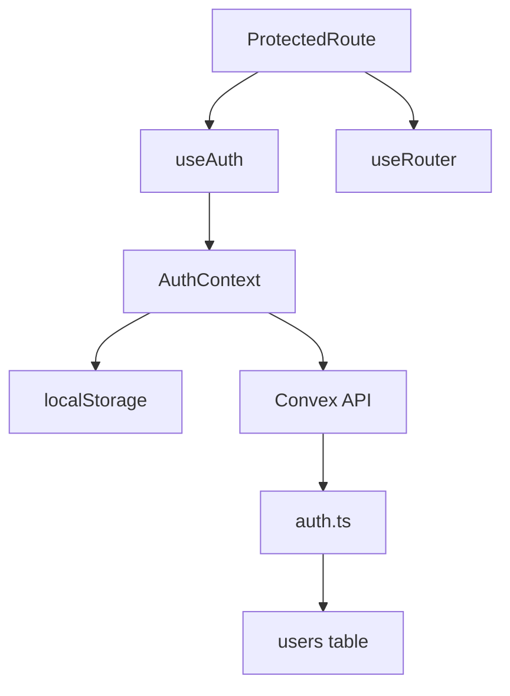

# Protected Route Implementation and Authentication Guarding

<cite>
**Referenced Files in This Document**   
- [ProtectedRoute.tsx](file://src/components/ProtectedRoute.tsx#L1-L34)
- [AuthContext.tsx](file://src/contexts/AuthContext.tsx#L1-L97)
- [dashboard/layout.tsx](file://src/app/dashboard/layout.tsx#L1-L23)
- [settings/page.tsx](file://src/app/settings/page.tsx#L1-L235)
- [expenses/page.tsx](file://src/app/expenses/page.tsx#L1-L352)
- [income/page.tsx](file://src/app/income/page.tsx#L1-L308)
- [cards/page.tsx](file://src/app/cards/page.tsx#L1-L178)
- [auth.ts](file://convex/auth.ts#L1-L132)
</cite>

## Table of Contents
1. [Introduction](#introduction)
2. [Project Structure](#project-structure)
3. [Core Components](#core-components)
4. [Architecture Overview](#architecture-overview)
5. [Detailed Component Analysis](#detailed-component-analysis)
6. [Dependency Analysis](#dependency-analysis)
7. [Performance Considerations](#performance-considerations)
8. [Troubleshooting Guide](#troubleshooting-guide)
9. [Conclusion](#conclusion)

## Introduction
This document provides a comprehensive analysis of the ProtectedRoute component implementation in the Expense Tracker application. The ProtectedRoute component serves as an authentication guard that prevents unauthorized access to protected routes such as /dashboard, /settings, /expenses, /income, and /cards. The implementation leverages React's context API through AuthContext to determine user authentication status and integrates with Next.js routing for redirect management. This documentation covers the component's implementation details, integration patterns, security considerations, and best practices for extending the authentication system.

## Project Structure
The application follows a Next.js App Router structure with a clear separation of concerns between components, contexts, and backend logic. Protected routes are implemented through a combination of frontend components and backend authentication services.



**Diagram sources**
- [ProtectedRoute.tsx](file://src/components/ProtectedRoute.tsx#L1-L34)
- [AuthContext.tsx](file://src/contexts/AuthContext.tsx#L1-L97)
- [auth.ts](file://convex/auth.ts#L1-L132)

**Section sources**
- [ProtectedRoute.tsx](file://src/components/ProtectedRoute.tsx#L1-L34)
- [AuthContext.tsx](file://src/contexts/AuthContext.tsx#L1-L97)

## Core Components
The ProtectedRoute component is a React functional component that wraps protected content and conditionally renders it based on the user's authentication status. It works in conjunction with AuthContext, which manages the authentication state and provides user information to consuming components.

```tsx
export function ProtectedRoute({ children }: ProtectedRouteProps) {
  const { user, loading } = useAuth();
  const router = useRouter();

  useEffect(() => {
    if (!loading && !user) {
      router.replace("/login");
    }
  }, [user, loading, router]);

  if (loading) {
    return (
      <div className="min-h-screen flex items-center justify-center">
        <div className="text-lg">Loading...</div>
      </div>
    );
  }

  if (!user) {
    return null;
  }

  return <>{children}</>;
}
```

**Section sources**
- [ProtectedRoute.tsx](file://src/components/ProtectedRoute.tsx#L1-L34)
- [AuthContext.tsx](file://src/contexts/AuthContext.tsx#L1-L97)

## Architecture Overview
The authentication architecture follows a client-server pattern where the frontend maintains authentication state through React Context, while the backend handles credential validation and token management. The ProtectedRoute component acts as a middleware layer that intercepts access to protected routes.



**Diagram sources**
- [ProtectedRoute.tsx](file://src/components/ProtectedRoute.tsx#L1-L34)
- [AuthContext.tsx](file://src/contexts/AuthContext.tsx#L1-L97)
- [auth.ts](file://convex/auth.ts#L1-L132)

## Detailed Component Analysis

### ProtectedRoute Component Analysis
The ProtectedRoute component implements a declarative authentication guard that wraps protected content and conditionally renders it based on authentication status.

#### Implementation Details


**Diagram sources**
- [ProtectedRoute.tsx](file://src/components/ProtectedRoute.tsx#L1-L34)
- [AuthContext.tsx](file://src/contexts/AuthContext.tsx#L1-L97)

#### Authentication Flow


**Diagram sources**
- [ProtectedRoute.tsx](file://src/components/ProtectedRoute.tsx#L1-L34)

**Section sources**
- [ProtectedRoute.tsx](file://src/components/ProtectedRoute.tsx#L1-L34)

### AuthContext Analysis
The AuthContext component manages the global authentication state and provides authentication methods to consuming components.

#### State Management


**Diagram sources**
- [AuthContext.tsx](file://src/contexts/AuthContext.tsx#L1-L97)

**Section sources**
- [AuthContext.tsx](file://src/contexts/AuthContext.tsx#L1-L97)

## Dependency Analysis
The ProtectedRoute component has dependencies on several key modules that enable its authentication guarding functionality.



**Diagram sources**
- [ProtectedRoute.tsx](file://src/components/ProtectedRoute.tsx#L1-L34)
- [AuthContext.tsx](file://src/contexts/AuthContext.tsx#L1-L97)
- [auth.ts](file://convex/auth.ts#L1-L132)

**Section sources**
- [ProtectedRoute.tsx](file://src/components/ProtectedRoute.tsx#L1-L34)
- [AuthContext.tsx](file://src/contexts/AuthContext.tsx#L1-L97)

## Performance Considerations
The ProtectedRoute implementation is optimized for performance with minimal re-renders and efficient state management.

- **Loading State Optimization**: The component displays a loading state during authentication checks to prevent flickering
- **Effect Dependency Management**: The useEffect hook properly manages dependencies to prevent unnecessary redirects
- **Context Value Stability**: AuthContext provides stable function references to prevent unnecessary re-renders
- **Token Persistence**: Authentication tokens are persisted in localStorage for session continuity

The implementation avoids performance pitfalls by:
- Using proper dependency arrays in useEffect
- Memoizing context value where appropriate
- Minimizing re-renders through conditional rendering
- Efficiently managing authentication state transitions

## Troubleshooting Guide

### Common Issues and Solutions

#### Infinite Redirect Loops
**Issue**: Users experience continuous redirects between protected routes and login page
**Cause**: Authentication state not properly initialized or token validation failing
**Solution**: Ensure AuthProvider is properly wrapped around the application and localStorage token is correctly set

```tsx
// Ensure proper wrapping in layout
<AuthProvider>
  <ProtectedRoute>
    {children}
  </ProtectedRoute>
</AuthProvider>
```

**Section sources**
- [dashboard/layout.tsx](file://src/app/dashboard/layout.tsx#L1-L23)
- [ProtectedRoute.tsx](file://src/components/ProtectedRoute.tsx#L1-L34)

#### Race Conditions During Auth Checks
**Issue**: Brief flash of protected content before redirect occurs
**Cause**: Asynchronous nature of authentication checks
**Solution**: Implement proper loading state handling and ensure useEffect dependencies are correctly specified

```tsx
// Proper dependency array prevents race conditions
useEffect(() => {
  if (!loading && !user) {
    router.replace("/login");
  }
}, [user, loading, router]);
```

**Section sources**
- [ProtectedRoute.tsx](file://src/components/ProtectedRoute.tsx#L1-L34)

#### SSR Compatibility Issues
**Issue**: Authentication state not available during server-side rendering
**Cause**: localStorage and browser APIs not available on server
**Solution**: Use "use client" directive and handle loading states appropriately

```tsx
"use client"; // Required for client-side authentication
```

**Section sources**
- [ProtectedRoute.tsx](file://src/components/ProtectedRoute.tsx#L1-L34)
- [AuthContext.tsx](file://src/contexts/AuthContext.tsx#L1-L97)

## Conclusion
The ProtectedRoute component provides a robust authentication guarding mechanism for the Expense Tracker application. By leveraging React Context and Next.js routing, it effectively protects sensitive routes while providing a smooth user experience. The implementation follows best practices for authentication handling, including proper loading state management, secure token storage, and efficient redirect logic. To extend this system for role-based access control, additional user properties could be included in the authentication payload and checked within the ProtectedRoute component. The current implementation provides a solid foundation for securing both frontend routes and backend API endpoints in the Convex environment.