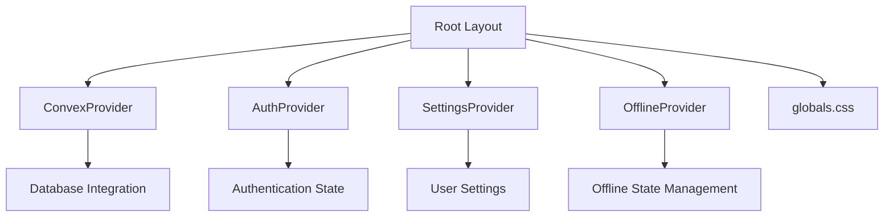
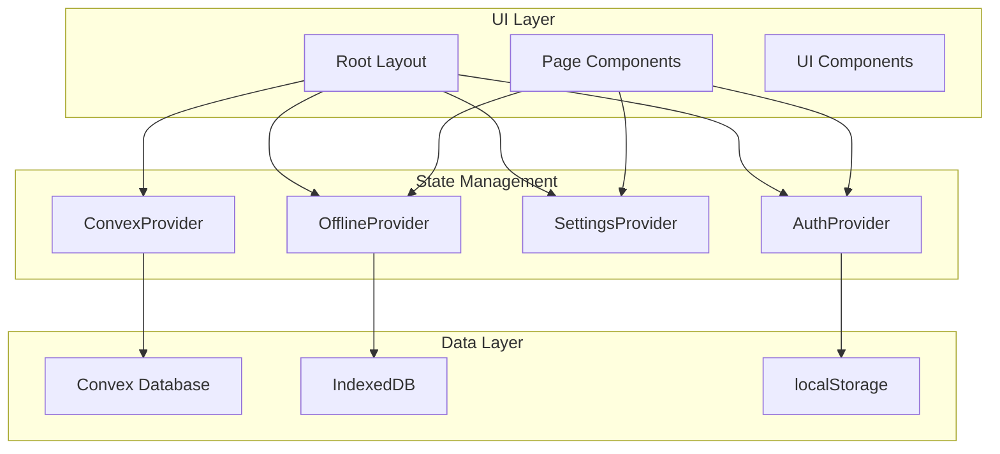
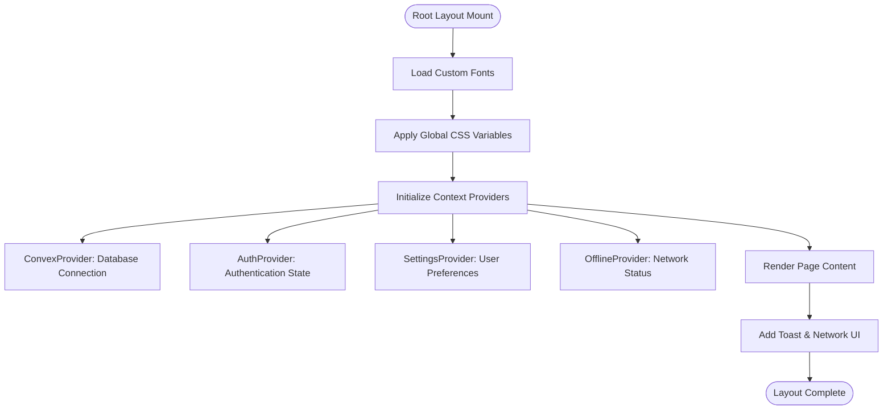
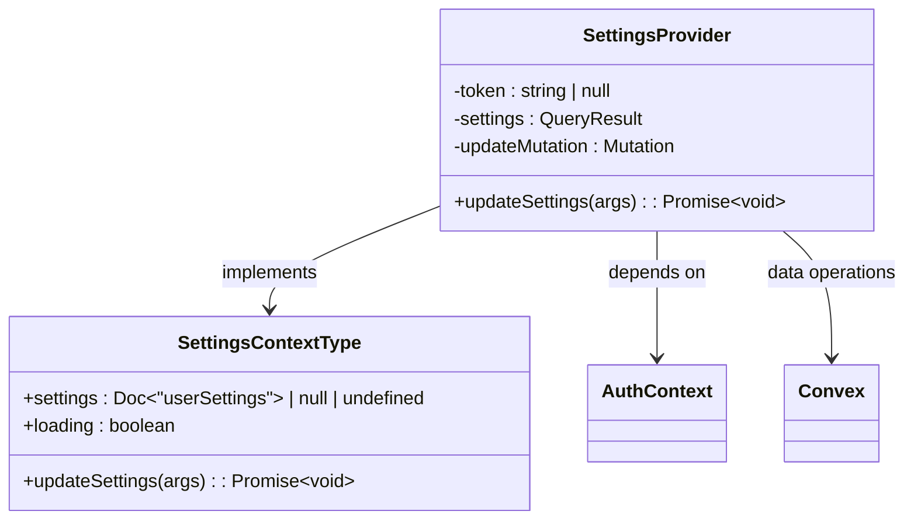
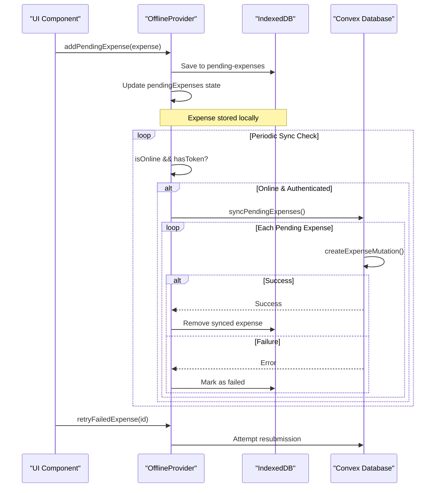
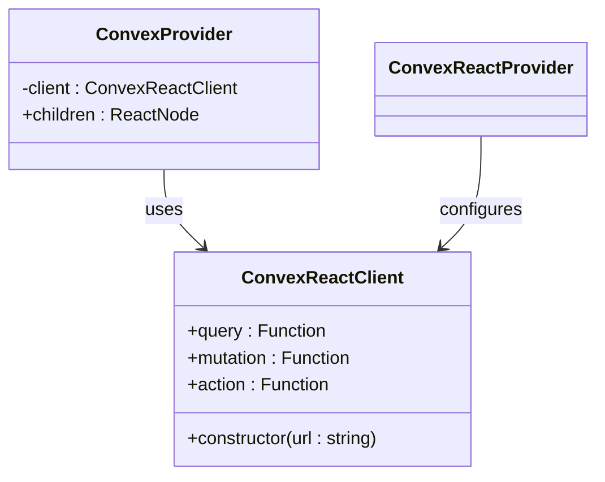
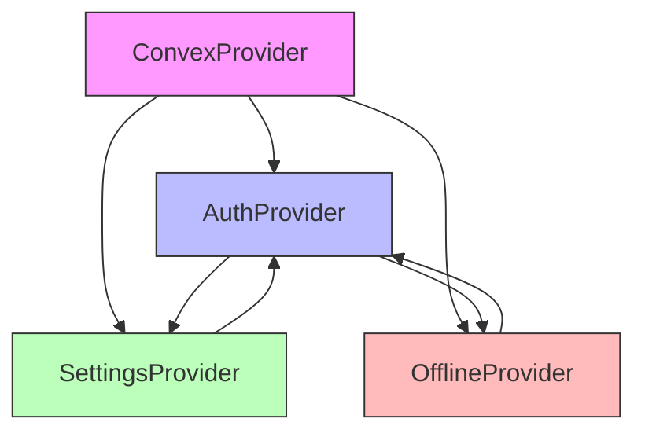
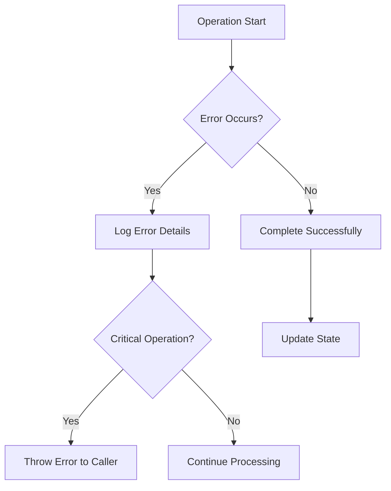

# Root Layout and Global Providers

<cite>
**Referenced Files in This Document**   
- [layout.tsx](file://src/app/layout.tsx)
- [AuthContext.tsx](file://src/contexts/AuthContext.tsx)
- [SettingsContext.tsx](file://src/contexts/SettingsContext.tsx)
- [OfflineContext.tsx](file://src/contexts/OfflineContext.tsx)
- [ConvexProvider.tsx](file://src/providers/ConvexProvider.tsx)
- [globals.css](file://src/app/globals.css)
</cite>

## Table of Contents
1. [Root Layout and Global Providers](#root-layout-and-global-providers)
2. [Project Structure](#project-structure)
3. [Core Components](#core-components)
4. [Architecture Overview](#architecture-overview)
5. [Detailed Component Analysis](#detailed-component-analysis)
6. [Dependency Analysis](#dependency-analysis)
7. [Performance Considerations](#performance-considerations)
8. [Troubleshooting Guide](#troubleshooting-guide)
9. [Conclusion](#conclusion)

## Project Structure

The application follows a Next.js App Router structure with a clear separation of concerns. The root layout at `src/app/layout.tsx` serves as the entry point, wrapping all pages with essential providers and global styles. Context providers are organized in the `src/contexts` directory, while UI components reside in `src/components`. The `convex` directory contains backend logic for data operations, and global styling is managed through `globals.css`.



**Diagram sources**
- [layout.tsx](file://src/app/layout.tsx#L1-L58)
- [globals.css](file://src/app/globals.css#L1-L27)

## Core Components

The root layout integrates several critical components that enable cross-cutting concerns across the application. These include state management for authentication, user preferences, offline functionality, and database connectivity. The layout also incorporates global styling and UI feedback mechanisms like toast notifications and network status indicators.

**Section sources**
- [layout.tsx](file://src/app/layout.tsx#L1-L58)
- [globals.css](file://src/app/globals.css#L1-L27)

## Architecture Overview

The application architecture centers around React Context providers wrapped in the root layout, enabling global state access while maintaining separation of concerns. The ConvexProvider establishes database connectivity, while AuthContext, SettingsContext, and OfflineContext manage user state, preferences, and offline operations respectively. This layered approach ensures consistent state management and data persistence across the application.



**Diagram sources**
- [layout.tsx](file://src/app/layout.tsx#L1-L58)
- [AuthContext.tsx](file://src/contexts/AuthContext.tsx#L1-L96)
- [OfflineContext.tsx](file://src/contexts/OfflineContext.tsx#L1-L171)

## Detailed Component Analysis

### Root Layout Analysis

The root layout component serves as the foundation for the entire application, providing essential providers and global styles. It wraps all child components with context providers, ensuring consistent access to application state.



**Diagram sources**
- [layout.tsx](file://src/app/layout.tsx#L1-L58)

**Section sources**
- [layout.tsx](file://src/app/layout.tsx#L1-L58)

### Authentication Context Analysis

The AuthContext manages user authentication state, including login, registration, and logout functionality. It persists authentication tokens using localStorage and provides a loading state during initialization.

```mermaid
classDiagram
class AuthContextType {
+user : User | null
+token : string | null
+login(username, password) : Promise~void~
+register(username, password) : Promise~void~
+logout() : Promise~void~
+loading : boolean
}
class AuthProvider {
-token : string | null
-loading : boolean
-loginMutation : Mutation
-registerMutation : Mutation
-logoutMutation : Mutation
-user : QueryResult
+login(username, password) : Promise~void~
+register(username, password) : Promise~void~
+logout() : Promise~void~
}
class User {
+_id : string
+username : string
}
AuthProvider --> AuthContextType : implements
AuthProvider --> User : references
AuthProvider --> "localStorage" : reads/writes
```

**Diagram sources**
- [AuthContext.tsx](file://src/contexts/AuthContext.tsx#L1-L96)

**Section sources**
- [AuthContext.tsx](file://src/contexts/AuthContext.tsx#L1-L96)

### Settings Context Analysis

The SettingsContext manages user preferences such as currency and calendar settings. It integrates with the authentication system to ensure settings are only loaded for authenticated users.



**Diagram sources**
- [SettingsContext.tsx](file://src/contexts/SettingsContext.tsx#L1-L57)

**Section sources**
- [SettingsContext.tsx](file://src/contexts/SettingsContext.tsx#L1-L57)

### Offline Context Analysis

The OfflineContext provides comprehensive offline support, allowing users to create expenses when disconnected and automatically syncing them when connectivity is restored. It uses IndexedDB via localforage for persistent storage of pending operations.



**Diagram sources**
- [OfflineContext.tsx](file://src/contexts/OfflineContext.tsx#L1-L171)

**Section sources**
- [OfflineContext.tsx](file://src/contexts/OfflineContext.tsx#L1-L171)

### Convex Provider Analysis

The ConvexProvider establishes the connection between the frontend application and the Convex backend database. It wraps the application with the necessary client configuration to enable real-time data synchronization.



**Diagram sources**
- [ConvexProvider.tsx](file://src/providers/ConvexProvider.tsx#L1-L15)

**Section sources**
- [ConvexProvider.tsx](file://src/providers/ConvexProvider.tsx#L1-L15)

## Dependency Analysis

The root layout and its providers form a dependency chain where each context may rely on the functionality of others. The ConvexProvider serves as the foundation, with other contexts building upon it for data operations.



**Diagram sources**
- [layout.tsx](file://src/app/layout.tsx#L1-L58)
- [AuthContext.tsx](file://src/contexts/AuthContext.tsx#L1-L96)
- [SettingsContext.tsx](file://src/contexts/SettingsContext.tsx#L1-L57)
- [OfflineContext.tsx](file://src/contexts/OfflineContext.tsx#L1-L171)
- [ConvexProvider.tsx](file://src/providers/ConvexProvider.tsx#L1-L15)

**Section sources**
- [layout.tsx](file://src/app/layout.tsx#L1-L58)

## Performance Considerations

### Provider Nesting Optimization

While the current provider nesting is necessary for proper context hierarchy, consider the following optimizations:

1. **Tree Shaking**: Ensure unused context providers are not imported in production builds
2. **Lazy Loading**: For complex providers, consider code splitting
3. **Memoization**: Use React.memo for context consumers that don't need frequent updates

### State Management Best Practices

```typescript
// Example of adding a new provider with proper loading state
export default function RootLayout({
  children,
}: Readonly<{
  children: React.ReactNode;
}>) {
  return (
    <html lang="en">
      <body className={`${geistSans.variable} ${geistMono.variable} antialiased`}>
        <ConvexProvider>
          <AuthProvider>
            <SettingsProvider>
              <OfflineProvider>
                <ThemeProvider> {/* New provider example */}
                  {children}
                  <div id="modal-root"></div>
                  <NetworkStatusIndicator />
                  <Toaster position="top-center" />
                </ThemeProvider>
              </OfflineProvider>
            </SettingsProvider>
          </AuthProvider>
        </ConvexProvider>
      </body>
    </html>
  );
}
```

### Loading State Management

The AuthContext demonstrates proper loading state management by tracking initialization status and token validation:

```typescript
const [loading, setLoading] = useState(true);

useEffect(() => {
  const savedToken = localStorage.getItem("auth-token");
  if (savedToken) {
    setToken(savedToken);
  }
  setLoading(false);
}, []);

// Combined loading state accounts for both initialization and user fetching
loading: loading || Boolean(token && user === undefined)
```

## Troubleshooting Guide

### Common Issues and Solutions

**Context Not Found Errors**
- **Cause**: Using a context hook outside its provider
- **Solution**: Ensure all context consumers are wrapped by their respective providers in the layout
- **Prevention**: Use the error message in useAuth() and similar hooks to guide debugging

**Hydration Errors**
- **Cause**: Mismatch between server and client rendering
- **Solution**: Ensure all context providers are client components with "use client" directive
- **Prevention**: Verify that localStorage access only occurs in useEffect (client-side)

**Performance Impacts**
- **Issue**: Deep provider nesting can impact render performance
- **Solution**: Monitor component re-renders and optimize with React.memo where appropriate
- **Best Practice**: Group related contexts when possible to reduce nesting depth

**Offline Sync Failures**
- **Issue**: Pending expenses not syncing when online
- **Solution**: Verify token availability and network connectivity
- **Debugging**: Check IndexedDB storage and console error messages

### Error Handling Patterns

The application implements robust error handling across contexts:

1. **AuthContext**: Catches authentication errors and re-throws them to calling components
2. **SettingsContext**: Logs update failures but continues execution
3. **OfflineContext**: Handles individual expense sync failures without stopping the entire queue



**Section sources**
- [AuthContext.tsx](file://src/contexts/AuthContext.tsx#L1-L96)
- [SettingsContext.tsx](file://src/contexts/SettingsContext.tsx#L1-L57)
- [OfflineContext.tsx](file://src/contexts/OfflineContext.tsx#L1-L171)

## Conclusion

The root layout structure effectively wraps the application with essential providers that manage authentication, user settings, offline state, and database connectivity. By leveraging React Context and Convex integration, the application maintains a clean separation of concerns while providing global access to critical state. The implementation demonstrates best practices in state persistence, error handling, and performance optimization. Future enhancements could include provider grouping for reduced nesting and enhanced loading state management across all contexts.