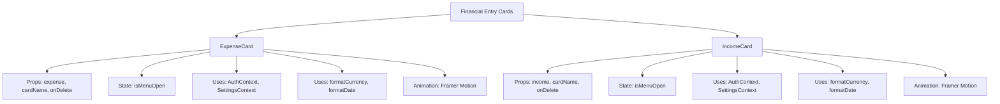
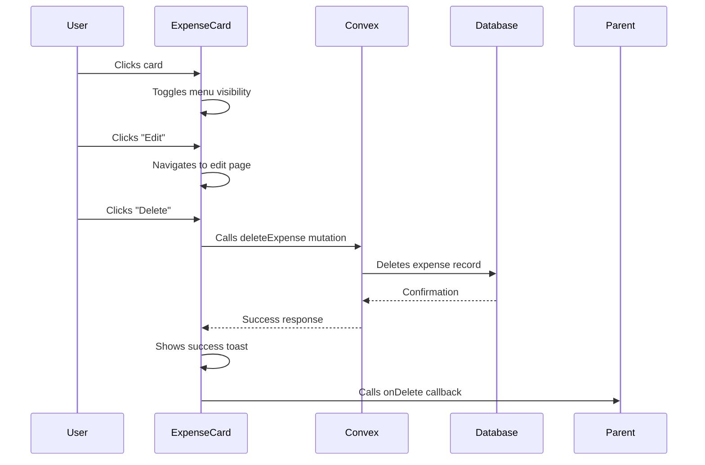
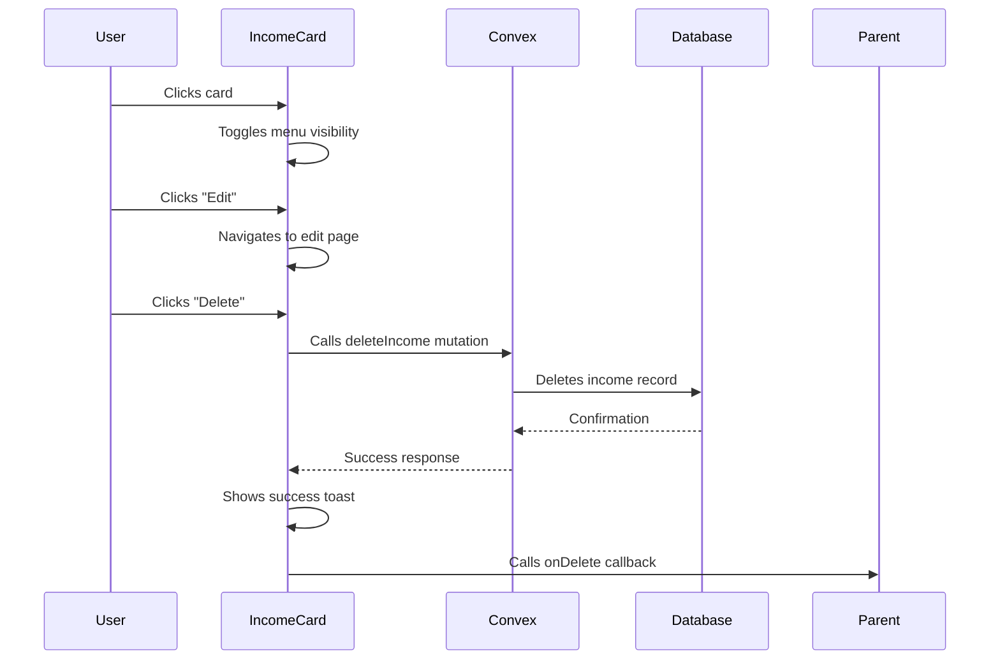
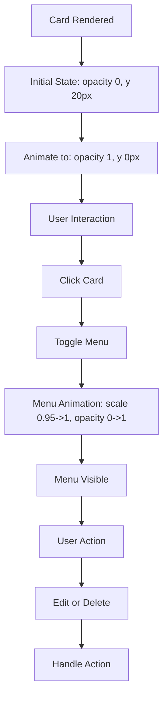
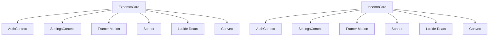

# Card Components - Financial Entry Displays

<cite>
**Referenced Files in This Document**   
- [ExpenseCard.tsx](file://src/components/cards/ExpenseCard.tsx)
- [IncomeCard.tsx](file://src/components/cards/IncomeCard.tsx)
- [expense.ts](file://src/features/dashboard/types/expense.ts)
- [cardsAndIncome.ts](file://convex/cardsAndIncome.ts)
- [expenses.ts](file://convex/expenses.ts)
- [formatters.ts](file://src/lib/formatters.ts)
- [SettingsContext.tsx](file://src/contexts/SettingsContext.tsx)
- [dataModel.d.ts](file://convex/_generated/dataModel.d.ts)
- [page.tsx](file://src/app/expenses/page.tsx)
- [page.tsx](file://src/app/income/page.tsx)
</cite>

## Table of Contents
1. [Introduction](#introduction)
2. [Component Overview](#component-overview)
3. [ExpenseCard Implementation](#expensecard-implementation)
4. [IncomeCard Implementation](#incomecard-implementation)
5. [Data Models and Type Definitions](#data-models-and-type-definitions)
6. [Styling and Responsive Design](#styling-and-responsive-design)
7. [Usage Examples](#usage-examples)
8. [Event Handling and User Interactions](#event-handling-and-user-interactions)
9. [Accessibility Considerations](#accessibility-considerations)
10. [Theming and Internationalization](#theming-and-internationalization)
11. [Integration and Dependencies](#integration-and-dependencies)
12. [Best Practices for Extension](#best-practices-for-extension)

## Introduction
This document provides comprehensive documentation for the card components used to display financial entries in the Expense Tracker application. The components are designed to present expense and income data in a consistent, interactive, and user-friendly manner. These cards serve as the primary interface for viewing and managing financial transactions across various application views including expense lists, income records, and dashboards.

The card components follow a consistent design pattern while adapting to the specific requirements of expenses (negative values) and income (positive values). They incorporate modern React patterns including client-side rendering, state management, and animation for enhanced user experience. The components are built with accessibility, responsiveness, and theming in mind, ensuring a consistent experience across different devices and user preferences.

**Section sources**
- [ExpenseCard.tsx](file://src/components/cards/ExpenseCard.tsx)
- [IncomeCard.tsx](file://src/components/cards/IncomeCard.tsx)

## Component Overview
The financial entry display system consists of two primary components: `ExpenseCard` and `IncomeCard`. Both components share a similar structure and interaction pattern while differing in their data presentation to reflect the nature of the financial transaction. These components are located in the `src/components/cards/` directory and are designed to be reusable across different parts of the application.

The card components display key financial information including the transaction amount, category, date, and associated metadata such as the card name used for the transaction. Each card features an interactive menu that appears when the card is clicked, providing options to edit or delete the financial entry. The components leverage several technologies including Framer Motion for animations, Convex for data operations, and Tailwind CSS for styling.

Both components follow the same architectural pattern: they accept props containing the financial data and callback functions, manage local state for the menu visibility, and handle user interactions through event handlers. They also integrate with application contexts for authentication and user settings, ensuring that the displayed data respects user preferences for currency and calendar systems.



**Diagram sources**
- [ExpenseCard.tsx](file://src/components/cards/ExpenseCard.tsx)
- [IncomeCard.tsx](file://src/components/cards/IncomeCard.tsx)

## ExpenseCard Implementation

### Props Interface
The `ExpenseCard` component accepts the following props through the `ExpenseCardProps` interface:

```typescript
interface ExpenseCardProps {
  expense: Doc<"expenses">;
  cardName: string;
  onDelete: () => void;
}
```

- **expense**: A document from the "expenses" collection containing all the details of the expense transaction
- **cardName**: The display name of the card associated with this expense
- **onDelete**: A callback function that is called when the expense is successfully deleted, typically used to refresh the parent component's data

**Section sources**
- [ExpenseCard.tsx](file://src/components/cards/ExpenseCard.tsx#L14-L18)

### Component Structure and Logic
The `ExpenseCard` component implements a card-based interface for displaying expense information with interactive capabilities. The component uses several React hooks to manage state and side effects:

- `useState` manages the `isMenuOpen` state variable that controls the visibility of the action menu
- `useAuth` provides access to the user's authentication token
- `useSettings` retrieves the user's preferred currency and calendar settings
- `useRouter` enables navigation to the edit page
- `useMutation` connects to the Convex mutation for deleting expenses

The component handles two primary actions: editing and deleting expenses. When the user clicks on the card, the action menu toggles visibility. The edit action navigates to the expense edit page, while the delete action triggers a mutation to remove the expense from the database.



**Diagram sources**
- [ExpenseCard.tsx](file://src/components/cards/ExpenseCard.tsx#L20-L115)

### Rendering and Styling
The `ExpenseCard` renders expense information in a structured layout with the following elements:

- **Title**: Displayed in bold with optional "for" text in a lighter color
- **Card information**: Shows a credit card icon followed by the card name
- **Categories**: Rendered as multiple chips with gray background
- **Amount**: Displayed in red with a negative sign, formatted according to user settings
- **Date**: Displayed in a smaller font with gray color, formatted according to user calendar preference

The component uses Tailwind CSS for styling with a clean, modern design that includes shadows, rounded corners, and hover effects. The card has a white background with a subtle shadow to create depth in the interface.

**Section sources**
- [ExpenseCard.tsx](file://src/components/cards/ExpenseCard.tsx#L50-L115)

## IncomeCard Implementation

### Props Interface
The `IncomeCard` component accepts the following props through the `IncomeCardProps` interface:

```typescript
interface IncomeCardProps {
  income: Doc<"income">;
  cardName: string;
  onDelete: () => void;
}
```

- **income**: A document from the "income" collection containing all the details of the income transaction
- **cardName**: The display name of the card associated with this income
- **onDelete**: A callback function that is called when the income is successfully deleted, typically used to refresh the parent component's data

**Section sources**
- [IncomeCard.tsx](file://src/components/cards/IncomeCard.tsx#L14-L18)

### Component Structure and Logic
The `IncomeCard` component follows a similar pattern to `ExpenseCard` but is specialized for income entries. It uses the same set of React hooks and implements comparable functionality with minor differences:

- Uses `deleteIncome` mutation instead of `deleteExpense`
- Navigates to `/income/edit/[id]` instead of `/expenses/edit/[id]`
- Displays the amount with a positive sign in green color

The component's logic for handling authentication, displaying notifications, and managing the action menu state is identical to `ExpenseCard`, ensuring a consistent user experience across both financial types.



**Diagram sources**
- [IncomeCard.tsx](file://src/components/cards/IncomeCard.tsx#L20-L105)

### Rendering and Styling
The `IncomeCard` renders income information with visual distinctions from expenses:

- **Source**: Displayed as the primary title (equivalent to expense title)
- **Card information**: Shows a credit card icon followed by the card name
- **Category**: Rendered as a single chip with gray background
- **Amount**: Displayed in green with a positive sign, formatted according to user settings
- **Date**: Displayed in a smaller font with gray color, formatted according to user calendar preference

The styling is nearly identical to `ExpenseCard` to maintain UI consistency, with the primary visual difference being the color of the amount (green for income vs. red for expenses).

**Section sources**
- [IncomeCard.tsx](file://src/components/cards/IncomeCard.tsx#L50-L105)

## Data Models and Type Definitions

### Expense Data Model
The expense data model is defined in the dashboard types directory and includes the following structure:

```typescript
interface Expense {
  _id: Id<"expenses">;
  _creationTime: number;
  title: string;
  amount: number;
  category: string[];
  date: number;
  for?: string;
}
```

The model supports multiple categories and an optional "for" field to indicate who the expense was for. The date is stored as a Unix timestamp (milliseconds since epoch).

**Section sources**
- [expense.ts](file://src/features/dashboard/types/expense.ts#L3-L13)

### Income Data Model
The income data model is defined in the Convex schema and includes:

```typescript
// From Convex schema in cardsAndIncome.ts
{
  amount: number,
  cardId: Id<"cards">,
  date: number,
  source: string,
  category: string,
  notes: string,
  userId: Id<"users">,
  createdAt: number
}
```

Unlike expenses, income records have a single category and include optional notes. The source field serves as the primary descriptor (equivalent to the title in expenses).

**Section sources**
- [cardsAndIncome.ts](file://convex/cardsAndIncome.ts#L70-L77)

### Document Type System
The application uses Convex's type system to provide type safety for database operations. The `Doc` type is a generic type that represents a document from a specific table:

```typescript
type Doc<TableName extends TableNames> = DocumentByName<DataModel, TableName>;
```

This allows components to specify exactly which type of document they expect, enabling TypeScript to provide accurate type checking and IntelliSense support.

**Section sources**
- [dataModel.d.ts](file://convex/_generated/dataModel.d.ts#L30-L35)

## Styling and Responsive Design

### Tailwind CSS Implementation
Both card components use Tailwind CSS for styling, following a utility-first approach. Key styling features include:

- **Layout**: Flexbox for responsive layout with `flex`, `justify-between`, and `items-start` classes
- **Typography**: Consistent text sizing with `text-md`, `text-sm`, and `text-xs` classes
- **Colors**: Semantic color usage with `text-red-500` for expenses and `text-green-500` for income
- **Spacing**: Consistent padding and margins with `p-4`, `mt-2`, `pr-4`, etc.
- **Borders and Shadows**: `rounded-lg`, `shadow-sm`, and `border-gray-100` for visual depth

The components are designed to be responsive, automatically adjusting their layout on different screen sizes without requiring media queries.

### Animation and Transitions
The components use Framer Motion for smooth animations:

- **Card appearance**: Initial fade-in and slide-up animation when cards are rendered
- **Menu transitions**: Smooth scale and opacity transitions for the action menu
- **Interactive feedback**: Cursor pointer and hover effects for better user feedback

The animations enhance the user experience by providing visual feedback and making the interface feel more dynamic and responsive.



**Diagram sources**
- [ExpenseCard.tsx](file://src/components/cards/ExpenseCard.tsx#L50-L54)
- [IncomeCard.tsx](file://src/components/cards/IncomeCard.tsx#L50-L54)

## Usage Examples

### In Expenses List
The `ExpenseCard` is used in the expenses page to display a list of expense records:

```tsx
{(expenses as Doc<"expenses">[]).map((expense) => (
  <ExpenseCard 
    key={expense._id} 
    expense={expense} 
    cardName={cardMap[expense.cardId!] || 'Unknown Card'}
    onDelete={refetch}
  />
))}
```

The component receives the expense data, the associated card name from a lookup map, and a callback to refresh the data after deletion.

**Section sources**
- [page.tsx](file://src/app/expenses/page.tsx#L312-L318)

### In Income List
The `IncomeCard` is used in the income page similarly:

```tsx
{(income as Doc<"income">[]).map((incomeRecord) => (
  <IncomeCard
    key={incomeRecord._id}
    income={incomeRecord}
    cardName={cardMap[incomeRecord.cardId] || 'Unknown Card'}
    onDelete={refetch}
  />
))}
```

The usage pattern is identical, demonstrating the consistent API design between the two components.

**Section sources**
- [page.tsx](file://src/app/income/page.tsx#L277-L283)

## Event Handling and User Interactions

### Click Handlers
Both components implement similar event handling patterns:

- **Card click**: Toggles the visibility of the action menu
- **Edit button click**: Navigates to the edit page for the financial entry
- **Delete button click**: Initiates the deletion process with confirmation feedback

The event handlers use `e.stopPropagation()` to prevent the card click event from triggering when the user interacts with the action menu, ensuring predictable behavior.

### Mutation Handling
The components handle mutations with proper error handling and user feedback:

- **Authentication check**: Verifies the user is authenticated before proceeding
- **Loading state**: Not visible but handled through the mutation system
- **Success feedback**: Uses toast notifications to confirm successful operations
- **Error handling**: Displays error messages and logs to console

The mutation system is integrated with Convex, providing automatic optimistic updates and error handling.

**Section sources**
- [ExpenseCard.tsx](file://src/components/cards/ExpenseCard.tsx#L28-L48)
- [IncomeCard.tsx](file://src/components/cards/IncomeCard.tsx#L28-L48)

## Accessibility Considerations

### ARIA and Semantic HTML
While the current implementation could be enhanced for accessibility, the components use semantic HTML elements:

- **Headings**: `h3` element for the primary title
- **Buttons**: Proper button elements for interactive actions
- **Icons**: Decorative icons with appropriate styling

The components could benefit from additional accessibility features such as ARIA labels, keyboard navigation support, and focus management.

### Keyboard Navigation
Currently, the components rely primarily on mouse/touch interactions. For improved accessibility, the following enhancements could be implemented:

- **Focus management**: Ensure the card and menu items are focusable
- **Keyboard shortcuts**: Support Enter/Space for toggling the menu and actions
- **Tab navigation**: Ensure logical tab order through the interface

These improvements would make the components more accessible to users who rely on keyboard navigation or screen readers.

## Theming and Internationalization

### Currency Formatting
The components integrate with the formatting utilities to display currency according to user preferences:

```typescript
formatCurrency(expense.amount, settings.currency)
```

The `formatCurrency` function supports multiple currencies (USD, EUR, GBP, IRR) with appropriate symbols and formatting.

**Section sources**
- [formatters.ts](file://src/lib/formatters.ts#L10-L22)

### Calendar System Support
The components support multiple calendar systems through the `formatDate` function:

```typescript
formatDate(expense.date, settings.calendar, 'MMM d, yyyy')
```

This allows users to view dates in either Gregorian or Jalali (Persian) calendar systems based on their preferences.

**Section sources**
- [formatters.ts](file://src/lib/formatters.ts#L24-L47)

### User Settings Integration
The components integrate with the `SettingsContext` to retrieve user preferences:

```typescript
const { settings } = useSettings();
```

This ensures that financial data is displayed according to the user's chosen currency and calendar system, providing a personalized experience.

**Section sources**
- [SettingsContext.tsx](file://src/contexts/SettingsContext.tsx)

## Integration and Dependencies

### Context Dependencies
Both components depend on two application contexts:

- **AuthContext**: Provides authentication token for secure operations
- **SettingsContext**: Provides user preferences for currency and calendar

These contexts are consumed using the `useAuth` and `useSettings` hooks, allowing the components to access shared application state.

### External Dependencies
The components rely on several external libraries:

- **Framer Motion**: For animations and transitions
- **Sonner**: For toast notifications
- **Lucide React**: For SVG icons
- **Convex**: For data operations and real-time updates

These dependencies are imported at the top of each component file and used throughout the implementation.



**Diagram sources**
- [ExpenseCard.tsx](file://src/components/cards/ExpenseCard.tsx#L1-L12)
- [IncomeCard.tsx](file://src/components/cards/IncomeCard.tsx#L1-L12)

## Best Practices for Extension

### Creating New Financial Types
To create additional financial card components, follow these guidelines:

1. **Consistent Props Pattern**: Use a similar props interface with the financial data, display name, and callback
2. **Shared Styling**: Reuse the same Tailwind CSS classes for visual consistency
3. **Standard Interactions**: Implement the same click-to-edit and delete patterns
4. **Animation Consistency**: Use the same Framer Motion patterns for transitions
5. **Context Integration**: Connect to the same authentication and settings contexts

### Component Reuse Opportunities
The similarities between `ExpenseCard` and `IncomeCard` suggest opportunities for refactoring:

- **BaseCard Component**: Create a base component that handles common functionality
- **Type-Specific Variants**: Extend the base component with type-specific rendering
- **Configuration Props**: Use props to control color scheme, sign display, and other visual differences

This approach would reduce code duplication and make future maintenance easier.

### Performance Optimization
Consider the following optimizations for large lists:

- **Virtualization**: Implement windowing for long lists of financial entries
- **Memoization**: Use `React.memo` to prevent unnecessary re-renders
- **Lazy Loading**: Load images or heavy content only when visible
- **Batch Updates**: Group multiple state updates for better performance

These optimizations would improve the user experience when dealing with large volumes of financial data.