# Components - Reusable UI Elements

<cite>
**Referenced Files in This Document**   
- [ExpenseCard.tsx](file://src/components/cards/ExpenseCard.tsx)
- [IncomeCard.tsx](file://src/components/cards/IncomeCard.tsx)
- [SmartSelectInput.tsx](file://src/components/SmartSelectInput.tsx)
- [CustomDatePicker.tsx](file://src/components/CustomDatePicker.tsx)
- [ProtectedRoute.tsx](file://src/components/ProtectedRoute.tsx)
- [OfflineBanner.tsx](file://src/components/OfflineBanner.tsx)
- [NetworkStatusIndicator.tsx](file://src/components/NetworkStatusIndicator.tsx)
- [HeaderRow.tsx](file://src/components/HeaderRow.tsx)
- [DateFilterHeader.tsx](file://src/components/DateFilterHeader.tsx)
- [BottomNav.tsx](file://src/components/BottomNav.tsx)
- [AuthContext.tsx](file://src/contexts/AuthContext.tsx)
- [SettingsContext.tsx](file://src/contexts/SettingsContext.tsx)
- [OfflineContext.tsx](file://src/contexts/OfflineContext.tsx)
- [formatters.ts](file://src/lib/formatters.ts)
</cite>

## Table of Contents
1. [Introduction](#introduction)
2. [Card Components](#card-components)
3. [Form Controls](#form-controls)
4. [Utility Components](#utility-components)
5. [Layout Components](#layout-components)
6. [Navigation Components](#navigation-components)
7. [Context Integration](#context-integration)
8. [Styling and Accessibility](#styling-and-accessibility)
9. [Component Composition Guidelines](#component-composition-guidelines)

## Introduction
The components/ directory contains all reusable UI elements for the Expense Tracker application. These components are designed to be modular, accessible, and responsive, following a consistent design system powered by Tailwind CSS. The architecture emphasizes separation of concerns, with distinct categories for cards, form controls, utility components, layout helpers, and navigation elements. Each component integrates with context providers for authentication, settings, and offline status management, ensuring consistent behavior across the application.

**Section sources**
- [ExpenseCard.tsx](file://src/components/cards/ExpenseCard.tsx#L1-L115)
- [IncomeCard.tsx](file://src/components/cards/IncomeCard.tsx#L1-L106)

## Card Components

### ExpenseCard
The ExpenseCard component displays individual expense entries with interactive functionality. It presents expense details including title, associated card name, categories, amount (formatted in red), and date. The component features a tap-to-reveal menu with Edit and Delete actions, animated using Framer Motion for smooth transitions.

**Props Interface**
```typescript
interface ExpenseCardProps {
  expense: Doc<"expenses">;
  cardName: string;
  onDelete: () => void;
}
```

**Key Features**
- **Interactive Menu**: Tapping the card reveals a dropdown menu with Edit and Delete options
- **Currency Formatting**: Amounts are formatted according to user settings via `formatCurrency`
- **Date Formatting**: Dates are displayed according to user's calendar preference (Gregorian or Jalali)
- **Authentication Integration**: Uses `useAuth` to ensure valid token before deletion
- **Mutation Handling**: Uses Convex mutation to delete expenses with error handling and toast notifications

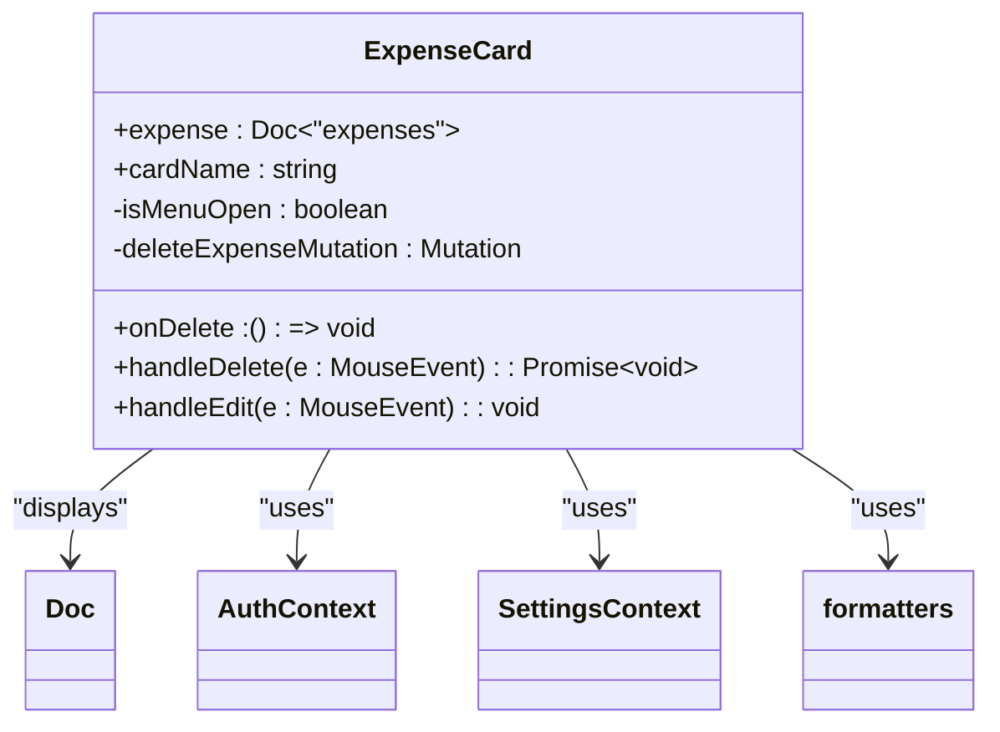

**Diagram sources**
- [ExpenseCard.tsx](file://src/components/cards/ExpenseCard.tsx#L1-L115)

**Section sources**
- [ExpenseCard.tsx](file://src/components/cards/ExpenseCard.tsx#L1-L115)

### IncomeCard
The IncomeCard component displays individual income entries with similar interactive functionality to ExpenseCard. It presents income details including source, associated card name, category, amount (formatted in green), and date. The component shares the same interactive menu pattern with Edit and Delete actions.

**Props Interface**
```typescript
interface IncomeCardProps {
  income: Doc<"income">;
  cardName: string;
  onDelete: () => void;
}
```

**Key Features**
- **Positive Amount Display**: Income amounts are displayed with a green "+" prefix
- **Category Display**: Single category tag (unlike ExpenseCard which supports multiple categories)
- **Source Field**: Displays income source rather than title
- **Shared Patterns**: Uses identical animation, menu, and interaction patterns as ExpenseCard
- **Context Integration**: Integrates with same context providers and formatting utilities

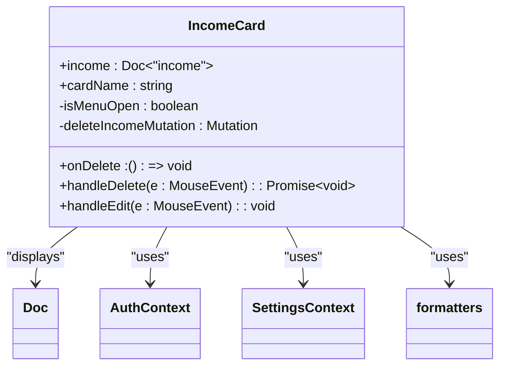

**Diagram sources**
- [IncomeCard.tsx](file://src/components/cards/IncomeCard.tsx#L1-L106)

**Section sources**
- [IncomeCard.tsx](file://src/components/cards/IncomeCard.tsx#L1-L106)

## Form Controls

### SmartSelectInput
The SmartSelectInput component provides an enhanced select input with dynamic suggestions, multiple selection support, and optional creation of new items. It's designed for scenarios where users need to select from existing options or create new ones on the fly.

**Props Interface**
```typescript
interface SmartSelectInputProps {
  name: string;
  label: string;
  multiple?: boolean;
  value: string[];
  onChange: (newItems: string[]) => void;
  fetchSuggestions: (query: string) => Promise<string[]>;
  onCreateNew?: (value: string) => Promise<void>;
  formatNewItem?: (value: string) => string;
  placeholder?: string;
  className?: string;
}
```

**Key Features**
- **Debounced Search**: Uses `useDebounce` hook to delay API calls while typing
- **Dynamic Suggestions**: Fetches suggestions based on current input value
- **Multiple Selection**: Supports multiple selected items with removable chips
- **New Item Creation**: Optional ability to create new items not in suggestions
- **Keyboard Navigation**: Full keyboard support including arrow keys, Enter, and Escape
- **Active Index Highlighting**: Visual indication of currently focused suggestion

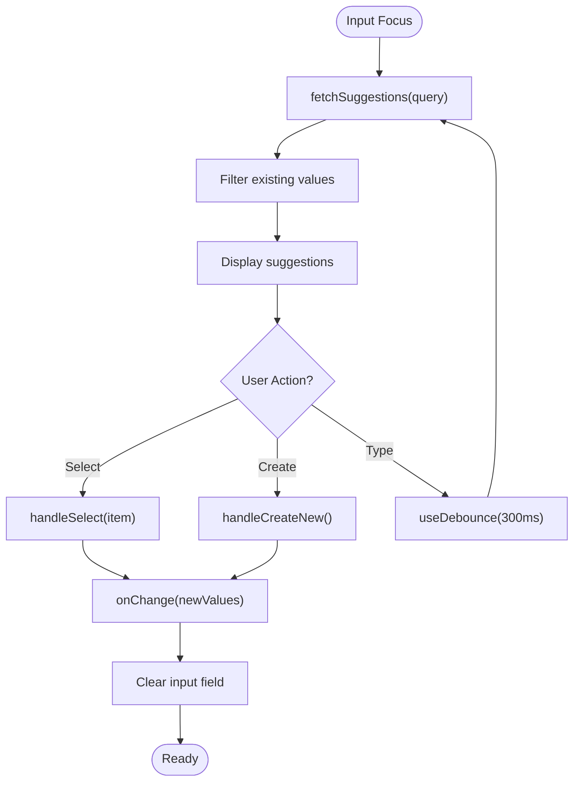

**Diagram sources**
- [SmartSelectInput.tsx](file://src/components/SmartSelectInput.tsx#L1-L199)

**Section sources**
- [SmartSelectInput.tsx](file://src/components/SmartSelectInput.tsx#L1-L199)

### CustomDatePicker
The CustomDatePicker component provides a calendar-based date input that adapts to the user's preferred calendar system (Gregorian or Jalali). It integrates with the SettingsContext to respect user preferences.

**Props Interface**
```typescript
interface CustomDatePickerProps {
  value: string; // Expects date in "YYYY-MM-DD" format
  onChange: (date: string) => void;
  label: string;
}
```

**Key Features**
- **Calendar System Support**: Supports both Gregorian and Jalali calendars based on user settings
- **Stable Date References**: Uses useRef to maintain stable DateObject references
- **Format Conversion**: Automatically converts between calendar systems while preserving date values
- **Accessibility**: Includes proper labeling and focus management
- **Visual Feedback**: Displays calendar icon in the label for visual recognition

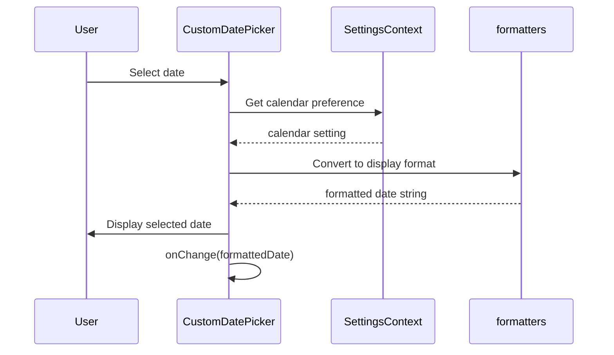

**Diagram sources**
- [CustomDatePicker.tsx](file://src/components/CustomDatePicker.tsx#L1-L70)

**Section sources**
- [CustomDatePicker.tsx](file://src/components/CustomDatePicker.tsx#L1-L70)

## Utility Components

### ProtectedRoute
The ProtectedRoute component serves as an authentication guard for routes that require user login. It redirects unauthenticated users to the login page while displaying a loading state during authentication checks.

**Props Interface**
```typescript
interface ProtectedRouteProps {
  children: React.ReactNode;
}
```

**Key Features**
- **Authentication Check**: Uses `useAuth` to verify user authentication status
- **Loading State**: Displays loading indicator while authentication state is being determined
- **Automatic Redirection**: Redirects unauthenticated users to login page
- **Null Rendering**: Returns null when user is not authenticated (after loading)
- **Navigation Integration**: Uses Next.js router for programmatic navigation

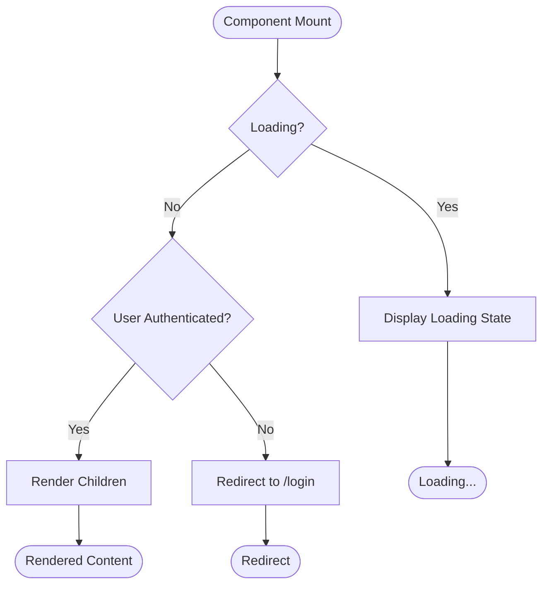

**Diagram sources**
- [ProtectedRoute.tsx](file://src/components/ProtectedRoute.tsx#L1-L34)

**Section sources**
- [ProtectedRoute.tsx](file://src/components/ProtectedRoute.tsx#L1-L34)

### OfflineBanner
The OfflineBanner component displays a persistent notification when the application is offline, showing the number of pending expenses that will sync when connectivity is restored.

**Key Features**
- **Conditional Rendering**: Only displays when `isOnline` is false
- **Pending Count**: Shows the number of expenses waiting to be synced
- **Pluralization**: Properly handles singular/plural forms ("expense" vs "expenses")
- **Visual Indicators**: Includes warning icon for immediate recognition
- **Context Integration**: Uses `useOffline` to monitor network status

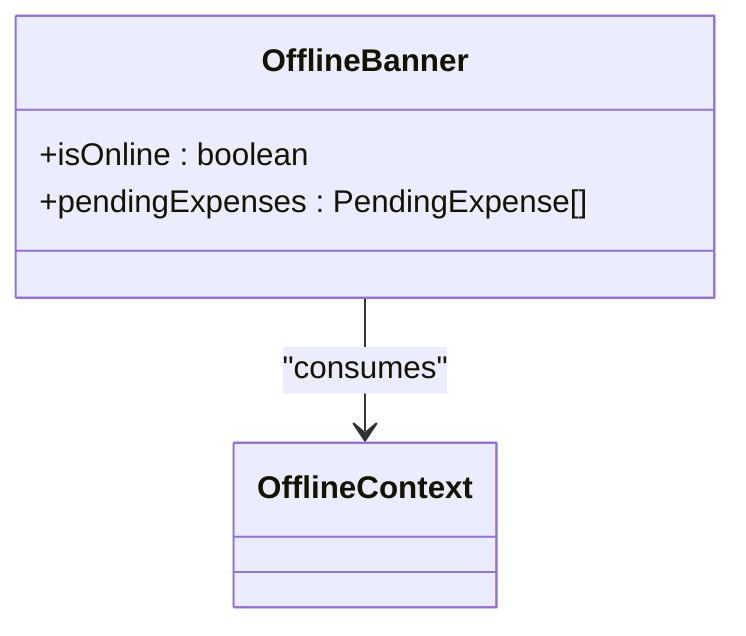

**Diagram sources**
- [OfflineBanner.tsx](file://src/components/OfflineBanner.tsx#L1-L26)

**Section sources**
- [OfflineBanner.tsx](file://src/components/OfflineBanner.tsx#L1-L26)

### NetworkStatusIndicator
The NetworkStatusIndicator component provides a subtle, persistent visual indicator of the application's network status in the top-right corner of the screen.

**Key Features**
- **Positioning**: Fixed positioning in top-right corner with high z-index
- **Color Coding**: Green for online, red for offline
- **Animation**: Smooth entrance and exit animations using Framer Motion
- **Tooltip**: Title attribute provides text description on hover
- **Minimal Design**: Small circular indicator that doesn't distract from content

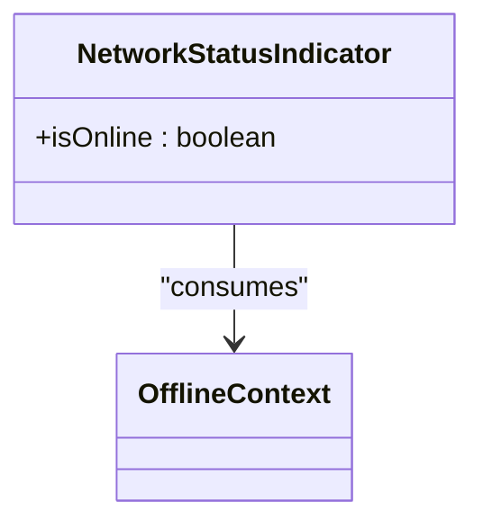

**Diagram sources**
- [NetworkStatusIndicator.tsx](file://src/components/NetworkStatusIndicator.tsx#L1-L22)

**Section sources**
- [NetworkStatusIndicator.tsx](file://src/components/NetworkStatusIndicator.tsx#L1-L22)

## Layout Components

### HeaderRow
The HeaderRow component provides a consistent header layout across pages, designed with mobile-first principles. It features a fixed position with proper spacing and alignment.

**Props Interface**
```typescript
interface HeaderRowProps {
  left: React.ReactNode;
  right?: React.ReactNode;
  className?: string;
}
```

**Key Features**
- **Fixed Positioning**: Stays at the top of the viewport during scrolling
- **Responsive Design**: Optimized for mobile screens with max-width constraint
- **Flexible Content**: Accepts arbitrary React nodes for left and right sections
- **Consistent Spacing**: Enforces 8px gap between items on the left side
- **Visual Hierarchy**: Includes border and shadow for separation from content

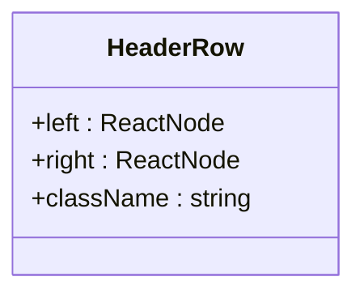

**Diagram sources**
- [HeaderRow.tsx](file://src/components/HeaderRow.tsx#L1-L38)

**Section sources**
- [HeaderRow.tsx](file://src/components/HeaderRow.tsx#L1-L38)

### DateFilterHeader
The DateFilterHeader component provides month navigation controls with a centered title, commonly used in calendar and reporting views.

**Props Interface**
```typescript
interface DateFilterHeaderProps {
  currentDate: Date;
  onPreviousMonth: () => void;
  onNextMonth: () => void;
  title: string;
}
```

**Key Features**
- **Month Navigation**: Previous and next month buttons with chevron icons
- **Animated Buttons**: Framer Motion provides tap feedback
- **Dynamic Title**: Month and year display adapts to user's calendar preference
- **Consistent Styling**: Card-like appearance with shadow and padding
- **Accessibility**: Proper aria-labels for navigation buttons

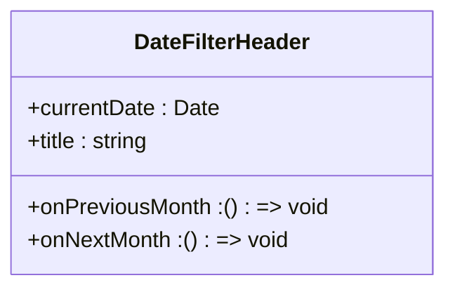

**Diagram sources**
- [DateFilterHeader.tsx](file://src/components/DateFilterHeader.tsx#L1-L49)

**Section sources**
- [DateFilterHeader.tsx](file://src/components/DateFilterHeader.tsx#L1-L49)

## Navigation Components

### BottomNav
The BottomNav component serves as the primary mobile navigation bar, providing access to key application sections with icon-based navigation.

**Key Features**
- **Mobile-Only Display**: Uses `md:hidden` to hide on medium and larger screens
- **Fixed Positioning**: Stays at the bottom of the viewport
- **Active State Indication**: Blue text color for the currently active page
- **Icon + Text Labels**: Combines visual icons with text labels for clarity
- **Motion Feedback**: Framer Motion provides tap animation feedback
- **Responsive Sizing**: Ensures minimum touch target size of 44px

```mermaid
classDiagram
class BottomNav {
+pathname : string
+navItems : Array<{ href, icon, label }>
}
BottomNav --> usePathname : "determines active state"
```

**Diagram sources**
- [BottomNav.tsx](file://src/components/BottomNav.tsx#L1-L58)

**Section sources**
- [BottomNav.tsx](file://src/components/BottomNav.tsx#L1-L58)

## Context Integration

### Authentication Context
Components integrate with AuthContext for authentication state management. The context provides:
- **User State**: Current user information or null if not authenticated
- **Token Management**: Authentication token for API requests
- **Loading State**: Indicates when authentication status is being determined
- **Authentication Actions**: Login, register, and logout functions

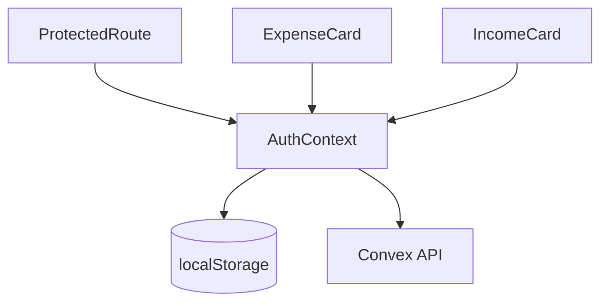

**Diagram sources**
- [AuthContext.tsx](file://src/contexts/AuthContext.tsx#L1-L95)

**Section sources**
- [AuthContext.tsx](file://src/contexts/AuthContext.tsx#L1-L95)

### Settings Context
Components use SettingsContext to respect user preferences for:
- **Currency Display**: Formatting amounts with appropriate symbols
- **Calendar System**: Displaying dates in Gregorian or Jalali format
- **Localization**: Adapting date and number formatting to user preferences

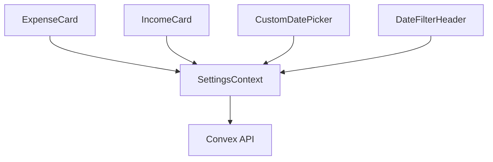

**Diagram sources**
- [SettingsContext.tsx](file://src/contexts/SettingsContext.tsx#L1-L56)

**Section sources**
- [SettingsContext.tsx](file://src/contexts/SettingsContext.tsx#L1-L56)

### Offline Context
The OfflineContext enables offline functionality across components:
- **Network Status**: Real-time monitoring of online/offline status
- **Pending Operations**: Queue for expenses created while offline
- **Sync Management**: Automatic and manual synchronization of pending data
- **Local Storage**: Persists pending expenses using localForage

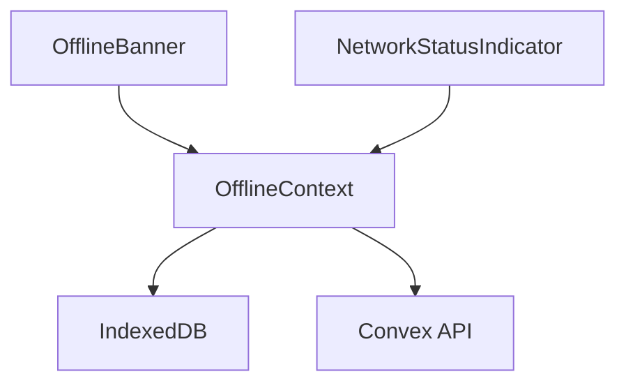

**Diagram sources**
- [OfflineContext.tsx](file://src/contexts/OfflineContext.tsx#L1-L170)

**Section sources**
- [OfflineContext.tsx](file://src/contexts/OfflineContext.tsx#L1-L170)

## Styling and Accessibility

### Tailwind CSS Implementation
All components use Tailwind CSS for styling with the following patterns:
- **Consistent Spacing**: Uses Tailwind's spacing scale (p-4, m-2, gap-2, etc.)
- **Color Palette**: Leverages gray, blue, red, green, and orange shades for semantic meaning
- **Responsive Design**: Mobile-first approach with appropriate breakpoints
- **Focus States**: Includes focus-within:ring utilities for keyboard navigation
- **Hover States**: Provides visual feedback on interactive elements

### Accessibility Features
Components implement accessibility best practices:
- **Semantic HTML**: Proper use of labels, buttons, and ARIA attributes
- **Keyboard Navigation**: Full keyboard support for all interactive elements
- **Screen Reader Support**: ARIA labels and proper document structure
- **Color Contrast**: Sufficient contrast ratios for text and interactive elements
- **Focus Management**: Proper focus handling for modals and dropdowns

## Component Composition Guidelines

### Creating New Components
When creating new components, follow these guidelines:
1. **Directory Structure**: Place components in appropriate subdirectories (e.g., cards/, forms/)
2. **File Naming**: Use PascalCase for component files (e.g., UserProfileCard.tsx)
3. **Props Typing**: Define explicit interfaces for component props
4. **Context Usage**: Leverage existing context providers rather than creating new ones
5. **Styling**: Use Tailwind CSS classes directly in JSX
6. **Animation**: Use Framer Motion for transitions and interactions

### Composing Existing Components
To maintain consistency, compose existing components when possible:
- **Card Patterns**: Extend ExpenseCard or IncomeCard for similar data displays
- **Form Controls**: Use SmartSelectInput as a base for enhanced select components
- **Layout**: Utilize HeaderRow and DateFilterHeader for consistent headers
- **Utility**: Leverage ProtectedRoute for authentication-gated content
- **Feedback**: Use OfflineBanner and NetworkStatusIndicator for connectivity status

### Best Practices
- **Reusability**: Design components to be as generic and reusable as possible
- **Single Responsibility**: Each component should have a single, well-defined purpose
- **Performance**: Use React.memo and useCallback where appropriate
- **Testing**: Components should be easily testable in isolation
- **Documentation**: Include JSDoc comments for props and complex logic