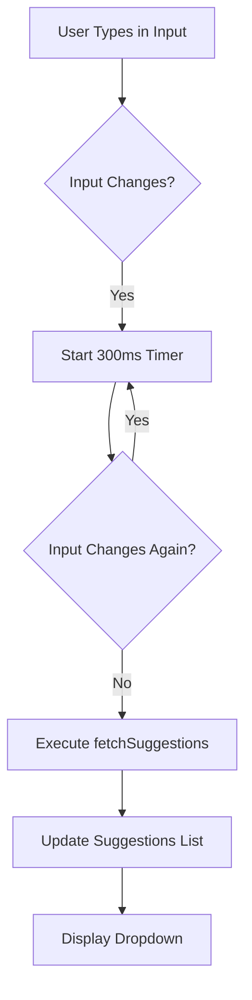
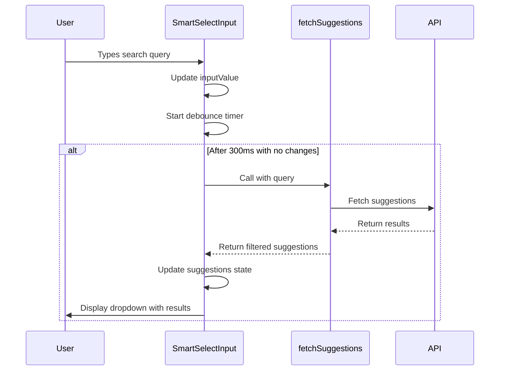
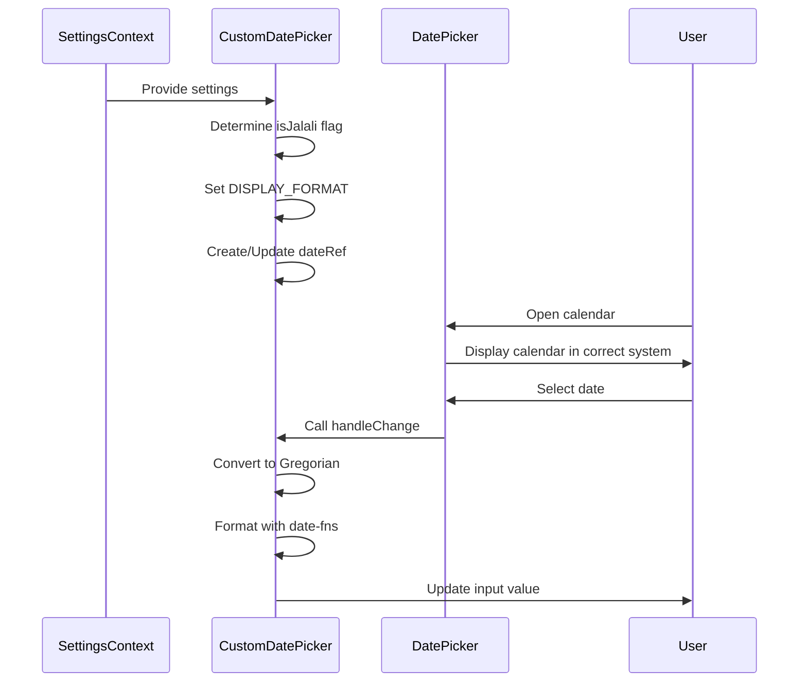
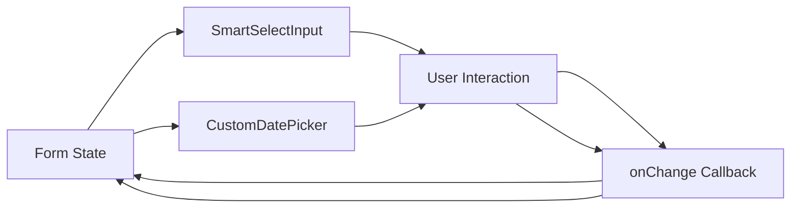
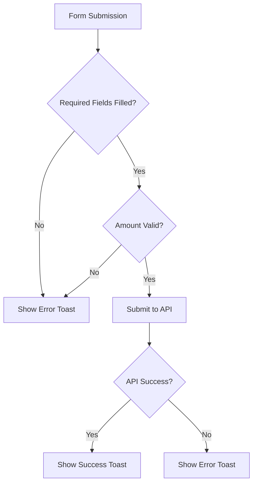

# Form Controls - Interactive Input Components

<cite>
**Referenced Files in This Document**   
- [SmartSelectInput.tsx](file://src/components/SmartSelectInput.tsx)
- [CustomDatePicker.tsx](file://src/components/CustomDatePicker.tsx)
- [useDebounce.ts](file://src/hooks/useDebounce.ts)
- [SettingsContext.tsx](file://src/contexts/SettingsContext.tsx)
- [expenses/page.tsx](file://src/app/expenses/page.tsx)
- [expenses/edit/[id]/page.tsx](file://src/app/expenses/edit/[id]/page.tsx)
- [income/edit/[id]/page.tsx](file://src/app/income/edit/[id]/page.tsx)
- [settings/page.tsx](file://src/app/settings/page.tsx)
- [package.json](file://package.json)
</cite>

## Table of Contents
1. [SmartSelectInput Component](#smartselectinput-component)
2. [CustomDatePicker Component](#customdatepicker-component)
3. [Integration with React Hook Form](#integration-with-react-hook-form)
4. [Best Practices for Form Composition](#best-practices-for-form-composition)
5. [Accessibility Features](#accessibility-features)
6. [Responsive Behavior on Mobile Devices](#responsive-behavior-on-mobile-devices)

## SmartSelectInput Component

The SmartSelectInput component is a sophisticated, reusable form control designed for dynamic selection with filtering, asynchronous loading, and multi-select capabilities. It provides an enhanced user experience for selecting from large datasets while supporting the creation of new items on-the-fly.

### Props and Configuration

The component accepts the following props:

**SmartSelectInputProps**
- `name`: string - The input name attribute
- `label`: string - The visible label for the input
- `multiple`: boolean (optional, default: false) - Enables multi-select mode
- `value`: string[] - The currently selected values
- `onChange`: (newItems: string[]) => void - Callback for value changes
- `fetchSuggestions`: (query: string) => Promise<string[]> - Async function to fetch suggestions
- `onCreateNew`: (value: string) => Promise<void> (optional) - Callback for creating new items
- `formatNewItem`: (value: string) => string (optional) - Function to format newly created items
- `placeholder`: string (optional) - Placeholder text when no values are selected
- `className`: string (optional) - Additional CSS classes for styling

### Dynamic Selection and Filtering

SmartSelectInput implements intelligent filtering with debounced search queries to optimize performance and reduce unnecessary API calls. The component uses the `useDebounce` hook with a 300ms delay to wait for user input to stabilize before triggering the search.



**Section sources**
- [SmartSelectInput.tsx](file://src/components/SmartSelectInput.tsx#L20-L237)
- [useDebounce.ts](file://src/hooks/useDebounce.ts#L1-L17)

### Async Loading and State Management

The component manages several internal states to provide a responsive user interface:

- `inputValue`: Tracks the current text in the search input
- `suggestions`: Stores the filtered list of available options
- `isLoading`: Indicates when suggestions are being fetched
- `isDropdownVisible`: Controls the visibility of the suggestions dropdown
- `activeIndex`: Tracks keyboard navigation through suggestions

When the dropdown is visible and the debounced search term changes, the component calls the `fetchSuggestions` function and filters out any items already in the selected values.



**Section sources**
- [SmartSelectInput.tsx](file://src/components/SmartSelectInput.tsx#L45-L75)

### Multi-Select Support

The component fully supports both single and multi-select modes through the `multiple` prop. In multi-select mode, selected items are displayed as removable chips above the input field.

When a suggestion is selected:
- For single-select: The selection replaces any existing value and closes the dropdown
- For multi-select: The selection is added to the existing values and the input is cleared for additional selections

Selected items can be removed by clicking the X button on each chip or by using keyboard navigation (Backspace key when the input is empty).

### Creation of New Items

SmartSelectInput supports creating new items not found in the suggestions list. When `onCreateNew` is provided and the current input doesn't match any existing suggestions, a "Add '[input]'" option appears in the dropdown.

The `formatNewItem` function allows for preprocessing of new item values before creation, such as capitalizing words or formatting text. In the expense tracking forms, this is used with the `capitalizeWords` function to ensure consistent formatting.

```mermaid
flowchart TD
A[User Types Value] --> B{Value in Suggestions?}
B --> |Yes| C[Show as Selectable Option]
B --> |No| D{onCreateNew Provided?}
D --> |Yes| E[Show "Add '[value]'" Option]
E --> F{User Selects "Add" Option?}
F --> |Yes| G[Call onCreateNew with value]
G --> H[Add to Selected Values]
F --> |No| I[No Action]
```

**Section sources**
- [SmartSelectInput.tsx](file://src/components/SmartSelectInput.tsx#L130-L150)
- [expenses/page.tsx](file://src/app/expenses/page.tsx#L269-L281)

## CustomDatePicker Component

The CustomDatePicker component provides a calendar-based date input with support for multiple calendar systems and seamless integration with user settings.

### Date Library Integration

The component integrates with two key libraries:
- `react-multi-date-picker`: Provides the calendar UI and date selection functionality
- `date-fns`: Handles date formatting according to standardized patterns

The component also uses `react-date-object` for calendar system conversions, specifically supporting both Gregorian and Jalali (Persian) calendars.

```mermaid
classDiagram
class CustomDatePicker {
+value : string
+onChange : (date : string) => void
+label : string
-isJalali : boolean
-DISPLAY_FORMAT : string
-dateRef : RefObject
-handleChange(dateObj : DateObject) : void
}
class DatePicker {
+value : DateObject
+onChange : (dateObj : DateObject) => void
+format : string
+calendar : Calendar
+locale : Locale
}
class DateObject {
+convert(calendar : Calendar) : DateObject
+toDate() : Date
+format(format : string) : string
}
CustomDatePicker --> DatePicker : "uses"
CustomDatePicker --> DateObject : "creates"
DateObject --> "gregorian" : "calendar"
DateObject --> "persian" : "calendar"
```

**Diagram sources**
- [CustomDatePicker.tsx](file://src/components/CustomDatePicker.tsx#L1-L70)
- [package.json](file://package.json#L20-L22)

**Section sources**
- [CustomDatePicker.tsx](file://src/components/CustomDatePicker.tsx#L1-L70)

### Calendar UI and User Settings Integration

The component dynamically adapts to the user's preferred calendar system stored in the SettingsContext. When the calendar setting is "jalali", the component displays the Persian calendar; otherwise, it uses the Gregorian calendar.

The `useSettings` hook retrieves the user's preferences, and the component uses `useRef` to maintain a stable reference to the DateObject, preventing unnecessary re-renders.



**Section sources**
- [CustomDatePicker.tsx](file://src/components/CustomDatePicker.tsx#L10-L70)
- [SettingsContext.tsx](file://src/contexts/SettingsContext.tsx#L1-L57)

### Date Formatting and Output

The component ensures consistent date formatting in the application by:
1. Accepting input in "YYYY-MM-DD" format (Gregorian)
2. Converting to the appropriate calendar system for display
3. Converting back to Gregorian when a date is selected
4. Formatting the output using `date-fns` to ensure standard English digits

This approach guarantees that regardless of the user's calendar preference, the stored data remains consistent in the Gregorian system.

```typescript
// Example of date conversion process
const handleChange = (dateObj: DateObject | null) => {
  if (!dateObj) return;
  // Convert to Gregorian calendar
  const gregorianDate = dateObj.convert(gregorian);
  // Convert to JavaScript Date object
  const jsDate = gregorianDate.toDate();
  // Format with date-fns using standardized pattern
  onChange(formatDate(jsDate, "yyyy-MM-dd"));
};
```

## Integration with React Hook Form

While the components are designed to work with controlled state management, they can be effectively integrated with React Hook Form or similar form libraries.

### Controlled Component Pattern

Both SmartSelectInput and CustomDatePicker follow the controlled component pattern, making them compatible with form libraries:



**Section sources**
- [expenses/edit/[id]/page.tsx](file://src/app/expenses/edit/[id]/page.tsx#L326-L370)
- [income/edit/[id]/page.tsx](file://src/app/income/edit/[id]/page.tsx#L177-L205)

### Usage in Form Contexts

In the expense and income forms, these components are integrated by:
1. Maintaining form state in a central `formData` object
2. Passing the relevant field value to the component's `value` prop
3. Providing an `onChange` handler that updates the specific field in the form state

```typescript
// Example from expenses form
<SmartSelectInput
  name="category"
  label="Categories *"
  multiple
  value={formData.category}
  onChange={(newCategories) => setFormData({ ...formData, category: newCategories })}
  fetchSuggestions={fetchCategorySuggestions}
  onCreateNew={handleCreateCategory}
  formatNewItem={capitalizeWords}
  placeholder="Select or add categories"
/>
```

This pattern allows for seamless integration with validation logic and form submission handlers.

## Best Practices for Form Composition

### Composing Inputs in Forms

When composing forms with these interactive components, follow these best practices:

1. **Consistent Layout**: Use a consistent vertical layout with proper spacing between fields
2. **Required Field Indication**: Mark required fields with asterisks and validate accordingly
3. **Logical Grouping**: Group related fields together with appropriate spacing
4. **Clear Labels**: Use descriptive labels that clearly indicate the purpose of each field

### Handling User Interactions

#### SmartSelectInput
- Provide immediate visual feedback when suggestions are loading
- Highlight matching text in suggestions to show why items appear
- Allow keyboard navigation through suggestions (arrow keys, Enter, Escape)
- Support creation of new items with clear visual indication

#### CustomDatePicker
- Always display the calendar icon next to the label for visual recognition
- Ensure the calendar dropdown appears above other content (z-index)
- Provide clear visual feedback for the selected date
- Maintain consistent date formatting across the application

### Validation Patterns and Error States

The application implements client-side validation in form submission handlers:



Validation checks include:
- Required fields are not empty
- Amount is a valid positive number
- At least one category is selected
- Card is selected for expense/income

Error states are communicated through toast notifications rather than inline field validation, providing a non-intrusive user experience.

**Section sources**
- [expenses/edit/[id]/page.tsx](file://src/app/expenses/edit/[id]/page.tsx#L106-L147)
- [income/edit/[id]/page.tsx](file://src/app/income/edit/[id]/page.tsx#L83-L117)

## Accessibility Features

### Keyboard Navigation

Both components provide comprehensive keyboard navigation support:

#### SmartSelectInput
- **Arrow Down**: Opens dropdown and navigates to first suggestion
- **Arrow Up**: Navigates to previous suggestion
- **Enter**: Selects active suggestion or creates new item
- **Escape**: Closes dropdown
- **Backspace**: When input is empty and multiple=true, removes last selected item

#### CustomDatePicker
- The underlying react-multi-date-picker component provides standard keyboard navigation for calendar selection, including:
- Arrow keys to navigate days
- Page Up/Down to navigate months
- Home/End to navigate to start/end of week
- Ctrl+Page Up/Down to navigate years

### Screen Reader Support

The components include several accessibility features:

- **Proper Labeling**: All inputs have associated labels using the `for` attribute
- **ARIA Attributes**: The dropdown suggestions are properly structured for screen readers
- **Focus Management**: Focus is properly managed between input and dropdown
- **Visual Indicators**: Selected and active states are clearly visible

```mermaid
flowchart TD
A[Screen Reader] --> B[Reads Label]
B --> C[Input Field]
C --> D{User Activates Input}
D --> |Yes| E[Announces "Dropdown expanded"]
E --> F[Reads Suggestions Count]
F --> G[Reads Active Suggestion]
G --> H{User Navigates}
H --> |Yes| G
H --> |No| I[User Selects Item]
I --> J[Announces Selection]
```

**Section sources**
- [SmartSelectInput.tsx](file://src/components/SmartSelectInput.tsx#L152-L237)
- [CustomDatePicker.tsx](file://src/components/CustomDatePicker.tsx#L50-L70)

## Responsive Behavior on Mobile Devices

### Mobile-First Design

The components are designed with mobile devices in mind:

- **Touch Targets**: All interactive elements have a minimum size of 44px for easy tapping
- **Full-Width Layout**: Components expand to full width on mobile screens
- **Adaptive Dropdowns**: Dropdowns are positioned to remain visible on small screens
- **Mobile Keyboard**: Appropriate input types trigger the correct mobile keyboard

### SmartSelectInput on Mobile

On mobile devices, the SmartSelectInput component:
- Expands to full width of the container
- Displays suggestions in a scrollable list
- Uses the native touch interface for selection
- Provides adequate spacing between interactive elements

### CustomDatePicker on Mobile

The CustomDatePicker component on mobile:
- Displays a full-screen calendar interface when appropriate
- Uses large touch targets for date selection
- Maintains readability with appropriate font sizes
- Adapts the calendar layout to the screen orientation

The responsive behavior is achieved through Tailwind CSS utility classes that apply different styles based on screen size, ensuring optimal user experience across devices.

**Section sources**
- [SmartSelectInput.tsx](file://src/components/SmartSelectInput.tsx#L200-L237)
- [CustomDatePicker.tsx](file://src/components/CustomDatePicker.tsx#L60-L70)
- [expenses/page.tsx](file://src/app/expenses/page.tsx#L240-L351)