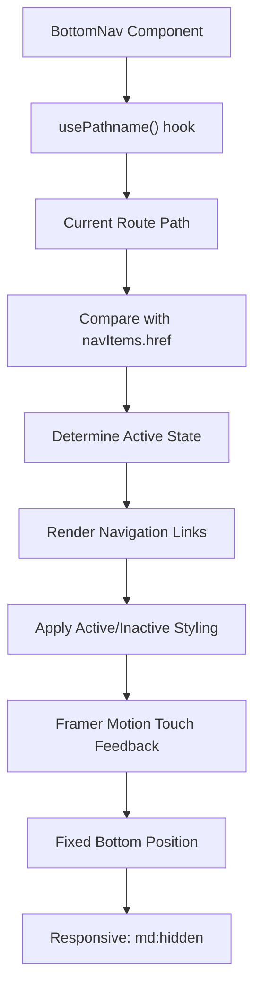
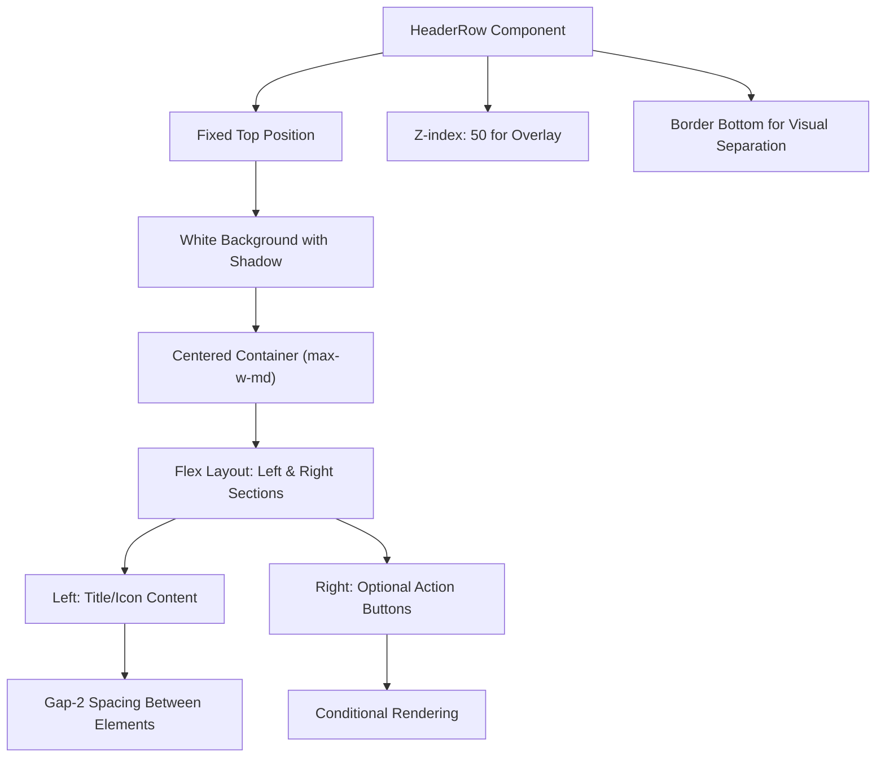
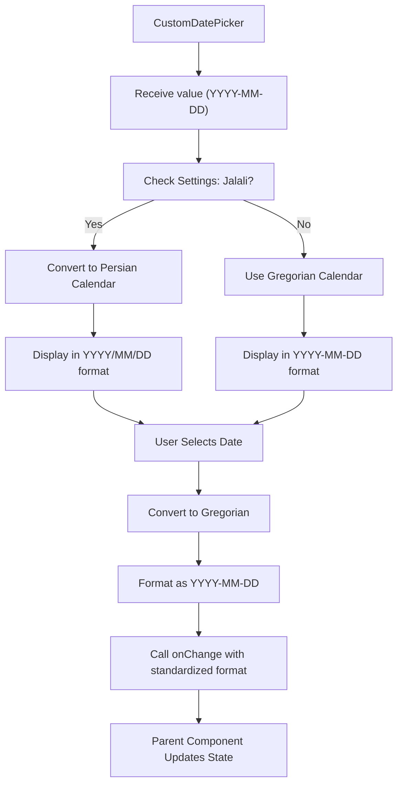
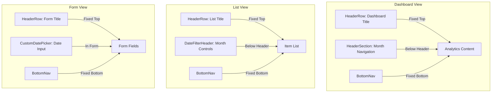

# Navigation & Layout Components

<cite>
**Referenced Files in This Document**   
- [BottomNav.tsx](file://src/components/BottomNav.tsx)
- [HeaderRow.tsx](file://src/components/HeaderRow.tsx)
- [DateFilterHeader.tsx](file://src/components/DateFilterHeader.tsx)
- [CustomDatePicker.tsx](file://src/components/CustomDatePicker.tsx)
- [page.tsx](file://src/app/dashboard/page.tsx)
- [page.tsx](file://src/app/expenses/page.tsx)
- [page.tsx](file://src/app/income/page.tsx)
- [page.tsx](file://src/app/settings/page.tsx)
</cite>

## Table of Contents
1. [Introduction](#introduction)
2. [Core Navigation and Layout Components](#core-navigation-and-layout-components)
3. [BottomNav Component Analysis](#bottomnav-component-analysis)
4. [HeaderRow Component Analysis](#headerrow-component-analysis)
5. [DateFilterHeader and CustomDatePicker Analysis](#datefilterheader-and-customdatepicker-analysis)
6. [Component Composition in Key Views](#component-composition-in-key-views)
7. [Theming, Accessibility, and Responsive Design](#theming-accessibility-and-responsive-design)
8. [Performance Considerations](#performance-considerations)

## Introduction
This document provides a comprehensive analysis of the navigation and layout utility components in the Expense Tracker application. These components—BottomNav, HeaderRow, DateFilterHeader, and CustomDatePicker—form the foundational structure for consistent user interface presentation across mobile and desktop views. The documentation details their implementation, integration with Next.js routing, responsive behavior, accessibility features, and performance characteristics, with examples of their composition in key application views such as the dashboard and list pages.

## Core Navigation and Layout Components
The navigation and layout system in this application is built around four primary components designed for mobile-first responsiveness and consistent user experience:

- **BottomNav**: A mobile-optimized bottom navigation bar with route-based active states
- **HeaderRow**: A fixed top header for consistent section titles and action buttons
- **DateFilterHeader**: A date range navigation component with month controls
- **CustomDatePicker**: A calendar input with support for multiple calendar systems

These components work together to provide a cohesive interface that adapts to different screen sizes and user preferences.

**Section sources**
- [BottomNav.tsx](file://src/components/BottomNav.tsx)
- [HeaderRow.tsx](file://src/components/HeaderRow.tsx)
- [DateFilterHeader.tsx](file://src/components/DateFilterHeader.tsx)
- [CustomDatePicker.tsx](file://src/components/CustomDatePicker.tsx)

## BottomNav Component Analysis
The BottomNav component implements a mobile-optimized navigation bar that appears fixed at the bottom of the screen on mobile devices (hidden on medium screens and larger via `md:hidden`).

### Functionality and Implementation
BottomNav uses Next.js App Router's `usePathname` hook to determine the active route and highlight the corresponding navigation item. It renders four primary navigation items: Expenses, Income, Dashboard, and Settings, each with an associated Lucide icon.

```tsx
export function BottomNav() {
  const pathname = usePathname();

  return (
    <nav className="fixed bottom-0 left-0 right-0 bg-white border-t border-gray-200 px-4 py-2 md:hidden">
      <div className="flex justify-around">
        {navItems.map((item) => {
          const isActive = pathname === item.href;
          const Icon = item.icon;

          return (
            <Link key={item.href} href={item.href}>
              <motion.div
                whileTap={{ scale: 0.95 }}
                className={`flex flex-col items-center p-2 min-w-[44px] min-h-[44px] justify-center ${
                  isActive ? "text-blue-600" : "text-gray-600"
                }`}
              >
                <Icon size={20} />
                <span className="text-xs mt-1">{item.label}</span>
              </motion.div>
            </Link>
          );
        })}
      </div>
    </nav>
  );
}
```

### Key Features
- **Route-based Active States**: The component compares the current pathname with each navigation item's href to determine active state
- **Mobile Optimization**: Fixed positioning with adequate touch target sizing (minimum 44px height/width)
- **Visual Feedback**: Uses Framer Motion's `whileTap` for subtle scale feedback on touch interaction
- **Accessibility**: Semantic HTML structure with proper link elements for screen readers

### Integration with Next.js Routing
BottomNav integrates directly with Next.js App Router through the `Link` component and `usePathname` hook, enabling client-side navigation without full page reloads.

### Responsive Design
The navigation is conditionally hidden on medium screens and larger using Tailwind's `md:hidden` utility, allowing for alternative navigation patterns on desktop layouts.

**Diagram sources**
- [BottomNav.tsx](file://src/components/BottomNav.tsx#L30-L57)



**Section sources**
- [BottomNav.tsx](file://src/components/BottomNav.tsx#L1-L58)

## HeaderRow Component Analysis
The HeaderRow component provides a consistent, fixed header across all application pages, ensuring uniform title presentation and action button placement.

### Interface and Props
```tsx
interface HeaderRowProps {
  left: React.ReactNode;
  right?: React.ReactNode;
  className?: string;
}
```

- **left**: Required content for the left side (typically title or icon + text)
- **right**: Optional content for the right side (typically action buttons)
- **className**: Additional CSS classes for customization

### Implementation Details
```tsx
export const HeaderRow: React.FC<HeaderRowProps> = ({ left, right, className }) => {
  return (
    <div className="fixed top-0 left-0 right-0 z-50 bg-white border-b border-gray-200 shadow-sm">
      <div className="max-w-md mx-auto px-4 py-4">
        <div className={`flex items-center justify-between ${className ?? ""}`}>
          <div className="flex items-center gap-2">
            {left}
          </div>
          {right && <div>{right}</div>}
        </div>
      </div>
    </div>
  );
};
```

### Key Features
- **Fixed Positioning**: Stays at the top of the viewport during scrolling
- **Z-index Management**: `z-50` ensures it appears above other content
- **Consistent Layout**: Centered within a `max-w-md` container for mobile optimization
- **Flexible Content**: Supports arbitrary React nodes on both sides
- **Automatic Spacing**: Applies `gap-2` between elements in the left group

### Usage Examples
The component is used across multiple pages:
- Dashboard: Displays "Dashboard" title with potential action buttons
- Expenses: Shows "Expenses" with add button
- Income: Displays "Income" with creation controls
- Settings: Presents "Settings" with navigation elements



**Diagram sources**
- [HeaderRow.tsx](file://src/components/HeaderRow.tsx#L24-L37)

**Section sources**
- [HeaderRow.tsx](file://src/components/HeaderRow.tsx#L1-L38)
- [page.tsx](file://src/app/dashboard/page.tsx#L8)
- [page.tsx](file://src/app/expenses/page.tsx#L10)

## DateFilterHeader and CustomDatePicker Analysis
These components work together to provide date filtering functionality across the application, with DateFilterHeader handling month navigation and CustomDatePicker providing date selection inputs.

### DateFilterHeader Component
This component displays a centered month/year title with navigation buttons for previous and next months.

```tsx
export function DateFilterHeader({ 
  currentDate, 
  onPreviousMonth, 
  onNextMonth, 
  title 
}: DateFilterHeaderProps) {
  const { settings } = useSettings();

  return (
    <div className="flex items-center justify-between mb-4 bg-white p-4 rounded-lg shadow-sm">
      <motion.button
        whileTap={{ scale: 0.95 }}
        onClick={onPreviousMonth}
        className="p-2 rounded-full hover:bg-gray-100 min-w-[44px] min-h-[44px] flex items-center justify-center"
        aria-label="Previous month"
      >
        <ChevronLeft size={20} />
      </motion.button>
      
      <div className="text-center">
        <h2 className="text-lg font-semibold text-gray-800">
          {settings ? formatDate(currentDate, settings.calendar, 'MMMM yyyy') : new Date(currentDate).toLocaleDateString('en-US', { month: 'long', year: 'numeric' })}
        </h2>
        <p className="text-sm text-gray-500">{title}</p>
      </div>
      
      <motion.button
        whileTap={{ scale: 0.95 }}
        onClick={onNextMonth}
        className="p-2 rounded-full hover:bg-gray-100 min-w-[44px] min-h-[44px] flex items-center justify-center"
        aria-label="Next month"
      >
        <ChevronRight size={20} />
      </motion.button>
    </div>
  );
}
```

#### Key Features
- **Calendar System Support**: Respects user settings for Gregorian or Jalali calendars
- **Visual Feedback**: Framer Motion touch effects on navigation buttons
- **Adequate Touch Targets**: Minimum 44px sizing for mobile usability
- **Accessible Labels**: ARIA labels for screen readers
- **Formatted Display**: Uses application formatters for consistent date presentation

### CustomDatePicker Component
A wrapper around react-multi-date-picker with support for multiple calendar systems.

```tsx
export function CustomDatePicker({ value, onChange, label }: CustomDatePickerProps) {
  const { settings } = useSettings();
  const isJalali = settings?.calendar === "jalali";

  const DISPLAY_FORMAT = isJalali ? "YYYY/MM/DD" : "YYYY-MM-DD";
  const dateRef = useRef<DateObject | null>(null);

  useEffect(() => {
    if (!value) {
      dateRef.current = null;
      return;
    }
    const base = new DateObject({ date: value, calendar: gregorian });
    const target = isJalali ? base.convert(persian) : base;

    if (!dateRef.current || dateRef.current.format("YYYY-MM-DD") !== target.format("YYYY-MM-DD")) {
      dateRef.current = target;
    }
  }, [value, isJalali]);

  const handleChange = (dateObj: DateObject | null) => {
    if (!dateObj) return;
    const gregorianDate = dateObj.convert(gregorian);
    const jsDate = gregorianDate.toDate();
    onChange(formatDate(jsDate, "yyyy-MM-dd"));
  };

  return (
    <div>
      <label className="block text-sm font-medium text-gray-700 mb-2">
        <Calendar className="inline w-4 h-4 mr-1" />
        {label}
      </label>
      <DatePicker
        value={dateRef.current}
        onChange={handleChange}
        format={DISPLAY_FORMAT}
        containerClassName="w-full"
        calendar={isJalali ? persian : undefined}
        locale={isJalali ? persian_fa : undefined}
        inputClass="w-full px-3 py-2 border border-gray-300 rounded-md focus:outline-none focus:ring-2 focus:ring-blue-500 text-gray-900 bg-white focus:border-blue-500 min-h-[44px]"
      />
    </div>
  );
}
```

#### Key Features
- **Multi-Calendar Support**: Seamlessly switches between Gregorian and Jalali calendars
- **Stable References**: Uses useRef to prevent unnecessary re-renders
- **Gregorian Storage**: All dates are stored in Gregorian format internally
- **Consistent Formatting**: Uses date-fns for standardized output
- **Accessibility**: Proper label association and icon placement
- **Responsive Input**: Minimum 44px height for touch targets



**Diagram sources**
- [CustomDatePicker.tsx](file://src/components/CustomDatePicker.tsx#L17-L69)
- [DateFilterHeader.tsx](file://src/components/DateFilterHeader.tsx#L12-L48)

**Section sources**
- [DateFilterHeader.tsx](file://src/components/DateFilterHeader.tsx#L1-L49)
- [CustomDatePicker.tsx](file://src/components/CustomDatePicker.tsx#L1-L70)
- [page.tsx](file://src/app/expenses/page.tsx#L23)
- [page.tsx](file://src/app/income/page.tsx#L19)

## Component Composition in Key Views
The navigation and layout components are composed together in various application views to create cohesive user experiences.

### Dashboard View Composition
The dashboard combines HeaderRow with the DateFilterHeader pattern (via HeaderSection) to provide a comprehensive overview.

```tsx
// Dashboard page composition
<HeaderRow 
  left={<h1>Dashboard</h1>} 
  right={<SettingsIcon />} 
/>
<HeaderSection 
  currentDate={currentDate}
  onPreviousMonth={handlePrevMonth}
  onNextMonth={handleNextMonth}
/>
<BottomNav />
```

### List Views (Expenses and Income)
List views use a consistent pattern across both expenses and income pages:

```tsx
// Expenses and Income pages
<HeaderRow 
  left={<h1>Expenses</h1>} 
  right={<AddButton />} 
/>
<DateFilterHeader 
  currentDate={currentDate}
  onPreviousMonth={handlePrevMonth}
  onNextMonth={handleNextMonth}
  title="Filter by month"
/>
<ExpenseList />
<BottomNav />
```

### Form Views
Form pages (create/edit) use HeaderRow with appropriate titles and action buttons:

```tsx
// Form pages
<HeaderRow 
  left={<h1>Add Expense</h1>} 
  right={<CloseButton />} 
/>
<CustomDatePicker 
  label="Date *" 
  value={formData.date} 
  onChange={handleDateChange} 
/>
```



**Diagram sources**
- [page.tsx](file://src/app/dashboard/page.tsx)
- [page.tsx](file://src/app/expenses/page.tsx)
- [page.tsx](file://src/app/income/page.tsx)

**Section sources**
- [page.tsx](file://src/app/dashboard/page.tsx#L60)
- [page.tsx](file://src/app/expenses/page.tsx#L199)
- [page.tsx](file://src/app/income/page.tsx#L141)

## Theming, Accessibility, and Responsive Design
The navigation and layout components incorporate several design principles to ensure usability across different devices and user needs.

### Theming
- **Consistent Color Scheme**: Blue (#3B82F6) for active states, gray for inactive
- **White Backgrounds**: Clean appearance with subtle shadows
- **Border Accents**: Light gray borders for visual separation
- **Settings Integration**: Calendar system preferences respected across components

### Accessibility Features
- **Semantic HTML**: Proper use of nav, button, label, and heading elements
- **ARIA Labels**: Descriptive labels for navigation buttons
- **Keyboard Navigation**: Native link and button elements support tab navigation
- **Focus Indicators**: Visible focus states through Tailwind's focus utilities
- **Screen Reader Support**: Logical content hierarchy and descriptive text

### Responsive Design
- **Mobile-First**: Components designed primarily for mobile touch interfaces
- **Breakpoint Management**: BottomNav hidden on medium screens and larger
- **Flexible Containers**: max-w-md centering for optimal mobile viewing
- **Touch Target Sizing**: Minimum 44px dimensions for all interactive elements
- **Adaptive Layouts**: Components adjust spacing and presentation based on context

### Performance Considerations
- **Memoization**: CustomDatePicker uses useRef to prevent unnecessary re-renders
- **Stable References**: Date objects are preserved between renders when unchanged
- **Efficient Event Handling**: Direct function references without inline arrow functions
- **Conditional Rendering**: Right content in HeaderRow only rendered when provided
- **Minimal Re-renders**: Components avoid unnecessary state updates

**Section sources**
- [BottomNav.tsx](file://src/components/BottomNav.tsx)
- [HeaderRow.tsx](file://src/components/HeaderRow.tsx)
- [CustomDatePicker.tsx](file://src/components/CustomDatePicker.tsx)

## Performance Considerations
The navigation and layout components are designed with performance optimization in mind, particularly for mobile devices.

### Re-render Optimization
- **CustomDatePicker**: Uses useRef to maintain stable DateObject references, preventing identity churn between renders
- **BottomNav**: Simple stateless component that only re-renders when the route changes
- **HeaderRow**: Minimal conditional rendering with efficient null checks

### Memory Management
- **Date References**: CustomDatePicker carefully manages DateObject instances to avoid memory leaks
- **Event Listeners**: Native Next.js Link components handle navigation efficiently
- **Component Structure**: Functional components with minimal closure overhead

### Rendering Performance
- **Fixed Positioning**: Avoids layout thrashing during scroll
- **Hardware Acceleration**: Transform-based animations via Framer Motion
- **Efficient Styling**: Tailwind CSS utilities minimize CSS bloat
- **Conditional Display**: md:hidden prevents unnecessary rendering on desktop

### Best Practices
- **Avoid Inline Functions**: Event handlers are defined outside JSX when possible
- **Stable Keys**: Navigation items use href as stable keys
- **Minimal State**: Components rely on external state management rather than internal state
- **Efficient Imports**: Selective imports from component libraries

**Section sources**
- [CustomDatePicker.tsx](file://src/components/CustomDatePicker.tsx#L28-L35)
- [BottomNav.tsx](file://src/components/BottomNav.tsx)
- [HeaderRow.tsx](file://src/components/HeaderRow.tsx)