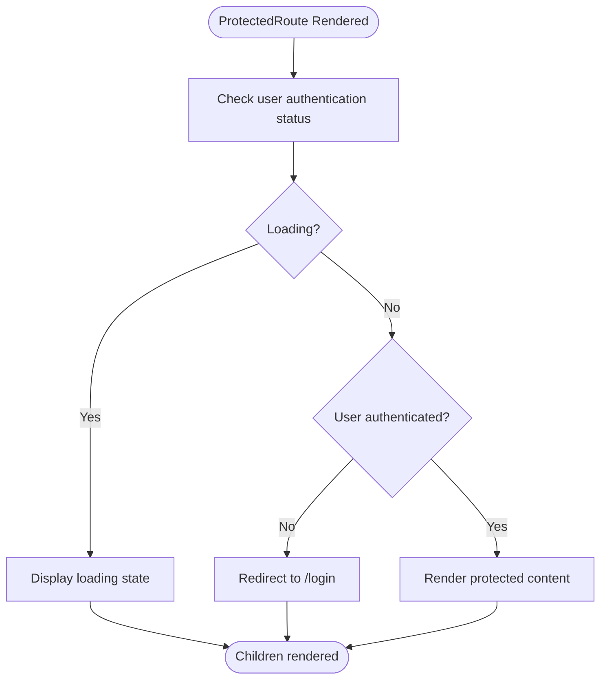
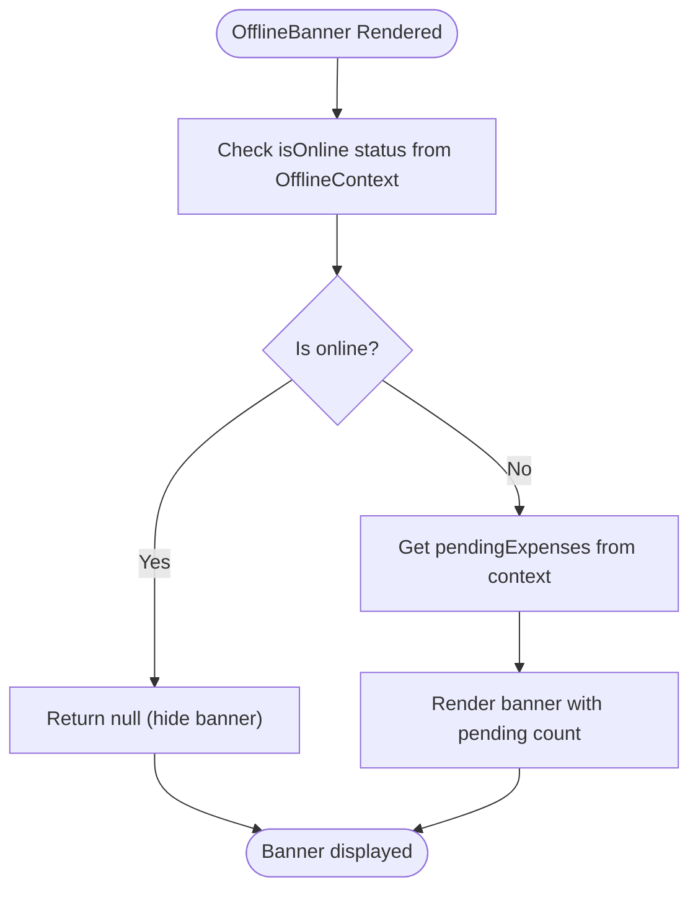
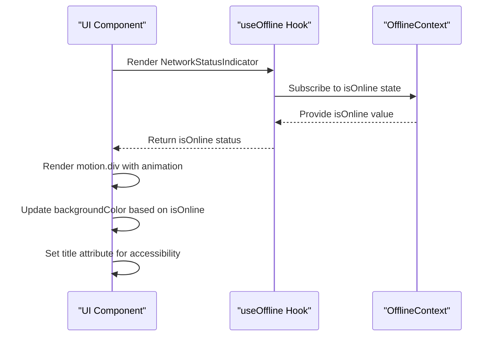
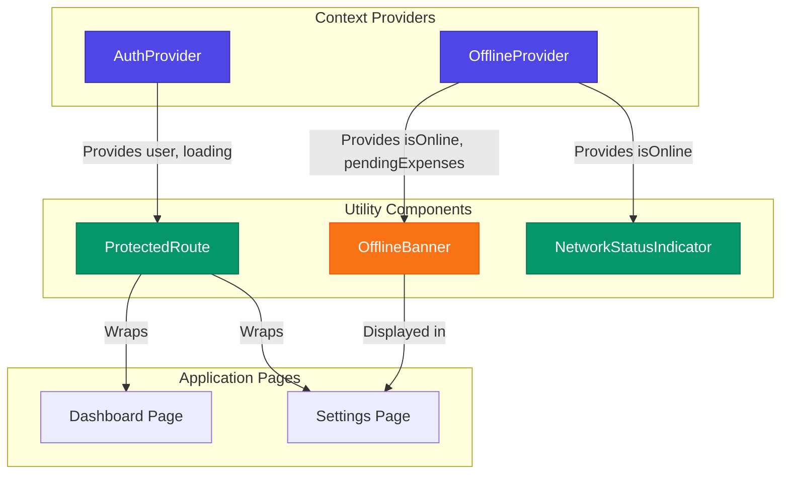

# Utility Components - State & Status Indicators

<cite>
**Referenced Files in This Document**   
- [ProtectedRoute.tsx](file://src/components/ProtectedRoute.tsx)
- [OfflineBanner.tsx](file://src/components/OfflineBanner.tsx)
- [NetworkStatusIndicator.tsx](file://src/components/NetworkStatusIndicator.tsx)
- [AuthContext.tsx](file://src/contexts/AuthContext.tsx)
- [OfflineContext.tsx](file://src/contexts/OfflineContext.tsx)
- [layout.tsx](file://src/app/layout.tsx)
- [dashboard/page.tsx](file://src/app/dashboard/page.tsx)
- [settings/page.tsx](file://src/app/settings/page.tsx)
</cite>

## Table of Contents
1. [Introduction](#introduction)
2. [Core Utility Components](#core-utility-components)
3. [ProtectedRoute Component Analysis](#protectedroute-component-analysis)
4. [OfflineBanner Component Analysis](#offlinebanner-component-analysis)
5. [NetworkStatusIndicator Component Analysis](#networkstatusindicator-component-analysis)
6. [Context Integration and Data Flow](#context-integration-and-data-flow)
7. [Component Usage Patterns](#component-usage-patterns)
8. [Styling and Accessibility](#styling-and-accessibility)
9. [Testing Strategies](#testing-strategies)
10. [Extension Opportunities](#extension-opportunities)

## Introduction
This document provides comprehensive documentation for the utility components that manage application state and provide user feedback in the Expense Tracker application. The focus is on three key components: ProtectedRoute, OfflineBanner, and NetworkStatusIndicator, which work together with context providers to maintain application security, connectivity awareness, and user experience. These components leverage React's context API and Next.js features to create a robust, user-friendly application that handles authentication and network status effectively.

## Core Utility Components

The application implements three primary utility components for state management and status indication:

- **ProtectedRoute**: Guards authenticated routes using AuthContext
- **OfflineBanner**: Displays offline status with visual alerts and messaging
- **NetworkStatusIndicator**: Provides real-time connectivity feedback in the UI

These components work in conjunction with their respective context providers to maintain application state and provide appropriate user feedback based on authentication and network conditions.

**Section sources**
- [ProtectedRoute.tsx](file://src/components/ProtectedRoute.tsx)
- [OfflineBanner.tsx](file://src/components/OfflineBanner.tsx)
- [NetworkStatusIndicator.tsx](file://src/components/NetworkStatusIndicator.tsx)

## ProtectedRoute Component Analysis

The ProtectedRoute component serves as a route guard that ensures only authenticated users can access protected pages. It leverages the AuthContext to determine user authentication status and redirects unauthenticated users to the login page.



**Diagram sources**
- [ProtectedRoute.tsx](file://src/components/ProtectedRoute.tsx#L1-L35)

**Section sources**
- [ProtectedRoute.tsx](file://src/components/ProtectedRoute.tsx#L1-L35)
- [AuthContext.tsx](file://src/contexts/AuthContext.tsx#L41-L95)

### Implementation Details

The ProtectedRoute component implements the following logic:

1. **Authentication Check**: Uses the useAuth hook to access user and loading states from AuthContext
2. **Redirection Logic**: Uses Next.js useRouter to redirect unauthenticated users to the login page
3. **Loading State**: Displays a loading indicator while authentication status is being determined
4. **Conditional Rendering**: Only renders children when the user is authenticated

```tsx
export function ProtectedRoute({ children }: ProtectedRouteProps) {
  const { user, loading } = useAuth();
  const router = useRouter();

  useEffect(() => {
    if (!loading && !user) {
      router.replace("/login");
    }
  }, [user, loading, router]);

  if (loading) {
    return (
      <div className="min-h-screen flex items-center justify-center">
        <div className="text-lg">Loading...</div>
      </div>
    );
  }

  if (!user) {
    return null;
  }

  return <>{children}</>;
}
```

### Usage Examples

The ProtectedRoute component is used in multiple pages to protect authenticated content:

```tsx
// In dashboard/page.tsx and settings/page.tsx
<ProtectedRoute>
  <div className="min-h-screen bg-gray-50">
    {/* Protected content */}
  </div>
</ProtectedRoute>
```

## OfflineBanner Component Analysis

The OfflineBanner component displays a visual notification when the application is offline, informing users about pending expenses that will sync when connectivity is restored.



**Diagram sources**
- [OfflineBanner.tsx](file://src/components/OfflineBanner.tsx#L1-L27)

**Section sources**
- [OfflineBanner.tsx](file://src/components/OfflineBanner.tsx#L1-L27)
- [OfflineContext.tsx](file://src/contexts/OfflineContext.tsx#L0-L43)

### Implementation Details

The OfflineBanner component implements the following functionality:

1. **Online Status Check**: Uses useOffline hook to access isOnline status
2. **Conditional Rendering**: Only displays when the application is offline
3. **Pending Expenses Count**: Shows the number of expenses waiting to be synced
4. **Visual Design**: Uses Tailwind CSS for styling with orange color scheme

```tsx
export const OfflineBanner: React.FC = () => {
  const { isOnline, pendingExpenses } = useOffline();

  if (isOnline) return null;

  return (
    <div className="w-full bg-orange-100 text-orange-800 px-4 py-2 text-sm flex items-center gap-2">
      <AlertTriangle size={16} className="shrink-0" />
      <span>
        You are offline. {pendingExpenses.length} pending expense
        {pendingExpenses.length === 1 ? "" : "s"} will sync when you're back
        online.
      </span>
    </div>
  );
};
```

### Accessibility Features

The OfflineBanner includes several accessibility considerations:

- **Visual Icon**: Uses AlertTriangle icon for visual indication of offline status
- **Clear Messaging**: Provides explicit information about the offline state and pending actions
- **Color Contrast**: Uses orange color scheme with sufficient contrast for readability
- **Responsive Design**: Adapts to different screen sizes with flexible layout

## NetworkStatusIndicator Component Analysis

The NetworkStatusIndicator component provides a subtle, persistent visual indicator of the application's network connectivity status in the top-right corner of the screen.



**Diagram sources**
- [NetworkStatusIndicator.tsx](file://src/components/NetworkStatusIndicator.tsx#L1-L23)
- [OfflineContext.tsx](file://src/contexts/OfflineContext.tsx#L0-L43)

**Section sources**
- [NetworkStatusIndicator.tsx](file://src/components/NetworkStatusIndicator.tsx#L1-L23)
- [OfflineContext.tsx](file://src/contexts/OfflineContext.tsx#L0-L43)

### Implementation Details

The NetworkStatusIndicator component features:

1. **Animation**: Uses Framer Motion for smooth transitions between online/offline states
2. **Visual Feedback**: Changes color (green for online, red for offline) and position
3. **Accessibility**: Includes title attribute for screen readers
4. **Persistence**: Fixed positioning ensures visibility across all pages

```tsx
export function NetworkStatusIndicator() {
  const { isOnline } = useOffline();

  return (
    <AnimatePresence>
      <motion.div
        key={isOnline ? "online" : "offline"}
        initial={{ scale: 0, opacity: 0 }}
        animate={{ scale: 1, opacity: 1 }}
        exit={{ scale: 0, opacity: 0 }}
        className="fixed top-4 right-4 z-50 w-4 h-4 rounded-full border-2 border-white shadow-lg"
        style={{ backgroundColor: isOnline ? '#22c55e' : '#ef4444' }}
        title={isOnline ? "Online" : "Offline"}
      />
    </AnimatePresence>
  );
}
```

### Design Rationale

The component's design prioritizes:

- **Minimalism**: Small, unobtrusive indicator that doesn't interfere with content
- **Immediate Feedback**: Instant visual indication of network status changes
- **Consistency**: Uniform appearance across all application pages
- **Performance**: Efficient rendering with minimal re-renders

## Context Integration and Data Flow

The utility components integrate with context providers to access application state without prop drilling. The data flow follows a unidirectional pattern from context providers to consuming components.



**Diagram sources**
- [AuthContext.tsx](file://src/contexts/AuthContext.tsx#L1-L97)
- [OfflineContext.tsx](file://src/contexts/OfflineContext.tsx#L1-L172)
- [layout.tsx](file://src/app/layout.tsx#L1-L59)

**Section sources**
- [AuthContext.tsx](file://src/contexts/AuthContext.tsx#L1-L97)
- [OfflineContext.tsx](file://src/contexts/OfflineContext.tsx#L1-L172)
- [layout.tsx](file://src/app/layout.tsx#L1-L59)

### Context Provider Hierarchy

The context providers are nested in the root layout to ensure global availability:

```tsx
// src/app/layout.tsx
<ConvexProvider>
  <AuthProvider>
    <SettingsProvider>
      <OfflineProvider>
        {children}
        <NetworkStatusIndicator />
        <Toaster position="top-center" />
      </OfflineProvider>
    </SettingsProvider>
  </AuthProvider>
</ConvexProvider>
```

This hierarchy ensures that all context providers are available to all pages and components throughout the application.

## Component Usage Patterns

The utility components are implemented across the application following consistent patterns for authentication protection and network status indication.

### ProtectedRoute Usage

The ProtectedRoute component is used as a wrapper for authenticated pages:

```tsx
// In settings/page.tsx
<ProtectedRoute>
  <div className="min-h-screen bg-gray-50">
    <OfflineBanner />
    {/* Page content */}
  </div>
</ProtectedRoute>
```

**Usage Locations:**
- Dashboard page
- Settings page
- Future authenticated routes

### OfflineBanner Usage

The OfflineBanner is conditionally rendered within protected pages:

```tsx
// In settings/page.tsx
<ProtectedRoute>
  <div className="min-h-screen bg-gray-50">
    <OfflineBanner />
    {/* Rest of content */}
  </div>
</ProtectedRoute>
```

### NetworkStatusIndicator Usage

The NetworkStatusIndicator is rendered at the application level in the root layout:

```tsx
// In layout.tsx
<OfflineProvider>
  {children}
  <NetworkStatusIndicator />
  <Toaster position="top-center" />
</OfflineProvider>
```

This ensures the indicator is available on all pages without requiring individual imports.

**Section sources**
- [layout.tsx](file://src/app/layout.tsx#L1-L59)
- [dashboard/page.tsx](file://src/app/dashboard/page.tsx#L1-L127)
- [settings/page.tsx](file://src/app/settings/page.tsx#L1-L235)

## Styling and Accessibility

The utility components use Tailwind CSS for styling, following the application's design system with consistent color schemes and responsive layouts.

### Tailwind CSS Implementation

All components leverage Tailwind's utility-first approach:

- **ProtectedRoute**: Uses `min-h-screen`, `flex`, `items-center`, `justify-center` for loading state
- **OfflineBanner**: Uses `bg-orange-100`, `text-orange-800`, `px-4`, `py-2` for visual styling
- **NetworkStatusIndicator**: Uses `fixed`, `top-4`, `right-4`, `z-50` for positioning

### Accessibility Considerations

Each component includes accessibility features:

- **Semantic HTML**: Proper use of div elements with appropriate roles
- **Color Contrast**: Sufficient contrast ratios for text and background colors
- **Visual Indicators**: Icons and color coding for users with different needs
- **Screen Reader Support**: Title attributes and clear text labels
- **Keyboard Navigation**: No interactive elements that could trap keyboard focus

### Responsive Design

All components are designed to work across device sizes:

- **Mobile-First**: Styles adapt to smaller screens
- **Flexible Layouts**: Use of flexbox and responsive units
- **Touch Targets**: Adequate sizing for touch interactions

**Section sources**
- [ProtectedRoute.tsx](file://src/components/ProtectedRoute.tsx#L1-L35)
- [OfflineBanner.tsx](file://src/components/OfflineBanner.tsx#L1-L27)
- [NetworkStatusIndicator.tsx](file://src/components/NetworkStatusIndicator.tsx#L1-L23)

## Testing Strategies

Effective testing strategies ensure the reliability and robustness of the utility components.

### Unit Testing Approach

For each component, the following test cases should be implemented:

**ProtectedRoute Tests:**
- Renders loading state when loading is true
- Redirects to login when user is null and not loading
- Renders children when user is authenticated
- Does not redirect during loading state

**OfflineBanner Tests:**
- Renders null when online
- Displays banner with correct pending count when offline
- Shows singular/plural text appropriately based on count
- Includes visual icon and clear messaging

**NetworkStatusIndicator Tests:**
- Renders with correct color for online/offline states
- Applies proper animations for state changes
- Positions correctly in top-right corner
- Includes accessibility title attribute

### Integration Testing

Integration tests should verify:

- Context provider integration
- State synchronization between components
- Proper rendering sequence
- Error boundary handling

### Mocking Strategies

When testing components that depend on context:

```tsx
// Example test setup
const MockAuthProvider = ({ children }) => (
  <AuthProvider>
    {children}
  </AuthProvider>
);

// Wrap components in context providers during testing
render(
  <MockAuthProvider>
    <ProtectedRoute>
      <div>Test Content</div>
    </ProtectedRoute>
  </MockAuthProvider>
);
```

**Section sources**
- [ProtectedRoute.tsx](file://src/components/ProtectedRoute.tsx#L1-L35)
- [OfflineBanner.tsx](file://src/components/OfflineBanner.tsx#L1-L27)
- [NetworkStatusIndicator.tsx](file://src/components/NetworkStatusIndicator.tsx#L1-L23)

## Extension Opportunities

The utility components can be extended to support additional use cases and enhanced functionality.

### Maintenance Mode Implementation

Extend the OfflineContext to support maintenance mode:

```tsx
// Enhanced OfflineContextType
interface ExtendedOfflineContextType extends OfflineContextType {
  isMaintenanceMode: boolean;
  maintenanceMessage: string | null;
}

// New MaintenanceBanner component
export const MaintenanceBanner: React.FC = () => {
  const { isMaintenanceMode, maintenanceMessage } = useExtendedOffline();
  
  if (!isMaintenanceMode) return null;
  
  return (
    <div className="w-full bg-red-100 text-red-800 px-4 py-2 text-sm">
      <span>{maintenanceMessage || "System maintenance in progress"}</span>
    </div>
  );
};
```

### Low-Bandwidth Mode

Implement bandwidth detection and visual indicators:

```tsx
// Enhanced NetworkStatusIndicator
export function EnhancedNetworkStatusIndicator() {
  const { isOnline, effectiveConnectionType } = useNetworkInfo();
  
  let indicatorColor = isOnline ? '#22c55e' : '#ef4444';
  let indicatorTitle = isOnline ? "Online" : "Offline";
  
  // Adjust for low bandwidth
  if (isOnline && effectiveConnectionType === 'slow-2g') {
    indicatorColor = '#f59e0b';
    indicatorTitle = "Online (Slow Connection)";
  }
  
  return (
    <motion.div
      style={{ backgroundColor: indicatorColor }}
      title={indicatorTitle}
      // ... rest of implementation
    />
  );
}
```

### Enhanced Offline Functionality

Expand offline capabilities:

- **Local Data Persistence**: Store more application state locally
- **Conflict Resolution**: Handle data conflicts when syncing
- **Progressive Sync**: Prioritize critical data for syncing
- **User-Controlled Sync**: Allow users to manually trigger sync

### Customizable Status Indicators

Make components more configurable:

```tsx
// Enhanced component with props
interface ConfigurableNetworkIndicatorProps {
  position?: 'top-left' | 'top-right' | 'bottom-left' | 'bottom-right';
  size?: 'small' | 'medium' | 'large';
  showText?: boolean;
}

export function ConfigurableNetworkIndicator({
  position = 'top-right',
  size = 'medium',
  showText = false
}: ConfigurableNetworkIndicatorProps) {
  // Implementation with configurable options
}
```

These extensions would enhance the application's resilience, user experience, and adaptability to various network conditions and operational requirements.

**Section sources**
- [OfflineContext.tsx](file://src/contexts/OfflineContext.tsx#L1-L172)
- [ProtectedRoute.tsx](file://src/components/ProtectedRoute.tsx#L1-L35)
- [NetworkStatusIndicator.tsx](file://src/components/NetworkStatusIndicator.tsx#L1-L23)