# Contexts - Global State Management

<cite>
**Referenced Files in This Document**   
- [AuthContext.tsx](file://src/contexts/AuthContext.tsx)
- [OfflineContext.tsx](file://src/contexts/OfflineContext.tsx)
- [SettingsContext.tsx](file://src/contexts/SettingsContext.tsx)
- [ConvexProvider.tsx](file://src/providers/ConvexProvider.tsx)
- [ProtectedRoute.tsx](file://src/components/ProtectedRoute.tsx)
- [OfflineBanner.tsx](file://src/components/OfflineBanner.tsx)
- [SummaryCards.tsx](file://src/features/dashboard/components/SummaryCards/SummaryCards.tsx)
- [formatters.ts](file://src/lib/formatters.ts)
- [settings/page.tsx](file://src/app/settings/page.tsx)
- [dashboard/page.tsx](file://src/app/dashboard/page.tsx)
</cite>

## Table of Contents
1. [Introduction](#introduction)
2. [Project Structure](#project-structure)
3. [Core Components](#core-components)
4. [Architecture Overview](#architecture-overview)
5. [Detailed Component Analysis](#detailed-component-analysis)
6. [Dependency Analysis](#dependency-analysis)
7. [Performance Considerations](#performance-considerations)
8. [Troubleshooting Guide](#troubleshooting-guide)
9. [Conclusion](#conclusion)

## Introduction
This document provides a comprehensive analysis of the global state management system in the Expense Tracker application. The implementation leverages React Context API to manage authentication state, offline functionality, and user preferences across the application. The architecture is designed to provide a seamless user experience with robust offline support, secure authentication, and personalized settings. This documentation details the implementation, usage patterns, integration points, and best practices for the context-based state management system.

## Project Structure
The global state management system is organized within the `src/contexts/` directory, with each context handling a specific domain of application state. The contexts are composed together through provider components and consumed throughout the application using custom hooks. The structure follows a clean separation of concerns, with each context encapsulating its own state logic and side effects.


**Diagram sources**
- [AuthContext.tsx](file://src/contexts/AuthContext.tsx)
- [OfflineContext.tsx](file://src/contexts/OfflineContext.tsx)
- [SettingsContext.tsx](file://src/contexts/SettingsContext.tsx)
- [ConvexProvider.tsx](file://src/providers/ConvexProvider.tsx)

**Section sources**
- [AuthContext.tsx](file://src/contexts/AuthContext.tsx)
- [OfflineContext.tsx](file://src/contexts/OfflineContext.tsx)
- [SettingsContext.tsx](file://src/contexts/SettingsContext.tsx)

## Core Components
The global state management system consists of three primary context components: AuthContext for authentication state, OfflineContext for network status and offline operations, and SettingsContext for user preferences. These contexts provide a centralized state management solution that eliminates prop drilling and enables efficient state sharing across distant components. Each context exposes a well-defined interface through custom hooks, making state consumption simple and type-safe throughout the application.

**Section sources**
- [AuthContext.tsx](file://src/contexts/AuthContext.tsx)
- [OfflineContext.tsx](file://src/contexts/OfflineContext.tsx)
- [SettingsContext.tsx](file://src/contexts/SettingsContext.tsx)

## Architecture Overview
The state management architecture follows a provider-consumer pattern where context providers wrap the application tree, making state available to any component that needs it. The contexts are initialized in a specific order within the application's provider chain, ensuring proper dependency resolution. AuthContext provides authentication state that is consumed by both OfflineContext and SettingsContext, creating a hierarchical dependency structure. This architecture enables cross-context functionality, such as using the authentication token for API calls in offline sync operations and settings updates.


**Diagram sources**
- [ConvexProvider.tsx](file://src/providers/ConvexProvider.tsx)
- [AuthContext.tsx](file://src/contexts/AuthContext.tsx)
- [OfflineContext.tsx](file://src/contexts/OfflineContext.tsx)
- [SettingsContext.tsx](file://src/contexts/SettingsContext.tsx)

## Detailed Component Analysis

### AuthContext Analysis
AuthContext manages user authentication state including login, logout, token persistence, and session validation. It uses React's Context API to provide authentication state and methods to any component in the application tree. The context handles token storage in localStorage for persistence across sessions and integrates with Convex backend for authentication operations.

```mermaid
classDiagram
class AuthContextType {
+user : User | null
+token : string | null
+login(username : string, password : string) : Promise~void~
+register(username : string, password : string) : Promise~void~
+logout() : Promise~void~
+loading : boolean
}
class User {
+_id : string
+username : string
}
class AuthProvider {
-token : string | null
-loading : boolean
-loginMutation : Mutation
-registerMutation : Mutation
-logoutMutation : Mutation
-user : QueryResult
+useEffect() : void
+login() : Promise~void~
+register() : Promise~void~
+logout() : Promise~void~
}
class useAuth {
+context : AuthContextType
+Error handling
}
AuthProvider --> AuthContextType : implements
useAuth --> AuthContext : consumes
AuthProvider --> localStorage : reads/writes
AuthProvider --> ConvexAPI : authentication calls
```



**Diagram sources**
- [AuthContext.tsx](file://src/contexts/AuthContext.tsx#L15-L95)

**Section sources**
- [AuthContext.tsx](file://src/contexts/AuthContext.tsx#L1-L96)

#### Authentication Flow
The authentication process follows a secure pattern with token-based authentication and localStorage persistence. When a user logs in or registers, the credentials are sent to the Convex backend, which returns an authentication token. This token is stored in localStorage for persistence and used in subsequent requests to authenticate the user.


**Diagram sources**
- [AuthContext.tsx](file://src/contexts/AuthContext.tsx#L41-L75)

### OfflineContext Analysis
OfflineContext manages network status detection, local storage of pending operations, and synchronization when connectivity is restored. It uses the browser's online/offline events to detect network status changes and leverages localforage (IndexedDB wrapper) to persist pending expenses across application restarts. This enables full offline functionality for expense tracking.


**Diagram sources**
- [OfflineContext.tsx](file://src/contexts/OfflineContext.tsx#L15-L170)

**Section sources**
- [OfflineContext.tsx](file://src/contexts/OfflineContext.tsx#L1-L171)

#### Offline Operation Flow
The offline functionality follows a queue-based pattern where operations that cannot be completed due to network unavailability are stored locally and processed when connectivity is restored. This ensures data integrity and provides a seamless user experience regardless of network conditions.


**Diagram sources**
- [OfflineContext.tsx](file://src/contexts/OfflineContext.tsx#L85-L130)

### SettingsContext Analysis
SettingsContext manages user preferences such as currency and calendar format. It provides a simple interface for reading current settings and updating them through Convex mutations. The context automatically handles the authentication token requirement for settings updates and provides loading state for UI feedback.


**Diagram sources**
- [SettingsContext.tsx](file://src/contexts/SettingsContext.tsx#L15-L56)

**Section sources**
- [SettingsContext.tsx](file://src/contexts/SettingsContext.tsx#L1-L57)

#### Settings Update Flow
The settings management follows a straightforward pattern where UI interactions trigger updates to user preferences, which are then persisted to the backend. The context handles error cases gracefully and provides immediate feedback through toast notifications.


**Diagram sources**
- [SettingsContext.tsx](file://src/contexts/SettingsContext.tsx#L44-L54)

## Dependency Analysis
The context system demonstrates a clear dependency hierarchy where higher-level contexts depend on lower-level ones for essential data. AuthContext serves as the foundation, providing the authentication token that both OfflineContext and SettingsContext require for their operations. This dependency chain ensures that contexts are initialized in the correct order and have access to the data they need.

```mermaid
graph TD
AuthContext --> |Provides token| OfflineContext
AuthContext --> |Provides token| SettingsContext
OfflineContext --> |Provides network status| UIComponents
SettingsContext --> |Provides preferences| UIComponents
AuthContext --> |Provides user data| UIComponents
class AuthContext primary
class OfflineContext secondary
class SettingsContext secondary
class UIComponents tertiary
style AuthContext fill:#4285f4,stroke:#333,color:#fff
style OfflineContext fill:#34a853,stroke:#333,color:#fff
style SettingsContext fill:#fbbc05,stroke:#333,color:#fff
style UIComponents fill:#ea4335,stroke:#333,color:#fff
linkStyle 0 stroke:#666;
linkStyle 1 stroke:#666;
linkStyle 2 stroke:#666;
linkStyle 3 stroke:#666;
linkStyle 4 stroke:#666;
```

**Diagram sources**
- [AuthContext.tsx](file://src/contexts/AuthContext.tsx)
- [OfflineContext.tsx](file://src/contexts/OfflineContext.tsx)
- [SettingsContext.tsx](file://src/contexts/SettingsContext.tsx)

**Section sources**
- [AuthContext.tsx](file://src/contexts/AuthContext.tsx)
- [OfflineContext.tsx](file://src/contexts/OfflineContext.tsx)
- [SettingsContext.tsx](file://src/contexts/SettingsContext.tsx)

## Performance Considerations
The context implementation follows React best practices for performance optimization. Each context uses React.memo and proper dependency arrays in useEffect hooks to prevent unnecessary re-renders. The state updates are batched where possible, and the context providers are designed to minimize the frequency of re-renders across the component tree. For large applications, consider implementing context splitting or using useReducer for complex state logic to further optimize performance.

The use of localforage for offline storage provides efficient IndexedDB operations with promise-based APIs, ensuring non-blocking operations even with large datasets. The automatic sync functionality is designed to process expenses sequentially to avoid overwhelming the network connection when restoring connectivity.

## Troubleshooting Guide
Common issues in the context implementation include provider ordering, context re-renders, and error handling during state updates. Ensure that AuthProvider is placed before OfflineProvider and SettingsProvider in the component tree since they depend on authentication state. For context re-renders, verify that consumers are not causing unnecessary re-renders by using memoization techniques like React.memo or useMemo.

Error handling is implemented with try-catch blocks around mutation calls, with errors either thrown to be handled by consumers or logged to the console for debugging. For authentication issues, check that the Convex API endpoints are correctly configured and that the authentication token is properly persisted in localStorage.

When debugging offline functionality, verify that localforage is properly configured and that the IndexedDB storage is accessible. Check browser storage settings and ensure that third-party cookies and storage are not blocked, which could prevent localforage from functioning correctly.

**Section sources**
- [AuthContext.tsx](file://src/contexts/AuthContext.tsx#L41-L75)
- [OfflineContext.tsx](file://src/contexts/OfflineContext.tsx#L100-L130)
- [SettingsContext.tsx](file://src/contexts/SettingsContext.tsx#L44-L54)

## Conclusion
The global state management system in the Expense Tracker application provides a robust, scalable solution for managing authentication, offline operations, and user preferences. By leveraging React Context API with Convex integration, the implementation offers a seamless user experience with reliable offline support and personalized settings. The clean separation of concerns, type-safe interfaces, and well-documented usage patterns make the system maintainable and extensible for future features. Following the demonstrated best practices for context usage, error handling, and performance optimization ensures a high-quality user experience across different network conditions and device capabilities.