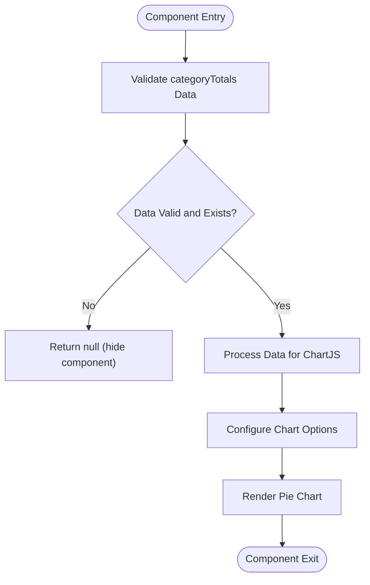
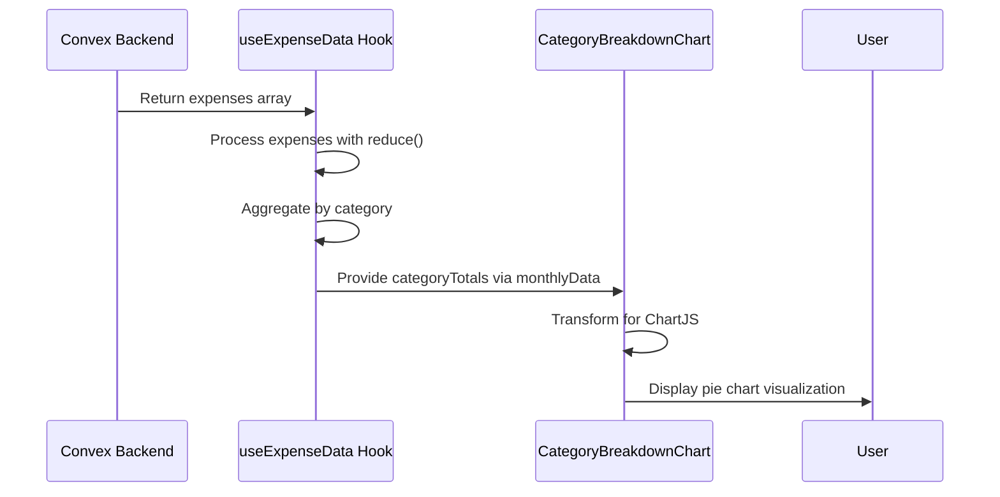
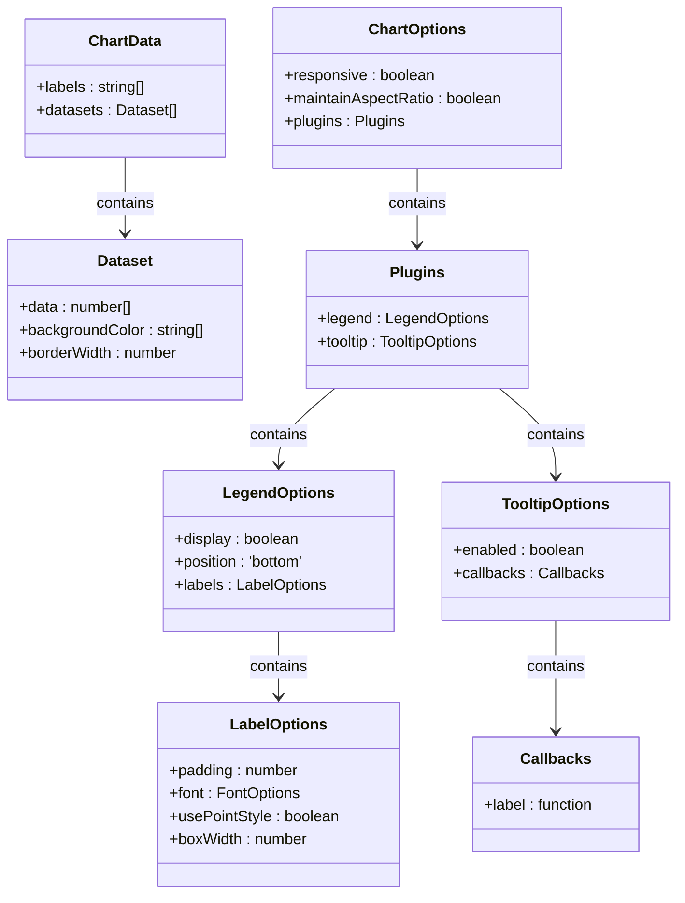
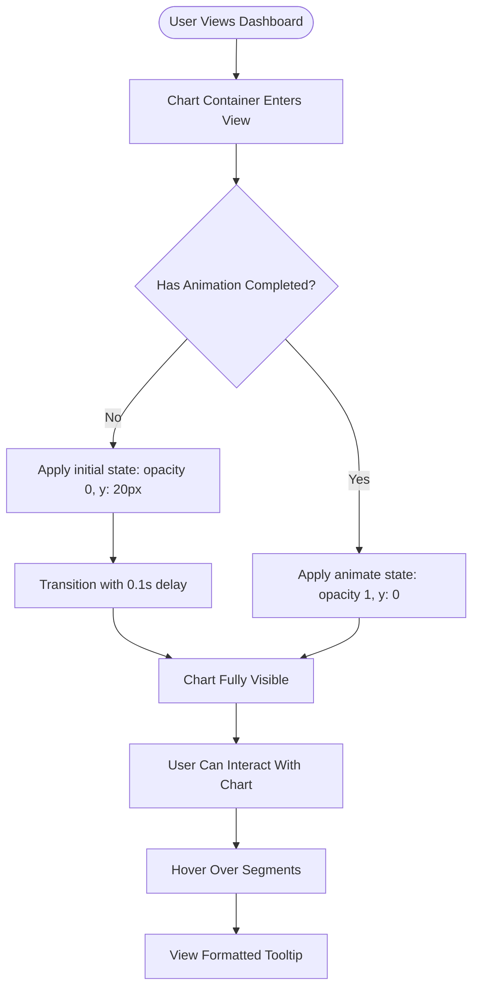
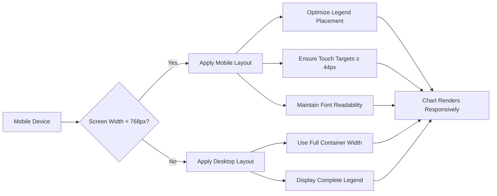
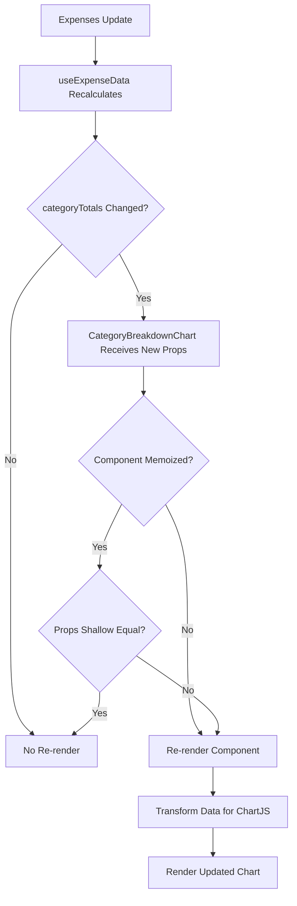
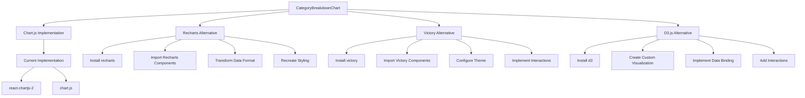

# Category Breakdown Chart

<cite>
**Referenced Files in This Document**   
- [CategoryBreakdownChart.tsx](file://src/features/dashboard/components/Charts/CategoryBreakdownChart.tsx)
- [useExpenseData.ts](file://src/features/dashboard/hooks/useExpenseData.ts)
- [expense.ts](file://src/features/dashboard/types/expense.ts)
- [SettingsContext.tsx](file://src/contexts/SettingsContext.tsx)
- [formatters.ts](file://src/lib/formatters.ts)
</cite>

## Table of Contents
1. [Introduction](#introduction)
2. [Component Overview](#component-overview)
3. [Data Flow and Aggregation Logic](#data-flow-and-aggregation-logic)
4. [Chart Configuration and Styling](#chart-configuration-and-styling)
5. [Interactivity and User Experience](#interactivity-and-user-experience)
6. [Accessibility and Responsive Design](#accessibility-and-responsive-design)
7. [Performance Optimization](#performance-optimization)
8. [Integration and Customization](#integration-and-customization)

## Introduction
The Category Breakdown Chart component provides a visual representation of expense distribution across user-defined categories within the Expense Tracker application. This pie chart visualization enables users to quickly understand their spending patterns by category, supporting financial planning and budgeting decisions. The component integrates with the application's data layer to dynamically display categorized expense totals and responds to user settings for currency formatting.

**Section sources**
- [CategoryBreakdownChart.tsx](file://src/features/dashboard/components/Charts/CategoryBreakdownChart.tsx#L1-L98)

## Component Overview
The Category Breakdown Chart is a React component that renders a pie chart using Chart.js through the react-chartjs-2 wrapper. It displays the distribution of expenses across different categories, with each slice representing a category's proportion of total spending.

The component accepts a single prop:
- **categoryTotals**: An object mapping category names to their respective total amounts (Record<string, number>)

When no data is available (empty or undefined categoryTotals), the component returns null, effectively hiding itself from the UI. This prevents rendering an empty or misleading chart when there are no expenses to display.



**Diagram sources**
- [CategoryBreakdownChart.tsx](file://src/features/dashboard/components/Charts/CategoryBreakdownChart.tsx#L15-L20)

**Section sources**
- [CategoryBreakdownChart.tsx](file://src/features/dashboard/components/Charts/CategoryBreakdownChart.tsx#L1-L98)

## Data Flow and Aggregation Logic
The Category Breakdown Chart receives pre-aggregated category data from the useExpenseData hook, which processes raw expense records into meaningful summaries. The data flow begins with fetching expenses from the Convex backend and ends with the formatted chart display.

### Data Aggregation Process
The useExpenseData hook performs the category aggregation by reducing the expenses array into a Record<string, number> object where keys are category names and values are the sum of expenses in that category.

```typescript
const categoryTotals = expenses.reduce<Record<string, number>>((acc, expense) => {
  const categories = Array.isArray(expense.category) 
    ? expense.category 
    : [expense.category];
  
  categories.forEach((cat) => {
    acc[cat] = (acc[cat] || 0) + expense.amount;
  });
  return acc;
}, {});
```

This aggregation handles both single-category and multi-category expenses, as the category field in the Expense interface is defined as string[]. This design allows for flexible categorization where a single expense can belong to multiple categories.



**Diagram sources**
- [useExpenseData.ts](file://src/features/dashboard/hooks/useExpenseData.ts#L40-L50)
- [CategoryBreakdownChart.tsx](file://src/features/dashboard/components/Charts/CategoryBreakdownChart.tsx#L22-L35)

**Section sources**
- [useExpenseData.ts](file://src/features/dashboard/hooks/useExpenseData.ts#L30-L60)
- [expense.ts](file://src/features/dashboard/types/expense.ts#L2-L10)

## Chart Configuration and Styling
The Category Breakdown Chart uses Chart.js with specific configuration options to create an aesthetically pleasing and informative visualization. The chart is configured with responsive design principles and customized visual elements.

### Chart Data Structure
The component transforms the categoryTotals prop into the Chart.js data format:

- **labels**: Array of category names from Object.keys(categoryTotals)
- **datasets**: Single dataset containing:
  - **data**: Array of category amounts from Object.values(categoryTotals)
  - **backgroundColor**: Predefined color palette of 10 colors
  - **borderWidth**: Set to 0 for clean, borderless segments

### Visual Configuration
The chart options are configured to enhance readability and user experience:

- **Responsive**: Enabled to adapt to container size
- **maintainAspectRatio**: Disabled to allow flexible height/width
- **Legend**: Positioned at the bottom with circular markers and increased padding
- **Tooltip**: Customized to display formatted currency values



**Diagram sources**
- [CategoryBreakdownChart.tsx](file://src/features/dashboard/components/Charts/CategoryBreakdownChart.tsx#L22-L41)

**Section sources**
- [CategoryBreakdownChart.tsx](file://src/features/dashboard/components/Charts/CategoryBreakdownChart.tsx#L22-L41)

## Interactivity and User Experience
The Category Breakdown Chart incorporates several interactive features to enhance user engagement and provide meaningful information.

### Tooltip Formatting
The component customizes tooltip behavior to display currency-formatted values based on user settings. The tooltip callback function formats the displayed value using the user's preferred currency:

```typescript
callbacks: {
  label: function(context: TooltipItem<'pie'>) {
    let label = context.label || '';
    if (label) {
      label += ': ';
    }
    const value = context.raw as number;
    if (context.raw !== null) {
      label += settings ? formatCurrency(value, settings.currency) : `$${value.toFixed(2)}`;
    }
    return label;
  }
}
```

This implementation retrieves the user's currency preference from the SettingsContext and uses the formatCurrency utility function to properly format the amount.

### Animation and Transitions
The chart container uses Framer Motion to create a smooth entrance animation:

- **initial**: Opacity 0, translated 20px down
- **animate**: Opacity 1, translated to original position
- **transition**: 0.1 second delay for staggered appearance

The chart is wrapped in a styled container with:
- White background with subtle shadow (shadow-sm)
- Rounded corners (rounded-lg)
- Padding (p-6) and bottom margin (mb-6)
- Fixed height of 280px for consistent layout



**Diagram sources**
- [CategoryBreakdownChart.tsx](file://src/features/dashboard/components/Charts/CategoryBreakdownChart.tsx#L70-L98)

**Section sources**
- [CategoryBreakdownChart.tsx](file://src/features/dashboard/components/Charts/CategoryBreakdownChart.tsx#L70-L98)
- [formatters.ts](file://src/lib/formatters.ts#L11-L19)

## Accessibility and Responsive Design
The Category Breakdown Chart is designed with accessibility and responsive behavior in mind to ensure usability across different devices and for users with various needs.

### Responsive Behavior
The chart is configured to be fully responsive with:
- **responsive: true**: Enables responsive resizing
- **maintainAspectRatio: false**: Allows the chart to fill the container without preserving aspect ratio
- Flexible container with 100% width and fixed height

On mobile devices, the chart adapts to smaller screens by:
- Maintaining legible font sizes in the legend
- Preserving touch-friendly hit areas for chart segments
- Using a bottom-positioned legend that doesn't overlap the chart

### Accessibility Features
While the component relies on Chart.js's built-in accessibility features, it could be enhanced with additional accessibility attributes. The current implementation provides:
- Semantic HTML structure with proper heading hierarchy (h2 for chart title)
- High contrast color palette for colorblind users
- Text-based legend for users who cannot interpret colors

The component could be further improved with:
- ARIA labels for screen readers
- Keyboard navigation support
- Alternative text representation of the data



**Diagram sources**
- [CategoryBreakdownChart.tsx](file://src/features/dashboard/components/Charts/CategoryBreakdownChart.tsx#L50-L60)

**Section sources**
- [CategoryBreakdownChart.tsx](file://src/features/dashboard/components/Charts/CategoryBreakdownChart.tsx#L50-L60)

## Performance Optimization
The Category Breakdown Chart implements several performance optimizations to ensure smooth rendering and efficient updates.

### Memoization and Re-renders
While the component itself doesn't explicitly use React.memo, it benefits from the following performance characteristics:
- The useExpenseData hook uses useMemo to memoize the monthlyData object, preventing unnecessary recalculation of category totals
- The chart data and options are derived directly from props and context, minimizing internal state
- The component only re-renders when categoryTotals changes or user settings update

### Rendering Efficiency
The component is optimized for rendering performance through:
- Minimal re-renders by accepting pre-aggregated data
- Efficient data transformation using Object.keys() and Object.values()
- Use of Chart.js's optimized canvas rendering

The component could be further optimized by:
- Wrapping with React.memo to prevent re-renders when props haven't changed
- Implementing lazy loading for the chart when it enters the viewport
- Using windowing techniques for very large category sets



**Diagram sources**
- [useExpenseData.ts](file://src/features/dashboard/hooks/useExpenseData.ts#L35-L40)
- [CategoryBreakdownChart.tsx](file://src/features/dashboard/components/Charts/CategoryBreakdownChart.tsx#L15-L20)

**Section sources**
- [useExpenseData.ts](file://src/features/dashboard/hooks/useExpenseData.ts#L35-L40)

## Integration and Customization
The Category Breakdown Chart is designed to be integrated within the dashboard analytics section and can be customized for different use cases.

### Integration with Application State
The component integrates with multiple application contexts:
- **SettingsContext**: For currency formatting preferences
- **AuthContext**: Indirectly through data fetching (token for API calls)
- **Expense Data Flow**: Receives aggregated data from useExpenseData hook

The component is typically used within the AnalyticsTabs component, which manages the display of different chart types based on user selection.

### Customization Options
While the current implementation has fixed styling, potential customization points include:
- **Visualization Type**: Could be extended to support bar charts or other representations
- **Color Palette**: Could accept a custom color scheme prop
- **Height/Width**: Could accept dimension props for flexible layout
- **Interactivity**: Could support tap-to-highlight or drill-down functionality

### Third-Party Library Integration
The component currently uses:
- **react-chartjs-2**: React wrapper for Chart.js
- **chart.js**: Primary charting library
- **framer-motion**: For entrance animations
- **lucide-react**: For the pie chart icon

Alternative libraries that could be integrated:
- **Recharts**: React-specific charting library with excellent TypeScript support
- **Victory**: Modular charting components with rich interactivity
- **D3.js**: For highly customized visualizations

To switch to Recharts, the implementation would require:
1. Installing recharts package
2. Replacing Chart.js imports with Recharts components
3. Transforming data to Recharts format
4. Recreating styling and tooltip behavior



**Diagram sources**
- [CategoryBreakdownChart.tsx](file://src/features/dashboard/components/Charts/CategoryBreakdownChart.tsx#L1-L10)
- [package-lock.json](file://package-lock.json#L4308-L4349)

**Section sources**
- [CategoryBreakdownChart.tsx](file://src/features/dashboard/components/Charts/CategoryBreakdownChart.tsx#L1-L10)
- [package-lock.json](file://package-lock.json#L4308-L4349)