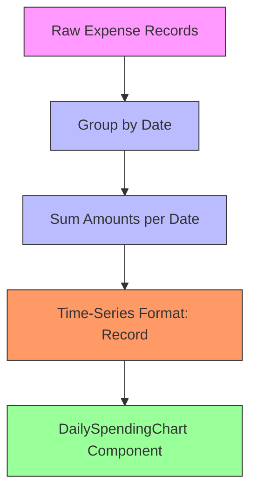
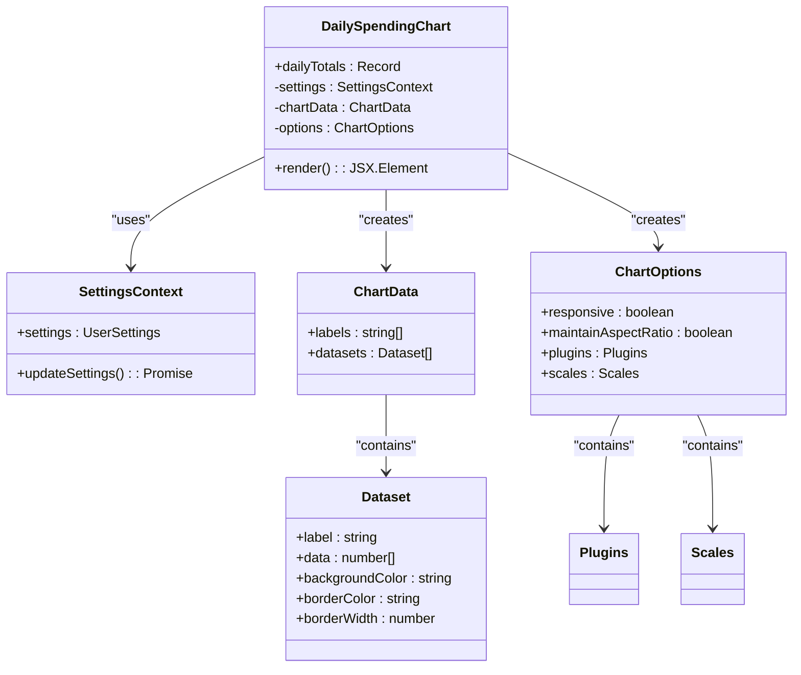
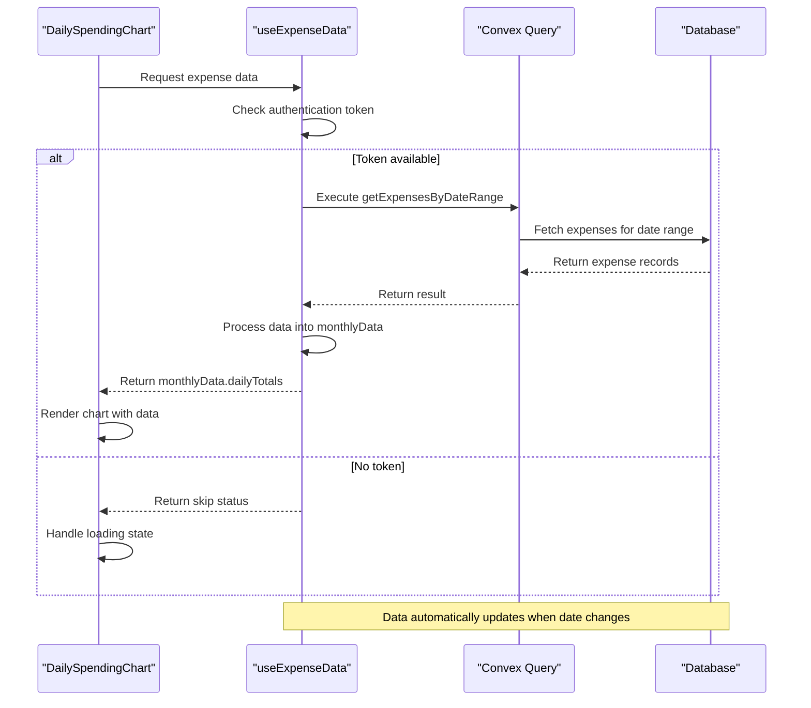
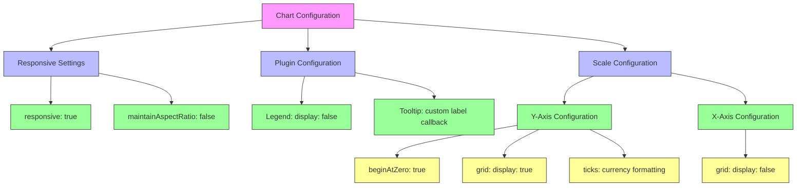
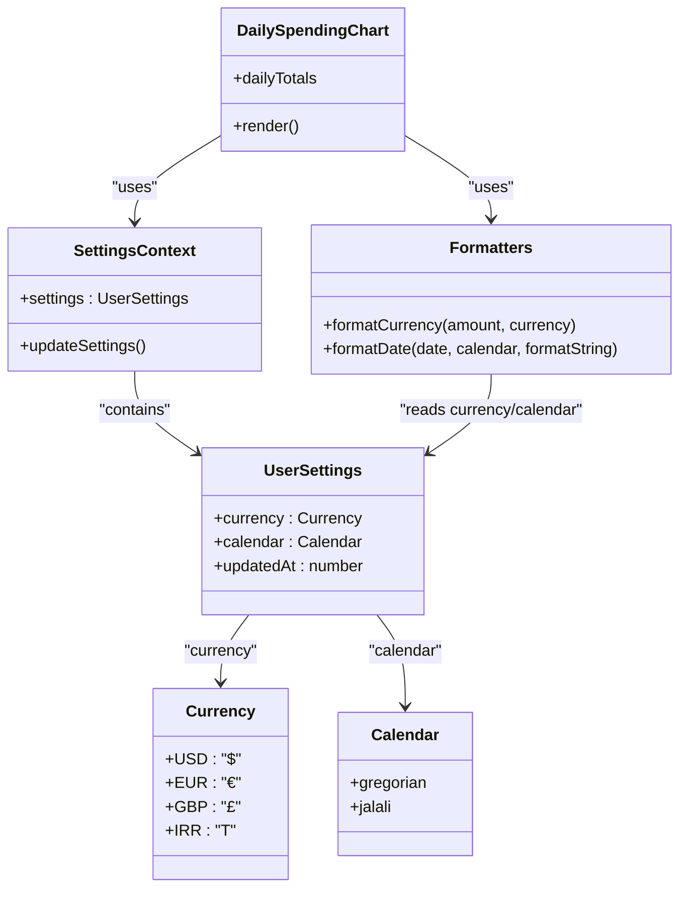
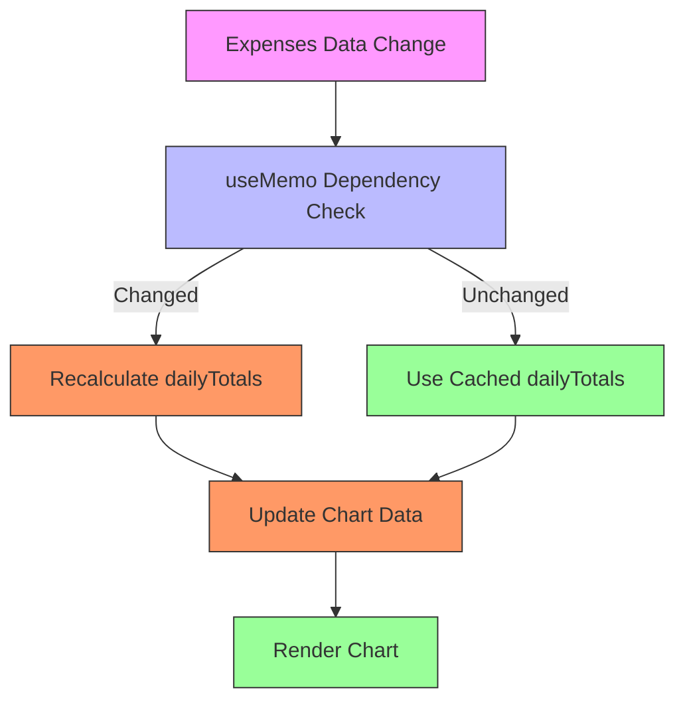
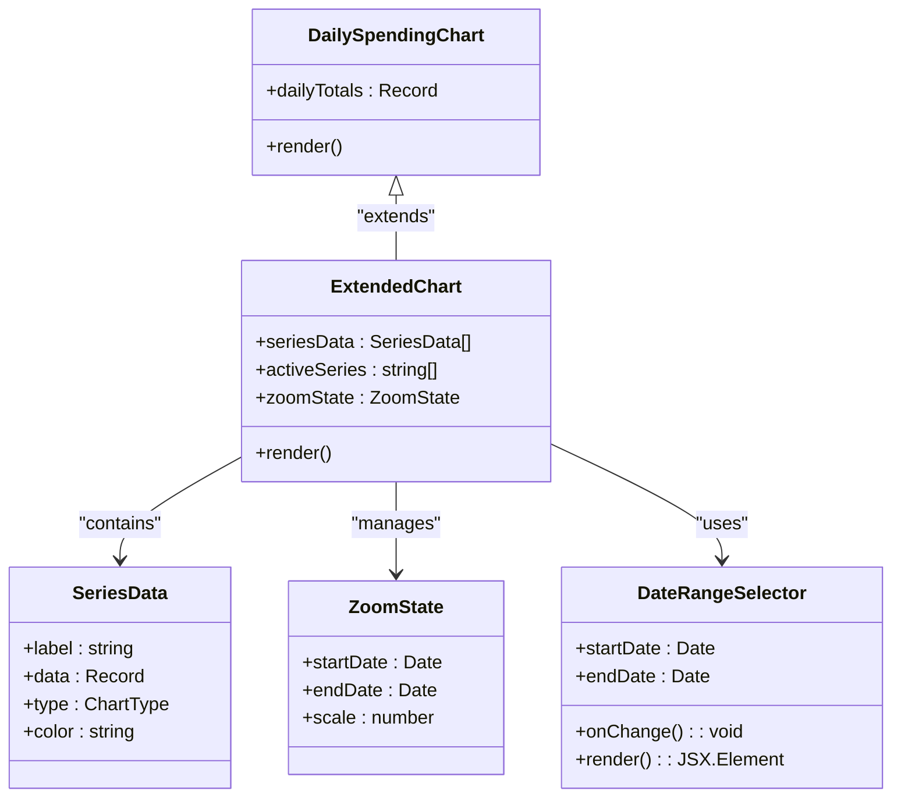

# Daily Spending Chart

<cite>
**Referenced Files in This Document**   
- [DailySpendingChart.tsx](file://src/features/dashboard/components/Charts/DailySpendingChart.tsx)
- [useExpenseData.ts](file://src/features/dashboard/hooks/useExpenseData.ts)
- [formatters.ts](file://src/lib/formatters.ts)
- [SettingsContext.tsx](file://src/contexts/SettingsContext.tsx)
- [schema.ts](file://convex/schema.ts)
- [DateFilterHeader.tsx](file://src/components/DateFilterHeader.tsx)
- [HeaderSection.tsx](file://src/features/dashboard/components/Header/HeaderSection.tsx)
- [CategoryBreakdownChart.tsx](file://src/features/dashboard/components/Charts/CategoryBreakdownChart.tsx)
- [useTimeFramedData.ts](file://src/hooks/useTimeFramedData.ts)
</cite>

## Table of Contents
1. [Introduction](#introduction)
2. [Data Processing Pipeline](#data-processing-pipeline)
3. [Component Architecture](#component-architecture)
4. [Integration with Data Hooks](#integration-with-data-hooks)
5. [Chart Configuration and Styling](#chart-configuration-and-styling)
6. [Date and Currency Formatting](#date-and-currency-formatting)
7. [Performance Optimization](#performance-optimization)
8. [Extension Possibilities](#extension-possibilities)

## Introduction
The DailySpendingChart component visualizes daily expense trends over a selected time period using a bar chart. It integrates with the application's data layer to display aggregated expense data grouped by date, providing users with insights into their spending patterns. The component is responsive to date filtering through navigation controls and adapts to user preferences for currency and calendar systems.

The chart displays daily expense totals as a time-series visualization, with automatic formatting based on user settings. It handles edge cases such as empty datasets and provides smooth animations for improved user experience. The implementation leverages Chart.js through the react-chartjs-2 wrapper, with extensive customization for tooltips, axes, and visual styling.

**Section sources**
- [DailySpendingChart.tsx](file://src/features/dashboard/components/Charts/DailySpendingChart.tsx#L1-L94)

## Data Processing Pipeline

The DailySpendingChart component receives pre-processed data in the form of daily totals, where expenses are grouped by date and aggregated by summing amounts. This data transformation occurs in the useExpenseData hook, which processes raw expense records into time-series format suitable for charting.

The data processing pipeline follows these steps:
1. Fetch raw expense data for the current time period
2. Group expenses by date (formatted as "MMM d" string)
3. Sum all expense amounts for each date
4. Return the aggregated data as a Record<string, number>

**Diagram sources**
- [useExpenseData.ts](file://src/features/dashboard/hooks/useExpenseData.ts#L65-L70)
- [DailySpendingChart.tsx](file://src/features/dashboard/components/Charts/DailySpendingChart.tsx#L14)

**Section sources**
- [useExpenseData.ts](file://src/features/dashboard/hooks/useExpenseData.ts#L65-L70)
- [DailySpendingChart.tsx](file://src/features/dashboard/components/Charts/DailySpendingChart.tsx#L14)

## Component Architecture

The DailySpendingChart component is a functional React component that accepts daily totals as props and renders a bar chart visualization. It follows a clean separation of concerns, with distinct sections for data transformation, chart configuration, and UI rendering.

The component architecture includes:
- **Data Input**: Receives dailyTotals as a Record<string, number> prop
- **Conditional Rendering**: Returns null if no data is available
- **Data Transformation**: Converts raw data into Chart.js format
- **Chart Configuration**: Defines visual and interactive properties
- **UI Rendering**: Displays the chart with header and styling

**Diagram sources**
- [DailySpendingChart.tsx](file://src/features/dashboard/components/Charts/DailySpendingChart.tsx)

**Section sources**
- [DailySpendingChart.tsx](file://src/features/dashboard/components/Charts/DailySpendingChart.tsx)

## Integration with Data Hooks

The DailySpendingChart component integrates with the application's data layer through the useExpenseData hook, which provides real-time updates and handles data fetching, processing, and state management. This hook serves as the primary data source for the dashboard's expense-related visualizations.

The integration flow begins with authentication token retrieval from the AuthContext, which is passed to useExpenseData. The hook then:
1. Manages the current date state for time period selection
2. Fetches expenses for the current month using Convex queries
3. Processes raw expense data into aggregated formats
4. Provides navigation functions for month selection
5. Exposes a refetch mechanism for data updates

**Diagram sources**
- [useExpenseData.ts](file://src/features/dashboard/hooks/useExpenseData.ts)
- [DailySpendingChart.tsx](file://src/features/dashboard/components/Charts/DailySpendingChart.tsx)

**Section sources**
- [useExpenseData.ts](file://src/features/dashboard/hooks/useExpenseData.ts)
- [DailySpendingChart.tsx](file://src/features/dashboard/components/Charts/DailySpendingChart.tsx)

## Chart Configuration and Styling

The DailySpendingChart component configures Chart.js with extensive customization for visual presentation and user interaction. The configuration includes responsive design, tooltip formatting, axis styling, and visual aesthetics that align with the application's design system.

Key configuration aspects:
- **Responsive Design**: The chart adapts to container size with maintainAspectRatio set to false
- **Tooltip Formatting**: Currency formatting based on user settings with proper symbol placement
- **Axis Configuration**: Y-axis displays currency values with proper formatting, X-axis shows date labels
- **Visual Styling**: Blue color scheme with hover effects and smooth animations

**Diagram sources**
- [DailySpendingChart.tsx](file://src/features/dashboard/components/Charts/DailySpendingChart.tsx#L35-L65)

**Section sources**
- [DailySpendingChart.tsx](file://src/features/dashboard/components/Charts/DailySpendingChart.tsx#L35-L65)

## Date and Currency Formatting

The DailySpendingChart component integrates with the application's formatting utilities to display dates and currency values according to user preferences. These preferences are managed through the SettingsContext, which provides access to user-configured currency and calendar settings.

The formatting system supports:
- **Multiple Currencies**: USD, EUR, GBP, and IRR with appropriate symbols
- **Calendar Systems**: Gregorian and Jalali (Persian) calendars
- **Localized Formatting**: Proper number formatting for different locales
- **Context-Aware Display**: Automatic adaptation to user settings

**Diagram sources**
- [SettingsContext.tsx](file://src/contexts/SettingsContext.tsx)
- [formatters.ts](file://src/lib/formatters.ts)
- [schema.ts](file://convex/schema.ts#L38-L60)
- [DailySpendingChart.tsx](file://src/features/dashboard/components/Charts/DailySpendingChart.tsx)

**Section sources**
- [SettingsContext.tsx](file://src/contexts/SettingsContext.tsx)
- [formatters.ts](file://src/lib/formatters.ts)
- [schema.ts](file://convex/schema.ts#L38-L60)
- [DailySpendingChart.tsx](file://src/features/dashboard/components/Charts/DailySpendingChart.tsx)

## Performance Optimization

The DailySpendingChart implementation incorporates several performance optimizations to ensure smooth rendering and efficient data processing. These optimizations address both computational efficiency and rendering performance.

Key optimization strategies:
- **Memoization**: Using useMemo to prevent unnecessary data processing
- **Conditional Rendering**: Skipping rendering for empty datasets
- **Animation Control**: Configuring motion animations with appropriate delays
- **Efficient Data Structures**: Using Record types for O(1) lookups

The useExpenseData hook implements memoization for data processing, ensuring that expensive operations like data aggregation only occur when the underlying expense data changes:

**Diagram sources**
- [useExpenseData.ts](file://src/features/dashboard/hooks/useExpenseData.ts#L58-L77)

**Section sources**
- [useExpenseData.ts](file://src/features/dashboard/hooks/useExpenseData.ts#L58-L77)
- [DailySpendingChart.tsx](file://src/features/dashboard/components/Charts/DailySpendingChart.tsx)

## Extension Possibilities

The DailySpendingChart component can be extended in several ways to enhance functionality and user experience. These extensions leverage the existing architecture while adding new capabilities.

### Zoom and Pan Functionality
Implementing zoom and pan features would allow users to explore specific date ranges in more detail. This could be achieved by:
- Adding the Chart.js zoom plugin
- Implementing date range selection controls
- Providing reset zoom buttons

### Multiple Data Series
Extending the chart to display multiple series would enable comparison of different financial metrics:
- **Income vs. Expenses**: Show both income and expense trends
- **Budget vs. Actual**: Compare spending against budgeted amounts
- **Category Comparisons**: Display spending across different categories

### Integration with External Libraries
The component could be enhanced by integrating with additional charting libraries or utilities:
- **Chart.js Plugins**: Add zoom, annotation, or streaming capabilities
- **D3.js**: For more complex visualizations and interactions
- **Victory Charts**: As an alternative charting solution with different features

**Diagram sources**
- [DailySpendingChart.tsx](file://src/features/dashboard/components/Charts/DailySpendingChart.tsx)
- [CategoryBreakdownChart.tsx](file://src/features/dashboard/components/Charts/CategoryBreakdownChart.tsx)

**Section sources**
- [DailySpendingChart.tsx](file://src/features/dashboard/components/Charts/DailySpendingChart.tsx)
- [CategoryBreakdownChart.tsx](file://src/features/dashboard/components/Charts/CategoryBreakdownChart.tsx)