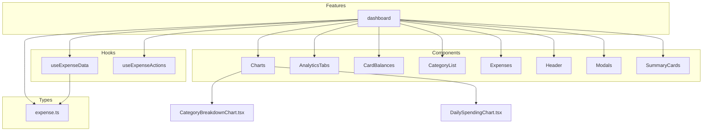
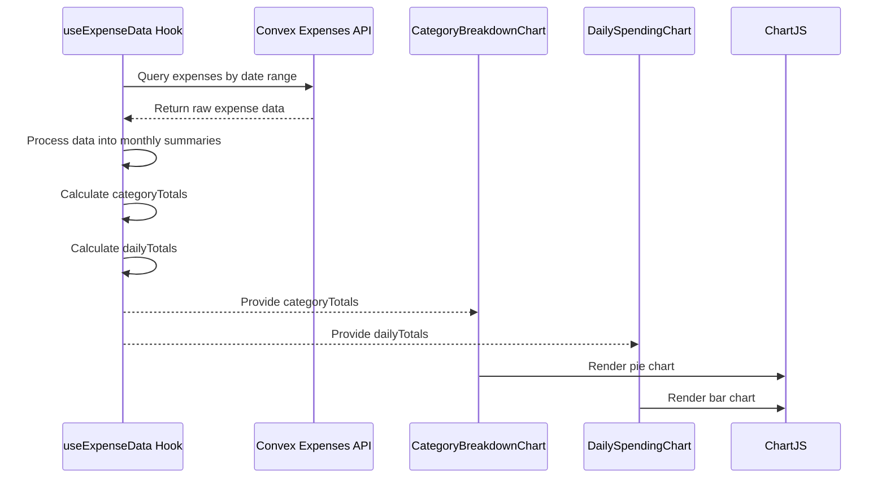
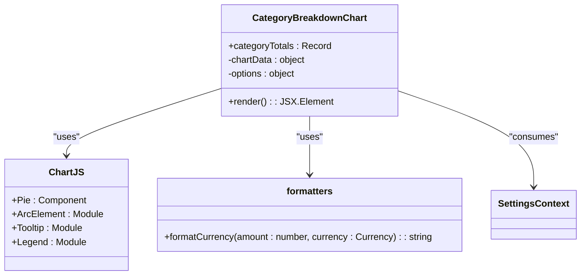
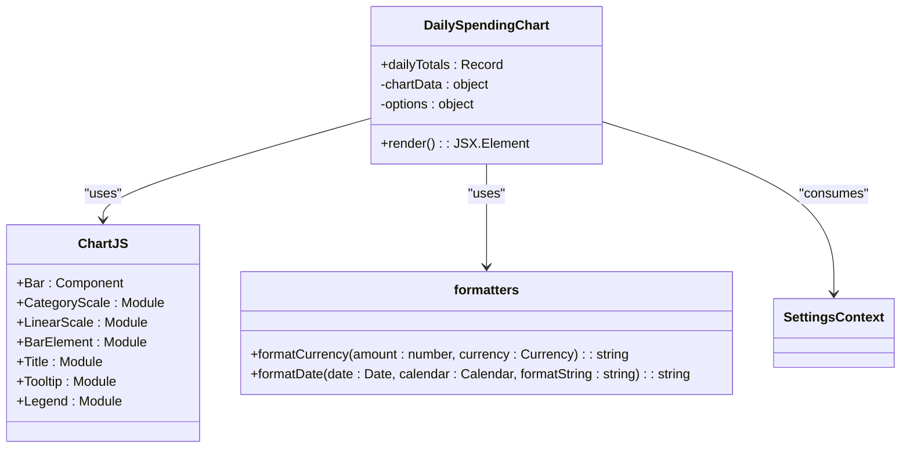
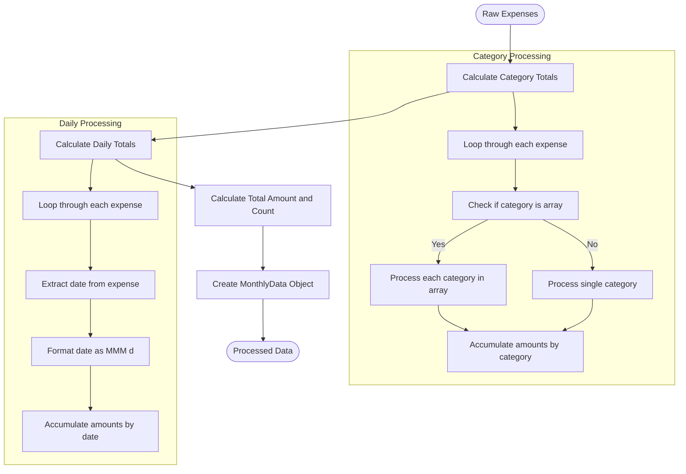
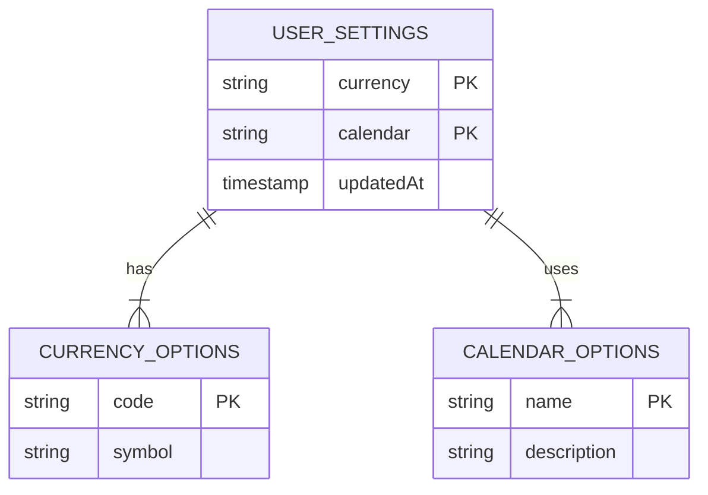
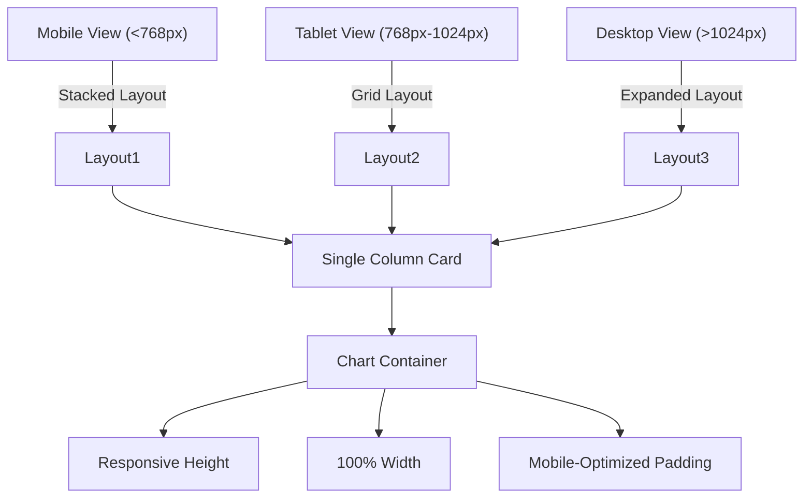
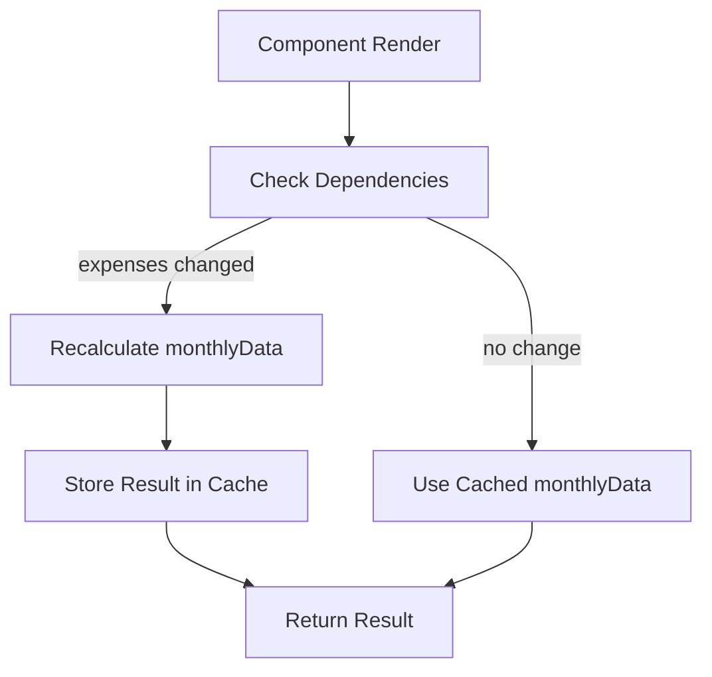

# Dashboard Component - Charts

<cite>
**Referenced Files in This Document**   
- [CategoryBreakdownChart.tsx](file://src/features/dashboard/components/Charts/CategoryBreakdownChart.tsx)
- [DailySpendingChart.tsx](file://src/features/dashboard/components/Charts/DailySpendingChart.tsx)
- [useExpenseData.ts](file://src/features/dashboard/hooks/useExpenseData.ts)
- [expense.ts](file://src/features/dashboard/types/expense.ts)
- [SettingsContext.tsx](file://src/contexts/SettingsContext.tsx)
- [formatters.ts](file://src/lib/formatters.ts)
- [globals.css](file://src/app/globals.css)
</cite>

## Table of Contents
1. [Introduction](#introduction)
2. [Project Structure](#project-structure)
3. [Core Components](#core-components)
4. [Architecture Overview](#architecture-overview)
5. [Detailed Component Analysis](#detailed-component-analysis)
6. [Data Transformation and Processing](#data-transformation-and-processing)
7. [Configuration and User Preferences](#configuration-and-user-preferences)
8. [Responsive Design and Mobile-First Approach](#responsive-design-and-mobile-first-approach)
9. [Performance Considerations](#performance-considerations)
10. [Extensibility and Integration](#extensibility-and-integration)

## Introduction
The Charts module in the Expense Tracker application provides visual insights into spending patterns through two primary components: CategoryBreakdownChart and DailySpendingChart. These components leverage Chart.js for data visualization, transforming raw expense data into meaningful graphical representations. The module is designed with a mobile-first approach, ensuring optimal display across devices while incorporating user preferences for currency and calendar systems. This documentation provides a comprehensive analysis of the implementation, data flow, configuration options, and performance characteristics of the Charts module.

## Project Structure
The Charts module is organized within the feature-based architecture of the application, specifically under the dashboard feature. The components are structured in a modular fashion, with clear separation of concerns between data fetching, processing, and visualization.

**Diagram sources**
- [CategoryBreakdownChart.tsx](file://src/features/dashboard/components/Charts/CategoryBreakdownChart.tsx)
- [DailySpendingChart.tsx](file://src/features/dashboard/components/Charts/DailySpendingChart.tsx)
- [useExpenseData.ts](file://src/features/dashboard/hooks/useExpenseData.ts)
- [expense.ts](file://src/features/dashboard/types/expense.ts)

**Section sources**
- [CategoryBreakdownChart.tsx](file://src/features/dashboard/components/Charts/CategoryBreakdownChart.tsx)
- [DailySpendingChart.tsx](file://src/features/dashboard/components/Charts/DailySpendingChart.tsx)
- [useExpenseData.ts](file://src/features/dashboard/hooks/useExpenseData.ts)
- [expense.ts](file://src/features/dashboard/types/expense.ts)

## Core Components
The Charts module consists of two primary visualization components that serve distinct analytical purposes. The CategoryBreakdownChart displays the distribution of expenses across different categories using a pie chart, while the DailySpendingChart tracks expenditure trends over time with a bar chart. Both components are designed to be reusable, accepting processed data as props and handling empty states gracefully.

**Section sources**
- [CategoryBreakdownChart.tsx](file://src/features/dashboard/components/Charts/CategoryBreakdownChart.tsx)
- [DailySpendingChart.tsx](file://src/features/dashboard/components/Charts/DailySpendingChart.tsx)

## Architecture Overview
The Charts module follows a clean architecture pattern with clear separation between data fetching, processing, and presentation layers. The data flow begins with the useExpenseData hook, which retrieves raw expense data from the Convex backend, processes it into chart-ready formats, and provides it to the chart components.

**Diagram sources**
- [useExpenseData.ts](file://src/features/dashboard/hooks/useExpenseData.ts)
- [CategoryBreakdownChart.tsx](file://src/features/dashboard/components/Charts/CategoryBreakdownChart.tsx)
- [DailySpendingChart.tsx](file://src/features/dashboard/components/Charts/DailySpendingChart.tsx)

## Detailed Component Analysis

### CategoryBreakdownChart Analysis
The CategoryBreakdownChart component visualizes the distribution of expenses across different spending categories using a pie chart from Chart.js. It accepts category totals as input and renders an interactive visualization with tooltips and legends.

**Diagram sources**
- [CategoryBreakdownChart.tsx](file://src/features/dashboard/components/Charts/CategoryBreakdownChart.tsx)

**Section sources**
- [CategoryBreakdownChart.tsx](file://src/features/dashboard/components/Charts/CategoryBreakdownChart.tsx)

### DailySpendingChart Analysis
The DailySpendingChart component tracks daily expenditure trends over time using a bar chart from Chart.js. It displays daily spending amounts with proper formatting based on user preferences for currency and calendar systems.

**Diagram sources**
- [DailySpendingChart.tsx](file://src/features/dashboard/components/Charts/DailySpendingChart.tsx)

**Section sources**
- [DailySpendingChart.tsx](file://src/features/dashboard/components/Charts/DailySpendingChart.tsx)

## Data Transformation and Processing
The transformation of raw expense data into chart-ready formats is handled by the useExpenseData hook, which implements efficient data processing using React's useMemo hook to prevent unnecessary recalculations.

**Diagram sources**
- [useExpenseData.ts](file://src/features/dashboard/hooks/useExpenseData.ts)

**Section sources**
- [useExpenseData.ts](file://src/features/dashboard/hooks/useExpenseData.ts)
- [expense.ts](file://src/features/dashboard/types/expense.ts)

## Configuration and User Preferences
The chart components respect user preferences for currency and calendar systems, which are managed through the SettingsContext. These preferences affect how data is formatted in tooltips, labels, and axes.

### Currency Configuration
The application supports multiple currencies (USD, EUR, GBP, IRR) with corresponding symbols. The formatCurrency function in formatters.ts handles the conversion of numeric amounts to properly formatted strings based on the user's selected currency.

### Calendar System Configuration
Users can choose between Gregorian and Jalali calendar systems. The DailySpendingChart component uses the formatDate function to display dates according to the selected calendar system, ensuring cultural relevance for users in different regions.

**Diagram sources**
- [SettingsContext.tsx](file://src/contexts/SettingsContext.tsx)
- [formatters.ts](file://src/lib/formatters.ts)
- [schema.ts](file://convex/schema.ts)

**Section sources**
- [SettingsContext.tsx](file://src/contexts/SettingsContext.tsx)
- [formatters.ts](file://src/lib/formatters.ts)

## Responsive Design and Mobile-First Approach
The chart components are designed with a mobile-first approach, ensuring optimal display on smaller screens while maintaining responsiveness across all device sizes.

### Layout and Styling
The components use Tailwind CSS for styling, with responsive classes that adapt to different screen sizes. The charts are contained within cards with consistent padding and shadows, providing a clean and modern appearance.

### Responsive Features
- Fixed height containers that scale appropriately on mobile devices
- Touch-friendly interactive elements with sufficient tap targets
- Optimized legend positioning for small screens (bottom-aligned)
- Properly sized fonts and spacing for mobile readability

**Diagram sources**
- [globals.css](file://src/app/globals.css)
- [CategoryBreakdownChart.tsx](file://src/features/dashboard/components/Charts/CategoryBreakdownChart.tsx)
- [DailySpendingChart.tsx](file://src/features/dashboard/components/Charts/DailySpendingChart.tsx)

**Section sources**
- [globals.css](file://src/app/globals.css)
- [CategoryBreakdownChart.tsx](file://src/features/dashboard/components/Charts/CategoryBreakdownChart.tsx)
- [DailySpendingChart.tsx](file://src/features/dashboard/components/Charts/DailySpendingChart.tsx)

## Performance Considerations
The Charts module implements several performance optimizations to ensure smooth rendering and efficient data processing, particularly important when dealing with large datasets.

### Data Processing Optimization
The useExpenseData hook uses React's useMemo hook to memoize the processed monthly data, preventing expensive recalculations on every render. The monthlyData object is only recomputed when the underlying expenses array changes.

**Diagram sources**
- [useExpenseData.ts](file://src/features/dashboard/hooks/useExpenseData.ts)

### Efficient Re-rendering
Both chart components benefit from React's reconciliation algorithm and the memoization of their data processing. The use of functional components with props ensures that updates only occur when necessary.

### Data Sampling for Large Datasets
While not explicitly implemented in the current code, the architecture supports data sampling for large datasets by:
- Limiting the date range of fetched expenses to the current month
- Processing only the necessary data for visualization
- Using efficient reduce operations for data aggregation

**Section sources**
- [useExpenseData.ts](file://src/features/dashboard/hooks/useExpenseData.ts)
- [CategoryBreakdownChart.tsx](file://src/features/dashboard/components/Charts/CategoryBreakdownChart.tsx)
- [DailySpendingChart.tsx](file://src/features/dashboard/components/Charts/DailySpendingChart.tsx)

## Extensibility and Integration

### Adding New Chart Types
The modular architecture makes it easy to add new chart types. To create a new chart component:

1. Create a new component file in the Charts directory
2. Import the necessary Chart.js components
3. Define the component with appropriate props
4. Implement data transformation and chart configuration
5. Export the component in the index.ts file

### Integrating Third-Party Visualization Libraries
The current implementation uses Chart.js via react-chartjs-2, but the architecture allows for integration with other visualization libraries such as D3.js, Recharts, or Victory. The key is to maintain the separation between data processing and visualization, allowing the useExpenseData hook to provide data to any visualization component.

### Customization Options
The chart components support various configuration options that can be extended:

- **Color Schemes**: Currently hardcoded, but could be made configurable through user settings
- **Tooltip Behavior**: Custom callbacks format currency based on user preferences
- **Date Range Filtering**: Handled by the useExpenseData hook's month navigation functions
- **Animation**: Utilizes framer-motion for entrance animations with configurable delays

**Section sources**
- [CategoryBreakdownChart.tsx](file://src/features/dashboard/components/Charts/CategoryBreakdownChart.tsx)
- [DailySpendingChart.tsx](file://src/features/dashboard/components/Charts/DailySpendingChart.tsx)
- [useExpenseData.ts](file://src/features/dashboard/hooks/useExpenseData.ts)
- [index.ts](file://src/features/dashboard/components/Charts/index.ts)