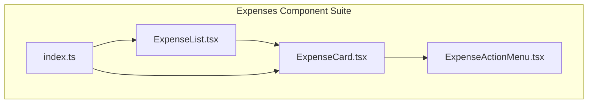
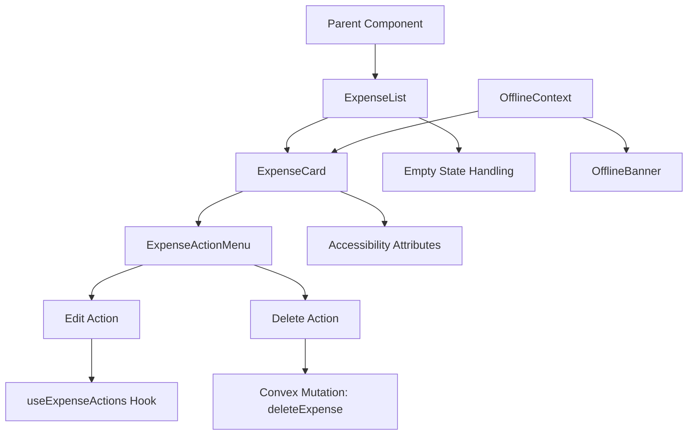
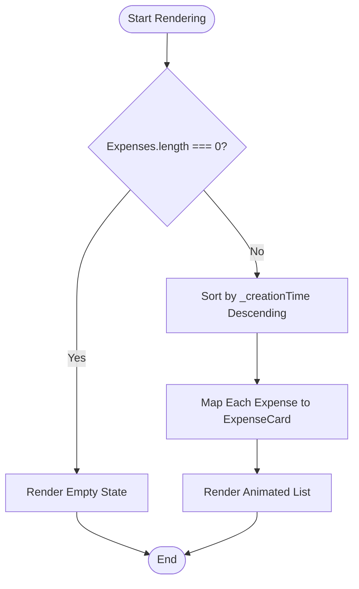
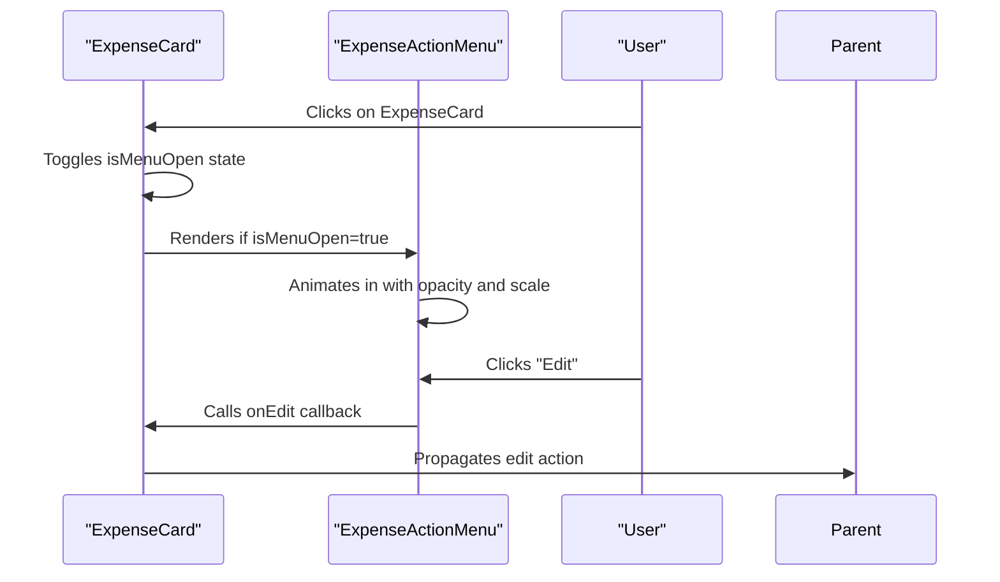
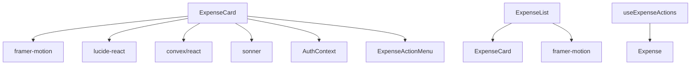

# Dashboard Component - Expenses List

<cite>
**Referenced Files in This Document**   
- [ExpenseList.tsx](file://src/features/dashboard/components/Expenses/ExpenseList.tsx)
- [ExpenseCard.tsx](file://src/features/dashboard/components/Expenses/ExpenseCard.tsx)
- [ExpenseActionMenu.tsx](file://src/features/dashboard/components/Expenses/ExpenseActionMenu.tsx)
- [useExpenseActions.ts](file://src/features/dashboard/hooks/useExpenseActions.ts)
- [index.ts](file://src/features/dashboard/components/Expenses/index.ts)
- [useExpenseData.ts](file://src/features/dashboard/hooks/useExpenseData.ts)
- [OfflineContext.tsx](file://src/contexts/OfflineContext.tsx)
- [OfflineBanner.tsx](file://src/components/OfflineBanner.tsx)
- [expense.ts](file://src/features/dashboard/types/expense.ts)
</cite>

## Table of Contents
1. [Introduction](#introduction)
2. [Project Structure](#project-structure)
3. [Core Components](#core-components)
4. [Architecture Overview](#architecture-overview)
5. [Detailed Component Analysis](#detailed-component-analysis)
6. [Dependency Analysis](#dependency-analysis)
7. [Performance Considerations](#performance-considerations)
8. [Troubleshooting Guide](#troubleshooting-guide)
9. [Conclusion](#conclusion)

## Introduction
The Expenses component suite in the Expense Tracker application provides a user interface for viewing, editing, and deleting recent expenses. Built using React with Next.js and Convex as the backend, this component suite emphasizes usability, accessibility, and offline functionality. The system renders a scrollable list of expenses through the `ExpenseList` component, which composes individual `ExpenseCard` components. Each card supports interaction via an action menu for editing or deletion, with robust error handling and offline mutation support. This document details the architecture, functionality, and extensibility of the Expenses component suite.

## Project Structure
The Expenses components are organized within a feature-based directory structure under `src/features/dashboard/components/Expenses/`. This modular approach groups related UI components and facilitates reusability across the application. The core files include `ExpenseCard.tsx`, `ExpenseList.tsx`, and `ExpenseActionMenu.tsx`, along with an `index.ts` file that enables clean imports.



**Diagram sources**
- [ExpenseList.tsx](file://src/features/dashboard/components/Expenses/ExpenseList.tsx)
- [ExpenseCard.tsx](file://src/features/dashboard/components/Expenses/ExpenseCard.tsx)
- [ExpenseActionMenu.tsx](file://src/features/dashboard/components/Expenses/ExpenseActionMenu.tsx)
- [index.ts](file://src/features/dashboard/components/Expenses/index.ts)

**Section sources**
- [ExpenseList.tsx](file://src/features/dashboard/components/Expenses/ExpenseList.tsx)
- [ExpenseCard.tsx](file://src/features/dashboard/components/Expenses/ExpenseCard.tsx)
- [ExpenseActionMenu.tsx](file://src/features/dashboard/components/Expenses/ExpenseActionMenu.tsx)
- [index.ts](file://src/features/dashboard/components/Expenses/index.ts)

## Core Components
The Expenses component suite consists of three primary components: `ExpenseList`, `ExpenseCard`, and `ExpenseActionMenu`. These components work together to display a scrollable list of expenses, allow user interactions, and manage state changes. The `ExpenseList` component receives an array of expense objects and maps them into `ExpenseCard` instances. Each `ExpenseCard` displays key details such as title, amount, category, and date, while also handling click events to reveal an `ExpenseActionMenu` for editing or deletion.

**Section sources**
- [ExpenseList.tsx](file://src/features/dashboard/components/Expenses/ExpenseList.tsx#L0-L38)
- [ExpenseCard.tsx](file://src/features/dashboard/components/Expenses/ExpenseCard.tsx#L0-L110)
- [ExpenseActionMenu.tsx](file://src/features/dashboard/components/Expenses/ExpenseActionMenu.tsx#L0-L37)

## Architecture Overview
The Expenses component suite follows a hierarchical composition pattern where higher-level components delegate rendering and interaction logic to lower-level ones. Data flows from the parent `ExpenseList` down to each `ExpenseCard`, which in turn manages its own state for menu visibility. Actions like edit and delete are handled through callback functions passed as props, ensuring separation of concerns. The architecture integrates with Convex for data mutations and uses React hooks such as `useMutation` and `useQuery` for state management.



**Diagram sources**
- [ExpenseList.tsx](file://src/features/dashboard/components/Expenses/ExpenseList.tsx)
- [ExpenseCard.tsx](file://src/features/dashboard/components/Expenses/ExpenseCard.tsx)
- [ExpenseActionMenu.tsx](file://src/features/dashboard/components/Expenses/ExpenseActionMenu.tsx)
- [useExpenseActions.ts](file://src/features/dashboard/hooks/useExpenseActions.ts)
- [OfflineContext.tsx](file://src/contexts/OfflineContext.tsx)

## Detailed Component Analysis

### ExpenseList Component
The `ExpenseList` component is responsible for rendering a scrollable list of expenses. It accepts an array of `Expense` objects and two callback functions: `onEdit` and `onDeleteSuccess`. When the expense list is empty, it displays a placeholder message with a receipt icon. Otherwise, it sorts the expenses by creation time in descending order and maps each one to an `ExpenseCard`.



**Diagram sources**
- [ExpenseList.tsx](file://src/features/dashboard/components/Expenses/ExpenseList.tsx#L0-L38)

**Section sources**
- [ExpenseList.tsx](file://src/features/dashboard/components/Expenses/ExpenseList.tsx#L0-L38)

### ExpenseCard Component
The `ExpenseCard` component displays individual expense details and manages user interactions. It uses the `useState` and `useRef` hooks to control the visibility of the action menu and detect clicks outside the card. The card is interactive, responding to clicks by toggling the action menu. Accessibility is enhanced with `aria-label` attributes that describe the expense content for screen readers.

```mermaid
classDiagram
class ExpenseCard {
+expense : Expense
+onEdit(expense : Expense)
+onDeleteSuccess(expenseId : Id<"expenses">)
-isMenuOpen : boolean
-cardRef : RefObject~HTMLDivElement~
-handleClickOutside(event : MouseEvent)
-handleCardClick()
-handleEdit()
-handleDelete()
}
ExpenseCard --> ExpenseActionMenu : "conditionally renders"
ExpenseCard --> "framer-motion" : "uses for animation"
ExpenseCard --> "convex/react" : "uses useMutation"
```

**Diagram sources**
- [ExpenseCard.tsx](file://src/features/dashboard/components/Expenses/ExpenseCard.tsx#L0-L110)

**Section sources**
- [ExpenseCard.tsx](file://src/features/dashboard/components/Expenses/ExpenseCard.tsx#L0-L110)

### ExpenseActionMenu Component
The `ExpenseActionMenu` provides a dropdown menu with Edit and Delete options when triggered from an `ExpenseCard`. It uses `framer-motion` for smooth entrance and exit animations. The menu is positioned absolutely relative to the card and prevents event bubbling to avoid immediate closure upon click.



**Diagram sources**
- [ExpenseActionMenu.tsx](file://src/features/dashboard/components/Expenses/ExpenseActionMenu.tsx#L0-L37)

**Section sources**
- [ExpenseActionMenu.tsx](file://src/features/dashboard/components/Expenses/ExpenseActionMenu.tsx#L0-L37)

## Dependency Analysis
The Expenses component suite depends on several internal and external modules. It imports UI animation utilities from `framer-motion`, icons from `lucide-react`, and toast notifications from `sonner`. For data management, it uses Convex's `useMutation` and `useQuery` hooks to interact with the backend. The `useAuth` context provides authentication tokens required for secure API calls.



**Diagram sources**
- [ExpenseCard.tsx](file://src/features/dashboard/components/Expenses/ExpenseCard.tsx#L0-L110)
- [ExpenseList.tsx](file://src/features/dashboard/components/Expenses/ExpenseList.tsx#L0-L38)
- [useExpenseActions.ts](file://src/features/dashboard/hooks/useExpenseActions.ts#L0-L16)

**Section sources**
- [ExpenseCard.tsx](file://src/features/dashboard/components/Expenses/ExpenseCard.tsx#L0-L110)
- [ExpenseList.tsx](file://src/features/dashboard/components/Expenses/ExpenseList.tsx#L0-L38)
- [useExpenseActions.ts](file://src/features/dashboard/hooks/useExpenseActions.ts#L0-L16)

## Performance Considerations
The current implementation does not include virtualization for large expense lists, meaning all items are rendered simultaneously. While suitable for small datasets, this could impact performance with hundreds of expenses. Future improvements could integrate libraries like `react-window` or `virtuoso` to render only visible items. Additionally, the use of `AnimatePresence` from `framer-motion` ensures smooth transitions without unnecessary re-renders.

The `useDebounce` hook is available in the codebase and could be applied to filter or search inputs if added later. Sorting occurs client-side using JavaScript’s native `sort()` method, which has O(n log n) complexity—acceptable for moderate data sizes.

## Troubleshooting Guide
Common issues in the Expenses component suite include failed deletions due to authentication errors and offline synchronization problems. The application uses `toast` notifications to inform users of success or failure states. For example, attempting to delete an expense without a valid token triggers a "Authentication required to delete" message.

Offline handling is managed through the `OfflineContext`, which queues mutations when connectivity is lost. The `OfflineBanner` component visually indicates offline status and shows the number of pending expenses. Developers should ensure that all mutation calls check the `token` presence and handle rejection gracefully.

**Section sources**
- [ExpenseCard.tsx](file://src/features/dashboard/components/Expenses/ExpenseCard.tsx#L0-L110)
- [OfflineContext.tsx](file://src/contexts/OfflineContext.tsx#L0-L170)
- [OfflineBanner.tsx](file://src/components/OfflineBanner.tsx#L0-L25)

## Conclusion
The Expenses component suite effectively renders a scrollable list of recent expenses using reusable, well-structured React components. It integrates seamlessly with Convex for data operations and supports offline mutations through local storage and background sync. Accessibility is prioritized with proper ARIA labels, and user feedback is provided via toast notifications. While virtualization is not currently implemented, the architecture allows for future enhancements such as custom card layouts, extended actions (e.g., duplication), and AI-driven categorization suggestions. The modular design via `index.ts` exports promotes clean imports and maintainability across the codebase.