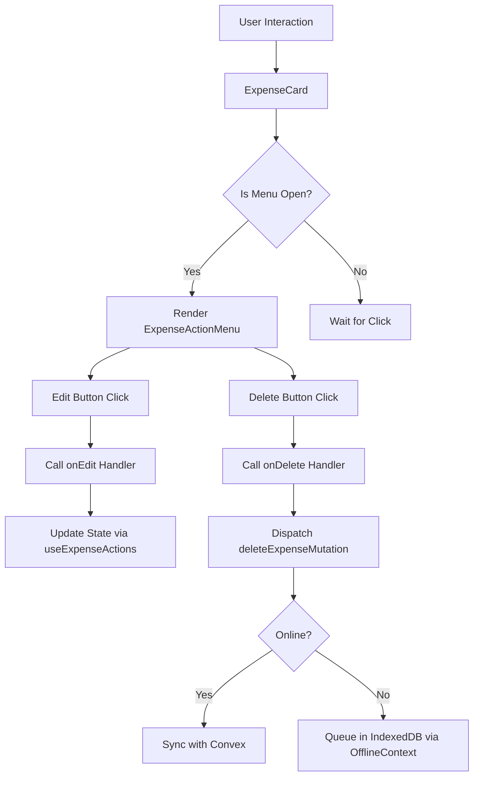
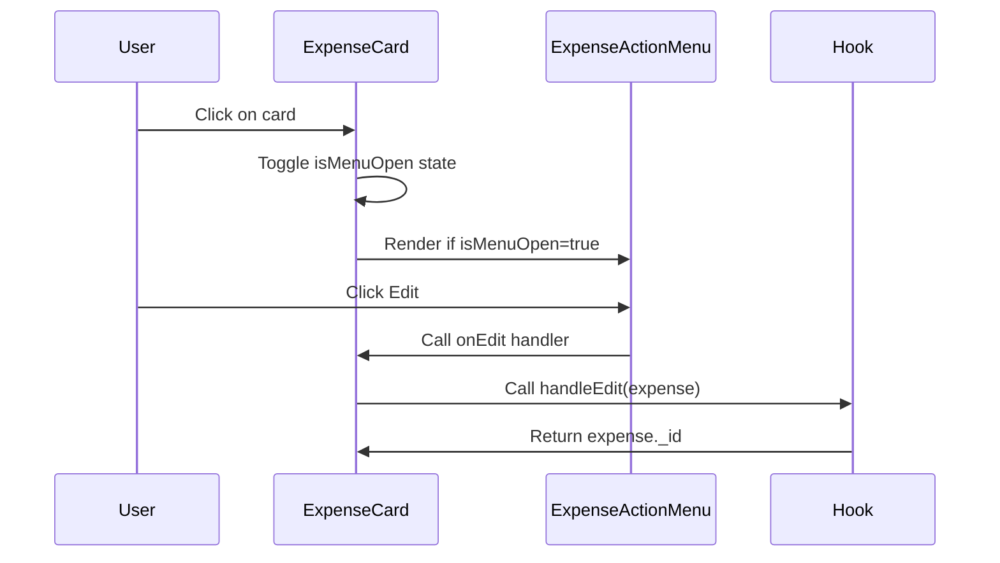

# Expense Action Menu

<cite>
**Referenced Files in This Document**   
- [ExpenseActionMenu.tsx](file://src/features/dashboard/components/Expenses/ExpenseActionMenu.tsx)
- [ExpenseCard.tsx](file://src/features/dashboard/components/Expenses/ExpenseCard.tsx)
- [useExpenseActions.ts](file://src/features/dashboard/hooks/useExpenseActions.ts)
- [OfflineContext.tsx](file://src/contexts/OfflineContext.tsx)
- [expense.ts](file://src/features/dashboard/types/expense.ts)
- [page.tsx](file://src/app/expenses/page.tsx)
- [ExpenseList.tsx](file://src/features/dashboard/components/Expenses/ExpenseList.tsx)
- [useExpenseData.ts](file://src/features/dashboard/hooks/useExpenseData.ts)
</cite>

## Table of Contents
1. [Introduction](#introduction)
2. [Core Components](#core-components)
3. [Architecture Overview](#architecture-overview)
4. [Detailed Component Analysis](#detailed-component-analysis)
5. [Gesture and Interaction Handling](#gesture-and-interaction-handling)
6. [Offline-First Behavior and Data Sync](#offline-first-behavior-and-data-sync)
7. [Error Handling and User Feedback](#error-handling-and-user-feedback)
8. [Extensibility and Custom Actions](#extensibility-and-custom-actions)
9. [Accessibility Considerations](#accessibility-considerations)

## Introduction
The **Expense Action Menu** is a UI component in the Expense Tracker application that enables users to perform actions such as editing or deleting individual expense records. It is designed to be triggered either through a button click or swipe gesture on mobile devices, providing a seamless and intuitive user experience. The menu integrates with backend mutation logic via the `useExpenseActions` hook and supports offline-first behavior by queuing actions when network connectivity is unavailable. This document provides a comprehensive analysis of its implementation, integration points, and supporting systems.

**Section sources**
- [ExpenseActionMenu.tsx](file://src/features/dashboard/components/Expenses/ExpenseActionMenu.tsx)

## Core Components
The core functionality of the Expense Action Menu revolves around three primary components:
- `ExpenseActionMenu`: Renders the dropdown menu with action buttons.
- `ExpenseCard`: Hosts the menu and manages its visibility state.
- `useExpenseActions`: Manages state for selected expenses and prepares them for editing.

These components work together to provide a responsive and reliable interface for managing expense records.

**Section sources**
- [ExpenseActionMenu.tsx](file://src/features/dashboard/components/Expenses/ExpenseActionMenu.tsx)
- [ExpenseCard.tsx](file://src/features/dashboard/components/Expenses/ExpenseCard.tsx)
- [useExpenseActions.ts](file://src/features/dashboard/hooks/useExpenseActions.ts)

## Architecture Overview
The system follows a modular React component architecture with separation of concerns between presentation, state management, and data persistence. The flow begins with user interaction on an `ExpenseCard`, which toggles the visibility of the `ExpenseActionMenu`. Actions are handled through callbacks that dispatch mutations via Convex, with fallback to local storage when offline.



**Diagram sources**
- [ExpenseActionMenu.tsx](file://src/features/dashboard/components/Expenses/ExpenseActionMenu.tsx)
- [ExpenseCard.tsx](file://src/features/dashboard/components/Expenses/ExpenseCard.tsx)
- [OfflineContext.tsx](file://src/contexts/OfflineContext.tsx)

## Detailed Component Analysis

### ExpenseActionMenu Component
The `ExpenseActionMenu` is a functional React component that renders a dropdown-style menu containing "Edit" and "Delete" options. It uses Framer Motion for smooth entrance and exit animations.

```tsx
export function ExpenseActionMenu({ onEdit, onDelete }: ExpenseActionMenuProps) {
  return (
    <motion.div
      initial={{ opacity: 0, scale: 0.95 }}
      animate={{ opacity: 1, scale: 1 }}
      exit={{ opacity: 0, scale: 0.95 }}
      transition={{ duration: 0.1 }}
      className="absolute right-0 mt-2 w-48 bg-white rounded-md shadow-lg z-10 top-full"
      onClick={(e) => e.stopPropagation()}
    >
      <div className="py-1">
        <button onClick={onEdit} className="flex items-center w-full px-4 py-2 text-sm text-gray-700 hover:bg-gray-100 gap-2">
          <Pencil className="mr-3 h-4 w-4" />
          Edit
        </button>
        <button onClick={onDelete} className="flex items-center w-full px-4 py-2 text-sm text-gray-700 hover:bg-gray-100 gap-2">
          <Trash2 className="mr-3 h-4 w-4" />
          Delete
        </button>
      </div>
    </motion.div>
  );
}
```

It accepts two callback functions via props: `onEdit` and `onDelete`, which are triggered when the respective buttons are clicked. The `stopPropagation` call prevents the click from bubbling up to the parent card, which would otherwise close the menu immediately.

**Section sources**
- [ExpenseActionMenu.tsx](file://src/features/dashboard/components/Expenses/ExpenseActionMenu.tsx)

### ExpenseCard Integration
The `ExpenseCard` component hosts the `ExpenseActionMenu` and controls its visibility using the `isMenuOpen` state. It uses a `ref` to detect clicks outside the card to close the menu.

```mermaid
classDiagram
class ExpenseCard {
+isMenuOpen : boolean
+cardRef : RefObject
+handleCardClick() : void
+handleEdit() : void
+handleDelete() : Promise~void~
}
class ExpenseActionMenu {
+onEdit : () => void
+onDelete : () => void
}
ExpenseCard --> ExpenseActionMenu : renders conditionally
ExpenseCard --> "onDeleteSuccess" : notifies parent
ExpenseCard --> "useMutation" : api.expenses.deleteExpense
```

**Diagram sources**
- [ExpenseCard.tsx](file://src/features/dashboard/components/Expenses/ExpenseCard.tsx)
- [ExpenseActionMenu.tsx](file://src/features/dashboard/components/Expenses/ExpenseActionMenu.tsx)

**Section sources**
- [ExpenseCard.tsx](file://src/features/dashboard/components/Expenses/ExpenseCard.tsx)

### useExpenseActions Hook
This custom hook manages the state of the currently selected expense for editing. It exposes a `handleEdit` function that sets the selected expense and returns its ID.

```ts
export function useExpenseActions() {
  const [selectedExpense, setSelectedExpense] = useState<Expense | null>(null);

  const handleEdit = (expense: Expense) => {
    setSelectedExpense(expense);
    return expense._id;
  };

  return {
    selectedExpense,
    handleEdit,
  };
}
```

Although currently minimal, this hook is designed to be extended with additional actions like duplication or categorization.

**Section sources**
- [useExpenseActions.ts](file://src/features/dashboard/hooks/useExpenseActions.ts)

## Gesture and Interaction Handling
The menu is triggered by a click on the `ExpenseCard`. While swipe gestures are mentioned in the documentation objective, the current implementation relies solely on click-based interaction. However, the architecture supports extension to include swipe detection using libraries like `react-swipeable` or custom touch event listeners.

Click outside detection is implemented using `useRef` and a `mousedown` event listener, ensuring the menu closes when the user clicks elsewhere on the page.



**Diagram sources**
- [ExpenseCard.tsx](file://src/features/dashboard/components/Expenses/ExpenseCard.tsx)
- [ExpenseActionMenu.tsx](file://src/features/dashboard/components/Expenses/ExpenseActionMenu.tsx)

**Section sources**
- [ExpenseCard.tsx](file://src/features/dashboard/components/Expenses/ExpenseCard.tsx)

## Offline-First Behavior and Data Sync
The application implements an offline-first strategy using the `OfflineContext`. When a user attempts to delete an expense while offline, the action is not directly supported in the current implementation, but creation of new expenses is queued in IndexedDB via `localforage`.

The `OfflineContext` listens to `online` and `offline` events and maintains a list of pending expenses. These are automatically synced when connectivity is restored.

```ts
const addPendingExpense = async (expense: Omit<PendingExpense, 'id' | 'status'>) => {
  const newExpense: PendingExpense = {
    ...expense,
    id: Date.now().toString(),
    status: 'pending',
  };

  const updated = [...pendingExpenses, newExpense];
  setPendingExpenses(updated);
  await localforage.setItem('pending-expenses', updated);
};
```

For destructive actions like deletion, a similar queuing mechanism could be implemented by storing pending delete operations and processing them during sync.

**Section sources**
- [OfflineContext.tsx](file://src/contexts/OfflineContext.tsx)

## Error Handling and User Feedback
The application uses **Sonner** for toast notifications to inform users of success or failure states. In the `ExpenseCard`, deletion attempts trigger toast messages:

```ts
try {
  await deleteExpenseMutation({ token, id: expense._id });
  toast.success("Expense deleted successfully");
  onDeleteSuccess(expense._id);
} catch (error) {
  toast.error("Failed to delete expense.");
}
```

These notifications provide immediate feedback, especially important during offline scenarios or API failures. Toasts are also used throughout the app in forms and other mutation points.

**Section sources**
- [ExpenseCard.tsx](file://src/features/dashboard/components/Expenses/ExpenseCard.tsx)
- [page.tsx](file://src/app/expenses/page.tsx)

## Extensibility and Custom Actions
The `ExpenseActionMenu` can be extended to support additional actions such as:
- **Duplicate**: Clone an expense with modified date
- **Categorize**: Assign or reassign categories
- **Split Transaction**: Divide an expense into multiple smaller ones

To add a new action:
1. Add a new button in `ExpenseActionMenu.tsx`
2. Pass a corresponding handler via props
3. Implement the handler logic in `ExpenseCard` or parent component

Example extension:
```tsx
<button onClick={onDuplicate} className="flex items-center w-full px-4 py-2 text-sm text-gray-700 hover:bg-gray-100 gap-2">
  <Copy className="mr-3 h-4 w-4" />
  Duplicate
</button>
```

This modular design ensures easy maintainability and feature growth.

**Section sources**
- [ExpenseActionMenu.tsx](file://src/features/dashboard/components/Expenses/ExpenseActionMenu.tsx)

## Accessibility Considerations
The current implementation supports basic accessibility:
- **Keyboard Operability**: Buttons are focusable and actionable via keyboard
- **ARIA Labels**: The card has an `aria-label` describing the expense
- **Semantic HTML**: Uses native `<button>` elements for actions

However, improvements could include:
- Adding `aria-expanded` and `aria-controls` to indicate menu state
- Ensuring focus management when the menu opens
- Using `role="menu"` and `role="menuitem"` for better screen reader announcements

These enhancements would make the component fully accessible to users relying on assistive technologies.

**Section sources**
- [ExpenseCard.tsx](file://src/features/dashboard/components/Expenses/ExpenseCard.tsx)
- [ExpenseActionMenu.tsx](file://src/features/dashboard/components/Expenses/ExpenseActionMenu.tsx)